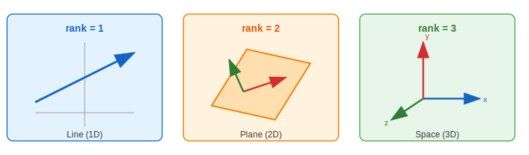
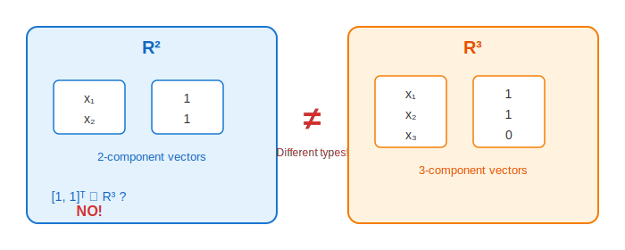

:::note
本系列文章內容參考自經典教材 **Elementary Linear Algebra (Pearson New International Edition)**。本文對應章節：**Ch1-4 Gaussian Elimination**。
:::

## **高斯消去法 (Gaussian Elimination)**

### **什麼是高斯消去法？**

**高斯消去法 (Gaussian Elimination)** 是一種系統性的演算法，用於將任意矩陣轉換成**簡化列梯形式 (Reduced Row Echelon Form, RREF)**。

在上一篇中，我們學到了 REF 和 RREF 的定義，但沒有詳細說明「如何」將矩陣轉換成這些形式。高斯消去法就是這個「如何」的答案——它提供了一套明確的步驟，讓我們可以機械化地完成這個轉換。

### **演算法概覽**

高斯消去法分為兩個階段：

|       階段        |   名稱   | 目標                 |   步驟   |
| :---------------: | :------: | :------------------- | :------: |
| **Forward Pass**  | 前向消去 | 將矩陣化為 **REF**   | Step 1-4 |
| **Backward Pass** | 後向消去 | 將 REF 化為 **RREF** | Step 5-6 |

 

## **Forward Pass：前向消去 (Step 1-4)**

### **Step 1：找出 Pivot Column 與 Pivot Position**

從矩陣的**最左邊**開始，找出第一個**非全零的 column**，這個 column 稱為 **Pivot Column（主元行）**。

在這個 pivot column 中，**第一列**的位置稱為 **Pivot Position（主元位置）**。

$$
[A \mid \mathbf{b}] = \left[\begin{array}{cccccc|c} 0 & \fcolorbox{orange}{lightyellow}{0} & 2 & -4 & -5 & 2 & 5 \\ 0 & \fcolorbox{orange}{lightyellow}{1} & -1 & 1 & 3 & 1 & -1 \\ 0 & \fcolorbox{orange}{lightyellow}{6} & 0 & -6 & 5 & 16 & 7 \end{array}\right]
$$

在這個例子中，第一個 column 全為 $0$，所以第二個 column 是 pivot column，而位置 $(1, 2)$ 是 pivot position。

### **Step 2：Row Interchange（列交換）**

如果 pivot position 的元素是 $0$，則在 pivot column 中選擇一個**非零元素**所在的列，與第一列交換，使得 pivot position 變成非零。

$$
\left[\begin{array}{cccccc|c} 0 & \fcolorbox{red}{mistyrose}{0} & 2 & -4 & -5 & 2 & 5 \\ 0 & \fcolorbox{red}{mistyrose}{1} & -1 & 1 & 3 & 1 & -1 \\ 0 & 6 & 0 & -6 & 5 & 16 & 7 \end{array}\right] \xrightarrow{R_1 \leftrightarrow R_2} \left[\begin{array}{cccccc|c} 0 & \fcolorbox{orange}{lightyellow}{1} & -1 & 1 & 3 & 1 & -1 \\ 0 & \fcolorbox{orange}{lightyellow}{0} & 2 & -4 & -5 & 2 & 5 \\ 0 & 6 & 0 & -6 & 5 & 16 & 7 \end{array}\right]
$$

### **Step 3：消去 Pivot 下方的元素**

將 pivot position 所在列的適當倍數，加到**下方**的每一列，使得 pivot position **下方**的所有元素都變成 $0$。

$$
\left[\begin{array}{cccccc|c} 0 & \fcolorbox{blue}{lightcyan}{1} & -1 & 1 & 3 & 1 & -1 \\ 0 & 0 & 2 & -4 & -5 & 2 & 5 \\ 0 & \fcolorbox{red}{mistyrose}{6} & 0 & -6 & 5 & 16 & 7 \end{array}\right] \xrightarrow{R_3 - 6R_1} \left[\begin{array}{cccccc|c} 0 & \fcolorbox{blue}{lightcyan}{1} & -1 & 1 & 3 & 1 & -1 \\ 0 & 0 & 2 & -4 & -5 & 2 & 5 \\ 0 & \fcolorbox{orange}{lightyellow}{0} & 6 & -12 & -13 & 10 & 13 \end{array}\right]
$$

### **Step 4：遞迴處理子矩陣**

**忽略**包含 pivot position 的那一列，對剩餘的**子矩陣**重複 Step 1-4。

$$
\left[\begin{array}{cccccc|c} 0 & \boxed{1} & -1 & 1 & 3 & 1 & -1 \\ \hline 0 & 0 & \fcolorbox{orange}{lightyellow}{2} & -4 & -5 & 2 & 5 \\ 0 & 0 & 6 & -12 & -13 & 10 & 13 \end{array}\right]
$$

對子矩陣繼續執行 Step 1-4，直到處理完所有列，最終得到 **REF**：

$$
\left[\begin{array}{cccccc|c} 0 & \boxed{1} & -1 & 1 & 3 & 1 & -1 \\ 0 & 0 & \boxed{2} & -4 & -5 & 2 & 5 \\ 0 & 0 & 0 & 0 & \boxed{2} & 4 & -2 \end{array}\right] \quad \text{(REF)}
$$

 

## **Backward Pass：後向消去 (Step 5-6)**

### **Step 5：正規化並消去 Pivot 上方的元素**

從**最後一個 pivot**（最下方的非零列）開始：

1. 若 leading entry 不是 $1$，則將該列**縮放**使其變成 $1$
2. 將該列的適當倍數加到**上方**的每一列，使得 pivot position **上方**的所有元素都變成 $0$

$$
\left[\begin{array}{cccccc|c} 0 & 1 & -1 & 1 & \fcolorbox{red}{mistyrose}{3} & 1 & -1 \\ 0 & 0 & 2 & -4 & \fcolorbox{red}{mistyrose}{-5} & 2 & 5 \\ 0 & 0 & 0 & 0 & \fcolorbox{red}{mistyrose}{2} & 4 & -2 \end{array}\right] \xrightarrow{\frac{1}{2}R_3} \left[\begin{array}{cccccc|c} 0 & 1 & -1 & 1 & \fcolorbox{orange}{lightyellow}{3} & 1 & -1 \\ 0 & 0 & 2 & -4 & \fcolorbox{orange}{lightyellow}{-5} & 2 & 5 \\ 0 & 0 & 0 & 0 & \fcolorbox{orange}{lightyellow}{1} & 2 & -1 \end{array}\right]
$$

$$
\xrightarrow{R_1 - 3R_3, \; R_2 + 5R_3} \left[\begin{array}{cccccc|c} 0 & 1 & -1 & 1 & \fcolorbox{orange}{lightyellow}{0} & -5 & 2 \\ 0 & 0 & 2 & -4 & \fcolorbox{orange}{lightyellow}{0} & 12 & 0 \\ 0 & 0 & 0 & 0 & \fcolorbox{blue}{lightcyan}{1} & 2 & -1 \end{array}\right]
$$

### **Step 6：繼續處理上一個 Pivot**

對上一個 pivot 重複 Step 5，直到處理完第一列為止。

$$
\xrightarrow{\frac{1}{2}R_2} \left[\begin{array}{cccccc|c} 0 & 1 & \fcolorbox{red}{mistyrose}{-1} & 1 & 0 & -5 & 2 \\ 0 & 0 & \fcolorbox{orange}{lightyellow}{1} & -2 & 0 & 6 & 0 \\ 0 & 0 & 0 & 0 & 1 & 2 & -1 \end{array}\right] \xrightarrow{R_1 + R_2} \left[\begin{array}{cccccc|c} 0 & \fcolorbox{blue}{lightcyan}{1} & \fcolorbox{orange}{lightyellow}{0} & -1 & 0 & 1 & 2 \\ 0 & 0 & \fcolorbox{blue}{lightcyan}{1} & -2 & 0 & 6 & 0 \\ 0 & 0 & 0 & 0 & \fcolorbox{blue}{lightcyan}{1} & 2 & -1 \end{array}\right]
$$

最終得到 **RREF**。

 

## **Pivot 相關術語**

在高斯消去法中，有幾個重要的術語需要釐清：

|        術語        | 定義                                             |
| :----------------: | :----------------------------------------------- |
| **Pivot Position** | RREF 中 leading entry（領導元素）所在的位置      |
|     **Pivot**      | 位於 pivot position 的元素（在 RREF 中必為 $1$） |
|  **Pivot Column**  | 包含 pivot position 的 column                    |

$$
\left[\begin{array}{ccccc|c} \fcolorbox{blue}{lightcyan}{1} & 2 & 0 & 0 & -1 & -5 \\ 0 & 0 & \fcolorbox{blue}{lightcyan}{1} & 0 & 0 & -3 \\ 0 & 0 & 0 & \fcolorbox{blue}{lightcyan}{1} & 1 & 2 \\ 0 & 0 & 0 & 0 & 0 & 0 \end{array}\right]
$$

在上面的 RREF 中：

- **Pivot positions**：$(1,1)$、$(2,3)$、$(3,4)$
- **Pivots**：三個 $1$（藍色標記）
- **Pivot columns**：第 $1$、$3$、$4$ 個 column

:::tip 全零 Column 的意義
如果 RREF 中某個 column **全為 $0$**（不含 $\mathbf{b}$ 的部分），這代表什麼？

我的理解：這個 column 對應的變數是 **free variable**。因為這個 column 沒有 pivot，所以對應的變數不受任何方程式「直接約束」，可以取任意值。

但要注意：全零 column 和「沒有 pivot 的 column」是同一件事。只要一個 column 沒有 pivot，它對應的變數就是 free variable，不管這個 column 是否全為零。
:::

 

## **秩 (Rank) 與零度 (Nullity)**

### **Rank 的定義**

:::info Definition: Rank
對於一個 $m \times n$ 矩陣 $A$，其**秩 (Rank)** 定義為 $A$ 的 RREF 中**非零列 (nonzero rows)** 的數量，記作 $\text{rank}(A)$。

等價地，rank 也等於 **pivot columns 的數量**。
:::

### **Nullity 的定義**

:::info Definition: Nullity
對於一個 $m \times n$ 矩陣 $A$，其**零度 (Nullity)** 定義為：

$$
\text{nullity}(A) = n - \text{rank}(A)
$$

也就是 **non-pivot columns 的數量**。
:::

### **範例**

考慮增廣矩陣 $[A \mid \mathbf{b}]$ 及其 RREF $[R \mid \mathbf{c}]$：

$$
[A \mid \mathbf{b}] = \left[\begin{array}{ccccc|c} 1 & 2 & -1 & 2 & 1 & 2 \\ -1 & -2 & 1 & 2 & 3 & 6 \\ 2 & 4 & -3 & 2 & 0 & 3 \\ -3 & -6 & 2 & 0 & 3 & 9 \end{array}\right] \xrightarrow{\text{RREF}} \left[\begin{array}{ccccc|c} \fcolorbox{blue}{lightcyan}{1} & 2 & 0 & 0 & -1 & -5 \\ 0 & 0 & \fcolorbox{blue}{lightcyan}{1} & 0 & 0 & -3 \\ 0 & 0 & 0 & \fcolorbox{blue}{lightcyan}{1} & 1 & 2 \\ 0 & 0 & 0 & 0 & 0 & 0 \end{array}\right]
$$

- **非零列 (nonzero rows) 數量**：$3$ 列
- **Pivot columns**：第 $1$、$3$、$4$ 個 column
- $\text{rank}(A) = 3$
- $\text{nullity}(A) = 5 - 3 = 2$（因為 $A$ 有 $5$ 個 columns）

:::tip Nullity 的兩種計算方式
計算 nullity 時，$n$ 到底要不要包含 $\mathbf{b}$？

**答案：不包含！**

- $\text{nullity}(A)$ 計算的是**係數矩陣** $A$ 的 nullity，所以 $n$ 是 $A$ 的 column 數
- $\text{nullity}([A \mid \mathbf{b}])$ 計算的是**增廣矩陣**的 nullity，所以 $n$ 是 $A$ 的 column 數加 $1$

通常我們關心的是 $\text{nullity}(A)$，因為它代表 **free variables 的數量**。

以上面的例子來說：

- $\text{rank}([A \mid \mathbf{b}]) = \text{rank}([R \mid \mathbf{c}]) = 3$
- $\text{rank}(A) = \text{rank}(R) = 3$
- $\text{nullity}([A \mid \mathbf{b}]) = 6 - 3 = 3$
- $\text{nullity}(A) = 5 - 3 = 2$ ← **這才是 free variables 的數量**
  :::

 

## **Rank 與 Nullity 的意義**

### **Rank 的意義**

|      角度      | Rank 的意義                              |
| :------------: | :--------------------------------------- |
|  **代數意義**  | RREF 中非零列的數量 = pivot 的數量       |
| **方程組意義** | 「有效」方程式的數量（非冗餘的約束條件） |
|  **變數意義**  | **Basic variables** 的數量               |

**範例**：考慮以下矩陣及其 RREF：

$$
A = \begin{bmatrix} 1 & 2 & 1 \\ 2 & 4 & 2 \\ 3 & 6 & 3 \end{bmatrix} \xrightarrow{\text{RREF}} \begin{bmatrix} 1 & 2 & 1 \\ 0 & 0 & 0 \\ 0 & 0 & 0 \end{bmatrix}
$$

- $\text{rank}(A) = 1$（只有 $1$ 個非零列）
- 代表只有 $1$ 個「有效」方程式，其他兩列都是第一列的倍數（冗餘的）
- 只有 $1$ 個 basic variable（$x_1$）

:::info Rank 的幾何意義
Rank 代表矩陣 column vectors 所**張成空間的維度**。

直觀來說：

- $\text{rank}(A) = 1$：所有 column vectors 都在同一條**直線**上
- $\text{rank}(A) = 2$：所有 column vectors 都在同一個**平面**上
- $\text{rank}(A) = 3$：column vectors 張成整個**三維空間**

Rank 告訴我們「這些向量實際上佔據了多少維度」。
:::

上圖展示了不同 rank 對應的幾何意義：rank = 1 代表向量張成一條直線，rank = 2 代表張成一個平面，rank = 3 代表張成整個三維空間。

### **Nullity 的意義**

|     角度     | Nullity 的意義            |
| :----------: | :------------------------ |
| **代數意義** | Non-pivot columns 的數量  |
| **變數意義** | **Free variables** 的數量 |
| **解的意義** | 解空間的「自由度」        |

**範例**：沿用上面的矩陣 $A$：

$$
A = \begin{bmatrix} 1 & 2 & 1 \\ 2 & 4 & 2 \\ 3 & 6 & 3 \end{bmatrix} \xrightarrow{\text{RREF}} \begin{bmatrix} 1 & 2 & 1 \\ 0 & 0 & 0 \\ 0 & 0 & 0 \end{bmatrix}
$$

- $\text{nullity}(A) = 3 - 1 = 2$（$3$ 個變數，$1$ 個 pivot）
- 代表有 $2$ 個 free variables（$x_2$ 和 $x_3$）
- 解空間有 $2$ 個自由度，可以用 $2$ 個參數來表示所有解

:::info Nullity 的幾何意義
Nullity 代表**零空間 (Null Space)** 的維度，也就是齊次方程 $A\mathbf{x} = \mathbf{0}$ 的**解空間維度**。

直觀來說：

- $\text{nullity}(A) = 0$：$A\mathbf{x} = \mathbf{0}$ 只有**唯一解** $\mathbf{x} = \mathbf{0}$（稱為 trivial solution）
- $\text{nullity}(A) = 1$：解空間是一條通過原點的**直線**
- $\text{nullity}(A) = 2$：解空間是一個通過原點的**平面**

Nullity 告訴我們「解有多少自由度可以變化」。

> ℹ️ **提示**：Nullity 與零空間的概念在後續章節會有更深入的探討，這裡先帶到一些結論。

:::

上圖展示了不同 nullity 對應的解空間：nullity = 0 代表只有唯一解 $\mathbf{x} = \mathbf{0}$，nullity = 1 代表解空間是一條通過原點的直線，nullity = 2 代表解空間是一個通過原點的平面。

 

## **Rank-Nullity Theorem**

對於任意 $m \times n$ 矩陣 $A$：

$$
\boxed{\text{rank}(A) + \text{nullity}(A) = n}
$$

這個定理告訴我們：**basic variables 的數量 + free variables 的數量 = 總變數數量**。

這是顯然的，因為每個變數不是 basic 就是 free。

 

## **Rank 與解的判斷**

### **Theorem 1.5：Consistency 的判斷**

:::tip Theorem 1.5: Test for Consistency
設 $A \in M_{m \times n}$，$\mathbf{b} \in \mathbb{R}^m$。以下條件等價：

1. 矩陣方程 $A\mathbf{x} = \mathbf{b}$ 是 **consistent**（有解）
2. $\mathbf{b}$ 是 $A$ 的 column vectors 的**線性組合**
3. 增廣矩陣 $[A \mid \mathbf{b}]$ 的 RREF 中，沒有形如 $[0 \; 0 \; \cdots \; 0 \mid d]$（$d \neq 0$）的列
4. **$\text{rank}(A) = \text{rank}([A \mid \mathbf{b}])$**
   :::

**條件 4 的直觀解釋**：

- 如果 $\text{rank}(A) < \text{rank}([A \mid \mathbf{b}])$，代表 $\mathbf{b}$ 那一行「貢獻」了一個新的 pivot
- 這只會發生在出現 $[0 \; 0 \; \cdots \; 0 \mid d]$ 的情況，也就是矛盾方程式 $0 = d$
- 所以 $\text{rank}(A) = \text{rank}([A \mid \mathbf{b}])$ 等價於「沒有矛盾」等價於「有解」

**範例**：

$$
\left(\begin{array}{ccc|c} 1 & 0 & 0 & 1 \\ 0 & 1 & 1 & 0 \\ 0 & 0 & 0 & 1 \end{array}\right)
$$

- $\text{rank}(A) = 2$（前兩列有 pivot）
- $\text{rank}([A \mid \mathbf{b}]) = 3$（第三列的 $\mathbf{b}$ 部分也是 pivot）
- 因為 $\text{rank}(A) \neq \text{rank}([A \mid \mathbf{b}])$，所以 **Inconsistent**

### **解的完整分類**

結合 rank、nullity 與 consistency，我們可以完整分類線性方程組的解：

| 條件                                                                           | 解的情況                |
| :----------------------------------------------------------------------------- | :---------------------- |
| $\text{rank}(A) \neq \text{rank}([A \mid \mathbf{b}])$                         | **無解** (Inconsistent) |
| $\text{rank}(A) = \text{rank}([A \mid \mathbf{b}])$ 且 $\text{nullity}(A) = 0$ | **唯一解**              |
| $\text{rank}(A) = \text{rank}([A \mid \mathbf{b}])$ 且 $\text{nullity}(A) > 0$ | **無限多解**            |

:::tip 我的記憶方式
判斷解的存在性與唯一性，我用兩個問題：

1. **有沒有解？** → 看 $\text{rank}(A)$ 是否等於 $\text{rank}([A \mid \mathbf{b}])$
2. **解是否唯一？** → 看 $\text{nullity}(A)$ 是否為 $0$

如果 nullity = 0，代表沒有 free variables，所有變數都被唯一決定，所以是唯一解。
如果 nullity > 0，代表有 free variables 可以任意取值，所以是無限多解。
:::

### **方陣的特殊情況**

對於 $n \times n$ 方陣 $A$：

$$
\text{rank}(A) = n \quad \Leftrightarrow \quad A \text{ 可逆 (Invertible)}
$$

這是因為：

- $\text{rank}(A) = n$ 意味著 RREF 有 $n$ 個 pivots
- 對於 $n \times n$ 矩陣，這意味著 RREF 是單位矩陣 $I_n$
- 而 RREF 是 $I_n$ 等價於 $A$ 可逆

 

## **集合論基礎**

為了理解後續關於向量空間的討論，我們需要先回顧一些集合論的基本概念。

### **集合與元素**

- **集合 (Set)**：一群物件的聚集，例如 $S_1 = \{a, b, c, d\}$
- **元素 (Element)**：集合中的個別物件
- **屬於 ($\in$)**：$a \in S_1$ 表示「$a$ 是 $S_1$ 的元素」
- **不屬於 ($\notin$)**：$e \notin S_1$ 表示「$e$ 不是 $S_1$ 的元素」
- **空集合 ($\emptyset$)**：不包含任何元素的集合

### **子集 (Subset)**

:::info Definition: Subset
集合 $\mathcal{S}_2$ 是集合 $\mathcal{S}_1$ 的**子集 (Subset)**，記作 $\mathcal{S}_2 \subseteq \mathcal{S}_1$，若且唯若：

$$
\forall x \in \mathcal{S}_2, \; x \in \mathcal{S}_1
$$

也就是說，$\mathcal{S}_2$ 的**每一個元素**都是 $\mathcal{S}_1$ 的元素。
:::

**範例**：設 $S_1 = \{a, b, c, d\}$，$S_2 = \{a, b\}$

- $S_2 \subseteq S_1$？ ✓ Yes（$a, b$ 都在 $S_1$ 中）
- $S_1 \subseteq S_2$？ ✗ No（$c, d$ 不在 $S_2$ 中）

### **集合相等**

兩個集合 $\mathcal{A}$ 與 $\mathcal{B}$ **相等**，記作 $\mathcal{A} = \mathcal{B}$，若且唯若：

$$
\mathcal{A} \subseteq \mathcal{B} \quad \text{且} \quad \mathcal{B} \subseteq \mathcal{A}
$$

 

## **實數向量空間的定義**

### **實數集合**

$\mathbb{R}$ 是所有**實數**的集合，包含所有有理數和無理數。

### **n 維實數向量空間的嚴格定義**

:::info Definition: $\mathbb{R}^n$
$\mathbb{R}^n$ 是所有具有 **$n$ 個分量**的實數向量的集合：

$$
\mathbb{R}^n = \left\{ \begin{bmatrix} x_1 \\ x_2 \\ \vdots \\ x_n \end{bmatrix} : x_1, x_2, \ldots, x_n \in \mathbb{R} \right\}
$$

:::

**具體例子**：

$$
\mathbb{R}^2 = \left\{ \begin{bmatrix} x \\ y \end{bmatrix} : x, y \in \mathbb{R} \right\}, \quad \mathbb{R}^3 = \left\{ \begin{bmatrix} x \\ y \\ z \end{bmatrix} : x, y, z \in \mathbb{R} \right\}
$$

 

## **二維空間不是三維空間的子集**

:::tip 為什麼 $\mathbb{R}^2 \not\subset \mathbb{R}^3$？
這是一個常見的誤解。很多人直覺上會認為：「$\mathbb{R}^2$ 不就是 $\mathbb{R}^3$ 中的一個平面嗎？」

但從**集合論**的角度來看，這是錯的！

**關鍵問題**：$\begin{bmatrix} 1 \\ 1 \end{bmatrix} \in \mathbb{R}^3$ 嗎？

**答案是 No！**

因為 $\begin{bmatrix} 1 \\ 1 \end{bmatrix}$ 是一個 **2 維向量**，而 $\mathbb{R}^3$ 的元素必須是 **3 維向量**。

這兩個東西的「型態」根本不同，就像問「蘋果是橘子嗎？」一樣。
:::

上圖展示了 $\mathbb{R}^2$ 和 $\mathbb{R}^3$ 的元素型態差異：$\mathbb{R}^2$ 的元素是 2 維向量，$\mathbb{R}^3$ 的元素是 3 維向量，它們是完全不同類型的物件。

### **那三維空間中的平面呢？**

$\mathbb{R}^3$ 中確實有一個「看起來像 $\mathbb{R}^2$」的平面，那就是 $z = 0$ 平面：

$$
\mathcal{P} = \left\{ \begin{bmatrix} x \\ y \\ 0 \end{bmatrix} : x, y \in \mathbb{R} \right\}
$$

這個集合 $\mathcal{P}$ **是** $\mathbb{R}^3$ 的子集，因為它的每個元素都是 3 維向量。

但 $\mathcal{P} \neq \mathbb{R}^2$！它們的元素型態不同：

- $\mathcal{P}$ 的元素：$\begin{bmatrix} 1 \\ 2 \\ 0 \end{bmatrix}$（3 維向量）
- $\mathbb{R}^2$ 的元素：$\begin{bmatrix} 1 \\ 2 \end{bmatrix}$（2 維向量）

我們說 $\mathcal{P}$ 與 $\mathbb{R}^2$ 是**同構 (Isomorphic)** 的，意思是它們有相同的「結構」，但它們不是同一個集合。

### **元素 vs 子集**

:::tip 區分「元素」與「子集」
另一個常見的混淆是：

- $\begin{bmatrix} 1 \\ 1 \end{bmatrix}$ 是 $\mathbb{R}^2$ 的**元素**嗎？ → **Yes**
- $\left\{ \begin{bmatrix} 1 \\ 1 \end{bmatrix} \right\}$ 是 $\mathbb{R}^2$ 的**子集**嗎？ → **Yes**
- $\begin{bmatrix} 1 \\ 1 \end{bmatrix}$ 是 $\mathbb{R}^2$ 的**子集**嗎？ → **No**（向量不是集合）

記住：

- 「$\in$」連接的是「元素」與「集合」
- 「$\subseteq$」連接的是「集合」與「集合」
  :::
