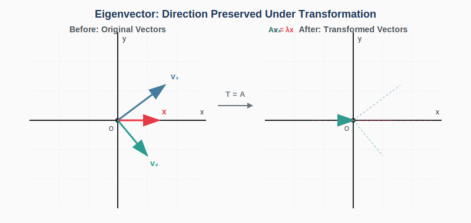
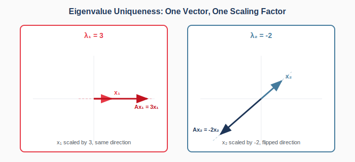
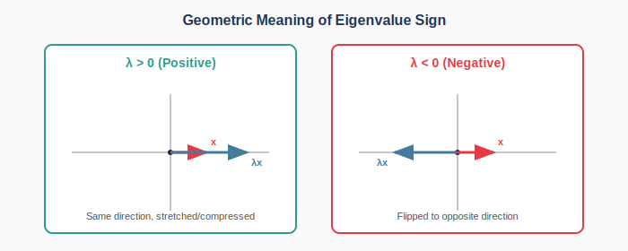
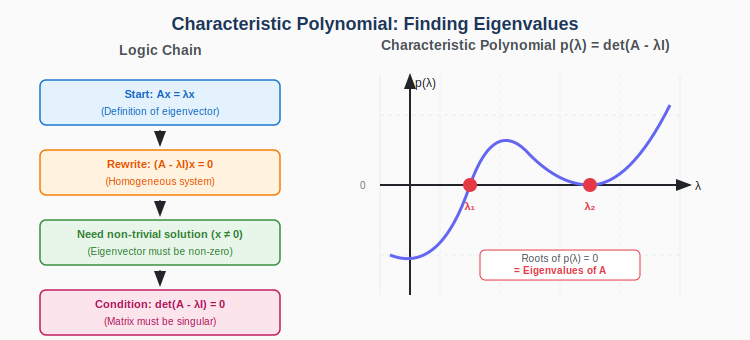
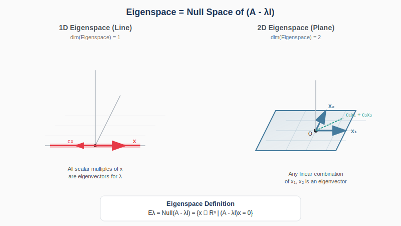

:::note
本系列文章內容參考自經典教材 **Elementary Linear Algebra (Pearson New International Edition)**。本文對應章節：**Ch5-1 Eigenvalues and Eigenvectors**。
:::

## **前言：變換中不變的方向**

當我們對向量空間施加一個線性變換時，大多數向量都會被「拉扯」、「旋轉」或「扭曲」，既改變長度又改變方向。然而，存在某些**特殊方向**的向量，它們在變換後**只被縮放而方向保持不變**（或恰好反向）。

這些「不被轉歪的方向」就是**特徵向量 (Eigenvectors)**，而縮放的倍數就是**特徵值 (Eigenvalues)**。

這個看似簡單的觀念卻是線性代數中最強大的工具之一，它揭示了矩陣的「本質行為」，並在物理、工程、資料科學等領域有廣泛應用。

 

## **特徵值與特徵向量的定義**

### **基本定義**

設 $A$ 為一個 $n \times n$ 的方陣。若存在一個**非零向量** $\mathbf{x}$ 與一個純量 $\lambda$，使得：

$$
\boxed{A\mathbf{x} = \lambda\mathbf{x}}
$$

則稱 $\lambda$ 為矩陣 $A$ 的**特徵值 (Eigenvalue)**，而 $\mathbf{x}$ 為對應於 $\lambda$ 的**特徵向量 (Eigenvector)**。

:::warning 重要提醒
特徵向量**必須是非零向量**。因為對任意純量 $\lambda$，零向量 $\mathbf{0}$ 都滿足 $A\mathbf{0} = \lambda\mathbf{0} = \mathbf{0}$，這是平凡且沒有意義的情況。
:::

### **幾何意義**

從幾何角度來說，特徵向量是那些在線性變換 $T(\mathbf{x}) = A\mathbf{x}$ 下「方向不變」的向量。變換 $A$ 對這些向量的效果僅僅是沿著該方向進行縮放。

下圖展示了這個核心概念。注意觀察：大多數向量（如 $\mathbf{v}_1, \mathbf{v}_2$）在變換後既改變了方向又改變了長度，但特徵向量 $\mathbf{x}$ 只被縮放，方向保持不變：

 

## **特徵值的唯一性**

一個矩陣 $A$ 可以有**多個不同的特徵值**。然而，對於任何一個特定的特徵向量 $\mathbf{x}$，它只能「忠誠於」**一個**特徵值。

### **為什麼特徵值對於特定向量是唯一的？**

假設向量 $\mathbf{x}$ 同時是 $\lambda_1$ 和 $\lambda_2$ 的特徵向量，則：

$$
A\mathbf{x} = \lambda_1 \mathbf{x} \quad \text{且} \quad A\mathbf{x} = \lambda_2 \mathbf{x}
$$

由此得 $\lambda_1 \mathbf{x} = \lambda_2 \mathbf{x}$，即 $(\lambda_1 - \lambda_2)\mathbf{x} = \mathbf{0}$。

由於 $\mathbf{x} \neq \mathbf{0}$（特徵向量必須非零），因此 $\lambda_1 = \lambda_2$。

:::tip 直覺理解
當我們對向量 $\mathbf{x}$ 施加變換 $A$ 時，輸出 $A\mathbf{x}$ 是唯一確定的。既然輸出固定，而 $A\mathbf{x} = \lambda \mathbf{x}$ 表示輸出必須是 $\mathbf{x}$ 的純量倍數，那麼這個縮放因子 $\lambda$ 自然也是唯一的。
:::

### **反過來：一個特徵值可對應無限多個特徵向量**

雖然每個特徵向量只對應一個特徵值，但反過來，**一個特徵值可以對應無限多個特徵向量**。

若 $\mathbf{x}$ 是 $\lambda$ 的特徵向量，則對於任意非零純量 $c$，向量 $c\mathbf{x}$ 也是 $\lambda$ 的特徵向量：

$$
A(c\mathbf{x}) = c(A\mathbf{x}) = c(\lambda\mathbf{x}) = \lambda(c\mathbf{x})
$$

換句話說，**同方向上的所有非零向量**都是相同特徵值的特徵向量。因此在描述特徵向量時，我們通常只給出一個「代表」，其他都是它的純量倍數。

 

## **特徵值的正負與幾何意義**

特徵值 $\lambda$ 的**符號**具有重要的幾何意義：

| 特徵值類型        | 幾何效果                               |
| :---------------- | :------------------------------------- |
| $\lambda > 1$     | 向量沿著該方向被**拉伸**               |
| $0 < \lambda < 1$ | 向量沿著該方向被**壓縮**               |
| $\lambda < 0$     | 向量被**翻轉**到相反方向，同時可能伸縮 |
| $\lambda = 1$     | 向量在該方向**完全不變**               |
| $\lambda = 0$     | 向量被**壓扁**到零向量（維度塌縮）     |

 

## **如何求特徵值：特徵多項式**

### **從定義到方程式**

要找到 $A$ 的特徵值，我們從定義出發：

$$
A\mathbf{x} = \lambda\mathbf{x}
$$

將右邊改寫：$A\mathbf{x} = \lambda I\mathbf{x}$（其中 $I$ 是單位矩陣），然後移項：

$$
A\mathbf{x} - \lambda I\mathbf{x} = \mathbf{0}
$$

$$
\colorbox{yellow}{$(A - \lambda I)\mathbf{x} = \mathbf{0}$}
$$

這是一個**齊次線性方程組**。我們需要找到**非平凡解**（即 $\mathbf{x} \neq \mathbf{0}$）。

### **非平凡解存在的條件**

根據線性方程組的理論，齊次方程組 $(A - \lambda I)\mathbf{x} = \mathbf{0}$ 存在非平凡解的**充要條件**是：

$$
\colorbox{yellow}{$\det(A - \lambda I) = 0$}
$$

這是因為：若 $\det(A - \lambda I) \neq 0$，則 $(A - \lambda I)$ 可逆，方程組只有平凡解 $\mathbf{x} = \mathbf{0}$。

換言之，我們需要 $(A - \lambda I)$ 的 column vectors **線性相依 (Linearly Dependent)**，這樣才有非零解存在。如果忘記了線性相依的概念，可以回顧 [Ch1-7 線性獨立與線性相依](../01-Chapter1/06-linear-dependence-independence.md)。

### **特徵多項式與特徵方程式**

將 $\det(A - \lambda I)$ 展開後，會得到一個關於 $\lambda$ 的多項式，稱為**特徵多項式 (Characteristic Polynomial)**：

$$
p(\lambda) = \det(A - \lambda I)
$$

對於 $n \times n$ 矩陣，$p(\lambda)$ 是 $n$ 次多項式。

令 $p(\lambda) = 0$ 所得的方程式稱為**特徵方程式 (Characteristic Equation)**：

$$
\colorbox{lightblue}{$\det(A - \lambda I) = 0$}
$$

特徵方程式的**根**就是矩陣 $A$ 的**特徵值**。

:::note 根的個數
由**代數基本定理**，$n$ 次多項式在複數範圍內恰有 $n$ 個根。

所謂「**計數重數 (counting multiplicity)**」是指：當某個根重複出現時，每出現一次就計算一次。例如 $(\lambda - 2)^3 = 0$ 有三重根 $\lambda = 2$，在「計數重數」的計算方式下要算作 3 個根。因此，$n \times n$ 矩陣在複數範圍內恰有 $n$ 個特徵值（計數重數）。

但若我們只考慮**實數特徵值**，則可能少於 $n$ 個，原因有二：

1. **複數根**：某些根可能是複數而非實數（例如 $\lambda^2 + 1 = 0$ 的根 $\pm i$）
2. **重根**：多個相同的根在計算「相異特徵值個數」時只算作一個
   :::

 

## **範例：計算特徵值與特徵向量**

### **範例 1：2×2 矩陣**

求矩陣 $A = \begin{bmatrix} 4 & 2 \\ 3 & 3 \end{bmatrix}$ 的特徵值與特徵向量。

**Step 1：建立特徵方程式**

$$
A - \lambda I = \begin{bmatrix} 4 & 2 \\ 3 & 3 \end{bmatrix} - \lambda \begin{bmatrix} 1 & 0 \\ 0 & 1 \end{bmatrix} = \begin{bmatrix} 4-\lambda & 2 \\ 3 & 3-\lambda \end{bmatrix}
$$

**Step 2：計算行列式並令其為零**

$$
\det(A - \lambda I) = (4-\lambda)(3-\lambda) - (2)(3) = 0
$$

$$
12 - 4\lambda - 3\lambda + \lambda^2 - 6 = 0
$$

$$
\lambda^2 - 7\lambda + 6 = 0
$$

$$
(\lambda - 1)(\lambda - 6) = 0
$$

**特徵值**：$\boxed{\lambda_1 = 1}$ 與 $\boxed{\lambda_2 = 6}$

**Step 3：對每個特徵值，求對應的特徵向量**

**對於 $\lambda_1 = 1$**：

$$
(A - 1 \cdot I)\mathbf{x} = \begin{bmatrix} 3 & 2 \\ 3 & 2 \end{bmatrix}\mathbf{x} = \mathbf{0}
$$

化簡後得 $3x_1 + 2x_2 = 0$，即 $x_1 = -\frac{2}{3}x_2$。

取 $x_2 = 3$，則 $x_1 = -2$。

**特徵向量**：$\mathbf{x}_1 = \begin{bmatrix} -2 \\ 3 \end{bmatrix}$（或其任何非零純量倍數）

**對於 $\lambda_2 = 6$**：

$$
(A - 6 \cdot I)\mathbf{x} = \begin{bmatrix} -2 & 2 \\ 3 & -3 \end{bmatrix}\mathbf{x} = \mathbf{0}
$$

化簡後得 $-2x_1 + 2x_2 = 0$，即 $x_1 = x_2$。

取 $x_1 = x_2 = 1$。

**特徵向量**：$\mathbf{x}_2 = \begin{bmatrix} 1 \\ 1 \end{bmatrix}$

### **範例 2：驗證特徵值與特徵向量**

驗證 $\lambda = 4$ 是否為 $A = \begin{bmatrix} 1 & 3 \\ 2 & 2 \end{bmatrix}$ 的特徵值，並求對應的特徵向量。

**驗證方法**：檢查 $\det(A - 4I) = 0$ 是否成立。

$$
A - 4I = \begin{bmatrix} 1-4 & 3 \\ 2 & 2-4 \end{bmatrix} = \begin{bmatrix} -3 & 3 \\ 2 & -2 \end{bmatrix}
$$

$$
\det(A - 4I) = (-3)(-2) - (3)(2) = 6 - 6 = 0 \quad \checkmark
$$

因此 $\lambda = 4$ 確實是特徵值。

求特徵向量：解 $(A - 4I)\mathbf{x} = \mathbf{0}$

$$
\begin{bmatrix} -3 & 3 \\ 2 & -2 \end{bmatrix}\mathbf{x} = \mathbf{0}
$$

得 $-3x_1 + 3x_2 = 0$，即 $x_1 = x_2$。

**特徵向量**：$\mathbf{x} = \begin{bmatrix} 1 \\ 1 \end{bmatrix}$（或其非零純量倍數）

 

## **特徵空間 (Eigenspace)**

### **定義**

對於矩陣 $A$ 的一個特徵值 $\lambda$，所有對應於 $\lambda$ 的特徵向量（加上零向量）所形成的集合，稱為 $\lambda$ 的**特徵空間 (Eigenspace)**，記作 $E_\lambda$：

$$
\colorbox{yellow}{$E_\lambda = \{\mathbf{x} \in \mathbb{R}^n \mid (A - \lambda I)\mathbf{x} = \mathbf{0}\}$}
$$

### **Eigenspace = Null Space**

從定義可以看出，特徵空間 $E_\lambda$ 正是矩陣 $(A - \lambda I)$ 的 **Null Space**：

$$
\colorbox{lightblue}{$E_\lambda = \text{Null}(A - \lambda I)$}
$$

:::tip Eigenspace 是一個空間！
我們算特徵向量時，是在解 $(A - \lambda I)\mathbf{x} = \mathbf{0}$。
這個方程式的解（eigenvectors）形成的集合，叫做 **Null Space**（或 **Eigenspace**）。

這是一個「子空間」(Subspace)，而不僅僅是一個點：

- 如果 Null Space 是**一條線**（維度 = 1），那整條線上的非零向量都是特徵向量
- 如果 Null Space 是**一個平面**（維度 = 2），那整個平面上的非零向量都是特徵向量

這也解釋了為什麼特徵向量「不唯一」：任何純量倍數（甚至線性組合）都還是特徵向量！
:::

### **Eigenspace 的維度與幾何重複度**

特徵空間的維度（即 $\text{Null}(A - \lambda I)$ 的維度）稱為該特徵值的**幾何重複度 (Geometric Multiplicity)**，記作 $\text{gm}(\lambda)$。

由 Rank-Nullity 定理：

$$
\text{gm}(\lambda) = \dim(E_\lambda) = \text{nullity}(A - \lambda I) = n - \text{rank}(A - \lambda I)
$$

**幾何重複度的意義**：

幾何重複度告訴我們：對於這個特徵值 $\lambda$，我們能找到多少個**線性獨立**的特徵向量。

- 如果 $\text{gm}(\lambda) = 1$，則 $\lambda$ 對應的所有特徵向量都在同一條線上（彼此為純量倍數）
- 如果 $\text{gm}(\lambda) = 2$，則能找到兩個線性獨立的特徵向量，它們張成一個平面

這個概念在後續的**對角化 (Diagonalization)** 中有關鍵作用：一個矩陣能否對角化，取決於每個特徵值的幾何重複度是否等於其**代數重複度 (Algebraic Multiplicity)**（即該根在特徵多項式中的重複次數）。

:::note Null Space 複習
關於 Null Space 的詳細概念，請參考 [Ch2-8 線性變換的組成與可逆性](../02-Chapter2/05-composition-invertibility.md)。
:::

 

## **特殊矩陣的特徵值**

### **三角矩陣的特徵值**

對於**三角矩陣**（上三角或下三角），其特徵值就是**對角線元素**。

$$
A = \begin{bmatrix} a_{11} & * & * \\ 0 & a_{22} & * \\ 0 & 0 & a_{33} \end{bmatrix}
\quad \Rightarrow \quad
\text{特徵值為 } a_{11}, a_{22}, a_{33}
$$

**原因**：

$$
A - \lambda I = \begin{bmatrix} a_{11}-\lambda & * & * \\ 0 & a_{22}-\lambda & * \\ 0 & 0 & a_{33}-\lambda \end{bmatrix}
$$

三角矩陣的行列式等於對角線元素的乘積：

$$
\det(A - \lambda I) = (a_{11}-\lambda)(a_{22}-\lambda)(a_{33}-\lambda) = 0
$$

因此特徵值為 $\lambda = a_{11}, a_{22}, a_{33}$。

### **對角矩陣的特徵值**

**對角矩陣 (Diagonal Matrix)** 是指除了主對角線以外，所有元素都為零的方陣。它是三角矩陣的特例，因此其特徵值同樣是對角線元素。

例如，考慮以下 $3 \times 3$ 對角矩陣：

$$
D = \begin{bmatrix} 2 & 0 & 0 \\ 0 & 5 & 0 \\ 0 & 0 & -3 \end{bmatrix}
$$

其特徵值為 $\lambda_1 = 2$, $\lambda_2 = 5$, $\lambda_3 = -3$。

而且，對應的特徵向量恰好是**標準基向量** $\mathbf{e}_1, \mathbf{e}_2, \ldots, \mathbf{e}_n$：

讓我們驗證標準基向量 $\mathbf{e}_1 = \begin{bmatrix} 1 \\ 0 \\ 0 \end{bmatrix}$ 是 $\lambda_1 = 2$ 的特徵向量：

$$
D\mathbf{e}_1 = \begin{bmatrix} 2 & 0 & 0 \\ 0 & 5 & 0 \\ 0 & 0 & -3 \end{bmatrix} \begin{bmatrix} 1 \\ 0 \\ 0 \end{bmatrix} = \begin{bmatrix} 2 \\ 0 \\ 0 \end{bmatrix} = 2\begin{bmatrix} 1 \\ 0 \\ 0 \end{bmatrix} = 2\mathbf{e}_1
$$

確實滿足 $D\mathbf{e}_1 = \lambda_1 \mathbf{e}_1$！同理，$\mathbf{e}_2$ 對應 $\lambda_2 = 5$，$\mathbf{e}_3$ 對應 $\lambda_3 = -3$。

這是因為對角矩陣的結構使得：**乘以第 $i$ 個標準基向量時，只會「挽出」第 $i$ 個對角線元素**。

 

## **特徵值與矩陣性質的關係**

當我們知道矩陣 $A$ 的特徵值後，可以推導出相關矩陣的特徵值：

| 矩陣                   | 特徵值              |
| :--------------------- | :------------------ |
| $A$                    | $\lambda$           |
| $A^k$ (k 為正整數)     | $\lambda^k$         |
| $A^{-1}$ (若 $A$ 可逆) | $\frac{1}{\lambda}$ |
| $A + cI$               | $\lambda + c$       |
| $cA$                   | $c\lambda$          |

**證明示例（$A^k$ 的情況）**：

若 $A\mathbf{x} = \lambda\mathbf{x}$，則：

$$
A^2\mathbf{x} = A(A\mathbf{x}) = A(\lambda\mathbf{x}) = \lambda(A\mathbf{x}) = \lambda(\lambda\mathbf{x}) = \lambda^2\mathbf{x}
$$

以此類推，$A^k\mathbf{x} = \lambda^k\mathbf{x}$。

:::info 特徵向量不變！
上述所有變換中，**特徵向量保持不變**，只是對應的特徵值改變了。

這也說明了為什麼 $A$ 可逆的條件是**所有特徵值都非零**，否則 $A^{-1}$ 的特徵值 $\frac{1}{\lambda}$ 就無法定義。
:::

 

## **補充：特徵值與行列式、跡的關係**

對於 $n \times n$ 矩陣 $A$，設其特徵值為 $\lambda_1, \lambda_2, \ldots, \lambda_n$（計數重數），則特徵值與行列式、跡之間存在優美的關係。

### **行列式 (Determinant)**

$$
\colorbox{yellow}{$\det(A) = \lambda_1 \cdot \lambda_2 \cdots \lambda_n$}
$$

行列式等於所有特徵值的**乘積**。

**推導過程**：

特徵多項式為 $p(\lambda) = \det(A - \lambda I)$。由於特徵值 $\lambda_1, \lambda_2, \ldots, \lambda_n$ 是這個多項式的根，我們可以將其因式分解：

$$
p(\lambda) = \det(A - \lambda I) = (-1)^n (\lambda - \lambda_1)(\lambda - \lambda_2) \cdots (\lambda - \lambda_n)
$$

現在，令 $\lambda = 0$：

$$
p(0) = \det(A - 0 \cdot I) = \det(A)
$$

另一方面，將 $\lambda = 0$ 代入因式分解式：

$$
p(0) = (-1)^n (0 - \lambda_1)(0 - \lambda_2) \cdots (0 - \lambda_n) = (-1)^n \cdot (-\lambda_1)(-\lambda_2) \cdots (-\lambda_n)
$$

$$
= (-1)^n \cdot (-1)^n \cdot \lambda_1 \lambda_2 \cdots \lambda_n = \lambda_1 \lambda_2 \cdots \lambda_n
$$

因此 $\det(A) = \lambda_1 \cdot \lambda_2 \cdots \lambda_n$。

**推論**：$A$ 可逆 $\Leftrightarrow$ $\det(A) \neq 0$ $\Leftrightarrow$ 所有特徵值都非零。

### **跡 (Trace)**

$$
\colorbox{yellow}{$\text{tr}(A) = a_{11} + a_{22} + \cdots + a_{nn} = \lambda_1 + \lambda_2 + \cdots + \lambda_n$}
$$

矩陣的跡（對角線元素之和）等於所有特徵值的**和**。

**推導過程**：

特徵多項式 $p(\lambda) = \det(A - \lambda I)$ 是一個 $n$ 次多項式。將其展開：

$$
p(\lambda) = (-1)^n \lambda^n + (-1)^{n-1} (\text{tr}A) \lambda^{n-1} + \cdots + \det(A)
$$

這可以通過展開 $\det(A - \lambda I)$ 並收集 $\lambda^{n-1}$ 的係數得到。$\lambda^{n-1}$ 的係數來自於對角線元素 $(a_{11} - \lambda)(a_{22} - \lambda) \cdots (a_{nn} - \lambda)$ 的展開。

另一方面，從因式分解式：

$$
p(\lambda) = (-1)^n (\lambda - \lambda_1)(\lambda - \lambda_2) \cdots (\lambda - \lambda_n)
$$

展開後，$\lambda^{n-1}$ 的係數為 $(-1)^n \cdot (-1) \cdot (\lambda_1 + \lambda_2 + \cdots + \lambda_n) = (-1)^{n-1}(\lambda_1 + \lambda_2 + \cdots + \lambda_n)$。

比較兩者的 $\lambda^{n-1}$ 係數，得：

$$
\text{tr}(A) = \lambda_1 + \lambda_2 + \cdots + \lambda_n
$$

:::tip 2×2 矩陣的快速計算
對於 $2 \times 2$ 矩陣 $A = \begin{bmatrix} a & b \\ c & d \end{bmatrix}$：

- $\lambda_1 + \lambda_2 = \text{tr}(A) = a + d$
- $\lambda_1 \cdot \lambda_2 = \det(A) = ad - bc$

特徵多項式可直接寫為：

$$
\lambda^2 - (\text{tr}A)\lambda + \det(A) = 0
$$

:::
