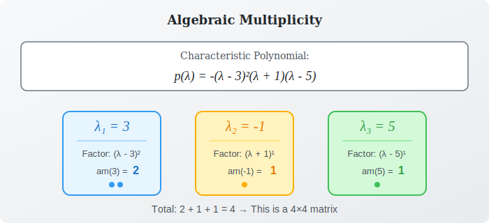
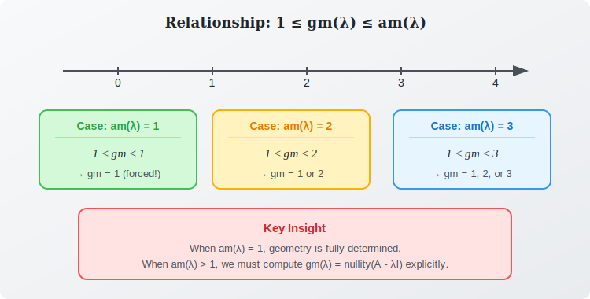
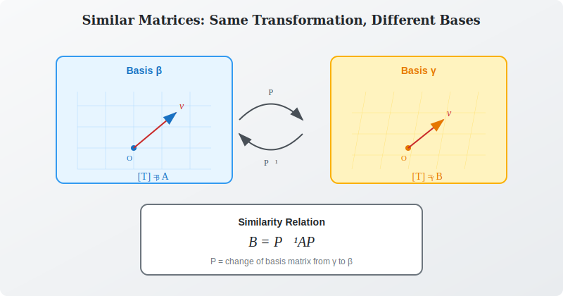

:::note
本系列文章內容參考自經典教材 **Elementary Linear Algebra (Pearson New International Edition)**。本文對應章節：**Ch5-2 The Characteristic Polynomial**。
:::

## **前言：深入特徵多項式的結構**

在上一節中，我們學會了如何透過特徵多項式 $p(\lambda) = \det(A - \lambda I)$ 來求解矩陣的特徵值。本節將更深入地探討特徵多項式的**結構與性質**，並建立兩個重要概念：**代數重根數 (Algebraic Multiplicity)** 與 **幾何重根數 (Geometric Multiplicity)**。

 

## **特徵多項式的形式**

### **基本結構**

對於 $n \times n$ 矩陣 $A$，其特徵多項式是一個 $n$ 次多項式：

$$
p(\lambda) = \det(A - \lambda I)
$$

展開後具有以下形式：

$$
\colorbox{yellow}{$p(\lambda) = (-1)^n \lambda^n + (-1)^{n-1}(\text{tr}A)\lambda^{n-1} + \cdots + \det(A)$}
$$

其中：

- **最高次項**的係數為 $(-1)^n$
- **次高次項**的係數與矩陣的**跡 (Trace)** 相關
- **常數項**等於矩陣的**行列式 (Determinant)**

### **因式分解形式**

由**代數基本定理 (Fundamental Theorem of Algebra)**，任何 $n$ 次多項式在複數範圍內可以完全因式分解為 $n$ 個一次因式的乘積：

$$
p(\lambda) = (-1)^n (\lambda - \lambda_1)(\lambda - \lambda_2) \cdots (\lambda - \lambda_n)
$$

其中 $\lambda_1, \lambda_2, \ldots, \lambda_n$ 是特徵多項式的根（可能有重複）。

當某些根重複出現時，我們可以將其寫成：

$$
\colorbox{lightblue}{$p(\lambda) = (-1)^n (\lambda - \lambda_1)^{m_1} (\lambda - \lambda_2)^{m_2} \cdots (\lambda - \lambda_k)^{m_k}$}
$$

其中 $\lambda_1, \lambda_2, \ldots, \lambda_k$ 是**相異**的特徵值，而 $m_1 + m_2 + \cdots + m_k = n$。

 

## **代數重根數 (Algebraic Multiplicity)**

### **定義**

特徵值 $\lambda_i$ 的**代數重根數 (Algebraic Multiplicity)**，記作 $\text{am}(\lambda_i)$，是指 $(\lambda - \lambda_i)$ 在特徵多項式的因式分解中出現的**次數**。換言之，就是 $\lambda_i$ 作為特徵方程式的根的**重數**。

$$
\colorbox{yellow}{$\text{am}(\lambda_i) = m_i \quad \text{（根的重數）}$}
$$

### **範例：計算代數重根數**

考慮矩陣 $A$ 的特徵多項式為：

$$
p(\lambda) = -(\lambda - 3)^2 (\lambda + 1)(\lambda - 5)
$$

此矩陣有三個相異特徵值：

- $\lambda_1 = 3$，代數重根數 $\text{am}(3) = 2$
- $\lambda_2 = -1$，代數重根數 $\text{am}(-1) = 1$
- $\lambda_3 = 5$，代數重根數 $\text{am}(5) = 1$

總和 $2 + 1 + 1 = 4$，因此這是一個 $4 \times 4$ 矩陣。

 

## **幾何重根數 (Geometric Multiplicity)**

### **定義**

特徵值 $\lambda_i$ 的**幾何重根數 (Geometric Multiplicity)**，記作 $\text{gm}(\lambda_i)$，是指其特徵空間 $E_{\lambda_i}$ 的**維度**：

$$
\colorbox{yellow}{$\text{gm}(\lambda_i) = \dim(E_{\lambda_i}) = \dim(\text{Null}(A - \lambda_i I))$}
$$

**幾何重根數**告訴我們：對於特徵值 $\lambda_i$，我們能找到多少個**線性獨立**的特徵向量。

### **幾何重根數的計算**

要計算 $\text{gm}(\lambda)$，步驟如下：

1. 計算矩陣 $(A - \lambda I)$
2. 將 $(A - \lambda I)$ 化為 RREF（簡化階梯形）
3. 計算 $\text{nullity}(A - \lambda I) = n - \text{rank}(A - \lambda I)$

### **範例：計算幾何重根數**

設 $A = \begin{bmatrix} 5 & 0 & 0 \\ 0 & 5 & 0 \\ 1 & 4 & -3 \end{bmatrix}$，已知 $\lambda = 5$ 是 $A$ 的特徵值。

計算 $A - 5I$：

$$
A - 5I = \begin{bmatrix} 0 & 0 & 0 \\ 0 & 0 & 0 \\ 1 & 4 & -8 \end{bmatrix}
$$

這個矩陣的 rank 為 1（只有一個非零 Row），因此：

$$
\text{gm}(5) = \text{nullity}(A - 5I) = 3 - 1 = 2
$$

因此我們可以找到 **2 個線性獨立**的特徵向量對應於 $\lambda = 5$。

 

## **代數重根數與幾何重根數的關係**

### **核心不等式**

對於任何特徵值 $\lambda$，代數重根數與幾何重根數之間存在一個**關鍵不等式**：

$$
\colorbox{yellow}{$1 \leq \text{gm}(\lambda) \leq \text{am}(\lambda)$}
$$

這個不等式有三個重要意涵：

1. **下界為 1**：既然 $\lambda$ 是特徵值，就至少存在一個非零特徵向量，因此 $\text{gm}(\lambda) \geq 1$
2. **上界為代數重根數**：幾何重根數不會超過代數重根數
3. **可能不相等**：$\text{gm}(\lambda)$ 可能**嚴格小於** $\text{am}(\lambda)$

:::tip 重數與維度的直覺理解

**為什麼 $\text{am}(\lambda) = 1$ 時，$\text{gm}(\lambda)$ 一定等於 1？**

這是因為不等式 $1 \leq \text{gm}(\lambda) \leq \text{am}(\lambda)$ 在 $\text{am}(\lambda) = 1$ 時變成：

$$
1 \leq \text{gm}(\lambda) \leq 1
$$

左右都被「夾住」了，所以 $\text{gm}(\lambda)$ 只能等於 1。換句話說：**單根的特徵值，其特徵空間必為一維**（恰好是一條線）。

**為什麼 $\text{am}(\lambda) = k$ 時，$\text{gm}(\lambda)$ 不一定等於 $k$？**

這是因為不等式只給出上界，並沒有強迫相等。從線性代數的角度來看：

- 代數重根數反映的是**多項式根的重數**（純代數性質）
- 幾何重根數反映的是 **Null Space 的維度**（線性方程組的解空間結構）

這兩者來自不同的數學層面，所以不一定相等。當矩陣「不夠好」時（例如**虧缺矩陣 (Defective Matrix)**），就會出現 $\text{gm}(\lambda) < \text{am}(\lambda)$ 的情況。
:::

### **範例：幾何重根數小於代數重根數**

考慮矩陣：

$$
A = \begin{bmatrix} 2 & 1 \\ 0 & 2 \end{bmatrix}
$$

**Step 1：計算特徵多項式**

$$
\det(A - \lambda I) = \det \begin{bmatrix} 2 - \lambda & 1 \\ 0 & 2 - \lambda \end{bmatrix} = (2 - \lambda)^2 = 0
$$

因此 $\lambda = 2$ 是唯一特徵值，且 $\text{am}(2) = 2$（二重根）。

**Step 2：計算幾何重複度**

$$
A - 2I = \begin{bmatrix} 0 & 1 \\ 0 & 0 \end{bmatrix}
$$

此矩陣的 rank 為 1，因此：

$$
\text{gm}(2) = 2 - 1 = 1
$$

所以 $\text{gm}(2) = 1 < 2 = \text{am}(2)$。

雖然 $\lambda = 2$ 是二重根，但我們只能找到 **1 個**線性獨立的特徵向量，特徵空間只是一條線而非一個平面。

:::info 這對對角化的影響
這個矩陣無法對角化！因為我們需要 2 個線性獨立的特徵向量來形成對角化的基底，但只能找到 1 個。這種矩陣稱為**虧缺矩陣 (Defective Matrix)**。

關於對角化的詳細條件與應用，將在下個章節深入探討。
:::

 

## **相似矩陣 (Similar Matrices)**

### **定義**

設 $A$ 和 $B$ 都是 $n \times n$ 矩陣。若存在一個**可逆矩陣** $P$ 使得：

$$
\colorbox{yellow}{$B = P^{-1}AP$}
$$

則稱 $A$ 與 $B$ 是**相似的 (Similar)**，記作 $A \sim B$。

:::note 複習相似矩陣
關於相似矩陣的基本概念與幾何意義，請參考 [Ch4-5 線性算子的矩陣表示法](../04-Chapter4/05-matrix-representations-of-linear-operators.md#相似矩陣-similar-matrices)。
:::

### **相似性的幾何意義**

從線性變換的角度來看，相似矩陣代表**同一個線性變換在不同基底下的矩陣表示**。

設線性變換 $T: V \to V$：

- 在基底 $\beta$ 下的矩陣表示為 $[T]_\beta = A$
- 在基底 $\gamma$ 下的矩陣表示為 $[T]_\gamma = B$

則 $A$ 與 $B$ 相似，其中 $P$ 是從 $\gamma$ 到 $\beta$ 的**基底轉換矩陣 (Change of Basis Matrix)**。

### **相似關係的性質**

相似關係（記作 $\sim$）是一種**等價關係 (Equivalence Relation)**：

1. **反身性 (Reflexive)**：$A \sim A$（取 $P = I$）
2. **對稱性 (Symmetric)**：若 $A \sim B$，則 $B \sim A$
3. **遞移性 (Transitive)**：若 $A \sim B$ 且 $B \sim C$，則 $A \sim C$

 

## **相似矩陣的不變量 (Similarity Invariants)**

### **核心定理：相似矩陣有相同的特徵多項式**

> **定理**：若 $A \sim B$，則 $A$ 與 $B$ 有**相同的特徵多項式**。

**證明**：

設 $B = P^{-1}AP$，則：

$$
\begin{aligned}
\det(B - \lambda I) &= \det(P^{-1}AP - \lambda I) \\
&= \det(P^{-1}AP - \lambda P^{-1}IP) \\
&= \det(P^{-1}(A - \lambda I)P) \\
&= \det(P^{-1}) \cdot \det(A - \lambda I) \cdot \det(P) \\
&= \frac{1}{\det(P)} \cdot \det(A - \lambda I) \cdot \det(P) \\
&= \det(A - \lambda I)
\end{aligned}
$$

因此 $A$ 與 $B$ 有相同的特徵多項式。$\square$

### **不變量的連鎖效應**

由於相似矩陣擁有相同的特徵多項式，它們也共享許多由特徵多項式所決定的性質：

| 不變量                   | 說明                                                                       |
| :----------------------- | :------------------------------------------------------------------------- |
| **特徵值**               | 特徵多項式的根完全相同                                                     |
| **特徵值的代數重根數**   | 每個根的重數相同                                                           |
| **行列式 (Determinant)** | $\det(A) = \det(B) = \lambda_1 \lambda_2 \cdots \lambda_n$                 |
| **跡 (Trace)**           | $\text{tr}(A) = \text{tr}(B) = \lambda_1 + \lambda_2 + \cdots + \lambda_n$ |
| **秩 (Rank)**            | $\text{rank}(A) = \text{rank}(B)$                                          |
| **可逆性**               | $A$ 可逆 $\Leftrightarrow$ $B$ 可逆                                        |

:::tip 不變量的意義

相似矩陣就像是「同一個人的不同照片」：從不同角度拍攝（不同基底），外觀細節可能不同，但**本質特徵**（如身高、體重）是不變的。

這些不變量揭示了線性變換的「內在性質」，不會因為座標系統的選擇而改變。特徵值之所以重要，正是因為它們是線性變換的**本質特徵**。
:::

### **注意：相同特徵多項式不保證相似**

重要的是，逆命題**不成立**！兩個矩陣有相同的特徵多項式，**不代表**它們相似。

**反例**：

$$
A = \begin{bmatrix} 0 & 1 \\ 0 & 0 \end{bmatrix} \quad \text{與} \quad B = \begin{bmatrix} 0 & 0 \\ 0 & 0 \end{bmatrix}
$$

兩者的特徵多項式都是 $\lambda^2$，但：

- $A \neq P^{-1}BP$ 對任何可逆 $P$

這是因為 $B = O$（零矩陣），而 $P^{-1}OP = O$，所以 $A$ 無法與 $B$ 相似。
