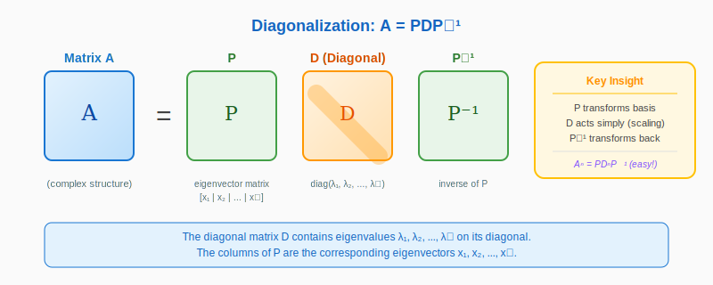
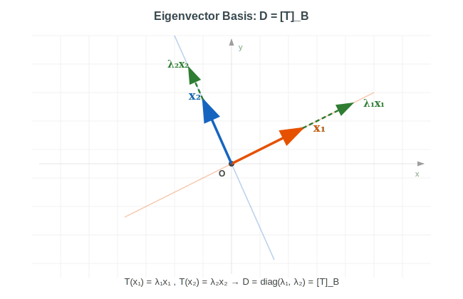
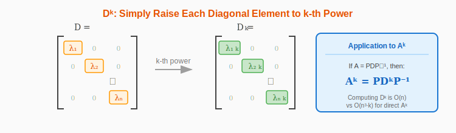
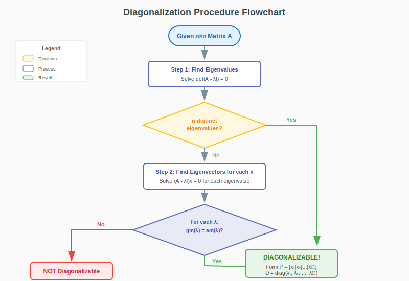
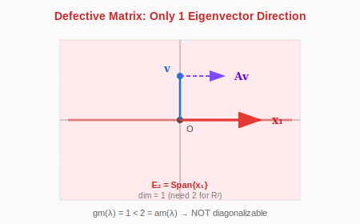

:::note
本系列文章內容參考自經典教材 **Elementary Linear Algebra (Pearson New International Edition)**。本文對應章節：**Ch5-3 Diagonalization of Matrices**。
:::

## **對角化的定義**

### **基本定義**

設 $A$ 為一個 $n \times n$ 的方陣。若存在一個**可逆矩陣** $P$ 與一個**對角矩陣** $D$，使得：

$$
\colorbox{yellow}{$A = PDP^{-1}$}
$$

則稱矩陣 $A$ 是**可對角化的 (Diagonalizable)**。

等價地，這個關係也可以寫成：

$$
P^{-1}AP = D
$$

這表示 $A$ 與 $D$ 是**相似矩陣 (Similar Matrices)**。

:::note 與矩陣表示法的關聯
你可能注意到 $A = PDP^{-1}$ 這個公式與我們在 [Ch4-5 線性算子的矩陣表示法](../04-Chapter4/05-matrix-representations-of-linear-operators.md#公式推導t_b--b-1-a-b) 學過的 $[T]_\mathcal{B} = B^{-1}AB$ 長得非常相似。事實上，它們是同一回事！

回顧那個公式的意義：$[T]_\mathcal{B}$ 是線性算子 $T$ 在基底 $\mathcal{B}$ 下的矩陣表示，而 $A$ 是標準矩陣。

**對角化正是這個概念的特例**：當我們選擇的基底 $\mathcal{B}$ 恰好由**特徵向量**組成時，$T$ 在該基底下的矩陣表示 $[T]_\mathcal{B}$ 就會是**對角矩陣 $D$**！

- 公式 $D = P^{-1}AP$ 就是 $[T]_\mathcal{B} = B^{-1}AB$
- 基底矩陣 $B = P$（Column 是特徵向量）
- 新基底下的矩陣 $[T]_\mathcal{B} = D$（對角線是特徵值）

簡言之：**對角化 = 找到特徵向量基底，使得線性算子的矩陣表示變成對角矩陣**。
:::

### **對角化的結構**

當 $A$ 可對角化時，矩陣 $P$ 與 $D$ 有著特殊的結構：

- **$D$ 是對角矩陣**：其對角線元素是 $A$ 的特徵值 $\lambda_1, \lambda_2, \ldots, \lambda_n$

$$
D = \begin{bmatrix} \lambda_1 & 0 & \cdots & 0 \\ 0 & \lambda_2 & \cdots & 0 \\ \vdots & \vdots & \ddots & \vdots \\ 0 & 0 & \cdots & \lambda_n \end{bmatrix}
$$

- **$P$ 的 Column 是對應的特徵向量**：第 $i$ 個 Column 是 $\lambda_i$ 的特徵向量 $\mathbf{x}_i$

$$
P = \begin{bmatrix} | & | & & | \\ \mathbf{x}_1 & \mathbf{x}_2 & \cdots & \mathbf{x}_n \\ | & | & & | \end{bmatrix}
$$

:::info 特徵值與特徵向量的順序對應
$D$ 的對角線上的特徵值順序與 $P$ 中特徵向量的排列順序**必須一致**。也就是說，如果 $D$ 的第 $i$ 個對角元素是 $\lambda_i$，那麼 $P$ 的第 $i$ 個 Column 必須是 $\lambda_i$ 對應的特徵向量。
:::

 

## **為什麼 A = PDP⁻¹ 成立？**

### **推導過程**

讓我們從 $AP = PD$ 出發（這等價於 $A = PDP^{-1}$，前提是 $P$ 可逆）。

設 $P = [\mathbf{x}_1 | \mathbf{x}_2 | \cdots | \mathbf{x}_n]$，其中 $\mathbf{x}_i$ 是 $\lambda_i$ 的特徵向量。則：

$$
AP = A[\mathbf{x}_1 | \mathbf{x}_2 | \cdots | \mathbf{x}_n] = [A\mathbf{x}_1 | A\mathbf{x}_2 | \cdots | A\mathbf{x}_n]
$$

由於 $A\mathbf{x}_i = \lambda_i \mathbf{x}_i$（特徵值定義），所以：

$$
AP = [\lambda_1\mathbf{x}_1 | \lambda_2\mathbf{x}_2 | \cdots | \lambda_n\mathbf{x}_n]
$$

另一方面：

$$
PD = [\mathbf{x}_1 | \mathbf{x}_2 | \cdots | \mathbf{x}_n] \begin{bmatrix} \lambda_1 & & \\ & \lambda_2 & \\ & & \ddots & \\ & & & \lambda_n \end{bmatrix} = [\lambda_1\mathbf{x}_1 | \lambda_2\mathbf{x}_2 | \cdots | \lambda_n\mathbf{x}_n]
$$

因此 $AP = PD$。若 $P$ 可逆（即這些特徵向量線性獨立），則可將兩邊右乘 $P^{-1}$ 得到 $A = PDP^{-1}$。

### **P 可逆的條件**

$P$ 可逆的**充要條件**是：它的 $n$ 個 Column 向量（即 $n$ 個特徵向量）**線性獨立**。

對角化的關鍵就在這裡：我們需要找到 $n$ 個線性獨立的特徵向量！

 

## **對角化的幾何意義**

對角化的核心問題是：**我們能否找到一組由特徵向量組成的基底？**

### **為什麼需要 n 個線性獨立的特徵向量？**

要建立矩陣 $P$，我們需要 $n$ 個特徵向量排成 $n$ 個 Column。但更關鍵的是，$P$ 必須是**可逆的**，這樣才能計算 $P^{-1}$，從而得到 $A = PDP^{-1}$。

而 $P$ 可逆的條件是什麼？正是它的 $n$ 個 Column 向量**線性獨立**！

用幾何語言來說：這 $n$ 個特徵向量必須能「撐開」整個 $\mathbb{R}^n$ 空間，形成一組**基底**。

上圖對比了兩種情況：

- **左圖（可對角化）**：存在兩個線性獨立的特徵向量 $\mathbf{x}_1, \mathbf{x}_2$，它們的 Span 是整個 $\mathbb{R}^2$ 平面，因此可以形成基底，$P$ 可逆
- **右圖（不可對角化）**：只有一個特徵向量方向，無論如何縮放都只能得到一條線，無法「撐開」$\mathbb{R}^2$，因此無法形成 $P$

### **對角矩陣的幾何意義：D 就是 [T]\_B**

還記得在 [Ch4-5](../04-Chapter4/05-matrix-representations-of-linear-operators.md) 我們學過：同一個線性算子 $T$ 在不同基底下會有不同的矩陣表示。如果標準矩陣是 $A$，那麼在基底 $\mathcal{B}$ 下的矩陣表示是：

$$
[T]_\mathcal{B} = P_\mathcal{B}^{-1} A P_\mathcal{B}
$$

**現在的關鍵洞察是**：如果我們選擇的基底 $\mathcal{B}$ 恰好由**特徵向量**組成，那麼 $[T]_\mathcal{B}$ 就變成了**對角矩陣 $D$**！

$$
\colorbox{yellow}{$D = [T]_\mathcal{B} = P^{-1}AP$}
$$

換句話說：**對角矩陣 $D$ 就是線性算子在特徵向量基底下的矩陣表示**。

上圖展示：在特徵向量基底 $\mathcal{B} = \{\mathbf{x}_1, \mathbf{x}_2\}$ 下，變換 $T$ 對每個基底向量的作用是**沿著該方向縮放**，即 $T(\mathbf{x}_1) = \lambda_1 \mathbf{x}_1$，$T(\mathbf{x}_2) = \lambda_2 \mathbf{x}_2$。這就是對角矩陣 $D = \text{diag}(\lambda_1, \lambda_2)$ 的行為。

### **為什麼特徵向量基底讓矩陣變成對角？**

這有一個非常自然的解釋：

在特徵向量基底 $\mathcal{B} = \{\mathbf{x}_1, \mathbf{x}_2, \ldots, \mathbf{x}_n\}$ 下：

- 基底向量 $\mathbf{x}_1$ 的 $\mathcal{B}$ 座標是 $[\mathbf{x}_1]_\mathcal{B} = \begin{bmatrix} 1 \\ 0 \\ \vdots \\ 0 \end{bmatrix}$（第一個座標軸）
- 變換後 $T(\mathbf{x}_1) = A\mathbf{x}_1 = \lambda_1 \mathbf{x}_1$
- 所以 $[T(\mathbf{x}_1)]_\mathcal{B} = \begin{bmatrix} \lambda_1 \\ 0 \\ \vdots \\ 0 \end{bmatrix}$（只在第一個座標軸上縮放 $\lambda_1$ 倍！）

對每個基底向量 $\mathbf{x}_i$ 都是如此：變換後只是在第 $i$ 個座標軸上縮放 $\lambda_i$ 倍，完全不影響其他座標。

這就是對角矩陣的特性：**每個座標軸獨立縮放，互不干擾**。

:::tip 對角化的直覺
我理解對角化的關鍵在於：**特徵向量是線性變換「不會扭曲」的方向**。

如果我們有足夠多這種「不會扭曲的方向」（$n$ 個線性獨立的特徵向量），就能用它們作為新的座標系統。在這個座標系統下，變換只是沿著每個座標軸伸縮，行為變得最簡單，而這個簡化後的表示就是對角矩陣 $D$。

反過來，如果特徵向量不夠多，就表示有些方向必然會被「扭曲」，無法用純粹的縮放來描述，這時矩陣就無法對角化。
:::

 

## **對角化的應用：計算矩陣的次方**

對角化最強大的應用之一是**快速計算矩陣的高次方**。

### **核心公式**

若 $A = PDP^{-1}$，則：

$$
\colorbox{yellow}{$A^k = PD^kP^{-1}$}
$$

**證明**：

$$
A^k = (PDP^{-1})(PDP^{-1}) \cdots (PDP^{-1}) = PD(P^{-1}P)D(P^{-1}P) \cdots DP^{-1} = PD^kP^{-1}
$$

### **對角矩陣的次方極易計算**

對角矩陣的 $k$ 次方只需將每個對角元素各自取 $k$ 次方：

$$
D^k = \begin{bmatrix} \lambda_1^k & 0 & \cdots & 0 \\ 0 & \lambda_2^k & \cdots & 0 \\ \vdots & \vdots & \ddots & \vdots \\ 0 & 0 & \cdots & \lambda_n^k \end{bmatrix}
$$

### **範例：計算 A¹⁰⁰**

設 $A = \begin{bmatrix} 7 & 2 \\ -4 & 1 \end{bmatrix}$，求 $A^{100}$。

**Step 1：找特徵值**

$$
\det(A - \lambda I) = (7-\lambda)(1-\lambda) + 8 = \lambda^2 - 8\lambda + 15 = (\lambda - 3)(\lambda - 5) = 0
$$

特徵值：$\lambda_1 = 3$, $\lambda_2 = 5$

**Step 2：找特徵向量**

對於 $\lambda_1 = 3$：

$$
(A - 3I)\mathbf{x} = \begin{bmatrix} 4 & 2 \\ -4 & -2 \end{bmatrix}\mathbf{x} = \mathbf{0} \Rightarrow \mathbf{x}_1 = \begin{bmatrix} 1 \\ -2 \end{bmatrix}
$$

對於 $\lambda_2 = 5$：

$$
(A - 5I)\mathbf{x} = \begin{bmatrix} 2 & 2 \\ -4 & -4 \end{bmatrix}\mathbf{x} = \mathbf{0} \Rightarrow \mathbf{x}_2 = \begin{bmatrix} 1 \\ -1 \end{bmatrix}
$$

**Step 3：建立 P 與 D**

將特徵向量依序排列成 $P$ 的 Column，對應的特徵值依相同順序排列在 $D$ 的對角線上：

- 第 1 個 Column 是 $\lambda_1 = 3$ 的特徵向量 $\mathbf{x}_1 = \begin{bmatrix} 1 \\ -2 \end{bmatrix}$
- 第 2 個 Column 是 $\lambda_2 = 5$ 的特徵向量 $\mathbf{x}_2 = \begin{bmatrix} 1 \\ -1 \end{bmatrix}$

$$
P = \begin{bmatrix} \mathbf{x}_1 & \mathbf{x}_2 \end{bmatrix} = \begin{bmatrix} 1 & 1 \\ -2 & -1 \end{bmatrix}, \quad D = \begin{bmatrix} \lambda_1 & 0 \\ 0 & \lambda_2 \end{bmatrix} = \begin{bmatrix} 3 & 0 \\ 0 & 5 \end{bmatrix}
$$

**Step 4：計算 P⁻¹**

$$
P^{-1} = \frac{1}{(-1)(-1) - (1)(-2)} \begin{bmatrix} -1 & -1 \\ 2 & 1 \end{bmatrix} = \begin{bmatrix} -1 & -1 \\ 2 & 1 \end{bmatrix}
$$

**Step 5：計算 A¹⁰⁰**

$$
A^{100} = PD^{100}P^{-1} = \begin{bmatrix} 1 & 1 \\ -2 & -1 \end{bmatrix} \begin{bmatrix} 3^{100} & 0 \\ 0 & 5^{100} \end{bmatrix} \begin{bmatrix} -1 & -1 \\ 2 & 1 \end{bmatrix}
$$

$$
= \begin{bmatrix} 2 \cdot 5^{100} - 3^{100} & 5^{100} - 3^{100} \\ 2 \cdot 3^{100} - 2 \cdot 5^{100} & 2 \cdot 3^{100} - 5^{100} \end{bmatrix}
$$

:::info 計算複雜度的巨大差異
如果直接計算 $A^{100}$（連乘 100 次），需要約 $O(n^3 \times 100)$ 次運算。

使用對角化後，主要成本在於：

- 計算 $P^{-1}$：$O(n^3)$
- 計算 $D^{100}$：只需 $O(n)$（每個對角元素獨立計算）
- 兩次矩陣乘法：$O(n^3)$

當 $k$ 很大時，對角化帶來的效率提升是巨大的！
:::

 

## **可對角化的條件**

不是所有矩陣都能對角化。以下是判斷矩陣是否可對角化的三個層次：

### **充分條件：n 個相異特徵值**

> **定理**：若 $n \times n$ 矩陣 $A$ 擁有 $n$ 個**互不相同**的特徵值，則 $A$ **必定可以對角化**。

**原因**：對應於不同特徵值的特徵向量必定線性獨立（這是一個重要定理）。因此，$n$ 個相異特徵值必產生 $n$ 個線性獨立的特徵向量。

:::warning 注意
這只是**充分條件**，不是必要條件！即使有重複的特徵值，矩陣仍可能是可對角化的（只要幾何重根數等於代數重根數）。
:::

### **充要條件：n 個線性獨立的特徵向量**

> **定理**：矩陣 $A$ 可對角化 $\Leftrightarrow$ $A$ 擁有 $n$ 個**線性獨立**的特徵向量。

這 $n$ 個線性獨立的特徵向量構成 $\mathbb{R}^n$ 的一組**基底**。

:::tip 特徵向量要能「撐開」整個空間
我的理解是：對角化的本質是找到一組由特徵向量組成的基底。如果我們無法找到足夠的線性獨立特徵向量來「撐開」$\mathbb{R}^n$ 空間，矩陣就無法對角化。

因此我們需要檢查「特徵向量的總數是否等於 $n$」，確保它們能形成一組完整的基底。
:::

### **最嚴謹的判斷：代數重根數 = 幾何重根數**

> **定理**：矩陣 $A$ 可對角化 $\Leftrightarrow$ 對於**每一個**特徵值 $\lambda_i$，其**代數重根數等於幾何重根數**：
> $$\text{am}(\lambda_i) = \text{gm}(\lambda_i) \quad \text{對所有特徵值成立}$$

回顧定義：

- **代數重根數 $\text{am}(\lambda)$**：$\lambda$ 作為特徵多項式根的重數
- **幾何重根數 $\text{gm}(\lambda)$**：特徵空間 $E_\lambda = \text{Null}(A - \lambda I)$ 的維度

由於恆有 $1 \leq \text{gm}(\lambda) \leq \text{am}(\lambda)$，可對角化的條件等價於：

$$
\colorbox{lightblue}{$\sum_{i=1}^{k} \text{gm}(\lambda_i) = n$}
$$

即所有特徵空間的維度總和等於 $n$。

 

## **對角化的步驟流程**

### **完整對角化流程**

給定 $n \times n$ 矩陣 $A$：

**Step 1**：計算特徵多項式 $\det(A - \lambda I) = 0$，求出所有特徵值 $\lambda_1, \lambda_2, \ldots, \lambda_k$（及其代數重根數）

**Step 2**：對每個特徵值 $\lambda_i$，解 $(A - \lambda_i I)\mathbf{x} = \mathbf{0}$ 求出特徵空間 $E_{\lambda_i}$ 的一組基底

**Step 3**：檢查是否可對角化：

- 若每個 $\text{gm}(\lambda_i) = \text{am}(\lambda_i)$，則可對角化
- 若某個 $\text{gm}(\lambda_i) < \text{am}(\lambda_i)$，則**不可對角化**

**Step 4**：若可對角化：

- 將所有特徵空間的基底向量合併，形成 $P = [\mathbf{x}_1 | \mathbf{x}_2 | \cdots | \mathbf{x}_n]$
- 建立對角矩陣 $D$，對角線元素為對應的特徵值

則 $A = PDP^{-1}$。

 

## **不可對角化的矩陣：虧缺矩陣**

### **定義**

若矩陣 $A$ 存在某個特徵值 $\lambda$，使得：

$$
\text{gm}(\lambda) < \text{am}(\lambda)
$$

則稱 $A$ 為**虧缺矩陣 (Defective Matrix)**。虧缺矩陣**無法對角化**。

### **經典範例**

考慮矩陣：

$$
A = \begin{bmatrix} 2 & 1 \\ 0 & 2 \end{bmatrix}
$$

**分析**：

1. 特徵多項式：$(2 - \lambda)^2 = 0$，故 $\lambda = 2$ 是唯一特徵值，$\text{am}(2) = 2$

2. 計算幾何重根數：

   $$
   A - 2I = \begin{bmatrix} 0 & 1 \\ 0 & 0 \end{bmatrix}
   $$

   $\text{rank}(A - 2I) = 1$，故 $\text{gm}(2) = 2 - 1 = 1$

3. 由於 $\text{gm}(2) = 1 \neq 2 = \text{am}(2)$，此矩陣**不可對角化**。

:::tip 為什麼有些矩陣不能對角化？
虧缺矩陣的幾何意義是：變換 $A$ 對空間做了某種「剪切 (Shear)」效果，不僅僅是縮放。

以上面的例子來說，矩陣 $A = \begin{bmatrix} 2 & 1 \\ 0 & 2 \end{bmatrix}$ 會把向量沿著 $x$ 軸方向「斜切」。只有一個方向（$x$ 軸）是真正被保持的特徵方向，另一個維度的「純粹縮放」行為不存在。

所以我們找不到兩個線性獨立的特徵向量，無法用對角矩陣來表達這種「帶有剪切」的變換。
:::

 

## **重要定理：不同特徵值的特徵向量線性獨立**

### **定理陳述**

> 設 $\lambda_1, \lambda_2, \ldots, \lambda_k$ 是矩陣 $A$ 的 $k$ 個**相異**特徵值，$\mathbf{x}_1, \mathbf{x}_2, \ldots, \mathbf{x}_k$ 分別是對應的特徵向量。則 $\mathbf{x}_1, \mathbf{x}_2, \ldots, \mathbf{x}_k$ **線性獨立**。

### **證明（數學歸納法）**

**Base case**：$k = 1$ 時，由於特徵向量 $\mathbf{x}_1 \neq \mathbf{0}$，單一向量必線性獨立。

**Inductive step**：假設對於 $k-1$ 個相異特徵值成立，考慮 $k$ 個的情況。

假設存在係數使得：

$$
c_1\mathbf{x}_1 + c_2\mathbf{x}_2 + \cdots + c_k\mathbf{x}_k = \mathbf{0} \quad \text{...(1)}
$$

對等式兩邊左乘 $A$：

$$
c_1\lambda_1\mathbf{x}_1 + c_2\lambda_2\mathbf{x}_2 + \cdots + c_k\lambda_k\mathbf{x}_k = \mathbf{0} \quad \text{...(2)}
$$

將 (1) 乘以 $\lambda_k$ 後從 (2) 中減去：

$$
c_1(\lambda_1 - \lambda_k)\mathbf{x}_1 + c_2(\lambda_2 - \lambda_k)\mathbf{x}_2 + \cdots + c_{k-1}(\lambda_{k-1} - \lambda_k)\mathbf{x}_{k-1} = \mathbf{0}
$$

由歸納假設，$\mathbf{x}_1, \ldots, \mathbf{x}_{k-1}$ 線性獨立，且因 $\lambda_i \neq \lambda_k$（$i < k$），故：

$$
c_1(\lambda_1 - \lambda_k) = c_2(\lambda_2 - \lambda_k) = \cdots = c_{k-1}(\lambda_{k-1} - \lambda_k) = 0
$$

因此 $c_1 = c_2 = \cdots = c_{k-1} = 0$。

代回 (1)：$c_k\mathbf{x}_k = \mathbf{0}$。由於 $\mathbf{x}_k \neq \mathbf{0}$，故 $c_k = 0$。

因此所有係數皆為零，$\mathbf{x}_1, \mathbf{x}_2, \ldots, \mathbf{x}_k$ 線性獨立。$\square$

### **推論**

此定理直接導出：**若 $n \times n$ 矩陣有 $n$ 個相異特徵值，則它必定可對角化**。

 

## **範例：完整對角化流程**

### **範例：對角化 3×3 矩陣**

對角化矩陣 $A = \begin{bmatrix} 1 & 0 & 0 \\ 0 & 1 & 1 \\ 0 & 0 & 2 \end{bmatrix}$。

**Step 1：求特徵值**

由於 $A$ 是上三角矩陣，特徵值就是對角線元素：

$$
\lambda_1 = 1 \text{（二重根）}, \quad \lambda_2 = 2 \text{（單根）}
$$

所以 $\text{am}(1) = 2$, $\text{am}(2) = 1$。

**Step 2：求特徵向量**

求特徵向量的核心問題是：對於每個特徵值 $\lambda$，解齊次線性方程組 $(A - \lambda I)\mathbf{x} = \mathbf{0}$。

**對於 $\lambda = 1$**：

**子步驟 2.1：計算 $A - \lambda I$**

$$
A - I = \begin{bmatrix} 1-1 & 0 & 0 \\ 0 & 1-1 & 1 \\ 0 & 0 & 2-1 \end{bmatrix} = \begin{bmatrix} 0 & 0 & 0 \\ 0 & 0 & 1 \\ 0 & 0 & 1 \end{bmatrix}
$$

**子步驟 2.2：化簡為 RREF**

$$
\begin{bmatrix} 0 & 0 & 0 \\ 0 & 0 & 1 \\ 0 & 0 & 1 \end{bmatrix} \xrightarrow{R_3 - R_2} \begin{bmatrix} 0 & 0 & 0 \\ 0 & 0 & 1 \\ 0 & 0 & 0 \end{bmatrix} \xrightarrow{\text{交換}} \begin{bmatrix} 0 & 0 & 1 \\ 0 & 0 & 0 \\ 0 & 0 & 0 \end{bmatrix}
$$

**子步驟 2.3：將 RREF 轉換回方程式**

RREF 的每一列代表一個方程式。把矩陣 $\begin{bmatrix} 0 & 0 & 1 \\ 0 & 0 & 0 \\ 0 & 0 & 0 \end{bmatrix}$ 對應的增廣矩陣還原成方程組：

- 第一列 $[0, 0, 1 | 0]$：$0 \cdot x_1 + 0 \cdot x_2 + 1 \cdot x_3 = 0$ → $x_3 = 0$
- 第二列和第三列都是 $[0, 0, 0 | 0]$：這是恆成立的 $0 = 0$，不提供任何資訊

結論：**唯一的約束是 $x_3 = 0$**，而 $x_1$ 和 $x_2$ 完全沒有被約束。

**子步驟 2.4：識別自由變數與寫出通解**

在 RREF 中：

- **Pivot column（主元行）**：有 leading 1 的那些 column。這裡只有第 3 行有 leading 1
- **自由變數**：不在 pivot column 的變數可以「自由選擇」任意值。這裡 $x_1, x_2$ 是自由變數

既然 $x_1, x_2$ 可以自由取值，而 $x_3 = 0$ 是固定的，通解就是：

$$
\mathbf{x} = \begin{bmatrix} x_1 \\ x_2 \\ 0 \end{bmatrix} \quad \text{其中 } x_1, x_2 \in \mathbb{R} \text{ 任意}
$$

**子步驟 2.5：分離自由變數，找出基底向量**

從子步驟 2.4 我們已經知道有 2 個自由變數（$x_1, x_2$），所以解空間的維度 = 2。

但對角化不只需要知道「維度是多少」，還需要**實際寫出基底向量**來組成矩陣 $P$。通解 $\begin{bmatrix} x_1 \\ x_2 \\ 0 \end{bmatrix}$ 描述的是「無限多個向量的集合」，我們必須從中挑出**具體的基底向量**。

標準做法是：把通解改寫成「固定向量的線性組合」，讓每個自由變數各自乘上一個固定向量：

$$
\mathbf{x} = \begin{bmatrix} x_1 \\ x_2 \\ 0 \end{bmatrix} = \begin{bmatrix} x_1 \\ 0 \\ 0 \end{bmatrix} + \begin{bmatrix} 0 \\ x_2 \\ 0 \end{bmatrix} = x_1 \begin{bmatrix} 1 \\ 0 \\ 0 \end{bmatrix} + x_2 \begin{bmatrix} 0 \\ 1 \\ 0 \end{bmatrix}
$$

這樣就能讀出：特徵空間 $E_1$ 的基底是 $\begin{bmatrix} 1 \\ 0 \\ 0 \end{bmatrix}$ 和 $\begin{bmatrix} 0 \\ 1 \\ 0 \end{bmatrix}$，正是我們要放進矩陣 $P$ 的向量。

$E_1$ 的基底：$\mathbf{v}_1 = \begin{bmatrix} 1 \\ 0 \\ 0 \end{bmatrix}$, $\mathbf{v}_2 = \begin{bmatrix} 0 \\ 1 \\ 0 \end{bmatrix}$

$\text{gm}(1) = 2 = \text{am}(1)$ ✓

:::tip 特徵「向量」解出來卻是平面？
這是一個常見的誤解：很多人以為解特徵向量會得到「一個向量」，但實際上解齊次方程組 $(A - \lambda I)\mathbf{x} = \mathbf{0}$ 得到的是一個**子空間**（特徵空間 $E_\lambda$）。

在這個例子中，$\lambda = 1$ 的特徵空間 $E_1$ 是一個**二維平面**（由 $\mathbf{v}_1, \mathbf{v}_2$ 張成），而不是單一向量。這個平面上的**任何非零向量**都是 $\lambda = 1$ 的特徵向量！

特徵空間的維度（幾何重根數）告訴我們：

- 維度 = 1：特徵向量都在同一條線上
- 維度 = 2：特徵向量張成一個平面
- 維度 = $k$：特徵向量張成 $k$ 維子空間
  :::

---

**對於 $\lambda = 2$**：

**子步驟 2.1：計算 $A - 2I$**

$$
A - 2I = \begin{bmatrix} 1-2 & 0 & 0 \\ 0 & 1-2 & 1 \\ 0 & 0 & 2-2 \end{bmatrix} = \begin{bmatrix} -1 & 0 & 0 \\ 0 & -1 & 1 \\ 0 & 0 & 0 \end{bmatrix}
$$

**子步驟 2.2：化簡為 RREF**

$$
\begin{bmatrix} -1 & 0 & 0 \\ 0 & -1 & 1 \\ 0 & 0 & 0 \end{bmatrix} \xrightarrow{-R_1, -R_2} \begin{bmatrix} 1 & 0 & 0 \\ 0 & 1 & -1 \\ 0 & 0 & 0 \end{bmatrix}
$$

**子步驟 2.3：將 RREF 轉換回方程式**

- 第一列 $[1, 0, 0 | 0]$：$x_1 = 0$
- 第二列 $[0, 1, -1 | 0]$：$x_2 - x_3 = 0$ → $x_2 = x_3$
- 第三列 $[0, 0, 0 | 0]$：$0 = 0$（恆成立）

**子步驟 2.4：識別自由變數與寫出通解**

- Pivot columns：第 1 行和第 2 行（有 leading 1）
- 自由變數：$x_3$（第 3 行不是 pivot column）

既然 $x_3$ 是自由的，設 $x_3 = t$（任意實數），則：

- $x_2 = x_3 = t$
- $x_1 = 0$

通解：

$$
\mathbf{x} = \begin{bmatrix} 0 \\ t \\ t \end{bmatrix} \quad \text{其中 } t \in \mathbb{R} \text{ 任意}
$$

**子步驟 2.5：分離自由變數，找出基底向量**

$$
\mathbf{x} = \begin{bmatrix} 0 \\ t \\ t \end{bmatrix} = t \begin{bmatrix} 0 \\ 1 \\ 1 \end{bmatrix}
$$

這告訴我們：**解空間是由 $\begin{bmatrix} 0 \\ 1 \\ 1 \end{bmatrix}$ 張成的一條線**。

$E_2$ 的基底：$\mathbf{v}_3 = \begin{bmatrix} 0 \\ 1 \\ 1 \end{bmatrix}$

$\text{gm}(2) = 1 = \text{am}(2)$ ✓

**Step 3：建立 P 與 D**

由於每個特徵值的 $\text{gm} = \text{am}$，矩陣可對角化。

將所有特徵向量排成 $P$ 的 columns，對應的特徵值排成 $D$ 的對角線：

$$
P = \begin{bmatrix} | & | & | \\ \mathbf{v}_1 & \mathbf{v}_2 & \mathbf{v}_3 \\ | & | & | \end{bmatrix} = \begin{bmatrix} 1 & 0 & 0 \\ 0 & 1 & 1 \\ 0 & 0 & 1 \end{bmatrix}, \quad D = \begin{bmatrix} 1 & 0 & 0 \\ 0 & 1 & 0 \\ 0 & 0 & 2 \end{bmatrix}
$$

（$\mathbf{v}_1, \mathbf{v}_2$ 對應 $\lambda = 1$，$\mathbf{v}_3$ 對應 $\lambda = 2$）

則 $A = PDP^{-1}$。

 
