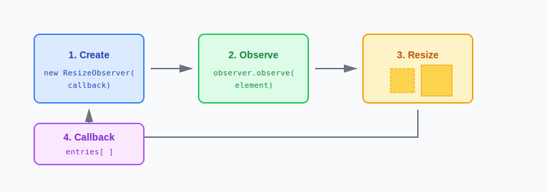
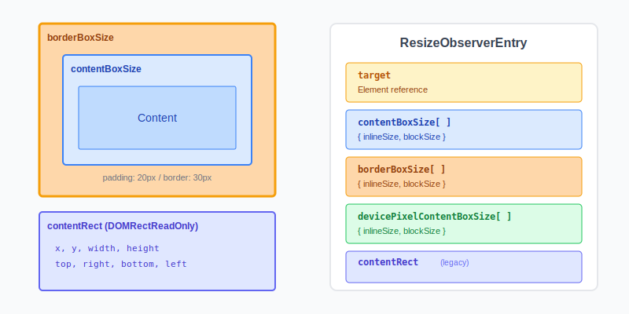
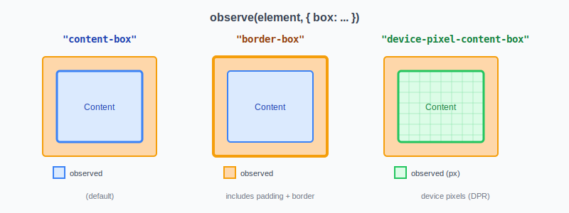

import {
  ResizeObserverBasicDemo,
  ResizeObserverBoxOptions,
  ResponsiveFontDemo
} from '@site/src/components/ExampleComponents/ResizeObserver';

## **為什麼需要 ResizeObserver？**

在過去，如果我們想要監聽元素尺寸的變化，通常會使用以下方法：

```javascript
// 方法 1：監聽 window resize 事件
window.addEventListener('resize', () => {
  const width = element.offsetWidth;
  // 處理尺寸變化...
});

// 方法 2：使用定時器輪詢
setInterval(() => {
  const width = element.offsetWidth;
  // 處理尺寸變化...
}, 100);
```

這些方法都有明顯的缺點：

| 方法            | 問題                                                                                     |
| --------------- | ---------------------------------------------------------------------------------------- |
| `window.resize` | 只能監聽視窗大小變化，無法偵測元素本身的尺寸改變（如內容變化、CSS 動畫、Flex/Grid 重排） |
| 定時器輪詢      | 效能差、耗電、無法及時反應變化                                                           |

**ResizeObserver** 是瀏覽器原生提供的 API，專門用來監聽**元素尺寸的變化**，不管是因為視窗縮放、CSS 變更、內容改變還是其他任何原因導致的尺寸變化，都能精準捕捉。

:::tip[ResizeObserver 的優勢]

- **元素級監聽**：直接監聽特定元素，不需要透過 `window.resize` 再去推算
- **自動效能優化**：瀏覽器會在適當時機批次處理多個尺寸變化，避免頻繁觸發
- **全方位捕捉**：不論是 CSS 動畫改變尺寸、Flexbox/Grid 重新排版、或是內容增減，都能偵測到

:::

<br/>

## **基本概念與運作原理**

ResizeObserver 的運作流程非常直觀：



1. **建立觀察者**：使用 `new ResizeObserver(callback)` 建立一個觀察者實例
2. **開始觀察**：呼叫 `observer.observe(element)` 開始監聽特定元素
3. **尺寸變化**：當元素尺寸發生任何變化時
4. **觸發回調**：瀏覽器會呼叫回調函數，並帶入一個包含所有被觀察元素變化資訊的陣列（每個元素的資訊稱為 `ResizeObserverEntry`，稍後會詳細說明）

### **基本語法**

```javascript
// 1. 建立 ResizeObserver 實例，傳入一個 callback 函數
const observer = new ResizeObserver((entries) => {
  // entries 是一個陣列，包含所有發生尺寸變化的元素資訊
  // 每個 entry 都是一個 ResizeObserverEntry 物件
  for (const entry of entries) {
    console.log('哪個元素變化了:', entry.target);
    console.log('新的尺寸資訊:', entry.contentBoxSize);
  }
});

// 2. 開始觀察目標元素
observer.observe(document.querySelector('.my-element'));

// 3. 不再需要時，停止觀察
observer.disconnect();
```

<br/>

## **ResizeObserver API 詳解**

### **建構函數**

```javascript
new ResizeObserver(callback)
```

建立一個新的 ResizeObserver 實例。

**callback 參數說明：**

```javascript
function callback(entries, observer) {
  // entries: ResizeObserverEntry[] - 包含所有發生變化的元素資訊
  // observer: ResizeObserver - 觀察者本身的參照
}
```

### **實例方法**

| 方法                        | 說明               |
| --------------------------- | ------------------ |
| `observe(target, options?)` | 開始觀察指定的元素 |
| `unobserve(target)`         | 停止觀察指定的元素 |
| `disconnect()`              | 停止觀察所有元素   |

**observe() 的 options 參數：**

`observe()` 方法可以接受第二個參數 `options`，用來指定要觀察哪種「box」的尺寸變化（詳見下方「Box 選項」章節）：

```javascript
const observer = new ResizeObserver(callback);

// 開始觀察（使用預設的 content-box）
observer.observe(element1);

// 開始觀察，並指定 box 選項
observer.observe(element2, { box: 'border-box' });

// 停止觀察單一元素
observer.unobserve(element1);

// 停止觀察所有元素
observer.disconnect();
```

<br/>

## **ResizeObserverEntry 物件**

當回調函數被呼叫時，會收到一個 `ResizeObserverEntry` 物件陣列。每當有被觀察的元素發生尺寸變化，就會在這個陣列中產生一個對應的 entry，包含該元素的尺寸資訊：



### **屬性說明**

| 屬性                        | 類型                 | 說明                                         |
| --------------------------- | -------------------- | -------------------------------------------- |
| `target`                    | Element              | 被觀察的元素參照                             |
| `contentBoxSize`            | ResizeObserverSize[] | 內容區域的尺寸（不含 padding/border）        |
| `borderBoxSize`             | ResizeObserverSize[] | 邊框區域的尺寸（含 padding/border）          |
| `devicePixelContentBoxSize` | ResizeObserverSize[] | 以裝置像素為單位的內容區域尺寸               |
| `contentRect`               | DOMRectReadOnly      | 內容區域的矩形資訊（舊版 API，已不建議使用） |

### **ResizeObserverSize 物件**

`contentBoxSize` 和 `borderBoxSize` 回傳的是 `ResizeObserverSize` 物件陣列，每個物件包含：

```javascript
{
  inlineSize: 300,  // 水平方向尺寸（通常是 width）
  blockSize: 200    // 垂直方向尺寸（通常是 height）
}
```

:::info[為什麼用 inlineSize / blockSize？]

這是為了支援不同的書寫模式（writing mode）。在水平書寫模式下，`inlineSize` 等於 width，`blockSize` 等於 height。在垂直書寫模式下則相反。

:::

### **使用範例**

```javascript
const observer = new ResizeObserver((entries) => {
  for (const entry of entries) {
    // 取得 contentBoxSize（建議使用）
    const { inlineSize, blockSize } = entry.contentBoxSize[0];
    
    console.log(`寬度: ${inlineSize}px`);
    console.log(`高度: ${blockSize}px`);
    
    // 也可以存取 borderBoxSize
    const borderSize = entry.borderBoxSize[0];
    console.log(`含邊框寬度: ${borderSize.inlineSize}px`);
  }
});
```

<br/>

## **互動範例：基本用法**

現在我們已經了解 `contentBoxSize`、`borderBoxSize` 等屬性的意義，試著拖曳下方盒子的右下角調整大小，觀察這些數值的即時變化：

<ResizeObserverBasicDemo />

<br/>

## **Box 選項**

在呼叫 `observe()` 時，可以透過 `options.box` 參數指定要觀察哪種 box 的尺寸：

```javascript
observer.observe(element, { box: 'content-box' });  // 預設值
observer.observe(element, { box: 'border-box' });
observer.observe(element, { box: 'device-pixel-content-box' });
```



### **三種 Box 選項**

| 選項                       | 說明                     | 使用時機                        |
| -------------------------- | ------------------------ | ------------------------------- |
| `content-box`              | 只計算內容區域（預設值） | 大多數情況適用                  |
| `border-box`               | 包含 padding 和 border   | 需要知道元素實際佔用空間時      |
| `device-pixel-content-box` | 以裝置像素計算的內容區域 | 需要精確像素對應時（如 Canvas） |

### **互動範例：Box 選項比較**

<ResizeObserverBoxOptions />

<br/>

## **實際應用範例**

### **響應式字體大小**

一個常見的應用是根據容器寬度動態調整字體大小，實現真正的「元素級」響應式設計：

<ResponsiveFontDemo />

### **核心程式碼**

```tsx
const ResponsiveText = () => {
  const containerRef = useRef<HTMLDivElement>(null);
  const [fontSize, setFontSize] = useState(16);

  useEffect(() => {
    const container = containerRef.current;
    if (!container) return;

    const observer = new ResizeObserver((entries) => {
      for (const entry of entries) {
        const width = entry.contentBoxSize[0].inlineSize;
        // 根據容器寬度計算字體大小
        const newSize = Math.min(32, Math.max(12, width / 15));
        setFontSize(newSize);
      }
    });

    observer.observe(container);
    return () => observer.disconnect();
  }, []);

  return (
    <div ref={containerRef}>
      <p style={{ fontSize }}>響應式文字</p>
    </div>
  );
};
```

### **其他應用場景**

- **圖表重繪**：當容器尺寸變化時，重新計算並繪製圖表
- **虛擬列表**：根據容器高度決定要渲染多少項目
- **響應式元件**：根據可用空間切換不同的佈局模式
- **Canvas/WebGL 調整**：同步更新畫布尺寸

<br/>

## **注意事項與最佳實踐**

### **1. 避免在回調中觸發無限迴圈**

如果在回調中修改被觀察元素的尺寸，可能導致無限迴圈：

```javascript
// ❌ 危險：可能導致無限迴圈
const observer = new ResizeObserver((entries) => {
  for (const entry of entries) {
    // 每次尺寸變化就+10，會不斷觸發新的變化
    entry.target.style.width = `${entry.contentBoxSize[0].inlineSize + 10}px`;
  }
});
```

瀏覽器會偵測這類迴圈並自動中斷，但會在 console 顯示錯誤訊息：`ResizeObserver loop completed with undelivered notifications`。

**建議解決方式：**

```javascript
// ✅ 使用 requestAnimationFrame 延遲處理
const observer = new ResizeObserver((entries) => {
  requestAnimationFrame(() => {
    for (const entry of entries) {
      // 處理尺寸變化...
    }
  });
});
```

### **2. 記得清理觀察者**

在 React 等框架中，務必在元件卸載時清理觀察者：

```tsx
useEffect(() => {
  const observer = new ResizeObserver(callback);
  observer.observe(element);
  
  // 清理函數
  return () => observer.disconnect();
}, []);
```

### **3. 回調會在初始觀察時立即觸發**

當呼叫 `observe()` 開始觀察一個元素時，回調函數會**立即被觸發一次**，回報該元素目前的尺寸。也就是說我們不需要額外的初始化邏輯來讀取初始尺寸：

```javascript
const observer = new ResizeObserver((entries) => {
  console.log('尺寸:', entries[0].contentBoxSize[0].inlineSize);
});

// 呼叫 observe 後，上面的 console.log 會立即執行一次
observer.observe(element);

// 輸出：尺寸: 300（假設元素目前寬度是 300px）
```

### **4. 多個元素變化會批次處理**

如果你同時觀察多個元素，當它們同時發生尺寸變化（例如視窗縮放時），瀏覽器不會為每個元素分別呼叫回調，而是會將所有變化**收集起來**，在同一次回調中一起回報：

```javascript
const observer = new ResizeObserver((entries) => {
  // entries 可能同時包含多個元素的變化資訊
  console.log(`這次有 ${entries.length} 個元素發生變化`);
  
  for (const entry of entries) {
    console.log(entry.target.id, entry.contentBoxSize[0].inlineSize);
  }
});

observer.observe(box1);  // id="box1"
observer.observe(box2);  // id="box2"
observer.observe(box3);  // id="box3"

// 當視窗縮放導致三個盒子同時變化時：
// 輸出：這次有 3 個元素發生變化
// 輸出：box1 250
// 輸出：box2 180
// 輸出：box3 320
```

這種批次處理機制有助於提升效能，避免回調被過於頻繁地呼叫。

<br/>

## **Reference**

- **[MDN - ResizeObserver](https://developer.mozilla.org/en-US/docs/Web/API/ResizeObserver)**
- **[MDN - ResizeObserverEntry](https://developer.mozilla.org/en-US/docs/Web/API/ResizeObserverEntry)**
- **[Web.dev - ResizeObserver](https://web.dev/resize-observer/)**
- **[LogRocket - Using the ResizeObserver API in React for responsive designs](https://blog.logrocket.com/using-resizeobserver-react-responsive-designs/)**
