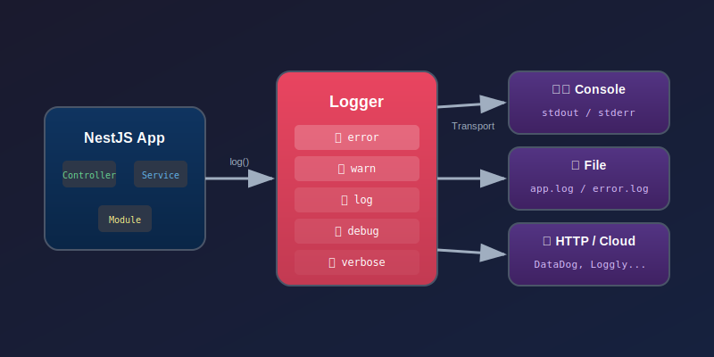
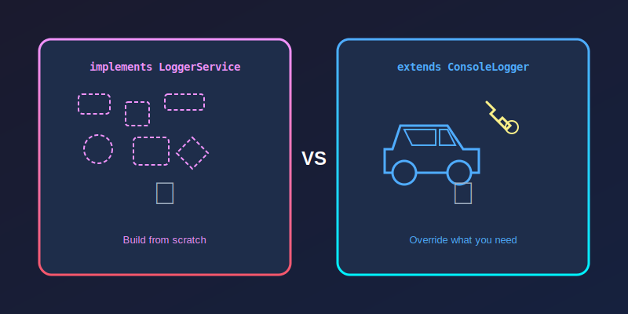
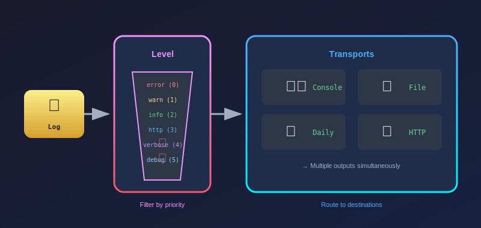
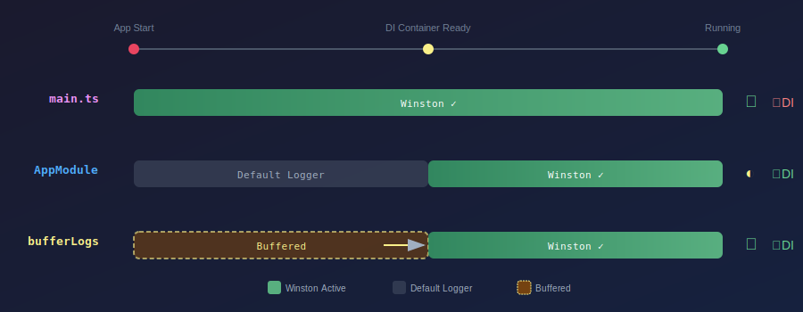

:::note[版本資訊]
本文內容基於 **NestJS v10** 撰寫，並適用於目前最新版本的 NestJS。Logger 的核心 API 在近期版本中保持穩定。
:::

日誌（Logging）是後端開發中不可或缺的一環。無論是除錯、監控還是追蹤問題，一個設計良好的日誌系統都能讓開發事半功倍。NestJS 內建了一套簡潔的日誌機制，同時也提供了高度彈性讓開發者整合第三方日誌套件。

這篇筆記會從最基礎的內建 Logger 開始，一步步說明如何自定義 Logger，最後介紹如何整合業界常用的 `Winston` 日誌套件。



<br/>


## **NestJS 內建 Logger**

NestJS 內建的 `Logger` 類別位於 `@nestjs/common`，開箱即用，不需要額外安裝任何套件。它提供了五種日誌等級，並會在終端機以不同顏色呈現。對於大多數的開發場景來說，內建 Logger 已經足夠使用；只有當需要更進階的功能（如寫入檔案、傳送到遠端服務）時，才需要考慮第三方套件。

### **基本使用方式**

在 Service、Controller 或任何地方使用 NestJS 內建 Logger 的方式非常直覺。我們可以在類別中建立一個 `private readonly logger` 屬性，並在建構時傳入類別名稱作為 **context**。這個 context 會出現在每條日誌的中括號中，方便開發者快速辨識這條日誌是從哪個模組發出的。

```typescript title="src/users/users.service.ts"
import { Injectable, Logger } from '@nestjs/common';

@Injectable()
export class UsersService {
  // highlight-next-line
  private readonly logger = new Logger(UsersService.name);

  findAll() {
    this.logger.log('正在查詢所有使用者');
    // ... 業務邏輯
  }

  findOne(id: string) {
    this.logger.debug(`查詢使用者 ID: ${id}`);
    // ...
  }

  create(dto: CreateUserDto) {
    this.logger.warn('這是一個警告訊息');
    this.logger.verbose('這是 verbose 層級的訊息');
  }
}
```

執行後，終端機會顯示類似這樣的輸出（顏色會根據日誌等級不同而變化）：

```bash
[Nest] 12345  - 12/24/2024, 2:30:00 PM     LOG [UsersService] 正在查詢所有使用者
[Nest] 12345  - 12/24/2024, 2:30:00 PM   DEBUG [UsersService] 查詢使用者 ID: abc123
[Nest] 12345  - 12/24/2024, 2:30:01 PM    WARN [UsersService] 這是一個警告訊息
[Nest] 12345  - 12/24/2024, 2:30:01 PM VERBOSE [UsersService] 這是 verbose 層級的訊息
```

:::tip[Context 的命名慣例]
傳入 `Logger` 建構子的字串稱為 **context**，官方慣例是使用 `ClassName.name` 來取得類別名稱。這樣即使之後重構更改類別名稱，日誌的 context 也會自動跟著變動，不需要手動修改字串。
:::

### **日誌等級說明**

NestJS 內建 Logger 提供五種日誌等級，從最嚴重到最詳細依序為：

| 等級      | 方法               | 用途說明                       |
| :-------- | :----------------- | :----------------------------- |
| `error`   | `logger.error()`   | 錯誤訊息，程式出現問題時使用   |
| `warn`    | `logger.warn()`    | 警告訊息，潛在問題但不影響運作 |
| `log`     | `logger.log()`     | 一般資訊，重要的業務流程紀錄   |
| `debug`   | `logger.debug()`   | 除錯資訊，開發時的詳細資訊     |
| `verbose` | `logger.verbose()` | 最詳細的資訊，通常用於追蹤問題 |

:::note
這邊有一點需要特別注意：**NestJS 的日誌等級命名與其他 Logger（如 Winston）略有不同**。NestJS 使用 `log` 而非 `info`，這是 NestJS 的設計選擇。在後續整合 Winston 時，`log` 會對應到 Winston 的 `info` 等級。
:::

### **error() 方法的特殊用法**

`error()` 方法比較特別，它可以同時傳入錯誤訊息和 stack trace，這在記錄例外時非常實用：

```typescript
try {
  // 可能會拋出例外的操作
  await this.dangerousOperation();
} catch (error) {
  // highlight-next-line
  this.logger.error('操作失敗', error.stack);
}
```

輸出結果會包含完整的 stack trace，方便追蹤問題：

```bash
[Nest] 12345  - 12/24/2024, 2:30:01 PM   ERROR [UsersService] 操作失敗
Error: Something went wrong
    at UsersService.dangerousOperation (/app/src/users/users.service.ts:25:11)
    at UsersService.create (/app/src/users/users.service.ts:18:12)
    ...
```

<br/>


## **調整內建 Logger 的行為**

內建 Logger 提供了幾個設定選項，讓開發者可以根據不同環境調整行為。這些設定通常在 `main.ts` 中的 `NestFactory.create()` 進行。

### **設定日誌等級**

在正式環境中，我們通常不需要看到 `debug` 和 `verbose` 層級的日誌，這時可以透過 `logger` 選項來過濾：

```typescript title="src/main.ts"
import { NestFactory } from '@nestjs/core';
import { AppModule } from './app.module';

async function bootstrap() {
  const app = await NestFactory.create(AppModule, {
    // highlight-start
    // 只顯示 error, warn, log 等級的日誌
    logger: ['error', 'warn', 'log'],
    // highlight-end
  });
  await app.listen(3000);
}
bootstrap();
```

在正式專案中我們常會用到的環境判斷要顯示的日誌等級：

```typescript title="src/main.ts" {3-5}
const app = await NestFactory.create(AppModule, {
  logger:
    process.env.NODE_ENV === 'production'
      ? ['error', 'warn', 'log']              // 正式環境：只顯示重要訊息
      : ['error', 'warn', 'log', 'debug', 'verbose'], // 開發環境：顯示全部
});
```

:::note[日誌等級的過濾邏輯]
傳入的陣列代表「要顯示哪些等級」，而不是「最低等級」。舉例來說，如果只傳入 `['error']`，那就只會看到 error 等級的日誌，其他全部被過濾掉。這與 Winston 的 `level` 設定邏輯不同，需要特別注意。
:::

### **完全停用 Logger**

如果想要完全關閉日誌輸出（例如在跑測試時不想看到一堆日誌）：

```typescript
const app = await NestFactory.create(AppModule, {
  logger: false,
});
```

### **自定義 ConsoleLogger 選項**

NestJS 也提供了 `ConsoleLogger` 類別，可以透過建構子設定更細緻的選項。以下是幾個常用的設定：

```typescript title="src/main.ts"
import { NestFactory } from '@nestjs/core';
import { ConsoleLogger } from '@nestjs/common';
import { AppModule } from './app.module';

async function bootstrap() {
  const app = await NestFactory.create(AppModule, {
    logger: new ConsoleLogger({
      // highlight-start
      prefix: 'MyApp',     // 自訂前綴，預設是 "Nest"
      timestamp: true,     // 啟用時間戳記
      logLevels: ['error', 'warn', 'log'],
      // highlight-end
    }),
  });
  await app.listen(3000);
}
bootstrap();
```

設定 `prefix: 'MyApp'` 後，日誌輸出會變成：

```bash
# 設定前（預設）
[Nest] 12345  - 12/24/2024, 2:30:00 PM     LOG [UsersService] 正在查詢...

# 設定後
[MyApp] 12345  - 12/24/2024, 2:30:00 PM     LOG [UsersService] 正在查詢...
```

### **啟用單條日誌的時間戳記**

如果想在個別的 Logger 實體上啟用時間戳記，可以在建構子的第二個參數傳入 `{ timestamp: true }`。啟用後，每條日誌會顯示**與上一條日誌的時間差**：

```typescript
private readonly logger = new Logger(MyService.name, { timestamp: true });

// 使用方式
this.logger.log('步驟一開始');
// ... 一些耗時操作
this.logger.log('步驟一完成');
```

輸出結果會像這樣，注意最後的 `+125ms` 就是時間差：

```bash
[Nest] 12345  - 12/24/2024, 2:30:00 PM     LOG [MyService] 步驟一開始 +0ms
[Nest] 12345  - 12/24/2024, 2:30:00 PM     LOG [MyService] 步驟一完成 +125ms
```

這個功能在分析效能瓶頸時特別有用，可以快速看出每個步驟花了多少時間，找出拖慢整體效能的環節。

<br/>


## **自定義 Logger**

當內建 Logger 無法滿足需求時，NestJS 提供了兩種方式來自定義 Logger。這兩種方式各有適用場景，理解它們的差異能幫助開發者選擇最合適的方案。



### **方式一：implements LoggerService**

`LoggerService` 是 NestJS 定義的 Logger 介面，它規定了一個 Logger 必須具備哪些方法。實作這個介面就像是拿到一份「零件圖紙」，NestJS 只告訴我們需要提供哪些功能（`log`、`error`、`warn` 等），至於這些功能內部要怎麼實作，則完全由開發者自己決定。

這種方式給予最大的自由度，特別適合用來整合第三方日誌套件（如 Winston、Pino）。因為我們可以在每個方法內部呼叫第三方套件的 API，讓 NestJS 產生的日誌都透過該套件處理。

```typescript title="src/logger/my-custom.logger.ts"
import { LoggerService } from '@nestjs/common';

export class MyCustomLogger implements LoggerService {
  // highlight-start
  // 必須實作的方法
  log(message: any, context?: string) { /* ... */ }
  error(message: any, trace?: string, context?: string) { /* ... */ }
  warn(message: any, context?: string) { /* ... */ }
  
  // 選填的方法
  debug?(message: any, context?: string) { /* ... */ }
  verbose?(message: any, context?: string) { /* ... */ }
  // highlight-end
}
```

使用這種方式，開發者需要自己實作所有的日誌輸出邏輯，包括格式化、著色、時間戳記等。好處是可以完全掌控日誌的行為，壞處是工作量較大，需要處理很多細節。

### **方式二：extends ConsoleLogger**

如果只是想在既有功能上做一些調整（例如在錯誤發生時額外發送通知），繼承 `ConsoleLogger` 會更快速。它就像是「拿到一台已經組好的車，只需要改裝想換的零件」。

```typescript title="src/logger/my-extended.logger.ts"
import { ConsoleLogger } from '@nestjs/common';

export class MyExtendedLogger extends ConsoleLogger {
  // highlight-start
  // 只覆寫想修改的方法
  error(message: any, stack?: string, context?: string) {
    // 自訂邏輯：例如發送到錯誤追蹤服務
    this.sendToErrorTracker(message, stack);

    // 呼叫父類別的方法，保留原本的終端機輸出
    super.error(message, stack, context);
  }
  // highlight-end

  private sendToErrorTracker(message: any, stack?: string) {
    // 發送到 Sentry、Bugsnag 等服務
  }
}
```

這種方式保留了內建 ConsoleLogger 的所有功能（彩色輸出、Context 前綴、時間戳記等），開發者只需要覆寫想要修改的方法即可。

### **如何選擇？**

| 情境                                  | 建議方式                   |
| :------------------------------------ | :------------------------- |
| 整合第三方 Logger（Winston、Pino 等） | `implements LoggerService` |
| 只需要小幅修改既有行為                | `extends ConsoleLogger`    |
| 想保留彩色輸出、Context 等功能        | `extends ConsoleLogger`    |
| 需要完全客製化格式                    | `implements LoggerService` |

:::tip
在實務專案中，我通常會選擇使用社群已經封裝好的套件（如 `nest-winston`），而不是自己從頭實作。這樣可以省下很多時間，也能獲得經過驗證的穩定性。只有在有特殊需求時，才會考慮自己實作。
:::

<br/>


## **整合 Winston 日誌套件**

前面提到，當需要更進階的日誌功能（如寫入檔案、傳送到雲端服務、自定義格式）時，就需要考慮使用第三方日誌套件。在 Node.js 生態系中，最流行的日誌套件包括：

- **[Winston](https://github.com/winstonjs/winston)**：功能最完整，社群最大，支援多種 transport
- **[Pino](https://github.com/pinojs/pino)**：效能導向，適合高流量場景
- **[Bunyan](https://github.com/trentm/node-bunyan)**：JSON 格式為主，適合結構化日誌

> 這篇文章會以 **Winston** 為例進行說明，因為它是最多人使用的選擇，文件和社群資源也最豐富。

### **Winston 核心概念**

在開始整合之前，先來了解 Winston 的三個核心概念：**Level**（日誌等級）、**Format**（輸出格式）和 **Transports**（輸出目的地）。這會幫助理解後續的設定為什麼要這樣寫。



### **Level：過濾哪些日誌值得被處理**

`level` 可以想像成「過濾網」，決定多嚴重的訊息才值得被處理。Winston 的日誌等級數值**越小越嚴重**：

```
error:   0  (最嚴重)
warn:    1
info:    2
http:    3
verbose: 4
debug:   5
silly:   6  (最不嚴重)
```

當設定 `level: 'info'` 時，代表 `info`（2）以及更嚴重的等級（`warn`=1、`error`=0）會被處理，而比 `info` 更不嚴重的等級（`http`=3、`debug`=5 等）會被過濾掉。

:::info[與 NestJS Logger 的等級對應]
NestJS 的 `log` 方法對應到 Winston 的 `info` 等級，`verbose` 對應到 Winston 的 `verbose`。這個對應關係在使用 `nest-winston` 時會自動處理，開發者不需要擔心。
:::

### **Format：日誌要長什麼樣子**

`format` 決定日誌輸出的樣式。Winston 提供了多種內建的 format，也可以組合使用：

| Format               | 說明                             | 適用場景               |
| :------------------- | :------------------------------- | :--------------------- |
| `format.simple()`    | 簡單的文字格式：`level: message` | 開發環境快速查看       |
| `format.json()`      | JSON 格式                        | 正式環境、日誌分析工具 |
| `format.timestamp()` | 加入時間戳記                     | 所有場景               |
| `format.colorize()`  | 根據等級加上顏色                 | 終端機顯示             |
| `format.printf()`    | 完全自定義輸出格式               | 需要特定格式時         |

實務上最常見的用法是使用 `format.combine()` 組合多個 format：

```typescript
import * as winston from 'winston';

// 開發環境：彩色 + 時間戳記 + 自定義格式
const devFormat = winston.format.combine(
  winston.format.timestamp({ format: 'HH:mm:ss' }),
  winston.format.colorize({ all: true }),
  // highlight-start
  winston.format.printf(({ timestamp, level, message, context }) => {
    return `${timestamp} ${level} [${context}] ${message}`;
  }),
  // highlight-end
);

// 正式環境：JSON 格式，方便機器解析
const prodFormat = winston.format.combine(
  winston.format.timestamp(),
  winston.format.json(),
);
```

### **Transports：日誌要送去哪裡**

`transports` 可以想像成「運輸車」，決定日誌要送到哪些目的地。Winston 允許同時設定多個 transport，這意味著**一條日誌可以同時輸出到多個地方**——例如即時顯示在終端機，同時也寫入檔案保存。

| Transport         | 說明                                 | 適用場景         |
| :---------------- | :----------------------------------- | :--------------- |
| `Console`         | 輸出到終端機                         | 開發時即時查看   |
| `File`            | 寫入單一檔案                         | 保存歷史紀錄     |
| `DailyRotateFile` | 每日自動產生新檔案（需安裝額外套件） | 避免單一檔案過大 |
| `Http`            | 傳送到遠端 HTTP 端點                 | 整合雲端日誌服務 |

<br/>


## **使用 nest-winston（推薦）**

如前所述，整合第三方 Logger 需要自己實作 `LoggerService` 介面——這意味著要處理日誌格式化、等級對應、Context 傳遞等繁瑣細節。幸好，社群已經有人幫我們做好這些事了。

[nest-winston](https://github.com/gremo/nest-winston) 是一個專門用來整合 NestJS 與 Winston 的套件，它內部已經實作好了 `LoggerService`，開發者只需要專注在 Winston 的設定上即可。這大幅降低了整合的門檻，也是大多數 NestJS 專案整合 Winston 時的首選方案。

### **安裝套件**

```bash
npm install nest-winston winston

# 如果需要日誌檔案每日輪替功能
npm install winston-daily-rotate-file
```

### **使用 nestLike 格式**

`nest-winston` 提供了一個非常實用的 `utilities.format.nestLike()` 函數，可以讓 Winston 的輸出格式**看起來跟 NestJS 內建 Logger 一模一樣**——包括彩色的日誌等級、中括號包住的 context、時間戳記等。

```typescript title="src/main.ts"
import { NestFactory } from '@nestjs/core';
import { WinstonModule, utilities as nestWinstonModuleUtilities } from 'nest-winston';
import * as winston from 'winston';
import { AppModule } from './app.module';

async function bootstrap() {
  const app = await NestFactory.create(AppModule, {
    logger: WinstonModule.createLogger({
      transports: [
        new winston.transports.Console({
          // highlight-start
          format: winston.format.combine(
            winston.format.timestamp(),
            nestWinstonModuleUtilities.format.nestLike('MyApp', {
              prettyPrint: true,   // 格式化 JSON 物件
              colors: true,        // 啟用彩色輸出
            }),
          ),
          // highlight-end
        }),
      ],
    }),
  });

  await app.listen(3000);
}
bootstrap();
```

使用 `nestLike` 後，輸出會長得像這樣，跟 NestJS 內建 Logger 的風格一致：

```bash
[MyApp] 12345  - 12/29/2024, 4:30:00 PM     LOG [UsersService] 查詢所有使用者
[MyApp] 12345  - 12/29/2024, 4:30:01 PM   ERROR [UsersService] 資料庫連線失敗
```

`nestLike` 的第一個參數是 **App Name**（對應原本 `[Nest]` 的位置），第二個參數是選項物件：

| 選項          | 說明                             | 預設值  |
| :------------ | :------------------------------- | :------ |
| `colors`      | 是否啟用彩色輸出                 | `true`  |
| `prettyPrint` | 是否格式化 JSON 物件（多行顯示） | `false` |
| `processId`   | 是否顯示 Process ID              | `true`  |

:::tip[什麼時候該用 nestLike？]
如果團隊已經習慣 NestJS 內建 Logger 的輸出格式，使用 `nestLike` 可以讓過渡到 Winston 時更加無痛——日誌格式看起來一樣，但底層已經是功能更強大的 Winston。
:::

### **兩種註冊方式的差異**

`nest-winston` 提供兩種註冊方式，差別在於 **「誰來管理 Logger 的生命週期」**。這個選擇會影響到能不能**捕獲 NestJS 啟動階段的日誌**，以及能不能使用**依賴注入**。



從上圖可以看到三種策略的時間軸差異：

1. **main.ts 註冊**：從 App 啟動開始就使用 Winston，可以捕獲所有日誌，但無法使用 DI
2. **AppModule 註冊**：在 DI 容器準備好後才使用 Winston，但是啟動階段的日誌會用 NestJS 預設的 Logger
3. **bufferLogs**：結合兩者優點，啟動時先暫存日誌，DI 準備好後再用 Winston 輸出

### **方式一：在 main.ts 註冊**

這種方式可以捕獲到 **NestJS 啟動階段的所有日誌**，包括模組載入、依賴注入等訊息。

```typescript title="src/main.ts"
import { NestFactory } from '@nestjs/core';
import { WinstonModule } from 'nest-winston';
import * as winston from 'winston';
import { AppModule } from './app.module';

async function bootstrap() {
  const app = await NestFactory.create(AppModule, {
    // highlight-start
    logger: WinstonModule.createLogger({
      transports: [
        new winston.transports.Console({
          format: winston.format.combine(
            winston.format.timestamp(),
            winston.format.colorize(),
            winston.format.simple(),
          ),
        }),
      ],
    }),
    // highlight-end
  });

  await app.listen(3000);
}
bootstrap();
```

- **優點：** 可捕獲啟動階段的所有日誌，全域統一的日誌格式
- **缺點：** 無法使用依賴注入（DI），無法使用 `ConfigService` 讀取環境變數

### **方式二：在 AppModule 註冊**

這種方式可以使用 `forRootAsync` 搭配 `ConfigService` 來動態設定 Logger，非常適合需要根據環境變數調整設定的場景。

```typescript title="src/app.module.ts"
import { Module } from '@nestjs/common';
import { ConfigModule, ConfigService } from '@nestjs/config';
import { WinstonModule, utilities as nestWinstonModuleUtilities } from 'nest-winston';
import * as winston from 'winston';

@Module({
  imports: [
    ConfigModule.forRoot(),
    // highlight-start
    WinstonModule.forRootAsync({
      imports: [ConfigModule],
      inject: [ConfigService],
      useFactory: (configService: ConfigService) => ({
        level: configService.get('LOG_LEVEL', 'info'),
        transports: [
          new winston.transports.Console({
            format: winston.format.combine(
              winston.format.timestamp(),
              nestWinstonModuleUtilities.format.nestLike('MyApp'),
            ),
          }),
          // 只在正式環境寫入檔案
          ...(configService.get('NODE_ENV') === 'production'
            ? [new winston.transports.File({ filename: 'logs/app.log' })]
            : []),
        ],
      }),
    }),
    // highlight-end
  ],
})
export class AppModule {}
```

由於 Logger 是在 AppModule 初始化時才建立，所以在 `main.ts` 中需要**手動從 DI 容器取出並掛載**：

```typescript title="src/main.ts"
import { NestFactory } from '@nestjs/core';
import { WINSTON_MODULE_NEST_PROVIDER } from 'nest-winston';
import { AppModule } from './app.module';

async function bootstrap() {
  // highlight-next-line
  const app = await NestFactory.create(AppModule);

  // 從 DI 容器取出 Winston Logger 並掛載為全域 Logger
  // highlight-next-line
  app.useLogger(app.get(WINSTON_MODULE_NEST_PROVIDER));

  await app.listen(3000);
}
bootstrap();
```

- **優點：** 可使用 DI，靈活讀取 `ConfigService`
- **缺點：** 無法捕獲啟動階段的日誌（在 `app.useLogger()` 執行之前的日誌會使用 NestJS 預設的 ConsoleLogger 輸出）


### **最佳實踐：AppModule 註冊 + bufferLogs**

方式二有一個小缺點：在 DI 容器初始化完成之前，NestJS 啟動階段的日誌（如模組載入、依賴注入過程）會使用預設的 ConsoleLogger 輸出，格式會與後續的 Winston 日誌不一致。

如果**既想要使用 DI 功能**（如讀取 `ConfigService`），**又想要讓所有日誌都走 Winston**，可以加上 `bufferLogs: true`：

```typescript title="src/main.ts"
import { NestFactory } from '@nestjs/core';
import { WINSTON_MODULE_NEST_PROVIDER } from 'nest-winston';
import { AppModule } from './app.module';

async function bootstrap() {
  const app = await NestFactory.create(AppModule, {
    // highlight-next-line
    bufferLogs: true, // 暫存啟動階段的日誌
  });

  // 掛載 Winston 為全域 Logger，暫存的日誌會一次補印出來
  // highlight-next-line
  app.useLogger(app.get(WINSTON_MODULE_NEST_PROVIDER));

  await app.listen(3000);
}
bootstrap();
```

這個技巧的運作原理：

1. **`bufferLogs: true`**：告訴 NestJS 先把啟動時的日誌**暫存在記憶體**，不要輸出
2. **`app.get(WINSTON_MODULE_NEST_PROVIDER)`**：從已經初始化完成的 DI 容器中取出 Winston 實體
3. **`app.useLogger(...)`**：正式掛載為全域 Logger，這時剛剛暫存的日誌會**一次補印出來**，而且格式會與後續日誌一致

:::tip[為什麼可以直接用 new Logger()？]
設定完 `app.useLogger()` 之後，在任何地方使用 `new Logger()` 都會自動走 Winston。這是因為 NestJS 內建的 `Logger` 類別其實是一個**代理（Proxy）**：

- 沒有執行 `app.useLogger()` → 訊息傳給預設的 ConsoleLogger
- 執行了 `app.useLogger(winstonLogger)` → 訊息轉發給 Winston

這個設計讓開發者可以在任何地方使用熟悉的 `new Logger()` 語法，不需要每次都注入 Logger。
:::

<br/>


## **在程式碼中使用 Logger**

整合完 Winston 之後，有兩種方式可以在程式碼中使用 Logger。

### **方式一：直接實體化（推薦）**

如果已經透過 `app.useLogger()` 設定了全域 Logger，可以直接實體化 NestJS 內建的 `Logger`：

```typescript title="src/users/users.service.ts"
import { Injectable, Logger } from '@nestjs/common';

@Injectable()
export class UsersService {
  // highlight-next-line
  private readonly logger = new Logger(UsersService.name);

  findAll() {
    this.logger.log('查詢所有使用者');
    this.logger.debug('取得 25 筆資料');
  }
}
```

雖然程式碼看起來和使用內建 Logger 一模一樣，但因為已經設定了全域 Logger，這些日誌會自動走 Winston，這也是我個人比較偏好的方式。輸出結果會根據 Winston 的 format 設定而變化：

```bash
# 假設使用開發環境的 format
14:30:00 info [UsersService] 查詢所有使用者
14:30:00 debug [UsersService] 取得 25 筆資料
```

### **方式二：注入 Winston 原生實體**

如果需要使用 Winston 的原生 API（例如傳入額外的 metadata），可以直接注入 Winston 實體：

```typescript title="src/users/users.service.ts"
import { Injectable, Inject } from '@nestjs/common';
import { WINSTON_MODULE_PROVIDER } from 'nest-winston';
import { Logger } from 'winston';

@Injectable()
export class UsersService {
  constructor(
    // highlight-next-line
    @Inject(WINSTON_MODULE_PROVIDER) private readonly winstonLogger: Logger,
  ) {}

  findAll() {
    // 使用 Winston 原生 API，可以傳入額外的 metadata
    this.winstonLogger.info('查詢所有使用者', {
      action: 'findAll',
      userId: 'user-123',
    });
  }
}
```

這種方式的輸出會包含傳入的 metadata（以 JSON format 為例）：

```json
{"level":"info","message":"查詢所有使用者","action":"findAll","userId":"user-123"}
```

<br/>


## **完整的 Winston 設定範例**

最後，來看一個我在實務專案中常用的 Winston 設定。這個設定涵蓋了開發和正式環境的不同需求。

```typescript title="src/logger/winston.config.ts"
import { WinstonModuleOptions } from 'nest-winston';
import * as winston from 'winston';
import 'winston-daily-rotate-file';

// 開發環境：彩色輸出，方便閱讀
const devFormat = winston.format.combine(
  winston.format.timestamp({ format: 'HH:mm:ss' }),
  winston.format.colorize({ all: true }),
  // highlight-start
  winston.format.printf(({ timestamp, level, message, context }) => {
    return `${timestamp} ${level} [${context}] ${message}`;
  }),
  // highlight-end
);

// 正式環境：JSON 格式，方便機器解析
const prodFormat = winston.format.combine(
  winston.format.timestamp(),
  winston.format.json(),
);

export const createWinstonConfig = (
  nodeEnv: string,
  logLevel: string,
): WinstonModuleOptions => {
  const isDev = nodeEnv !== 'production';

  return {
    level: logLevel,
    transports: [
      new winston.transports.Console({
        format: isDev ? devFormat : prodFormat,
      }),

      // highlight-start
      // 正式環境才啟用檔案日誌
      ...(isDev ? [] : [
        // 錯誤日誌單獨存放
        new winston.transports.File({
          filename: 'logs/error.log',
          level: 'error',
        }),
        // 每日輪替，自動管理檔案
        new winston.transports.DailyRotateFile({
          filename: 'logs/app-%DATE%.log',
          datePattern: 'YYYY-MM-DD',
          maxSize: '20m',
          maxFiles: '14d',
        }),
      ]),
      // highlight-end
    ],
  };
};
```

開發環境的輸出會長這樣（彩色、易讀）：

```
14:30:00 info [UsersService] 查詢所有使用者
14:30:01 debug [UsersService] 取得 25 筆資料
14:30:02 error [UsersService] 資料庫連線失敗
```

正式環境的輸出會長這樣（JSON 格式、方便機器解析）：

```json
{"level":"info","message":"查詢所有使用者","context":"UsersService","timestamp":"2024-12-24T06:30:00.000Z"}
{"level":"error","message":"資料庫連線失敗","context":"UsersService","timestamp":"2024-12-24T06:30:02.000Z"}
```

<br/>


## **Reference**

- **[NestJS - Logger](https://docs.nestjs.com/techniques/logger)**
- **[Winston - GitHub](https://github.com/winstonjs/winston)**
- **[nest-winston - GitHub](https://github.com/gremo/nest-winston)**
- **[winston-daily-rotate-file - GitHub](https://github.com/winstonjs/winston-daily-rotate-file)**
