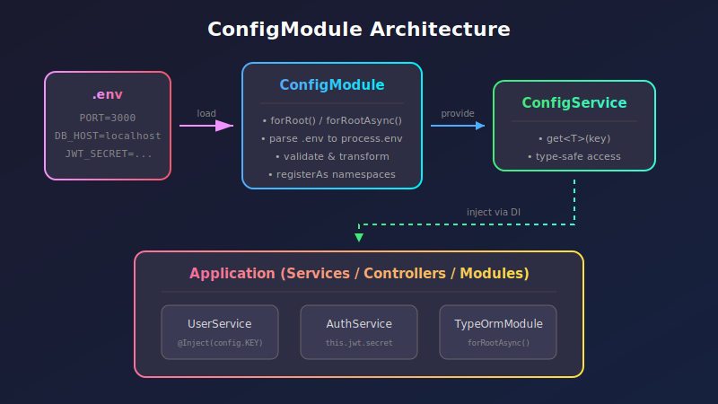
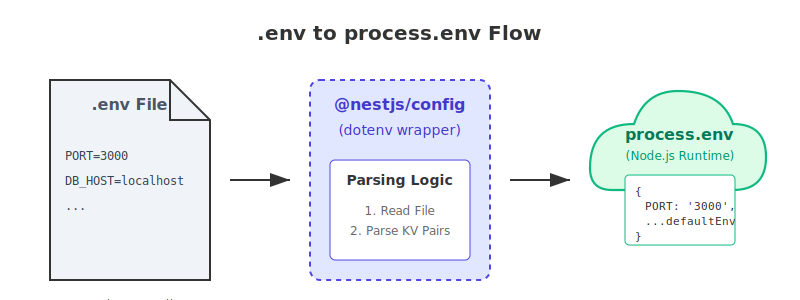
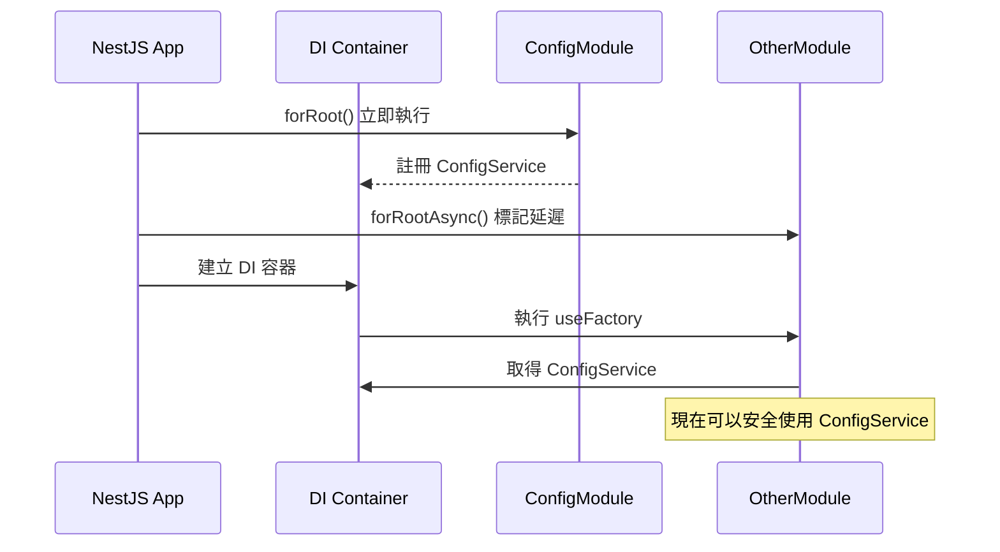

:::note[版本資訊]
本文內容基於 **NestJS v10** 與 **@nestjs/config v3** 撰寫，並適用於目前最新版本的 NestJS。ConfigModule 的核心 API 在 v2 以後保持穩定，大多數概念在未來版本中應能持續適用。
:::

在開發後端應用程式時，資料庫連線字串、第三方服務的 API Key，到不同環境的行為開關，這些敏感且多變的資訊不會被寫死在程式碼裡，因此環境變數管理是一個繞不開的課題。

NestJS 提供了 `@nestjs/config` 套件，讓環境變數的管理變得結構化且型別安全。這篇筆記會從最基礎的 `.env` 檔案觀念開始，逐步深入到命名空間配置、自動驗證與型別轉換等進階主題。



<br/>


## **開始之前：理解 .env 與 process.env**

在深入 NestJS 的 `ConfigModule` 之前，我們需要先釐清一個常被忽略的基礎觀念：**Node.js 本身並不認識 `.env` 檔案**。

### **Node.js 如何讀取環境變數？**

Node.js 只會讀取**作業系統層級**的環境變數，也就是透過 shell 設定的變數。例如在終端機執行：

```bash
# 透過 shell 設定環境變數
export PORT=3000
export DATABASE_URL="postgres://localhost:5432/mydb"

# 啟動 Node.js 應用程式
node app.js
```

這時在程式碼中就可以透過 `process.env` 這個全域物件來存取這些值：

```typescript
console.log(process.env.PORT);         // '3000'
console.log(process.env.DATABASE_URL); // 'postgres://localhost:5432/mydb'
```

但這種方式在實務上非常不便——每次換環境都要重新設定 shell 變數，而且這些設定容易遺失、難以版控。

### **為什麼需要 .env 檔案？**

所以社群發展出 `.env` 檔案這種作法，把環境變數都寫在同一個檔案裡，方便管理：

```env title=".env"
PORT=3000
DATABASE_URL=postgres://localhost:5432/mydb
JWT_SECRET=my-super-secret-key
```

但這裡有個關鍵：**`.env` 只是一個純文字檔案**，Node.js 不會自動去讀它。要讓這些值進入 `process.env`，必須透過一個**解析器（Parser）**——最常見的就是 [dotenv](https://github.com/motdotla/dotenv) 套件。

```typescript
// 傳統作法：手動使用 dotenv
import * as dotenv from 'dotenv';

dotenv.config(); // 讀取 .env 並寫入 process.env

console.log(process.env.PORT); // '3000'
```

### **ConfigModule 幫我們做了什麼？**



NestJS 的 `ConfigModule` 在背後封裝了 dotenv，並且額外提供了許多便利功能。當我們呼叫 `ConfigModule.forRoot()` 時，它會完成以下步驟：

1. **載入（Loading）：** 尋找專案根目錄下的 `.env` 檔案
2. **解析（Parsing）：** 把 `.env` 裡的 `KEY=VALUE` 轉成 JavaScript 物件
3. **寫入（Assigning）：** 將這些值賦予給 `process.env`
4. **封裝（Encapsulation）：** 把這些值存進 `ConfigService`，提供更安全的存取方式

:::warning[重要觀念]
雖然 ConfigModule 會把 `.env` 的值寫入 `process.env`，但比起直接在程式碼中使用 `process.env`，比較建議使用 `ConfigService` 來存取，原因包括：

- **型別安全:** `process.env` 的值永遠是 `string | undefined`，容易出錯
- **統一管理:** 透過 ConfigService 可以搭配驗證、轉型、預設值等功能
- **更好的測試性:** ConfigService 可以在測試時輕鬆 mock
:::

### **如果沒有用 ConfigModule 呢？**

那麼如果我不使用 ConfigModule，少了上面的載入、解析、寫入等步驟，還能讀取環境變數嗎？**可以，但只能讀取作業系統層級的變數，無法讀取 `.env` 檔案**。

```typescript
// 沒有使用任何套件
console.log(process.env.PORT); // undefined（除非在 shell 中設定過）
```

這就是為什麼在 NestJS 專案中，ConfigModule 幾乎是必備的基礎設施之一。

<br/>


## **快速開始：安裝與基本設定**

### **安裝套件**

```bash
npm install @nestjs/config
```

### **在 AppModule 中導入**

```typescript title="src/app.module.ts"
import { Module } from '@nestjs/common';
import { ConfigModule } from '@nestjs/config';

@Module({
  imports: [
    // highlight-next-line
    ConfigModule.forRoot(),
  ],
})
export class AppModule {}
```

只需要這一行，ConfigModule 就會開始工作：

- 讀取專案根目錄下的 `.env` 檔案
- 解析並載入到 `process.env`
- 註冊 `ConfigService` 供其他地方使用

### **建立 .env 檔案**

```env title=".env"
# 應用程式設定
PORT=3000
NODE_ENV=development

# 資料庫設定
DATABASE_HOST=localhost
DATABASE_PORT=5432
DATABASE_NAME=myapp
```

:::tip[.env 的值永遠是字串]
一個常被忽略的細節：**`.env` 檔案中的所有值都是字串（String）**。即使寫 `PORT=3000`，讀取出來的也是字串 `'3000'` 而非數字 `3000`。

```typescript
const port = process.env.PORT;
console.log(typeof port); // 'string'
console.log(port === 3000); // false
console.log(port === '3000'); // true
```

這就是為什麼後面會介紹驗證與轉型機制——它們可以幫我們自動處理這個問題。
:::

### **使用 ConfigService 讀取設定**

在任何需要讀取環境變數的地方，透過依賴注入取得 `ConfigService`：

```typescript title="src/app.service.ts"
import { Injectable } from '@nestjs/common';
import { ConfigService } from '@nestjs/config';

@Injectable()
export class AppService {
  constructor(
    // highlight-next-line
    private readonly configService: ConfigService,
  ) {}

  getDatabaseConfig() {
    // highlight-start
    return {
      host: this.configService.get<string>('DATABASE_HOST'),
      port: this.configService.get<number>('DATABASE_PORT'),
      name: this.configService.get<string>('DATABASE_NAME'),
    };
    // highlight-end
  }
}
```

`get()` 方法支援泛型參數來指定回傳型別，第二個參數可以提供預設值：

```typescript
// 有預設值的情況
const port = this.configService.get<number>('PORT', 3000);

// 沒有預設值時，可能回傳 undefined
const secret = this.configService.get<string>('JWT_SECRET');
```

<br/>


## **理解 forRoot 與 forRootAsync**

前面在 AppModule 中，我們使用了 `ConfigModule.forRoot()` 來初始化配置。但是，為什麼不是直接 `imports: [ConfigModule]` 就好，而要呼叫 `.forRoot()` 這個方法？

### **forRoot() 的用途：動態傳遞配置**

這是因為如果直接 import 一個模組，它的行為是固定的。但很多時候，我們需要在 import 時傳遞一些參數來自定義模組的行為。`.forRoot()` 就是提供這種「動態配置」能力的模式：

```typescript title="src/app.module.ts"
@Module({
  imports: [
    // 使用 forRoot() - 可以傳入參數來自定義行為
    // highlight-start
    ConfigModule.forRoot({
      envFilePath: '.env.production',  // 指定 .env 檔案路徑
      isGlobal: true,                  // 設定為全域模組
      cache: true,                     // 啟用快取
    }),
    // highlight-end
  ],
})
export class AppModule {}
```

這種模式在 NestJS 生態系中非常常見，例如 TypeOrmModule、JwtModule、PassportModule 等都提供了 `forRoot()` 方法來接收配置參數。

### **forRootAsync()：當配置需要依賴其他 Provider**

有時候，我們想傳給 `forRoot()` 的參數不是寫死的，而是需要從其他地方取得。例如，資料庫連線資訊存在 `.env` 裡，我們需要透過 `ConfigService` 來讀取：

```typescript title="src/app.module.ts"
import { Module } from '@nestjs/common';
import { ConfigModule, ConfigService } from '@nestjs/config';
import { TypeOrmModule } from '@nestjs/typeorm';

@Module({
  imports: [
    ConfigModule.forRoot({ isGlobal: true }),
    
    // highlight-start
    // TypeOrmModule 需要用到 ConfigService 來讀取 .env 的值
    // 所以必須用 forRootAsync 來確保 ConfigService 已準備好
    TypeOrmModule.forRootAsync({
      inject: [ConfigService],
      useFactory: (configService: ConfigService) => ({
        type: 'postgres',
        host: configService.get<string>('DATABASE_HOST'),
        port: configService.get<number>('DATABASE_PORT'),
        database: configService.get<string>('DATABASE_NAME'),
        // ... 其他設定
      }),
    }),
    // highlight-end
  ],
})
export class AppModule {}
```

簡單來說，`forRootAsync()` 的 `useFactory` 會**延遲執行**，等到 DI 容器準備好後才會被呼叫。下面這張圖可以幫助理解兩者的時機差異：



:::tip[何時使用 forRootAsync？]
簡單的判斷準則：**如果需要在模組設定中使用任何 Provider（包括 ConfigService），就應該使用 `forRootAsync()`**。
:::

<br/>


## **ConfigModule 的常用設定選項**

前面只用了最簡單的 `ConfigModule.forRoot()` 來初始化，但其實這個方法接受一個選項物件，可以進行更細緻的設定。以下介紹幾個最常用的選項：

### **isGlobal：不需要在每個模組中手動 import**

```typescript
ConfigModule.forRoot({
  isGlobal: true,
})
```

設定 `isGlobal: true` 後，`ConfigService` 會變成全域可用的 Provider。意思是其他模組中的 Service **不需要在該模組中 import ConfigModule**，就可以直接注入 ConfigService：

```typescript title="src/users/users.service.ts"
import { Injectable } from '@nestjs/common';
import { ConfigService } from '@nestjs/config';

@Injectable()
export class UsersService {
  constructor(
    // highlight-next-line
    private readonly configService: ConfigService, // 可以直接注入！
  ) {}

  getApiUrl() {
    return this.configService.get<string>('API_URL');
  }
}
```

```typescript title="src/users/users.module.ts"
import { Module } from '@nestjs/common';
import { UsersService } from './users.service';
// 注意：這裡沒有 import ConfigModule！

@Module({
  providers: [UsersService],
  exports: [UsersService],
})
export class UsersModule {}
```

如果沒有設定 `isGlobal: true`，就必須在每個需要使用 ConfigService 的模組中明確 import ConfigModule，否則會拋错。

### **envFilePath：指定 .env 檔案路徑**

```typescript
// 讀取單一檔案
ConfigModule.forRoot({
  envFilePath: '.env.development',
})

// 讀取多個檔案（前面的優先）
ConfigModule.forRoot({
  envFilePath: ['.env.development.local', '.env.development', '.env'],
})
```

當指定多個檔案時，**如果同一個變數在多個檔案中都有定義，前面的檔案會優先**。

### **根據 NODE_ENV 自動載入對應的 .env 檔案**

這是一個實務上非常常見的需求——根據環境自動載入對應的 `.env` 檔案：

```typescript title="src/app.module.ts"
import { Module } from '@nestjs/common';
import { ConfigModule } from '@nestjs/config';

@Module({
  imports: [
    ConfigModule.forRoot({
      isGlobal: true,
      // highlight-start
      envFilePath: [
        `.env.${process.env.NODE_ENV || 'development'}.local`,
        `.env.${process.env.NODE_ENV || 'development'}`,
        '.env.local',
        '.env',
      ],
      // highlight-end
    }),
  ],
})
export class AppModule {}
```

這樣的設定會按順序尋找檔案，例如當 `NODE_ENV=production` 時：

1. `.env.production.local` （本機覆蓋，通常不進版控）
2. `.env.production`
3. `.env.local` （通用本機覆蓋）
4. `.env` （預設值）

### **load：載入自訂配置檔**

```typescript
import { Module } from '@nestjs/common';
import { ConfigModule } from '@nestjs/config';
import databaseConfig from './config/database.config';
import jwtConfig from './config/jwt.config';

@Module({
  imports: [
    ConfigModule.forRoot({
      isGlobal: true,
      // highlight-next-line
      load: [databaseConfig, jwtConfig],
    }),
  ],
})
export class AppModule {}
```

`load` 選項可以載入自訂的配置工廠，這會在下一節詳細介紹。

### **expandVariables：支援變數展開**

```typescript
ConfigModule.forRoot({
  expandVariables: true,
})
```

啟用後，可以在 `.env` 中引用其他變數：

```env title=".env"
APP_URL=https://example.com
SUPPORT_EMAIL=support@${APP_URL}
# SUPPORT_EMAIL 會被解析為 "support@https://example.com"
```

這個功能內部使用 [dotenv-expand](https://github.com/motdotla/dotenv-expand) 套件。

### **cache：啟用快取**

```typescript
ConfigModule.forRoot({
  cache: true,
})
```

啟用快取後，`ConfigService.get()` 的效能會更好，因為不用每次都重新存取 `process.env`。在配置不會動態改變的情況下建議開啟。

<br/>


## **在 NestJS 啟動前載入環境變數**

到目前為止介紹的 ConfigModule，都是在 NestJS 應用程式啟動後才載入 `.env` 檔案。但在某些特殊情況下，我們需要**在 NestJS 啟動之前**就取得環境變數——這時可以使用 Node.js 20+ 提供的 `--env-file` 選項。

### **--env-file 選項**

Node.js 從 v20 開始支援 `--env-file` 命令列選項：

```bash
node --env-file=.env dist/main.js
```

這會在 Node.js 載入任何應用程式碼之前，就把 `.env` 的內容讀入 `process.env`。

### **使用場景**

**1. 極簡的微服務或腳本**

如果你的程式很簡單，不需要 NestJS 的模組架構，可以直接用 Node.js 內建的機制：

```bash
node --env-file=.env scripts/migrate.js
```

**2. 需要在 NestJS 啟動前就取得變數**

某些情況下，配置需要在 `NestFactory.create()` 之前就準備好：

```typescript title="src/main.ts"
import { NestFactory } from '@nestjs/core';
import { MicroserviceOptions, Transport } from '@nestjs/microservices';
import { AppModule } from './app.module';

async function bootstrap() {
  // 這裡需要用到 REDIS_URL，但 ConfigModule 還沒載入
  const app = await NestFactory.createMicroservice<MicroserviceOptions>(
    AppModule,
    {
      transport: Transport.REDIS,
      options: {
        // highlight-next-line
        host: process.env.REDIS_HOST, // 必須在啟動前就有值
        port: parseInt(process.env.REDIS_PORT, 10),
      },
    },
  );
  await app.listen();
}
bootstrap();
```

這時就可以用 `--env-file` 來解決：

```bash
node --env-file=.env dist/main.js
```

**3. 解決模組循環依賴問題**

在某些複雜的場景中，可能會遇到 ConfigModule 需要依賴其他模組，而那些模組又需要 ConfigService 的情況。使用 `--env-file` 可以讓 `process.env` 在應用程式載入前就有值，減少對 ConfigService 的依賴。

:::note
`--env-file` 是 Node.js v20 引入的功能。如果使用較舊的 Node.js 版本，可以考慮使用 [dotenv-cli](https://www.npmjs.com/package/dotenv-cli)：

```bash
npx dotenv -e .env -- node dist/main.js
```
:::

<br/>


## **registerAs：命名空間配置**

前面介紹的方式，都是透過像是 `configService.get('DATABASE_HOST')` 這種方式用字串 key 來取值。當專案規模變大、環境變數越來越多時，這種方式會帶來一些問題：

- **容易打錯字：** 如果把 `DATABASE_HOST` 寫成 `DATAABSE_HOST` 不會報錯
- **難以管理：** 幾十個變數混在一起，難以分辨哪些是相關的
- **缺乏自動補全：** IDE 無法知道有哪些可用的 key

`registerAs()` 就是用來解決這些問題的——它讓我們可以把相關的配置**分組**成命名空間，並提供完整的型別支援。

### **registerAs() 的 API 格式**

```typescript
registerAs<T>(namespace: string, configFactory: () => T)
```

- **namespace**：命名空間的名稱，之後會用這個名稱來存取配置
- **configFactory**：一個回傳配置物件的工廠函式

### **建立命名空間配置**

```typescript title="src/config/database.config.ts"
import { registerAs } from '@nestjs/config';

// highlight-start
export default registerAs('database', () => ({
  host: process.env.DATABASE_HOST || 'localhost',
  port: parseInt(process.env.DATABASE_PORT, 10) || 5432,
  name: process.env.DATABASE_NAME || 'myapp',
}));
// highlight-end
```

### **載入命名空間配置**

```typescript title="src/app.module.ts"
import { Module } from '@nestjs/common';
import { ConfigModule } from '@nestjs/config';
import databaseConfig from './config/database.config';
import jwtConfig from './config/jwt.config';

@Module({
  imports: [
    ConfigModule.forRoot({
      isGlobal: true,
      // highlight-next-line
      load: [databaseConfig, jwtConfig],
    }),
  ],
})
export class AppModule {}
```

### **使用方式一：透過 ConfigService 存取**

```typescript title="src/app.service.ts"
import { Injectable } from '@nestjs/common';
import { ConfigService } from '@nestjs/config';

@Injectable()
export class AppService {
  constructor(private configService: ConfigService) {}

  getDatabaseUrl() {
    // highlight-start
    // 使用點記法存取命名空間中的值
    const host = this.configService.get<string>('database.host');
    const port = this.configService.get<number>('database.port');
    const name = this.configService.get<string>('database.name');
    // highlight-end
    
    return `postgres://${host}:${port}/${name}`;
  }
}
```

### **使用方式二：注入整個配置物件（推薦）**

這個方式提供了**完整的型別安全**與 **IDE 自動補全**：

```typescript title="src/app.service.ts"
import { Injectable, Inject } from '@nestjs/common';
import { ConfigType } from '@nestjs/config';
import databaseConfig from './config/database.config';

@Injectable()
export class AppService {
  constructor(
    // highlight-start
    @Inject(databaseConfig.KEY)
    private dbConfig: ConfigType<typeof databaseConfig>,
    // highlight-end
  ) {}

  getDatabaseUrl() {
    // 完整的型別提示與自動補全！
    // highlight-start
    return `postgres://${this.dbConfig.host}:${this.dbConfig.port}/${this.dbConfig.name}`;
    // highlight-end
  }
}
```

:::tip[注入整個配置物件的好處]
使用 `@Inject(xxxConfig.KEY)` 搭配 `ConfigType<typeof xxxConfig>` 有幾個好處：

1. **強型別：** 如果 key 不存在會在編譯時期報錯
2. **自動補全：** IDE 會提示所有可用的屬性
3. **重構友善：** 修改配置結構時，相關的程式碼會自動標記為錯誤
:::

### **asProvider()：簡化 forRootAsync 的寫法**

當需要在其他模組的 `forRootAsync` 中使用命名空間配置時，可以用 `.asProvider()` 簡化程式碼：

```typescript title="src/app.module.ts"
import { Module } from '@nestjs/common';
import { ConfigModule } from '@nestjs/config';
import { TypeOrmModule } from '@nestjs/typeorm';
import databaseConfig from './config/database.config';

@Module({
  imports: [
    ConfigModule.forRoot({
      isGlobal: true,
      load: [databaseConfig],
    }),
    // highlight-start
    // 使用 asProvider() 簡化設定
    TypeOrmModule.forRootAsync(databaseConfig.asProvider()),
    // highlight-end
  ],
})
export class AppModule {}
```

這等同於更冗長的寫法：

```typescript
TypeOrmModule.forRootAsync({
  imports: [ConfigModule],
  inject: [databaseConfig.KEY],
  useFactory: (config: ConfigType<typeof databaseConfig>) => ({
    type: 'postgres',
    host: config.host,
    port: config.port,
    database: config.name,
    username: config.username,
    password: config.password,
  }),
})
```

<br/>


## **驗證與轉型：確保配置正確**

前面在介紹 `.env` 時提到，所有的值都是字串，而且 key 打錯也不會報錯。如果環境變數設定錯誤，可能會導致難以追蹤的問題。想像這個場景：

```env
PORT=three-thousand  # 打錯了！應該是 3000
```

如果沒有驗證機制，應用程式可能會成功啟動，但在執行時出現奇怪的行為。更好的做法是**在啟動時就驗證環境變數**，發現問題立即報錯。ConfigModule 提供了兩種驗證方式。

### **使用 Joi 驗證**

[Joi](https://github.com/hapijs/joi) 是一個功能強大的驗證套件，ConfigModule 內建支援：

```bash
npm install joi
```

```typescript title="src/app.module.ts"
import { Module } from '@nestjs/common';
import { ConfigModule } from '@nestjs/config';
import * as Joi from 'joi';

@Module({
  imports: [
    ConfigModule.forRoot({
      isGlobal: true,
      // highlight-start
      validationSchema: Joi.object({
        NODE_ENV: Joi.string()
          .valid('development', 'production', 'test')
          .default('development'),
        PORT: Joi.number().port().default(3000),
        DATABASE_HOST: Joi.string().required(),
        DATABASE_PORT: Joi.number().port().default(5432),
        DATABASE_NAME: Joi.string().required(),
        JWT_SECRET: Joi.string().min(32).required(),
      }),
      validationOptions: {
        abortEarly: false, // 顯示所有錯誤，而非遇到第一個就停止
      },
      // highlight-end
    }),
  ],
})
export class AppModule {}
```

如果驗證失敗，應用程式會在啟動時拋出錯誤，清楚地說明哪些變數有問題：

```bash
Error: Config validation error: 
  "DATABASE_HOST" is required
  "JWT_SECRET" length must be at least 32 characters long
```

### **使用 class-validator 與 class-transformer 驗證**

如果團隊已經在使用 class-validator（例如在 DTO 驗證中），可以統一使用它來驗證環境變數：

```typescript title="src/config/env.validation.ts"
import { plainToInstance } from 'class-transformer';
import { IsEnum, IsNumber, IsString, Max, Min, MinLength, validateSync } from 'class-validator';

// highlight-start
enum Environment {
  Development = 'development',
  Production = 'production',
  Test = 'test',
}

class EnvironmentVariables {
  @IsEnum(Environment)
  NODE_ENV: Environment;

  @IsNumber()
  @Min(0)
  @Max(65535)
  PORT: number;

  @IsString()
  DATABASE_HOST: string;

  @IsNumber()
  DATABASE_PORT: number;

  @IsString()
  DATABASE_NAME: string;

  @IsString()
  @MinLength(32)
  JWT_SECRET: string;
}
// highlight-end

export function validate(config: Record<string, unknown>) {
  // highlight-start
  const validatedConfig = plainToInstance(EnvironmentVariables, config, {
    enableImplicitConversion: true, // 自動型別轉換！
  });
  // highlight-end

  const errors = validateSync(validatedConfig, {
    skipMissingProperties: false,
  });

  if (errors.length > 0) {
    throw new Error(errors.toString());
  }
  return validatedConfig;
}
```

```typescript title="src/app.module.ts"
import { Module } from '@nestjs/common';
import { ConfigModule } from '@nestjs/config';
import { validate } from './config/env.validation';

@Module({
  imports: [
    ConfigModule.forRoot({
      isGlobal: true,
      // highlight-next-line
      validate,
    }),
  ],
})
export class AppModule {}
```

:::tip[自動型別轉換]
注意 `plainToInstance` 的 `enableImplicitConversion: true` 選項——它會根據 class 的型別定義，自動將字串轉換為對應的型別。

這意味著 `.env` 中的 `PORT=3000`（字串）會被自動轉換為數字 `3000`，並通過 `@IsNumber()` 的驗證。這解決了前面提到的「`.env` 值永遠是字串」的問題。
:::

### **兩種驗證方式的比較**

| 特性           | Joi                | class-validator                 |
| :------------- | :----------------- | :------------------------------ |
| 學習曲線       | 獨立的語法         | 與 DTO 驗證使用相同的裝飾器     |
| 型別轉換       | 需要額外處理       | `enableImplicitConversion`      |
| 與 NestJS 整合 | 內建支援           | 需要自己寫 `validate` 函式      |
| 驗證規則       | 非常豐富           | 豐富，可自定義                  |
| 推薦場景       | 獨立使用或簡單專案 | 已經在用 class-validator 的專案 |

<br/>


## **完整設定範例**

最後，我把前面介紹的各種功能整合起來，整理一個實務專案中常用的 ConfigModule 設定架構：

### **專案結構**

```
src/
├── config/
│   ├── database.config.ts   # 資料庫配置
│   └── env.validation.ts    # 環境變數驗證
├── app.module.ts
└── main.ts
```

### **命名空間配置**

```typescript title="src/config/database.config.ts"
import { registerAs } from '@nestjs/config';

export default registerAs('database', () => ({
  host: process.env.DATABASE_HOST,
  port: parseInt(process.env.DATABASE_PORT, 10) || 5432,
  name: process.env.DATABASE_NAME,
}));
```

### **環境變數驗證**

```typescript title="src/config/env.validation.ts"
import { plainToInstance } from 'class-transformer';
import { IsNumber, IsString, Max, Min, validateSync } from 'class-validator';

class EnvironmentVariables {
  @IsNumber()
  @Min(0)
  @Max(65535)
  PORT: number;

  @IsString()
  DATABASE_HOST: string;

  @IsNumber()
  DATABASE_PORT: number;
}

export function validate(config: Record<string, unknown>) {
  const validatedConfig = plainToInstance(EnvironmentVariables, config, {
    enableImplicitConversion: true,
  });
  const errors = validateSync(validatedConfig, { skipMissingProperties: false });
  if (errors.length > 0) {
    throw new Error(errors.toString());
  }
  return validatedConfig;
}
```

### **AppModule 整合**

```typescript title="src/app.module.ts"
import { Module } from '@nestjs/common';
import { ConfigModule } from '@nestjs/config';
import databaseConfig from './config/database.config';
import { validate } from './config/env.validation';
import { UsersModule } from './users/users.module';

@Module({
  imports: [
    ConfigModule.forRoot({
      isGlobal: true,
      cache: true,
      load: [databaseConfig],
      validate,
    }),
    UsersModule,
    // ... 其他模組
  ],
})
export class AppModule {}
```

### **在其他模組中使用配置**

```typescript title="src/users/users.service.ts"
import { Injectable, Inject } from '@nestjs/common';
import { ConfigType } from '@nestjs/config';
import databaseConfig from '../config/database.config';

@Injectable()
export class UsersService {
  constructor(
    // highlight-start
    @Inject(databaseConfig.KEY)
    private readonly dbConfig: ConfigType<typeof databaseConfig>,
    // highlight-end
  ) {}

  getDatabaseInfo() {
    // 完整的型別提示與自動補全！
    return {
      host: this.dbConfig.host,
      port: this.dbConfig.port,
      name: this.dbConfig.name,
    };
  }
}
```

```typescript title="src/users/users.module.ts"
import { Module } from '@nestjs/common';
import { UsersService } from './users.service';
// 因為 AppModule 設定了 isGlobal: true，這裡不需要 import ConfigModule

@Module({
  providers: [UsersService],
  exports: [UsersService],
})
export class UsersModule {}
```

<br/>


## **Reference**

- **[NestJS - Configuration](https://docs.nestjs.com/techniques/configuration)**
- **[@nestjs/config - npm](https://www.npmjs.com/package/@nestjs/config)**
- **[dotenv - GitHub](https://github.com/motdotla/dotenv)**
- **[Joi - GitHub](https://github.com/hapijs/joi)**
- **[class-validator - GitHub](https://github.com/typestack/class-validator)**
- **[class-transformer - GitHub](https://github.com/typestack/class-transformer)**
- **[Node.js CLI --env-file 文件](https://nodejs.org/docs/latest/api/cli.html#--env-fileconfig)**
