## **前言**

網際網路就像是一個巨大的郵局，早期在 HTTPS 還沒發展之前，我們使用的 **HTTP (HyperText Transfer Protocol)** 協定本質上就是在寄送「明信片」。當你在網站上填寫個人資料、甚至是匯款帳號並點擊送出時，這些資料就赤裸裸地寫在明信片上。中途經過的電信商、路由器節點，甚至是剛好坐在你旁邊連著同一個咖啡廳 Wi-Fi 的駭客，只要稍微看一眼，就能把機密看光光。不僅如此，他們甚至還能偷偷拿橡皮擦把明信片上的匯款帳號改成他們自己的，而收件人完全不會發現。

這種「不保密、不防偽」的資訊裸奔環境，促使了 **HTTPS (HyperText Transfer Protocol Secure)** 的誕生。但 HTTPS 並不是一個全新的協議，而是一套為了解決上述「竊聽」與「篡改」問題而逐步疊加的防護機制。接下來，我們將循序漸進地了解，網路通訊是如何從如同裸奔的 HTTP，演變成今天安全的 HTTPS。

 

## **SSL/TLS：為通訊披上加密外衣**

HTTP 與 HTTPS 最大的差異就在於 HTTPS 多了一道加/解密程序。而要將不安全的 HTTP 升級成安全的 HTTPS，最核心的關鍵就是加入了 **SSL/TLS** 這個安全協定層。它就像是在原本的 HTTP 訊息外圍，套上了一層可以進行「加解密與隱藏」的裝甲。

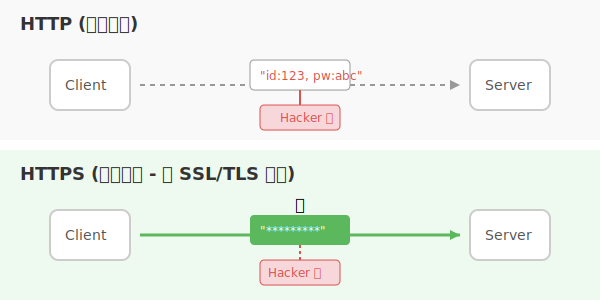

### **SSL 與 TLS 的區別**

在網路安全協定的發展史上，一定經常聽到 SSL 和 TLS 這兩個詞，這兩個詞常常會被搞混或者互換使用，實際上他們是完全不同的東西，但它們之間確實有歷史淵源：
- **SSL (Secure Sockets Layer)**：早在 1994 年由 [網景公司 (Netscape)](https://zh.wikipedia.org/zh-tw/%E7%BD%91%E6%99%AF) 所開發的網路安全協定。但發展到 SSL 3.0 後，因為被發現存在嚴重且無法修復的安全漏洞，目前已經被全面棄用。
- **TLS (Transport Layer Security)**：[IETF (網際網路工程任務組)](https://zh.wikipedia.org/zh-tw/%E4%BA%92%E8%81%AF%E7%B6%B2%E5%B7%A5%E7%A8%8B%E4%BB%BB%E5%8B%99%E7%B5%84) 接手了 SSL 3.0 的架構並進行了標準化與升級，更名為 TLS。現在我們所使用的安全連線，實際上跑的全部都是 TLS（目前主流為 TLS 1.2 與極速的 TLS 1.3）。

:::info 日常溝通的慣用語
雖然現代網路早就連 SSL 的影子都沒有了，但因為最初 SSL 的名氣太大，業界至今仍習慣將「TLS 憑證」通稱為「SSL 憑證」，或是稱作「SSL/TLS 憑證」。
:::

### **TLS 的作用**

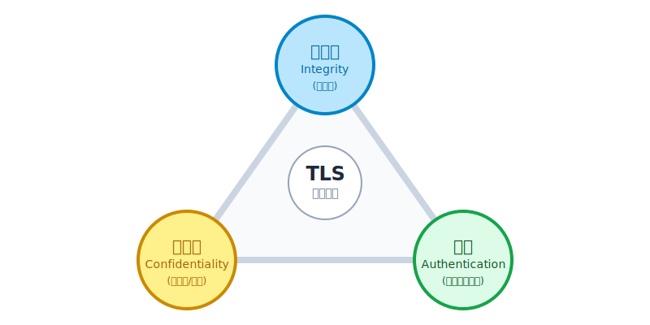

明白了 TLS 的身世後，我們來看看它到底能做什麼。TLS 設計出來的目的，就是要一次性解決在開放網路上傳輸資料的三大核心威脅，分別對應資訊安全中被稱為「CIA 三要素」的重要目標：

1. **加密（Confidentiality，保密性）**：
   確保資料在傳輸過程中被轉換成人類與機器都無法直接閱讀的亂碼（密文）。即使駭客從中攔截了封包，沒有「解密鑰匙」也只會看到一堆毫無意義的亂碼字串，隱藏從第三方傳輸的機密資料。
2. **驗證（Authentication，身分真實性）**：
   防止「詐騙集團」。這確保了與你交換資訊的伺服器，真的是他所聲稱的那個實體（例如：你真的是連上 Google 的機房，而不是某個釣魚網站偽造的伺服器）。
3. **完整性（Integrity，防篡改）**：
   加密不代表資料不會被破壞。完整性校驗（通常透過 MAC 訊息鑑別碼完成）確保了資料在從 Server 傳送到你電腦的途中，沒有任何人偷改過裡面的匯款帳號或內容。

### **TLS 在 OSI 模型的位置**

前面提到 TLS 就像是在 HTTP 訊息外圍，套上了一層可以進行「加解密與隱藏」的裝甲。那麼 TLS 在 OSI 模型中位於哪裡呢？

在標準的 OSI 七層參考模型中，HTTP 屬於最高層的「應用層」（第 7 層），而負責點對點傳輸的 TCP 屬於「傳輸層」（第 4 層）。嚴格來說，TLS 在設計上位於應用層與傳輸層之間。它在 OSI 模型中承擔了**表達層 (Presentation Layer, 第 6 層)** 負責資料加密與解密的工作，以及部分**會議層 (Session Layer, 第 5 層)** 負責交握與連線狀態管理的工作。

當瀏覽器要發送 HTTP 請求時，資料會先向下傳遞給 TLS，TLS 負責把內容加密打包好之後，再丟給下方的 TCP 去分割傳送；接收端的流程則反之。這種分層設計非常優雅，因為這意味著 **HTTP 協定本身完全不需要去管加密的邏輯**，它只要把資料交給下層的 TLS 就好了。

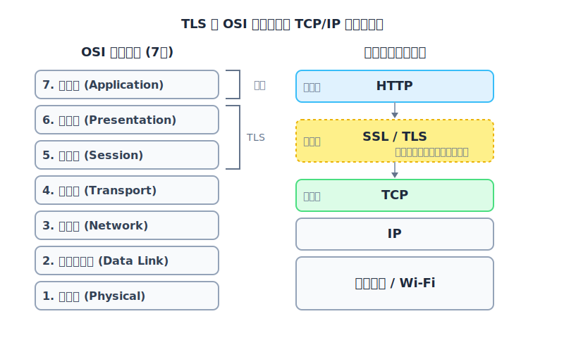

 

## **從 HTTP 演進到 HTTPS 的過程**

了解了 TLS 的工作崗位後，我們來拆解它是如何達成「加密」這項任務的。密碼學的演進就是一場不斷發現漏洞再補洞的過程。

### **對稱加密：同一個保險箱，同一把鑰匙**

為了解決明信片被看光的問題，最直覺的想法就是買一個「保險箱」。

- **原理：** 加密和解密使用**同一把鑰匙**（所以稱為「對稱」）。我用這把鑰匙把資料鎖上（加密為密文），你收到後必須用「一模一樣的鑰匙」打開（解密為明文）。現代最常見的高級對稱加密演算法是 **AES**。
- **優點：** 數學運算非常單純，**速度極快**！非常適合用來加密像高畫質影片、大型檔案這種海量資料。
- **致命缺點：金鑰配送問題（Key Distribution Problem）**。
  想像一下，我要怎麼把這把「鑰匙」交給你？如果我直接在網路上把鑰匙傳過去，駭客只要攔截到這把鑰匙，他就能打開我們未來傳送的所有保險箱。這使得單純的對稱加密在網際網路上幾乎不可行。

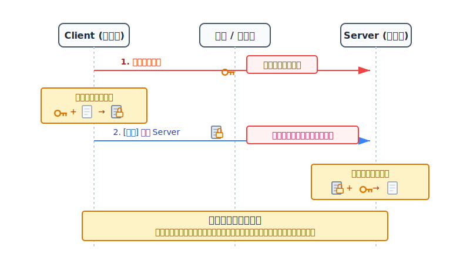

### **非對稱加密：公鑰加密，私鑰解密**

為了解決鑰匙半路被偷的問題，密碼編譯學家發明了極度聰明的「非對稱加密（例如 RSA 或 ECC）」。它不再只有一把鑰匙，而是成對出現：一把叫做**公鑰 (Public Key)**，一把叫做**私鑰 (Private Key)**。

- **公鑰（大家都能拿）：** 就像是一個 **「只能投進去、但打不開」的存錢筒投遞口**，或是沒有上鎖的掛鎖。你可以大方地把公鑰廣播給全世界，駭客拿到也沒關係，因為公鑰**只能用來鎖上資料**。
- **私鑰（只有自己有）：** 就像是**存錢筒底部的專屬解鎖鑰匙**。這把鑰匙永遠藏在伺服器的深處，絕對不透過網路寄送。
- **通訊過程：** 
  1. 伺服器先把「公鑰（沒有鎖上的掛鎖）」傳給用戶。
  2. 用戶把想說的秘密放進箱子，用公鑰「咔嚓」鎖上傳送出去。
  3. 因為這世界上只有伺服器擁有那把「私鑰」，所以即使駭客攔截到上鎖的箱子，他也無能為力，只有伺服器打得開。
- **缺點：** 這種數學運算異常複雜，導致**加解密速度非常緩慢**（通常比對稱加密慢幾百甚至上千倍）。如果用它來加密整個網頁的圖文內容，伺服器的 CPU 會被瞬間撐爆，網頁也會永遠載入不完。

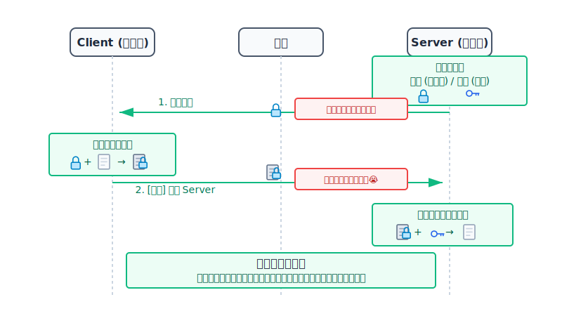

### **HTTPS 的雙劍合璧：先用非對稱加密交換鑰匙，再用對稱加密加密資料**

既然對稱加密「快但鑰匙難傳遞」，非對稱加密「安全但太慢」，HTTPS 最聰明的設計就是將兩者結合，取各自的優點：**混合加密機制**。

1. **先用非對稱加密（安全交換）：** 
   伺服器先把自己的「公鑰」寄給瀏覽器。瀏覽器在本地隨機產生一組短暫、一次性的「對稱加密鑰匙材料」，也稱為「**預主密鑰（Premaster Secret）**」，並用剛剛拿到的公鑰把它鎖起來，安全地寄回給伺服器。
2. **私鑰解密獲取金鑰：**
   全世界只有伺服器有私鑰，因此也只有伺服器能解開那個箱子，拿到那把材料。
3. **改用對稱加密通訊（極速傳輸）：** 
   剛才安全傳遞的只是初步的鑰匙材料（**Premaster Secret**），伺服器解開後，雙方會在各自的電腦上，將其進一步算出 **Master Secret (主密鑰)**，最後再從中衍生出最終真正拿來加解密資料的 **Session Key (會話金鑰)**。
   現在雙方手裡都擁有一模一樣的 **Session Key** 了，接下來整個 HTTP 網頁的龐大內容，雙方就會愉快地使用這把效能極高的對稱金鑰來進行高速通訊。

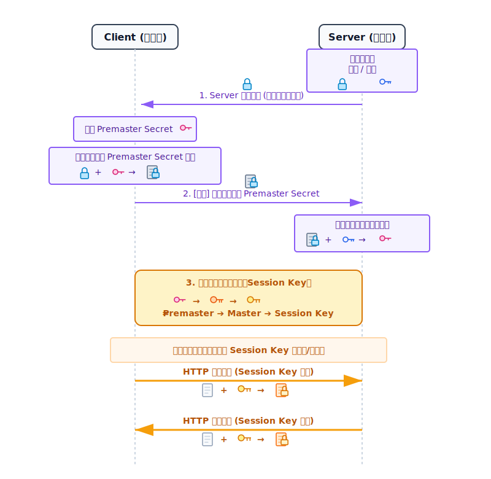

:::info 名詞釐清：Premaster Secret、Master Secret 與 Session Keys
在看完了結合兩種加密機制的概念後，你可能會想，那個所謂的「臨時對稱鑰匙材料」到底是什麼？其實為了確保最終金鑰絕對隨機安全，TLS 並沒有讓 Client 直接生出一把金鑰傳過去，而是經過三個循序漸進的階段來精煉：

1. **Premaster Secret (預主密鑰)**：這是 Client 在本地隨機產生的「**初步原物料**」。它是整個加密過程中最關鍵的機密，Client 會用 Server 的公鑰把它鎖上，並安全的傳遞給 Server。
2. **Master Secret (主密鑰)**：這是一個 48 bytes 的「**半成品庫**」。當 Server 拿到 Premaster Secret 後，雙方並不直接用它來加密，而是會各自將它加上連線一開始打招呼時交換的「兩個隨機亂數 (Client Random & Server Random)」，經過複雜的雜湊運算推導出來。
3. **Session Keys (會話金鑰)**：最後，雙方才從 Master Secret 中，一刀切分、衍生出最終用來進行對稱加密的「**正式工具鑰匙**」（實務上甚至會切分出好幾把，分別負責加密資料與核對 MAC 完整性）。當連線一中斷，這些鑰匙就會立刻被銷毀。

這就是為什麼在上述的流程圖中，被非對稱加密傳送的其實是「Premaster Secret」，而最終雙方互相對稱加密使用的則是「Session Key」！
:::

### **中間人攻擊（Man-in-the-Middle, MitM）**

上面這套由非對稱加密引導，最終導向對稱加密通訊的機制看似無懈可擊。但如果你仔細思考，會發現它存在一個致命的盲區：**在第一步，Client 其實並不知道拿到的公鑰是否真的是 Server 的**。 

這個盲區就是惡名昭彰的 **中間人攻擊 (MitM)** 的攻擊點。那麼，什麼是中間人攻擊呢？最簡單的理解方法就是：**「駭客對 Client 假扮成 Server，同時對 Server 假扮成 Client」**。

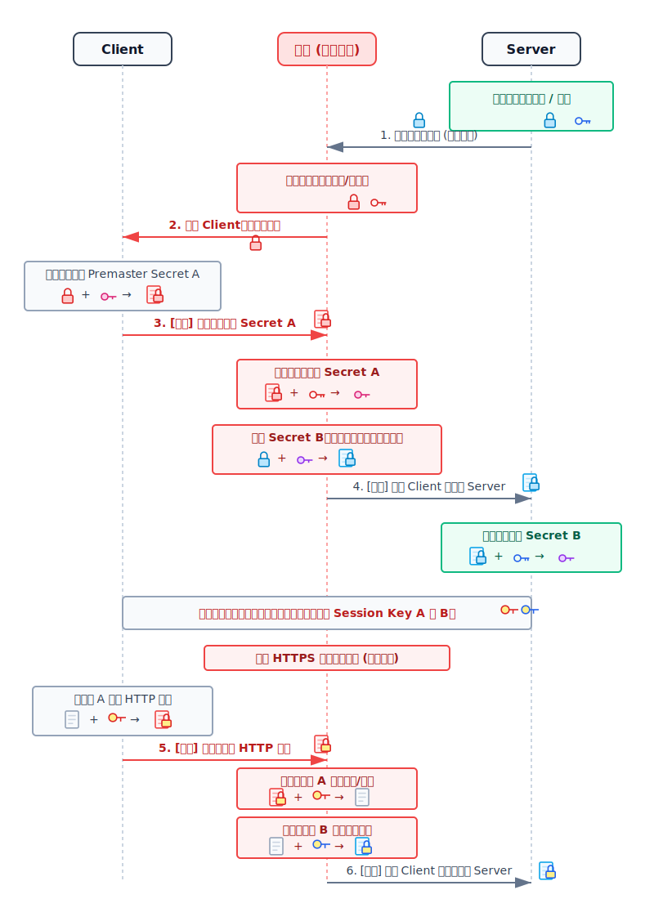

這個破口就發生在一開始 Server 將「公鑰」傳給 Client 的瞬間。如果中間人（駭客）潛伏在你的網路環境中：
1. **攔截與假冒**：駭客攔截了目標伺服器的真實公鑰。接著，駭客自己偷偷生成了一對「駭客公鑰」與「駭客私鑰」，然後把「駭客公鑰」傳給你的瀏覽器，假扮自己是伺服器。
2. **騙取 Premaster Secret A**：你的瀏覽器毫不知情，用這個假公鑰加密了本地生成的初步材料 `Premaster Secret A` 並傳送出去。駭客攔截後，輕鬆地用自己的「駭客私鑰」解開，並在底下提煉出與你對話的第一把工具鑰匙 (**Session Key A**)。
3. **偽造 Premaster Secret B 騙過 Server**：接著，駭客為了不讓 Server 起疑，自己生成了另一份 `Premaster Secret B`，用剛才攔截到的「真正的伺服器公鑰」重新加密傳給 Server，假扮自己是 Client。Server 解開後，與駭客建立起了第二把工具鑰匙 (**Session Key B**)。

從此之後，Client 和 Server 以為他們正在安全地一對一通訊，殊不知 Client 的加密資料都被駭客用 `Session Key A` 解開看光光，駭客看完後再用 `Session Key B` 幫忙重新加密傳給 Server。**整個悲劇的根源就在於：缺乏一個能保證公鑰真實性的信任機制！**

 

## **CA 憑證：打破中間人攻擊的信任機制**

為了解決這個信任盲區，網路世界引入了最具權威的第三方公證人體系：**憑證授權中心 (Certificate Authority, 簡稱 CA)**。有了 CA，HTTPS 這塊安全拼圖才算真正完整。

### **憑證的作用：解決伺服器公鑰的信任問題**

既然 Client 無法單純信任從網路另一端傳送來的公鑰，那大家就規定：伺服器不能直接給公鑰，而是必須給一張**由公認的 CA 所頒發的「數位憑證 (Digital Certificate)」**。

你可以把憑證想像成網路世界的「公司營業執照」加上「身分證」。這張憑證裡面包著伺服器的真實公鑰。當瀏覽器看到這張憑證是由大家信得過的 CA 發出來的，就可以安心地相信裡面包裝的公鑰絕對不是駭客假冒的。

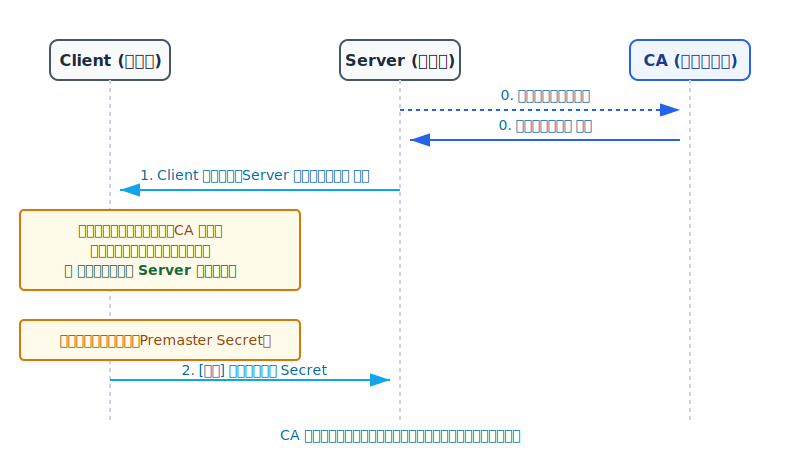

### **CA 憑證的信任問題：如何相信憑證是由 CA 發的？**

問題又來了，如果駭客自己偽造了一張假的憑證傳給你怎麼辦？這時候就要利用密碼學的另一項技術：**數位簽章 (Digital Signature)**。

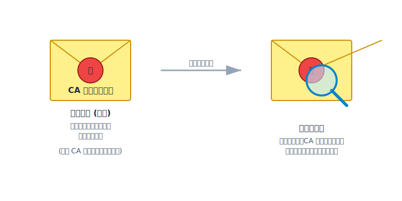

數位簽章的概念，就如同古代信使在信封封口處滴上熱蠟，並蓋上國王的專屬印章。如果有任何人在半路把信拆開、偷改內容或偷換裡面的公鑰，蠟封印記必然會碎裂或者重新蓋上的印章不吻合。而且因為這個專屬印章（私鑰）全天下只有 CA 擁有，別人絕對仿造不出來。只要核對印章是真的，就能斷定憑證絕對是 CA 核發的且未被篡改。

### **CA 憑證上有什麼內容**

國際上通常採用 **X.509** 首要標準來規範憑證的格式。一張合格的數位憑證會包含以下重要資訊：

- **版本號 (Version) & 序號 (Serial Number)**：憑證的基本身分證號碼。
- **簽章演算法 (Signature Algorithm)**：標示這張憑證是用哪種數學方法簽名的（例如：`sha256WithRSAEncryption`）。
- **發行者 (Issuer)**：這張憑證是誰核發的？（例如赫赫有名的 DigiCert, Let's Encrypt）。
- **有效期限 (Validity)**：憑證的起始與過期日期。
- **主體 (Subject)**：這張憑證頒發給哪個網域？（例如：`www.google.com`）。
- **主體公鑰 (Subject Public Key Info)**：**這是最最最關鍵的部分！該目標伺服器的真實公鑰就包在這裡面。**
- **數位簽章 (Digital Signature)**：附在憑證末端的「國王印章」，用來保護以上所有的資訊。

### **CA 憑證上的數位簽章是怎麼被簽出來的？又是如何被驗證的？**

**簽署階段（CA 端在核發憑證時的動作）：**
1. **取雜湊值（指紋）：** CA 把憑證上的所有原始內容（包含目標公鑰、網域等）丟進 Hash 函數（如 SHA-256），算出一組短短的、固定長度的「資料指紋」。
    > *為什麼要先取雜湊？因為非對稱加密非常耗時，直接加密整張憑證太慢了。把大份文件濃縮成一個短指紋再來加密，效率極高，而且只要文件改了一個字，指紋就完全不一樣。*
2. **私鑰上鎖（簽署）：** CA 掏出自己保管在金庫裡的 **CA 私鑰**，把這個「指紋」加密起來，這串加密後的指紋就是**數位簽章**。接著把它貼在憑證的最後面。

**驗證階段（你的瀏覽器收到憑證時的動作）：**
1. **動作 A（自己算）：** 瀏覽器拿出憑證裡的「原始內容」，自己跑一次 SHA-256，算出 **「指紋 1」**。
2. **動作 B（解開看）：** 瀏覽器拿電腦裡內建的 **CA 公鑰**，對憑證末端的數位簽章進行解密，得到 CA 當初算好的 **「指紋 2」**。
3. **最終比對：** 如果 **指紋 1 == 指紋 2**，恭喜！這代表內容一個字都沒被改過（雜湊一致），且真的是這個 CA 簽出來的（只有它的公鑰解得開）。

:::info 破除迷思：私鑰不只能解密，還能用來加密簽章！
看到這裡你可能會感到奇怪，一下子私鑰加密，一下子公鑰加密？
這就跟 **「可樂可以拿來喝，也可以拿來沖馬桶」** 是同個道理（引用自技術蛋老師）。別被字面意思束縛住，公私鑰永遠是一對的，你用了一把來加密，另一把就只能拿來解密。

- **用來「保密」時（公鑰加密，私鑰解密）：** 理論上全世界都可以拿到公鑰來加密，但只有擁有私鑰的人可以解開。因此這非常適合用來 **「加密機密信息」**。
- **用來「證明身分」時（私鑰加密，公鑰解密）：** 這就是數位簽章。因為全天下只有 CA 能用它的私鑰進行簽署加密，但任何人都能用它的公鑰順利解密（驗簽）。一旦你能成功解開，就反向證明了 **「這份資料絕對是擁有這把私鑰的 CA 本人發出的」**，用來驗證身分再好不過了！
:::

### **為什麼中間人沒辦法偽造 CA 憑證？**

假使駭客攔截了憑證，偷偷把裡面的「伺服器公鑰」換成「駭客自己的公鑰」，會發生什麼事？

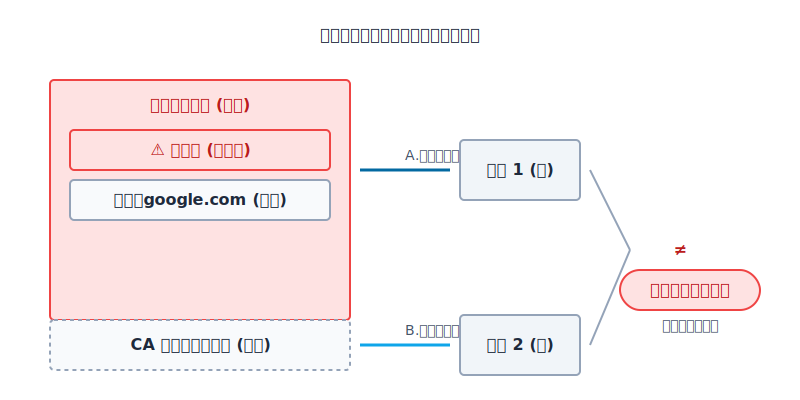

- 當瀏覽器執行**動作 A**時，因為內容被改了（公鑰被偷換），算出來的「指紋 1」會完全變調。
- 當瀏覽器執行**動作 B**解包簽章得到「指紋 2」時，一比對發現：**指紋 1 ≠ 指紋 2！**
- 瀏覽器立刻知道憑證遭到竄改，立刻中斷連線，並跳出大大的紅色警告「您的連線不是私人連線」。

那如果駭客想連同「數位簽章」一起重新偽造呢？抱歉，他沒有 CA 鎖在金庫裡的「私鑰」，他算出來的假簽章，用你的瀏覽器內建的 CA 公鑰根本解不開。這就是為什麼憑證機制能完美擊破中間人攻擊。

### **不過 Client 是如何拿到 CA 的公鑰的呢？**

問題來到最後一關：我的瀏覽器怎麼會有「CA 的公鑰」？誰又能保證這個 CA 公鑰不是駭客塞給我的？

答案是：**作業系統與軟體供應商的內建清單。**
當你安裝 Windows、macOS 系統，或是下載 Chrome、Firefox 瀏覽器的那一刻，微軟、蘋果和 Google 早就在系統內部預先安插好一份「全球受信任的根憑證清單 (Root CA Certificate Store)」。這份清單裡存放了全球數十家經過嚴格稽核、最具權威的 CA 機構的公鑰。

因為你信任微軟或蘋果的系統，所以你繼承了對這些權威 CA 的信任。

### **信任鏈 (Trust Chain)**

在真實的網路世界中，**根 CA (Root CA)** 的位階太高也太神聖了，為了安全起見，這些簽發根憑證的伺服器通常是處於「物理斷網」狀態的（離線儲存）。如果全世界的網站都直接找根 CA 簽名，那不但效率低下，還會增加根 CA 私鑰暴露的風險。

所以，信任是具有傳遞性的，這產生了 **「憑證鏈 (Certificate Chain)」**：
1. **根 CA (Root CA)**：高高在上，用自己的私鑰去簽署並核發憑證給「中繼 CA」。
2. **中繼 CA (Intermediate CA)**：拿著根 CA 賦予的權力，實際面對廣大企業，為他們的伺服器簽發憑證。

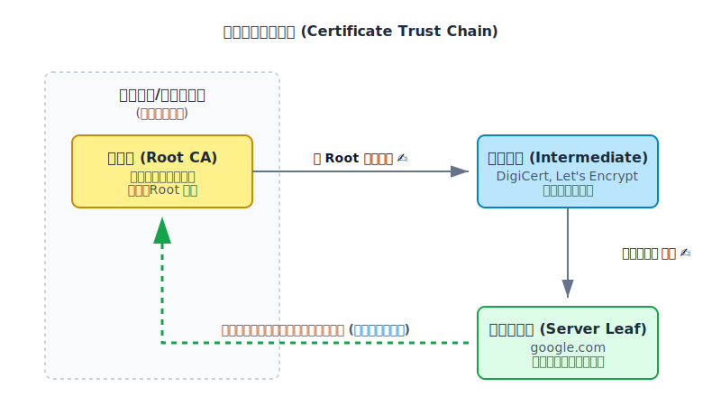

當你的瀏覽器連上網站時，伺服器不僅會丟出自己的憑證，還會連同「中繼 CA 的憑證」綁成一串一起丟給你。
你的電腦會像剝洋蔥一樣，一層一層往上驗證：
- 用「中繼 CA 憑證裡面的中繼公鑰」去驗證「伺服器憑證的簽章」真的是**中繼 CA** 簽的。
- 用「我電腦內建的根 CA 公鑰」再去驗證「中繼 CA 憑證的簽章」真的是**根 CA** 簽的。

一環扣一環，直到驗證到最頂層內建的 Root CA 時，便會確立整條信任鏈都是純潔且有效的。

### **為什麼要有信任鏈？為什麼不直接跟根 CA 申請證書？**

這是一套完美的風險控管與損害控制（Damage Control）機制。

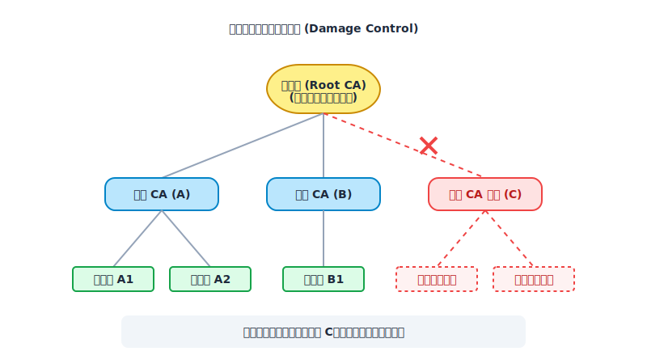

你可以把信任鏈想像成一棵大樹。如果中繼 CA 的私鑰不小心被駭客竊取了（樹枝斷了），這雖然是嚴重的資安事件，但根 CA 只需要發布撤銷命令，將這個中繼 CA 註銷掉，砍掉這根樹枝就好，其他沒受牽連的中繼 CA 與底下的網站依然安全。

但如果根 CA（樹頭）的私鑰被盜了，那是毀滅性災難。整個網際網路的地基會崩塌，所有電腦都必須緊急強制更新作業系統來移除這個根 CA。這就是為什麼根憑證絕對不能輕易出馬，必須透過信任鏈來作緩衝。

### **實戰演練：從瀏覽器查看網站的 CA 憑證**

了解了這麼多關於憑證的原理後，現在我們來親自操作看看，如何從瀏覽器中看到我們所訪問的網站的憑證：

1. 首先，點擊瀏覽器網址列左邊的按鈕，可以打開安全資訊面板，並找到這個網站的 CA 憑證。
   

2. 在憑證詳細資訊中找到「發行者 (Issuer)」，可以看到是哪個 CA 頒發了這個憑證。
   

3. 我們可以用 Mac 的 Spotlight 打開「鑰匙圈存取 (Keychain Access)」，找尋這個發行者的 CN (Common Name)，果然成功找到系統裡面內建有這份根憑證（或中繼憑證）。
   

4. 系統接著提取這份內建憑證內的公鑰，用它來解密並驗證這個網站 CA 憑證的數位簽章。
   

5. 最後，瀏覽器還會檢查憑證「主體 (Subject)」的 CN 是否跟當下訪問的域名一致，證明這個證書跟域名確實是綁定的。這也說明了，若是沒有使用 HTTPS，很難確認自己訪問的是不是真實的官網，因為第三方 CA 在同意頒發憑證之前，都會對網站所有者進行嚴格的網站信息審查。
   

 

## **TLS 交握流程 (TLS Handshake)**

有了上面所有的基礎功，現在我們終於能將這些積木全部拼在一起了。以下我們以經典且容易理解的 **TLS 1.2 搭配 RSA 金鑰交換** 的流程為例，來看看當你在網址列按下 Enter 的那幾十毫秒內，你的電腦與伺服器是如何進行安全溝通的。整個交握過程可以分為四大階段：

### **1. 建立連線 (TCP Handshake)**

在進行任何加密溝通之前，網路的底層必須先有一條暢通的聯絡管道。這就是著名的 **TCP 三方交握 (Three-way Handshake)**：
- Client 發送 `TCP SYN` 請求建立連線。
- Server 回覆 `TCP SYN + ACK` 同意建立。
- Client 回傳 `TCP ACK` 確認收到。

到這裡，代表雙方網路連線已建立，可以開始交流了。

### **2. 查驗身分 (Certificate Check)**

這是非對稱加密發揮作用的階段，雙方互相打招呼，並且伺服器要自證身分：
- **Client Hello**：Client 第一時間主動發出問候，準備好自己支援的 TLS 版本、支援的加密演算法清單（Cipher Suites），以及一個極其重要的亂數 **`Client Random`**。
- **Server Hello**：Server 收到後，挑選出一個雙方都支援的加密演算法與 TLS 版本回覆給 Client。同時，Server 也會生成自己的亂數 **`Server Random`** 傳回去。
- **Certificate**：緊接著，Server 立刻附上自己那張鑲著「數位簽章」與「伺服器真實公鑰」的 **CA 憑證**。
- **Server Hello Done**：告訴 Client：「我的自我介紹跟證件都給完了，換你了！」

> 第一階段結束後，Client 會在本地嚴格檢驗這張憑證的真偽（核對簽章、檢查過期日、順著信任鏈驗證到 Root CA）。如果一切順利，就會進入下一步的換鑰匙環節。

### **3. 金鑰交換 (Key Exchange)**

這是混合加密最核心的轉換時刻，要靠非對稱加密的安全通道，來傳遞對稱加密的鑰匙：
- **Client Key Exchange**：Client 在本地偷偷產生第三個、也是最機密的亂數材料：`Premaster Secret (預主密鑰)`。接著掏出剛剛從憑證裡拿到的「伺服器真正的公鑰」，把它上鎖（非對稱加密）後傳給 Server！
- *(幕後合成)*：Server 收到密文後，用自己鎖在機房裡的「私鑰」解開，成功獲取了 `Premaster Secret`。此時雙方的手上都各自擁有：**Client Random、Server Random、Premaster Secret**。雙方立刻默契地在各自的電腦上，將這三個材料混在一起，經過雜湊運算，提煉出最終用來通訊的 `Session Key (會話金鑰)`！
- **Change Cipher Spec (Client)**：Client 告訴對方：「我的 Session Key 已經準備好了，接下來我要切換成對稱加密通訊囉！」
- **Finished (Client)**：Client 將前面的所有交談紀錄打包 Hash 起來，用剛剛算好的 Session Key 做人生中第一次加密，傳遞給 Server 當作小考測驗。
- **Change Cipher Spec (Server)**：Server 也告訴對方：「收到！我也切換好了！」
- **Finished (Server)**：Server 成功解開小考卷後，也如法炮製一份被加密的驗證回覆給 Client。

### **4. 資料傳輸 (Data Transmission)**

- 以上所有交握大功告成（TLS Handshake 真正結束）。從這一刻起，非對稱加密正式退場。
- 接下來網頁的任何 HTTP 請求圖片、影片、文字等龐大資料，雙方都會直接使用這把極速的 **`Session Key`** 進行安全無虞的**對稱加密通訊**（Encrypted Data）。

為了將上面這個壯麗的過程具象化，我們把上述四個階段轉化為序列圖：

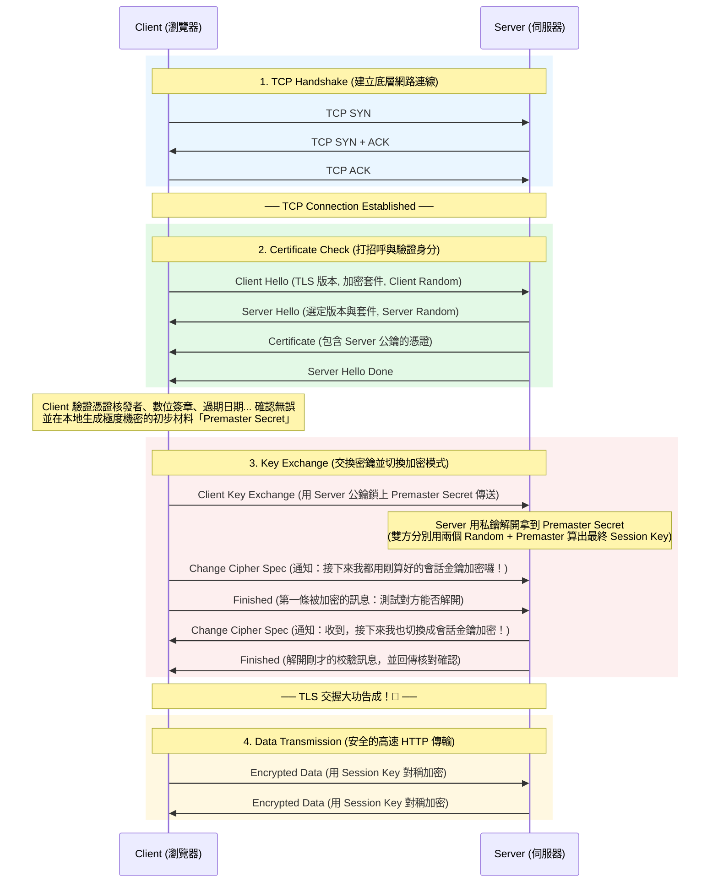

:::note 補充：傳統 RSA 的隱患與前向保密 (Forward Secrecy)
上述是一個最經典的 TLS 1.2 金鑰交換流程。但若是擁有長期私鑰的伺服器未來被駭了，那駭客不就能解開之前默默側錄下來的所有歷史交握封包，把「過去的」封包統統還原嗎？

為了解決這個危機，現代的主流實作（如 TLS 1.3 或搭配 ECDHE 演算法）導入了**前向保密 (Perfect Forward Secrecy, PFS)** 機制，徹底廢除了單純依賴 RSA 私鑰來保護主密鑰的作法。不過牽涉到更進階的演算法機制，這部分就留待未來的文章中再來詳細探討吧！
:::

 

## **結語**

老實說，在真正花時間梳理這篇文章之前，我對 HTTPS 的機制一直處於一知半解的狀態。我只大略知道它是「先用非對稱加密，再用對稱加密」的組合，也隱約知道這世上有個東西叫做「憑證」，但卻從沒搞懂憑證到底是從哪裡來的，又是用來防禦什麼。

直到寫完這篇筆記，我才徹底看清這整個演進脈絡：因為 HTTP 會被偷看，所以我們發明了對稱加密；因為對稱加密的鑰匙無法安全傳遞，我們引進了非對稱加密；為了兼顧安全與效能，兩者結合成混合加密；最後，因為混合加密仍無法抵擋中間人偽造公鑰的攻擊，才誕生了以 CA 為核心的憑證信任鏈。

HTTPS 並不單純只是把密碼學的技術拼湊在一起，它更是經過數十年的碰撞與修補，堆疊出的人類智慧結晶。希望這篇循序漸進的拆解，能幫助大家建構出這條清晰的 HTTPS 演進脈絡！

 

## **Reference**

- **[什么是TLS、数字证书、数字签名](https://www.youtube.com/watch?v=qp-p4AaUTBc)**
- **[数字签名和CA数字证书的核心原理和作用](https://www.youtube.com/watch?v=1EoQmU5N8QE)**
- **[HTTPS是什么？加密原理和证书。SSL/TLS握手过程](https://www.youtube.com/watch?v=Kw2P1RR-3k8)**
- **[說只有對方聽得懂的話-HTTPS & SSL & TLS](https://ithelp.ithome.com.tw/m/articles/10305691)**
- **[後端協定基礎知識建置-HTTPS 憑證握手流程](https://ithelp.ithome.com.tw/m/articles/10350839)**
- **[HTTPS(一) -- 基础知识（密钥、对称加密、非对称加密、数字签名、数字证书](https://blog.51cto.com/u_15290941/3047577)**
- **[搞懂 TLS 1.2 金鑰交換原理與握手](https://blog.louisif.me/posts/understanding-tls-1-2-key-exchange-and-handshake/)**
