## **前言**

1970 年代末期，當一家企業同時採購了 IBM 的大型主機和 DEC 的 VAX 迷你電腦，會發現即便硬體都正常運作，網路線也接好了，但資料卻無法在兩台機器之間流通。這是因為不同廠商都使用截然不同的網路協定，跨廠商之間的裝置根本無法溝通。這在當時的網路環境中非常常見，因為 IBM 有自己的 SNA，DEC 有 DECnet，Xerox 有 XNS。這些協定各自為政，彼此水火不容，形成了「買了某家的設備，它就只能和自家的設備說話」的局面。

這種封閉生態讓企業跨廠商建置網路的成本極高，更嚴重阻礙了電腦互聯網路的普及。1984 年，國際標準化組織（ISO, International Organization for Standardization）提出了 **OSI 參考模型（Open Systems Interconnection Reference Model）**，試圖建立一套所有廠商都能遵循的通用框架。

OSI 是一種概念模型，它不規定網路「怎麼做」，而是定義網路「做什麼」——把複雜的通訊問題切割成七個各司其職的層次，每層只需解決自己範圍內的問題，並對相鄰層提供清晰的介面。這個「分而治之」的思想，成為後來所有網路協定設計的共同語言。

那麼，通訊究竟需要解決哪七種不同的問題？每一層又是如何環環相扣，最終讓資料從地球這端抵達那端？

:::tip 為什麼叫做「參考」模型？
OSI 之所以稱為「參考」模型，是因為在實務上它並不被直接實作。當今網際網路的骨幹是 TCP/IP 協定組，而非 OSI。

OSI 的真正價值在於**提供一套通用語言**：當工程師遇到網路問題時，可以說「這是 Layer 3 的問題」，其他工程師立刻就能定位到問題範圍——是 IP 定址或路由出了狀況。
:::

 

## **OSI 七層架構總覽**

在深入各層之前，先建立一個完整的全局視角。

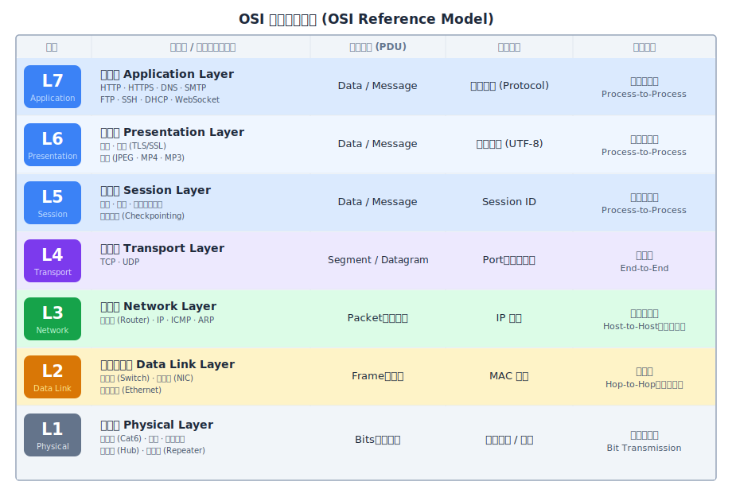

整個 OSI 模型可以從兩個維度來理解：

**從上到下（封裝 Encapsulation）**：當資料從應用程式向下傳遞時，每一層都會在資料外圍加上自己的「標頭（Header）」，就像層層套信封一樣，這個過程稱為封裝。

**從下到上（解封裝 Decapsulation）**：資料抵達接收端後，每一層負責拆除並解讀自己層的標頭，再把內容傳給上層，直到應用程式取得原始資料。

:::tip OSI 七層（L7 → L1）記憶口訣
記憶 OSI 七層**由上至下（L7 → L1）**，有個廣為人知的英文口訣：
**"All People Seem To Need Data Processing"**
**A**pplication → **P**resentation → **S**ession → **T**ransport → **N**etwork → **D**ata Link → **P**hysical

反過來，**由下至上（L1 → L7）** 也有一個口訣：
**"Please Do Not Throw Sausage Pizza Away"**
**P**hysical → **D**ata Link → **N**etwork → **T**ransport → **S**ession → **P**resentation → **A**pplication
:::

 

## **深入解析各層職責**

### **L1：實體層 (Physical Layer)**

實體層是 OSI 模型的最底層，職責最為單純：**在物理介質上傳輸原始的二進位位元流（0 和 1）**。這層根本不關心這些 0 和 1 代表什麼含義，它只負責把位元從 A 點搬到 B 點，至於搬的是什麼，它一概不知。

定義「如何搬」是 L1 的核心工作。目前主流的三種物理傳輸介質各有其訊號形式與適用情境：

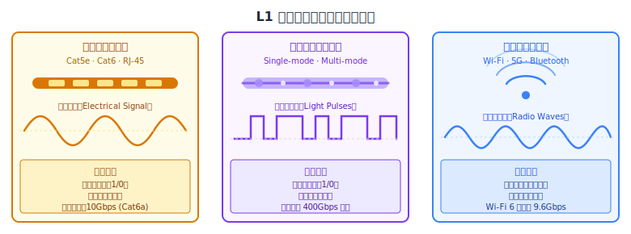

L1 的代表裝置是**集線器（Hub）**。集線器是一種純粹的 L1 裝置，收到訊號後它能做的事只有一件：**無差別地把位元流廣播給所有連接的埠口**。它完全不知道「這個訊號應該送給誰」，只要收到電訊號就往所有方向複製轉發。這種無差別廣播效率極差，也是它逐漸被更聰明的交換機（Switch）取代的根本原因。

### **L2：資料連結層 (Data Link Layer)**

L1 解決了「如何傳輸位元」的問題，但留下了一個更根本的盲區：這些位元應該送給誰？在同一個區域網路（LAN）內，可能有數十台設備同時連接在同一台交換機上，如果只是無差別廣播，所有人都會收到所有人的訊息，這顯然行不通。**資料連結層的職責，就是在同一個區域網路內實現裝置到裝置之間的精準傳遞。**

資料到了 L2，會被封裝成**幀（Frame）**。幀的標頭裡記載了來源與目標的 **MAC 地址（Media Access Control Address）**，這是每塊網路卡（NIC）出廠時就被永久「燒錄」到硬體 ROM 中、全球唯一的實體地址。有了 MAC 地址，同一個交換機下的裝置才能精準地彼此傳遞資料，而不會像 Hub 那樣讓所有人都收到。

一個標準的 MAC 地址由 **48 個位元（6 組十六進位數字）** 組成，其唯一性靠的是一套嚴謹的分層管理機制：

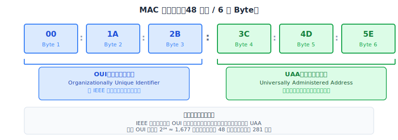

前 24 位元是 **OUI（廠商識別碼）**，由 IEEE 國際電機電子工程師學會統一分配，每家硬體製造商（如 Apple、Intel、Realtek）必須向 IEEE 申請自己的 OUI，IEEE 確保任何兩家廠商的 OUI 絕不重複。後 24 位元是 **UAA（裝置識別碼）**，由製造商自行分配給旗下生產的每一塊網卡。這兩個部分的組合，在全球 281 兆個地址空間裡，實現了每塊網卡的絕對唯一性。

那麼，交換機是如何利用 MAC 地址進行精準轉發的？它內部維護著一張 **MAC 地址表（MAC Address Table）**，記錄「哪個 MAC 地址在哪個埠口（Port）上」。當交換機收到一個幀時，讀取標頭裡的目標 MAC 地址，查表後**只把幀從對應埠口送出**——而不是廣播給所有人。若查不到目標 MAC（例如剛啟動、表是空的），才會進行廣播，並在得到回應後學習並記錄該 MAC 地址。這種「精準定向」的機制，讓乙太網路的效率遠遠高於 Hub。

### **L3：網路層 (Network Layer)**

現在假設一個更大的問題：如果世界上所有設備都只靠 MAC 地址來尋址，互聯網上的每台路由器就必須記住全球所有設備的 MAC 地址，且每次找設備都得全球廣播——這在現實中完全不可行。**L3 的誕生就是為了解決「跨越網段、跨越全球」這個更難的尋址問題。**

L3 使用 **IP 地址**進行定址，並將資料封裝成**封包（Packet）**。MAC 地址與 IP 地址最本質的差異，在於它們截然不同的「結構哲學」：

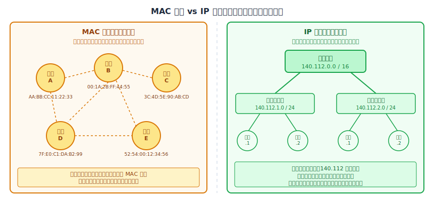

MAC 地址是「扁平的（Flat）」——就像身分證號碼，看到「A123456789」完全不知道這個人在台北還是高雄，無法給路由器任何方向指引。IP 地址則是「層級化的（Hierarchical）」，由「網路號碼」加「主機號碼」構成，像是有「國家 → 縣市 → 鄉鎮 → 門牌號」層次的郵遞地址，路由器只需要看 IP 地址的前幾段數字，就能知道封包大方向應該往哪送。

這個層級化設計催生了 **路由匯總（Route Summarization）**。以台大（NTU）為例，其 IP 範圍是 `140.112.0.0` 到 `140.112.255.255`。當一個封包從美國出發，途經太平洋海底電纜、抵達台灣的過程中，沿途的路由器完全不需要知道這台電腦在哪個系館，它們只需要一條記錄：「只要目標 IP 開頭是 `140.112.x.x`，通通丟往台灣的方向。」路由匯總讓路由器需要記憶的條目從「幾百億條個別設備記錄」縮減到「幾十萬條網段記錄」，這才讓全球規模的互聯網路由成為可能。

那路由器的路由表又是從哪裡來的？路由器之間透過 **動態路由協定（如 BGP、OSPF）** 互相宣告自己管理的網段：台大的邊界路由器向外廣播「`140.112.0.0/16` 在我這裡！」，鄰近路由器記錄下來再繼續傳播，直到全球的路由器都收斂出一張完整的「全球路線圖」，這個過程稱為**路由收斂（Convergence）**。

最後還有一個常被忽略的橋接問題：當路由器確認目標 IP 就在同一個子網內（最後一跳），它知道 IP 是誰，卻**不知道對方的 MAC 地址**，無法完成 L2 的幀封裝。這時需要 **ARP（Address Resolution Protocol）** 出場——路由器在區網內廣播：「誰是 `140.112.1.5`？請告訴我你的 MAC 地址。」目標機器回覆後，路由器才能完成幀封裝，把封包精準送達。ARP 就是連結 L3 邏輯世界與 L2 實體世界之間不可缺少的橋樑。

:::info L3 的其他核心職責
除了定址與路由，L3 還負責：
- **分段與重組（Fragmentation and Reassembly）**：當封包大小超過下層網路的最大傳輸單元（MTU），L3 負責將封包切割成碎片，並在目的地重新組合。
- **錯誤檢測（Error Detection）**：透過 ICMP（如 `ping` 命令）回報網路錯誤狀態，例如「目標不可達」。
:::

### **L4：傳輸層 (Transport Layer)**

有了 L2 的 MAC 地址和 L3 的 IP 地址，資料已經能夠抵達正確的**主機**。但一台主機上可能同時運行著瀏覽器、郵件客戶端、Slack、遊戲等無數個應用程式，資料抵達主機後，**要如何知道應該交給哪個應用程式？** 這是 L3 留下的未解問題，也正是 L4 存在的原因。

L4 使用 **連接埠號（Port Number）** 來定位具體的應用程式（進程）。Port 是一個 0 到 65535 之間的數字，分為兩類：伺服器端的**固定 Port（Well-known Ports）**，如 HTTP 固定監聽 80、HTTPS 監聽 443、SSH 監聽 22，讓客戶端知道往哪個 Port 找服務；以及客戶端每次發起連線時由系統隨機分配的**短暫 Port（Ephemeral Ports，1024–65535）**，讓伺服器能區分同一台電腦同時開了三個分頁的三個不同連線。透過「目標 IP + 目標 Port」的組合，每一筆資料就能精準送達正確主機上的正確應用程式，L4 實現了「進程到進程（Process-to-Process）」的傳輸。

除了定位進程，L4 還讓使用者在兩種截然不同的傳輸哲學之間做選擇——**TCP** 與 **UDP**：

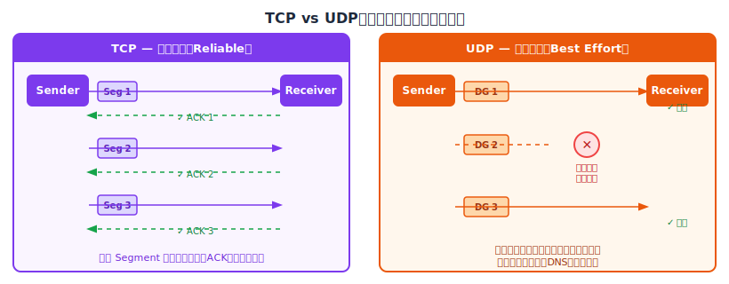

|  **比較項目**  |      **TCP（傳輸控制協定）**       |      **UDP（用戶資料報協定）**       |
| :------------: | :--------------------------------: | :----------------------------------: |
|  **連線方式**  | 面向連線：須經「三向交握」建立連線 |    無連線：直接發送，不需事先溝通    |
| **資料完整性** | 極高：保證不丟包、不重複、順序正確 |     低：可能丟包、重複或順序錯亂     |
|  **傳輸機制**  | 確認應答 (ACK)、逾時重傳、流量控制 | 發送後不理 (Best Effort)、無回饋機制 |
|  **傳輸速度**  |   較慢：需等待確認與處理控制訊息   |     極快：低延遲，無額外通訊開銷     |
|  **資料單位**  |           Segment（段）            |          Datagram（資料報）          |
|  **標頭大小**  |           20 ~ 60 Bytes            |       固定 8 Bytes（極簡結構）       |
|  **常見應用**  |       HTTP/HTTPS、FTP、SMTP        |  影音串流、VoIP 電話、線上遊戲、DNS  |

:::info 為什麼影音串流選擇 UDP 而非 TCP？
看 YouTube 時丟了幾個封包，畫面可能短暫出現一點模糊；但如果用 TCP，丟包後必須等待重傳，那幾十毫秒的延遲累積起來反而造成明顯的「卡頓」感，嚴重破壞觀看體驗。**寧願偶爾模糊，不要一直卡頓** — 這就是串流選 UDP 的底層邏輯。
:::

### **L5：會話層 (Session Layer)**

有了 L4 的端到端傳輸能力，L5 關注的是更高層次的問題：**如何建立、維持一次有意義的通訊對話（Session），並在結束後乾淨地關閉它。** L4 解決的是「資料能不能送到」，L5 解決的是「這段對話有沒有被妥善管理」。

L5 的職責圍繞三件事。第一是**會話管理（Session Management）**：負責開啟與關閉兩個應用程式之間的邏輯連線。當同時打開多個瀏覽器分頁訪問同一個網站時，L5 確保伺服器能精確地將每個請求的回應送回正確的分頁，而不會張冠李戴。第二是**對話控制（Dialogue Control）**：定義通訊的方向模式，可以是單工（Simplex，如電視廣播，只能單向傳輸）、半雙工（Half-duplex，如對講機，雙方輪流說話）或全雙工（Full-duplex，如電話，雙方同時傳輸）。

第三件事或許是 L5 最具工程價值的設計：**同步與檢查點（Synchronization & Checkpointing）**。在傳輸大型檔案時，L5 可以在資料流中定期插入「檢查點（Checkpoint）」作為已成功儲存的里程碑。

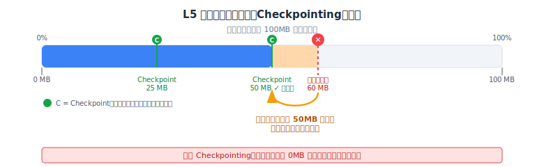

如圖所示，若在傳輸進行到 60% 時網路中斷，系統可以從最近的檢查點（50%）恢復，而不必從頭重來。日常使用的下載器「斷點續傳」功能，其概念根基正是來自這裡。

:::note L5、L6、L7 在 TCP/IP 中的命運
在現代主流的 **TCP/IP 模型**中，OSI 的 L5（Session）、L6（Presentation）、L7（Application）三層被直接合併成一個「應用層（Application Layer）」。在日常開發實務中，這些職責都由應用程式框架或協定庫直接處理，很少被單獨討論。
:::

### **L6：表達層 (Presentation Layer)**

如果說 L4 負責「把資料運過去」，L5 負責「管理這段對話」，那 L6 負責的則是「確保雙方都看得懂資料的語言」。**L6 是網路的翻譯官，在資料送出前對其進行格式處理，在接收後還原為對方能讀取的形式。**

L6 的工作可以概括為三道處理程序：

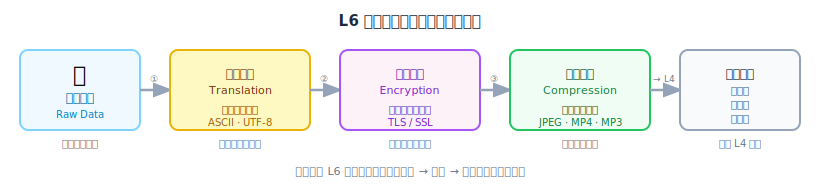

首先是**資料轉譯（Translation）**：確保不同系統之間字元編碼的一致性。早期電腦世界存在 EBCDIC、ASCII 等多種編碼格式，L6 負責在它們之間轉換，確保傳送方的「A」抵達接收方時仍然是「A」，而非亂碼。現代環境下，這個角色主要體現在 UTF-8 的普及上。

其次是**資料加密（Encryption）**：在 OSI 的理論框架中，資料的加密與解密屬於 L6 的職責。L6 在資料送出前將明文加密為密文，確保封包即使在 L3 路由過程中被攔截，攻擊者也無法讀取（TLS/SSL 在理論上即屬此層的體現）。

最後是**資料壓縮（Compression）**：為了減少傳輸所需的位元數，L6 對資料進行壓縮。影片（MP4）、圖片（JPEG）、音訊（MP3）等多媒體格式的壓縮，都屬於這個範疇。接收端的 L6 則執行反向操作——解壓縮、解密、轉譯，將資料還原後再向上傳遞。

### **L7：應用層 (Application Layer)**

L7 是最接近使用者的一層，也最容易被誤解。**L7 不是「應用程式本身」**（Chrome、LINE 等），而是為這些應用程式提供**標準化網路服務介面**的協定層。應用程式只需呼叫 L7 提供的介面，L7 再往下把工作逐層交給 L6、L5……直到 L1 完成實際傳輸。

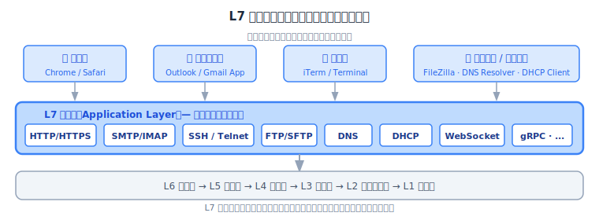

L7 定義了各種**應用協定**，讓不同軟體能用統一的語言交換資訊：

|      **協定**      |              **用途**              |
| :----------------: | :--------------------------------: |
|    HTTP / HTTPS    |       網頁瀏覽（超文字傳輸）       |
|        DNS         | 網域名稱解析（將網址轉為 IP 地址） |
| SMTP / POP3 / IMAP |        電子郵件的發送與接收        |
|     FTP / SFTP     |              檔案傳輸              |
|        SSH         |         安全的遠端連線管理         |
|        DHCP        |          動態分配 IP 地址          |
|     WebSocket      |  雙向即時通訊（聊天室、即時通知）  |

 

## **封裝與解封裝機制 (Encapsulation & Decapsulation)**

理解了每一層的職責後，把它們串連起來的關鍵機制就是**封裝（Encapsulation）**。

當資料從應用程式（L7）向下傳遞到實體層（L1）時，每一層都像套信封一樣，在資料外圍加上自己的標頭（Header），形成該層的協定資料單元（PDU, Protocol Data Unit）。

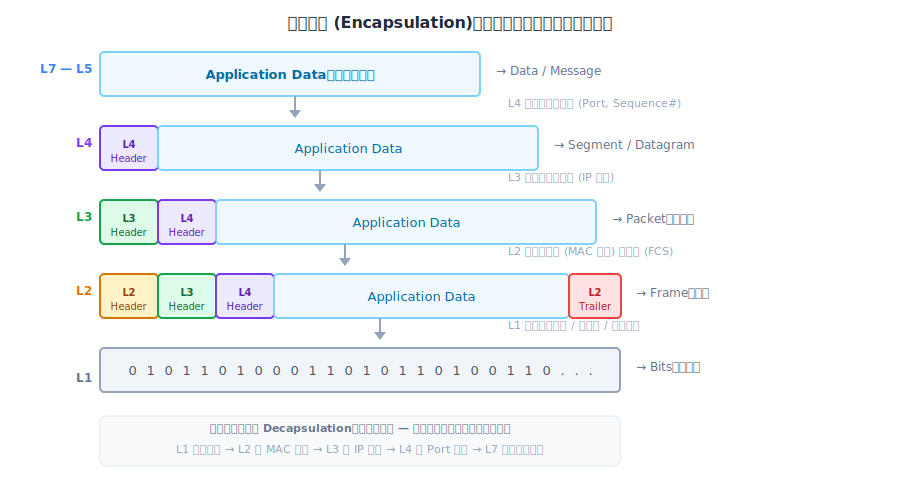

整個過程就像俄羅斯套娃：**L7-L5** 產生原始資料，**L4** 加上傳輸層標頭（Port、序列號）封裝成 Segment，**L3** 加上網路層標頭（IP 地址）封裝成 Packet，**L2** 加上資料連結層標頭（MAC 地址）與幀尾（FCS 錯誤校驗碼）封裝成 Frame，**L1** 最後將 Frame 轉換為電訊號、光脈衝或無線電波，以位元流的形式在物理介質上傳輸。

接收端執行完全相反的**解封裝（Decapsulation）**：L1 接收位元流，L2 驗證 MAC 並拆除幀標頭，L3 驗證 IP 並拆除封包標頭，L4 依 Port 將資料交給對應的應用程式，L7-L5 最終解析資料呈現給使用者。

:::note 每一跳（Hop）發生了什麼？
封包在互聯網上跨越多個路由器傳輸時，並非所有標頭都一成不變。了解「哪些欄位在每一跳改變、哪些不變」，是理解網路傳輸的關鍵之一：

|        **欄位**        | **每一跳是否改變？** |                       **原因**                       |
| :--------------------: | :------------------: | :--------------------------------------------------: |
| 來源 / 目標 MAC（L2）  |    **每跳都改變**    | MAC 只在當前區網有效，每段都需指向「下一個直連節點」 |
|  來源 / 目標 IP（L3）  |       **不變**       |   IP 是全程的「最終目的地」，從出發到到達始終如一    |
| 來源 / 目標 Port（L4） |         不變         |              Port 是端到端的進程識別符               |
|  TTL（Time to Live）   |      每跳遞減 1      |              防止封包在路由器間無限循環              |

路由器在每一跳的工作是：拆除舊的 L2 幀標頭 → 查路由表找到下一跳 → 用下一跳的 MAC 地址重新封裝新的幀 → 送出。L3 的 IP 標頭全程不動，L2 的 MAC 標頭在每一段都換新。
:::

 

## **資料的完整旅程：從 Client 到 Server**

理解了每一層的職責與封裝機制後，可以把所有知識整合起來，追蹤一個 HTTP 請求從瀏覽器到伺服器的完整旅程。這段旅程分為三個階段。

### **封裝階段：Client 準備資料**

當在瀏覽器輸入網址並按下 Enter，一連串事件在幕後展開。
- L7 的 HTTP 協定格式化請求報文
- L6 對資料進行必要的編碼處理
- L5 建立或延續與伺服器的會話
- L4，TCP 在資料前加上源 Port（系統隨機分配的短暫 Port）和目標 Port（HTTPS 固定為 443）封裝成 Segment
- L3 再加上 Client IP 和 Server IP 封裝成 Packet

L3 此時知道「封包目標是 Server IP」，卻也明白 Server 在遠端，封包必須先送往本地的**預設閘道（Gateway）**。問題是：L3 知道 Gateway 的 IP，卻不知道它的 MAC 地址，無法完成 L2 的幀封裝。這時 **ARP** 出場，在區網廣播詢問 Gateway 的 MAC；拿到回覆後，L2 才能把 Packet 封裝成 Frame，標上 Client MAC（來源）和 Gateway MAC（目標），送往 L1 轉為電訊號發出。

:::note ARP 廣播如何運作？
ARP 本身也遵循 OSI 模型。一個 ARP Request 就是一個標準的 L2 幀——來源 MAC 是發送方自己的，目標 MAC 是 `FF:FF:FF:FF:FF:FF`（L2 廣播地址，同網段上所有裝置都會收到）。每台收到廣播的裝置讀取幀內的 ARP Payload，確認其中詢問的目標 IP 是否是自己；目標裝置（即 Gateway）回覆一個**單播 ARP Reply**，直接告訴發送方「這個 IP 對應的 MAC 是我的」。發送方收到後將 IP→MAC 的對應寫入本地 **ARP 快取**，在快取有效期間內不需要重新廣播。

正因為 ARP 依賴 L2 廣播幀，它只在同一個廣播域（本地網段）內有效。跨過路由器的遠端 IP，ARP 是找不到的——這也是為什麼封包每抵達一個新的路由器，都需要重新執行一次 ARP 來取得下一跳的 MAC。
:::

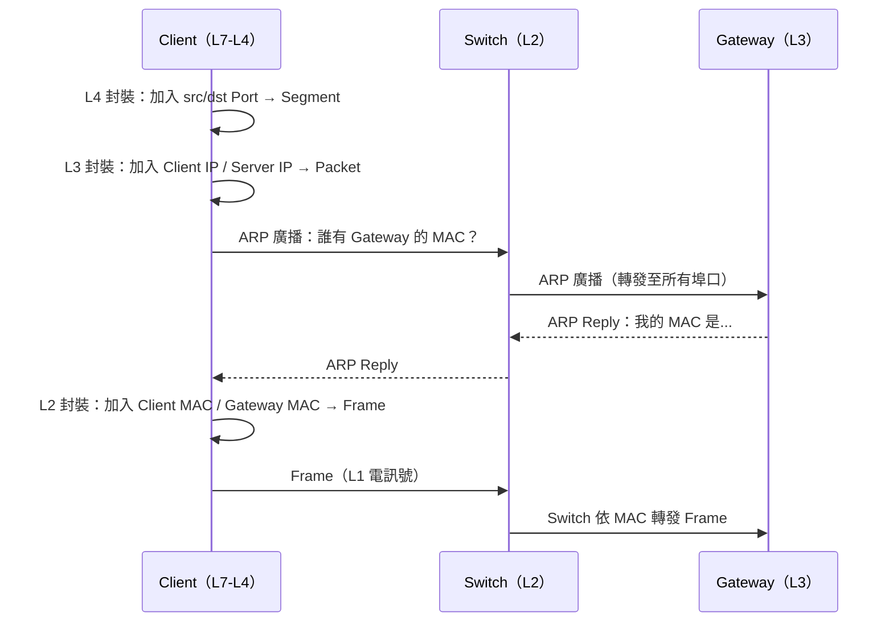

 

### **躍點傳遞階段：封包穿越互聯網**

電訊號透過 L1 抵達 Gateway 的網路介面後，L1 先將電訊號解碼還原成位元序列，L2 再依幀格式重組成 Frame。Gateway 拆除 L2 幀標頭、讀取 L3 的 IP 標頭，查詢路由表找到「下一跳（Next Hop）」的路由器，再透過 ARP 取得下一跳的 MAC，重新封裝成新的 Frame，送往 L1 轉為電訊號發出。如此循環，封包一跳一跳前進，直到抵達距離 Server 最近的那台路由器。

在整個傳遞過程中有個關鍵規律：**L3 的 IP 標頭（來源 IP 與目標 IP）全程不變**，因為它記錄的是「最終起點與終點」；而 **L2 的 MAC 標頭在每一跳都被拆除並重新封裝**，因為 MAC 只對當前這段實體連線有意義。

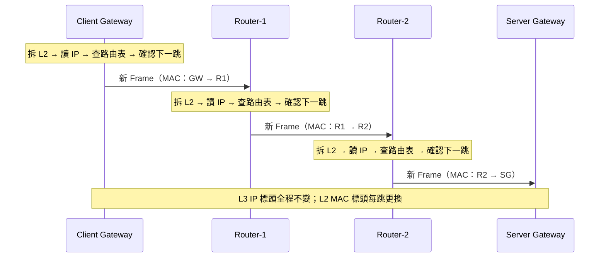

 

### **解封裝階段：Server 接收資料**

封包抵達 Server 所在網段的最後一台 Gateway，Gateway 確認目標 IP 在本地網段，透過 ARP 取得 Server 的 MAC 後重新封裝 Frame，透過交換機精準送往 Server 的網路卡。

接下來是完整的解封裝過程，方向與封裝完全相反：L2 驗證目標 MAC 符合，拆除幀標頭取出 Packet；L3 驗證目標 IP 符合，拆除封包標頭取出 Segment；L4 讀取 Port 號，確認交給哪個進程並拆除傳輸層標頭；L5-L7 最終解密、還原編碼、解析資料，應用程式取得原始請求並開始處理。

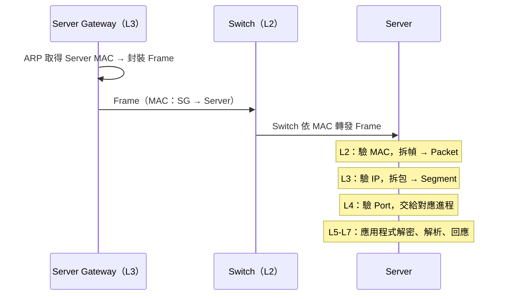

 

## **OSI vs TCP/IP 模型比較**

OSI 模型提出之前，網際網路的骨幹協定——**TCP/IP**——早已在美國國防部 DARPA 的 ARPANET 計畫中誕生並廣泛部署。與 OSI 由委員會從零設計不同，TCP/IP 是在真實網路問題的反覆磨練中演化出來的，層次劃分更少、更貼近工程實踐。

TCP/IP 模型將通訊問題分為四到五層：底部的**網路存取層（Network Access Layer）** 處理實體傳輸與 MAC 定址，對應 OSI 的 L1 + L2；**網際網路層（Internet Layer）** 負責 IP 定址與路由，對應 OSI 的 L3；**傳輸層（Transport Layer）** 提供 TCP 與 UDP，對應 OSI 的 L4；最頂部的**應用層（Application Layer）** 則直接合併了 OSI 的 L5 會話、L6 表達、L7 應用三層，由各應用協定（HTTP、DNS、SSH 等）自行處理會話管理、編碼格式、加密等細節。

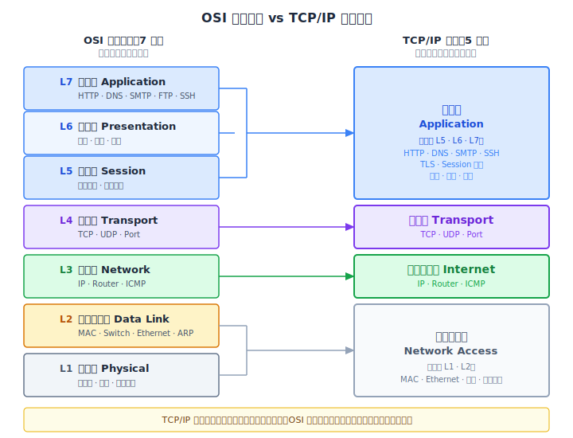

兩套模型的層次對應關係如圖所示：OSI 的 L7、L6、L5 被壓縮進 TCP/IP 的應用層，L4 傳輸層一一對應，L3 網路層對應網際網路層，L1 與 L2 合併為網路存取層。TCP/IP 犧牲了 OSI 在各子層上的精細劃分，換取了更扁平、更易於實作的架構。

TCP/IP 在 OSI 標準完成之前就已廣泛實作，大量的路由器、作業系統、網路軟體都以 TCP/IP 為基礎建置完成。到 OSI 正式發布時，改變整個世界網路基礎設施所需的代價已高不可攀。TCP/IP 勝出憑藉的並非技術優越性，而是**先發優勢與市場慣性**——這是協定演進史上常被引用的教訓。

即便如此，OSI 並未真正「輸掉」。現代工程師的共識是：**用 OSI 模型思考與溝通問題，用 TCP/IP 協定實際運作網路**。每當有人說「這是 Layer 3 的問題」，每當防火牆按層分類規則，每當面試官問「TCP 是哪一層？」——沿用的都是 OSI 留下的語言框架。這個三十年前沒有被直接實作的「參考模型」，以另一種形式永遠嵌入了網路工程師的思維方式。

 

## **Reference**

- **[OSI Model - Algomaster System Design](https://algomaster.io/learn/system-design/osi)**
- **[OSI七层网络参考模型 互联网数据传输原理](https://www.youtube.com/watch?v=2NElqvIh53g)**
- **[What is OSI Model?](https://www.youtube.com/watch?v=Ilk7UXzV_Qc)**
- **[What is OSI Model | Real World Examples](https://www.youtube.com/watch?v=0y6FtKsg6J4)**
