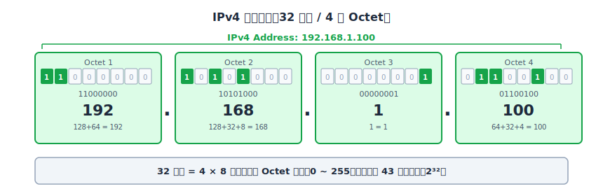
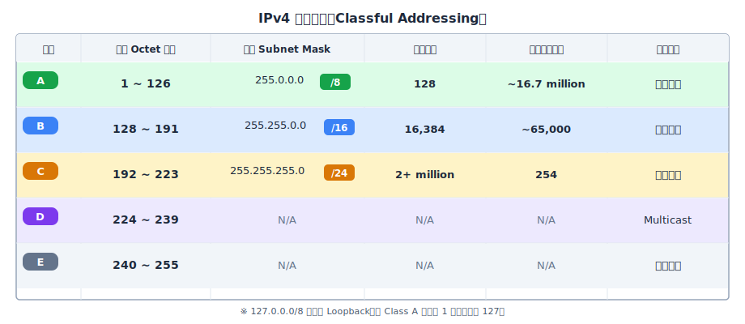
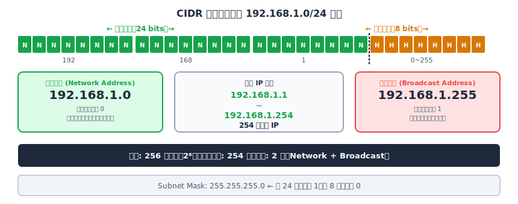
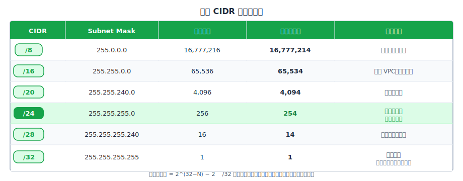
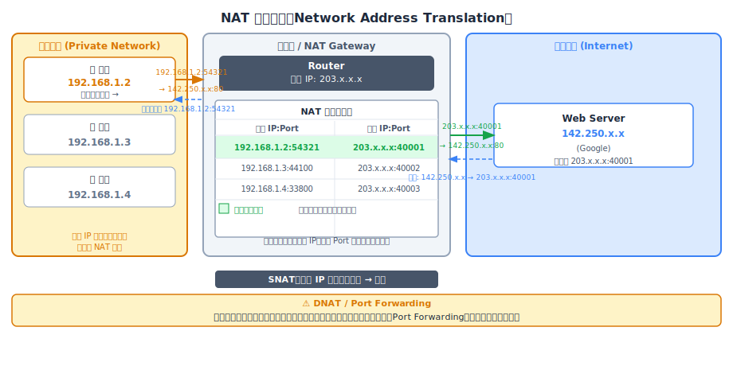
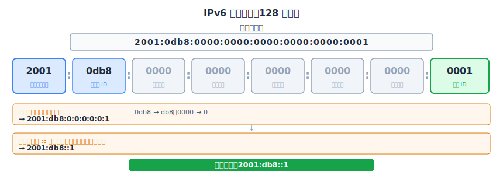
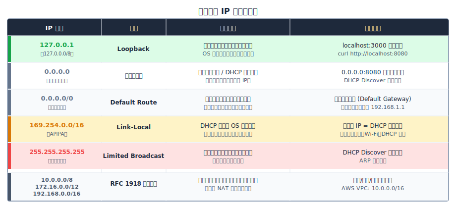
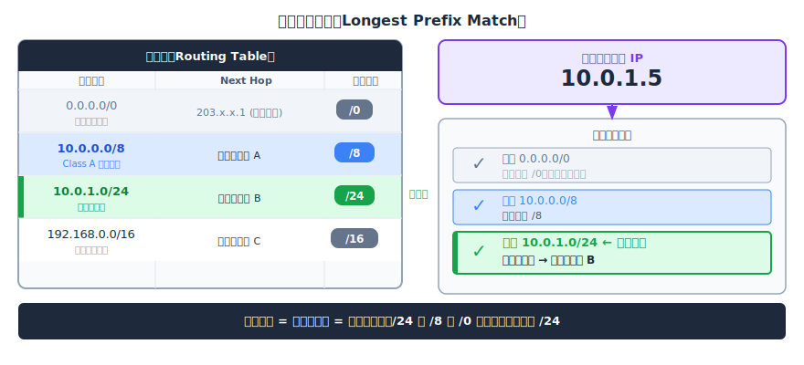
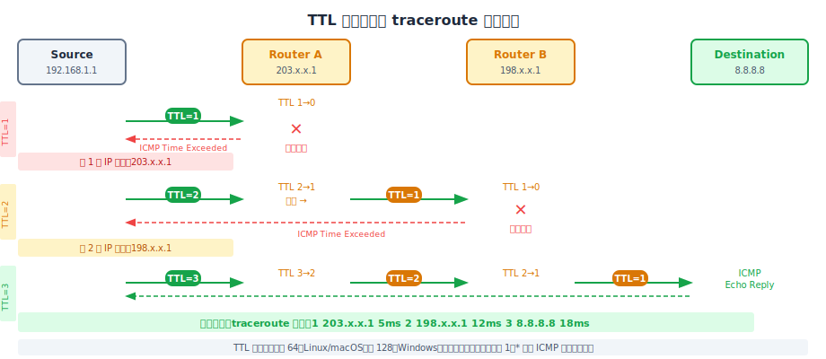

## **前言**

每一次瀏覽器發出請求、每一次手機打開 App、每一次視訊通話的封包在網路上流動，背後都依賴著一套精密的定址系統，這套系統必須在全球數十億台設備中，精確地找到正確的目的地。這套系統的核心就是 **IP Address（網際網路協定位址）**。

IP 位址有兩個版本：**IPv4** 是 1970 年代設計、至今仍是網路骨幹的版本；**IPv6** 則是 1990 年代為了應對 IPv4 耗盡而設計的繼任者，讓每台冰箱、每個門鈴感測器都能擁有自己的全球唯一位址。這篇筆記會涵蓋位址的結構、全球分配體系、私有網路與公網如何共存、封包如何在路由器之間找到目的地。

<br/>

## **IP Address：網路世界的定址基礎**

IP Address 可以看作分配給每一台參與網路通訊的設備的**數字標籤**，路由器依據這個標籤來決定封包應該往哪個方向轉發。在我之前寫的 [OSI 七層模型筆記](./02-osi-model) 中有提到，IP 位址工作在 **L3（Network Layer）**，負責跨網路的邏輯定址。與 L2 的 MAC 位址不同的是，MAC 位址是硬體層面的實體位址，只在同一個網段內有意義；IP 位址是邏輯位址，不限於同一個網段，負責在不同網路之間識別裝置並路由封包。

IP 位址有兩個版本。**IPv4** 是 32 位元的位址，以**四個十進位數字**表示（例如 `192.168.1.1`），總共約 4.3 億個可能的位址——這個數字在 1980 年代設計者的眼中已經遠超需求，但最終在智慧型手機和 IoT 時代被證明遠遠不夠。**IPv6** 是 128 位元的位址，以**十六進位分組**表示（例如 `2001:db8::1`），可容納約 3.4×10³⁸ 個位址，徹底解決了耗盡問題。這篇筆記的重心在 IPv4，理解 IPv4 的設計與演進是掌握現代網路定址體系的基礎；IPv6 的格式與共存機制會在後面獨立說明。

<br/>

## **IPv4 的地址格式與歷史演進**

### **32 位元的地址結構**

一個 IPv4 位址是一個 **32 位元的二進位數字**。為了讓人類便於閱讀，它被拆成四個 8-bit 的群組（稱為 **Octet**），每個 Octet 轉換成十進位，用 `.` 隔開，這種表示法稱為**點分十進位（dotted-decimal notation）**。每個 Octet 的範圍是 0～255（2⁸ = 256 種值），因此一個 IPv4 位址看起來像 `192.168.1.100`。



32 個 bits 總共能表達 2³² ≈ **43 億個唯一地址**。1970 年代 IPv4 被設計出來時，全世界只有少數幾百台電腦連接在 ARPANET 上，43 億這個數字看起來綽綽有餘。沒有人預見到幾十年後每個人都會隨身攜帶多部智慧型手機、平板，家裡每個電器都可能連網，雲端服務商同時管理數百萬台虛擬機器。

### **地址的組成：Network Portion 與 Host Portion**

一個 IP 位址在概念上分為兩個部分：**Network Portion（網路部分）** 與 **Host Portion（主機部分）**。可以把它想像成電話號碼的結構：區碼（area code）識別的是「哪個地區」，局號加分機識別的是「哪個特定用戶」。IP 位址中的網路部分決定「這台設備屬於哪個網路」，主機部分決定「該網路中的哪台設備」。

這個階層式設計是路由效率的關鍵。路由器不需要知道全世界每一台設備的精確位置，只需根據封包目標 IP 的「網路前綴」決定下一跳方向，再由目標網路內的本地裝置負責最後一段精細投遞，就像快遞公司先按郵遞區號分揀到對應城市，再由當地配送員按門牌號碼投遞。

不過這個設計成立的前提是：32 個 bits 中，哪些 bits 屬於網路部分、哪些屬於主機部分，必須有一個清楚定義的邊界。而第一個系統性回答這個問題的方案，就是 **Classful Addressing**。

### **早期的分配方式：Classful Addressing**

早期（1981 年，RFC 791）的 IPv4 採用 **Classful Addressing** 的思路解決這個問題：根據 IP 位址的**最高幾個位元（leading bits）** 來決定它屬於哪個「類別（Class）」，每個 Class 有固定的網路／主機部分邊界。



- **Class A** 的最高位元固定為 `0`，因此第一個 Octet 的位元模式從 `00000001`（1）到 `01111110`（126）。以 `10.0.0.1` 為例：它的第一個 Octet 是 `00001010`，最高位元是 `0`，所以是 Class A。Class A 的網路邊界在第 8 個 bit，即前 8 bits 是網路部分，後 24 bits 是主機部分，Subnet Mask 為 `255.0.0.0`（/8）。整個 `10.x.x.x` 空間就是一個 Class A 網路，最多容納 16,777,214 台主機。全球只有 128 個 Class A 區塊，它們最初分配給大型機構和早期網際網路的核心單位。

- **Class B** 最高兩位元固定為 `10`，第一 Octet 範圍 128～191。以 `172.16.0.1` 為例：第一個 Octet `10101100`，前兩位元是 `10`，確認為 Class B。網路邊界在第 16 個 bit，Subnet Mask `255.255.0.0`（/16），每個 Class B 網路最多容納 65,534 台主機，全球 16,384 個 Class B 區塊，適合中型組織。

- **Class C** 最高三位元固定為 `110`，第一 Octet 範圍 192～223。以 `192.168.1.1` 為例：第一個 Octet `11000000`，前三位元是 `110`，確認為 Class C。網路邊界在第 24 個 bit，Subnet Mask `255.255.255.0`（/24），每個 Class C 網路只有 254 個可用主機位址，但全球有超過 200 萬個 Class C 區塊可分配，適合小型網路。

- **Class D**（前四位元 `1110`，第一 Octet 224～239）保留給 **Multicast** 用途：一次將封包發送給一組設備，不分配給一般主機。

- **Class E**（前四位元 `1111`，240～255）保留給實驗性研究使用，從未正式投入生產。值得注意的是，`127.0.0.0/8` 雖然落在 Class A 的數值範圍內，但整個區塊完整保留給 Loopback（這也是表格中 Class A 範圍從 1 開始、不含 127 的原因，之後的特殊地址章節會詳細說明）。

### **Subnet Mask：明確劃定網路邊界**

看到上面那張表中每個 Class 都有一個對應的 Default **Subnet Mask**，這個 Subnet Mask 正是用來明確指出 IP 位址中哪些 bits 屬於網路部分的工具。Subnet Mask 是一個 32 位元的數字，結構非常固定：前段為連續的 `1`（對應網路部分），後段為連續的 `0`（對應主機部分），中間不能穿插。

要從 IP 位址中提取網路位址，只需要將 IP 與 Subnet Mask 做 **AND 運算**。以 `192.168.1.100` 搭配 `255.255.255.0` 為例：

```
IP:   11000000.10101000.00000001.01100100  (192.168.1.100)
Mask: 11111111.11111111.11111111.00000000  (255.255.255.0)
AND:  11000000.10101000.00000001.00000000  (192.168.1.0)  ← 網路位址
```

結果 `192.168.1.0` 就是這台設備所在的 **Network Address（網路位址）**。同一個 /24 網路內所有設備做 AND 運算，結果都會是 `192.168.1.0`，這正是路由器用來判斷「這台設備是否和我在同一個網路」的方法。

Subnet Mask 與 CIDR 前綴表示法其實代表完全相同的資訊：`255.255.255.0` 就是 `/24`（24 個 `1` 位元），`255.255.0.0` 就是 `/16`，`255.0.0.0` 就是 `/8`。CIDR 前綴表示法更簡潔，也順帶引出了下一個問題：如果可以自由指定前綴長度，而不侷限在 /8、/16、/24，整個地址分配的效率會不會大幅改善？

<br/>

## **CIDR：彈性的現代分配方案**

### **Classful Addressing 的致命缺陷**

Classful Addressing 的問題在於**粒度太粗**，因為它只提供三種實際可用的尺寸：/8（約 1,677 萬個主機）、/16（約 6.5 萬個主機）、/24（254 個主機）。這三個固定尺寸在現實需求面前顯得極度僵化。

假設某個中型公司需要容納 1,000 台設備。`Class C` 的 /24 只有 254 個可用 IP，完全不夠；那就只能申請 `Class B` 的 /16，得到 65,534 個可用 IP。但公司只需要 1,000 個，剩餘的 64,534 個地址白白浪費——**浪費率高達 98.5%**。更嚴重的是，全球只有 16,384 個 Class B 區塊。1990 年代初，需要 300 到幾千個 IP 的公司統統往 Class B 擠，這些區塊被迅速耗盡。整個 Classful 體系正在以驚人的速度燒掉 IPv4 有限的地址空間。解決方案在 1993 年以 RFC 1519 的形式出現，這就是 **CIDR**。

### **前綴表示法與任意位元分割**

CIDR（Classless Inter-Domain Routing）移除了 Class 的概念，允許網路／主機的分割點落在 **32 個 bits 中的任意位置**。表示方式是 `IP/前綴長度`，例如 `192.168.1.0/24`、`10.0.0.0/22`、`172.16.0.0/12`。

回到剛才的 1,000 台主機問題：用 CIDR 申請一個 `/22` 區塊——主機部分有 32-22 = 10 個 bits，可容納 2¹⁰ = 1,024 個地址，扣除保留的 2 個（Network Address 和 Broadcast Address），剩 1,022 個可用 IP。幾乎完美對應需求，浪費幾乎可以忽略不計。這種任意前綴長度的彈性，就是 CIDR 的核心創新：分割點可以落在 bit 22、bit 18、bit 27，完全根據實際需求裁切。

### **Network Address 與 Broadcast Address**

在任何一個 CIDR 區塊中，有兩個特殊地址永遠保留，無法分配給實際設備。**Network Address（網路位址）** 是主機部分 bits 全為 `0` 的地址，代表「這個網路本身」，是網路的識別符。**Broadcast Address（廣播位址）** 是主機部分 bits 全為 `1` 的地址，發送到這個地址的封包會被轉送給網路內所有設備。



以 `192.168.1.0/24` 為例：主機部分有 8 個 bits，共 256 個地址（2⁸）。`192.168.1.0` 是 Network Address（保留），`192.168.1.255` 是 Broadcast Address（保留），實際可分配給設備的是 `192.168.1.1` 到 `192.168.1.254`，共 254 個。

:::tip 快速計算可用主機數
可用主機數 = **2^(32-N) - 2**

例如 /24 = 2⁸ - 2 = 254，/22 = 2¹⁰ - 2 = 1,022，/30 = 2² - 2 = 2（常用於點對點連線）。
:::

### **常用 CIDR 區塊速查表**

CIDR 的各個前綴長度對應不同的 Subnet Mask 和可用主機數量，以下是開發和維運中最常見的幾個區塊：



`/32` 是一個特殊情況，主機部分有 0 個 bits，代表「精確的單一主機位址」。在路由規則或防火牆規則中，`/32` 用來精確匹配一個特定 IP，不多不少。而 `/0`（未列在表中）則是完全相反的另一個極端，前綴長度為 0 代表「匹配所有 IP」，這就是路由表中的**預設路由（Default Route）**，也就是「如果沒有更具體的路由條目，就走這條路」的意思，路由機制章節會再深入說明。

### **以 VPC 子網路劃分為例**

CIDR 在雲端基礎設施設計中是每天都在用的工具。以 AWS VPC 為例，假設建立了一個 `10.0.0.0/16` 的 VPC：`/16` 前綴意味著前 16 個 bits（即前兩個 Octet：`10.0`）是這個 VPC 的固定**網路識別符**，剩下的 16 bits（後兩個 Octet）是可供 VPC 內部自由分配的空間，總共 2¹⁶ = 65,536 個 IP，涵蓋範圍 `10.0.0.0` 到 `10.0.255.255`。

接著可以用 `/24` 把這個空間切成多個子網路：`10.0.1.0/24` 代表以 24 bits 作為網路識別：前三個 Octet `10.0.1` 指定了這個**特定子網路**在 VPC 內的身份，只有最後一個 Octet（8 bits）留給子網路內的個別主機，也就是 `10.0.1.1` 到 `10.0.1.254`。

可以把 `/16` 的 VPC 想像成一個「社區」，每個 `/24` 子網路就是社區裡的一條「街道」。`10.0.1.0/24`（Web 伺服器）、`10.0.2.0/24`（資料庫）、`10.0.3.0/24`（內部服務）是三條在同一個社區（`10.0.x.x`）內的不同街道，各自有獨立的路由規則（Route Table）、安全群組（Security Group）和網路 ACL，實現精細的存取控制邊界。

<br/>

## **公有 IP 與私有 IP**

前面我們知道 IPv4 只有 43 億個地址，而且 Classful Addressing 浪費了大量的空間。但即使 CIDR 提高了效率，43 億個地址終究是有限的，那全球的 IP 地址是如何分配和管理的呢？

### **全球地址分配體系：IANA → RIR → ISP**

IPv4 位址空間的全球分配有一套嚴格的層級體系。最頂端是 **IANA（Internet Assigned Numbers Authority）**，負責管理整個 IP 位址空間的頂層分配，保留特殊用途地址，並將大塊地址空間分配給五個大區的 **RIR（Regional Internet Registry，區域網際網路登記機構）**：ARIN 負責北美、RIPE NCC 負責歐洲和中東、**APNIC 負責亞太地區（台灣屬於 APNIC 的管轄範圍）**、LACNIC 負責拉丁美洲、AFRINIC 負責非洲。RIR 再將地址段分配給各國的 **ISP**，由 ISP 最終分配給企業和個人用戶。

:::info 什麼是 ISP？
ISP（Internet Service Provider，網際網路服務供應商）是提供你網路連線服務的公司。台灣常見的 ISP 包括中華電信、台灣大哥大、遠傳電信。當家裡申請網路時，實際上就是向這些 ISP 購買連線服務，並從他們那裡取得一個公有 IP 地址（或動態地從他們的 IP 池中分配一個）。
:::

### **私有地址：保留給內網的專屬空間**

有一個問題讓我第一次思考到時覺得很有趣：如果全球的公有 IP 地址有限，而且都被分配給了各個 ISP 和機構，那家裡的筆電、手機這些設備是怎麼取得 IP 的？難道公有 IP 足夠多到可以讓每一台家用設備都有一個專屬的公有位址？

答案是否定的。大多數設備並沒有自己的公有 IP。**RFC 1918** 定義了三個永久保留為「私有用途」的 IP 範圍，這些地址**永遠不會在公網上路由**，可以在任何私有網路中自由重複使用：

- `10.0.0.0/8`（約 1,677 萬個地址）
- `172.16.0.0/12`（約 104 萬個地址）
- `192.168.0.0/16`（約 6.5 萬個地址）

這些私有範圍在 IP 空間分配時就被切割保留，不進入 IANA 的公有分配池。因為私有地址永遠不在公網路由，兩個完全不同的家庭都可以使用 `192.168.1.x`，毫無衝突，這些私有 IP 只需要在各自的網路內唯一即可，就像兩棟不同大樓都可以有「3 樓 301 室」，彼此互不干擾。這也解答了前言裡的問題。

:::warning
公有 IP 絕對不會落在私有地址範圍內。如果從 ISP 那裡拿到的 IP 是 10.x.x.x 或 192.168.x.x，那一定是搞錯了。ISP 只分配真正的公有 IP，私有地址由各自的路由器管理。
:::

### **靜態 IP 與動態 IP**

ISP 在分配公有 IP 時有兩種模式。**動態 IP（Dynamic IP）** 是最常見的家庭用戶方案：ISP 維護一個 IP 位址池，每次連線（或定期輪換）時從池中取一個可用的 IP 分配，不同時段可能拿到不同的地址。同一個 IP 地址這個月可能是你的，下個月可能分配給了鄰居。這讓 ISP 能用比客戶數量少得多的 IP 同時服務所有用戶。**靜態 IP（Static IP）** 則是固定分配，每次連線都是同一個 IP，通常需要額外的費用，是架設對外服務的必要條件——想讓外部用戶總是能找到你的伺服器，就必須有一個固定不變的地址。

那如果對外提供服務的裝置拿到的是動態的公有 IP 會發生什麼事呢？假設在家裡架了一台 Home Server，今天的公有 IP 是 `203.x.x.x`，但路由器重連之後 IP 變成了 `210.x.x.x`，所有原本指向舊 IP 的連線全部失效。這時的解法是 **DDNS（Dynamic DNS）**：每次 IP 變更時，路由器上的客戶端程式自動更新一個域名（例如 `myhome.ddns.net`）的 DNS 記錄，讓用戶永遠透過域名連接，而不是直接用 IP。

需要澄清的是，靜態／動態的概念在**公有 IP** 和**私有 IP** 這兩個層面都存在，但語境不同。對於公有 IP，靜態vs動態是指 ISP 是否給你固定的 IP。對於家庭網路內的私有 IP，設備可以動態地向路由器的 DHCP 服務申請（每次開機可能拿到不同的內網 IP），也可以靜態設定（手動指定一個固定的私有 IP）。舉例來說，家裡的 Home Server 除了需要固定的公有 IP（或 DDNS），同樣應該設定固定的**私有 IP**（例如 `192.168.1.100`），否則路由器的 Port Forwarding 規則（「把外部連進來的 80 port 轉發給 `192.168.1.100:80`」）在 Home Server 重啟後拿到不同的內網 IP 時就會失效。

那內網裝置是如何自動取得私有 IP 的呢？這就是 DHCP 的工作。

### **DHCP：IP 地址的自動配發機制**

**DHCP（Dynamic Host Configuration Protocol）** 是設備加入網路時自動取得 IP 配置的機制。在有 DHCP 服務的情況下，設備不需要手動設定任何網路參數，一切由協定自動完成。

整個過程遵循 **DORA** 四步驟：設備一進入網路，就向 `255.255.255.255`（有限廣播）發送 **Discover** 廣播（此時它的來源地址填 `0.0.0.0`，因為還沒有 IP）。網路上的 DHCP Server 收到後，回應一個 **Offer**，包含它準備提供的 IP 位址和租約期限。設備確認後廣播一個 **Request**（「我選擇這個 Offer」），DHCP Server 最後發出 **Acknowledge** 正式確認配發。整個過程通常在幾百毫秒內完成。

DHCP 配發的不只是 IP 位址，而是一整套網路配置：**IP 地址 + Subnet Mask**（告訴設備自己在哪個子網路）、**Default Gateway（預設閘道）**（路由器的 IP，讓設備知道送往外部的封包要交給誰）、**DNS Server IP**（讓設備能做域名解析）。在大多數家庭網路中，路由器同時扮演 DHCP Server（負責分發私有 IP 給內網設備）和 NAT Gateway（負責將私有 IP 轉換為公有 IP 以連接網際網路）兩個角色。

:::note
DHCP 是一個值得單獨深入探討的協定，這裡只介紹它與 IP 地址分配的關聯。之後會有一篇單獨的 DHCP 筆記涵蓋完整的協定細節。
:::

### **NAT：讓私有地址連上網際網路**

現在我們知道內網裝置拿到的是私有 IP，而私有 IP 不在公網上路由。但我的筆電明明就是透過 Wi-Fi 在瀏覽網頁，這中間是怎麼發生的？答案是 **NAT（Network Address Translation）**。

NAT 運行在路由器上，核心機制是維護一張**連線追蹤表（Connection Tracking Table）**。當筆電（`192.168.1.2:54321`）向 Google 發出請求時，路由器攔截封包，把來源地址從私有 IP:Port 替換成自己的公有 IP:Port（例如 `203.x.x.x:40001`），此步驟稱為 **SNAT（Source NAT）**，同時在追蹤表中記錄 `192.168.1.2:54321 ↔ 203.x.x.x:40001` 的對應關係。封包送出後，Google 只看到公有 IP，回應封包送回 `203.x.x.x:40001`，路由器查詢追蹤表，反向映射回 `192.168.1.2:54321`，再轉送給筆電。



至於**從外部主動發起連線到內部設備**，例如在家架 Web Server，需要額外設定 **DNAT / Port Forwarding**：告訴路由器「凡是連入公有 IP 的 80 port，都轉送給內部的 `192.168.1.100:80`」。若沒有這條規則，外部發起的連線在路由器的追蹤表裡找不到對應條目，路由器不知道要交給哪台內部設備，只能拒絕或丟棄封包。這也是家用路由器天然扮演「防火牆」角色的原因——NAT 的有狀態追蹤機制讓未經主動請求的入站連線無法穿透。在雲端環境中，EC2 Instance 只有 VPC 內的私有 IP，對外服務由 Load Balancer 或 NAT Gateway 代理，正是同樣的架構模式。

:::info NAT 的副作用
NAT 雖然延緩了 IPv4 耗盡的危機，但它破壞了網際網路原本「端對端透明（end-to-end transparency）」的設計哲學，這個哲學要求兩端直接通訊，中間路由器只轉送封包而不修改內容。NAT 的存在讓 FTP、VoIP、P2P 等協定的實作複雜化（因為這些協定有時在封包 payload 裡攜帶 IP 地址，NAT 必須深入應用層才能正確替換）。此外，連線追蹤表是有狀態的資料結構，在高流量場景下可能成為瓶頸。
:::

<br/>

## **IPv6：下一代定址協定**

NAT 解決了燃眉之急，但它本質上是一種 workaround，而非根本解法。真正的解法是讓每台設備都能有自己的全球唯一公有 IP，而 IPv6 正是為此而生的。

### **128 位元的地址格式**

2011 年 2 月 3 日，IANA 正式宣布 IPv4 頂層地址池耗盡，將最後五個 /8 區塊分配給五個 RIR。事實上早在 1998 年，RFC 2460 就已定義了 IPv6 作為長期解方。IPv6 使用 **128 位元**的地址，可容納 2¹²⁸ ≈ **3.4 × 10³⁸** 個位址，大約相當於地球上每一粒沙子都能分到幾個 IP，在任何可預見的未來都不必擔心耗盡。

IPv6 的書寫格式是 **8 組 16 位元的十六進位數字**，組與組之間用冒號隔開。完整格式例如：`2001:0db8:0000:0000:0000:0000:0000:0001`。



### **縮寫規則**

完整的 IPv6 位址相當冗長，因此有兩條縮寫規則讓它更易讀。**規則一**：每個群組中的前導零（leading zeros）可以省略：`0db8` 寫成 `db8`，`0000` 寫成 `0`。應用規則一後，範例變為 `2001:db8:0:0:0:0:0:1`。**規則二**：連續的全零群組可以用 `::` 取代，中間六個 `0` 群組合併為 `::` 後，最終結果是 `2001:db8::1`。

值得注意的是，`::` 在一個地址中**只能使用一次**。原因很直覺：如果一個地址裡出現兩個 `::`，就無法確定每個 `::` 各代表幾個零群組，地址會產生歧義，無法唯一還原。

### **雙棧（Dual Stack）與 IPv4/IPv6 共存**

IPv4 不會在 IPv6 普及後立刻消失。目前最常見的過渡方式是**雙棧（Dual Stack）**：設備同時配備 IPv4 和 IPv6 兩個位址，可以用任一協定通訊。現代作業系統、路由器、智慧型手機都支援雙棧。

在實際連線選擇上，**Happy Eyeballs 演算法（RFC 6555）** 負責智慧切換：當一個域名同時有 A record（IPv4）和 AAAA record（IPv6）時，瀏覽器優先嘗試 IPv6，若約 250ms 內沒有回應，就同時發起 IPv4 連線，最終使用先成功建立的那條。這確保 IPv6 可用時優先使用，同時在 IPv6 不可用時不影響用戶體驗。截至 2025 年，Google 的流量中約 45～50% 已使用 IPv6，但完整遷移預計仍需數十年——大量遺留設備、舊版軟體、ISP 基礎設施都在 IPv4 上繼續運作。

IPv6 最重要的架構改進之一，就是徹底消除了 NAT 的需求，每台設備都能擁有全球唯一的公有 IPv6 位址，端對端透明性完全恢復，FTP、VoIP、P2P 協定的實作也因此大幅簡化。

<br/>

## **特殊用途的 IP 地址**

在 IPv4 的 43 億個地址中，有一部分並非分配給一般用途，而是保留給特定的技術用途。了解這些特殊地址，在日常開發和除錯時非常實用，尤其是當奇怪的 IP 出現在 logs 或 network config 中時，能夠立即辨識它的語義往往是快速定位問題的關鍵。

### **127.0.0.1：Loopback 位址**

`127.0.0.1` 對應的主機名稱是 `localhost`，是每台設備的「自身回環位址」。發送到 `127.0.0.1` 的封包**永遠不會離開作業系統的網路堆疊**——不經過實體網卡，不到達路由器，不碰觸任何外部網路。封包在 OS 核心內部直接做迴路處理，立刻送回給同一台機器上的監聽程序。從 OSI 的角度來看，Loopback 流量完全在 L3 以上被處理，從未到達 L1/L2，這也是為什麼它有時被稱為「虛擬介面」。

正因如此，`localhost:3000` 指的就是「這台機器上的 3000 port」，開發時在本機跑 Dev Server 並透過瀏覽器存取，走的就是 Loopback 路徑。整個 `127.0.0.0/8` 的範圍（超過 1,600 萬個地址）都保留給 Loopback 用途，技術上 `127.0.0.1` 到 `127.255.255.254` 都能用作 Loopback 位址，但 `127.0.0.1` 是約定俗成的標準。

### **0.0.0.0：萬用匹配符**

`0.0.0.0` 在不同情境下有三種截然不同的語義，這常常造成混淆。第一個語義是**綁定位址（Binding Address）**：當一個服務監聽 `0.0.0.0:8080` 時，代表「接受這台機器上任何網路介面的 8080 port 連線」，無論 WiFi、有線網路、VPN 介面，統統接受。相比之下，監聽 `127.0.0.1:8080` 則只有本機程序能連入，外部完全無法存取。第二個語義是 **DHCP Discover 的來源位址**：設備尚未獲得 IP 時，封包的來源地址填寫 `0.0.0.0`，代表「尚未分配的地址」。第三個語義是**路由表中的預設路由**：`0.0.0.0/0` 代表「所有目標 IP」，是路由表中優先級最低的條目（前綴長度 /0，最不具體），當封包的目標 IP 沒有比這更精確的路由條目匹配時，就走這條預設路由，通常指向家用路由器或 ISP 的閘道。

### **169.254.x.x：Link-Local 位址**

`169.254.0.0/16` 稱為 **Link-Local Address**，在 Windows 環境下也叫 **APIPA（Automatic Private IP Addressing）**，定義於 RFC 3927。這個地址段在一種特定情況下出現：**DHCP 失敗**。當設備啟動並嘗試透過 DHCP 獲取 IP，但在一定時間內（通常幾秒到幾十秒）沒有收到任何回應，OS 就會自動從 `169.254.0.0/16` 範圍內自我分配一個地址（透過 ARP 確認沒有衝突），讓設備至少在本地鏈路（same link）上能夠通訊。Link-Local 地址不會被路由器轉發，無法存取網際網路。

在實際除錯中，看到設備的 IP 落在 `169.254.x.x`，幾乎可以直接斷定是 DHCP 問題：網路線是否插好、WiFi 訊號是否正常、路由器的 DHCP 服務是否啟用、DHCP 的可分配位址池是否已耗盡（家庭路由器通常預設只開放一百個左右的地址）。

### **255.255.255.255：有限廣播位址**

`255.255.255.255` 稱為**有限廣播位址（Limited Broadcast Address）**，發送到這個地址的封包會被轉送給**本地網路上的所有設備**，但路由器不會跨網路轉發，廣播範圍嚴格限定在同一個鏈路或子網路內。這與**定向廣播（Directed Broadcast）** 不同，後者例如 `192.168.1.255` 是針對特定 /24 子網路的廣播，在技術上可以被路由（但現代路由器通常禁止），而 `255.255.255.255` 則是真正的「對當前鏈路所有設備廣播」。`255.255.255.255` 最常見的使用場景正是 DHCP Discover——設備還沒有 IP，不知道 DHCP Server 在哪，只能廣播尋找。



<br/>

## **IP 路由原理**

了解了 IP 地址的結構和分配方式後，剩下一個關鍵問題：當一個封包發出去，它是如何在全球數十億台設備中找到正確的目的地？

### **Hop-by-Hop Forwarding**

在之前寫的 [OSI 筆記](./02-osi-model) 中提到，L3 負責跨網路的邏輯定址。實際的轉發方式稱為 **Hop-by-Hop Forwarding（逐跳轉發）**：從筆電發出的一個 HTTP 請求，抵達目標伺服器之前，可能要經過十幾個路由器。每個路由器只負責把封包送往「下一跳（next hop）」，它不知道也不需要知道完整的路徑，就像在陌生城市問路，每個人只告訴你下一個路口怎麼走。

從 OSI 的角度來看，封包在每個路由器之間傳遞時，**L2 的 MAC 位址在每一跳重新改寫**——到了新的鏈路，用新的 MAC 地址封裝。但 **L3 的 IP 位址（來源 IP 和目的 IP）在整條路徑上保持不變**，除非經過 NAT。這是兩個層次各自職責邊界的體現。

### **最長前綴匹配（Longest Prefix Match）**

路由器轉發封包時，要從路由表中找出應該送往哪個 next hop。路由表裡可能有數百萬條記錄，一個封包的目標 IP 可能同時符合多條規則。**Longest Prefix Match（最長前綴匹配）** 是路由決策的核心規則：在所有匹配的路由條目中，選擇**前綴長度最長（最具體）的那一條**。



以封包目標 IP `10.0.1.5` 為例，路由表中可能同時存在：`0.0.0.0/0`（預設路由，符合一切）、`10.0.0.0/8`（符合所有 10.x.x.x）、`10.0.1.0/24`（符合 10.0.1.0 到 10.0.1.255）。三條規則都符合，但路由器選擇 `/24`，因為它前綴最長、最精確，最能反映封包真實的目標子網路。前綴越長越優先；`0.0.0.0/0` 的預設路由是最後的退路，只有完全沒有更精確匹配時才啟用。

### **TTL 機制與 traceroute**

IPv4 封包頭有一個 8-bit 的 **TTL（Time To Live）** 欄位，初始值通常是 64（Linux/macOS）或 128（Windows）。每個路由器在轉發封包時都必須將 TTL 減 1。當 TTL 遞減到 0，路由器丟棄封包，並向來源 IP 發送 **ICMP Time Exceeded** 訊息。TTL 的設計目的是防止封包因路由迴圈（routing loop）在網路中無限循環，即使路由配置出現錯誤導致迴圈，封包也會在有限跳數後自動消滅。



`traceroute`（macOS/Linux）或 `tracert`（Windows）巧妙地利用 TTL 機制來探測路徑：先發送 TTL=1 的封包，第一個路由器收到後 TTL 變為 0，丟棄並回傳 ICMP Time Exceeded，這樣就知道第一跳的 IP 和延遲。再發送 TTL=2，第一個路由器遞減後轉發，第二個路由器 TTL 歸零，暴露第二跳。如此循環，直到封包抵達目標主機。輸出中的 `* * *` 代表那一跳的路由器沒有回傳 ICMP（被防火牆封鎖），但並不意味著路徑中斷。

### **BGP 與 Facebook 斷網事件**

路由器在局域網或資料中心內部的路由，通常由 OSPF、IS-IS 等協定維護。但在網際網路的頂層，不同的「自治系統（Autonomous System, AS）」之間如何交換路由資訊，靠的是 **BGP（Border Gateway Protocol）**。每一個 ISP、雲端服務商、大型企業都是一個 AS，各 AS 透過 BGP 互相宣告：「我這裡有通往這些 IP 區塊的路由」。全球路由器因此能建立起完整的路由表，知道要抵達任何 IP 區塊該往哪個方向走。

2021 年 10 月 4 日，Facebook 的一名工程師在執行 BGP 配置維護時，發出了一道錯誤指令，導致 Facebook 的所有 BGP 路由宣告（route announcements）全部撤銷。全球的路由器在幾分鐘內陸續更新路由表，刪除所有通往 Facebook IP 區塊的路由條目。沒有路由，DNS Server 就無法解析 `facebook.com`；沒有路由，HTTP 請求無法抵達 Facebook 的伺服器；沒有路由，連 Facebook 工程師透過 VPN 遠端登入的嘗試也全部失敗，因為 VPN 連線本身也依賴那些已消失的路由。工程師們最終必須派人物理進入資料中心，直接插上設備才能開始修復。整個事件持續約六小時，影響超過 35 億用戶。

這個事件說明了一件讓人深思的事：整個網際網路的路由基礎設施雖然規模龐大、分散全球，但它的正確運作高度依賴 BGP 宣告的完整性。一道錯誤的配置指令，就能讓一個市值千億美元的公司從網路上徹底蒸發。理解路由原理不只是紙上談兵，它直接解釋了這種級別的災難為何在技術上完全可能發生。

<br/>

## **網路診斷工具箱**

掌握了 IP 定址與路由的原理後，這些命令列工具就不再是黑盒子，而是可以對應到具體 OSI 層次的精準測量儀器。

### **ping**

`ping` 使用 **ICMP Echo Request** 協定（OSI L3），向目標發送探針並測量 RTT（Round-Trip Time）。一條 `ping google.com` 同時測試了 DNS 解析、ICMP 可達性與基本延遲。

```bash
ping google.com          # 持續發送（Linux/macOS 按 Ctrl+C 停止）
ping -c 4 google.com     # 只發 4 個封包後自動停止（macOS/Linux）
ping -n 4 google.com     # Windows 的等價寫法
```

需要注意的是，ICMP 很容易被防火牆封鎖。`ping` 失敗不一定代表目標主機不可達，TCP/UDP 服務可能仍然完全正常運作。遇到 `ping` 不通的情況，應該進一步用 `telnet` 或 `curl` 測試應用層是否還活著，而不是直接下結論說「機器掛了」。

### **traceroute / tracert**

`traceroute` 最大的用途是**找出延遲或丟包發生在哪個 hop**。如果前面幾個 hop 的延遲都是個位數毫秒，但到了某個 hop 突然跳到數百毫秒，問題大概就出在那裡。輸出中的 `* * *` 代表那一跳的路由器封鎖了 ICMP Time Exceeded 回應，不代表路徑斷裂，只是那個路由器比較低調。

```bash
traceroute google.com        # macOS / Linux
tracert google.com           # Windows
traceroute -n google.com     # 不做 DNS 反解，輸出更快
```

### **telnet**

`telnet` 是測試 **TCP 連通性**到特定 port 的最直接工具。連線成功會出現空白畫面或服務的歡迎訊息，代表 TCP 三次握手成功。`Connection refused` 代表主機可達但 port 沒有服務在監聽；Timeout 通常代表防火牆封鎖或主機不可達。

```bash
telnet 192.168.1.5 3306   # 測試 MySQL port 是否開著
telnet api.example.com 443  # 測試 HTTPS port 連通性
```

:::warning
`telnet` 是明文傳輸協定，絕對不能用於生產環境的實際通訊，僅作為除錯工具。
:::

### **curl**

`curl` 在 HTTP/HTTPS 應用層（L7）進行測試，是測試 API 和 Web 服務最強大的工具之一。

```bash
curl -I https://example.com
# 只取回 HTTP Response Headers，快速確認狀態碼，不下載 body

curl -v https://example.com
# verbose 模式，顯示 DNS 解析、TCP 連線、TLS 握手、Headers、Body 完整過程

curl -X POST https://api.example.com/endpoint \
  -H "Content-Type: application/json" \
  -d '{"key": "val"}'
# 發送 JSON POST 請求，測試 API 的標準用法

curl -o /dev/null -s -w "%{http_code} %{time_total}s\n" https://example.com
# 只印出 HTTP 狀態碼和總耗時，適合快速健康檢查
```

### **dig / nslookup**

`dig` 和 `nslookup` 是 DNS 查詢工具。`@8.8.8.8` 這個技巧在排查「我改了 DNS 設定，但好像還沒生效」的問題時特別有用：先用 `dig @8.8.8.8` 確認權威 DNS 上的記錄是否正確，再看本機快取的版本是否還是舊的，就能判斷是 DNS 傳播問題還是本機快取問題。

```bash
dig example.com              # 查詢 A 記錄（IPv4）
dig example.com AAAA         # 查詢 AAAA 記錄（IPv6）
dig @8.8.8.8 example.com     # 指定用 Google DNS 查詢，繞過本機快取
dig +short example.com       # 只輸出 IP，省略其他詳細資訊

nslookup example.com         # 語法更簡單的替代工具，功能類似
```

### **ss / netstat**

`ss` 用於查看本機的網路連線狀態與監聽中的 port，是排查「port 被佔用」或「服務有沒有起來」的第一步。

```bash
ss -tulnp
# -t TCP  -u UDP  -l 只顯示 listening  -n 不做 DNS 反解  -p 顯示程序名稱和 PID

ss -tulnp | grep 8080
# 找出是哪個程序佔用了 port 8080（排查 "address already in use" 錯誤）

ss -tnp
# 顯示所有已建立的 TCP 連線（不含 listening），可看到目前有哪些 outbound 連線
```

### **ip addr / ifconfig**

`ip addr` 是確認設備實際拿到的 IP 是否符合預期的第一個命令。如果顯示的 IP 是 `169.254.x.x`，就能立刻確定是 DHCP 失敗，往路由器的 DHCP 設定方向排查，而不需要猜測。

```bash
ip addr                      # Linux，列出所有介面的 IP、Subnet Mask、狀態
ip addr show eth0            # 只看 eth0 介面
ifconfig                     # macOS / BSD，功能相同
```

有了這些工具，加上對 IP 定址各層原理的理解，網路問題的排查就能從「盲目重啟」轉為有系統的逐層定位：先確認 IP 可達（ping），再確認 TCP 可通（telnet），最後確認應用層回應正確（curl），每一步都清楚對應到網路堆疊的某個層次。

<br/>

## **Reference**

- **[IP Address – AlgoMaster](https://algomaster.io/learn/system-design/ip-address)**
- **[Subnetting - How it works and Why | YouTube](https://www.youtube.com/watch?v=BKAwuBbMuvk)**
- **[IP Addresses & Subnetting - Practical Networking | YouTube](https://www.youtube.com/watch?v=FDLMyYRkj3A)**
