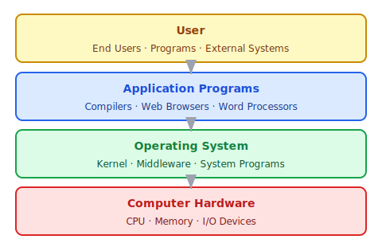
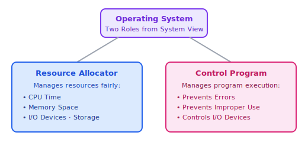
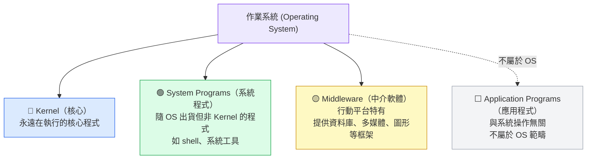

:::note
本系列文章內容參考自經典教材 **Operating System Concepts, 10th Edition (Silberschatz, Galvin, Gagne)**。本文對應章節：**Section 1.1 What Operating Systems Do**。
:::

## **電腦系統的組成元件**

一個電腦系統 (Computer System) 可以大致分為四個層次：

|      層次       |               組成元件               | 說明                                             |
| :-------------: | :----------------------------------: | :----------------------------------------------- |
| 第 4 層（頂層） |          **User（使用者）**          | 操作電腦的人、程式或其他系統                     |
|     第 3 層     | **Application Programs（應用程式）** | 如編譯器、瀏覽器、文字處理器，定義資源的使用方式 |
|     第 2 層     |   **Operating System（作業系統）**   | 控制硬體，協調各應用程式之間的資源使用           |
| 第 1 層（底層） |    **Computer Hardware（硬體）**     | CPU、Memory、I/O 裝置，提供基本計算資源          |

:::info 作業系統的核心定位
硬體提供計算資源；應用程式定義資源的使用方式；**作業系統則扮演中間協調者的角色**，控制硬體並公平地協調各程式的資源共用。

教科書中將作業系統比喻為**政府 (Government)**：政府本身不生產任何東西，但它提供一個讓其他組織能夠正常運作的環境。
:::

 

## **1.1.1 使用者視角 (User View)**

作業系統的設計目標會隨著使用情境的不同而有很大的差異：

|      使用情境       |          代表裝置          | 主要設計目標                                                        |
| :-----------------: | :------------------------: | :------------------------------------------------------------------ |
| **個人電腦 / 筆電** |  桌機、筆電（單一使用者）  | **易用性 (Ease of Use)** 優先；效能與安全次之；幾乎不考慮資源共用率 |
|    **行動裝置**     |      智慧型手機、平板      | 觸控螢幕介面、語音辨識（如 Apple Siri）；注重電池效能與無線連線     |
|   **嵌入式系統**    | 家電、汽車控制器、工業設備 | **幾乎沒有使用者介面**；設計為無人介入、自動執行                    |

 

## **1.1.2 系統視角 (System View)**

從電腦的角度來看，作業系統同時扮演兩種互補的角色：

### **資源配置者 (Resource Allocator)**

電腦系統中有許多共享資源，包括：

- **CPU Time**：處理器的執行時間
- **Memory Space**：記憶體的使用空間
- **Storage Space**：儲存空間
- **I/O Devices**：各種輸入輸出裝置

當多個程式或使用者同時需要這些資源時，作業系統必須決定**如何公平且有效率地分配**它們，避免衝突與資源閒置。

### **控制程式 (Control Program)**

作業系統管理使用者程式的執行，主要目的是：

1. **防止錯誤 (Errors)**：例如非法記憶體存取（存取其他程式的空間）、除以零
2. **防止不當使用 (Improper Use)**：避免程式相互干擾，或惡意占用系統資源
3. **控制 I/O 裝置**：特別關注 I/O 裝置的有序存取，確保資料不會損毀

 

## **1.1.3 作業系統的定義 (Defining Operating Systems)**

作業系統目前沒有一個普遍接受的精確定義，但最常用的定義是：

> **作業系統是電腦上永遠在執行的程式，通常稱為 Kernel（核心）。**

除了 Kernel 之外，現代作業系統還包含以下幾個部分：

### **Kernel 的開機流程**

電腦剛開機時，需要有一個初始程式來啟動整個系統：

:::tip 行動作業系統的特別之處
Apple iOS 和 Google Android 等行動 OS 除了 Kernel 之外，還內建了 **Middleware**，直接提供資料庫、多媒體、圖形等框架給應用程式開發者使用。這與傳統桌上型 OS 不同——行動 OS 整合了更多功能層，使其定義範圍更廣泛。
:::

:::caution Kernel 邊界的歷史爭議
究竟哪些功能應該屬於 OS 的範疇，在歷史上一直有爭議。

1998 年，美國司法部對 Microsoft 提起訴訟，指控 Microsoft 將**過多功能**（例如網頁瀏覽器 Internet Explorer）整合進 OS，進而壓制了其他應用程式廠商的競爭空間。此案 Microsoft 最終被判敗訴。

這個案例說明 OS 的邊界不只是技術問題，也牽涉到市場競爭與法律規範。
:::
