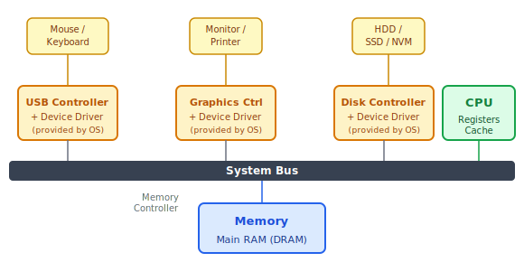
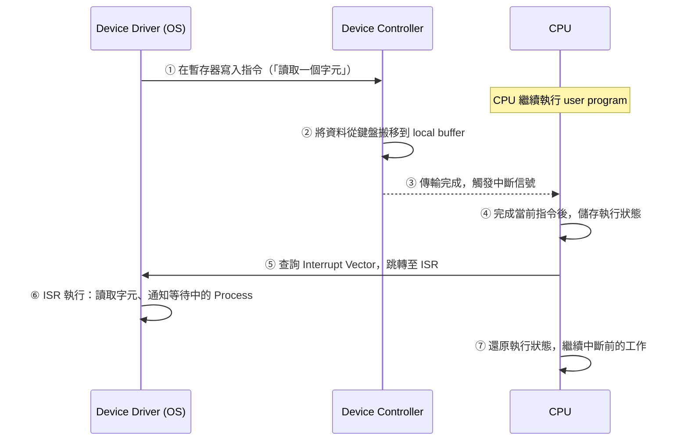
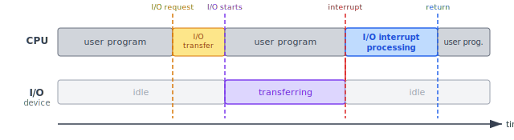
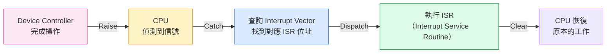
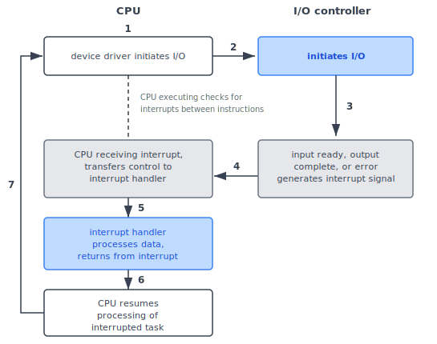
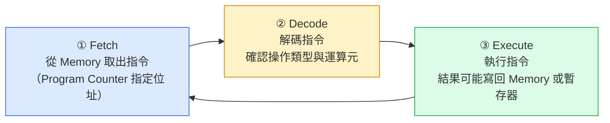
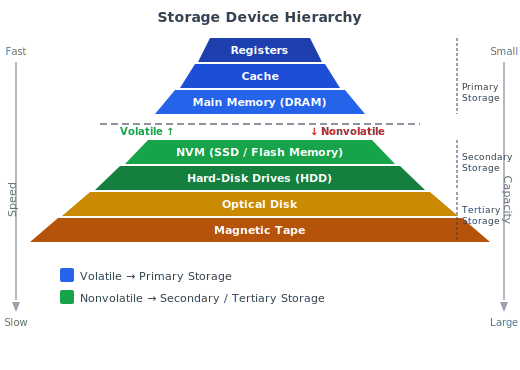
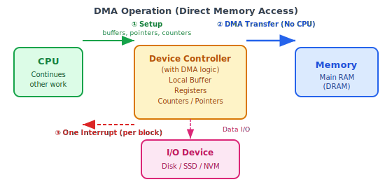

:::note
本系列文章內容參考自經典教材 **Operating System Concepts, 10th Edition (Silberschatz, Galvin, Gagne)**。本文對應章節：**Section 1.2 Computer-System Organization**。
:::

## **基本架構**

一台現代通用電腦由一個或多個 CPU 與多個裝置控制器組成，透過**共享匯流排 (System Bus)** 連接，並共享一塊主記憶體：

|                 元件                  | 說明                                                                |
| :-----------------------------------: | :------------------------------------------------------------------ |
|                **CPU**                | 執行指令的處理器，內含暫存器 (Registers) 與快取 (Cache)             |
|  **Device Controller（裝置控制器）**  | 負責控制特定類型的 I/O 裝置，內含 local buffer storage 與特殊暫存器 |
| **Memory Controller（記憶體控制器）** | 協調所有元件對共享記憶體的存取，避免同時存取時產生衝突              |
|     **System Bus（系統匯流排）**      | 連接所有元件的主要通訊路徑，也是各元件爭搶記憶體週期的地方          |

:::info Device Driver 的角色
每個 Device Controller 對應一個由 OS 提供的 **Device Driver（裝置驅動程式）**：

- **Device Controller**（硬體層）：實際控制 I/O 裝置
- **Device Driver**（軟體層，屬於 OS）：理解 Controller 的工作方式，並為 OS 提供**統一的介面**

透過 Device Driver，OS 不需要了解每種裝置的硬體細節，只需呼叫統一介面即可。**CPU 和 Device Controllers 可以並行執行**，彼此競爭對記憶體的存取權。
:::

:::info Memory Controller 在圖中的位置
在上圖中，Memory Controller 並未以獨立方框呈現，而是**概念上夾在 System Bus 與 Main Memory 之間**，負責仲裁（Arbitrate）所有元件對記憶體的存取請求。當 CPU 與 Device Controller 同時發出讀寫記憶體的請求時，Memory Controller 負責排隊調度、避免衝突，可以把它理解為從 System Bus 進入 Main Memory 的守門員，每一筆記憶體存取都必須通過它。

- **傳統架構**（Intel Hub Architecture）：Memory Controller 是主機板上一顆獨立晶片（Northbridge，北橋晶片），CPU 必須透過系統匯流排再經由北橋才能存取記憶體，延遲較高。
- **現代架構**：Intel Core、AMD Ryzen 等處理器已將 Memory Controller 整合進 CPU 晶片內，稱為 **IMC（Integrated Memory Controller）**，大幅縮短延遲並提升記憶體頻寬。
:::

:::info System Bus 的本質
**System Bus 是真實存在的硬體**，在傳統電腦中指主機板（Motherboard）上的一組實體導線（PCB Traces），負責傳輸三類訊號：

|          匯流排類型           | 說明                               |
| :---------------------------: | :--------------------------------- |
| **Address Bus（位址匯流排）** | 傳送記憶體位址，告知要存取哪個位置 |
|  **Data Bus（資料匯流排）**   | 傳送實際的資料內容                 |
| **Control Bus（控制匯流排）** | 傳送讀/寫控制訊號、中斷信號等      |

不過，「System Bus」在教科書中也作為**簡化的抽象模型**使用。現代電腦早已不再使用單一共享匯流排，而是改用 PCIe、DMI（Intel）、HyperTransport/Infinity Fabric（AMD）等**點對點（Point-to-Point）高速序列介面**，讓多對元件能夠同時通訊而不互相競爭。教科書以 System Bus 作為說明模型，重點在於讓讀者理解「所有元件共享一個通訊媒介、因此會發生競爭」的概念，而非現代硬體的具體實作。
:::

 

## **1.2.1 中斷 (Interrupts)**

以一次典型的電腦操作為例：一支程式正在執行 I/O，假設是從鍵盤讀取一個字元。整個過程分三個階段：

1. **Device Driver 設定指令**：OS 中的 Device Driver 將讀取指令寫入 Device Controller 的暫存器（Registers）。這個設定過程非常短暫，在時間線圖中對應到 **I/O transfer** 那一小段。
2. **Device Controller 自主執行**：Device Controller 讀取暫存器，確認動作（如「從鍵盤讀取一個字元」），然後將資料從 I/O 裝置搬移到它的 local buffer。在這段期間，**CPU 完全不介入**，繼續執行其他工作。
3. **傳輸完成，通知 Driver**：資料搬移完成後，Device Controller 必須通知 Device Driver。若是讀取操作，Driver 回傳資料或指向資料的指標；若是寫入操作，則回傳「write completed successfully」之類的狀態。

**那麼，Controller 要如何通知 Driver 操作已完成？** 這就是中斷（Interrupt）的用途。

### **中斷的基本流程**

硬體可以在任何時間，透過 System Bus 向 CPU 發送信號來觸發中斷。當 CPU 收到中斷信號時，它會**立刻停止**目前正在做的事，並將執行權轉移到一個**固定位置（Fixed Location）**。這個固定位置存放的是該中斷對應的 **ISR（Interrupt Service Routine，中斷服務程序）** 的起始位址。ISR 執行完畢後，CPU 恢復被中斷前的工作，就像什麼都沒發生一樣。

下圖呈現了一次 I/O 操作期間，CPU 與 I/O 裝置的時間線關係：

時間線上各標記的含義：

- **I/O request**：CPU（透過 Device Driver）向 Device Controller 發出 I/O 指令
- **I/O transfer**：Device Driver 將指令寫入 Device Controller 暫存器的短暫設定過程，完成後 CPU 即可去做其他事
- **I/O starts → interrupt 之間**：Device Controller 正在自主執行資料搬移，CPU 完全不介入，繼續執行 user program（兩者**並行**運作）
- **I/O interrupt processing**：即 ISR，CPU 暫停 user program，執行中斷服務程序來處理 I/O 完成事件
- **return**：ISR 結束，CPU 恢復被中斷的 user program

這張圖最核心的洞察是：**CPU 不需要等待 I/O 完成**。在 I/O 傳輸期間，CPU 繼續做其他工作；只有當裝置完成並送出中斷信號後，CPU 才短暫切換去執行 ISR，完成後立刻回到原本的工作。若沒有中斷機制，CPU 只能原地等待每一次 I/O，大量運算能力將被浪費。

:::info ISR 具體在做什麼：以鍵盤中斷為例
ISR 並不是「傳輸資料」的過程，而是在 I/O 完成後的**善後處理**。以鍵盤讀取字元為例，鍵盤 ISR 的工作通常包含：

1. 從 Device Controller 的 local buffer 讀取那個字元
2. 將字元存入 OS 維護的鍵盤輸入緩衝區（Keyboard Input Buffer）
3. 喚醒正在等待鍵盤輸入的 Process（讓它可以繼續執行）

所以圖中的「I/O interrupt processing」就是 ISR 在做上述這些事。ISR 結束後，CPU 完全恢復被打斷的工作，那支程式感知不到任何差異。
:::

:::info 什麼是「Fixed Location」？
「固定位置（Fixed Location）」，指的是記憶體中一個預先約定好的位址，也就是中斷向量表（Interrupt Vector Table）中對應該中斷編號的 ISR 起始位址。「固定」的意義在於：無論何時發生同類型的中斷，CPU 都固定去這個位置找處理程式，不需要臨時搜尋。
:::

### **中斷的分派：Interrupt Vector**

中斷觸發後，CPU 必須找到對應的 ISR。最直觀的做法是設計一個通用程式（Generic Routine）：先檢查是哪個裝置觸發中斷，再呼叫對應的中斷特定處理程式（Interrupt-Specific Handler）。但中斷發生的頻率非常高，多一層中轉搜尋的設計太慢。

現代系統改用**中斷向量（Interrupt Vector）**：一張存放在記憶體低位址區（前幾百個位置）的指標陣列（Pointer Array），每個 entry 存放一個 ISR 的起始位址。每個中斷請求都帶有一個唯一的**中斷號碼（Interrupt Number）**，CPU 用這個號碼直接索引陣列，取得 ISR 位址後立刻跳轉，完全不需要中間搜尋的步驟。Windows 和 UNIX 都採用這種方式分派中斷。

除了需要儲存 ISR 跳轉位址，中斷架構還必須保存**被中斷程式的執行狀態**（包括 Program Counter 和各暫存器的值），才能在 ISR 結束後正確恢復執行。若 ISR 在執行過程中需要修改暫存器，也必須在返回前自行還原這些值，確保被中斷的程式感知不到任何差異。

以 Intel 處理器的中斷向量表為例，向量編號 0–31 屬於系統保留的 Nonmaskable 事件（各類硬體錯誤與例外），向量編號 32–255 則屬於 Maskable，供各裝置的中斷使用：

| 向量號碼 | 說明                             |    類型     |
| :------: | :------------------------------- | :---------: |
|    0     | Divide Error（除以零）           | Nonmaskable |
|    1     | Debug Exception                  | Nonmaskable |
|    3     | Breakpoint                       | Nonmaskable |
|    13    | General Protection               | Nonmaskable |
|    14    | Page Fault                       | Nonmaskable |
|  0 – 31  | 各類錯誤與例外（保留給系統）     | Nonmaskable |
| 32 – 255 | 裝置產生的中斷（可由各裝置使用） |  Maskable   |

### **中斷的實作機制**

CPU 硬體上有一條專用線路：**Interrupt-Request Line（中斷請求線）**，CPU 在執行完每一條指令後都會偵測它。當 CPU 偵測到 Device Controller 在這條線上送出信號時，會讀取中斷號碼（Interrupt Number），以此號碼為索引查詢中斷向量，找到對應 ISR 的位址後跳轉執行。

ISR 進入後的工作流程如下：
1. **保存狀態**：儲存所有在 ISR 執行期間會被修改的暫存器值
2. **判斷原因**：確認是哪個裝置或哪種事件觸發了這次中斷
3. **處理事件**：執行對應的服務（如讀取資料、更新緩衝區、喚醒等待的 Process）
4. **還原狀態**：恢復先前儲存的暫存器值
5. **返回**：執行 return from interrupt 指令，CPU 回到被中斷前的執行點

:::tip 關鍵術語：Raise → Catch → Dispatch → Clear
這四個動詞是描述中斷完整生命週期的標準術語：

|     術語     |         執行者          | 說明                                                |
| :----------: | :---------------------: | :-------------------------------------------------- |
|  **Raise**   |    Device Controller    | 拉高 Interrupt-Request Line，斷言（assert）中斷請求 |
|  **Catch**   |           CPU           | 偵測到 Interrupt-Request Line 上的信號              |
| **Dispatch** |           CPU           | 查詢 Interrupt Vector，跳轉至對應的 ISR             |
|  **Clear**   | Interrupt Handler (ISR) | 完成服務，中斷被清除                                |
:::

### **兩種中斷類型**

大多數 CPU 有兩條中斷請求線：

- **Nonmaskable Interrupt（不可遮蔽中斷）**：保留給無法忽略的嚴重事件，例如無法恢復的記憶體錯誤。無論 CPU 在做什麼，都必須立刻回應。
- **Maskable Interrupt（可遮蔽中斷）**：CPU 可以暫時關閉（mask）這條線，用於保護某些關鍵指令序列不被打斷。裝置控制器通常使用這條線來請求 I/O 服務。

### **Interrupt Chaining（中斷鏈接）**

在實際系統中，裝置數量往往遠多於中斷向量表的 entry 數量。一個直覺的解法是讓向量表的每個 entry 指向一個 **ISR Linked List** 的頭部，而非直接指向單一 ISR。中斷觸發後，CPU 依序呼叫串列中的每個 ISR，直到找到能服務該中斷的程序為止，這個設計稱為 **Interrupt Chaining（中斷鏈接）**。

這是介於兩種極端之間的折衷設計：
- **超大向量表**（每個裝置一個 entry）：可以直接定位，但表格會非常巨大，浪費大量記憶體空間
- **單一通用處理程序**（所有中斷共用一個 ISR）：向量表極小，但每次中斷都要逐一搜尋所有裝置，效率低下

Interrupt Chaining 讓多個裝置共享同一個向量 entry，以合理的記憶體代價換取可接受的查找效率。

### **中斷優先層級 (Interrupt Priority Levels)**

現代電腦系統實作了一套**中斷優先層級（Interrupt Priority Levels）** 機制。這個機制讓 CPU 能夠區分高優先級與低優先級的中斷，並做出相應處理：

- **高優先級中斷**可以**搶占（Preempt）** 正在執行的低優先級 ISR，強制 CPU 先處理更緊急的事件
- CPU 可以在不完全關閉中斷的前提下，選擇**延後處理低優先級中斷**，先服務時間敏感的高優先級事件（如硬體錯誤、即時控制訊號）

這個機制由 CPU 與**中斷控制器（Interrupt Controller）** 硬體共同實作，是現代 OS 能夠即時回應嚴重事件的基礎。

 

## **1.2.2 儲存體結構 (Storage Structure)**

### **主記憶體 (Main Memory)**

CPU **只能**直接從記憶體（Main Memory）載入指令並執行，因此所有程式在執行前都必須先被載入主記憶體。主記憶體也是目前大多數通用電腦執行程式的主要工作空間，採用 **DRAM（Dynamic Random-Access Memory）** 技術實作，又稱 **RAM（Random-Access Memory）**。

記憶體的基本操作只有兩種：

- **Load**：從 Main Memory 將一個 byte 或 word 搬移到 CPU 內部暫存器
- **Store**：將暫存器的內容寫回 Main Memory

CPU 會根據 **Program Counter（程式計數器）** 中儲存的位址，自動從記憶體取出下一條指令並執行。記憶體本身只看到一連串的記憶體位址請求，並不知道這些位址是來自指令計數器、陣列索引、間接定址或其他方式所產生的。

:::info Von Neumann 架構與指令執行週期
**Von Neumann 架構**是現代電腦的基礎設計，由三個主要部分組成：**CPU**、**記憶體（Memory Unit）**，以及**輸入輸出裝置（I/O Devices）**。CPU 內部又包含三個元件：

- **Control Unit（控制單元）**：解讀指令、控制資料流向
- **ALU（Arithmetic Logic Unit，算術邏輯單元）**：執行加減乘除與邏輯運算
- **Registers（暫存器）**：CPU 內部最快的暫存空間，存放正在運算的資料與位址

Von Neumann 架構的核心設計原則是：**CPU 與記憶體分離，CPU 只能從記憶體載入程式**。因此，任何被執行的程式都必須先儲存在記憶體中。

 

典型電腦遵循三步迴圈反覆執行每一條指令：

指令執行後，結果可能寫回主記憶體，也可能留在暫存器中等待後續指令使用。
:::

RAM 是**揮發性（Volatile）**的，斷電後資料立即消失。由於電腦開機時 RAM 中沒有任何資料，因此需要一個特殊機制來啟動系統：**Bootstrap Program（開機程式）**，存放於**韌體（Firmware）** 中，例如 **EEPROM（Electrically Erasable Programmable Read-Only Memory）** 。EEPROM 是非揮發性的，可以被修改但次數有限，速度較慢，適合存放不常改動的靜態程式與資料（例如 iPhone 使用 EEPROM 儲存序號與硬體資訊）。Bootstrap Program 負責在開機時初始化所有系統元件，並將 OS Kernel 載入記憶體。

### **主記憶體的兩個根本限制**

理想情況下，所有程式與資料都應該永遠駐留在主記憶體中，但這在大多數系統上並不可行，原因有兩個：

1. **容量不足**：主記憶體通常太小，無法同時容納所有需要用到的程式和資料
2. **揮發性（Volatile）**：主記憶體斷電後資料消失，資料必須長期保存在非揮發性的儲存體中

因此，大多數電腦系統提供**輔助儲存體（Secondary Storage）**作為主記憶體的延伸，主要的需求是：能夠**永久保存大量資料**。最常見的輔助儲存裝置是硬碟（HDD）與非揮發性記憶體（NVM）裝置（如 SSD），系統程式和應用程式通常儲存在其中，需要執行時才載入主記憶體。

:::info 儲存單位定義與換算

|   單位   | 縮寫  | 大小                                        |
| :------: | :---: | :------------------------------------------ |
|   Bit    |   -   | 最小單位，值為 0 或 1                       |
|   Byte   |   B   | 8 bits，最小的可定址單位                    |
|   Word   |   -   | 架構相關（如 64-bit CPU 的 word = 8 bytes） |
| Kilobyte |  KB   | 1,024 bytes（= 2¹⁰）                        |
| Megabyte |  MB   | 1,024² bytes                                |
| Gigabyte |  GB   | 1,024³ bytes                                |
| Terabyte |  TB   | 1,024⁴ bytes                                |
| Petabyte |  PB   | 1,024⁵ bytes                                |

注意：硬體廠商常以 10 進位（1 MB = 1,000,000 bytes）標示容量，與 2 進位定義有落差。網路傳輸速率通常以 **bit（小寫 b）** 為單位，而非 byte。
:::

### **儲存體層次結構 (Storage Hierarchy)**

各種儲存體在速度、容量、揮發性、成本上各有取捨，可以依這些特性組成一個層次結構（Storage Hierarchy）。一般規律是：**越靠近 CPU 的儲存體越快、越小、越貴**；越遠的則越慢、越大、越便宜。

| 層次  |        儲存體         |     揮發性      | 速度  | 容量  |   分類    |
| :---: | :-------------------: | :-------------: | :---: | :---: | :-------: |
|   1   |       Registers       |    Volatile     | 最快  | 最小  |  Primary  |
|   2   |         Cache         |    Volatile     | 極快  |  小   |  Primary  |
|   3   |  Main Memory (DRAM)   |    Volatile     |  快   |  中   |  Primary  |
|   4   |   NVM (SSD / Flash)   | **Nonvolatile** | 中快  |  大   | Secondary |
|   5   |      HDD（硬碟）      |   Nonvolatile   |  慢   | 很大  | Secondary |
|   6   | Optical Disk（光碟）  |   Nonvolatile   | 更慢  |  大   | Tertiary  |
|   7   | Magnetic Tape（磁帶） |   Nonvolatile   | 最慢  | 最大  | Tertiary  |

層次結構的前四層（Registers、Cache、Main Memory、NVM）均採用**半導體記憶體（Semiconductor Memory）** 技術。NVM 裝置最常見的形式是 Flash 記憶體，廣泛用於智慧型手機、平板，以及越來越多的筆電、桌機、伺服器。

設計一個完整的儲存系統，必須在各層之間取得平衡：只使用必要數量的昂貴高速記憶體，同時盡可能提供足夠的低成本非揮發性儲存體。當兩層儲存體之間存在明顯的速度差異時，可以在其間加入**快取（Cache）** 來提升整體效能。

這個層次結構的存在，根本原因是 Von Neumann 架構的先天瓶頸：

:::note Von Neumann 瓶頸 (von Neumann Bottleneck)
Von Neumann 架構要求 CPU 必須反覆從記憶體讀取指令與資料。當 CPU 需要對大量資料執行簡單運算時，資料在 CPU 與記憶體之間的搬移本身就耗費大量時間，使得 CPU 大部分時間都在等待資料，而非真正在計算，嚴重限制了整體效率。

解決方向有兩個：

- **加快記憶體讀寫速度**：持續演進記憶體技術（DDR → DDR2 → DDR3 → DDR4 → DDR5），縮短每次存取的延遲
- **減少存取主記憶體的次數**：採用階層式記憶體管理，在 CPU 與主記憶體之間加入更快的 Cache，並增加 CPU 內部的暫存器數量，讓常用資料盡量留在離 CPU 最近的層級

儲存體層次結構（Storage Hierarchy）正是第二個方向的具體實現。
:::

:::info 教科書術語規範
本書對儲存體的統一稱呼如下：

- **Volatile storage → Memory**（記憶體，泛指揮發性儲存）
- **Nonvolatile storage → NVS**（非揮發性儲存，Non-Volatile Storage）
  - 電子式 (Electrical)：Flash、SSD、FRAM、NRAM → 統稱 **NVM**
  - 機械式 (Mechanical)：HDD、光碟、磁帶 → 直接稱呼裝置名稱
:::

 

## **1.2.3 I/O 結構 (I/O Structure)**

OS 程式碼有很大一部分都是在管理 I/O，這是因為 I/O 對系統的可靠性與效能至關重要，而且裝置種類繁多、差異很大。

### **Interrupt-Driven I/O 的瓶頸**

在 1.2.1 節描述的中斷驅動 I/O（Interrupt-Driven I/O）中，每次 I/O 完成只傳輸少量資料（如一個字元），對低速裝置來說運作良好。但若要傳輸大量資料（如讀取一個完整的檔案），每搬移一個 byte 就觸發一次中斷，CPU 會被反覆打斷，產生極高的中斷處理開銷，這對高速裝置（如 NVS I/O）而言是無法接受的。

### **直接記憶體存取 (DMA, Direct Memory Access)**

為了解決大量資料傳輸的效率問題，現代系統使用 **DMA（Direct Memory Access，直接記憶體存取）**。DMA 讓 Device Controller 能夠直接在 I/O 裝置與主記憶體之間傳輸整個 block 的資料，完全不需要 CPU 逐步介入：

1. **設定階段**：Device Driver 設定好 Device Controller 的 buffers（緩衝區位址）、pointers（指標）、counters（計數器），告知 Controller 要搬移多少資料、搬到記憶體的哪個位置。
2. **DMA 自主傳輸**：Device Controller 直接在 I/O 裝置與 Main Memory 之間搬移整個 block 的資料，**CPU 完全不介入**，可自由執行其他工作。
3. **完成通知**：整個 block 傳輸完成後，Device Controller 才觸發**一次**中斷，通知 Device Driver 操作已完成。

|   對比項目   | Interrupt-Driven I/O |             DMA I/O              |
| :----------: | :------------------: | :------------------------------: |
|   中斷次數   |    每個 byte 一次    |       **每個 block 一次**        |
| CPU 介入程度 |  高（每次都要介入）  |     低（設定後即可做其他事）     |
|   適用場景   |  低速裝置、少量資料  | 高速裝置、大量資料（如 NVS I/O） |

CPU 只需在「設定階段」和「block 完成的中斷」兩個時間點介入，傳輸期間完全由 DMA Controller 自行處理。這大幅降低了 CPU 的中斷次數，特別是在讀寫大型檔案時效益非常顯著。

:::info Switch 架構 vs Bus 架構
部分高階系統採用 **Switch 架構**取代傳統的 Bus 架構：

- **Bus 架構**：所有元件共享一條匯流排，同一時間只能有一對元件通訊，容易成為瓶頸
- **Switch 架構**：多個元件可以**同時、並行地**與其他元件通訊，不需競爭共享匯流排

在 Switch 架構下，DMA 的效益更加顯著，因為 I/O 傳輸與 CPU 計算可以真正做到完全並行，而不是輪流搶佔同一條匯流排。
:::
