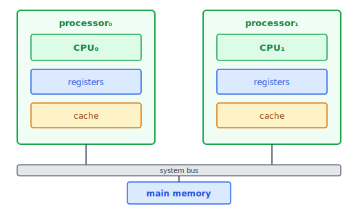
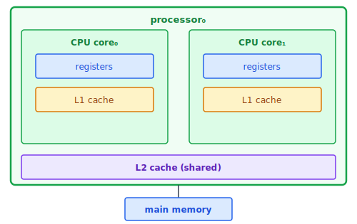
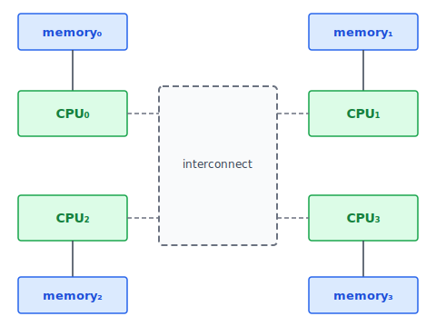
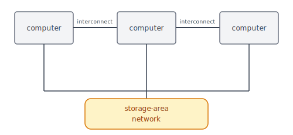

:::note
本系列文章內容參考自經典教材 **Operating System Concepts, 10th Edition (Silberschatz, Galvin, Gagne)**。本文對應章節：**Section 1.3 Computer-System Architecture**。
:::

電腦系統依所使用的**通用處理器 (General-Purpose Processor)** 數量，可以大致分成三種架構：單處理器系統、多處理器系統，以及叢集式系統。這三種分類由簡到複，反映了從個人電腦到企業伺服器的演進歷程，以及各種架構背後的設計取捨。

 

## **1.3.1 單處理器系統 (Single-Processor Systems)**

單處理器系統只有**一個通用 CPU**，其中包含一個處理核心 (Core)。這個核心負責執行指令，並配備本地暫存器 (Registers) 作為資料的臨時存放空間。作業系統的所有工作、以及所有使用者程式，都在這唯一的一個核心上輪流執行。

:::info 特殊用途處理器不算數
許多系統除了主 CPU 之外，還包含各種**特殊用途處理器 (Special-Purpose Processors)**，例如：

- **磁碟控制器**：擁有自己的磁碟排程演算法，減輕主 CPU 的負擔
- **鍵盤控制器**：將按鍵轉換成代碼後才傳給 CPU
- **圖形控制器**：處理繪圖相關計算

這些特殊用途處理器只執行**有限的指令集**，不執行作業系統的 Process，也不算是「通用處理器」。它們有時由作業系統管理（OS 傳送下一個任務並監控其狀態），有時則完全自主運作，OS 甚至無法與之通訊。因此，**只要只有一個通用 CPU**，就仍然是單處理器系統。

根據此定義，現代電腦幾乎已找不到真正的單處理器系統。
:::

 

## **1.3.2 多處理器系統 (Multiprocessor Systems)**

隨著運算需求增長，單一 CPU 的處理能力逐漸成為瓶頸。多處理器系統（Multiprocessor Systems）的出現正是為了打破這個限制。這類系統擁有**兩個或多個處理器**，各自都有 CPU，透過共享的系統匯流排 (System Bus) 相連，有時也共享時脈 (Clock)、記憶體與周邊裝置。現代電腦，從行動裝置到伺服器，幾乎清一色採用多處理器架構。

**多處理器系統的主要優點是提升吞吐量 (Throughput)**。增加處理器數量後，可以在相同時間內完成更多工作，讓系統整體的工作處理速率大幅提升。

:::info 什麼是 Throughput（吞吐量）？
Throughput 指的是**系統在單位時間內能完成的工作量**，例如每秒可以處理的請求數、完成的任務數。對多處理器系統來說，Throughput 是衡量整體效能的核心指標。增加處理器數量的目的，正是讓多個工作可以真正地並行執行，從而在相同時間內完成更多工作。

Throughput 與 Latency（延遲）是兩個不同的概念：  
Latency 衡量的是「完成單一工作所需的時間」，而 Throughput 衡量的是「系統整體的處理能力」。增加處理器數量主要提升的是 Throughput，對單一工作的 Latency 改善效果有限。
:::

### **為什麼加速倍率 < N？**

這是多處理器系統最重要的一個觀念，也是直覺上容易想錯的地方。

直覺上，兩個處理器似乎應該帶來兩倍速度，N 個處理器帶來 N 倍速度。實際上，N 個處理器的加速倍率永遠小於 N。原因有兩個：

**原因 1：協調開銷 (Coordination Overhead)**

多個處理器必須協調彼此的工作，避免兩個處理器同時修改同一份資料造成錯誤（後面章節會詳細討論）。這個協調本身就要花費時間，因此無法獲得理論上的完美線性加速。

**原因 2：共享資源的競爭 (Contention for Shared Resources)**

所有處理器共享同一個 System Bus 來存取記憶體。Bus 每次只能讓一個處理器使用，當多個處理器同時需要存取記憶體時，就必須排隊等待。CPU 越多，競爭越激烈，等待時間越長。當處理器數量增加到某個程度，Bus 本身就會成為系統瓶頸，整體效能甚至可能開始下降。這個現象也是後來 NUMA 架構出現的根本動機。

### **SMP（對稱多處理，Symmetric Multiprocessing）**

最常見的多處理器架構是**對稱多處理（SMP, Symmetric Multiprocessing）**。在 SMP 中，**每個 CPU 的地位完全相等（peer）**，都可以執行所有工作，包括作業系統的功能與使用者 Process，沒有主從之分。

下圖展示了一個典型的 SMP 架構，以兩個 CPU 為例。每個 CPU 都有自己私有的暫存器組與本地快取，兩者共享同一塊實體記憶體，並透過 System Bus 相互連接：

圖中有幾個重要細節值得注意。首先，每個 CPU 都有**私有的 Registers 與 Cache**，這讓各 CPU 在執行時不需要為了暫存資料而競爭。其次，所有 CPU 都透過同一條 **System Bus** 連接到共享的實體記憶體，這是 SMP 架構的核心，也是它效能瓶頸的來源。以下整理 SMP 的主要特性：

|       特性       | 說明                                                                    |
| :--------------: | :---------------------------------------------------------------------- |
|   **私有資源**   | 每個 CPU 有自己的暫存器組 (Registers) 與本地快取 (Cache)                |
|   **共享資源**   | 所有處理器透過 System Bus 共享同一塊實體記憶體                          |
|   **並行能力**   | N 個 CPU 可同時執行 N 個 Process，效能不會顯著下降                      |
| **負載均衡問題** | 若 CPU 之間負載不均（某個閒置、某個超載），需動態分配共享資料結構來平衡 |

SMP 的負載均衡問題是設計上需要特別處理的挑戰：若某個 CPU 正在滿載處理大量工作，而另一個 CPU 卻閒置等待，整體效率仍然低落。解決方法是讓 OS 動態地在 CPU 之間共享任務佇列，確保工作量的均勻分配，但這又引入了更多需要同步的共享資料結構。

### **Multicore（多核心）**

多核心系統（Multicore）將**多個計算核心整合在單一晶片（Chip）上**，是現代多處理器的主流形式。多核心系統在作業系統的眼中，與擁有多個獨立 CPU 的 SMP 系統基本上是等價的：一個擁有 N 個核心的處理器，對 OS 而言就像是 N 個標準 CPU。

下圖展示一個雙核心（Dual-Core）設計的晶片結構。兩個核心各自擁有私有的 L1 Cache，並共享同一個 L2 Cache：

圖中的快取階層設計是多核心晶片的關鍵。每個核心有自己的 **L1 Cache**（最快、最小），整個晶片共享一個 **L2 Cache**（稍慢、稍大）。這個「私有 + 共享」的折衷設計，讓每個核心有自己的快速快取，同時讓核心之間能共享常用資料，減少重複從主記憶體讀取的次數。

**為什麼多核心晶片比「多個單核晶片」更受青睞？**

將多個核心整合在同一晶片上，有兩個根本的優勢。第一，**晶片內通訊速度遠快於跨晶片通訊**：兩個核心在晶片內部交換資料，不需要穿越 System Bus，延遲大幅降低。第二，**功耗顯著降低**：一個雙核晶片的功耗遠低於兩個分開的單核晶片，對行動裝置這種電池供電的環境來說，功耗是非常關鍵的設計考量。

:::info 關鍵術語定義
教科書在這裡很仔細地區分了幾個常被混用的詞：

|        術語        | 定義                                                  |
| :----------------: | :---------------------------------------------------- |
|      **CPU**       | 執行指令的硬體（hardware that executes instructions） |
|   **Processor**    | 包含一個或多個 CPU 的實體晶片                         |
|      **Core**      | CPU 的基本計算單元                                    |
|   **Multicore**    | 同一 CPU 晶片上包含多個計算核心                       |
| **Multiprocessor** | 包含多個 Processor 的系統                             |

雖然現代電腦幾乎全面採用多核心架構，但在討論一般計算單元時，本書仍使用 CPU 一詞；只有在特別強調核心數量時，才使用 Core 或 Multicore。日常口語的「處理器」通常指 CPU 或 Core，教科書這裡的定義更為精確。
:::

### **NUMA（非均勻記憶體存取，Non-Uniform Memory Access）**

SMP 架構有一個根本的可擴充性問題：當 CPU 數量增多後，所有 CPU 都在競爭同一條 System Bus，Bus 很快就會成為瓶頸，導致效能不升反降。一個自然的解法是：**與其讓所有 CPU 競爭同一條 Bus，不如讓每個 CPU 擁有自己的本地記憶體**，這就是 NUMA 的核心思想。

下圖展示 NUMA 的架構。每個 CPU（或一組 CPU）都有一塊離自己「很近」的本地記憶體（local memory），透過高速本地 Bus 直接存取；同時，所有 CPU 透過共享的 **System Interconnect** 相連，讓 CPU₀ 也能存取 CPU₃ 的記憶體，只是需要穿越 Interconnect，速度較慢：

「Non-Uniform（非均勻）」這個名字本身就說明了架構的本質：**存取記憶體的速度，取決於存取的是哪一塊記憶體**。這與 SMP 的「均勻（Uniform）」形成鮮明對比，SMP 中所有 CPU 存取任何記憶體的速度都相同，因為都走同一條 System Bus。

- CPU₀ 存取自己的 memory₀：**快**（走本地 Bus，無競爭）
- CPU₀ 存取 CPU₃ 的 memory₃：**慢**（需穿越 System Interconnect）

NUMA 架構的核心優勢在於可擴充性（Scalability）。當 CPU 存取的是本地記憶體時，完全不需要競爭共享的 System Bus，因此即使系統擴充到很多個 CPU，效能也不會急劇下滑。下表對比 SMP 與 NUMA 的主要差異：

|     項目     |            SMP            | NUMA                           |
| :----------: | :-----------------------: | :----------------------------- |
|  記憶體配置  |    所有 CPU 共享同一塊    | 每個 CPU 有本地記憶體          |
| 本地存取速度 |           一般            | **快**（無 Interconnect 競爭） |
| 遠端存取速度 |           一般            | **慢**（需穿越 Interconnect）  |
|    擴充性    | 受 Bus 頻寬限制，擴充困難 | **可擴充至更多處理器**         |

:::caution NUMA 的隱藏成本
NUMA 的「遠端存取慢」不只是稍微慢一點，在某些情況下可能慢好幾倍，嚴重影響效能。因此 OS 必須在 CPU Scheduling 和 Memory Management 上特別謹慎，盡量讓 Process 使用靠近它所在 CPU 的本地記憶體（這稱為 NUMA-aware scheduling）。相關的排程與記憶體管理策略，該教科書將在 Section 5.5.2 與 Section 10.5.4 進一步討論。由於 NUMA 能有效擴充至大量處理器，它正逐漸成為伺服器與高效能運算系統的主流架構。
:::

 

## **1.3.3 叢集式系統 (Clustered Systems)**

叢集式系統（Clustered Systems）是另一種形式的多處理器架構，但它的組成方式與前兩種截然不同。前面介紹的 SMP 和 NUMA，都是在單一電腦內增加處理器數量；而叢集式系統則是**將多台完整的獨立電腦連接在一起**，形成一個協同工作的系統。

具體來說，叢集式系統由**兩個或多個獨立節點 (Node)** 組合而成，每個節點通常本身就是一個多核心系統。這種系統被稱為**鬆耦合 (Loosely Coupled)**，對比於 SMP 處理器之間的「緊耦合」。各節點之間透過 **LAN（區域網路）** 或更快速的互連（如 InfiniBand）相連，並**共享儲存裝置**。

下圖展示叢集系統的一般結構：多台電腦節點透過網路互連，共同連接到一個儲存池（Storage-Area Network）：

圖中最關鍵的元素是右側的儲存池（SAN）。所有節點都能存取同一份資料，這正是叢集系統能夠實現高可用性與高效能運算的基礎。

### **叢集的存在目的：高可用性**

建立叢集式系統的主要目的是**高可用性（High Availability）**：即使部分節點故障，整體服務仍能持續運作。叢集軟體（Cluster Software）運行在每個節點上，讓每個節點可以透過網路監控其他節點的狀態。若某節點故障，監控節點能接管它的儲存資源，並重新啟動原本在那個節點上執行的應用程式，使用者只感受到短暫的服務中斷。

高可用性意味著系統具備更高的可靠性（Reliability）。圍繞這個目標，有兩個重要的術語描述系統面對故障時的不同能力：

- **Graceful Degradation（優雅降級）**：描述的是「比例下降」的能力。當部分硬體損壞後，系統能繼續運作，但服務能力會與剩餘可用硬體的數量成比例地降低，而不是直接完全崩潰。例如，叢集中的四個節點壞了一個，系統仍以三個節點的能力繼續服務，而非全面停機。

- **Fault Tolerant（容錯）**：是比 Graceful Degradation 更高的標準。容錯系統要求**任何單一元件故障都不影響系統繼續正常運作**，服務能力不會因故障而下降。要達到這個目標，系統必須具備主動的故障偵測（Detection）、診斷（Diagnosis），以及（若可能的話）自動修復（Correction）的機制。容錯系統的設計複雜度與成本都遠高於 Graceful Degradation 系統。

### **非對稱叢集 vs. 對稱叢集**

叢集的內部組織方式可以分成兩種模式，差別在於各節點的分工方式：

在**非對稱叢集（Asymmetric Clustering）** 中，所有節點並不平等。其中一台機器作為「主要伺服器」實際執行應用程式，另一台（或多台）機器則處於 **Hot-Standby（熱備援）** 模式，什麼應用程式都不跑，只是持續監控主要伺服器的狀態。一旦主要伺服器故障，熱備援機器立即接管，成為新的主要伺服器。這種做法的缺點很明顯：備援機器的硬體資源完全閒置，是種浪費。

在**對稱叢集（Symmetric Clustering）** 中，所有節點的地位相等，同時執行各自的應用程式，並**互相監控**彼此的狀態。這種方式顯然更有效率，所有的硬體都在為系統服務，沒有資源被白白浪費。代價是系統的協調複雜度更高，且需要有足夠的應用程式可以分散到各節點上執行。

|           類型            | 說明                                                        |           資源效率           |
| :-----------------------: | :---------------------------------------------------------- | :--------------------------: |
| **Asymmetric Clustering** | 一台執行應用，其餘 Hot-Standby 純監控；主機故障時備援機接管 |      較低（備援機閒置）      |
| **Symmetric Clustering**  | 所有節點同時執行應用並互相監控                              | **較高**（所有硬體都在工作） |

### **儲存區域網路與分散式鎖定管理**

叢集能夠運作的關鍵基礎設施是 **SAN（Storage-Area Network，儲存區域網路）** 。SAN 提供一個共享的儲存池，讓多台電腦都能連接並存取同一份資料。在 SAN 架構下，若某台節點故障，任何其他連接到 SAN 的節點都可以立即存取原本屬於那台節點的資料，並接管其應用程式，大幅縮短故障恢復時間。在資料庫叢集中，數十台主機可以共享同一個資料庫，大幅提升效能與可靠性。

然而，共享儲存帶來了一個新問題：如果多台節點同時對同一份資料執行寫入操作，就可能產生衝突，導致資料損壞。為了解決這個問題，並行叢集（Parallel Cluster）引入了 **DLM（Distributed Lock Manager，分散式鎖定管理員）**。

DLM 的職責是對共享磁碟上的資料進行存取控制（Access Control）與鎖定（Locking），確保在任何時間點，同一份資料不會同時被多台主機以衝突的方式存取。以 Oracle Real Application Cluster 為例，每台機器都執行 Oracle 資料庫，一個專門的鎖定軟體層追蹤每次磁碟存取，確保所有機器都能安全地讀寫完整的資料庫，而不會因為並行寫入而引發衝突。

:::info 叢集也能用於高效能運算
叢集除了提供高可用性，也被廣泛用於**高效能計算（High-Performance Computing）**。透過**並行化（Parallelization）** 技術，可以將一個大型計算任務切割成多個子任務，分散到叢集中的所有節點上並行計算。每個節點解決屬於自己的那一份問題，最後將所有節點的計算結果彙整成最終答案。這種方式讓叢集系統能夠提供遠超過任何單一多處理器系統的運算能力，被廣泛應用於科學模擬、大數據分析等領域。
:::
