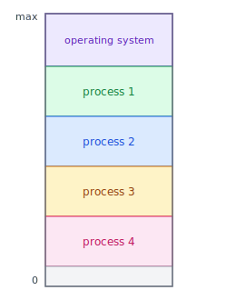
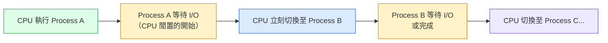
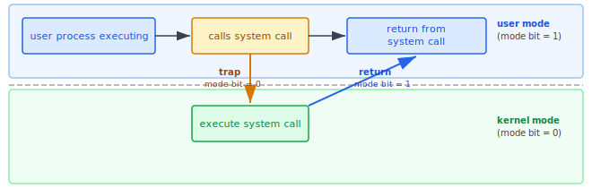
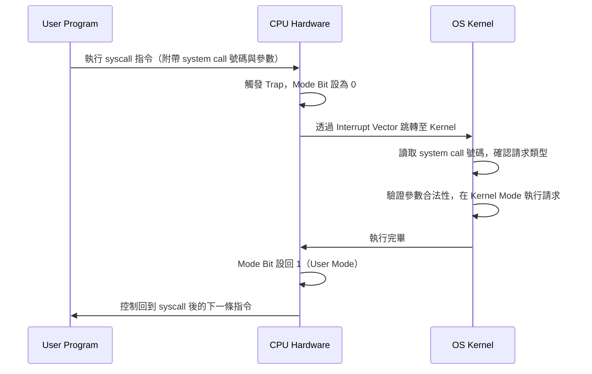
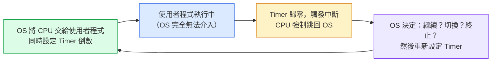

:::note
本系列文章內容參考自經典教材 **Operating System Concepts, 10th Edition (Silberschatz, Galvin, Gagne)**。本文對應章節：**Section 1.4 Operating-System Operations**。
:::

 

## **系統啟動與事件驅動**
電腦要開始運作，例如在接上電源或重新開機後，需要一段初始程式才能啟動。這個初始程式稱為**開機程式 (Bootstrap Program)**，通常非常簡單，存放在電腦硬體的**韌體 (Firmware)** 中，例如 EEPROM。開機程式的任務是初始化系統的各個層面，包括 CPU 暫存器 (Registers)、裝置控制器 (Device Controllers) 和記憶體內容。初始化完成後，開機程式必須知道如何找到作業系統的 **Kernel**，並將它載入記憶體中。

Kernel 開始執行之後，便可以開始為系統和使用者提供服務。有些服務是在 Kernel 之外由**系統常駐程式 (System Daemons)** 提供的，這些程式在開機時被載入記憶體，並在 Kernel 整個運作期間持續運行。在 Linux 上，第一個系統程式是 `systemd`，它負責啟動其他許多 Daemon。當這個啟動階段完成後，系統才算完全開機，並靜靜地等待某件事發生。

完全啟動後，OS 幾乎完全依靠**事件 (Event)** 驅動：有事情發生，OS 才介入處理；沒有事情發生，它就閒置等待。這些事件幾乎都以**中斷 (Interrupt)** 的形式到達，主要分為兩種：

|              事件類型               |    來源    | 說明                                                 |
| :---------------------------------: | :--------: | :--------------------------------------------------- |
| **Hardware Interrupt（硬體中斷）**  | 裝置控制器 | I/O 完成、硬體故障等                                 |
| **Trap / Exception（陷阱 / 例外）** |    軟體    | 程式錯誤（如除以零）或使用者程式主動執行 System Call |

:::info Trap 是 Software-Generated Interrupt
Trap（或稱 Exception）是一種由軟體觸發的中斷，分兩種情境：

- **意外錯誤**：程式執行了不合法的操作，例如除以零或存取不屬於自己的記憶體
- **主動請求**：使用者程式透過 **System Call**，請求 OS 代為執行只有 OS 才有權限做的事

兩者都會讓 CPU 跳轉至 OS 中對應的處理程序。
:::

 

## **1.4.1 多程式處理與多工 (Multiprogramming and Multitasking)**

### **問題的起點：CPU 比 I/O 快太多了**

要理解多程式處理為什麼存在，必須先理解一個物理現實：

> **CPU 執行指令的速度（nanosecond 等級）遠遠快於 I/O 裝置完成操作的速度（millisecond 甚至 second 等級）。**

以讀取磁碟一個 Block 為例，CPU 等待的時間內，可以執行數百萬條指令。

如果一次只執行一個程式，那麼每次這個程式等待 I/O，CPU 就只能傻傻地空轉等待，明明有大量計算能力，卻完全空置。這在系統設計上是極大的浪費。事實上，單一程式通常無法隨時讓 CPU 或 I/O 裝置保持忙碌狀態。

### **多程式處理 (Multiprogramming) 的解法**

Multiprogramming 的解法是：**同時把多個 Process 放在記憶體中**，CPU 在某個 Process 等待 I/O 時，立刻切換去執行另一個 Process。

概念如下：作業系統同時在記憶體中保留多個 Process（如下圖所示）。OS 挑選其中一個開始執行。最終，該 Process 可能需要等待某個任務（例如 I/O 操作）完成。在非多程式系統中，CPU 會就此空轉。在多程式系統中，OS 直接切換到另一個 Process 並繼續執行。當那個 Process 也需要等待時，CPU 再切換到下一個，依此類推。最終，第一個 Process 完成了等待並取回 CPU。**只要記憶體中至少有一個 Process 需要執行，CPU 就永不閒置。**

下圖呈現了多程式處理的記憶體配置方式：作業系統佔據高位址，多個 Process 並排存放於記憶體中，等待 CPU 輪流執行：

記憶體中同時存放了 process 1 到 process 4，以及位於高位址的作業系統本身。這樣的配置讓 CPU 在任何一個 Process 等待 I/O 時，都能立刻切換到其他等待中的 Process 繼續工作，而不是乾等。

這個概念在生活中其實很常見。就像一位律師不會同一時間只服務一位委託人：當某個案件正在等待開庭或等待文件簽署時，律師可以去處理另一個案件。只要委託人夠多，律師就不會有閒置的時間。多程式處理在電腦系統中扮演的正是同樣的角色，**用 Process 的切換來填補 I/O 等待的空隙，最大化 CPU 使用率**。

下圖呈現了 CPU 在多個 Process 之間切換的時序邏輯：

CPU 不再被動等待某個 Process 完成 I/O，而是主動切換，讓運算能力持續被利用。

### **多工 / 分時 (Multitasking / Time-sharing)**

Multitasking 是 Multiprogramming 的進一步延伸。差別在於：

- **Multiprogramming**：等 Process 主動等待 I/O，才切換到下一個 Process
- **Multitasking**：不管 Process 有沒有在等 I/O，CPU **每隔一小段時間就強制切換**

為什麼要「強制切換」？考慮一種情境：當一個 Process 在執行時，它通常只執行很短一段時間後，就會完成或需要執行 I/O。這個 I/O 可能是互動式的，也就是輸出顯示給使用者看，輸入來自使用者的鍵盤、滑鼠或觸控螢幕。互動式 I/O 以「人的速度」運行，可能需要很長時間才能完成。輸入（例如打字）受限於使用者的打字速度，每秒七個字元對人類來說已經很快，但對電腦而言卻慢得驚人。如果只在 I/O 等待時才切換，CPU 在每一次等待鍵盤輸入的過程中都會空轉。強制切換讓每個使用者都感受到「電腦在快速回應我」，即使系統同時在跑幾十個 Process。

| 比較項目 | Multiprogramming |      Multitasking      |
| :------: | :--------------: | :--------------------: |
| 切換時機 | 等 I/O 時才切換  |    **定期強制切換**    |
| 設計目標 | 提升 CPU 使用率  | 提升使用者互動回應速度 |

### **多工需要的配套機制**

同時在記憶體中保留多個 Process，牽動了許多配套問題。Multitasking 系統實際上是一個高度複雜的系統，需要以下幾個關鍵機制互相配合才能正確運作：

|               問題               | 解法                                                                          | 對應章節  |
| :------------------------------: | :---------------------------------------------------------------------------- | :-------- |
|    記憶體裝不下那麼多 Process    | **Virtual Memory（虛擬記憶體）**：讓 Process 的一部分不在實體記憶體中也能執行 | Ch10      |
|    多個 Process 同時想用 CPU     | **CPU Scheduling（CPU 排程）**：決定下一個輪到誰                              | Ch5       |
| Process 可能互相破壞對方的記憶體 | **Memory Management（記憶體管理）**                                           | Ch9, Ch10 |
|   Process 可能互相搶同一份資料   | **Process Synchronization（同步機制）**                                       | Ch6, Ch7  |

這四個問題並非彼此獨立，而是相互關聯。例如，**CPU Scheduling** 決定了哪個 Process 先跑；**Memory Management** 確保各 Process 不會互相干擾記憶體；**Process Synchronization** 則確保共用資料的一致性。多工系統的複雜性，正是來自於必須同時妥善處理這四個面向。

:::info Virtual Memory 的關鍵洞見
在多工系統中，OS 還必須確保合理的回應時間。一個常見的做法是使用 **Virtual Memory（虛擬記憶體）**，這是一種允許尚未完全載入記憶體的 Process 也能執行的技術（第十章詳述）。

Virtual Memory 的主要優點是讓使用者能夠執行比實際實體記憶體還大的程式，它將主記憶體抽象成一個大型、統一的儲存陣列，將使用者看到的「邏輯記憶體」與底層的「實體記憶體」分離。這個設計讓程式設計師不必擔心記憶體的儲存限制，也讓 OS 能夠彈性調度哪些資料留在記憶體中、哪些暫時搬到磁碟上，需要時再搬回來。
:::

 

## **1.4.2 雙模式與多模式 (Dual-Mode and Multimode Operation)**

### **問題的起點：沒有保護的系統會怎樣？**

作業系統與使用者共享電腦系統的硬體和軟體資源。一個設計合理的作業系統必須確保，錯誤的（或惡意的）程式不會導致其他程式或作業系統本身執行錯誤。

想像一個系統裡，所有程式都有相同的權限，可以執行任何 CPU 指令。這代表：

- 任何程式都可以直接讀寫**其他程式的記憶體**（竊取資料、破壞執行狀態）
- 任何程式都可以直接控制 **I/O 裝置**（格式化磁碟、攔截鍵盤輸入）
- 任何程式都可以**關閉中斷**，讓 OS 永遠無法取回控制權
- 一個有 Bug 的程式可能直接讓**整個系統崩潰**

這不是可以接受的設計。為了確保系統能夠正確執行，我們必須能夠區分「OS 程式碼在執行」和「使用者定義的程式碼在執行」。大多數電腦系統採取的做法是提供硬體支援，讓不同的執行模式 (Mode of Execution) 能夠被區分。

### **解法：硬體支援的執行模式 (Mode of Execution)**

CPU 硬體增加了一個 **Mode Bit（模式位元）**，指示 CPU 目前在哪種模式下執行：

|            模式             | Mode Bit | 可執行指令             |
| :-------------------------: | :------: | :--------------------- |
| **Kernel Mode**（核心模式） |   `0`    | 所有指令，包括特權指令 |
| **User Mode**（使用者模式） |   `1`    | 一般指令，不含特權指令 |

這個 Mode Bit 是 CPU 硬體的一部分，軟體無法直接修改它（想改 Mode Bit 本身就是一條特權指令）。因此，OS 和使用者程式之間的權限隔離，是**硬體層面強制執行**的，不是靠軟體約定。

在系統開機時，硬體從 Kernel Mode 開始。OS 被載入後，以 User Mode 啟動使用者應用程式。每當發生 Trap 或 Interrupt 時，硬體便從 User Mode 切換到 Kernel Mode（即將 Mode Bit 設為 0）。因此，每當 OS 取得電腦的控制權時，它都處於 Kernel Mode。系統在把控制權交給使用者程式之前，總是會先切換回 User Mode（將 Mode Bit 設為 1）。

### **特權指令 (Privileged Instructions)**

雙模式操作為保護作業系統提供了機制。某些可能造成傷害的指令被標記為**特權指令 (Privileged Instructions)**，硬體允許特權指令只能在 Kernel Mode 下執行。若在 User Mode 下嘗試執行特權指令，硬體不會執行它，而是將其視為非法操作並觸發 Trap 通知 OS（OS 通常會終止該程式）。

|     特權指令範例     | 為何要限制                                                 |
| :------------------: | :--------------------------------------------------------- |
|     I/O Control      | 若使用者程式可以直接控制磁碟，任何程式都能破壞任何人的資料 |
|   Timer Management   | 若使用者程式可以關閉計時器，OS 就無法強制收回 CPU          |
| Interrupt Management | 若使用者程式可以關閉中斷，OS 就完全失控                    |
|  切換至 Kernel Mode  | 若使用者程式可以自行切換，保護機制就形同虛設               |

### **System Call：使用者程式的唯一合法途徑**

雙模式帶來了一個新問題：使用者程式如果不能執行 I/O 指令，怎麼讀寫檔案、怎麼透過網路傳送資料？

答案是：**透過 System Call，請求 OS 代為執行**。System Call 提供了讓使用者程式請求 OS 執行保留操作的手段。根據底層處理器提供的功能，System Call 的呼叫方式各有不同，但在所有形式中，它都是 Process 向 OS 請求執行動作的方法。

System Call 通常採用**對 Interrupt Vector 中特定位置的 Trap** 的形式。這個 Trap 可以透過一個通用的 trap 指令來執行，但也有些系統有特定的 `syscall` 指令來呼叫 System Call。

下圖呈現了 User Mode 與 Kernel Mode 之間如何切換：使用者程式執行、呼叫 System Call、觸發 Trap 進入 Kernel Mode，執行完畢後再返回 User Mode：

圖中各區域的含義：

- **user mode（上半部）**：使用者程式正常執行的區域，Mode Bit = 1
- **kernel mode（下半部）**：OS 在 Kernel Mode 執行 System Call 的區域，Mode Bit = 0
- **trap（向下箭頭）**：呼叫 System Call 後，CPU 觸發 Trap，Mode Bit 切換為 0，控制權移交 OS
- **return（向上箭頭）**：System Call 執行完畢，Mode Bit 切回 1，控制回到使用者程式

當 System Call 被執行時，硬體將其視為軟體中斷。控制權透過 Interrupt Vector 轉移到 OS 中的 **Service Routine**，同時 Mode Bit 被設為 Kernel Mode。**System Call Service Routine 是 OS 的一部分**：Kernel 檢查觸發中斷的指令以確定發生了哪種 System Call，一個參數（System Call 號碼）指示使用者程式請求哪種類型的服務。請求所需的額外資訊可以透過暫存器、Stack 或記憶體傳入（並以指標在暫存器中傳遞記憶體位置）。Kernel 驗證參數的正確性和合法性，執行請求，然後將控制權返回到 System Call 之後的指令。

:::tip 為什麼不能直接 call OS 函式？
如果使用者程式可以直接「呼叫」OS 的函式，那個函式跑起來是用**使用者程式的 Mode Bit**（User Mode，值為 1），OS 函式也執行不了特權指令，根本達不到目的。

更危險的是：如果真的讓使用者程式直接跳到 OS 程式碼的任意位置執行，使用者程式可能跳到某個會 bypass 安全檢查的地方，造成安全漏洞。

Trap 機制的關鍵在於：跳轉的目的地**由硬體固定**（透過 Interrupt Vector），使用者程式只能指定要做什麼（傳入 System Call 號碼與參數），但跳到哪裡執行是由 OS 預先設定的，使用者程式無法控制。
:::

一旦硬體保護就位，它就能偵測到違反模式的錯誤。這些錯誤通常由 OS 來處理。如果使用者程式以某種方式失敗，例如嘗試執行非法指令，或存取不在使用者位址空間內的記憶體，硬體就會觸發 Trap 通知 OS。這個 Trap 與中斷一樣，透過 Interrupt Vector 將控制權轉移給 OS。當發生程式錯誤時，OS 必須異常終止該程式，給出適當的錯誤訊息，並且通常將程式的記憶體內容寫入檔案，讓使用者或程式設計師能夠檢查並修正錯誤後重新啟動。

### **擴充模式 (Extended Modes)**

雙模式可以進一步延伸，現代處理器架構往往支援更多層級的保護模式：

|      處理器架構      |           模式數量            | 說明                                                                       |
| :------------------: | :---------------------------: | :------------------------------------------------------------------------- |
|    **Intel x86**     | 4 個保護環 (Protection Rings) | Ring 0 = Kernel Mode；Ring 3 = User Mode；Ring 1, 2 雖存在但實際上很少使用 |
|      **ARM v8**      |           7 種模式            | 不同層級有不同特權與存取能力                                               |
| **支援虛擬化的 CPU** |         新增 VMM Mode         | VMM 特權介於 User Mode 與 Kernel Mode 之間，用於管理虛擬機器               |

以支援虛擬化的 CPU 為例：VMM（Virtual Machine Manager，第 18 章詳述）取得系統控制時，需要比使用者 Process 更高的特權，但比 Kernel 更少的特權。它需要那個層級的特權，才能建立和管理虛擬機器、改變 CPU 狀態。

當代主流作業系統，包括 Microsoft Windows、Unix 和 Linux，都利用了這種雙模式特性，為作業系統提供更完善的保護。

 

## **1.4.3 計時器 (Timer)**

雙模式保護了 OS 的**空間安全**（哪些記憶體、哪些指令可以碰），但還有另一個同樣關鍵的威脅：使用者程式霸占 CPU 不放。

### **問題的起點：OS 只在有 CPU 時才能執行**

這是一個很容易被忽略但非常關鍵的事實：**OS 也是一個程式**，它只能在取得 CPU 控制權時才能執行。我們無法允許一個使用者程式陷入無窮迴圈，或是一直不呼叫系統服務、永遠不將控制權交還給 OS。

如果一個使用者程式進入無窮迴圈，並且**從不主動放棄 CPU**（既不等 I/O、也不呼叫 System Call），OS 就永遠沒有機會執行，也就無法強制把 CPU 收回來。

這個問題無法靠軟體解決，因為解決問題的軟體（OS 本身）就跑不到。必須靠**硬體**強制介入。

### **解法：Timer（計時器）**

為了達到這個目標，可以使用一個 **Timer（計時器）**。Timer 是一個硬體裝置，可以設定在一段時間後**強制產生中斷**，不管 CPU 正在執行什麼程式，中斷都會強制讓 CPU 跳到 OS 的 Interrupt Handler，把控制權交回 OS。週期可以是固定的（例如每 1/60 秒），也可以是可變的（例如從 1 毫秒到 1 秒之間）。

下圖呈現了 Timer 的運作循環：OS 將 CPU 交給使用者程式的同時設定計時器，計時器倒數歸零後強制產生中斷，OS 取回控制權並決定下一步：

這個循環確保了 OS 永遠能在一段固定時間後取回 CPU 控制權：OS 設定好倒數，交出 CPU，使用者程式執行；倒數歸零，Timer 強制觸發中斷；OS 介入後可以選擇讓程式繼續跑、切換到另一個 Process，或是直接終止它，然後重新設定 Timer 進入下一輪。

**Variable Timer（可變計時器）** 通常這樣實作：使用一個**固定頻率的時脈 (Fixed-Rate Clock)** 搭配一個**計數器 (Counter)**。OS 設定計數器初始值，每次時脈 Tick 計數器遞減，歸零時觸發中斷。舉例來說，一個 10-bit 的計數器搭配 1 millisecond 的時脈，可以讓中斷在 1 ms 到 1,024 ms 之間以 1 ms 為單位任意設定。OS 在將控制權移交使用者程式之前，必須確保 Timer 已被設定好；若 Timer 中斷發生，控制權會自動轉移回 OS，OS 可以將這次中斷視為致命錯誤，或者給予程式更多時間。

:::caution 計時器指令是特權指令
修改計時器計數值的指令屬於**特權指令**。顯然，如果使用者程式可以自行把 Timer 設成無限大或關掉，整個機制就形同虛設。

**Timer 是 OS 對 CPU 時間的最後防線**：空間上靠 Dual-Mode 防止使用者程式碰不該碰的東西；時間上靠 Timer 確保 OS 永遠能在一段時間後取回 CPU 控制權。
:::

:::info Linux Timer 實作：HZ 與 jiffies
在 Linux 系統上，Kernel 設定參數 `HZ` 指定了 Timer 中斷的頻率。例如 `HZ = 250` 代表 Timer 每秒產生 250 次中斷，即每 4 ms 一次。`HZ` 的值取決於 Kernel 的設定方式以及執行的機器類型與架構。

另一個相關的 Kernel 變數是 `jiffies`，它記錄了自系統開機以來發生了多少次 Timer 中斷。每次 Timer 觸發，`jiffies` 就遞增一次。這個計數器讓 Kernel 能夠追蹤相對時間，許多 Kernel 內部的計時與排程機制都依賴 `jiffies` 來判斷時間間隔。
:::
