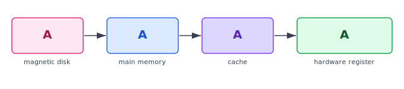

:::note
本系列文章內容參考自經典教材 **Operating System Concepts, 10th Edition (Silberschatz, Galvin, Gagne)**。本文對應章節：**Section 1.5 Resource Management**。
:::

 

作業系統的核心角色之一，是作為整台電腦的**資源管理者 (Resource Manager)**。CPU、記憶體空間、檔案儲存空間、I/O 裝置，這些都是 OS 必須統籌分配的資源。當多個 Process 同時需要使用這些資源時，OS 必須決定誰先用、用多少、用多久，並在它們用完後回收資源再分配給下一個需求者。少了 OS 的統一調度，程式之間就只能靠運氣搶資源，整個系統很快就會陷入混亂。

以下逐一介紹 OS 在各類資源上承擔的責任，以及每項責任背後的設計動機。

 

## **1.5.1 行程管理 (Process Management)**

### **程式 vs 行程：被動 vs 主動**

在深入行程管理之前，必須先釐清一個最基本的概念區別：**程式 (Program)** 和**行程 (Process)** 雖然經常被混用，但它們是完全不同的東西。

程式是一個**被動實體 (Passive Entity)**，就像硬碟上一個靜靜躺著的檔案。檔案本身不會做任何事，它只是儲存了一段指令序列。行程則是程式**正在執行時**的狀態，是一個**主動實體 (Active Entity)**，擁有自己的執行進度、佔用的記憶體空間、開啟的檔案、以及消耗的 CPU 時間。這個區別非常重要：同一個程式可以被啟動好幾次，每次啟動就產生一個獨立的 Process。它們共用同一份程式碼，但彼此的執行狀態完全獨立、互不干擾。

舉一個具體的例子：瀏覽器程式（可執行檔）儲存在磁碟上，這是 Program。當使用者點兩下開啟瀏覽器，OS 把程式載入記憶體、配置資源、開始執行，此時就產生了一個 Process。這個 Process 會拿到一個 URL 作為輸入，執行對應的指令與 System Call，將網頁內容顯示在螢幕上。當瀏覽器關閉後，OS 會**回收**這個 Process 所佔用的全部資源，讓後續的 Process 可以使用。

### **執行緒與 Program Counter**

一個 **單執行緒 Process (Single-threaded Process)** 內部只有一條執行流，由一個 **程式計數器 (Program Counter)** 指向下一條要執行的指令。CPU 按順序逐條取出並執行，執行是嚴格序列的（Sequential）。

一個**多執行緒 Process (Multi-threaded Process)** 則擁有多個執行流，每個 **執行緒 (Thread)** 各自有一個獨立的 Program Counter，指向它自己接下來要執行的指令。這讓一個 Process 可以同時進行多件事，例如瀏覽器同時渲染頁面、下載資源、回應使用者點擊，都是在同一個 Process 的不同 Thread 中並行執行的。

:::info Process 是系統的工作單位
Course 中有一個重要概念值得記住：**Process 是系統的工作單位 (Unit of Work)**。一個運作中的系統裡同時存在大量 Process，有些是屬於 OS 自己的（執行核心程式碼），有些是使用者的應用程式。它們可以在單一 CPU Core 上輪流佔用（Multiplexing，多工切換），也可以在多個 CPU Core 上真正並行執行（Parallel Execution）。OS 必須統籌協調所有這些 Process 的生命週期與資源使用。
:::

### **OS 對 Process 的責任**

Process 從誕生到結束，每一個環節都需要 OS 的介入與管理。OS 對 Process 的核心責任包括：

- **建立與刪除** 使用者及系統 Process：程式啟動時建立 Process 並分配資源，程式結束後刪除 Process 並回收所有資源
- **在 CPU 上排程 (Schedule)** Process 與 Thread：決定哪個 Process/Thread 下一個取得 CPU 使用權
- **暫停與恢復 (Suspend/Resume)** Process：在需要切換執行對象時，暫存目前 Process 的狀態，稍後再從中斷點恢復
- **提供 Process 同步 (Synchronization) 機制**：讓多個 Process 之間能安全地協調共享資源的存取，避免競爭條件
- **提供 Process 通訊 (Communication) 機制**：讓 Process 之間能夠互相傳遞訊息與資料

詳細的 Process 管理技術將在 Ch3–Ch7 討論。

 

## **1.5.2 記憶體管理 (Memory Management)**

### **為什麼 CPU 非記憶體不可**

主記憶體 (Main Memory) 是整個電腦系統運作的核心橋樑。它是一個以 Byte 為單位的大型陣列，每個 Byte 都有自己的位址。這裡有一個根本限制必須先理解：**CPU 只能直接存取主記憶體中的資料**。

這個限制意味著什麼？它意味著任何想要被執行的程式，都必須先被**載入 (Load)** 到主記憶體中。來自磁碟的資料，在 CPU 處理之前也必須先透過 I/O 操作搬進主記憶體。CPU 的指令執行週期（Fetch-Decode-Execute）中，Fetch 階段就是從主記憶體取出指令，這個動作每個 Cycle 都發生，絕對無法省略。

### **從磁碟到執行：一個程式的旅程**

理解記憶體管理的動機，需要先知道一個程式的完整執行週期。程式最初以可執行檔的形式存放在磁碟上，這時它只是一堆靜態的位元組。當使用者或 OS 決定執行它時，OS 需要把程式的指令從磁碟搬進主記憶體，並把它**對應 (Map) 到具體的記憶體位址**（這個過程稱為位址對應，Address Mapping），才能讓 CPU 透過 Program Counter 找到並執行每一條指令。程式執行期間，它會持續在主記憶體中讀取指令、讀寫資料。當程式終止時，OS 將它所佔用的記憶體空間標記為可用，供下一個程式使用。

### **記憶體管理的必要性**

為了提升 CPU 使用率和系統的回應速度，現代作業系統需要在記憶體中**同時保留多個 Process**，而不是讓每個 Process 用完記憶體才能輪到下一個。這個設計帶來了一個新問題：多個 Process 同時駐留記憶體時，如何確保它們不會互相踩到彼此的空間？哪個 Process 可以載入？哪個必須暫時移出？誰決定？

這些問題都由 OS 的記憶體管理子系統負責解答。OS 對記憶體的核心責任包括：

- **追蹤 (Track)** 記憶體中哪些部分正在被使用，以及是哪個 Process 在使用
- 在需要時**分配 (Allocate)** 與**釋放 (Deallocate)** 記憶體空間
- 決定哪些 Process（或 Process 的哪些部分）要**載入 (Load)** 或**移出 (Swap Out)** 記憶體

:::info 記憶體管理方案因硬體而異
教科書特別強調：不同的記憶體管理方案有各自的硬體依賴性。選擇哪種記憶體管理方案，必須考量系統的硬體設計，而且每種演算法都需要對應的硬體支援（例如記憶體保護暫存器、TLB 等）。這就是為什麼 OS 的記憶體管理不能獨立於硬體討論。
:::

記憶體管理技術詳見 Ch9、Ch10。

 

## **1.5.3 檔案系統管理 (File-System Management)**

### **為什麼需要「檔案」這個概念**

電腦系統裡的儲存媒體種類繁多：HDD 用旋轉磁盤和磁頭讀寫，SSD 用 Flash Cell 儲存電荷，光碟用雷射讀取凹凸坑紋，磁帶則循序讀取。每種媒體的存取速度、容量、資料傳輸率、以及存取方式（循序 Sequential vs 隨機 Random）都截然不同。

如果讓程式直接面對這些千奇百怪的物理差異，開發難度將極為巨大。一個程式可能要為 HDD 寫一套讀寫邏輯、為 SSD 寫另一套，換個儲存設備就得重寫。OS 為了解決這個問題，提供了一套**統一的邏輯視角**來看待所有資訊儲存：這就是**檔案 (File)** 的概念。

**檔案 (File)** 是由建立者定義的一組相關資訊集合，可以是文字、程式碼、圖片、音樂、二進位資料，任何形態都可以。OS 的職責是把這個邏輯上的「檔案」概念對應到實際的物理儲存媒體，讓應用程式只需要知道「我要開啟這個檔案」，而不必關心它究竟存放在哪顆磁碟的哪個磁軌的哪個磁區上。

### **目錄的作用與存取控制**

當系統中的檔案數量增長到成千上萬時，如何找到想要的檔案就成了新問題。OS 通常把檔案組織成**目錄 (Directory)** 的樹狀結構，讓使用者可以用有意義的路徑名稱來尋找和管理檔案。

此外，當多個使用者共享同一個系統時，OS 必須提供**存取控制**機制：某個使用者可以讀取但不能修改一個檔案、另一個使用者只能看到部分目錄等。這些機制保護了每個使用者的資料不被他人未經授權存取。

### **OS 對檔案系統的責任**

OS 對檔案系統的核心責任包括：

- **建立與刪除**檔案
- **建立與刪除**目錄
- **支援基本操作 (Primitives)** 對檔案與目錄進行讀、寫、搜尋等操作
- 將檔案**對應 (Map)** 到實體儲存媒體的具體位置
- 將檔案**備份 (Backup)** 至穩定的非揮發性 (Non-volatile) 儲存媒體，以防資料遺失

:::tip 「看不見」的抽象層是 OS 最重要的貢獻之一
使用者在操作 `open("data.txt")` 這個 System Call 時，完全不需要知道 `data.txt` 儲存在 SSD 還是 HDD、在哪個磁區、如何讀取。OS 在背後完成了從邏輯檔名到物理位址的全部對應工作。這種**抽象化 (Abstraction)** 正是 OS 設計中最核心的價值之一，讓應用程式可以在不同硬體上無縫移植。
:::

檔案管理技術詳見 Ch13–Ch15。

 

## **1.5.4 大容量儲存管理 (Mass-Storage Management)**

### **為什麼需要大容量儲存**

主記憶體是揮發性的 (Volatile)，斷電即清空，且容量相對有限。這兩個根本限制決定了大容量儲存設備在現代電腦中的不可或缺性。

**HDD（硬碟機）** 和 **NVM（非揮發性記憶體裝置，如 SSD）** 是現代電腦的主要大容量儲存媒體，承擔了「程式與資料的長期居所」的角色。幾乎所有應用程式，包括編譯器、瀏覽器、文書處理軟體、遊戲，都長期儲存在這些設備上，只有在需要執行時才被載入主記憶體。程式執行時，這些設備也同時作為輸入來源（讀取資料）和輸出目標（寫入結果）。

:::caution 二次儲存的速度直接影響整體系統效能
教科書明確指出：「整台電腦的運作速度，可能完全取決於二次儲存子系統的速度以及管理它的演算法。」這句話的分量很重。磁碟 I/O 的延遲比主記憶體高出幾個數量級（主記憶體存取約 80–250 ns，HDD 約 5,000,000 ns），如果 OS 的磁碟排程演算法設計不好，就算 CPU 再快、記憶體再大，整個系統也會卡在磁碟 I/O 上動彈不得。
:::

### **OS 對大容量儲存的責任**

OS 對二次儲存（Secondary Storage）的核心責任如下：

| 職責                                 | 說明                                                       |
| :----------------------------------- | :--------------------------------------------------------- |
| 掛載與卸載 (Mounting/Unmounting)     | 讓儲存裝置可以被系統存取，或安全地移除                     |
| 可用空間管理 (Free-space Management) | 追蹤哪些空間已使用、哪些空閒，決定新資料放哪裡             |
| 儲存空間分配 (Storage Allocation)    | 決定檔案的各個區塊存放在哪個實體位置                       |
| 磁碟排程 (Disk Scheduling)           | 優化磁碟讀寫請求的執行順序，最小化磁頭移動距離，提升效能   |
| 磁碟分割 (Partitioning)              | 將一個儲存裝置切分成多個邏輯區域，各自可安裝不同的檔案系統 |
| 保護 (Protection)                    | 確保資料不被未授權存取                                     |

### **三次儲存 (Tertiary Storage)**

除了二次儲存之外，系統還有速度更慢、成本更低的**三次儲存 (Tertiary Storage)**，如磁帶和光碟，主要用於備份和長期封存。磁帶容量巨大、成本極低，但存取是循序的，尋找特定資料可能需要捲動很長時間。

三次儲存的管理策略與二次儲存不同，有些 OS 自行接管三次儲存的管理（例如提供掛載/卸載、裝置獨佔分配、從二次儲存遷移資料到三次儲存等功能），有些 OS 則把這個責任留給應用程式自行處理。

詳細討論見 Ch11。

 

## **1.5.5 快取管理 (Cache Management)**

### **快取的基本原理**

快取 (Cache) 的運作邏輯來自一個非常直觀的觀察：**程式在一段時間內往往會反覆存取同一份資料**。如果每次存取都要去速度很慢的儲存層拿，那整體效能就會被這個慢的儲存層拖垮。解決辦法是：把剛剛用過的資料複製一份到更快的儲存層，下次再需要時直接從快的地方取，不用再跑去慢的地方。

快取的運作邏輯如下：

> 資訊通常存放在某個較慢的儲存層（例如主記憶體）。當它被存取時，先把它複製到一個**更快的儲存層（快取）**，作為暫時性的副本。下次需要同一份資訊時，先查快取：如果在，就直接用快取版本（稱為 Cache Hit）；如果不在，再去慢的儲存層取，同時把它放一份到快取（稱為 Cache Miss）。

這個「先找快、再找慢」的策略，在整個記憶體階層中**反覆應用**：暫存器是 Cache 的快取，Cache 是主記憶體的快取，主記憶體是磁碟的快取。系統設計者透過層層疊加快取，在成本有限的前提下盡可能接近「所有資料都在最快的層」的理想狀態。

### **各層儲存特性**

下表整理了各層儲存的完整特性。從左到右，速度從快到慢、容量從小到大、成本從高到低：

| Level | Name             | Typical Size | Implementation Technology     | Access Time (ns) | Bandwidth (MB/sec) | Managed by       | Backed by    |
| :---: | :--------------- | :----------- | :---------------------------- | :--------------- | :----------------- | :--------------- | :----------- |
|   1   | Registers        | < 1 KB       | Custom CMOS, multiple ports   | 0.25–0.5         | 20,000–100,000     | Compiler         | Cache        |
|   2   | Cache            | < 16 MB      | On-chip or off-chip CMOS SRAM | 0.5–25           | 5,000–10,000       | Hardware         | Main Memory  |
|   3   | Main Memory      | < 64 GB      | CMOS SRAM                     | 80–250           | 1,000–5,000        | Operating System | Disk         |
|   4   | Solid-state Disk | < 1 TB       | Flash memory                  | 25,000–50,000    | 500                | Operating System | Disk         |
|   5   | Magnetic Disk    | < 10 TB      | Magnetic disk                 | 5,000,000        | 20–150             | Operating System | Disk or Tape |

這張表格揭示了一個重要的設計事實：**不同層的儲存由不同的管理者負責**。

:::info 誰管理誰？
- **暫存器 (Register)**：由**編譯器 (Compiler)** 管理。編譯器在產生機器碼時，就決定哪些變數放在 Register、哪些放在主記憶體。這個決策是靜態的，在程式執行前就已確定。
- **Cache（L1/L2/L3）**：由**硬體**自動管理，OS 完全不介入。CPU 內建的快取控制器（Cache Controller）自動判斷哪些資料要放進快取、哪些要替換出去，這對 OS 是透明的（透明 = OS 感知不到、也不需要感知）。
- **主記憶體及以下**：由 **OS** 負責。從主記憶體到磁碟的資料搬移，都由 OS 的記憶體管理和 I/O 子系統控制。

換句話說，OS 只直接管理「硬體之上、CPU 之下」的那幾層。Register 和 Cache 的快取行為，OS 既看不到、也管不到。
:::

### **資料遷移路徑**

理解快取的最好方式是追蹤一份具體資料的移動軌跡。假設程式想對一個整數 A（儲存在磁碟上的檔案 B 中）執行加 1 的運算，整個流程需要跨越多層儲存搬移：

1. **I/O 操作**：OS 發出 I/O 請求，把磁碟上包含 A 的那個 Block 複製進**主記憶體**
2. **快取填入**：硬體快取控制器把 A 從主記憶體複製進 **CPU Cache**
3. **暫存器載入**：CPU 把 A 從 Cache 複製進**暫存器（Register）**
4. **運算執行**：CPU 在暫存器中完成加 1 的運算，產生新值

這張圖最核心的洞察是：執行完步驟 4 之後，整數 A **同時存在於四個地方**：磁碟、主記憶體、Cache、暫存器，但每個地方的值都不同，只有暫存器裡才是最新的（已加 1 的值）。其餘三層的值都還是舊的，直到新值從暫存器一路**寫回 (Write Back)** 磁碟後，各層的值才達到一致。

### **快取大小與替換策略**

快取容量有限，不可能把所有資料都放進去。當快取已滿、又需要放入新資料時，就必須決定**替換哪一筆既有資料**。這個決策稱為**替換策略 (Replacement Policy)**，其好壞直接影響 Cache Hit Rate，進而影響整個系統的效能。

選錯替換策略，就可能一直把「馬上還會用到的資料」換出去、把「很久不會再碰的資料」留在快取裡，造成大量 Cache Miss，效能大幅下降。替換演算法的詳細討論詳見 Ch10。

### **快取一致性 (Cache Coherency)**

快取引入了一個新的複雜性問題：同一份資料可能在不同地方有多個副本，如何確保每個副本在需要時都是最新的？

這個問題在不同的執行環境中有不同程度的難度：

- **單執行 (Single-process) 環境**：同一時間只有一個 Process 在存取資料，同一份資料在每一層中最多只有一個活躍副本，不存在一致性衝突。
- **多工 (Multitasking) 環境**：CPU 在多個 Process 之間快速切換。切換時，OS 必須確保每個 Process 存取整數 A 時，讀到的都是其他 Process 最後一次寫入的最新值，而非過時的舊副本。
- **多處理器 (Multiprocessor) 環境**：每顆 CPU 有自己的本地快取，整數 A 可能同時存在於多顆 CPU 的 Cache 中。若 CPU 0 更新了自己 Cache 中的 A，CPU 1 的 Cache 裡還是舊值，此時 CPU 1 讀到的就是錯誤的結果。這就是**快取一致性 (Cache Coherency)** 問題，通常由硬體的快取一致性協定（如 MESI 協定）處理，OS 不直接介入。
- **分散式 (Distributed) 環境**：同一個檔案可能在不同電腦上各有一份副本，且可能被多個節點同時讀寫。同步的複雜度遠高於單機環境，詳見 Ch19。

:::caution 多層儲存的一致性風險
快取的引入本質上是一種效能最佳化，但代價是：**同一份資料在不同儲存層可能有不同的值**。設計系統時必須確保「哪一層持有最新值」有明確的定義，並在更新後按正確順序寫回各層。如果這個一致性保證被破壞，程式讀到的資料就可能是錯的，導致邏輯錯誤甚至資料毀損。
:::

 

## **1.5.6 I/O 系統管理 (I/O System Management)**

### **隱藏裝置差異的必要性**

現代電腦連接的 I/O 裝置種類繁多，鍵盤、滑鼠、硬碟、SSD、網卡、顯示卡、印表機，每一種都有截然不同的溝通協定、資料格式、傳輸速率和控制邏輯。如果 OS 的每個部分都必須直接面對這些差異，程式碼將極為複雜且難以維護，新裝置的加入也會需要大量改動 OS 核心。

OS 的一個重要設計目標，是對使用者和 OS 自身的大部分程式碼**隱藏 (Hide)** 這些裝置差異。以 UNIX 為例，各裝置的特殊性被集中封裝在 **I/O 子系統 (I/O Subsystem)** 中，核心程式碼的其他部分完全不需要知道底層裝置是什麼。

### **I/O 子系統的組成**

I/O 子系統由三個層次組成，它們共同實現了從「統一的上層介面」到「多元的底層硬體」的映射：

- **記憶體管理元件**：包含**緩衝 (Buffering)**（暫存傳輸中的資料，調節速度差異）、**快取 (Caching)**（保留常用資料的副本）、和**排程緩衝 (Spooling)**（讓多個 Process 可以排隊使用獨占性裝置，例如印表機）
- **通用裝置驅動介面 (General Device-driver Interface)**：OS 的其餘部分只需透過這個統一介面和任何裝置溝通，完全不必知道底下是哪種裝置
- **各裝置專屬的驅動程式 (Device Driver)**：每個驅動程式只了解它負責的那一種裝置的具體細節，是整個架構中唯一「懂得」特定硬體的部分

:::tip 驅動程式的隔離設計
這個三層架構體現了一個重要的軟體工程原則：**隔離變化源 (Isolate the Source of Change)**。裝置的種類和規格會不斷改變，但只要新裝置提供一個符合通用介面規範的 Device Driver，OS 其他部分就完全不需要修改即可支援這個新裝置。這就是為什麼你插上一個新的 USB 裝置，系統能夠辨識並驅動它，而不需要重寫 OS 核心的原因。這種開放式的可擴展架構，是現代 OS 能夠支援數以千計的不同裝置的根本原因。
:::

I/O 子系統如何與系統其他元件互動、如何管理裝置、如何傳輸資料，以及如何偵測 I/O 完成，詳見 Ch12。
