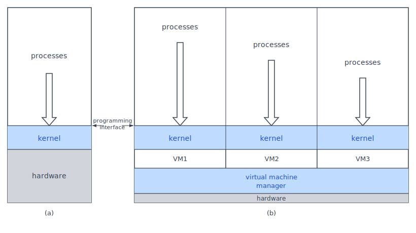

:::note
本系列文章內容參考自經典教材 **Operating System Concepts, 10th Edition (Silberschatz, Galvin, Gagne)**。本文對應章節：**Section 1.6 Security and Protection、1.7 Virtualization、1.8 Distributed Systems**。
:::

 

## **1.6 保護與安全 (Security and Protection)**

### **為什麼需要保護？**

當一台電腦有多個使用者並且同時執行多個 Process 時，就會產生一個核心問題：**誰可以存取什麼？** 如果沒有任何管制，任何 Process 都能隨意讀寫其他 Process 的記憶體、搶奪 CPU 時間，甚至直接操控硬體裝置。在這樣的環境下，系統根本無法穩定運作，更不用說確保資料的安全。

因此，OS 必須提供機制，確保**檔案、記憶體片段、CPU 與其他資源，只能被取得適當授權的 Process 操作**。這個管制機制就是「保護（Protection）」的核心任務。

### **保護 vs 安全：兩個不同的問題**

這兩個詞在日常生活中常被混用，但在 OS 中有精確的區別：

**保護 (Protection)** 是一種**機制**，用來控制哪些 Process 或使用者可以存取哪些系統資源。它回答的問題是：**「誰被允許做什麼？」**

保護的例子：
- 記憶體位址硬體確保 Process 只能在自己的位址空間內執行
- Timer 確保沒有 Process 能永遠霸占 CPU
- 裝置控制暫存器(device-control registers)不可被使用者直接存取

:::info 保護的額外價值：提升系統可靠性
保護不只是防止惡意行為。它還能**提升系統可靠性**，原理如下：系統通常由多個子系統（Subsystem）組成，子系統之間透過介面（Interface）互動。若這些介面有保護機制，當某個子系統出現潛藏錯誤（Latent Error）時，錯誤就會在介面處被攔截，**不會蔓延污染其他健康的子系統**。

相對地，若資源沒有保護，任何一個出問題的程式都可能直接寫壞共享記憶體，拖垮整個系統。保護讓錯誤的影響範圍縮小，也讓系統更容易偵錯。
:::

**安全 (Security)** 則是**防禦外部與內部攻擊**的工作。它回答的問題是：**「有沒有人在繞過規則攻擊系統？」**

安全威脅的範圍非常廣：
- 病毒與蠕蟲 (Virus and Worms)
- 阻斷服務攻擊 (Denial-of-Service, DoS)：耗盡系統資源讓合法使用者無法使用
- 身份竊取 (Identity Theft)
- 未授權使用系統資源 (Theft of Service)

值得注意的是，部分安全防護功能由 OS 本身承擔，另一部分則依賴政策（Policy）或附加軟體處理。隨著安全事件的快速增加，OS 安全功能已成為近年來研究與實作最活躍的領域之一。

:::caution 保護完善不等於安全無虞
想像這樣一個情境：使用者的**身份驗證資訊（帳號密碼）被竊取**。攻擊者以被竊取的身份登入系統，此時記憶體保護和檔案保護都正常運作，系統完全依規則行事，卻仍允許攻擊者讀取或刪除該使用者的資料。

這說明了一件事：保護管的是「規則本身是否執行」，安全管的是「有沒有人用非正常手段繞過這些規則」。一個系統可以有完善的保護機制，卻仍然容易受攻擊。**兩者都需要，缺一不可。**
:::

### **使用者識別：User ID 與 Group ID**

保護和安全機制的前提，是系統必須能夠區分所有使用者。大多數 OS 維護一份**使用者名稱對應數字 ID 的清單**：

- **使用者 ID (User ID, UID)**：每個使用者唯一的數字識別碼（Windows 中稱為 Security ID, SID）。使用者登入時，認證（Authentication）階段確定其 UID，之後所有由該使用者啟動的 Process 和 Thread 都帶有這個 UID。當 ID 需要顯示給使用者看時，OS 再將數字反查回使用者名稱。
- **群組 ID (Group ID, GID)**：有時需要對一組使用者授予相同的存取權限，而不是逐一設定。OS 維護一份群組名稱對應 GID 的清單，並將 GID 一併加入每個關聯的 Process 和 Thread。一個使用者可以同時屬於多個群組，取決於 OS 的設計。

以 UNIX 檔案存取為例：一個檔案的擁有者可以擁有讀寫權限，而特定群組的其他成員可能只有讀取權限。這種細粒度的控制，正是透過 UID 和 GID 的組合來實現。

### **特權提升 (Privilege Escalation)**

正常使用時，UID 和 GID 已足夠。但有些工作需要暫時提升權限才能完成，例如存取受限的硬體裝置，或執行需要更高權限的系統管理任務。OS 提供多種提升機制，讓使用者在有限度的情況下取得額外的權限，同時又不需要給予完全的管理員（Root）存取權。

以 UNIX 的 `setuid` 為例：若程式設定了 `setuid` 屬性，執行該程式時，Process 的**有效 UID（Effective UID）** 會變成**程式檔案擁有者**的 UID，而非執行者的 UID。這讓普通使用者可以執行特定需要高權限的程式，執行完畢或放棄特權後，Process 回到原本的 UID。這個機制的重要性在於：**權限提升是受控且暫時的**，系統不需要把完整的 root 權限交給使用者。

 

## **1.7 虛擬化 (Virtualization)**

### **什麼是虛擬化？**

現代作業系統已經能可靠地在單一電腦上同時執行多個應用程式。但如果想要在**同一台實體機器上同時執行多個不同的作業系統**，該怎麼辦？

**虛擬化 (Virtualization)** 就是為了解決這個問題而生的技術。它把**單一電腦的硬體**（CPU、記憶體、磁碟、網路卡等）抽象化（Abstract）成**多個獨立的執行環境**，讓每個環境都像是在自己專屬的電腦上執行一樣。

每個這樣的環境稱為一個**虛擬機器 (Virtual Machine, VM)**，可以獨立運行不同的 OS（例如同時跑 Windows 和 Linux），就像多個 Process 在單一 OS 上並發執行一樣。使用者可以在這些 VM 之間切換，就像在單一 OS 內切換不同 Process 一樣自然。

### **虛擬化的起源**

虛擬化並不是新技術。它最初誕生於 **IBM 大型主機（Mainframe）**，是為了讓多位使用者能夠同時使用一台設計給單一使用者的系統。執行多個虛擬機器，讓多位使用者得以在同一台大型主機上並行執行工作。

後來，VMware 公司面對在 Intel x86 CPU 上執行多個 Microsoft Windows 應用程式的問題，開發出一種新型態的虛擬化技術，以**應用程式的形式**運行在 Windows 之上。這個應用程式可以同時執行一個或多個 Windows 或其他 x86 原生作業系統的 Guest 副本，每個 Guest 都執行自己的應用程式，彼此完全隔離。

### **虛擬化 vs 模擬：最關鍵的區別**

**虛擬化**和另一個相似概念**模擬（Emulation）** 容易被混淆，但兩者有根本的差異：

**模擬 (Emulation)**：
- 當**來源 CPU 架構**和**目標 CPU 架構不同**時使用
- 用軟體**翻譯**來源指令集的每一條指令，對應成目標架構的等效操作
- 代價：**速度極慢**，因為每一條原生指令都需要被翻譯成多條目標指令
- 例子：Apple 從 IBM PowerPC 轉換到 Intel x86 時，使用名為 "Rosetta" 的模擬設施，讓為 IBM CPU 編譯的舊程式能在 Intel CPU 上執行

**虛擬化 (Virtualization)**：
- 來源 CPU 和目標 CPU 是**同一架構**（例如都是 x86）
- Guest OS 的程式碼可以**直接在 CPU 上原生（Natively）執行**，無需逐條翻譯
- 代價：遠比模擬小，速度接近原生執行
- 例子：在 Windows 主機上用 VMware 跑另一個 Windows 或 Linux

:::info 為何虛擬化能高速運行？
因為 Guest OS 和 Host OS 共用同一 CPU 架構，Guest OS 發出的一般機器指令對 CPU 來說完全合法，CPU 根本不需要「翻譯」，直接原生執行。VMM 的工作是**攔截特權指令**和**管理資源分配**，而非翻譯每一條指令。這就是虛擬化遠比模擬快速的根本原因。
:::

### **虛擬機器管理器 (Virtual Machine Manager, VMM)**

VMM（也稱 Hypervisor）是虛擬化的核心元件。下圖比較了傳統的單一 OS 架構與虛擬化架構的層次結構：

圖中兩種架構的對照說明：

- **(a) 傳統架構**：Hardware 之上只有一個 Kernel，Kernel 之上是所有 Process。整台機器只有一個 OS 管理所有硬體資源。圖中的「programming interface」標示的是 Kernel 與 Processes 之間的邊界，也就是 System Call 介面，這是 Process 與 OS 溝通的管道。
- **(b) 虛擬化架構**：Hardware 之上首先是 VMM。VMM 之上是多個 VM（VM1、VM2、VM3），每個 VM 各自擁有自己的 Kernel，Kernel 之上再執行各自的 Processes。各 VM 彼此完全隔離，互不干擾。

VMM 的三個核心職責：
1. **執行 Guest OS**：讓每個 Guest OS 以為自己在管理真實的硬體，Guest OS 本身不需要知道自己運行在虛擬環境中
2. **管理資源使用**：協調多個 VM 之間對 CPU、記憶體、I/O 裝置的競爭
3. **隔離保護**：確保各 VM 之間不能互相干擾，一個 VM 的崩潰不會影響其他 VM

### **為何虛擬化如此重要？**

即使現代 OS 已能可靠地同時執行多個應用程式，虛擬化的應用仍持續成長，因為它在三個場景中提供了單一 OS 所無法滿足的能力：

| 場景           | 說明                                                                                                                                                         |
| :------------- | :----------------------------------------------------------------------------------------------------------------------------------------------------------- |
| **個人使用**   | 在 macOS 筆電上安裝 VMM，再跑 Windows 10 Guest，就能執行只支援 Windows 的應用程式，不需要另外準備一台 Windows 機器                                           |
| **開發與測試** | 軟體公司需要在多種 OS 上測試產品，透過虛擬化可以在**單一實體主機**上跑所有目標 OS，大幅降低硬體成本與管理複雜度                                              |
| **資料中心**   | VMM（如 VMware ESX、Citrix XenServer）已不再跑在 Host OS 之上，而是**直接作為底層系統**，提供服務與資源管理給上層的 VM Processes，大幅提升伺服器硬體的利用率 |

資料中心場景尤其值得關注：早期的 VMM 是跑在 Windows 等 Host OS 之上的一個應用程式，Host OS 本身也消耗資源。現代資料中心的 VMM 則是直接管理裸機硬體，省去了 Host OS 的開銷，能讓更多資源分配給各 VM。

 

## **1.8 分散式系統 (Distributed Systems)**

### **什麼是分散式系統？**

前面討論的多處理器系統，是在**同一台機器**上整合多個 CPU 以提升效能。分散式系統則走向另一個方向：把**多台完全獨立的電腦**透過網路連接起來，讓它們協同為使用者提供服務。

**分散式系統 (Distributed System)** 是由多台**實體獨立、可能異質 (Heterogeneous)** 的電腦所組成的集合，透過網路連接，共同向使用者提供各種資源存取能力。這裡「異質」的意思是：各台機器不必使用相同的 CPU 架構、OS 或硬體規格，只要能透過網路互相溝通即可。

分享資源帶來四個主要的好處：
- **計算速度 (Computation Speed)**：任務可以拆分到多台機器並行運算，速度遠超單機
- **功能性 (Functionality)**：各機器可以提供不同的專門服務，整個系統的能力是各機器的總和
- **資料可用性 (Data Availability)**：資料可以在多台機器保有副本，一台機器故障也不影響存取
- **可靠性 (Reliability)**：部分節點失效，系統整體仍可繼續運作

值得注意的是，OS 對網路功能的整合方式因設計而異。有些 OS 把網路存取**一般化為檔案存取的形式**，讓網路裝置的細節隱藏在 Device Driver 內，程式不需要特別處理網路細節；其他 OS 則要求使用者明確呼叫網路函式。現實中的系統通常是兩種模式的混合，例如 FTP 是明確的網路操作，而 NFS 則讓遠端檔案看起來像本地檔案。

### **網路基礎：連接分散式系統的基礎設施**

分散式系統的運作基礎是**網路 (Network)**，網路的本質是兩台或更多系統之間的通訊路徑。網路的特性依三個維度而異：所使用的協定（Protocol）、節點之間的距離，以及傳輸媒介（Transport Media）。

**傳輸媒介**決定了資料在物理層如何傳遞，常見的形式包括：
- **銅線（Copper Wire）**：傳統有線乙太網路
- **光纖（Fiber Strand）**：高速、長距離的骨幹網路
- **無線傳輸（Wireless Transmission）**：包含衛星、微波天線和無線電，覆蓋從室內 Wi-Fi 到跨洲的廣域連接

**網路協定**方面，**TCP/IP** 是目前最普及的網路協定，是整個網際網路的基礎架構，幾乎所有通用 OS 都支援。部分系統也使用專有協定以滿足特定需求。OS 對網路協定的需求只有一個：該協定需要有對應的 Interface Device（例如網路卡）及其 Device Driver，以及處理資料的軟體層。

網路依**節點之間的距離**分類：

| 網路類型 | 全名                      | 範圍                 | 說明                                   |
| :------: | :------------------------ | :------------------- | :------------------------------------- |
| **LAN**  | Local-Area Network        | 同一房間、建築、校園 | 有線乙太網路或 Wi-Fi                   |
| **WAN**  | Wide-Area Network         | 城市、國家之間       | 企業跨地域連接                         |
| **MAN**  | Metropolitan-Area Network | 城市內各建築         | 介於 LAN 與 WAN 之間                   |
| **PAN**  | Personal-Area Network     | 數公尺範圍           | Bluetooth、802.11 裝置間的短距無線通訊 |

每種網路類型都可能執行一種或多種協定，而新技術的不斷出現也持續帶來新的網路形態。

### **網路作業系統 vs 分散式作業系統**

並非所有使用網路的 OS 都是「分散式系統」。OS 對分散式概念的整合深度，形成了兩種截然不同的設計：

**網路作業系統 (Network OS)**：
- 各電腦仍然**獨立自主運作**，只是彼此「知道」有網路存在，能夠通訊
- 提供跨網路的檔案共享（File Sharing）和 Process 間通訊
- 使用者必須**明確知道要存取哪台機器**，例如 FTP 需要指定伺服器位址，NFS 雖然掛載遠端目錄，但使用者清楚那是另一台機器上的資源

**分散式作業系統 (Distributed OS)**：
- 各電腦**緊密協作**，OS 對使用者呈現出「好像只有一個 OS 在控制整個網路」的幻覺
- 使用者不需要知道資料實際存放在哪台機器，也不需要知道計算是在哪台機器上執行
- 底層的網路細節和多機器架構對使用者完全透明

:::tip 「透明性（Transparency）」是分散式 OS 的核心設計目標
Network OS 還需要使用者明確指定要連到哪台機器、用哪個協定。Distributed OS 的目標則是把這些複雜性全部隱藏起來，讓使用者只看到一個統一的系統介面，感受不到底層的網路和多台機器的存在。

這個設計目標稱為「透明性（Transparency）」：系統的分散式本質對使用者是透明的、不可見的。這比 Network OS 的整合程度更深，實作難度也更高。
:::

電腦網路與分散式系統的詳細討論見 Ch19。
