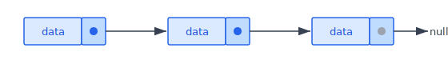
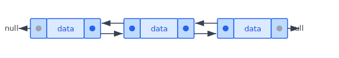
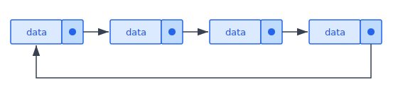
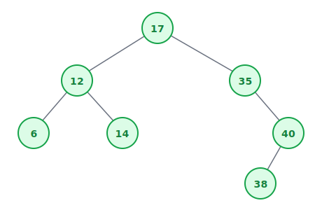
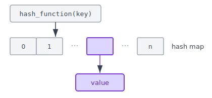

:::note
本系列文章內容參考自經典教材 **Operating System Concepts, 10th Edition (Silberschatz, Galvin, Gagne)**。本文對應章節：**Section 1.9 Kernel Data Structures**。
:::

<br/>

OS kernel 在實作各種演算法時，需要一套可靠的基礎**資料結構 (Data Structures)**。這些結構並非 OS 獨有的發明，而是電腦科學中通用的基石：串列、樹、雜湊表、位元映射。了解它們在 OS 中的使用方式，有助於理解 kernel 演算法的設計思維。更重要的是，這些資料結構會在後續章節（排程、記憶體管理、檔案系統等）中反覆出現，在進入具體的 OS 機制前先建立直觀理解，將大幅降低後續學習的認知負擔。

<br/>

## **1.9.1 串列、堆疊與佇列 (Lists, Stacks, and Queues)**

### **陣列的限制：為什麼需要串列？**

**陣列 (Array)** 是最簡單的資料結構：每個元素可以直接透過索引存取，存取時間 O(1)。主記憶體本身就是一個大型陣列，每個 byte 都有對應的位址作為索引。若每個資料項目大小超過一個 byte，系統可以分配多個連續 byte 給它，並以「項目編號 × 項目大小 (item number × item size)」計算出位址，直接定位，這就是陣列快速存取的根本原因。

然而，陣列有兩個根本性的侷限：

- **大小必須固定且均一**：陣列要求所有元素大小相同，且在記憶體中**連續排列**。如果要儲存大小可變的項目（例如，不同長度的字串或不同大小的 Process 控制塊），陣列便難以勝任。
- **插入與刪除代價高昂**：如果要在中間插入或刪除一個元素，為了保持其餘元素的相對順序，必須移動其後所有元素，時間複雜度為 O(n)。當 n 很大時，這個開銷完全無法接受。

當儲存的項目**大小可變**，或需要頻繁插入、刪除時，陣列便不再適用，這時就輪到**串列 (List)** 上場。

### **三種串列**

**串列 (List)** 代表一個序列，其核心概念是：每個元素不需要連續排放在記憶體中，而是透過**指標 (Pointer)** 彼此串接。最常見的實作是**鏈結串列 (Linked List)**，每個節點（Node）除了存放資料本身，還存放一個（或多個）指向其他節點的指標。這種設計讓每個節點可以獨立配置在記憶體中的任意位置，完全不需要連續，也因此可以輕鬆容納大小不一的項目。

**單向串列 (Singly Linked List)**：最基本的形式。每個節點只持有一個指標，指向序列中的下一個節點（Successor）。最後一個節點的指標為 `null`，代表串列的結尾。



單向串列可以從頭節點出發，沿著 `next` 指標逐步往後走訪所有節點，但無法反向回頭：若走過了目標節點，就必須重新從頭開始。

**雙向串列 (Doubly Linked List)**：每個節點同時保存**前一個節點 (Predecessor)** 和**後一個節點 (Successor)** 的指標，因此可以在串列中**雙向走訪**。這個設計讓刪除中間節點變得更方便：找到目標節點後，直接更新前後兩個指標就能完成刪除，不需要額外的「記住前一個節點」邏輯。



**環形串列 (Circularly Linked List)**：最後一個節點的 `next` 指標不指向 `null`，而是指回**第一個節點**，形成一個封閉的環。當需要循環走訪所有節點（例如輪流排班的 Process）時，環形串列是自然的選擇。



串列（包含上述三種變體）的核心優勢，在於能容納**大小不一的項目**，且插入和刪除操作只需調整幾個指標，時間複雜度為 **O(1)**（前提是已知要操作的節點位置）。代價是：若要取得串列中第 n 個元素，沒有辦法直接跳到那個位置，必須從頭節點出發逐一走訪，時間複雜度為 **O(n)**。

串列有時被 kernel 演算法直接使用，但更常見的用途是作為底層結構，用來構建更高階的資料結構，例如堆疊與佇列。

### **堆疊 (Stack)：LIFO**

**堆疊 (Stack)** 是一種有序的資料結構，遵循**後進先出 (LIFO, Last In First Out)** 原則：最後放入的項目最先被取出。操作只有兩種：

- **Push**：將項目壓入堆疊頂端
- **Pop**：從堆疊頂端取出項目

OS 中，堆疊最重要的用途是管理**函式呼叫 (Function Call)**。每當程式呼叫一個函式，CPU 就把當次呼叫的區域變數 (Local Variables)、參數 (Parameters)、以及**返回位址 (Return Address)** 全部 push 到一個稱為**呼叫堆疊 (Call Stack)** 的結構中；函式執行完畢返回時，再將這些資訊 pop 出去，CPU 依據返回位址繼續執行呼叫者的程式碼。

> **為什麼函式呼叫恰好需要 LIFO？**
>
> 以函式 A 呼叫 B、B 再呼叫 C 為例：
>
> 1. A 被呼叫，A 的 stack frame 被 push 到堆疊
> 2. A 呼叫 B，B 的 stack frame 被 push 到堆疊頂端
> 3. B 呼叫 C，C 的 stack frame 被 push 到堆疊頂端
> 4. C 執行完畢，C 的 stack frame 被 pop；CPU 回到 B 繼續執行
> 5. B 執行完畢，B 的 stack frame 被 pop；CPU 回到 A 繼續執行
> 6. A 執行完畢，A 的 stack frame 被 pop
>
> 返回的順序（C → B → A）正好是呼叫順序（A → B → C）的**逆序**，這天然地符合 LIFO 結構。如果改用其他資料結構，就需要額外的機制來維護這個「最深的那個函式最先回傳」的規則，反而更複雜。

### **佇列 (Queue)：FIFO**

**佇列 (Queue)** 同樣是有序的資料結構，但遵循**先進先出 (FIFO, First In First Out)** 原則：先放入的項目先被取出。這與日常生活中的排隊概念完全一致，超市結帳時，最先排隊的顧客最先結帳；路口等紅燈的車輛，最先到的最先通過。

OS 中佇列的典型用途：

- 送往印表機的工作 (Job) 按照提交順序逐一列印，先提交的先印
- 等待在 CPU 上執行的 Process 被組織成佇列（詳見 Ch5），按照特定排程策略依序取出執行

佇列保證了**公平性**：沒有任何一個等待中的工作會被後來者插隊（除非系統明確設計了優先順序機制）。

:::info 串列 vs 堆疊 vs 佇列
這三種資料結構的底層實作都可以用鏈結串列完成，差異只在於**存取規則**的限制：

- **串列（一般串列）**：沒有特別的限制，原則上可存取任意位置（雖然代價是 O(n) 走訪）
- **堆疊**：只能存取最後放入的那一端（頂端），強制 LIFO 順序
- **佇列**：從一端（尾端）放入、從另一端（頭端）取出，強制 FIFO 順序

<br/>

換句話說，堆疊和佇列都是「有限制版的串列」：它們在串列的基礎上加上存取規則，確保資料只能以特定順序被取用。Kernel 演算法有時直接使用一般串列（當需要任意位置插入刪除時），有時透過串列構建堆疊或佇列（當需要特定順序保證時）。
:::

<br/>

## **1.9.2 樹 (Trees)**

### **為什麼需要樹？**

串列雖然解決了陣列插入與刪除代價高的問題，但它有一個無法迴避的弱點：**搜尋效率低**。要在 n 個元素的串列中找一個特定值，必須從頭逐一比較，最壞情況需要 O(n) 次比較。如果資料量很大（例如 kernel 需要在數千個 Process 中找出優先順序最高的那個），線性搜尋的速度令人無法接受。

**樹 (Tree)** 是一種階層式資料結構，透過**父子關係 (Parent-Child Relationship)** 連接節點，目的是在保持插入、刪除彈性的同時，大幅提升搜尋效率。

- **一般樹 (General Tree)**：父節點可以有任意多個子節點，適合表達文件系統目錄、XML/HTML 文件等天然具有層次的資料
- **二元樹 (Binary Tree)**：父節點最多只有兩個子節點，稱為左子節點 (Left Child) 和右子節點 (Right Child)
- **二元搜尋樹 (Binary Search Tree, BST)**：在二元樹的基礎上，強制要求 `左子 ≤ 父節點 ≤ 右子`，藉此讓搜尋效率大幅提升

### **BST 的搜尋原理**

BST 的排列規則使得每次搜尋都能「二分」剩餘的搜尋範圍。以下圖為例，搜尋值 `14`：



搜尋過程如下：

1. 從根節點 `17` 開始：`14 < 17`，目標在左子樹，往左走
2. 到達節點 `12`：`14 > 12`，目標在右子樹，往右走
3. 到達節點 `14`：`14 == 14`，找到目標，搜尋結束

只走了 3 步，就在 7 個節點的樹中找到了答案。理想情況下，每走一步就排除了大約一半的節點，因此 BST 的搜尋時間複雜度為 **O(log n)**。

:::caution BST 的最壞情況：退化為串列

然而，BST 有一個嚴重隱患：當資料以**已排序的順序**插入時，樹會退化成一條鏈。例如，依序插入 `1, 2, 3, 4, 5`：

- 插入 `1`：成為根節點
- 插入 `2`：`2 > 1`，成為 `1` 的右子
- 插入 `3`：`3 > 1 > 2`，成為 `2` 的右子
- 插入 `4`：成為 `3` 的右子
- 插入 `5`：成為 `4` 的右子

結果是一棵只向右延伸的「樹」，實際上等同於一個串列。搜尋這棵退化樹最壞需要 O(n) 步，BST 的效率優勢蕩然無存。

解決方法是使用**平衡二元搜尋樹 (Balanced BST)**：透過額外的旋轉 (Rotation) 規則，在每次插入或刪除後自動調整樹的形狀，確保含有 n 個節點的樹高度始終不超過 log n，從而**保證 O(log n) 的最壞情況效能**。
:::

Linux kernel 在 CPU 排程演算法（Section 5.7.1）中使用一種平衡 BST，稱為**紅黑樹 (Red-Black Tree)**，用於管理可執行 Process 的優先順序。其實作位於 kernel 原始碼的 `<linux/rbtree.h>`。

<br/>

## **1.9.3 雜湊函式與雜湊映射 (Hash Functions and Maps)**

### **雜湊函式 (Hash Function)**

串列搜尋需要 O(n)、BST 搜尋需要 O(log n)，這對大多數場景已相當夠用。但在某些對效能極度敏感的場合，例如 kernel 每秒需要查詢數百萬次的資料表，即使是 O(log n) 也可能成為瓶頸。能否做到 **O(1)**，也就是無論資料量多大，查詢時間幾乎不變？

**雜湊函式 (Hash Function)** 正是為此而設計。它接收任意資料作為輸入，對其執行一個數值運算，產生一個整數作為輸出。這個整數可以被直接用作陣列的索引，讓我們在 **O(1)** 的時間內定位到目標資料，完全跳過逐一比較的過程。

以「查詢使用者帳號」為例，如果系統有一百萬個帳號：

- **串列查詢**：最壞需要比較 1,000,000 次
- **平衡 BST 查詢**：最壞需要比較 log₂(1,000,000) ≈ 20 次
- **雜湊函式查詢**：計算一次雜湊值後直接存取陣列，約 1 次

這就是為什麼雜湊函式在 OS 中被廣泛使用的根本原因。

### **雜湊映射 (Hash Map)**

**雜湊映射 (Hash Map)** 是雜湊函式的一個重要應用：它將 **[鍵 : 值]（key : value）** 配對儲存起來，讓我們能夠以鍵查值。

下圖呈現了雜湊映射的基本結構：雜湊函式接收一個鍵（Key），計算出一個整數索引，再以該索引直接從雜湊映射的陣列中取出對應的值（Value）。



圖中，`hash_function(key)` 將鍵對映至陣列位置 0 到 n 之間的某個索引，對應位置儲存的就是該鍵的值。整個查詢流程只需一次函式計算與一次陣列存取，時間複雜度為 O(1)。

**密碼驗證 (Password Authentication)** 是一個具體的使用範例，以使用者名稱 (Username) 作為鍵、密碼 (Password) 作為值。當使用者登入時，流程如下：

1. 使用者輸入 Username 與 Password
2. 對 Username 套用雜湊函式，得到一個陣列索引
3. 從雜湊映射中取出對應索引的密碼
4. 將取出的密碼與使用者輸入的密碼比對
5. 若相符，驗證成功；否則拒絕登入

整個查詢過程是 O(1)，無論系統中有多少使用者，驗證時間幾乎不變。

### **雜湊碰撞 (Hash Collision)**

雜湊函式有一個潛在問題：兩個不同的輸入可能產生相同的輸出值，也就是兩個不同的鍵被對映到同一個陣列位置，這稱為**雜湊碰撞 (Hash Collision)**。

碰撞不可完全避免（因為鍵的數量可能遠大於陣列的大小），標準的解決方式是：在雜湊表的每個陣列位置，不直接儲存單一值，而是儲存一個**鏈結串列**，把所有雜湊到相同位置的項目串在一起。查詢時，先找到對應的陣列位置，再逐一走訪串列，比對鍵值，找出正確的項目。

這個設計意味著：碰撞愈多，串列愈長，查詢需要走訪的節點也愈多，效率愈低。因此，優秀的雜湊函式設計目標是盡量讓所有鍵均勻分散在整個陣列上，將碰撞發生的機率降到最低，以維持接近 O(1) 的查詢效率。

<br/>

## **1.9.4 位元映射 (Bitmaps)**

### **什麼是位元映射？**

管理大量資源的可用狀態，是 OS 中一個非常常見的需求：哪些記憶體頁面是空閒的？哪些磁碟區塊已被佔用？哪些 CPU 核心正在使用中？對於每一個資源，只需要記錄一個二元狀態：可用或不可用。

**位元映射 (Bitmap)** 是專門為此設計的資料結構。它是一串 n 個二進位數字，用來表示 n 個資源的狀態，每個 bit 對應一個資源：

- `0` = 資源可用（Available）
- `1` = 資源已被佔用（Unavailable）（或反之，視設計而定）

以這個 bitmap 為例：

```
001011101
```

這串 9 個 bit 代表 9 個資源（編號 0 到 8）的狀態：

- **不可用**（bit = 1）：資源 2、4、5、6、8
- **可用**（bit = 0）：資源 0、1、3、7

要查詢第 i 個資源是否可用，只需讀取第 i 個 bit 的值，這是一個 O(1) 的操作。

### **為什麼用 bit，不用 boolean？**

Bitmap 的設計哲學在於極致的**空間效率 (Space Efficiency)**。以磁碟空間管理為例：

- **若用 8-bit 的 `boolean` 值**：追蹤 100,000 個磁碟區塊 (Disk Block) 的可用狀態，需要 100,000 × 8 = 800,000 bits = 100 KB
- **若用 bitmap**：同樣 100,000 個磁碟區塊，只需要 100,000 × 1 = 100,000 bits = 12.5 KB

差距整整 **8 倍**。當需要追蹤的資源數量達到數百萬時，空間節省的效益更加可觀。

:::tip 磁碟區塊追蹤：Bitmap 的典型使用場景
一顆中型磁碟可能被分成數千甚至數十萬個獨立的**磁碟區塊 (Disk Block)**，每個區塊有固定的大小（例如 4 KB）。OS 的檔案系統需要知道哪些區塊空閒，才能在儲存新檔案時找到可用空間。

<br/>

用 bitmap 來記錄每個磁碟區塊的狀態是最自然的做法：每個區塊只佔一個 bit，整顆磁碟的空閒空間資訊可以用極小的記憶體完整表示。當需要配置新區塊時，OS 掃描 bitmap，找到第一個值為 `0` 的 bit，對應的區塊即為可用空間，隨即將其設為 `1` 並記錄使用。
:::

<br/>

:::note Linux Kernel 中的資料結構實作
Linux kernel 的資料結構實作都開放於原始碼中，可作為學習的絕佳參考：

- **Linked List**：定義在 `<linux/list.h>`，是整個 kernel 中使用最廣泛的資料結構
- **Queue (kfifo)**：以 kfifo 命名，實作於 kernel 目錄下的 `kfifo.c`
- **Balanced BST (Red-Black Tree)**：定義在 `<linux/rbtree.h>`，用於 CPU 排程演算法

<br/>

這些實作都是高度最佳化的 C 程式碼，閱讀它們不僅能加深對資料結構的理解，也能看到真實 OS 中如何在效能限制下取捨設計。
:::
