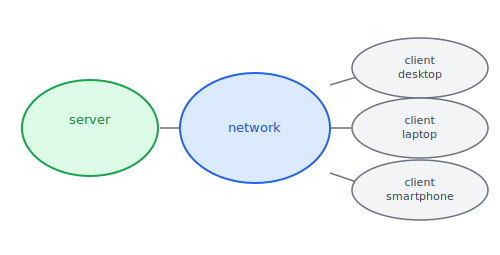
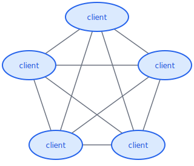
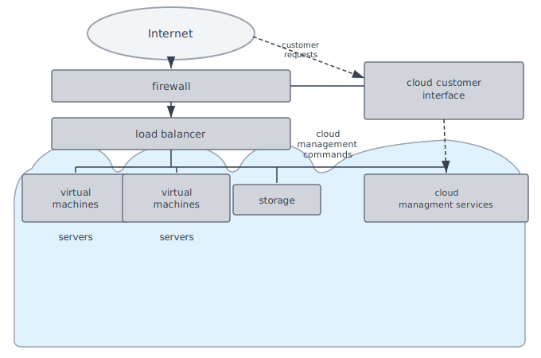

:::note
本系列文章內容參考自經典教材 **Operating System Concepts, 10th Edition (Silberschatz, Galvin, Gagne)**。本文對應章節：**Section 1.10 Computing Environments**。
:::

 

OS 並非只存在於一種形式的電腦上。從辦公室的桌上型電腦，到口袋裡的智慧型手機，到工廠裡的機械手臂控制器，再到 Amazon 雲端機房裡的虛擬機，每一種**運算環境 (Computing Environment)** 都對 OS 提出了不同的要求與挑戰。OS 在這些截然不同的環境中，以不同的形態存在，卻扮演著同樣的核心角色：管理硬體資源、提供程式執行環境，以及協調各元件之間的協作。

 

## **1.10.1 傳統運算 (Traditional Computing)**

「傳統」並非一個固定的狀態，而是一個持續演化的參照點。

在 20 世紀下半葉，運算資源極為稀缺。當時的系統分為兩種基本模式：**批次系統 (Batch System)** 事先準備好一批工作依序執行，無需使用者互動；**互動系統 (Interactive System)** 則等待使用者輸入指令再做出回應。為了最大化珍貴運算資源的使用率，出現了**時間分享系統 (Time-Sharing System)**：用計時器和排程演算法，讓多個使用者快速輪流使用同一台電腦，每人都感覺像是獨占。

隨著技術演進，傳統運算的邊界不斷模糊。典型的辦公室環境曾是獨立 PC 連接到本地網路，伺服器提供檔案和列印服務，遠端存取不便。如今，企業透過網頁技術讓員工使用**入口網站 (Portal)** 存取公司資源，員工可在任何地方透過無線網路或行動數據網路連線。在家庭端，過去每個家庭只有一台電腦透過慢速數據機連線；今日則是多裝置共享高速網路，家用電腦甚至可作為網頁伺服器，而**防火牆 (Firewall)** 則負責限制網路裝置之間的通訊，保護家庭網路不受外部入侵。

今天，純粹的時間分享系統幾乎消失了，但**相同的排程技術**仍運行在每一台桌上型電腦、筆記型電腦、伺服器、甚至手機上。差別在於：現在輪流使用 CPU 的通常是同一個使用者的多個 Process，而非多個使用者。網頁瀏覽器本身可能就是由多個 Process 組成，每個分頁一個 Process，全都在時間分享下並行運作。這說明了一個重要的觀念：傳統運算所發展出來的排程演算法，不是被淘汰，而是以新的形態繼續運作在現代每一台電腦中。

 

## **1.10.2 行動運算 (Mobile Computing)**

**行動運算 (Mobile Computing)** 指的是在手持的**智慧型手機 (Smartphone)** 和**平板電腦 (Tablet)** 上進行運算。

### **功能的演化：從取捨到超越**

歷史上，行動裝置以犧牲效能換取便攜性。早期的行動系統在螢幕大小、記憶體容量和整體功能上都遜於桌機或筆電，只提供電子郵件和網頁瀏覽等基本服務。然而，近年來行動裝置的功能已大幅提升，現代智慧型手機不僅能播放音樂和影片、閱讀電子書、拍攝和剪輯高畫質影片，甚至能完成許多傳統電腦才能做的工作。桌機和平板電腦在功能上的界線，如今已愈來愈難辨別。

更進一步地說，現代行動裝置已能實現**傳統桌機無法或不切實際做到**的功能，這正是因為行動裝置擁有一組傳統電腦所沒有的感測器硬體。

### **獨有的硬體感測器**

這些裝置的定義特徵不只是輕薄可攜，更在於它們搭載的感測器生態系統：

- **GPS 晶片 (GPS Chip)**：利用衛星訊號精確定位裝置在地球上的位置，是導航應用、附近餐廳推薦等地點感知服務的基礎
- **加速度計 (Accelerometer)**：偵測裝置相對地面的方向，以及傾斜、搖晃等動作；許多遊戲直接以傾斜手機取代搖桿或鍵盤作為輸入介面
- **陀螺儀 (Gyroscope)**：提供比加速度計更精細的旋轉偵測，常與加速度計配合使用以提升精度

這三種感測器的組合，使行動裝置能夠實現**擴增實境 (Augmented Reality)** 應用，在現實世界的即時畫面上疊加數位資訊。試想在桌機上開發等效的導航或 AR 應用，幾乎是不可能的任務，這正是行動運算環境相較於傳統運算的獨特價值所在。

### **行動運算的限制：電池即邊界**

行動裝置使用 IEEE 802.11 無線網路或行動數據網路連接網際網路。然而，相比桌上型電腦，行動裝置的記憶體容量和處理速度受到**電池壽命**的嚴格約束。舉例而言，一台智慧型手機的儲存空間約為 256 GB，而桌機則常見 8 TB；行動裝置使用的處理器通常較小、較慢、核心數較少，目的是降低耗電量，以換取更長的電池續航。這說明了 OS 在行動環境下的一個核心設計挑戰：如何在有限的電力預算內，最大化使用者體驗。

目前主導行動運算市場的兩個 OS 是：

| OS                 | 適用裝置                        |
| :----------------- | :------------------------------ |
| **Apple iOS**      | iPhone、iPad                    |
| **Google Android** | 各廠牌 Android 智慧型手機和平板 |

 

## **1.10.3 主從式運算 (Client-Server Computing)**

現代網際網路的基礎架構建立在**分散式系統 (Distributed System)** 之上。在各種分散式架構中，最普遍的一種是**主從式系統 (Client-Server System)**：由一個或多個**伺服器系統 (Server System)** 回應**用戶端系統 (Client System)** 所發出的請求。用戶端可以是桌機、筆電，也可以是智慧型手機，只要能透過網路送出請求，就能享用伺服器提供的服務。

下圖描繪了主從式系統的一般架構：中央伺服器透過網路連接多種不同形式的用戶端裝置，所有的請求都流向伺服器，由伺服器執行後再將結果回傳給用戶端。

依照伺服器提供的服務類型，可以分為兩大類：

- **運算伺服器 (Compute Server)**：提供介面讓用戶端送出請求（例如「查詢某筆資料」），伺服器執行動作後回傳結果。執行資料庫查詢的伺服器是典型例子，用戶端不需要知道資料如何儲存，只需送出查詢、等待結果即可。
- **檔案伺服器 (File Server)**：提供檔案系統介面，讓用戶端建立、讀取、更新、刪除檔案。Web 伺服器就是一種典型的檔案伺服器，它向用戶端瀏覽器傳送網頁內容，這些內容可以從簡單的 HTML 頁面到高畫質影片串流。

主從式架構的設計簡潔直觀，但存在一個根本性的結構弱點：

:::caution 主從式的瓶頸問題
主從式架構有一個結構性弱點：**伺服器是系統的瓶頸 (Bottleneck)**。所有請求都必須通過那一台（或幾台）伺服器，當請求量過大時，伺服器就成為整個系統的限制因素。不論用戶端有多少台，效能上限取決於伺服器的處理能力，而非整個網路的資源總和。

 

這個問題催生了下一節要介紹的點對點架構。
:::

 

## **1.10.4 點對點運算 (Peer-to-Peer Computing)**

**點對點系統 (Peer-to-Peer System, P2P)** 是另一種分散式系統架構，它的核心思想是：**打破主從式的角色區分**。在主從式架構中，伺服器和用戶端扮演固定的角色，前者提供服務，後者消費服務。P2P 系統拒絕這種二元對立，讓每個節點都能動態地既是請求者也是提供者。

在 P2P 系統中，每個節點 (Node) 都是**對等的 (Peer)**：每個節點既可以是用戶端（請求服務），也可以是伺服器（提供服務），取決於當下的角色。服務由分散在整個網路中的多個節點共同提供，不再依賴單一伺服器，自然也就不存在單一瓶頸。

下圖展示了一個無集中式服務的 P2P 系統。圖中每個節點之間的連線代表任意兩個對等節點都可以直接通訊，不需要透過中央伺服器中轉，所有節點的地位完全平等。

當任何一個節點離開網路，系統的其餘部分仍能繼續運作，這種去中心化的特性賦予了 P2P 系統極強的容錯能力，這也是它相較於主從式架構的最大優勢。

### **服務發現：如何找到誰提供什麼服務？**

加入 P2P 網路的節點面臨一個實際問題：**如何知道誰能提供所需的服務？** 節點加入網路後，需要有一套機制讓它發現其他節點提供哪些服務，有兩種主要的解決方案，各有利弊：

**方案一：集中式查找服務 (Centralized Lookup)**

節點向一個中央索引伺服器登記自己提供的服務。需要某服務時，先查詢中央索引，確認哪個節點能提供，再直接與該節點連線，由兩端點對點地交換資料。

- 優點：查找效率高，索引伺服器直接給出答案
- 缺點：中央索引伺服器本身又成了新的瓶頸和單點失敗點，與 P2P 的去中心化初衷有所矛盾

**方案二：廣播發現 (Discovery Protocol)**

完全不使用集中式查找。節點向網路中**所有其他節點廣播**服務請求，能提供服務的節點直接回應。

- 優點：完全去中心化，不存在任何單點
- 缺點：廣播本身會產生大量網路流量，且效率隨網路規模增大而下降

:::note Napster、Gnutella 與 Skype 的對比
**Napster**（1999 年）採用集中式索引：一台中央伺服器維護所有檔案的索引，實際的檔案傳輸則在對等節點之間直接進行。這個設計讓搜尋效率極高，但中央伺服器成了法律責任的集中點。2001 年，Napster 因提供版權音樂的非法共享渠道而被美國法院勒令關閉，服務正式終止。P2P 系統雖然可以用來合法共享自有內容，但也存在被用於版權侵害的風險，其法律地位至今仍是複雜的議題。

 

**Gnutella** 則採用廣播模式：沒有中央索引，節點向鄰近節點廣播搜尋請求，能回應的節點直接回應。這是真正去中心化的設計，即使部分節點下線也不影響整體運作，但廣播流量龐大是其實際部署的主要挑戰。

 

**Skype** 採用更現代的**混合式**設計：有中央登入伺服器負責使用者認證，但通話本身在兩個對等端點之間直接進行，使用 **VoIP（Voice over IP）** 技術傳送語音和視訊，不需要通過中央伺服器中轉。
:::

 

## **1.10.5 雲端運算 (Cloud Computing)**

**雲端運算 (Cloud Computing)** 是一種透過網路，將**運算、儲存，甚至應用程式作為服務按需交付**的運算模式。從概念上看，雲端運算是**虛擬化 (Virtualization)** 的邏輯延伸：以虛擬化技術為基礎，將大量實體伺服器的資源池化，再透過網路按用量提供給任何需要的使用者。

以 Amazon Elastic Compute Cloud (EC2) 為例，它擁有數千台伺服器、數百萬個虛擬機器，以及 PB 等級的儲存空間，任何人都能透過網際網路按月付費使用，完全不需要自行購買和維護實體機器。這種「資源如同水電一樣按用量計費」的模式，從根本上改變了企業部署基礎設施的方式。

下圖展示了一個提供 IaaS 服務的公有雲架構，說明外部用戶的請求如何經過層層元件，最終由雲端內部的運算、儲存和管理資源來服務。

圖中各元件由外到內分別負責：

- **Internet（網際網路）**：用戶發出的請求從這裡進入雲端環境
- **Firewall（防火牆）**：所有進出流量的第一道過濾關卡，保護雲端服務不受惡意存取，雲端服務與用戶介面兩個入口都受到防火牆保護
- **Load Balancer（負載平衡器）**：將大量進入的用戶請求分散分配到多台伺服器，避免任何一台伺服器過載
- **Virtual Machines（虛擬機器）**：用戶實際使用的運算資源，在實體伺服器上以軟體方式模擬出的獨立電腦環境
- **Storage（儲存）**：提供持久化的資料儲存服務，可獨立於虛擬機器之外使用
- **Cloud Management Services（雲端管理服務）**：接受管理員的控制指令，統籌管理整個雲端環境的資源分配、監控和調度
- **Cloud Customer Interface（雲端用戶介面）**：用戶透過此介面提交服務請求，例如申請新的虛擬機器或增加儲存空間

### **雲端類型**

雲端可依其服務對象和所有權分為三種類型：

| 類型                       | 說明                                                     |
| :------------------------- | :------------------------------------------------------- |
| **公有雲 (Public Cloud)**  | 透過網際網路向任何願意付費的使用者提供                   |
| **私有雲 (Private Cloud)** | 由企業為自身使用而建立，不對外開放                       |
| **混合雲 (Hybrid Cloud)**  | 同時包含公有雲和私有雲元件，彈性分配敏感與非敏感工作負載 |

這三種類型並非互斥，同一個雲端環境可能同時提供多種形態的服務。

### **雲端服務模式**

除了類型的區分，雲端還依「服務抽象層級」劃分為三種服務模式，層級越高代表服務商管理的範疇越廣，使用者需要關心的細節越少：

| 服務模式 | 全名                        | 說明                                                                       |
| :------- | :-------------------------- | :------------------------------------------------------------------------- |
| **SaaS** | Software as a Service       | 應用程式（如文書處理器、試算表）透過網際網路直接提供，使用者無需安裝       |
| **PaaS** | Platform as a Service       | 軟體開發平台（如資料庫伺服器）透過網際網路提供，開發者可直接在其上部署應用 |
| **IaaS** | Infrastructure as a Service | 伺服器或儲存空間本身透過網際網路提供，使用者自行安裝 OS 和軟體             |

### **雲端基礎設施中的 OS 層級**

雲端基礎設施的軟體架構不止一層。最底層是執行在實體伺服器上的傳統 OS；其上是負責管理虛擬機器的 **VMM（Virtual Machine Manager）**，例如 VMware ESXi，它讓一台實體伺服器可以同時運行數十個虛擬機器；更上層則是管理整個雲端資源的**雲端管理工具 (Cloud Management Tools)**，例如 VMware vCloud Director 和開源的 Eucalyptus。這些工具負責跨伺服器的資源分配、虛擬機器的生命週期管理，以及對外提供操作介面，其複雜程度和責任範疇已足以將它們視為一種新型態的作業系統。

 

## **1.10.6 即時嵌入式系統 (Real-Time Embedded Systems)**

**嵌入式電腦 (Embedded Computer)** 是世界上數量最多的電腦形式，遠超過桌機、筆電和手機的總和。車輛引擎、製造機器人、微波爐、光碟機，幾乎每一件現代機械設備裡都有嵌入式電腦的蹤跡。

### **嵌入式系統的特點**

嵌入式系統之所以與一般電腦有所不同，在於其設計哲學是「為單一任務而生」：

- **任務高度專一**：通常只執行一種或少數幾種固定功能，例如控制引擎轉速或讀取溫度感測器
- **介面極簡**：幾乎沒有使用者介面，系統的主要職責是監控和管理硬體裝置，而非回應使用者的即時操作
- **計算能力受限**：OS 提供的功能有限，許多嵌入式裝置甚至沒有完整的作業系統

嵌入式系統的硬體形態也相當多樣。有些是搭載標準 Linux 的通用電腦，配上特殊用途的應用程式；有些是只提供所需功能的專用嵌入式 OS；還有些甚至採用**特殊應用積體電路 (Application-Specific Integrated Circuit, ASIC)**，直接在矽晶上以硬體邏輯執行功能，完全不需要任何作業系統。

隨著技術演進，嵌入式系統的影響範圍持續擴大。整棟房屋可以由一台中央電腦統一控制暖氣、照明和防盜警報，屋主可以在回家途中透過網路連線預先開啟暖氣；未來的冰箱甚至可能在偵測到牛奶用完時自動通知超市補貨。這些場景描繪出嵌入式系統無所不在的發展趨勢。

### **什麼是「即時」？**

嵌入式系統幾乎都執行**即時作業系統 (Real-Time Operating System)**。「即時」的含義並非「速度快」，而是有一個精確的定義：

**即時系統 (Real-Time System)** 是指對 Processor 的操作或資料流動設有**嚴格的時間限制 (Rigid Time Requirements)** 的系統。在即時系統中，「在規定時間內給出答案」和「給出正確答案」同等重要，超過 Deadline 的正確答案，在即時系統的語義下，等同於錯誤答案。

即時系統的典型工作流程是：感測器持續將資料送入電腦，電腦必須在規定時間內分析這些資料，並據此調整控制輸出（例如調整燃油噴射量、修正機械臂位置）。這個分析和回應的循環必須在每一個時間週期內可靠地完成，否則系統就被視為失敗。

教科書以機器手臂控制為例說明後果：若控制機器手臂的即時系統反應太慢，手臂在接到「停止」指令前可能已經撞上正在組裝的汽車，錯過 Deadline 的代價是物理損壞甚至人員傷亡。即時系統的典型應用包括：科學實驗控制系統、醫療影像系統（如核磁共振）、工業控制系統、汽車引擎燃油噴射系統、家電控制器，以及武器系統等。

:::note 即時系統 vs 非即時系統
| 特性     | 即時系統                         | 一般系統               |
| :------- | :------------------------------- | :--------------------- |
| 時間限制 | 嚴格、固定的 Deadline            | 越快越好，但可以彈性   |
| 超時後果 | 系統失敗（甚至物理損壞）         | 體驗變差，可接受       |
| 典型應用 | 機器手臂、醫療影像、燃油噴射系統 | 桌上型電腦、筆記型電腦 |
:::

即時排程技術詳見 Ch5；Linux 的即時元件詳見 Ch20。

 

## **六種運算環境總覽**

以下彙整六種運算環境的核心特點與 OS 的角色。值得注意的是，這六種環境並非互斥：一台雲端伺服器本身也是主從式架構的一部分，行動裝置也具備即時感測器處理的需求。現代 OS 的設計往往需要同時因應多種環境的要求。

| 環境           | 核心特點                           | OS 的角色            |
| :------------- | :--------------------------------- | :------------------- |
| **傳統運算**   | 桌面與伺服器，同一使用者多任務     | 多工排程、資源管理   |
| **行動運算**   | 攜帶性、感測器、電池限制           | 省電管理、感測器整合 |
| **主從式**     | 集中服務，伺服器可能成瓶頸         | 分散式服務與網路管理 |
| **點對點**     | 去中心化，每節點兼具 client/server | 去中心化協調         |
| **雲端**       | 按需付費，資源虛擬化               | VMM 管理虛擬機器     |
| **即時嵌入式** | 嚴格時間限制，任務專一             | 即時排程、硬體控制   |
