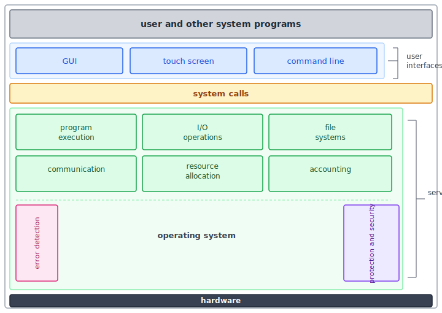

:::note
本系列文章內容參考自經典教材 **Operating System Concepts, 10th Edition (Silberschatz, Galvin, Gagne)**。本文對應章節：**Section 2.1 Operating-System Services、2.2 User and Operating-System Interface**。
:::

<br/>

## **2.1 作業系統服務 (Operating System Services)**

作業系統 (Operating System, OS) 提供一個讓程式能夠執行的環境。不同系統在設計上差異很大，但它們所提供的服務在本質上卻有共同的分類方式。

下圖呈現了 OS 服務的全貌，以及這些服務彼此之間、與使用者程式之間、與底層硬體之間的層次關係：



圖的閱讀方式由上至下：最上層是使用者程式，透過**使用者介面 (User Interface)** 與 OS 互動，所有請求最終都透過**系統呼叫 (System Calls)** 進入 OS 核心。OS 提供的服務分成兩組：中央六個綠色方塊代表對使用者直接有益的服務，左右兩側的方塊（Error Detection、Protection and Security）代表系統效率服務。所有服務都構建在最底層的**硬體 (Hardware)** 之上。

OS 的服務可以分成兩大類：第一類服務的設計目的是**讓使用者更容易使用電腦**；第二類服務則是**讓 OS 自身能夠高效運作**，與使用者體驗的直接關聯較少。

### **對使用者有益的服務**

**使用者介面 (User Interface, UI)**：幾乎所有 OS 都提供 UI，讓使用者能與系統互動。UI 主要有三種形式：圖形使用者介面 (Graphical User Interface, GUI) 以視窗、圖示、選單組成桌面環境；觸控螢幕介面 (Touch-Screen Interface) 以手指手勢操作，適合行動裝置；命令列介面 (Command-Line Interface, CLI) 讓使用者輸入文字指令，適合進階使用者與系統管理員。有些系統同時提供三種形式。

:::info UI 只是最表層的介面
UI 是使用者與 OS 互動的入口，但它本身**不屬於 OS 核心功能**的一部分。OS 的設計者不必為了實作 UI 而改動 OS 核心，UI 可以是一個獨立的使用者層程式。這就是為什麼 macOS 可以同時提供 Aqua GUI 和 Terminal CLI，而底層 OS 核心完全不需要改變。
:::

**程式執行 (Program Execution)**：OS 必須能夠將一支程式**載入記憶體**並**執行**。程式執行結束時可能是正常結束，也可能是因為錯誤而異常終止，OS 必須能夠識別並回應這兩種情況。這項服務背後涉及記憶體管理、CPU 排程、行程 (Process) 建立等複雜機制。

**I/O 操作 (I/O Operations)**：執行中的程式可能需要讀取鍵盤輸入、寫入磁碟檔案或透過網路收發資料。基於**效率**與**保護**兩個理由，使用者程式不能直接存取 I/O 裝置，OS 必須提供統一且受管控的 I/O 存取介面。
- 效率面：多個程式可能同時需要同一裝置，需要 OS 居中協調。
- 保護面：若允許使用者程式直接控制裝置，惡意程式可以讀取任意磁碟區塊或干擾他人的 I/O。


**檔案系統管理 (File-System Manipulation)**：程式需要讀寫檔案與目錄，也需要依名稱建立、刪除、搜尋，以及列出檔案資訊。許多 OS 還提供**權限管理 (Permissions Management)**，根據檔案擁有者設定存取許可。同一套 OS 可能同時支援多種檔案系統（如 ext4、FAT32、NTFS），各差異對上層應用程式透明，統一由 OS 的檔案系統介面遮蔽。

**通訊 (Communications)**：行程之間有時需要交換資訊，可發生在同一台電腦的不同行程之間，或跨越網路連接的不同電腦。OS 提供兩種實作方式：
- **共享記憶體 (Shared Memory)** 讓多個行程讀寫同一塊記憶體區段，速度快但需要同步機制；
- **訊息傳遞 (Message Passing)** 由 OS 負責在行程之間移動格式固定的資料封包，安全性更高，適合跨機器通訊。

**錯誤偵測 (Error Detection)**：OS 必須**持續偵測並修正錯誤**，這是一個永不停歇的背景工作。錯誤來源非常多樣：硬體層有記憶體錯誤、電力異常；I/O 層有磁碟同位元錯誤 (Parity Error)、網路中斷；使用者程式層有算術溢位 (Arithmetic Overflow)、非法記憶體存取。OS 必須針對每一種錯誤採取適當行動，有時被迫停止整個系統，有時終止發生錯誤的行程並回傳錯誤代碼。

:::info 為什麼錯誤偵測歸類在「對使用者有益」？
錯誤偵測的最終受益者是使用者：因為有它，使用者的程式不會因底層硬體故障而悄悄產生錯誤的計算結果，而是能收到明確的錯誤通知。這正是「確保使用者能夠正確使用電腦」的核心。
:::

### **維護系統效率的服務**

這一組服務不是為了讓使用者更方便，而是確保**多個程式共用系統資源時，整體能夠高效運作**。在多行程環境 (Multi-Process Environment) 中，它們至關重要。

**資源配置 (Resource Allocation)**：當多個行程同時執行時，OS 必須將 CPU 時間、主記憶體、檔案儲存空間等資源分配給各行程。CPU 時間透過 **CPU 排程演算法 (CPU Scheduling Algorithm)** 決定分配方式；主記憶體的配置位置由 OS 追蹤與決定；印表機、USB 裝置等週邊則使用請求與釋放 (Request and Release) 機制。

**日誌記錄 (Logging / Accounting)**：OS 追蹤哪些行程使用了多少哪些資源。這份記錄有兩種用途：在雲端或大型主機環境中可用於**計費 (Accounting)**；系統管理員也可根據使用統計分析瓶頸，改善整體服務品質。

**保護與安全 (Protection and Security)**：保護與安全是不同層面的問題。
- **保護 (Protection)** 確保對系統資源的所有存取都受到控制，任何一個行程都不應干擾其他行程或 OS 本身。
- **安全 (Security)** 則抵禦外部威脅，從要求使用者以密碼**驗證身份 (Authentication)** 開始，延伸至保護網路介面卡等裝置免於未授權存取，並記錄可疑連線以偵測入侵。

:::caution 保護與安全是系統整體的責任
保護與安全必須在系統每一個環節都設置防線。就像一條鎖鏈的強度取決於最弱的環節，即使 OS 核心設計得無懈可擊，若某個應用程式存在漏洞，整個系統仍面臨風險。因此，保護機制必須貫穿硬體層、OS 層、系統程式層到使用者程式層。
:::

<br/>

## **2.2 使用者與作業系統的介面 (User and Operating-System Interface)**

使用者與 OS 互動的方式可以分為三大類：命令列介面、圖形使用者介面，以及觸控螢幕介面。它們只是 OS 的最外層包裝，並不代表 OS 本身的結構。

### **2.2.1 命令列介面 (Command Interpreters)**

大多數 OS（包括 Linux、UNIX、Windows）將**命令直譯器 (Command Interpreter)** 實作為一支特殊程式，在行程啟動或使用者登入時開始執行。在可以選擇多種命令直譯器的系統上，這些直譯器被稱為 **Shell（殼層）**。以 UNIX/Linux 系統為例，使用者可以在 C Shell、Bourne-Again Shell (bash)、Korn Shell 等之間選擇。Shell 的核心工作非常單純：**持續讀取使用者輸入的下一條指令，並執行它**。

**指令執行的兩種設計方式：**

Shell 要如何「執行」一條指令，背後有兩種截然不同的設計哲學。

**方式一：Shell 本身包含執行程式碼。** Shell 直譯器的程式碼裡直接內建每一條指令的實作邏輯。支援的指令越多，Shell 程式本身就越大，因為每一條指令都必須對應一段實作程式碼。

**方式二：指令對應獨立的系統程式。** UNIX 採用的是更具彈性的設計：Shell 本身**不理解**指令的意義，它把指令名稱視為一個**可執行檔案的名稱**，找到之後載入記憶體並執行，並將剩餘的參數傳遞給該程式。以刪除檔案為例：

```bash
rm file.txt
```

Shell 並不知道 `rm` 的意義，它只是搜尋名為 `rm` 的可執行檔、載入記憶體並執行，把 `file.txt` 作為參數傳入。刪除邏輯完全定義在 `rm` 這支程式的程式碼中，Shell 本身完全不涉及。這個設計帶來一個優雅的特性：**程式設計師只需建立一個新的可執行程式，就能新增一條「新指令」**，完全不需要修改 Shell 本身。

:::tip 機制與策略分離
UNIX 的這個設計體現了一個重要的 OS 設計原則：**機制與策略分離 (Separation of Mechanism and Policy)**。Shell 只提供「找到並執行程式」的機制，至於每條指令實際做什麼，完全由獨立的程式決定。這讓系統的功能擴充變得極為容易，也讓每條指令的實作可以被獨立替換或升級，互不干擾。
:::

### **2.2.2 圖形使用者介面 (Graphical User Interface)**

**圖形使用者介面 (Graphical User Interface, GUI)** 採用**桌面隱喻 (Desktop Metaphor)**：使用者移動滑鼠，將游標定位到螢幕上代表程式、檔案、目錄或系統功能的**圖示 (Icon)** 上，透過點擊按鈕來啟動程式、選取檔案，或展開包含指令的選單。

GUI 的發展源自 1970 年代初 Xerox PARC 研究中心的研究成果，第一套 GUI 出現在 1973 年的 Xerox Alto 電腦上，真正走向大眾則是在 1980 年代 Apple Macintosh 推出之後。各大 OS 的採用路徑各不相同：macOS 引入了 Aqua 介面，並隨改用 UNIX 核心後同時提供 GUI 和 CLI；Windows 最初只是在 MS-DOS 上疊加一層 GUI；Linux/UNIX 傳統以 CLI 為主，但 KDE 和 GNOME 等開源桌面環境持續演進。

### **2.2.3 觸控螢幕介面 (Touch-Screen Interface)**

由於命令列介面和滑鼠鍵盤系統對行動裝置並不實用，智慧型手機和平板電腦通常使用**觸控螢幕介面**，使用者透過滑動、點按手勢來操作。現代大多數手機和平板改為在觸控螢幕上模擬虛擬鍵盤，不再內建實體鍵盤。Apple 的 iPhone 和 iPad 均採用 Springboard 作為主要觸控介面。

### **2.2.4 介面選擇 (Choice of Interface)**

選擇哪種介面，很大程度上取決於個人偏好與使用情境：

- **CLI 的優勢**：系統管理員和進階使用者偏好 CLI，因為它能更快速地完成操作。部分系統功能只能透過 CLI 使用，GUI 只提供常用功能的子集。CLI 天然支援**自動化**：一系列指令可記錄到檔案中後執行，這種被 CLI 解讀執行的指令檔稱為 **Shell Script**，在 UNIX 和 Linux 環境中極為普遍。
- **GUI 的優勢**：對初學者和非技術使用者而言，GUI 提供較低的入門門檻，直觀的圖示和選單引導使用者完成日常工作。
- **行動裝置的現實**：雖然 iOS 和 Android 都有提供 CLI 的 App，但幾乎所有行動裝置使用者都是透過觸控螢幕介面操作。

:::info UI 與 OS 核心結構的關係
使用者介面可能在不同系統之間，乃至同一系統的不同使用者之間，有截然不同的形式，但它通常與 OS 的實際核心結構**相距甚遠**。設計一套好用且直觀的 UI 本身不是 OS 核心功能，更接近於一個獨立的軟體工程問題。這正是為什麼 OS 的學習重心會放在行程管理、記憶體管理等核心機制，而非 UI 的視覺設計。
:::
