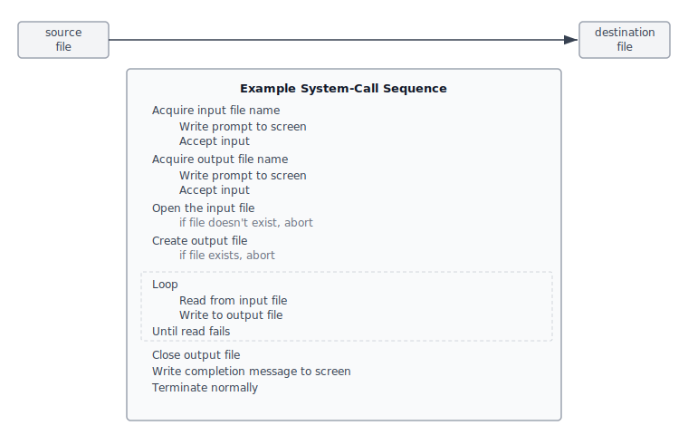
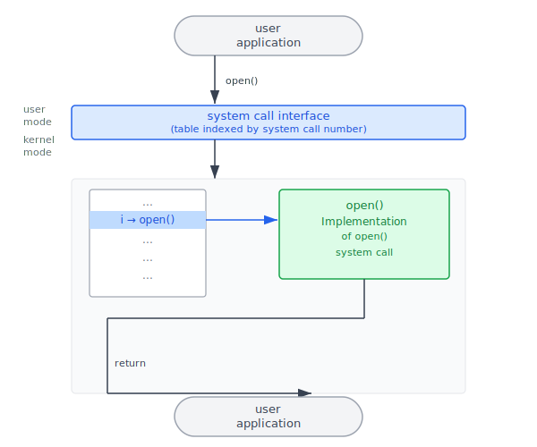
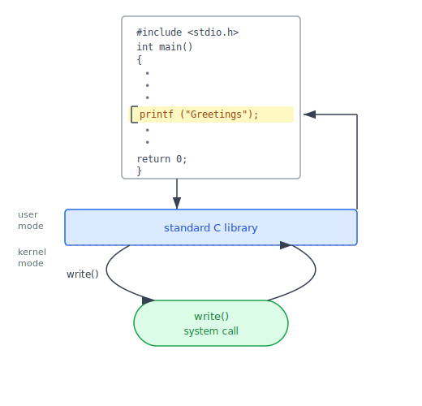
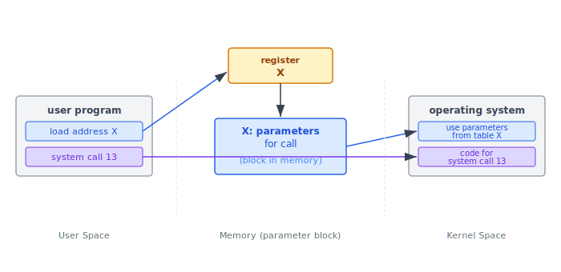
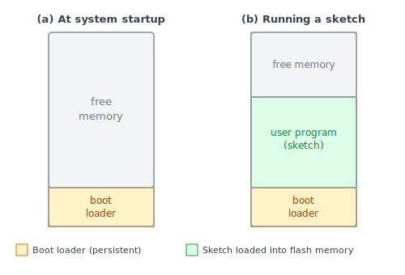
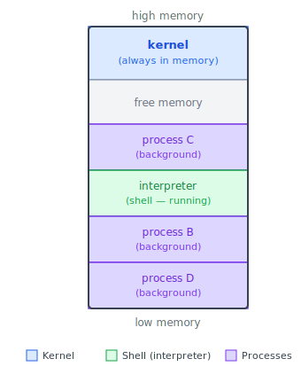
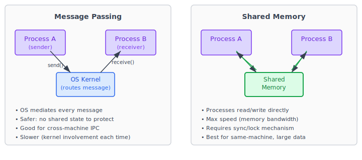

:::note
本系列文章內容參考自經典教材 **Operating System Concepts, 10th Edition (Silberschatz, Galvin, Gagne)**。本文對應章節：**Section 2.3 System Calls**。
:::

## **2.3 系統呼叫 (System Calls)**

在第 2.1 節，我們看到 OS 提供許多服務：程式執行、I/O 操作、檔案管理、錯誤偵測……但這些服務要怎麼被使用者程式使用？答案是透過**系統呼叫 (System Call)**。

系統呼叫是使用者程式進入 OS 核心的唯一合法通道，為 OS 所提供的服務定義了一套正式的介面。在大多數系統上，系統呼叫以 C 或 C++ 函式的形式呈現，但底層涉及硬體存取的低階任務仍需用組合語言 (Assembly Language) 撰寫。

理解系統呼叫的重要性：在第 1.5 節介紹的 **Dual-Mode Operation** 中，使用者程式只能執行在 User Mode，無法直接存取硬體或呼叫核心功能。系統呼叫提供一個受控制的「陷阱門」：使用者程式透過系統呼叫請求服務，CPU 切換到 Kernel Mode 執行 OS 程式碼，完成後再切換回 User Mode 將結果返回。整個過程中，使用者程式無法越權、無法直接存取 OS 內部。

 

## **2.3.1 使用範例**

在深入探討系統呼叫的機制之前，先用一個具體的例子感受它的存在感：**撰寫一支將一個檔案的內容複製到另一個檔案的程式**。

這看起來很單純，但把整個執行過程拆開：

1. **取得輸入檔案名稱**：向螢幕輸出提示（寫入 I/O），然後從鍵盤讀取字串（讀取 I/O）
2. **取得輸出檔案名稱**：同上
3. **開啟輸入檔案**：若檔案不存在，必須印出錯誤訊息並正常終止（又要 I/O 和終止系統呼叫）
4. **建立輸出檔案**：若已存在同名檔案，須詢問使用者是否覆蓋（又要 I/O 和讀取輸入）
5. **進入讀寫迴圈**：反覆從輸入檔案讀取資料，寫入輸出檔案，直到讀到 EOF
6. **關閉兩個檔案**：釋放資源
7. **印出完成訊息**，正常終止

每一個步驟都涉及一次或多次系統呼叫。以下圖示呈現了完整的系統呼叫序列：

圖中的步驟流程從上至下：先取得兩個檔名（各需多次 I/O 系統呼叫），再開啟輸入檔與建立輸出檔（可能需要處理錯誤分支），然後進入讀寫迴圈（每次 read/write 各一次呼叫），最後關閉檔案、印出完成訊息、正常終止。即使是這樣一支「簡單」的程式，在執行過程中也可能觸發數十次系統呼叫。

:::info 這支程式在 UNIX 系統中等同於 `cp` 指令
`cp in.txt out.txt` 這條指令做的事，正是上面描述的完整系統呼叫序列。OS 本身提供的許多指令工具，底層都是以一連串系統呼叫組合而成。
:::

 

## **2.3.2 應用程式介面 (Application Programming Interface)**

既然系統呼叫如此頻繁，程式設計師應該直接呼叫系統呼叫嗎？

實務上幾乎不會這樣做。直接使用系統呼叫有兩個根本問題：

**可攜性 (Portability) 問題**：每個 OS 的系統呼叫名稱、編號、參數格式都不同。在 Linux 上呼叫 `read()`，在 Windows 上要呼叫 `ReadFile()`，函式簽章也完全不同。直接呼叫系統呼叫的程式碼被鎖死在特定 OS 上，換個平台就必須重寫。

**複雜性 (Complexity) 問題**：系統呼叫的介面往往非常底層，需要直接指定暫存器、記憶體位址、位元旗標等細節，遠比一般函式庫呼叫繁瑣許多。

### **API 抽象層**

解決方案是在系統呼叫之上建立一層**應用程式介面 (Application Programming Interface, API)**。API 定義一組可供應用程式呼叫的函式，規定每個函式的名稱、參數、回傳值。應用程式只需遵守 API，底層實際呼叫哪個系統呼叫，由 API 函式庫自動處理。

目前最常用的三套 API 是：

| API | 適用平台 | 提供函式庫 |
|---|---|---|
| **Windows API** | Windows 系統 | Win32 / Win64 系統函式庫 |
| **POSIX API** | UNIX、Linux、macOS | `libc`（C 標準函式庫） |
| **Java API** | 任何有 JVM 的平台 | Java Runtime Environment |

以 UNIX/Linux 的 C 程式為例，程式設計師呼叫 POSIX API 中的 `read()` 函式，由 `libc` 這個函式庫負責在背後呼叫 OS 的 `read` 系統呼叫，並將結果回傳。程式設計師從來不需要知道系統呼叫的編號或底層細節。

### **系統呼叫介面的工作原理**

**執行時期環境 (Run-Time Environment, RTE)** 是執行以特定語言撰寫的應用程式所需的完整軟體組合，包含編譯器或直譯器、函式庫、載入器等。在 RTE 中有一個關鍵元件：**系統呼叫介面 (System-Call Interface)**，它作為 API 層與 OS 核心之間的橋梁。

下圖呈現了使用者程式呼叫 `open()` 這個 API 函式時，整個請求是如何被傳遞並最終由 OS 核心處理的：

圖的上半部是使用者程式空間（User Mode）：程式呼叫 `open()`，這個呼叫進入 System Call Interface 層。System Call Interface 維護一張以系統呼叫編號為索引的表，找到 `open()` 對應的編號 `i`，透過軟體中斷（Trap）切換到 Kernel Mode，並跳轉到 OS 核心中 `open()` 的實作。核心完成操作後，結果沿原路返回使用者程式。

整個過程的關鍵洞察是：**呼叫端完全不需要知道系統呼叫如何實作、執行過程中做了什麼**。呼叫端只需遵守 API 的規格，其餘細節都被 RTE 和系統呼叫介面封裝起來。

### **具體範例：Standard C Library 如何橋接 printf() 與 write()**

上述抽象機制用一個日常可見的案例能說得更清楚。C 語言的標準函式庫 (Standard C Library, libc) 正是 UNIX/Linux 系統上的 POSIX API 實作，它提供了系統呼叫介面的一部分。

假設一支 C 程式呼叫 `printf("Greetings")`，實際發生的過程是：

1. `printf()` 是 C 標準函式庫提供的函式，並非系統呼叫本身
2. C 函式庫攔截這個呼叫，判斷需要向終端機輸出資料
3. C 函式庫在底層呼叫 OS 的 `write()` 系統呼叫，傳入格式化後的字串
4. OS 核心執行 `write()` 系統呼叫，真正將資料輸出到裝置
5. 核心將回傳值（寫入的位元組數或錯誤碼）傳回 C 函式庫
6. C 函式庫再將結果傳回使用者程式

以下是這個流程的示意圖：

圖的上方是使用者程式的 C 程式碼，`printf("Greetings")` 呼叫箭頭向下指向位於 User Mode / Kernel Mode 邊界的 **standard C library** 層（藍色方塊）。C 函式庫跨越邊界後呼叫 `write()` 系統呼叫（在 Kernel Mode 執行），最終到達 `write() system call`（綠色方塊，代表真正的 OS 核心實作）。完成後的回傳值沿右側箭頭逐層向上返回使用者程式。

這個例子揭示了一個重要事實：**使用者程式中看起來很平常的 `printf()` 呼叫，底層實際上是在呼叫 OS 的系統呼叫**。C 函式庫在兩者之間充當透明的轉譯層，讓程式設計師不需要直接面對 `write()` 的底層介面。

### **參數傳遞的三種方式**

系統呼叫的執行通常需要額外的資訊，例如讀取時要指定來源的檔案或裝置、記憶體緩衝區位址、資料長度等。有三種方式可以將這些參數從使用者程式傳遞給 OS：

**方式一：暫存器 (Registers)**：最直接，將參數值直接存入 CPU 暫存器。速度最快，但暫存器數量有限，只能傳遞少量參數（Linux 在 5 個以下參數時採用此方式）。

**方式二：記憶體區塊/表格 (Block / Table)**：將所有參數集中存入記憶體中的一個連續區塊，只將這個區塊的起始位址存入暫存器中傳給 OS。OS 收到位址後，從記憶體中讀取完整的參數列表。Linux 在超過 5 個參數時採用此方式。

**方式三：堆疊 (Stack)**：使用者程式把參數推入 (push) 堆疊，OS 在接手後從堆疊中彈出 (pop) 參數。

以下是方式二的示意圖：

圖中：使用者程式將參數預先存入記憶體位址 X 的區塊（藍色方塊），並將位址 X 存入暫存器（橘色方塊）。發出系統呼叫 13 的請求後，OS 從暫存器讀取位址 X，再從 X 指向的記憶體區塊中取得所有參數，最終執行 System Call 13 對應的程式碼。方式二和方式三的共同優點是：不限制參數的數量與長度，遠比方式一靈活。

 

## **2.3.3 系統呼叫的類型 (Types of System Calls)**

系統呼叫可以大致分成六大類，涵蓋了 OS 所有可對外提供的服務範疇：

| 類別 | 代表性系統呼叫 |
|---|---|
| **行程控制 (Process Control)** | create process / terminate process / load / execute / get & set attributes / wait / signal / allocate & free memory |
| **檔案管理 (File Management)** | create / delete / open / close / read / write / reposition / get & set attributes |
| **裝置管理 (Device Management)** | request / release / read / write / reposition / get & set attributes / attach & detach |
| **資訊維護 (Information Maintenance)** | get/set time & date / get system data / get/set process attributes |
| **通訊 (Communications)** | create & delete connection / send & receive messages / transfer status / attach & detach remote devices |
| **保護 (Protection)** | get/set file permissions / allow/deny user access |

以下各小節逐一介紹每個類別的設計動機與核心操作。

 

### **行程控制 (Process Control)**

行程 (Process) 是程式執行時在記憶體中的實例。一個完整的行程生命週期需要 OS 提供全方位的控制介面。

**生命週期管理**：行程可以正常結束（`end()`）或異常中止（`abort()`）。若程式呼叫 `abort()` 或遇到嚴重錯誤，OS 有時會產生記憶體傾印 (Memory Dump) 並寫入日誌，供除錯工具（Debugger）分析。控制權最終必須回到命令直譯器 (Command Interpreter)，才能繼續接受下一條指令。

**執行其他程式**：一個行程可以呼叫 `load()` 和 `execute()` 來執行另一支程式。這裡有一個關鍵問題：被載入的新程式結束後，控制權應該回到哪裡？

- 若舊行程需要在新程式結束後繼續執行，OS 必須保存舊行程的記憶體映像，這實際上是建立了「一個程式可以呼叫另一個程式」的機制
- 若兩個程式必須同時執行，則需要明確建立一個新行程（`create_process()`），這就是**多程式設計 (Multiprogramming)** 的基礎

**屬性與等待**：OS 提供 `get_process_attributes()` 和 `set_process_attributes()` 讓程式能查詢或修改一個行程的優先權、最大執行時間等屬性。程式也可以呼叫 `wait_time()` 或 `wait_event()` 等待特定時間或特定事件，搭配 `signal_event()` 讓行程間能夠互相協調。

**共享資料的鎖定**：當多個行程共享資料時，OS 提供 `acquire_lock()` 與 `release_lock()`，確保任何時刻只有一個行程能修改共享資料，避免競爭條件 (Race Condition)。這類機制在第 6、7 章會深入討論。

#### **單工系統範例：Arduino**

Arduino 是一個由微控制器和輸入感測器組成的簡單硬體平台，代表**單工系統 (Single-Tasking System)** 的極端情況。

在 Arduino 的設計裡，根本沒有 OS。開機時，一小段 **Boot Loader** 負責將使用者撰寫的程式（稱為 **Sketch**）從 PC 上傳並載入 Arduino 的快閃記憶體中，之後 Sketch 便開始執行並等待感測器事件。

下圖展示了 Arduino 記憶體在開機前後的變化：

- **(a) 開機時**：記憶體中只有 Boot Loader 佔據底部，其餘全是空閒記憶體
- **(b) 執行 Sketch 時**：Boot Loader 仍在底部，使用者程式（Sketch）被載入並佔據中間的記憶體區段，剩餘部分為空閒記憶體

Arduino 是「單工」的原因：任何時刻記憶體中只能有一個 Sketch，若載入新的 Sketch，舊的會被直接覆蓋。且 Arduino 沒有使用者介面，只透過感測器接收外部事件。這種極簡設計對嵌入式應用完全足夠，但完全無法執行多個並行任務。

#### **多工系統範例：FreeBSD**

FreeBSD（源自 Berkeley UNIX）是**多工系統 (Multi-Tasking System)** 的代表。使用者登入後，系統執行使用者選定的 Shell 等待指令。由於 FreeBSD 是多工系統，命令直譯器可以在其他程式執行的同時繼續執行。

下圖呈現了 FreeBSD 系統在執行多個程式時的記憶體佈局：

記憶體從高位址到低位址依序是：OS 核心（Kernel）始終常駐在記憶體高位址區段，其下方是空閒記憶體，再往下是多個行程（Process B、C、D）和命令直譯器（Interpreter，即 Shell）各自佔據的區段。

FreeBSD 啟動一支新程式的流程如下：

1. Shell 呼叫 `fork()` 系統呼叫，建立一個新的行程
2. 新行程呼叫 `exec()` 系統呼叫，將指定的程式載入記憶體並執行
3. 視指令的輸入方式，Shell 決定是**等待行程結束**（前景執行），還是立刻返回準備接受下一條指令（背景執行，以 `&` 符號標記）
4. 背景執行的行程無法直接接收鍵盤輸入（因為 Shell 正在使用鍵盤），必須透過檔案或 GUI 進行 I/O
5. 行程結束時呼叫 `exit()` 系統呼叫，回傳狀態碼（0 代表成功，非零代表錯誤）給 Shell

:::info Windows 與 UNIX 的對應系統呼叫
同樣的行程控制功能，在 Windows 和 UNIX 上有不同的系統呼叫名稱：

| 功能 | Windows | UNIX/Linux |
|---|---|---|
| 建立行程 | `CreateProcess()` | `fork()` + `exec()` |
| 終止行程 | `ExitProcess()` | `exit()` |
| 等待行程 | `WaitForSingleObject()` | `wait()` |
:::

 

### **檔案管理 (File Management)**

檔案系統是 OS 最重要的服務之一，本書第 13–15 章會深入討論。這裡先整理核心的檔案管理系統呼叫。

一個檔案的完整生命週期需要以下操作：首先用 `create()` 建立一個新檔案，不需要時用 `delete()` 刪除。要存取檔案的內容，必須先用 `open()` 開啟，確認存取權限並讓 OS 記錄行程正在使用此檔案，完成後呼叫 `close()` 通知 OS 釋放相關資源。開啟檔案後可以用 `read()` 讀取資料、`write()` 寫入資料，或用 `reposition()`（也稱 `seek()`）調整讀寫位置（如倒回開頭或跳到檔案末尾）。

對於目錄 (Directory) 也需要同一套操作，因為目錄本身在檔案系統中就是一種特殊的檔案。此外，OS 還提供 `get_file_attributes()` 和 `set_file_attributes()` 讓程式能查詢或修改檔案名稱、類型、保護碼 (Protection Code)、帳務資訊等屬性。部分 OS 還直接提供 `move()` 或 `copy()` 等高階系統呼叫；另一些 OS 則在 API 層用多個基礎系統呼叫組合實作這些操作。

:::info Windows 與 UNIX 的對應系統呼叫

| 功能 | Windows | UNIX/Linux |
|---|---|---|
| 開啟/建立檔案 | `CreateFile()` | `open()` |
| 讀取 | `ReadFile()` | `read()` |
| 寫入 | `WriteFile()` | `write()` |
| 關閉 | `CloseHandle()` | `close()` |
:::

 

### **裝置管理 (Device Management)**

行程在執行時需要多種資源：主記憶體、磁碟、網路介面……所有這些受 OS 管控的資源，都可以被視為**裝置 (Device)**，包括實體裝置（如磁碟）和虛擬/抽象裝置（如檔案）。

在多使用者系統中，存取裝置通常需要先明確請求（`request()`），確保取得**獨佔使用權 (Exclusive Use)**。完成後呼叫 `release()` 歸還裝置給 OS 調度。某些 OS 允許不經請求直接存取裝置，但這可能導致**裝置競爭 (Device Contention)** 甚至**死鎖 (Deadlock)**（第 8 章詳述）。

取得裝置使用權後，可以對裝置執行 `read()`、`write()`、`reposition()`，行為與操作檔案幾乎相同。

:::tip UNIX 統一的檔案裝置模型
UNIX 系統將檔案與 I/O 裝置合併為一個統一的結構（file–device structure）。磁碟、終端機、印表機等裝置在 UNIX 中都以特殊檔案名稱表示，位於 `/dev/` 目錄下。這套設計讓同一組系統呼叫（`open()`、`read()`、`write()`、`close()`）可以用於操作檔案和裝置，大幅簡化了程式設計。例如，`/dev/sda` 代表第一顆硬碟，可以像普通檔案一樣對它呼叫 `read()` 和 `write()`。

| 功能 | Windows | UNIX/Linux |
|---|---|---|
| 設定裝置模式 | `SetConsoleMode()` | `ioctl()` |
| 讀取裝置 | `ReadConsole()` | `read()` |
| 寫入裝置 | `WriteConsole()` | `write()` |
:::

 

### **資訊維護 (Information Maintenance)**

這一類系統呼叫的目的是在使用者程式與 OS 之間交換資訊，或提供除錯工具。

最常見的有：查詢或設定目前的時間與日期（`time()`、`date()`）、取得系統資訊（OS 版本號、可用記憶體量、可用磁碟空間等）、查詢或設定行程屬性（`get_process_attributes()`、`set_process_attributes()`）。

這一類中有幾個除錯工具值得特別說明：

- **`dump()`**：將指定記憶體區段的內容傾印到日誌檔，供除錯工具（Debugger）分析行程崩潰的原因
- **`strace`**（Linux）：一個特殊的系統程式，可以列出一支程式在執行過程中觸發的每一個系統呼叫及其回傳值，是診斷程式行為的利器
- **Single Step Mode**：多數微處理器提供這個 CPU 模式，在每執行一條指令後就觸發一個 Trap，讓除錯器能夠逐指令追蹤程式執行

 

### **通訊 (Communications)**

行程之間有時需要交換資訊，稱為**行程間通訊 (Inter-Process Communication, IPC)**。OS 提供兩種不同的通訊模型，各有適用場景：

#### **訊息傳遞模型 (Message-Passing Model)**

兩個行程不直接共享記憶體，而是透過 OS 核心居中轉遞訊息。通訊開始前，必須先建立連線（`open_connection()`）。由於每台電腦有 hostname 和 IP 位址，每個行程也有 process name，OS 用 `get_hostid()` 和 `get_processid()` 做名稱解析，把這些名稱轉換為內部識別碼。

接收方通常是一個常駐在系統中等待連線的**精靈程式 (Daemon)**，它呼叫 `wait_for_connection()` 進入等待狀態。連線建立後，雙方透過 `read_message()` 和 `write_message()` 交換資料。通訊結束時呼叫 `close_connection()` 終止連線。

訊息傳遞的優勢是**安全性高**（OS 負責傳遞，無需擔心記憶體保護問題），且容易跨機器使用。劣勢是每次通訊都要經過核心，效能開銷較高，適合**小量資料、跨機器**的場景。

#### **共享記憶體模型 (Shared-Memory Model)**

兩個行程各自呼叫 `shared_memory_create()` 和 `shared_memory_attach()`，同意共用一塊記憶體區段。一旦建立連結，兩個行程就能直接在這塊記憶體上讀寫資料，完全不需要 OS 介入，速度達到記憶體頻寬的上限。

但這個模型需要解決兩個問題：**保護**（防止未授權的行程存取）和**同步 (Synchronization)**（防止兩個行程同時寫入相同位置造成資料損毀）。這些問題在第 6 章詳細討論。共享記憶體適合**大量資料、同一台機器**內的行程通訊。

| 比較項目 | 訊息傳遞 (Message Passing) | 共享記憶體 (Shared Memory) |
|---|---|---|
| 傳輸機制 | OS 核心居中轉遞 | 直接讀寫共享記憶體 |
| 速度 | 較慢（每次需核心介入） | 最快（記憶體頻寬等級） |
| 安全性 | 高（OS 管控） | 需自行管理保護與同步 |
| 適用場景 | 小量資料、跨機器通訊 | 大量資料、同機器通訊 |
| 關鍵系統呼叫 | `open_connection()` / `read_message()` | `shared_memory_create()` / `shared_memory_attach()` |

:::info Windows 的對應實作

| 功能 | Windows |
|---|---|
| 訊息傳遞（Pipe） | `CreatePipe()` |
| 共享記憶體建立 | `CreateFileMapping()` |
| 共享記憶體掛載 | `MapViewOfFile()` |

:::

 

### **保護 (Protection)**

保護 (Protection) 提供控制電腦系統資源存取的機制。在早期，保護主要是多使用者系統的問題；現代社會從伺服器到手持裝置都需要應對網路威脅，保護成為所有 OS 的基本需求。

保護類系統呼叫包含：`set_permission()` 和 `get_permission()`，用於設定或查詢檔案、磁碟等資源的存取權限；`allow_user()` 和 `deny_user()`，用於指定特定使用者是否有權存取特定資源。保護機制的完整討論在第 17 章，安全議題在第 16 章。

:::info Windows 與 UNIX 的對應系統呼叫

| 功能 | Windows | UNIX/Linux |
|---|---|---|
| 設定檔案保護 | `SetFileSecurity()` | `chmod()` |
| 初始化安全描述符 | `InitializeSecurityDescriptor()` | `umask()` |
| 設定擁有者 | `SetSecurityDescriptorGroup()` | `chown()` |
:::
