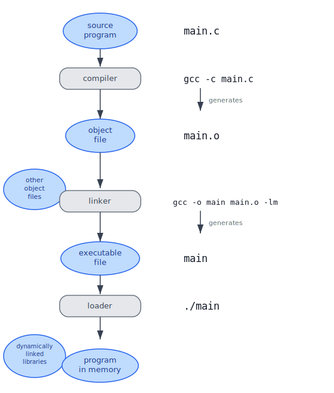
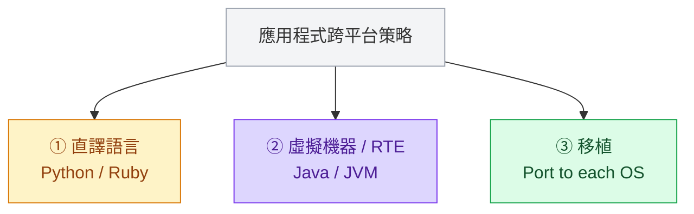

:::note
本系列文章內容參考自經典教材 **Operating System Concepts, 10th Edition (Silberschatz, Galvin, Gagne)**。本文對應章節：**Section 2.4 System Services、2.5 Linkers and Loaders、2.6 Why Applications Are Operating-System Specific**。
:::

<br/>

## **2.4 系統服務 (System Services)**

在 2.1 節，我們看到 OS 透過系統呼叫對外提供各種服務。但對於大多數使用者而言，他們從來不會直接呼叫 `open()`、`read()` 這類系統呼叫，他們使用的是更高一層的東西：**系統程式 (System Programs)**，又稱**系統工具 (System Utilities)**。

系統程式是隨 OS 一起提供的一組便利工具，為程式的開發與執行提供一個友善的環境。有些系統程式只是在系統呼叫上包了一層外殼（如 `cp`、`ls`），有些則複雜許多，需要大量的應用邏輯（如文字編輯器、編譯器）。從使用者的角度來看，**使用者對 OS 的印象，幾乎完全由這些系統程式決定**，而不是由底層的系統呼叫決定。

### **七大類系統程式**

系統程式可以按功能分成七大類：

**檔案管理 (File Management)**：建立、刪除、複製、重新命名、列印、列示、存取與管理檔案和目錄。UNIX 的 `cp`、`mv`、`rm`、`ls` 都屬於這一類。

**狀態資訊 (Status Information)**：向使用者回報系統狀態，包括日期、時間、可用記憶體與磁碟空間、使用者數量等。較複雜的工具提供詳細的效能分析、日誌記錄、除錯資訊。在多數系統中，這些工具的輸出會格式化後印到終端機、GUI 視窗或日誌檔中。部分系統還提供**登錄檔 (Registry)**，用於儲存和查詢系統的配置資訊（Windows 的 Registry 是最典型的例子）。

**檔案修改 (File Modification)**：可供建立與修改儲存裝置上檔案內容的文字編輯器（如 `vi`、`nano`、`Notepad`），以及搜尋檔案內容或執行文字轉換的特殊指令（如 `grep`、`sed`、`awk`）。

**程式語言支援 (Programming-Language Support)**：常見程式語言（C、C++、Java、Python）的**編譯器 (Compiler)**、**組譯器 (Assembler)**、**除錯器 (Debugger)** 和**直譯器 (Interpreter)**，通常隨 OS 一起提供，或可透過套件管理器另行下載。

**程式載入與執行 (Program Loading and Execution)**：程式被編譯或組譯後，必須被載入記憶體才能執行。OS 提供絕對載入器 (Absolute Loader)、可重定位載入器 (Relocatable Loader)、鏈結編輯器 (Linkage Editor) 等工具，以及針對高階語言或機器語言的除錯系統。本文 2.5 節將詳細介紹連結器與載入器的完整工作流程。

**通訊 (Communications)**：在行程、使用者和電腦系統之間建立**虛擬連線 (Virtual Connections)** 的工具。使用者可以透過這類工具傳送訊息到其他使用者的螢幕、瀏覽網頁、收發電子郵件、遠端登入其他機器，或在機器之間傳輸檔案。

**背景服務 (Background Services)**：許多系統程式在開機時就被啟動，在背景持續執行，直到系統關機。這類長期執行的系統程式稱為**服務 (Services)**、**子系統 (Subsystems)** 或**精靈 (Daemons)**。

:::info 什麼是 Daemon（精靈程式）？
Daemon 是在背景持續執行、等待請求的系統程式，使用者通常感知不到它們的存在。典型例子包括：

- **網路連線監聽精靈**：持續等待網路連線請求，將請求轉發給對應的行程（2.3.3.5 節提到的 network daemon）
- **排程精靈**：依照預定時間表啟動行程（如 Linux 的 `cron`）
- **系統錯誤監控服務**：監聽並記錄系統錯誤事件
- **列印伺服器**：管理列印佇列與印表機資源

一台典型系統同時執行數十個 Daemon。此外，某些 OS 會選擇在 User Mode（而非 Kernel Mode）執行一些重要活動，這時就需要 Daemon 來代為執行這些活動。
:::

### **應用程式 (Application Programs)**

除了系統程式，多數 OS 還附帶一批解決常見問題的**應用程式 (Application Programs)**：網頁瀏覽器、文字處理器、試算表、資料庫系統、編譯器、統計分析套件、遊戲等。

這些應用程式不屬於 OS 的一部分，但它們進一步豐富了使用者對「這個 OS」的整體印象。以 macOS 為例，使用者看到的不只是系統呼叫和核心，而是整個 Aqua GUI 環境、Finder、Safari 等一整套應用程式生態。

<br/>

## **2.5 連結器與載入器 (Linkers and Loaders)**

一支程式在執行之前，必須完成一條從**原始碼 (Source Code)** 到**記憶體中的執行實體**的完整轉換流程。這條流程由三個工具協力完成：**編譯器 (Compiler)**、**連結器 (Linker)**、**載入器 (Loader)**。

### **為什麼需要這條流程？**

原始碼以人類可讀的高階語言撰寫，但 CPU 只能執行機器指令。編譯解決了「如何將高階語言轉換成機器碼」的問題。但轉換後的產物（物件檔）還不能直接執行，因為它不知道自己最終會被放到記憶體的哪個位置，也不知道它依賴的函式庫在哪裡。連結器負責把這些分散的物件檔整合成一個完整的可執行檔，並解析彼此之間的符號引用。最後，載入器才真正把可執行檔搬進記憶體，讓 CPU 開始執行。

下圖展示了從原始碼到記憶體中的程式，整個流程的每個環節：



圖中左側是工件（Artifact）的流動路徑：原始碼 `main.c` 透過編譯器生成物件檔 `main.o`，物件檔與其他物件檔一起進入連結器，生成可執行檔 `main`，可執行檔再透過載入器（加上執行期才動態連結的函式庫）進入記憶體。右側是對應的實際指令。每個箭頭代表一次「generates」的動作，每個步驟都是不可跳過的前置條件。

### **三個步驟的詳細說明**

**步驟一：編譯 (Compile)**

編譯器（如 `gcc -c main.c`）將原始碼轉換成**可重定位物件檔 (Relocatable Object File)**，例如 `main.o`。「可重定位」的意思是：這個物件檔被設計成**可以載入到任意實體記憶體位址**，而不預先假設自己在記憶體中的確切位置。這個設計使得物件檔可以被靈活地重新排列組合。

**步驟二：連結 (Link)**

連結器（如 `gcc -o main main.o -lm`）接收一個或多個可重定位物件檔，以及所需的函式庫（如數學函式庫 `-lm`），將它們合併成一個**單一的二進位可執行檔 (Binary Executable File)**。

連結過程中最重要的操作是**重定位 (Relocation)**：連結器將最終的記憶體位址分配給程式的各個部分（函式、全域變數等），並修改程式碼與資料中所有的位址引用，使它們指向正確的最終位址。舉例來說，若 `main.o` 中呼叫了 `sqrt()` 函式，連結器必須找到 `sqrt()` 在數學函式庫中的確切位址，並把這個呼叫指向那個位址。

:::info 連結器分配的是「虛擬位址」，不是實體記憶體位址
這裡有一個關鍵細節：連結器分配的位址是**虛擬位址 (Virtual Address)**，而不是實體記憶體中的確切位置。

現代 OS 透過**虛擬記憶體 (Virtual Memory)** 機制，讓每個行程都擁有一塊獨立的「假想位址空間」，行程只看到虛擬位址。OS 在執行時期負責把這些虛擬位址對應 (Mapping) 到實際的實體記憶體位址，而這個對應關係每次執行都可以不同。

因此，同一個可執行檔（例如從 USB 複製給另一台相同 OS、相同 CPU 架構的電腦）是可以直接執行的，不需要重新編譯。兩台電腦的實體記憶體分配方式可以完全不同，但 OS 都會把同一組虛擬位址正確地對應到各自空閒的實體記憶體上。虛擬記憶體的完整機制會在第 9 章詳細討論。
:::


**步驟三：載入與執行 (Load and Run)**

在 UNIX/Linux 系統上，當使用者在命令列輸入 `./main` 時，Shell 的行為如下：

1. Shell 呼叫 `fork()` 建立一個新的子行程
2. 子行程呼叫 `exec()` 並傳入可執行檔名稱
3. 載入器 (Loader) 接手，將可執行檔載入新行程的位址空間
4. 程式開始執行

:::info 使用 GUI 時的等效流程
當使用者在 GUI 環境下雙擊一個程式圖示時，系統同樣會在背後呼叫載入器，機制與命令列的 `./main` 完全相同，只是觸發的方式不同。
:::

### **動態連結 (Dynamic Linking)**

上述流程假設所有函式庫在連結時就被整合進可執行檔，稱為**靜態連結 (Static Linking)**。但多數現代系統支援另一種策略：**動態連結 (Dynamic Linking)**，即把連結的動作推遲到程式**載入**或甚至**執行**的時候。

以 Figure 2.11 中的例子為例，數學函式庫並**沒有**被連結進可執行檔 `main`。連結器只在 `main` 中插入了**重定位資訊 (Relocation Information)**，告訴載入器「這個函式庫在執行時才需要動態連結和載入」。當 `main` 被載入並執行時，若真正用到了數學函式庫中的函式，載入器才去找到並載入這個函式庫。

動態連結帶來了幾個重要好處：

- **節省磁碟與記憶體空間**：若某個函式庫根本沒被用到，就完全不需要把它的程式碼包進來。若多個行程都需要同一個動態函式庫，記憶體中只需要一份副本，**所有行程可以共用**，大幅節省記憶體（詳見第 9 章）。
- **彈性更新**：函式庫升級後，所有依賴它的程式下次執行時自動使用新版本，無需重新編譯。

Windows 將這種動態函式庫稱為 **DLL（Dynamically Linked Libraries）**，副檔名為 `.dll`；Linux 則使用**共享物件 (Shared Object)**，副檔名為 `.so`；macOS 使用 `.dylib`。

### **可執行檔格式：ELF、PE、Mach-O**

物件檔和可執行檔都遵循特定的**標準格式**，這些格式規定了機器碼、符號表 (Symbol Table) 及各種中繼資料的排列方式，讓 OS 知道如何正確地載入和執行這個檔案。

| 格式       | 全名                           | 使用平台     | 常見副檔名                                   |
| ---------- | ------------------------------ | ------------ | -------------------------------------------- |
| **ELF**    | Executable and Linkable Format | UNIX / Linux | 無副檔名（可執行檔）、`.so`（共享函式庫）    |
| **PE**     | Portable Executable            | Windows      | `.exe`（可執行檔）、`.dll`（動態函式庫）     |
| **Mach-O** | Mach Object                    | macOS / iOS  | 無副檔名（可執行檔）、`.dylib`（動態函式庫） |

是的，Windows 上的 `.exe` 和 `.dll` 都是 PE 格式的檔案，只是用途不同：`.exe` 是可直接執行的程式，`.dll` 是給其他程式動態連結使用的函式庫。

以 ELF 為例，Linux 提供工具讓使用者查看 ELF 檔案的內容：

```bash
# 查看檔案類型
file main.o    # 回報：ELF relocatable file
file main      # 回報：ELF executable

# 詳細分析 ELF 結構
readelf main
```

ELF 格式中包含程式的**進入點 (Entry Point)**，即程式開始執行的第一條指令的位址。

:::info ELF 跨平台的限制
ELF 提供了跨 Linux 和 UNIX 系統的通用標準，但 ELF 格式本身並**不綁定到特定的 CPU 架構**。這意味著一個在 x86 上編譯的 ELF 可執行檔，無法直接在 ARM 處理器上執行，即使兩者都使用 ELF 格式。格式相同，並不代表可以互相執行。
:::

<br/>

## **2.6 為什麼應用程式是作業系統特定的 (Why Applications Are Operating-System Specific)**

如果在 Windows 上編譯一支 C 程式，試著把編譯好的可執行檔複製到 Linux 或 macOS 上執行，會得到一個錯誤。這個現象背後，反映了一個根本問題：**為什麼不同 OS 上的應用程式不能互相執行？**

答案在於三道根本差異：**不同的系統呼叫介面**、**不同的可執行檔格式**、**不同的 CPU 指令集**。每一道差異都足以讓程式無法在不同環境中執行。

### **三道根本差異**

**差異一：系統呼叫介面 (System Call Interface)**

如 2.3 節所介紹，每個 OS 提供一套獨特的系統呼叫，系統呼叫的名稱、編號、參數格式、呼叫方式、回傳結果都可能各不相同。一支直接呼叫 Linux 系統呼叫的程式，在 Windows 上根本找不到對應的入口點。

> **真實情境**：在 Linux 上用 C 寫一支使用 `fork()` 建立子行程的程式，在 Windows 上根本無法編譯，因為 Windows 沒有 `fork()` 這個系統呼叫，Windows 的行程建立機制是 `CreateProcess()`，語義和參數完全不同。這也是許多 UNIX 工具（如 `bash`、`make`）無法在原生 Windows 上運作的根本原因。

**差異二：可執行檔格式 (Binary Format)**

每個 OS 定義了自己的應用程式二進位格式（ELF、PE、Mach-O），規定了可執行檔的標頭 (Header)、指令區段、變數區段必須按照什麼順序和結構排列。OS 的載入器只認識特定格式的可執行檔，拿到格式不符的檔案就無法正確解析和載入。

> **真實情境**：在 Linux 上嘗試執行一個 Windows `.exe` 檔案，會收到 `Exec format error` 的錯誤，因為 Linux 的 ELF 載入器看到的是一個它完全看不懂的 PE 格式標頭，直接拒絕載入。反過來，把一個 Linux ELF 可執行檔拿到 Windows 上執行，Windows 同樣不認識，提示「不是有效的 Win32 應用程式」。

**差異三：CPU 指令集 (Instruction Set)**

不同 CPU 架構（x86、ARM、RISC-V 等）有各自的指令集。在 x86 上編譯的程式碼包含的是 x86 機器指令，在 ARM 處理器上無法執行，反之亦然。

> **真實情境**：2020 年 Apple 推出搭載 ARM 架構 M1 晶片的 Mac，原本為 x86 編譯的 macOS 應用程式無法在 M1 上直接執行。Apple 為此開發了 **Rosetta 2** 轉譯層，在執行時動態把 x86 指令轉譯成 ARM 指令，讓舊程式暫時可用，但效能有所下降，且並非所有程式都能正確轉譯。最終解法仍是讓開發者重新為 ARM 架構編譯原生版本。

### **三種跨平台策略**

為了讓同一支應用程式能在多個 OS 上執行，有三種主要策略：



**策略一：直譯語言 (Interpreted Language)**

以 Python 或 Ruby 撰寫的程式不需要被編譯成機器碼，而是由**直譯器 (Interpreter)** 逐行讀取、即時翻譯成當前平台的機器指令並執行。只要目標平台上有對應的直譯器，同一份原始碼就能在任何地方執行。

然而這個策略有兩個代價：其一，每次執行都需要額外的翻譯步驟，**效能比原生編譯的程式差**；其二，直譯器本身只支援各 OS 功能的**子集**，程式能使用的功能受到限制。

**策略二：虛擬機器 / 執行時期環境 (Virtual Machine / RTE)**

Java 是這種策略的代表。Java 原始碼被編譯成**位元組碼 (Byte Code)**，而不是特定 CPU 的機器碼。位元組碼由**執行時期環境 (Run-Time Environment, RTE)** 中的 **Java 虛擬機器 (JVM)** 執行。只要目標平台上有 JVM，Java 程式就能執行，實現「**寫一次，到處執行 (Write Once, Run Anywhere)**」的目標。

JVM 已被移植到從大型主機到智慧型手機的各種平台。這種策略的限制與策略一類似：效能不如原生程式，且只能使用 RTE 所暴露的功能子集。

**策略三：移植 (Porting)**

使用標準語言或 API（如 C 標準函式庫、**POSIX API**）撰寫程式。每次編譯只針對**一個目標平台**（一個 OS + 一個 CPU 架構），產出一個對應的二進位可執行檔。若要支援 3 種 OS × 2 種 CPU 架構，就需要執行 6 次編譯，產出 6 個不同的可執行檔，分別發布給對應平台的使用者。

這份移植工作（Porting）通常相當耗時，每當程式需要更新，必須針對每個目標平台重新進行編譯、測試和除錯。

:::info 「移植策略」的「跨平台」指的是原始碼層，不是二進位層

移植策略並**不**產出「一個可在所有平台執行的二進位檔」，關鍵在於**原始碼是否需要修改**。

沒有遵循標準的程式，在移植到另一個平台時，往往需要大量修改原始碼，例如把 Windows 專用的 `CreateProcess()` 改成 Linux 的 `fork() + exec()`，或者處理不同 OS 的路徑分隔符、換行字元等差異。這些工作稱為**移植 (Porting)**，費時費力。

遵循 **POSIX API** 的程式，保證了不同 UNIX-like 系統之間的**原始碼相容性 (Source-Code Compatibility)**：同一份原始碼在 Linux、macOS、BSD 上重新編譯後就能執行，不需要為各平台維護不同版本的程式碼。這正是「可攜性 (Portability)」的意義所在，即使每個平台都需要各自編譯一次。

簡言之：策略三的「跨平台」是**原始碼層**的可攜性，而非**二進位層**的可攜性。
:::


### **跨平台的剩餘挑戰**

即使採用上述策略，跨平台仍然面臨額外的挑戰。以函式庫的 API 為例：iOS 的圖形介面 API 和 Android 的完全不同，一支針對 iOS 設計的應用程式，無法直接在 Android 上編譯執行，反之亦然。

以瀏覽器 Firefox 為例，為了讓它能在 Windows、macOS、各種 Linux 發行版、iOS、Android 上正確執行，需要針對每個目標平台和 CPU 架構維護一套對應的程式碼和編譯流程。這正是跨平台開發的真實成本。

### **應用程式二進位介面 (ABI)**

在 API 定義了**應用程式層**的函式介面之上，還有一個更底層的概念：**應用程式二進位介面 (Application Binary Interface, ABI)**。

ABI 規定了二進位層面的細節：位址寬度、傳遞參數給系統呼叫的方式、執行時期堆疊的組織方式、系統函式庫的二進位格式、資料型別的大小等。如果 API 是「兩個軟體模組在**原始碼層**的握手協議」，那麼 ABI 就是「在**二進位機器碼層**的握手協議」。

ABI 通常針對特定 CPU 架構定義（例如 ARMv8 有一套 ABI）。一支按照特定 ABI 編譯連結的可執行檔，**理論上**可以在支援該 ABI 的不同系統上執行。但由於 ABI 必須同時綁定 OS 和 CPU 架構，它並不能提供跨平台的通用相容性。

:::info API、ABI、系統呼叫的層次關係
這三個概念從高到低的抽象層次如下：

| 層次   | 概念            | 說明                                                     |
| ------ | --------------- | -------------------------------------------------------- |
| 最高層 | **API**         | 原始碼層的函式介面（如 POSIX `read()`）                  |
| 中間層 | **System Call** | OS 提供的服務介面，透過 Trap 切換到 Kernel Mode          |
| 最低層 | **ABI**         | 二進位機器碼層的介面規範（參數傳遞方式、資料型別大小等） |

API 保證**原始碼可攜性**：同一份程式碼可以在不同 OS 上重新編譯。ABI 保證**二進位可攜性**：同一個可執行檔可以在不同系統上直接執行。但如前所述，ABI 的跨平台相容性有其限制，真正的跨平台仍需要結合多種策略。
:::
