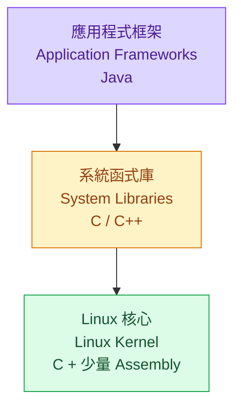

:::note
本系列文章內容參考自經典教材 **Operating System Concepts, 10th Edition (Silberschatz, Galvin, Gagne)**。本文對應章節：**Section 2.7 Operating-System Design and Implementation**。
:::

 

## **2.7.1 設計目標 (Design Goals)**

設計一個作業系統的第一個問題，是定義**目標與規格 (Goals and Specifications)**。這件事看起來理所當然，但實際上非常困難，因為沒有任何教科書或公式能告訴你「正確答案」是什麼。不同的硬體、不同的使用場景，對 OS 的要求可以截然不同。

### **為什麼沒有通用解？**

OS 的設計從一開始就受到兩個因素的高度約束：

1. **硬體選擇**：CPU 架構、記憶體大小、I/O 裝置的種類，直接決定了 OS 能做什麼、不能做什麼。
2. **系統類型**：一台傳統桌機、一台行動裝置、一台分散式伺服器叢集，或一個嵌入式即時控制系統，對 OS 的期待完全不同。

以兩個極端為例：**Wind River VxWorks** 是一個為嵌入式系統設計的即時 OS（Real-Time OS），它的首要目標是「在嚴格的時間限制內準確回應事件」；而 **Windows Server** 是為企業環境設計的大型多使用者 OS，首要目標是「支援大量使用者同時存取各種服務」。這兩個 OS 面對的問題截然不同，自然不可能有相同的設計。

### **使用者目標與系統目標**

跨越這些差異，需求可以分成兩個大群體：

**使用者目標 (User Goals)**：從使用系統的人的角度出發，OS 應該：

- **方便使用 (Convenient to use)**：介面直觀，不需要記住複雜指令
- **易於學習 (Easy to learn)**：上手門檻低
- **可靠 (Reliable)**：不輕易當機、資料不會無故消失
- **安全 (Safe)**：能防範惡意程式和未授權存取
- **快速 (Fast)**：回應時間短，不讓使用者等待

**系統目標 (System Goals)**：從設計、開發、維運 OS 的工程師的角度出發，OS 應該：

- **易於設計與實作 (Easy to design and implement)**：設計不應過度複雜
- **易於維護 (Easy to maintain)**：日後修改功能或修復錯誤不應牽一髮動全身
- **靈活 (Flexible)**：能在不大改底層的情況下支援不同的策略
- **可靠且無錯誤 (Reliable and error-free)**：核心功能正確，不出現難以預測的行為
- **高效 (Efficient)**：不浪費 CPU、記憶體、I/O 等資源

:::info 為什麼這些目標既重要又沒用？
仔細看這兩組目標，每一條都是正確的廢話。「要快、要可靠、要好用」，沒有人會反對這些。但當工程師真正坐下來設計 OS 的時候，這些目標對做具體決策幾乎沒有幫助，因為它們都太模糊了，而且往往相互衝突：要「快」可能需要取捨「可靠」；要「靈活」可能犧牲「效率」。

這就是 OS 設計的真正挑戰：在模糊的目標下，針對特定的硬體和使用場景，做出一系列有取捨的具體決策。沒有任何通用方案可以在所有維度上同時最佳化。
:::

 

## **2.7.2 機制與策略 (Mechanisms and Policies)**

OS 設計中有一條最重要的軟體工程原則：**機制與策略的分離 (Separation of Policy from Mechanism)**。

### **機制與策略分別是什麼？**

一個直觀的比喻是：假設公司設計了一套打卡系統。「打卡機的硬體電路如何記錄刷卡動作」是**機制**，「員工每天可以遲到幾分鐘」是**策略**。兩者是完全獨立的問題。

套回 OS 的語言：

- **機制 (Mechanism)**：決定**如何做某件事 (How)**。機制是底層的實作手段，定義系統能提供哪些能力。
- **策略 (Policy)**：決定**要做什麼 (What)**。策略是在機制之上，決定這些能力應該被如何使用。

教科書中的典型例子：**Timer（計時器）** 是一個機制，它提供了「在一段時間後觸發中斷、強制 CPU 回到 OS」的能力（參見 Section 1.4.3）。但「Timer 應該設定為多長時間」是策略，由 OS 根據當前的排程政策決定。Timer 這個機制本身，無論策略如何改變，都不需要被修改。

### **為什麼分離很重要？**

如果機制和策略緊密耦合在一起，那麼每當需要改變策略，就必須同時修改機制的程式碼。這會造成兩個問題：

1. **修改成本高**：改一個「要做什麼」的決策，卻需要動到底層的「如何做」的程式碼，容易引入錯誤。
2. **難以適應變化**：策略通常會隨著時間推移或不同環境而改變（例如，不同的伺服器工作負載需要不同的 CPU 排程策略），但機制應該是穩定的。

**正確的做法**是設計一個足夠通用、彈性夠強的機制，讓它能夠支援不同策略，然後把策略決策獨立出來，放在另一個容易替換的地方。當策略改變時，只需要修改策略層的參數，底層機制完全不需要變動。

以 CPU 排程的優先權為例：如果系統設計了一個「可以為不同類型的程式設定優先級」的機制，那麼：
- **策略 A**：I/O 密集型程式優先（適合互動式桌面系統，讓 UI 回應更流暢）
- **策略 B**：CPU 密集型程式優先（適合批次計算工作負載）

兩種策略可以直接切換，底層的優先權排程機制完全不需要改動。

### **實際系統的光譜**

不同 OS 在機制與策略分離的程度上，形成了一條光譜：

**Microkernel（微核心，詳見 Section 2.8.3）** 代表最極端的分離：核心只保留最基本的原語（Primitive），幾乎不包含任何策略。更高層的機制與策略完全由使用者空間的模組或程式自行定義。這種設計的彈性極高，但不同元件之間的通訊開銷也更大。

**Windows 和 macOS** 則代表另一個極端：Microsoft 和 Apple 將大量策略直接內建進核心與系統函式庫中，以此確保所有裝置、所有應用程式呈現統一的外觀與操作感受。所有應用程式的介面都長得相似，因為介面設計規範已被烙進核心層。這種做法犧牲了彈性，但提供了一致的使用者體驗。

**Linux** 作為開源 OS，採取中間路線：標準 Linux 核心有一套特定的 CPU 排程演算法，這個演算法是機制，它體現了某種排程策略。但因為開源，任何人都可以自由修改或替換排程器以支援不同的策略。

:::info 什麼情況下機制，什麼情況下策略？
當問題是「**How（如何做）**」時，需要考慮的是機制設計；當問題是「**What（要做什麼）**」時，需要考慮的是策略決定。每當系統需要分配資源時（CPU 時間、記憶體、I/O 頻寬），背後必然存在一個策略決定；而決定如何執行分配動作的那套手段，則是機制。
:::

 

## **2.7.3 實作 (Implementation)**

OS 的設計定案後，接下來就是實作。由於 OS 是由許多程式組成、歷經多年由許多人共同撰寫的龐大軟體，很難做出絕對的通則，但有一些重要的演進脈絡值得了解。

### **實作語言的演進：從組合語言到高階語言**

早期的 OS 幾乎全部用**組合語言 (Assembly Language)** 撰寫。每一行程式碼都直接對應到 CPU 的一條指令，工程師必須手動管理每個暫存器、每個記憶體位址。

現代 OS 的語言選擇更加分層：

| 層次               | 語言                    | 原因                       |
| ------------------ | ----------------------- | -------------------------- |
| 最底層的核心程式碼 | Assembly + C            | 直接操控硬體，需要精確控制 |
| 大部分核心功能     | C / C++                 | 高效能、可攜性好、生態成熟 |
| 系統函式庫         | C / C++，甚至更高階語言 | 抽象層次夠，開發效率高     |
| 應用程式框架       | Java、Swift、Kotlin 等  | 提供開發者友善的 API       |

Android 是一個典型案例，完整體現了這種分層：

- **Linux Kernel**：主要用 C 撰寫，極少量的 Assembly（用於最底層的硬體初始化與暫存器操作）
- **System Libraries**：用 C 或 C++ 撰寫（如 Bionic C Library）
- **Application Frameworks**：主要用 Java 撰寫，提供給 Android 應用開發者的標準 API

### **用高階語言實作 OS 的優勢**

轉向高階語言的理由是充分的：

- **開發速度更快**：高階語言允許工程師聚焦在邏輯，而不是暫存器和記憶體位址，同樣功能的程式碼行數更少。
- **更容易理解與除錯**：程式碼的語意更接近人類思維，維護和修 Bug 的成本更低。
- **編譯器優化自動提升效能**：當編譯器技術進步（如更好的內聯展開、迴圈展開、分支預測優化），整個 OS 只需要重新編譯就能受惠，不需要手動修改任何程式碼。
- **更容易移植到新硬體 (Portability)**：若 OS 是用高階語言撰寫的，移植到新的 CPU 架構時，只需要為新架構準備一個編譯器，然後重新編譯即可。相比之下，用 Assembly 撰寫的 OS 幾乎無法移植，必須為每一種 CPU 重寫。這對於需要同時支援 x86、ARM、RISC-V 等多種架構的 OS 而言極為重要。

### **高階語言的「缺點」為什麼不再是問題？**

理論上，用高階語言實作 OS 可能帶來兩個缺點：**速度較慢**、**記憶體占用更多**。但在現代系統上，這兩點都已不再是主要顧慮。

首先，現代編譯器的最佳化能力已相當強大。對於大型程式而言，現代編譯器進行的複雜分析和優化（如 SSA、向量化、內聯展開），所產生的機器碼品質往往超過人工手寫組合語言。現代 CPU 本身也有深度流水線（Deep Pipelining）和多功能執行單元，它們能夠處理的複雜依賴關係，遠超人腦手動排程的極限。

更根本的一點：**OS 的效能瓶頸幾乎從來不在語言本身，而在演算法與資料結構**。一個設計良好的排程演算法或記憶體分配策略，帶來的效能提升遠超過把程式碼改成手工 Assembly。

此外，OS 雖然龐大，但真正對效能至關重要的程式碼只佔一小部分：

- **中斷處理常式 (Interrupt Handlers)**
- **I/O 管理員 (I/O Manager)**
- **記憶體管理員 (Memory Manager)**
- **CPU 排程器 (CPU Scheduler)**

這些關鍵路徑可以在 OS 整體正確運作後，透過效能分析（Profiling）找出真正的瓶頸，再針對性地進行最佳化（甚至在必要時改寫為 Assembly）。這種「先讓系統正確，再針對性優化」的策略，比從一開始就用 Assembly 寫整個 OS 更加務實有效。

:::info 為什麼不從頭用 Assembly 寫？
關鍵洞察是：**只有少數程式碼是效能關鍵的**。若整個 OS 都用 Assembly 寫，開發和維護成本會高得難以承受，但絕大多數的 Assembly 最佳化根本不在效能瓶頸上，等於白費力氣。高階語言讓工程師把大量時間花在真正重要的地方：正確性、架構設計、演算法選擇。
:::
