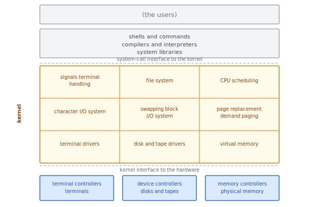
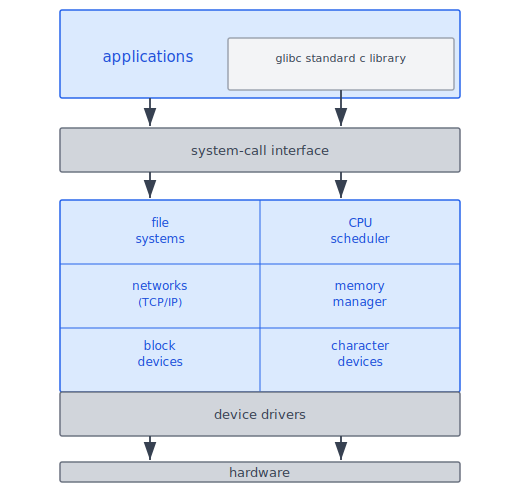
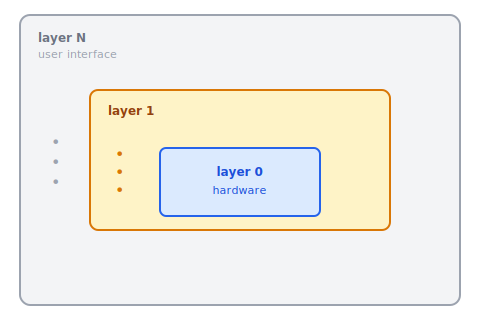
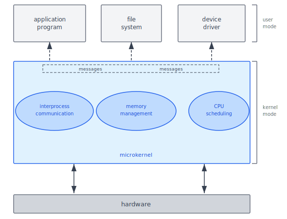
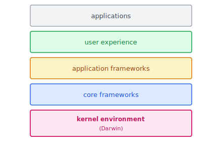
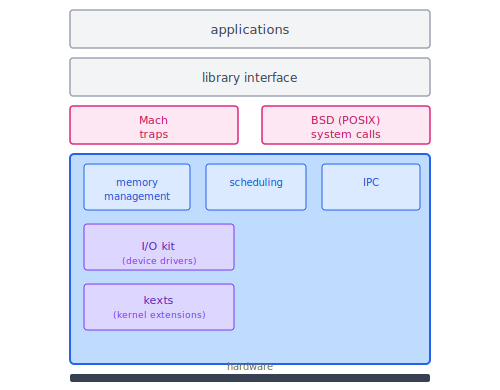
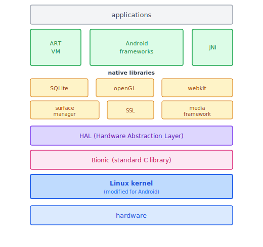
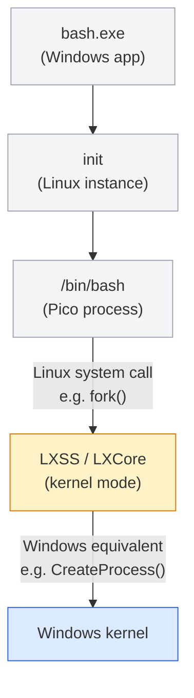

:::note
本系列文章內容參考自經典教材 **Operating System Concepts, 10th Edition (Silberschatz, Galvin, Gagne)**。本文對應章節：**Section 2.8 Operating-System Structure**。
:::

## **為什麼需要結構設計？**

現代 OS 規模龐大、功能複雜，若沒有良好的工程規劃，系統將難以維護和擴展。解決方案是將 OS 拆分為一組獨立的**元件（modules）**，每個元件負責明確定義的功能，並透過清晰的介面與其他元件溝通。

OS 開發者面對的核心設計問題是：這些元件應該如何組織？彼此之間應該有多緊密的依賴關係？不同的組織方式導致了五種主要的設計架構，各有優缺點的取捨。

<br/>

## **2.8.1 單體結構 (Monolithic Structure)**

最直觀的作法是「完全不做結構設計」：將整個核心功能打包成一個靜態二進位檔（static binary file），讓它在**單一位址空間（single address space）** 中執行。這種設計稱為**單體結構（Monolithic Structure）**，也是 OS 歷史上最早出現的架構。

### **傳統 UNIX 的結構**

早期 UNIX 是單體結構的代表：整個 OS 只有兩個可分離的部分，核心（kernel）和系統程式（system programs）。核心雖然隨著時間演進加入了一系列介面和裝置驅動程式，但整體來看，**系統呼叫介面以下、實體硬體以上，所有功能都擠在同一個核心位址空間中**。

下圖呈現傳統 UNIX 的系統結構：



圖中各區域的含義：

- **上方三層**（the users、shells/compilers/libraries）：屬於使用者空間，是核心之外的使用者程式與系統程式
- **system-call interface to the kernel**：使用者程式與核心之間的邊界，使用者透過系統呼叫請求核心服務
- **kernel（核心區）**：所有核心功能以 3×3 的格子呈現，包含信號處理、檔案系統、CPU 排程、I/O 管理、裝置驅動程式等，全部共存於同一位址空間
- **kernel interface to the hardware**：核心與實體硬體之間的邊界，核心透過這層介面與終端機控制器、裝置控制器、記憶體控制器等硬體溝通

這張圖最核心的洞察是：在 system-call interface 和 hardware interface 之間，是**龐大的功能集合**。雖然可以把它「看成」有一定層次，但所有東西實際上都在同一個位址空間裡，彼此高度依賴。

### **Linux 的結構**

Linux 以 UNIX 為基礎，採用相似的單體結構。應用程式透過 `glibc`（GNU C Library）與系統呼叫介面（system-call interface）通訊，核心本身完全在核心模式（kernel mode）下運行於單一位址空間中。

下圖呈現 Linux 的系統結構：



圖中可以看到，整個核心是一個緊密的整體，包含檔案系統、CPU 排程器、網路協定（TCP/IP）、記憶體管理器、以及各類裝置驅動程式，全部在同一個核心位址空間中直接呼叫。

### **單體結構的優缺點**

單體結構難以維護和擴展，但效能優勢卻相當顯著：

- **系統呼叫開銷極低**：核心內部的各子系統可以直接相互呼叫，不需要任何訊息傳遞或跨行程通訊的中間層
- **溝通速度快**：核心內部的函式呼叫與一般函式呼叫無異，不存在額外的 context switch 成本

這正是為什麼 UNIX、Linux、Windows 直到今天仍保留了大量單體結構的痕跡，效能考量壓過了架構上的不便。

<br/>

## **2.8.2 分層方法 (Layered Approach)**

單體結構的根本缺點是「**緊耦合（tightly coupled）**」：核心內部各子系統之間相互依賴，改動其中一個子系統可能引發意想不到的連鎖反應。

分層方法（Layered Approach）採取相反的設計哲學，建立一個**鬆耦合（loosely coupled）** 的系統：將 OS 分成若干獨立的層（layers），每一層只允許使用比它更底層的服務，形成嚴格的單向依賴。

下圖呈現分層作業系統的概念：



圖中各層的含義：

- **layer 0（最內層）**：直接面對硬體，提供最基本的硬體抽象
- **layer 1 至 layer N-1**：逐層往上，每層建立在下層提供的抽象之上
- **layer N（最外層）**：使用者介面，面向應用程式

分層設計最大的優勢是**除錯的便利性**：layer 0 除錯完成後，它的正確性即可被上層視為已知，layer 1 的除錯不需要再考慮 layer 0 的問題，依此類推。每個 bug 被隔離在單一層內，大幅降低除錯的複雜度。此外，每層只需要知道下層「提供什麼服務」，不需要知道「如何實作」。這種資訊隱藏讓各層的實作可以自由修改，只要對外介面不變，上層就不受影響。

:::caution 分層方法的兩個根本挑戰

**1. 層級定義困難**：如何決定每一層的邊界並不容易。在設計初期，難以準確預測哪些功能應該屬於同一層，一旦設計定案後調整代價很高。

**2. 效能開銷**：使用者程式每次呼叫系統服務都必須穿越多個層，每次跨層都帶來額外的函式呼叫開銷。層數越多，整體效能越低。

TCP/IP 和 Web 應用程式已成功採用分層設計。但在 OS 領域，純粹的分層架構並不多見。現代系統通常採用「減少層數、每層功能更豐富」的折衷方案，保留模組化設計的優點，同時減少效能損耗。
:::

<br/>

## **2.8.3 微核心 (Microkernels)**

1980 年代，UNIX 隨著功能擴展，核心變得越來越龐大，難以管理。1980 年代中期，卡內基梅隆大學（Carnegie Mellon University）的研究人員在開發名為 **Mach** 的 OS 時，提出了一種新的核心設計哲學：既然核心太大是問題，那就把核心縮到最小。

**微核心（Microkernel）** 的核心思想是：**把所有不必要的元件從核心中移除，改以使用者層級的程式來實作**。核心只保留真正不可或缺的最小服務。

### **微核心只保留什麼？**

移除「非必要元件」之後，核心通常只剩下三類服務：

1. **基本記憶體管理（Memory Management）**：管理行程的位址空間
2. **基本 CPU 排程（CPU Scheduling）**：決定哪個行程獲得 CPU 時間
3. **行程間通訊（Interprocess Communication, IPC）**：讓使用者空間的各服務能夠互相溝通

原本在核心中的檔案系統伺服器、裝置驅動程式、網路協定等，全部被移到使用者空間（user space），以獨立的行程方式運作。

下圖呈現典型微核心的架構：



圖中各區域的含義：

- **user mode 上方的三個方塊**：application program、file system、device driver，它們全部以使用者模式的行程運行，彼此之間不直接通訊
- **虛線箭頭（IPC）**：使用者層服務之間的所有通訊，都必須透過微核心提供的 IPC 機制傳遞訊息（message passing）
- **microkernel（核心模式）**：只保留記憶體管理、CPU 排程、基本 IPC 這三類最基本的服務

### **通訊機制：訊息傳遞 (Message Passing)**

微核心架構下，服務之間的通訊方式與單體結構有根本的不同。若客戶端程式需要存取一個檔案，不能直接呼叫檔案系統的函式，而是必須透過微核心的 IPC 機制傳送請求訊息給檔案系統伺服器，再等待回覆訊息：

```
client program  →  [message via microkernel]  →  file server
file server     →  [reply via microkernel]    →  client program
```

這個「完全透過訊息傳遞」的設計，是微核心架構的核心特徵，也是它的主要效能瓶頸所在。

### **微核心的優點**

微核心設計帶來四個重要優勢：

1. **易於擴展（Extensibility）**：新增服務只需在使用者空間增加一個新的服務行程，不需要修改也不需要重新編譯核心
2. **易於移植（Portability）**：核心體積小，移植到新硬體平台所需修改的程式碼量遠少於單體結構
3. **安全性（Security）**：大多數服務以使用者層級執行，即使某個服務行程崩潰，也不會波及其他服務或核心本身
4. **可靠性（Reliability）**：單一服務失敗不影響整體系統，故障範圍被隔離

### **微核心的缺點：IPC 開銷**

微核心設計的主要缺點是效能開銷。當兩個使用者層服務需要互相通訊時，每次都必須：
1. 將訊息從發送方的位址空間複製到核心緩衝區
2. 核心將訊息轉發給接收方
3. 將訊息從核心緩衝區複製到接收方的位址空間
4. 可能還需要 context switch（行程切換）

這個「複製兩次加 context switch」的代價，在通訊頻繁的系統中累積起來非常可觀，是微核心系統難以普及的根本原因。

:::note Windows NT 的教訓

Windows NT 最初採用分層微核心架構。第一版發布後，效能明顯低於同時期的 Windows 95。為了解決這個問題，Windows NT 4.0 開始將部分層次從使用者空間移回核心空間，並更緊密地整合；到了 Windows XP 時代，架構已經比微核心更接近單體結構。這個演進過程說明了一個現實：純粹的微核心在效能敏感的場景下，IPC 開銷往往是難以接受的。
:::

### **微核心的實例**

- **Darwin（macOS/iOS）**：Apple 的底層核心環境，由 Mach 微核心加上 BSD UNIX 核心組成，是一個以微核心為基礎的混合系統，詳見 2.8.5.1 節
- **QNX Neutrino**：嵌入式即時系統（real-time OS for embedded systems）的代表。核心只負責訊息傳遞、行程排程、低階硬體中斷處理；所有其他服務（包含網路、檔案系統）都以使用者模式行程運行

<br/>

## **2.8.4 可載入核心模組 (Loadable Kernel Modules, LKMs)**

目前被廣泛認可為最佳的 OS 設計方法，是使用**可載入核心模組（Loadable Kernel Modules, LKMs）**。這是單體結構效能優勢與微核心擴展性之間的折衷方案。

### **設計理念：動態載入服務**

LKMs 的核心思想是：**核心保留一組固定的核心元件，額外的服務透過模組（modules）動態載入**，可以在開機時載入，也可以在系統執行中隨時插入（insert）或移除（remove）。這避免了每次新增或修改功能都需要重新編譯整個核心的問題。

以 Linux 為例：CPU 排程演算法和記憶體管理直接內建在核心中，但各種檔案系統的支援（如 ext4、NTFS、FAT32）和硬體裝置驅動程式，則以 LKMs 的形式動態載入。當插入 USB 裝置時，若系統核心沒有該裝置的驅動程式，可以動態載入對應的 LKM；不需要時也可以動態移除。

### **LKMs 與其他架構的比較**

LKMs 的設計結合了分層方法與微核心方法的特點，但解決了各自的根本問題：

|   特性   |     分層方法     |        微核心        |               LKMs               |
| :------: | :--------------: | :------------------: | :------------------------------: |
| 介面定義 | 嚴格的層與層之間 |   模組間有定義介面   |         模組間有定義介面         |
| 呼叫彈性 |   只能呼叫下層   | 需透過 IPC 訊息傳遞  |  **任何模組可直接呼叫任何模組**  |
| 通訊效率 |  跨層呼叫有開銷  |    IPC 複製開銷大    |   **直接函式呼叫，無複製開銷**   |
| 動態擴展 |        否        | 是（使用者空間服務） | **是（核心空間，runtime 載入）** |

LKMs 就像分層方法一樣，讓各模組有清晰的介面；但比分層方法更靈活，任何模組可以呼叫任何其他模組。LKMs 也像微核心一樣，主要核心只保留核心功能，其餘功能動態載入；但比微核心更高效，因為模組在核心空間直接呼叫，不需要 IPC 訊息傳遞。

<br/>

## **2.8.5 混合式系統 (Hybrid Systems)**

在現實中，幾乎沒有 OS 只採用單一的結構設計。真實的 OS 通常結合多種架構，形成**混合式系統（Hybrid Systems）**，以便在效能、安全性和可維護性之間取得最佳平衡。

### **macOS 與 iOS**

Apple 的 macOS（桌機/筆電）和 iOS（iPhone/iPad）在架構上高度相似，共用相同的底層核心環境。下圖呈現兩者的整體層次架構：



圖中各層由上而下的含義：

- **applications**：使用者的應用程式，可依需要直接存取以下任一層
- **user experience**：macOS 使用 Aqua 介面（針對滑鼠/觸控板），iOS 使用 Springboard 介面（針對觸控螢幕）
- **application frameworks**：Cocoa（macOS 用）和 Cocoa Touch（iOS 用），提供 Objective-C 與 Swift 的 API
- **core frameworks**：支援圖形與多媒體，包含 QuickTime、OpenGL 等
- **kernel environment (Darwin)**：底層核心環境，包含 Mach 微核心與 BSD UNIX 核心

值得注意的是，應用程式並不一定只能從最頂層往下使用：一個以 C 撰寫、沒有使用者介面的程式，可以直接繞過上方所有層，透過 POSIX 系統呼叫與核心溝通。

macOS 與 iOS 雖共用相同的核心環境，但有幾個關鍵差異：

- **CPU 架構**：macOS 編譯為 Intel x86-64，iOS 編譯為 ARM（針對行動裝置的功耗與效能特性進行了特別調整）
- **安全限制**：iOS 有比 macOS 更嚴格的安全策略；iOS 限制對 POSIX 和 BSD API 的直接存取，而 macOS 則完全開放
- **開發者自由度**：iOS 比 macOS 對開發者更為封閉，對系統功能的存取限制更多

### **Darwin：以效能解決微核心瓶頸的混合方案**

Darwin 是 macOS/iOS 的核心環境，採用**混合式結構**：以 Mach 微核心為基礎，但針對微核心的效能問題做出了關鍵設計決策。

下圖呈現 Darwin 的詳細結構：



圖中各區域的含義：

- **applications（上方）**：使用者應用程式
- **library interface**：豐富的函式庫層，包含標準 C 函式庫、網路函式庫、安全函式庫等
- **Mach traps** 和 **BSD (POSIX) system calls**：Darwin 提供兩套系統呼叫介面，分別對應 Mach 和 BSD
- **Mach kernel（核心區）**：
  - **memory management、scheduling、IPC**：Mach 微核心提供的三類基本服務
  - **I/O kit**：開發裝置驅動程式的框架
  - **kexts**（kernel extensions）：Darwin 的可載入核心模組，對應 Linux 的 LKMs

Darwin 解決微核心效能問題的方法是：**將 Mach、BSD、I/O Kit、以及所有 kernel extensions 全部放進同一個位址空間中執行**。雖然 Mach 的 IPC 訊息傳遞機制仍然存在，但在同一個位址空間內傳遞訊息不需要複製資料，因為所有服務都可以直接存取共享的記憶體。這保留了微核心架構的邏輯清晰度，同時消除了最大的效能瓶頸。

:::info Darwin 兩套系統呼叫介面

大多數 OS（如 UNIX/Linux）只提供一套系統呼叫介面（透過標準 C 函式庫）。Darwin 特別之處在於提供兩套：

- **Mach traps**：Mach 定義的系統呼叫，用於存取 Mach 的核心抽象，包含 tasks（Mach 的行程概念）、threads（執行緒）、memory objects（記憶體物件）、ports（通訊埠，用於 IPC）
- **BSD system calls**：提供 POSIX 相容介面，讓符合 POSIX 標準的程式可以直接在 Darwin 上執行

<br/>

以 `fork()` 為例：使用者呼叫 BSD 的 `fork()`，BSD 層會在內部建立對應的 Mach **task** kernel abstraction 來代表這個新行程，讓 Mach 負責底層的行程管理。
:::

### **Android**

Android 由 Open Handset Alliance（主要由 Google 主導）設計，以 Linux kernel 為底層基礎，並在上方疊加了一套完整的行動裝置軟體堆疊（software stack）。下圖呈現 Android 的架構：



圖中各層由上而下的含義：

- **applications**：使用者應用程式，以 Java 開發（使用 Android API，而非標準 Java API）
- **ART VM**（Android RunTime）：Android 的虛擬機器，負責執行 `.dex` 格式的位元組碼
- **Android frameworks**：提供 Java 開發者使用的 API，包含 UI、相機、感測器等各種功能
- **JNI**（Java Native Interface）：讓 Java 程式能繞過虛擬機器，直接呼叫用 C/C++ 撰寫的原生函式庫（native libraries）
- **native libraries**：用 C/C++ 撰寫的底層函式庫，包含 SQLite（嵌入式資料庫）、openGL（3D 圖形渲染）、webkit（瀏覽器引擎）、surface manager（螢幕顯示管理）、SSL（網路加密）、media framework（音訊與視訊處理）
- **HAL**（Hardware Abstraction Layer，硬體抽象層）：為不同廠商的硬體提供統一的軟體介面，使應用程式不需要為每款裝置個別撰寫程式碼，保障了 Android 的跨裝置可攜性
- **Bionic**：Google 為 Android 開發的專屬標準 C 函式庫，比 Linux 常用的 `glibc` 更輕量，針對低階行動 CPU 效能優化，同時避免了 glibc 的 GPL 授權問題
- **Linux kernel**（Android 修改版）：提供核心功能，包含行程管理、記憶體管理、裝置驅動程式；Google 針對行動裝置額外加入了電源管理機制，並新增了一種 IPC 機制稱為 **Binder**（後續章節會詳細介紹）
- **hardware**：實體裝置硬體

:::info Android ART 的預先編譯（AOT）策略

傳統 Java 虛擬機器通常採用**即時編譯（Just-In-Time, JIT）**：位元組碼在執行時才即時編譯成機器碼，啟動較快但執行效率偏低。

Android 的 ART 改採**預先編譯（Ahead-Of-Time, AOT）**：`.dex` 格式的位元組碼在**安裝時**就被編譯成裝置原生機器碼。好處是：

- 應用程式執行時不再需要編譯步驟，執行效能更好
- 降低執行期的 CPU 負擔，有助於延長電池壽命

代價是安裝時間略長，且裝置儲存空間中需要多保留一份編譯後的機器碼。這個取捨在行動裝置上是值得的，因為應用程式被安裝一次但執行很多次。
:::

:::note Windows Subsystem for Linux (WSL)

Windows 10 新增了 **WSL（Windows Subsystem for Linux）**，允許原生 Linux 應用程式（ELF 二進位格式）直接在 Windows 10 上執行，無需完整虛擬機器。

WSL 的核心機制是 **Pico process**：一種特殊的 Windows 行程，可以將 Linux 二進位檔載入自己的位址空間執行。當 Linux 應用程式發出系統呼叫時，由 **LXSS/LXCore** 服務負責翻譯並轉發給 Windows 核心：



<br/>

翻譯規則分三種情況：

1. **一對一對應**：LXSS 直接將 Linux 系統呼叫轉發至對應的 Windows 系統呼叫
2. **類似但不完全相同**：LXSS 自行實作部分功能，再呼叫 Windows 系統呼叫完成其餘部分（例如 `fork()` → `CreateProcess()`）
3. **無對應**：LXSS 自行提供完整的等效功能
:::

<br/>

## **五種結構方法的比較**

五種 OS 設計方法的核心取捨整理如下：

| 設計方法 |           架構特徵           |      效能      |    可維護性    |       代表系統        |
| :------: | :--------------------------: | :------------: | :------------: | :-------------------: |
| 單體結構 |      全部在單一位址空間      |      最高      |      最低      |       傳統 UNIX       |
| 分層方法 |       嚴格的上下層呼叫       | 低（多層跨越） | 高（層內獨立） |      TCP/IP 協定      |
|  微核心  | 核心最小化，服務在使用者空間 | 低（IPC 開銷） |  高（易擴展）  |       QNX, Mach       |
|   LKMs   |      核心加動態載入模組      | 高（直接呼叫） |  高（模組化）  | Linux, macOS, Windows |
|  混合式  |         結合多種方法         |   視實作而定   |   視實作而定   | macOS Darwin, Android |

從這個比較可以看出一個現實：在效能要求最高的系統中，「純粹的分層」或「純粹的微核心」都難以在實際產品中存活。真實世界的 OS 幾乎全部採用混合式設計，在不同的層面分別引入單體結構的效能優勢、LKMs 的擴展彈性、以及微核心的安全隔離特性。
