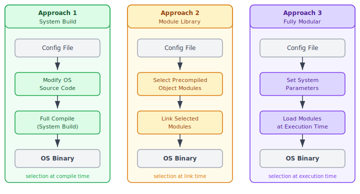
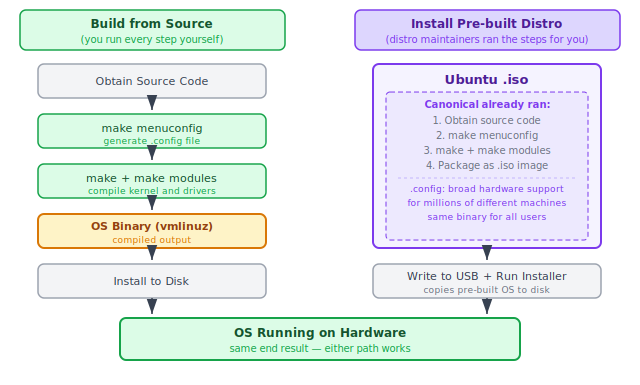
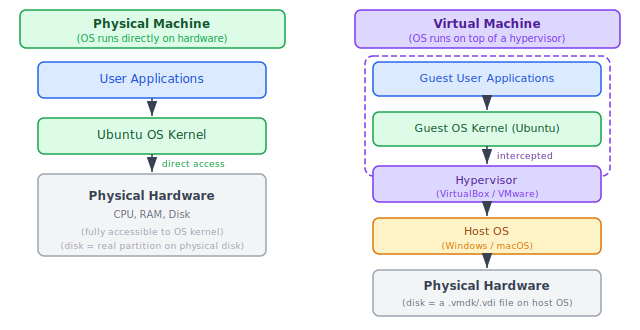
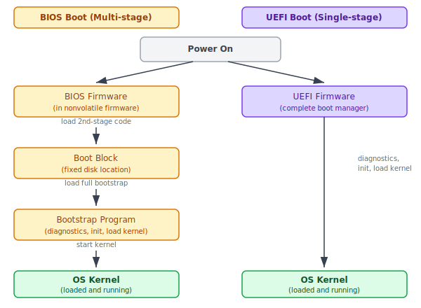
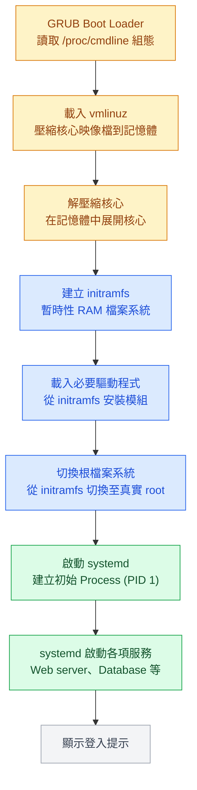

:::note
本系列文章內容參考自經典教材 **Operating System Concepts, 10th Edition (Silberschatz, Galvin, Gagne)**。本文對應章節：**Section 2.9 Building and Booting an Operating System**。
:::

一個 OS 在能夠實際使用之前，必須先經歷兩個截然不同的過程：首先是**生成（Generation）**，決定 OS 的哪些功能要被編譯進最終的二進位檔案；其次是**開機（Boot）**，讓剛生成或已存在的 OS 核心被正確地載入記憶體並開始執行。這兩個問題乍看像是瑣事，但它們背後各自藏著影響深遠的設計取捨。

<br/>

## **2.9.1 作業系統的生成 (OS Generation)**

大多數消費者買到電腦時，OS 已經預先安裝好了。但如果要更換 OS、新增另一個 OS，或者買到的是沒有 OS 的裸機，就必須自行將 OS 放上去並配置好。

如果要從頭建置一個 OS，必須依序完成以下五個步驟：

1. **撰寫或取得 OS 原始碼**（Write/obtain the operating system source code）
2. **為目標硬體配置 OS**（Configure the OS for the system on which it will run）
3. **編譯 OS**（Compile the operating system）
4. **安裝 OS**（Install the operating system）
5. **開機並執行新 OS**（Boot the computer and its new operating system）

其中，**配置（Configuration）** 是最關鍵的步驟。配置的工作是指定 OS 應該包含哪些功能，通常以一個**組態檔（Configuration File）** 的形式記錄，描述目標系統的硬體規格與所需功能。這份組態檔一旦建立，後續生成 OS 時有三種不同的做法。

### **三種 OS 生成方式**

下圖呈現了三種 OS 生成方式的流程對比，核心差異在於「功能選擇」發生在哪個時間點：



三欄各自的含義：

- **Approach 1（System Build，系統建置）**：系統管理員拿到組態檔後，直接修改 OS 的原始碼，然後對整個 OS 進行完整的重新編譯（稱為 **System Build**）。編譯過程中，資料宣告、初始化值與各種常數都根據組態內容調整，最終產出一個完全依照目標硬體量身打造的 OS 二進位檔。**選擇發生在編譯時（compile time）**，生成的系統高度客製化，但每次硬體配置改變就要重新編譯整個 OS，耗時且繁瑣。

- **Approach 2（Module Library，模組庫連結）**：不重新編譯原始碼，而是從一個預先編譯好的**目標物件模組庫（Precompiled Object Module Library）** 中，根據組態檔選出需要的模組，再將這些模組連結（Link）在一起，組成最終的 OS。這個做法的優點是生成速度快，缺點是生成的系統較為通用，不如 Approach 1 那麼精確貼合硬體。**選擇發生在連結時（link time）**。

- **Approach 3（Fully Modular，完全模組化）**：不在建置期間做任何選擇，而是在執行期間動態決定要載入哪些模組。**選擇發生在執行時（execution time）**，靈活性最高，但每次執行時都需要額外的解析與載入開銷。

| 方式 | 選擇時間點 | 優點 | 缺點 |
| :---: | :---: | :--- | :--- |
| System Build | 編譯時 | 高度客製化，效能最佳 | 每次改變硬體配置都需重新編譯 |
| Module Library | 連結時 | 生成速度快 | 較不貼合硬體，可能過於通用 |
| Fully Modular | 執行時 | 彈性最高，易於動態調整 | 執行時有額外載入開銷 |

:::info 現代 OS 用哪種方式？
嵌入式系統通常採用 Approach 1：針對固定不變的硬體規格，一次完整編譯出精確客製的 OS 二進位檔，確保最小體積與最高效能。現代桌機、筆電、行動裝置的 OS，則普遍採用 Approach 2 與 Approach 3 的混合：OS 仍然為特定硬體配置而建置，但透過**可載入核心模組（Loadable Kernel Module, LKM）** 技術，在執行時動態新增或移除驅動程式與功能，兼顧了建置時的針對性與運行時的靈活性。
:::

### **從零建置 Linux 系統**

以 Linux 為例，從零建置一個 Linux 系統通常需要依序執行以下步驟：

1. **下載 Linux 原始碼**：從 `http://www.kernel.org` 取得核心原始碼。

2. **配置核心**：執行 `make menuconfig` 指令。這個步驟會呼叫一個互動式選單介面，讓使用者勾選需要的核心功能，完成後產生一個名為 `.config` 的組態檔，記錄所有選項。

3. **編譯主核心**：執行 `make` 指令。編譯器根據 `.config` 檔的內容決定哪些程式碼要被包含進去，最終產出 `vmlinuz`，即核心映像檔（kernel image）。

4. **編譯核心模組**：執行 `make modules` 指令。模組的編譯同樣依賴 `.config` 組態，將各種可選功能（如特定的網路驅動程式或檔案系統支援）編譯為獨立的 `.ko`（Kernel Object）檔案。

5. **安裝核心模組**：執行 `make modules_install` 指令，將編譯好的模組安裝進 `vmlinuz`。

6. **安裝新核心**：執行 `make install` 指令，將新核心部署到系統中。下次重新開機時，系統就會載入這個新的 OS。

### **「從零建置」vs「安裝發行版」：兩件完全不同的事**

剛剛的六個步驟，和大多數人實際安裝 Ubuntu 的經驗完全對不上，因為這兩件事根本就是不同層次的操作。

實際安裝 Ubuntu 的流程是：下載 Ubuntu 的 `.iso` 映像檔、燒錄到隨身碟、重新開機進入 BIOS/UEFI 選擇 USB 開機、讓安裝程式引導完成磁碟格式化與系統部署，整個過程從頭到尾沒有敲過任何 `make` 指令。這不是因為跳過了什麼步驟，而是因為 Canonical（Ubuntu 的母公司）的工程師早就幫所有使用者把這些步驟跑完了，打包成那個 `.iso` 檔案。

下圖呈現了這兩條路徑的本質差異：



圖中有兩個重點：

- **左側（Build from Source）**：每個步驟都由使用者親手執行，`make menuconfig` 決定要包含哪些功能，`make` 將原始碼編譯為 OS Binary，最後才安裝到磁碟。這條路徑的輸出物是一個根據使用者的硬體與需求量身打造的核心。

- **右側（Install Pre-built Distro）**：`.iso` 映像檔本身已經是 Canonical 執行完左側步驟 1–4 的輸出物。使用者做的只是把這份「成品」寫入隨身碟、執行安裝程式將其複製到磁碟。Canonical 在執行 `make menuconfig` 時，為了讓同一份映像檔能在全世界各種廠牌的電腦上開機，``.config`` 裡勾選了市面上絕大多數的網卡、顯卡、儲存裝置驅動程式。這就是為什麼 Ubuntu 的核心比自行編譯的核心大得多，裡面有大量「這台電腦根本用不到」的驅動程式。

兩條路徑在最終結果上是相同的，OS 都能在硬體上執行。差別在於中間的工作是「自己做」還是「用別人做好的」。

:::info 什麼情況才需要自行從原始碼建置核心？

對絕大多數人來說，安裝預先建置的發行版就夠了。真正需要親自走左側路徑的情境包括：

- **嵌入式系統開發**：替智慧型烤箱、工業控制器等硬體資源極度有限的裝置設計 OS，必須把不需要的功能完全剔除，編譯出體積最小的專屬核心。
- **極致效能調校**：例如為高頻交易伺服器客製化核心，剔除所有不需要的驅動程式和功能，減少核心大小與中斷延遲。
- **原始碼發行版（Source-based Distro）**：Gentoo Linux、LFS（Linux From Scratch）等發行版的設計理念就是讓使用者在自己的機器上從頭編譯整個系統。
- **OS 研究與開發**：修改核心原始碼、實作新的排程演算法或研究核心行為時，必須自行建置修改過的核心。

:::

### **透過虛擬機器安裝 Linux**

除了安裝在實體機器上，也可以透過安裝 Linux 虛擬機器（Virtual Machine）的方式，讓 Windows 或 macOS 等**主機 OS（Host OS）** 在其上執行 Linux。要理解兩者的差異，需要先看清楚它們的底層架構。

下圖對比了實體機器（左）與虛擬機器（右）的系統層次：



兩種架構的關鍵差異在於 OS 核心與硬體之間隔了什麼：

- **實體機器（左）**：Ubuntu 核心直接存取 CPU、RAM 和磁碟，沒有中間層。Ubuntu 看到的「磁碟」就是實體磁碟分割，看到的「CPU」就是真實的處理器。
- **虛擬機器（右）**：Ubuntu 核心以為自己在管理一台完整的電腦，但它存取的所有「硬體」其實都是**超管程式（Hypervisor，如 VirtualBox、VMware）** 模擬出來的。Guest OS 的每一次磁碟讀寫請求，都會被 Hypervisor 攔截，轉換成對 Host OS 上一個**虛擬磁碟檔案**（如 `.vmdk` 或 `.vdi`）的存取操作。
- **虛擬磁碟是檔案，不是磁碟分割**：這是理解 VM 安裝與實體機器安裝最大差異的關鍵。在 VM 裡「格式化磁碟、安裝 Ubuntu」，實際上是在 Host OS 的檔案系統上建立或修改一個巨大的虛擬磁碟檔案，Host OS 的真實磁碟完全不受影響。

安裝 Linux 虛擬機器有兩種具體做法：

- **下載 ISO 安裝**：下載 Linux ISO 映像檔、在虛擬化軟體（如 VirtualBox 或 VMware）中建立一台虛擬機器，並指定以該 ISO 作為開機媒介。Guest OS 的安裝過程與實體機器幾乎完全相同，因為 Guest OS 根本不知道自己在 VM 中，它的整個安裝流程照常進行，只是最終寫入的是虛擬磁碟檔案。
- **使用虛擬機器設備檔（VM Appliance）**：下載一個已經安裝好並完整配置的 OS 設備檔，直接匯入虛擬化軟體便可使用，省去所有安裝步驟。

:::tip VM 安裝的最大優勢
VM 最大的實用優勢是**零風險**：不需要格式化實體磁碟，不需要修改電腦的開機設定，不會影響現有 Host OS 的任何資料。可以隨時建立快照（Snapshot）儲存目前狀態，也可以一鍵刪除整個 VM。這讓 VM 成為學習 OS、測試指令和做系統實驗的最安全沙盒。
:::

<br/>

## **2.9.2 系統開機 (System Boot)**

OS 生成完成後，面臨一個根本問題：電腦剛按下電源時，RAM 完全是空的，CPU 無從知曉核心在哪裡、要如何把它載入記憶體。**如何讓硬體在什麼都不知道的情況下，找到並啟動 OS 核心？** 這就是開機（Boot）機制要解決的問題。

開機（Booting）的定義是：透過載入核心（Kernel）來啟動電腦的過程。在大多數系統上，開機流程可以概括為四個步驟：

1. **定位核心**：一段稱為**開機程式（Bootstrap Program）** 或**開機載入器（Boot Loader）** 的小程式，負責找到核心的位置。
2. **載入核心**：將核心映像檔載入記憶體，並啟動執行。
3. **初始化硬體**：核心對系統中的所有硬體元件進行初始化。
4. **掛載根檔案系統**：核心掛載根檔案系統（Root Filesystem），系統才算真正就緒。

### **BIOS 與 UEFI：兩種開機路徑**

要理解現代開機流程，必須先了解 BIOS 與 UEFI 這兩種韌體（Firmware）。下圖呈現了兩條路徑的結構差異：



左側（BIOS）和右側（UEFI）的對比，揭示了兩代韌體在架構上的根本差異。

**BIOS 的多階段開機（Multi-stage Boot）** 是一種因為硬體限制而形成的層層接力設計：

1. 電腦啟動後，CPU 首先執行存放在**非揮發性韌體（Nonvolatile Firmware）** 中的一小段 BIOS 程式碼。這段程式碼非常小，只能做一件事：找到並載入下一階段的程式。
2. BIOS 找到磁碟上一個**固定位置（Fixed Disk Location）** 的**開機區塊（Boot Block）**，將其載入記憶體並執行。
3. 儲存在 Boot Block 中的程式，可能只是一段知道「完整開機程式在磁碟的哪個位置、有多長」的極簡程式碼（因為 Boot Block 容量極有限，通常只有一個磁碟區塊大小）。它繼續載入完整的**引導程式（Bootstrap Program）**。
4. 完整的 Bootstrap Program 接管後，執行機器診斷（Diagnostics）、初始化所有系統元件（CPU 暫存器、裝置控制器、主記憶體內容），然後才真正載入並啟動 OS 核心。

**UEFI（Unified Extensible Firmware Interface）** 是一種更現代的設計，直接將完整的開機管理員（Boot Manager）內建在韌體中。它不需要 Boot Block 的中間跳轉，從韌體直接完成診斷、初始化、核心載入的全部工作，路徑更短，開機速度更快。此外，UEFI 對 64 位元系統和超過 2 TB 的大容量磁碟提供更完善的原生支援，而這些是傳統 BIOS 的重大限制。

### **Bootstrap Program 的完整任務**

無論是 BIOS 路徑還是 UEFI 路徑，最終都需要一個 Bootstrap Program 來完成最後的準備工作。它的任務不只是「找到核心」，而是負責整個系統的就緒流程：

- **執行診斷**：檢查記憶體狀態、CPU 功能、偵測所有裝置，確認系統硬體狀態正常。
- **初始化所有元件**：設定 CPU 暫存器、初始化裝置控制器、清空或設置主記憶體的初始內容。
- **載入核心**：找到核心映像檔並將其載入記憶體。
- **掛載根檔案系統**：讓核心能夠存取磁碟上的檔案系統。

只有在所有這些步驟完成後，系統才被認為真正進入「執行中（Running）」的狀態。

### **GRUB：Linux/UNIX 的開機載入器**

**GRUB（GRand Unified Bootloader）** 是 Linux 和 UNIX 系統上廣泛使用的開源 Bootstrap Program。GRUB 的設計目標是靈活性：它讀取一份組態檔，允許在開機時動態修改核心參數、甚至在多個不同的核心映像之間選擇要載入哪一個。

在 Linux 系統中，開機時使用的核心參數儲存在特殊檔案 `/proc/cmdline` 中，以下是一個典型範例：

```
BOOT_IMAGE=/boot/vmlinuz-4.4.0-59-generic
root=UUID=5f2e2232-4e47-4fe8-ae94-45ea749a5c92
```

- `BOOT_IMAGE`：指定要載入到記憶體的核心映像檔路徑。
- `root`：以 UUID 唯一識別要掛載的根檔案系統所在的磁碟分割。

:::info BIOS 與 UEFI 各有專屬的 GRUB 版本
開機機制與開機載入器是緊密耦合的，兩者不能隨意混用。BIOS 和 UEFI 分別有各自對應版本的 GRUB，韌體本身也必須知道應該使用哪個版本的 GRUB。這意味著更換韌體類型通常也需要重新安裝或重新配置開機載入器。
:::

### **Linux 開機的詳細流程**

了解了 GRUB 的角色後，可以把 Linux 開機的完整流程串起來。下圖呈現了從 GRUB 接管到登入提示出現的每一個步驟：



流程中有幾個環節值得深入說明：

**vmlinuz 是壓縮檔**：Linux 核心映像檔以壓縮形式儲存，目的是節省磁碟空間並縮短傳輸時間。GRUB 將壓縮的 `vmlinuz` 載入記憶體後，核心會先自我解壓縮（Self-extracting），才能真正開始執行。

**initramfs 的存在意義**：這是 Linux 開機流程中一個巧妙的設計。核心要掛載真正的根檔案系統，就需要對應的檔案系統驅動程式（例如 ext4、btrfs、xfs 等）。但這些驅動程式又儲存在根檔案系統裡，形成了**先有雞還是先有蛋的問題**。`initramfs`（Initial RAM Filesystem）解決了這個問題：它是一個暫時性的 RAM 檔案系統，包含了啟動時必須先安裝的驅動程式與核心模組。核心先掛載 initramfs，從中載入必要的驅動程式，再用這些驅動程式去存取真正的根檔案系統，最後將根切換（Switch Root）過去。

**systemd 是系統的初始 Process**：核心完成所有初始化後，建立系統中的第一個使用者空間 Process：`systemd`（PID 1）。systemd 負責依序啟動所有後續的系統服務（如 Web 伺服器、資料庫、網路服務等），最終呈現登入提示給使用者。

:::tip 關鍵術語對照
| 術語 | 說明 |
| :---: | :--- |
| `vmlinuz` | Linux 核心映像檔，以壓縮格式儲存在磁碟上 |
| `initramfs` | Initial RAM Filesystem，開機時暫用的 RAM 檔案系統，內含必要驅動程式 |
| `systemd` | Linux 的 init 系統，PID 1，負責啟動所有服務 |
| `/proc/cmdline` | 記錄 GRUB 開機參數的特殊檔案，`BOOT_IMAGE` 指核心路徑，`root` 指根分割 UUID |
:::

### **Android 的開機流程**

Android 的核心基於 Linux，但開機流程與標準 Linux 有幾個關鍵差異：

- **無 GRUB**：Android 沒有使用 GRUB，而是由各硬體廠商自行提供開機載入器，最普遍的是 **LK（Little Kernel）**。
- **保留 initramfs 作為根檔案系統**：標準 Linux 在所有必要驅動程式載入完成後，會將 initramfs 丟棄，切換到真實的根檔案系統。Android 則**永久保留 initramfs 作為裝置的根檔案系統**，真實的資料分割掛載在其子目錄下。
- **init process**：核心載入完成後，Android 啟動 `init` process（而非 Linux 的 `systemd`），再由 `init` 建立各種系統服務，最終顯示主畫面。

### **Recovery Mode（復原模式）**

幾乎所有主流 OS 的開機載入器，包含 Windows、Linux、macOS、iOS 和 Android，都提供進入**復原模式（Recovery Mode）** 或**單使用者模式（Single-User Mode）** 的能力。這個模式的用途是：在系統無法正常開機時，提供一個最小化的環境來：

- 診斷硬體問題
- 修復損壞的檔案系統
- 重新安裝作業系統

進入復原模式的方式因 OS 而異，通常是在開機時按住特定按鍵組合。這個機制的存在，使得即使系統因為軟體問題完全無法正常開機，使用者仍有機會在不更換硬體的前提下修復系統。
