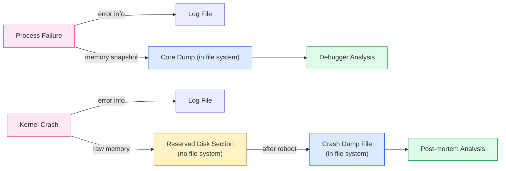
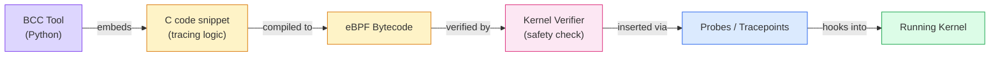
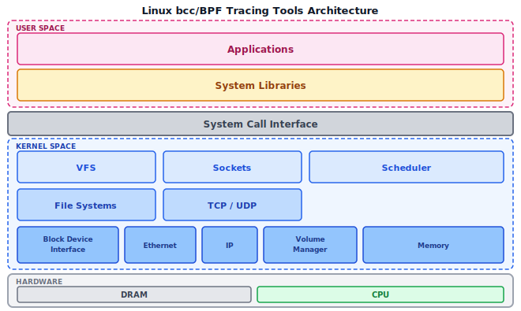

:::note
本系列文章內容參考自經典教材 **Operating System Concepts, 10th Edition (Silberschatz, Galvin, Gagne)**。本文對應章節：**Section 2.10 Operating-System Debugging**。
:::

<br/>

廣義而言，**除錯（Debugging）** 是在系統中尋找並修復錯誤的活動，涵蓋硬體與軟體兩個層面。值得注意的是，效能問題也被視為一種 bug，因此除錯也包含**效能調校（Performance Tuning）**，即透過消除處理瓶頸來提升整體效能。本章將探討 OS 如何支援三種核心除錯活動：失敗分析、效能監控，以及動態核心追蹤。

<br/>

## **2.10.1 失敗分析 (Failure Analysis)**

### **Process 層級的失敗：Core Dump**

當一個 Process 發生錯誤而失敗時，OS 通常會做兩件事：

1. **寫入 log 檔案**：將錯誤資訊記錄到 log file，用於通知系統管理員或使用者問題的發生
2. **產生 core dump**：拍下 Process 在失敗當下的完整記憶體快照（a capture of the memory of the process），儲存到檔案中供後續分析

:::info 為什麼叫「core dump」？
「core」這個詞來自早期電腦使用**磁蕊記憶體（Magnetic Core Memory）** 的時代，當時記憶體就被稱為「core」。雖然現代早已改用 DRAM，這個名稱卻沿用至今。
:::

core dump 檔案可以用**偵錯工具（Debugger）** 開啟。Debugger 允許程式設計師探索 Process 在失敗當下的程式碼與記憶體狀態，例如查看哪個變數持有非法值、哪個指標已超出有效範圍，是定位 bug 根本原因的重要工具。

### **Kernel 層級的失敗：Crash Dump**

除錯 user-level Process 的程式碼本身已是一大挑戰，而除錯 OS kernel 則更為複雜，原因有三：

- **規模與複雜度**：kernel 程式碼量龐大、子系統高度交織
- **直接控制硬體**：kernel 中的錯誤可能直接導致整台機器失去回應
- **缺乏 user-level 工具**：在 user-level 可用的偵錯工具在 kernel 層級幾乎派不上用場

kernel 中的失敗稱為 **crash（崩潰）**。當 crash 發生時，OS 同樣會將錯誤資訊記錄到 log 檔案，並將記憶體狀態儲存到 **crash dump**。

然而，有一個關鍵問題：**如果 crash 發生在 file-system 的程式碼裡，kernel 還能把 crash dump 寫到檔案系統嗎？**

答案是不行。一旦 file-system 的程式碼本身已發生嚴重錯誤，再嘗試透過它寫入檔案，不僅可能寫入失敗，還可能造成資料損毀。

因此，kernel crash 的標準做法是：

1. **寫入專用磁碟區域**：crash 發生時，OS 將整個記憶體內容（或至少是 kernel 擁有的部分）直接寫入磁碟上一個**不屬於任何檔案系統的保留區域（reserved disk section）**，完全繞過 file system。
2. **系統重新啟動後再整理**：系統重啟後，一個獨立的 process 讀取該保留區的原始資料，將其整理成標準的 crash dump 檔案，寫入正常的 file system 供後續分析。



<br/>

## **2.10.2 效能監控與調校 (Performance Monitoring and Tuning)**

效能調校（Performance Tuning）的目標是消除處理瓶頸（Bottleneck），而要找出瓶頸在哪裡，必須先能夠**量測系統行為**。OS 因此需要提供一套機制來收集並展示系統的各種量測數據。

效能監控工具主要分成兩種技術路線：**計數器（Counters）** 與**追蹤（Tracing）**，兩者收集資訊的方式根本不同。

### **計數器工具 (Counter-Based Tools)**

OS 透過一系列計數器持續追蹤系統活動，例如：已執行的 system call 次數、網路裝置的傳輸次數、磁碟的讀寫次數等。計數器工具的特性是**隨時可查、開銷固定低廉**，適合快速掌握系統整體概況。

Linux 上常用的計數器工具分成兩類：

**Process 層級（Per-Process）：**

| 工具  | 說明                                                               |
| :---: | :----------------------------------------------------------------- |
| `ps`  | 回報單一 Process 或一組 Process 的資訊（狀態、CPU 使用、記憶體等） |
| `top` | 即時顯示目前所有 Process 的動態統計數據，按 CPU 使用率排序         |

**系統層級（System-Wide）：**

|   工具    | 說明                                                  |
| :-------: | :---------------------------------------------------- |
| `vmstat`  | 回報記憶體使用統計，包含虛擬記憶體的 page in/out 狀況 |
| `netstat` | 回報網路介面的統計數據，例如封包的傳送與接收次數      |
| `iostat`  | 回報磁碟的 I/O 使用量，包含讀寫速率與等待時間         |

### **/proc 虛擬檔案系統**

Linux 上大多數計數器工具，其資料來源都是 **/proc 檔案系統**。`/proc` 是一個 **「虛擬」（Pseudo）檔案系統**，它只存在於 kernel 記憶體中，並不對應到任何實際的磁碟儲存區，其主要用途是讓 user-space 程式查詢各 Process 以及 kernel 本身的統計數據。

要理解 `/proc` 存在的意義，必須先思考一個問題：**在沒有 `/proc` 的情況下，user-space 程式要如何查詢 kernel 的內部狀態？**

> 答案是：只能靠 system call。
- 要查詢 CPU 資訊，就得有一個 `get_cpu_info()` system call；
- 要查詢記憶體使用量，就得有 `get_mem_stats()`；
- 要列出所有 Process，就得有 `get_process_list()`。每新增一種監控需求，就要在 kernel 增加一個 system call
  
而 system call 一旦加入就很難修改（它是 kernel 與 user-space 之間的公開合約，不能隨意變動）。這條路很快就會讓 kernel ABI 膨脹成難以維護的怪物。

`/proc` 用了一個更聰明的解法：**把 kernel 狀態偽裝成一個可瀏覽的目錄樹**。這個設計的核心依據是 UNIX 的哲學：**「一切皆檔案（Everything is a file）」**。UNIX 上的所有工具（`cat`、`grep`、`awk`、shell 腳本）都已經知道如何讀取檔案，所有程式語言都有標準的檔案 I/O 介面（`open`/`read`/`close`）。只要 kernel 狀態能以檔案的形式呈現，整個 user-space 生態系就能**不需要任何修改**地直接使用：

```bash
# 不需要任何特殊 API，cat 就能查 CPU 資訊
cat /proc/cpuinfo

# grep 直接從 /proc/meminfo 抓空閒記憶體
grep MemFree /proc/meminfo

# shell 腳本直接讀取某個 process 的狀態
cat /proc/1234/status
```

**為什麼是「目錄層級」，而不是單一的大檔案？**

目錄結構帶來的是**可探索性（Discoverability）**。每個 PID 都有自己的子目錄，目錄裡的每個檔案是該 Process 的一種屬性：

```
/proc/1234/
    status       ← 基本狀態（名稱、PID、狀態、記憶體）
    maps         ← 記憶體映射區域
    fd/          ← 目前開啟的所有 file descriptor
    exe          ← 指向執行檔的 symlink
    cmdline      ← 完整的命令列參數
    ...
```

只要 `ls /proc/1234/`，就能一眼看出 kernel 對這個 Process 暴露了哪些資訊，完全不需要查文件。系統層級的 kernel 統計數據則放在 `/proc/` 的頂層或子目錄下，例如 `/proc/meminfo`（記憶體使用）、`/proc/cpuinfo`（CPU 資訊）、`/proc/net/tcp`（TCP 連線表）等。

**「檔案」的內容實際上從哪裡來？**

實際上 `/proc` 裡的「檔案」完全不存在於磁碟上。當 `ps`、`top` 或任何程式對 `/proc` 下的路徑呼叫 `open()` 和 `read()` 時，kernel 的虛擬檔案系統層會攔截這個請求，**即時呼叫對應的 kernel 函式來生成內容**，然後把結果當作檔案資料回傳給呼叫者。整個過程完全在記憶體中完成，沒有任何磁碟存取。

這個設計也讓 kernel 開發者能夠輕鬆新增監控點：只要在 `/proc` 下掛載一個新的「檔案」（對應一個 kernel 函式），現有的所有工具立刻就能讀取它，完全不需要修改任何 system call 介面。

:::info `/proc` 與 Device Files 的共同哲學
`/proc` 和 `/dev` 下的裝置檔案（device files）體現的是同一個設計哲學。`/dev/null`、`/dev/random` 看起來是檔案，但對它們的讀寫實際上觸發的是 kernel 的裝置驅動程式。`/proc` 把這個概念延伸到 kernel 狀態查詢：用「讀取檔案」這個統一的操作模型，取代各式各樣零散的 system call。
:::

在 Windows 系統上，**工作管理員（Windows Task Manager）** 提供相同功能的圖形介面，涵蓋目前執行中的應用程式與 Process 資訊、CPU 與記憶體使用量，以及網路連線統計數據（對應教科書 Figure 2.19）。

<br/>

## **2.10.3 追蹤工具 (Tracing)**

計數器工具是查詢 kernel 當下維護的**靜態數值**（例如「目前的 CPU 使用率是多少？」）；而追蹤工具則是針對**特定事件**收集資料，例如「某次 system call 從呼叫到返回，中間經過了哪些步驟？」兩者的差別在於：計數器回答「有多少」，追蹤工具回答「如何發生」。

Linux 上常見的追蹤工具同樣分兩層：

**Process 層級（Per-Process）：**

|   工具   | 說明                                                                            |
| :------: | :------------------------------------------------------------------------------ |
| `strace` | 追蹤一個 Process 所呼叫的所有 system call，顯示每次呼叫的參數與回傳值           |
|  `gdb`   | 原始碼層級的偵錯工具（source-level debugger），可設定中斷點、單步執行、檢視變數 |

**系統層級（System-Wide）：**

|   工具    | 說明                                                                      |
| :-------: | :------------------------------------------------------------------------ |
|  `perf`   | Linux 效能分析工具集合，涵蓋 CPU 效能計數器（硬體 PMU）、追蹤點、取樣分析 |
| `tcpdump` | 網路封包擷取工具，記錄通過網路介面的封包內容供後續分析                    |

:::info Kernighan's Law
> "Debugging is twice as hard as writing the code in the first place. Therefore, if you write the code as cleverly as possible, you are, by definition, not smart enough to debug it."

這句話提醒我們：程式碼的可讀性與可除錯性，本身就是設計品質的重要指標。讓 OS 更容易理解、更容易除錯、更容易在執行中調校，是作業系統研究與工程實踐中一個持續進行中的重要領域。
:::

<br/>

## **2.10.4 BCC 動態核心追蹤**

### **為什麼需要 BCC？**

想像一個場景：一個 MySQL 資料庫在生產環境上突然變慢，但 MySQL 的程式碼本身沒有問題，懷疑是底層的磁碟 I/O 或記憶體分配出現異常。要確認這個懷疑，需要在**不重啟服務的情況下**，同時觀察 user-level 的 MySQL 程式碼與 kernel 的磁碟子系統在交互時發生了什麼。

傳統工具在這種情況下幾乎束手無策：`strace` 只看得到 system call 邊界，看不進 kernel 內部；`gdb` 掛載到 kernel 需要停下系統；而手動在 kernel 原始碼中插入 `printk`（kernel 的 print）再重新編譯，代價高昂且影響生產環境穩定性。

**BCC（BPF Compiler Collection）** 正是為了解決這個問題而設計的工具包，其核心特性是：能夠在**任何層級**（user-space 到 kernel 深處）插入探針（probe），在**不影響系統穩定性**的前提下，對**正在運行的生產系統**進行即時動態追蹤。

### **BCC 的底層基礎：eBPF**

BCC 是 **eBPF（extended Berkeley Packet Filter）** 的前端介面（front-end interface）。eBPF 的前身 BPF（Berkeley Packet Filter）誕生於 1990 年代初期，最初只是一個用於過濾網路封包的技術。「extended BPF」在此基礎上大幅擴展功能，讓它不再局限於網路層，而是能夠深入 kernel 的任何角落。

eBPF 的運作方式如下：

1. **撰寫 eBPF 程式**：用 C 語言的子集（subset of C）撰寫追蹤邏輯
2. **編譯成 eBPF 指令**：程式被編譯成 eBPF bytecode（一種精簡的指令集）
3. **通過 Verifier 驗證**：在插入 kernel 之前，eBPF 指令集必須通過 kernel 內建的 **Verifier（驗證器）** 的靜態分析，確認：
   - 程式不會造成無限迴圈
   - 不會存取非法記憶體位址
   - 不會損害系統效能或安全性
4. **動態插入執行中的 kernel**：通過驗證後，eBPF 指令被插入到 kernel 中，透過 **probe** 或 **tracepoint** 的方式附著在特定的核心事件上



### **BCC 的 Python 介面**

直接撰寫 eBPF C 程式並與 kernel 介接，開發難度極高，對一般工程師幾乎是不可能的任務。BCC 的貢獻在於提供了一個 **Python 的前端介面**，讓工具開發者可以用 Python 撰寫 BCC 工具，並在 Python 程式中內嵌（embed）負責與 eBPF 互動的 C 程式碼。BCC 工具鏈會自動完成 C 程式碼的編譯、eBPF 指令的生成與插入等底層細節。

### **BCC 的核心能力：全棧追蹤**

BCC 最強大之處在於它能夠追蹤 Linux 系統棧的任意一層，從最頂層的 user-space 應用程式，一路貫穿 system libraries、system call interface，直至 kernel 的 file system、網路堆疊、排程器，乃至最底層的 block device 驅動與記憶體子系統。

下圖呈現了 Linux bcc/BPF 追蹤工具所能介入的架構範圍：



圖中各層次的含義：

- **Applications**：運行在 user space 的應用程式（如 MySQL、Python 程式）
- **System Libraries**：user-space 程式庫層（如 glibc），應用程式透過這層呼叫 system call
- **System Call Interface**：user space 與 kernel 的邊界，BCC 的 `opensnoop`、`strace` 等工具常在此層探測
- **VFS（Virtual File System）**：kernel 對所有檔案系統的統一抽象介面；`filetop`、`fileslower` 等工具探測此層
- **Sockets**：網路 socket 層；`tcpconnect`、`tcpretrans` 等工具在此探測 TCP 連線行為
- **Scheduler**：CPU 排程器；`profile`、`cpudist` 等工具在此分析 CPU 使用狀況
- **File Systems / TCP/UDP**：具體的檔案系統實作（ext4、xfs 等）與傳輸協定實作
- **Block Device Interface / Ethernet / IP / Volume Manager / Memory**：最底層的 kernel 驅動與記憶體管理子系統
- **DRAM / CPU**：物理硬體層

BCC 能夠在上述任意一層插入探針，這意味著工程師可以精確地定位問題發生在哪一層，而不只是看到 system call 邊界的粗粒度資訊。

### **BCC 工具實例：disksnoop**

BCC 套件內建了大量現成的追蹤工具。以 `disksnoop.py` 為例，它專門追蹤磁碟 I/O 活動：

```bash
./disksnoop.py
```

執行後輸出類似：

```
TIME(s)          T  BYTES    LAT(ms)
1946.29186700    R  8        0.27
1946.33965000    R  8        0.26
1948.34585000    W  8192     0.96
1950.43251000    R  4096     0.56
1951.74121000    R  4096     0.35
```

每一行代表一次磁碟 I/O 事件，各欄的含義如下：

- **TIME(s)**：I/O 操作發生的時間戳（秒）
- **T**：操作類型，`R` 為讀取（Read），`W` 為寫入（Write）
- **BYTES**：本次 I/O 傳輸的資料量（bytes）
- **LAT(ms)**：本次 I/O 的延遲（Latency），即完成操作所花費的時間（毫秒）

除了通用的磁碟追蹤，BCC 的許多工具也可以針對特定應用程式使用。例如，`opensnoop` 可以限定只追蹤特定 Process 的 `open()` system call：

```bash
./opensnoop -p 1225
```

這個指令只會顯示 PID 為 1225 的 Process 所呼叫的所有 `open()` 事件，讓工程師可以精確地聚焦在特定服務的行為上，而不被其他 Process 的 I/O 事件所干擾。

:::info BCC 的安全設計：可用於生產環境
BCC 最重要的設計特點之一是：它的所有工具都可以在**正在承載關鍵業務的生產系統**上直接使用，不會對系統造成損害。這對系統管理員而言意義重大，因為許多效能問題只在高負載的真實環境中才會出現，無法在測試環境中重現。eBPF 的 Verifier 機制確保了被插入 kernel 的程式碼是安全且行為受控的，而 BCC 工具本身在不使用時幾乎沒有效能開銷，使用中的影響也與追蹤的事件數量成比例，不會造成突發的系統負擔。
:::
