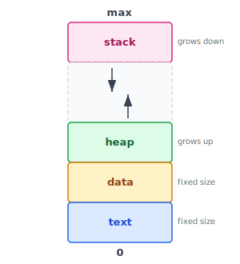
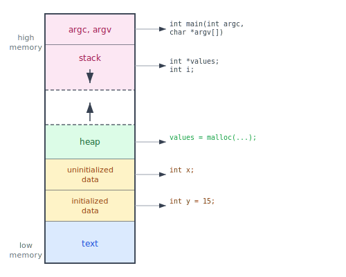
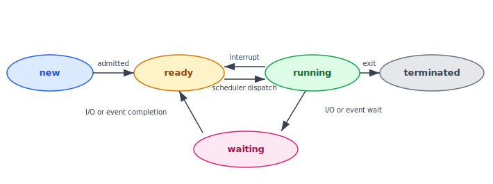
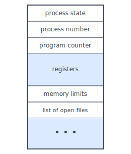

:::note
本系列文章內容參考自經典教材 **Operating System Concepts, 10th Edition (Silberschatz, Galvin, Gagne)**。本文對應章節：**Section 3.1 Process Concept**。
:::

早期電腦一次只能執行一支程式，該程式完全掌控所有系統資源。現代電腦系統則允許多支程式同時載入記憶體並發執行，這個演進要求作業系統對每支程式的執行行為有更嚴格的管控與隔離，因此催生了「**進程（Process）**」這個核心概念。進程是現代電腦系統中工作的基本單位，而 OS 的核心任務之一就是管理這些進程的生命週期。

<br/>

## **3.1.1 進程 (The Process)**

### **進程的記憶體佈局**

進程是一支正在執行的程式（a program in execution）。一支程式從磁碟載入記憶體並開始執行後，便成為一個進程。進程的執行狀態由兩個關鍵資訊表示：**程式計數器（Program Counter）** 的當前值，以及所有**處理器暫存器（CPU Registers）** 的內容。

進程在記憶體中的佈局通常劃分為四個區段（Sections）：



各區段說明如下：

|       區段        | 說明                                           | 大小  |
| :---------------: | :--------------------------------------------- | :---: |
| **Text Section**  | 可執行的程式碼本體                             | 固定  |
| **Data Section**  | 全域變數（Global Variables）                   | 固定  |
| **Heap Section**  | 執行期間動態配置的記憶體（malloc/new）         | 動態  |
| **Stack Section** | 函式呼叫的暫存資料（參數、區域變數、返回位址） | 動態  |

Text Section 與 Data Section 的大小在編譯時就已確定，執行過程中不會改變。Heap 與 Stack 則不同：

- **Stack**：每次發出函式呼叫，OS 就在 Stack 頂端壓入一筆 **Activation Record**（包含函式參數、區域變數、返回位址）；函式返回時，這筆記錄被彈出。Stack 因此呈 LIFO（Last In, First Out）的堆疊結構，向**低位址方向**（圖中向下）成長。
- **Heap**：當程式動態配置記憶體時（例如 C 的 `malloc`、C++ 的 `new`），Heap 向**高位址方向**（圖中向上）延伸；`free` / `delete` 時則收縮。

Stack 從高位址向下長，Heap 從低位址向上長，兩者共享中間的空閒區間（Free Space）。OS 必須確保這兩個區段不會相互覆蓋，否則會導致記憶體損毀（Memory Corruption）。

### **C 程式的記憶體佈局細節**

Figure 3.1 呈現的是通用的進程記憶體模型；套用到實際的 C 程式時，佈局會更細一些，如下圖所示：



與圖 3.1 的主要差異有兩點：

1. **Data Section 細分為兩個子區段**：
   - **Initialized Data**：已明確賦初值的全域/靜態變數（例如 `int y = 15;`）
   - **Uninitialized Data（BSS）**：宣告但未賦值的全域/靜態變數（例如 `int x;`）。BSS 是歷史術語，全名為 *block started by symbol*，OS 在程式啟動時會自動將此區段清零。

2. **`argc` / `argv` 有獨立的區段**：傳入 `main()` 的命令列參數存放於 Stack 頂端（高位址端），位置在一般區域變數之上。

GNU `size` 命令可查看各區段的實際大小（bytes）：

```
text    data    bss     dec     hex     filename
1158    284     8       1450    5aa     memory
```

其中 `data` 對應 Initialized Data（已賦值的全域變數，如 `int y = 15`），`bss` 對應 Uninitialized Data（未賦值的全域變數，如 `int x`），`dec` 與 `hex` 是三個區段的位元組總和。

<br/>

### **程式與進程的根本差異**

理解「程式（Program）」與「進程（Process）」的差異是整章的基礎：

- **程式**是一個**被動實體（Passive Entity）**，本質上就是磁碟上的一個可執行檔（Executable File），只是靜靜存放著一連串指令。
- **進程**是一個**主動實體（Active Entity）**，是程式被載入記憶體並開始執行後的動態狀態，除了程式碼本身，還包含 Program Counter、CPU 暫存器、OS 分配給它的各種資源。

一個可執行檔可以同時對應**多個進程**。例如：五個使用者各自開啟了相同的瀏覽器程式，磁碟上只有一個可執行檔，但記憶體中同時存在五個互相獨立的進程。這五個進程共享相同的 Text Section（執行碼），但各自擁有獨立的 Data、Heap、Stack Section。

:::info 進程作為執行環境：Java JVM 的例子

「進程執行程式」的概念可以遞迴套用。**Java 虛擬機器（JVM, Java Virtual Machine）** 本身就是一個進程，執行 Java 位元組碼（Bytecode）並將其翻譯為本機指令。

執行一支 Java 程式時，命令列看起來是：
```bash
java Program
```

這實際上是啟動了 `java` 這個進程（即 JVM），再由 JVM 在虛擬機器內部解譯執行 `Program.class`。換句話說，JVM 進程扮演了另一層「執行環境」的角色，讓 Java 程式碼在其之上運行，實現了跨平台的可移植性。
:::

<br/>

## **3.1.2 進程狀態 (Process State)**

### **為什麼需要狀態？**

在多進程環境中，記憶體裡同時存在許多進程，但每個 CPU 核心在任何瞬間只能執行**一個**進程。OS 必須知道每個進程當前的狀況，才能正確決定把 CPU 交給誰，以及何時可以把 CPU 從一個進程手中移走。這就需要一套正式的**狀態模型（State Model）**。

進程在生命週期中會歷經五種狀態：

- **New**：進程正在被建立（尚未完成初始化，還不能被排程執行）
- **Ready**：進程已載入記憶體、萬事俱備，隨時可以執行，但正在等待 OS 把 CPU 分配給它
- **Running**：進程正在 CPU 上執行指令（一個 CPU 核心同一時間只有**一個** Running 進程）
- **Waiting**：進程正在等待某個事件發生，例如 I/O 完成或信號（Signal）到來，在等待期間不應佔用 CPU
- **Terminated**：進程已完成執行，正在被 OS 回收資源

:::info Ready vs Waiting 的關鍵區別

這兩個狀態都是「不在執行中」，但原因完全不同：

- **Ready**：進程完全準備好了，**缺的只是 CPU**。OS 什麼時候把 CPU 分配過來，它就什麼時候可以立刻執行。
- **Waiting**：進程在等一個**外部事件**，例如磁碟讀取尚未完成。就算把 CPU 給它，它也無法繼續執行，因為它需要的資料還沒準備好。

這個區別決定了排程器（Scheduler）的行為：排程器從 Ready 佇列中選取進程分配 CPU，而不會去碰 Waiting 狀態的進程。
:::

### **狀態轉換圖**

下圖展示了進程在五種狀態之間的所有合法轉換路徑：



各轉換觸發條件說明：

| 轉換                     | 觸發事件                                                               |
| :----------------------- | :--------------------------------------------------------------------- |
| **new → ready**          | 進程建立完成，OS 將其「接受（admitted）」進 Ready 佇列                 |
| **ready → running**      | 排程器（Scheduler）選中此進程並將 CPU 分配給它（dispatch）             |
| **running → ready**      | 發生中斷（interrupt）或時間片（time slice）到期，OS 強制移走 CPU       |
| **running → waiting**    | 進程發出 I/O 請求或等待某事件，主動放棄 CPU                            |
| **waiting → ready**      | 等待的事件完成（例如 I/O 完成），進程重新具備執行能力，回到 Ready 佇列 |
| **running → terminated** | 進程呼叫 `exit()` 完成執行，或被 OS 強制終止                           |

:::info 任何時刻只能有一個 Running 進程（per CPU core）

狀態圖中最重要的約束是：在任何一個 CPU 核心上，同一時間只能有**一個**進程處於 Running 狀態。許多進程可以同時處於 Ready 或 Waiting，但 Running 只有一個。這個約束是多進程排程的根本出發點：CPU 是稀缺資源，OS 的排程演算法本質上是在決定哪個 Ready 進程有資格下一個佔用這個稀缺資源。
:::

<br/>

## **3.1.3 進程控制區塊 (Process Control Block)**

### **為什麼需要 PCB？**

進程在生命週期中會被反覆中斷、暫停、恢復。每次 OS 把 CPU 從進程 A 切換給進程 B 時，進程 A 的執行狀態必須被完整儲存，等 A 再次獲得 CPU 時才能從中斷點無縫繼續。

那麼，A 的狀態應該存在哪裡？OS 為每個進程建立一個專屬的資料結構，稱為**進程控制區塊（PCB, Process Control Block）**，也叫 **Task Control Block**。PCB 是 OS 追蹤每個進程的完整檔案，包含了重啟一個進程所需的全部資訊。

### **PCB 的結構**

下圖展示了 PCB 的典型欄位組成：



PCB 各欄位說明：

| 欄位                              | 說明                                                                                                                                                          |
| :-------------------------------- | :------------------------------------------------------------------------------------------------------------------------------------------------------------ |
| **Process State**                 | 進程當前狀態：new / ready / running / waiting / terminated                                                                                                    |
| **Process Number**                | 進程的唯一識別碼（PID, Process ID），整數，用來在 OS 內部定位此進程                                                                                           |
| **Program Counter**               | 此進程下一條要執行的指令位址，中斷時必須儲存                                                                                                                  |
| **CPU Registers**                 | 所有暫存器的值，包含 accumulators、index registers、stack pointers、general-purpose registers 及條件碼（condition codes）。中斷時連同 PC 一起儲存，恢復時還原 |
| **CPU-Scheduling Information**    | 進程優先權（Priority）、排程佇列指標、其他排程參數（詳見 Chapter 5）                                                                                          |
| **Memory-Management Information** | Base/Limit 暫存器值、Page Tables 或 Segment Tables，視 OS 使用的記憶體管理機制而定（詳見 Chapter 9）                                                          |
| **Accounting Information**        | 已使用的 CPU 時間、時間限制（Time Limit）、帳號編號、工作編號等                                                                                               |
| **I/O Status Information**        | 已分配給此進程的 I/O 裝置清單、開啟中的檔案列表（list of open files）等                                                                                       |

簡而言之，PCB 是 OS 用來表示一個進程的**完整快照**，是進程可以被暫停後再完整恢復的根本保障。

:::info Linux 中的 PCB 實作：task_struct

Linux Kernel 以 C 結構 `task_struct` 來表示每個進程（Linux 通常稱之為 task），定義在核心原始碼的 `<include/linux/sched.h>` 中。主要欄位如下：

```c
long state;                    /* 進程狀態 */
struct sched_entity se;        /* 排程資訊 */
struct task_struct *parent;    /* 父進程指標 */
struct list_head children;     /* 子進程鏈結串列 */
struct files_struct *files;    /* 開啟中的檔案清單 */
struct mm_struct *mm;          /* 位址空間資訊 */
```

Linux Kernel 將所有活躍進程以**雙向鏈結串列（Doubly Linked List）** 串接起來，並維護一個全域指標 `current` 指向目前正在 CPU 上執行的進程。切換進程狀態只需要：

```c
current->state = new_state;
```

這個設計讓 Kernel 能夠以 O(1) 時間存取當前進程，同時以 O(n) 時間遍歷所有進程（用於排程掃描等操作）。
:::

<br/>

## **3.1.4 執行緒 (Threads)**

前面的進程模型隱含一個假設：一個進程只有**一條執行流（Single Thread of Execution）**。例如一支文書處理程式在執行時，只有一條指令序列在運作，使用者不能同時輸入文字並執行拼字檢查。

大多數現代 OS 已將進程概念擴展，允許一個進程內部存在**多條執行緒（Threads）**，每條 Thread 可以並行執行不同的工作：

- 一條 Thread 負責回應使用者的鍵盤輸入
- 另一條 Thread 在背景執行拼字或文法檢查

這種多執行緒（Multithreaded）模型在**多核心（Multicore）系統**上尤其有價值，因為不同 Thread 可以真正同時跑在不同的 CPU 核心上，實現真並行（True Parallelism），而非只是快速輪流執行的偽並行。

當一個進程支援多 Threads 時，PCB 需要擴充以記錄每條 Thread 各自的狀態（每條 Thread 有自己的 Program Counter 與 CPU Registers）。Threads 的完整機制與設計將在 Chapter 4 詳細討論。
