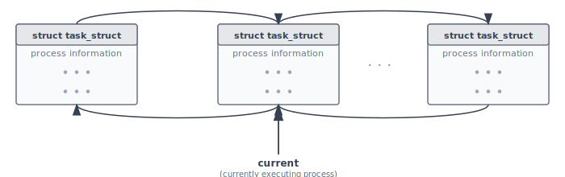
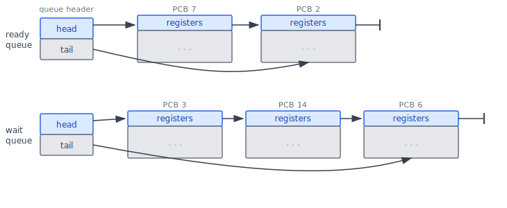
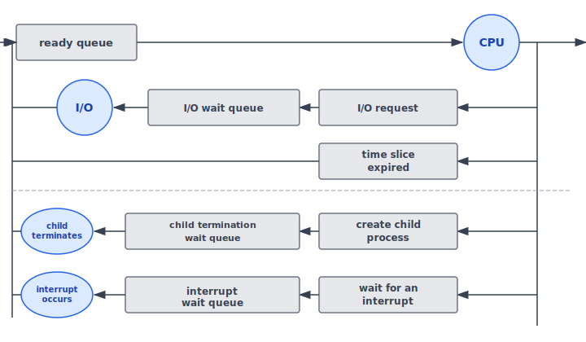
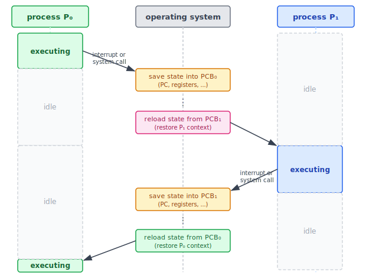

:::note
本系列文章內容參考自經典教材 **Operating System Concepts, 10th Edition (Silberschatz, Galvin, Gagne)**。本文對應章節：**Section 3.2 Process Scheduling**。
:::

記憶體中同時存在許多進程，但 CPU 核心的數量遠少於進程數量。當可用核心不足時，多餘的進程必須在佇列中等待，直到某個核心空出來才能被排程執行。記憶體中進程的總數稱為**多程式化程度（Degree of Multiprogramming）**，而如何在大量進程之間公平、有效率地分配 CPU，正是「進程排程（Process Scheduling）」要解決的核心問題。

在設計排程策略之前，OS 必須先了解進程的行為特徵。大多數進程可以分為兩大類型：

- **I/O 密集型進程（I/O-bound Process）**：花在等待 I/O 的時間遠多於真正計算的時間。例如互動式文字編輯器，使用者每次按鍵後，程式大部分時間都在等待下一個輸入。
- **CPU 密集型進程（CPU-bound Process）**：幾乎不發出 I/O 請求，持續佔用 CPU 做大量運算。例如影像壓縮、科學模擬等計算密集型任務。

這個分類對排程策略影響深遠：若系統中只有 CPU-bound 進程，CPU 會被長期佔用，I/O 裝置閒置；若全是 I/O-bound 進程，CPU 大部分時間都在等待，效能也不佳。好的排程器通常會混合這兩類進程，讓 CPU 與 I/O 同時忙碌，最大化系統整體效能。

:::info Linux 如何在記憶體中追蹤所有進程

在 Section 3.1 已介紹過 Linux 使用 C 結構 `task_struct` 表示每個進程（包含 `state`、`se`、`parent`、`children`、`files`、`mm` 等欄位）。這裡進一步說明 Kernel 如何管理**全部活躍進程**的集合。

Linux Kernel 將所有活躍進程以**雙向鏈結串列（Doubly Linked List）** 串接起來：



圖中每個方塊代表一個 `task_struct`，上方弧線箭頭是 `next` 方向（forward），下方弧線箭頭是 `prev` 方向（backward），構成雙向循環串列。Kernel 維護一個全域指標 **`current`**，永遠指向**目前正在 CPU 上執行的進程**。

透過 `current` 指標，Kernel 可以在 O(1) 時間存取當前進程的任何欄位。例如，將當前進程的狀態改為 `new_state`：

```c
current->state = new_state;
```

這個設計的意義在於：每次上下文切換時，`current` 指標只需更新為下一個進程，OS 即可在 O(1) 時間切換「誰是當前進程」，同時保有以 O(n) 時間遍歷所有進程的能力（例如排程掃描）。
:::

<br/>

## **3.2.1 排程佇列 (Scheduling Queues)**

### **就緒佇列與等待佇列**

進程進入系統後，首先被放入**就緒佇列（Ready Queue）**，在此排隊等待 OS 把 CPU 分配給它。就緒佇列通常以**鏈結串列（Linked List）** 實作：佇列的頭部（Header）維護兩個指標：指向串列第一個元素的 `head` 與指向最後一個元素的 `tail`；每個 PCB 內含一個 `next` 指標，指向佇列中下一個 PCB。

除了就緒佇列，系統還維護各種**等待佇列（Wait Queue）**。當進程需要等待某個事件（例如 I/O 完成），就被移出就緒佇列，放入對應的等待佇列。等待的事件一旦完成，進程便重新回到就緒佇列，等待下一次被排程。

下圖展示了就緒佇列與等待佇列的鏈結串列結構：



圖中各元素說明：

- **queue header（佇列標頭）**：包含 `head` 與 `tail` 兩個指標，是 OS 操作佇列的入口
- **PCB 方塊**：每個方塊代表一個進程的 PCB，標號（7、2 等）為進程的 PID；方塊內存有 CPU 暫存器值、記憶體資訊等欄位（以 `registers` 與 `...` 示意）
- **箭頭**：串連各 PCB 的 `next` 指標，形成鏈結串列；串列末端以垂直短線表示 `null`（無下一個進程）
- **就緒佇列（上）**：含 PID 7 與 PID 2 兩個進程，均已準備好執行
- **等待佇列（下）**：含 PID 3、14、6 三個進程，均在等待某個事件完成

這個資料結構讓 OS 能夠以 O(1) 的時間在佇列頭部插入或移除進程，是排程器高效運作的基礎。

### **進程在佇列間的流動**

進程在生命週期中並不會靜止待在一個佇列裡，而是根據發生的事件，不斷在就緒佇列與各等待佇列之間流動。以下圖展示了這個完整的流動模型：



從圖中可以看出，一個進程獲得 CPU 後，接下來可能發生四種情況：

| 事件 | 結果 |
| :--- | :--- |
| **I/O request**：進程發出 I/O 請求 | 移入 I/O 等待佇列，等 I/O 完成後回到就緒佇列 |
| **time slice expired**：時間片到期，被 OS 搶佔 | 直接回到就緒佇列，不進入任何等待佇列 |
| **fork**：建立子進程，等待子進程結束 | 移入子進程終止等待佇列，子進程結束後回到就緒佇列 |
| **interrupt occurs**：發生中斷 | 移入中斷等待佇列，中斷處理完成後回到就緒佇列 |

這張圖最核心的洞察是：**就緒佇列是所有進程的匯聚點**。無論進程因什麼原因離開 CPU，最終都必須經由就緒佇列重新排隊，等待下一次被排程。進程在「執行 → 等待 → 就緒 → 執行」這個循環中反覆流動，直到呼叫 `exit()` 終止為止，OS 才會回收其 PCB 與所有資源。

<br/>

## **3.2.2 CPU 排程器 (CPU Scheduling)**

**CPU 排程器（CPU Scheduler）** 的職責是：從就緒佇列中選出一個進程，並將 CPU 核心分配給它。

排程器必須非常頻繁地介入。以 I/O-bound 進程為例，它可能只執行了幾毫秒就發出 I/O 請求而讓出 CPU；CPU-bound 進程雖然需要較長的執行時間，但 OS 通常也不會允許任何進程無限期佔用 CPU，而是設計為**強制移走 CPU（Preemption）**，然後排程下一個進程執行。因此，CPU 排程器至少每 **100 毫秒**執行一次，實際上往往更頻繁。

:::info 中期排程器與 Swapping

部分 OS 在 CPU 排程器之外，還設有一層**中期排程器（Medium-Term Scheduler）**，負責執行一種稱為 **Swapping（換頁）** 的操作：

- **Swap out**：將一個進程從記憶體移出到磁碟，同時降低多程式化程度，釋放記憶體空間
- **Swap in**：在記憶體有餘裕時，再將進程從磁碟移回記憶體，繼續從中斷點執行

Swapping 通常只有在記憶體被過度使用（Overcommitted）時才會觸發，是一種緊急緩解記憶體壓力的手段。Swapping 的完整機制將在 Chapter 9（記憶體管理）詳細討論。
:::

<br/>

## **3.2.3 上下文切換 (Context Switch)**

### **為什麼需要上下文切換？**

考慮以下場景：進程 P₀ 正在 CPU 上執行，此時發生一個中斷（或進程發出系統呼叫）。OS 需要暫停 P₀、改去處理中斷，或排程另一個進程 P₁ 執行。問題是：P₀ 執行到一半，CPU 內有它的 Program Counter、所有暫存器值、記憶體狀態，這些資訊若丟失，P₀ 以後就無法從中斷點恢復。

解決方案是把「P₀ 的完整 CPU 狀態」先存進 P₀ 的 PCB，之後 CPU 要切換給 P₁ 時，再從 P₁ 的 PCB 載入 P₁ 的狀態。這個「儲存舊進程狀態、載入新進程狀態」的操作，稱為**上下文切換（Context Switch）**。

一次完整的上下文切換包含兩個動作：

1. **State save（狀態儲存）**：將目前進程的 CPU 狀態（Program Counter、所有暫存器值、以及記憶體管理資訊）寫入其 PCB
2. **State restore（狀態還原）**：從下一個要執行進程的 PCB 中，將其先前儲存的狀態載入 CPU

「上下文（Context）」正是指 PCB 中保存的這份快照，它代表進程被暫停時的完整 CPU 狀態。

### **上下文切換的時序**

下圖完整展示了 P₀ 與 P₁ 之間進行兩次上下文切換的時序：



時序各階段說明：

1. **P₀ 執行中**：P₀ 佔有 CPU，P₁ 處於閒置（idle）狀態
2. **觸發點**：P₀ 發生中斷或呼叫系統呼叫，OS 介入
3. **save state into PCB₀**：OS 將 P₀ 的 PC 與所有暫存器值儲存至 P₀ 的 PCB；P₀ 進入閒置狀態
4. **reload state from PCB₁**：OS 從 P₁ 的 PCB 還原 P₁ 的 CPU 狀態
5. **P₁ 執行中**：P₁ 接管 CPU，P₀ 持續閒置
6. **觸發點**：P₁ 再次被中斷或發出系統呼叫
7. **save state into PCB₁**：OS 儲存 P₁ 的狀態
8. **reload state from PCB₀**：OS 還原 P₀ 的狀態
9. **P₀ 恢復執行**：P₀ 從第 3 步儲存的中斷點繼續，感知不到任何差異

這張圖最核心的洞察是：OS 只在觸發點介入，其餘時間完全不佔用 CPU。上下文切換期間，OS 在「中間欄」執行 save/reload 操作，而兩個進程各自在「等待」。

### **上下文切換的代價**

上下文切換是**純粹的額外負擔（Pure Overhead）**：切換過程中 CPU 無法執行任何進程的有效指令，只是在做狀態的保存與還原。切換速度因硬體而異，典型值為**數微秒（several microseconds）**。

切換速度主要受以下因素影響：

- **記憶體速度**：暫存器值需要寫入/讀取 PCB，受記憶體頻寬限制
- **需要複製的暫存器數量**：暫存器越多，複製成本越高
- **OS 的額外工作**：記憶體管理越複雜（例如需要切換位址空間），切換代價越大

部分處理器提供**多組暫存器（Multiple Register Sets）** 的硬體支援。在這種架構下，上下文切換只需要改變「目前使用哪組暫存器」的指標，不必真正複製資料，速度極快。但若活躍進程數超過可用的暫存器組數，仍然需要退回到記憶體複製的方式。

:::info 行動系統的多工策略（iOS 與 Android）

行動裝置的上下文切換代價特別敏感，因此早期 iOS 對應用程式的多工（Multitasking）採取嚴格限制：

**iOS 的演進：**
- **早期 iOS**：前景只能執行一支使用者 app，其餘全部暫停。OS 本身的任務（由 Apple 撰寫，行為可預測）才能多工執行。
- **iOS 4 起**：開放有限度的背景多工，允許特定類型的 app 在背景持續執行（例如音訊、位置服務）。
- **後續版本**：隨著 CPU 效能、記憶體容量與電池壽命持續提升，多工限制逐步放寬；iPad 更支援兩個前景 app 同時顯示（Split-screen）。

**Android 的做法：**
Android 從一開始便支援多工，且不限制 app 類型。若 app 需要在背景持續執行工作（例如串流音訊），它必須使用一個稱為 **Service** 的獨立元件：Service 沒有使用者介面、記憶體佔用極小，由 Service 代替背景 app 執行工作，即使 app 本身被暫停，Service 也能繼續運作。這個設計讓 Android 在記憶體有限的行動環境中，以最低代價實現高效的背景多工。

這兩種設計哲學的差異反映出一個基本取捨：**越開放的多工模型，OS 需要管理的上下文就越多，對排程器的要求也越高**。
:::
