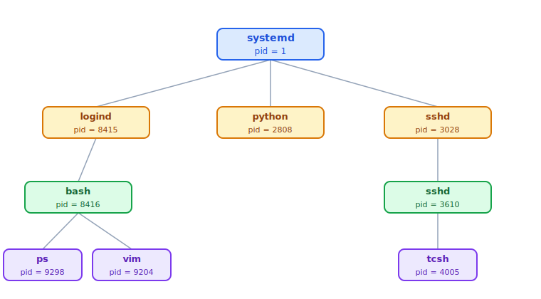
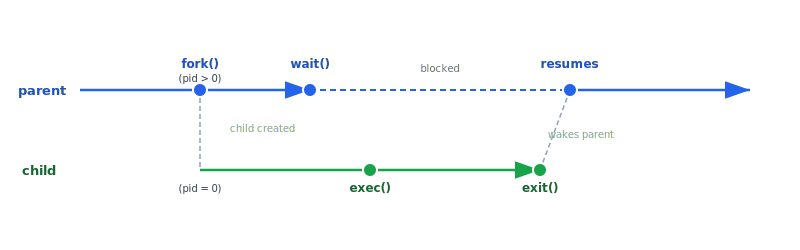
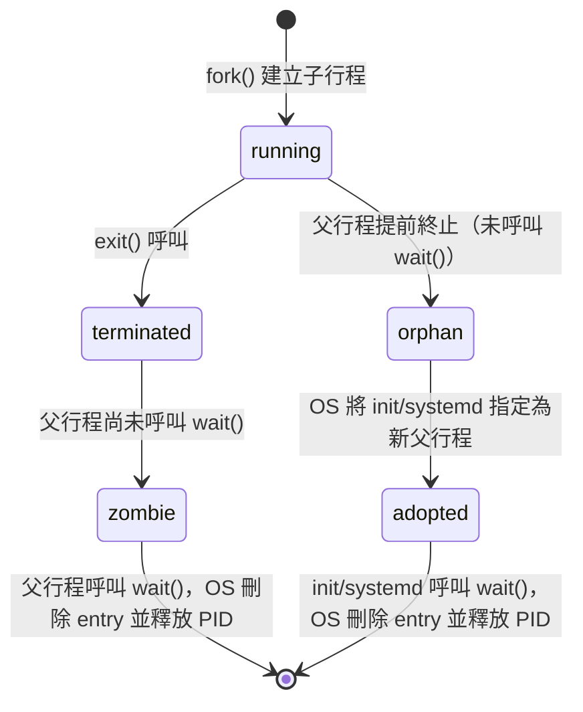

:::note
本系列文章內容參考自經典教材 **Operating System Concepts, 10th Edition (Silberschatz, Galvin, Gagne)**。本文對應章節：**Section 3.3 Operations on Processes**。
:::

大多數系統中的行程可以**並行執行**，並且可以**動態地建立與刪除**。因此 OS 必須提供一套機制來處理行程的生命週期，包含：如何建立新行程、如何在行程完成後正確地回收資源，以及如何在意外情況下強制終止行程。

<br/>

## **3.3.1 行程建立 (Process Creation)**

### **行程識別碼 (PID) 與行程樹 (Process Tree)**

在程式執行過程中，一個行程可以建立多個新行程。建立其他行程的行程稱為**父行程（Parent Process）**，被建立出來的行程稱為**子行程（Child Process）**。子行程又可以繼續建立自己的子行程，如此形成一棵**行程樹（Process Tree）**。

大多數作業系統（包含 UNIX、Linux 和 Windows）都用一個唯一的整數來識別每個行程，稱為**行程識別碼（PID, Process Identifier）**。PID 是一個整數值，核心可以用它作為索引來存取行程的各種屬性。

下圖呈現了典型 Linux 系統的行程樹。`systemd`（pid = 1）是所有使用者行程的根，也是系統啟動時第一個被建立的使用者行程。它負責依序建立各種系統服務，再由這些服務衍生出其他行程：



從圖中可以看出：
- `logind`（pid = 8415）負責管理直接登入系統的用戶端；某個用戶登入後取得了一個 `bash` shell（pid = 8416），並從中啟動了 `ps` 和 `vim`。
- `sshd`（pid = 3028）負責管理透過 SSH 連線的遠端用戶端；其下的子 `sshd`（pid = 3610）管理一個具體的 SSH 連線，並衍生出 `tcsh` shell（pid = 4005）。
- `python`（pid = 2808）是某個 Python 腳本直接由 `systemd` 啟動的服務行程。

這張圖最核心的洞察是：行程不是孤立存在的，而是以**層次樹狀結構**組織。每個行程都有一個確定的父行程，當父行程終止時，子行程的命運就需要 OS 明確處理。

:::info init 與 systemd 行程

傳統 UNIX 系統以 `init`（System V init）作為所有子行程的根，pid 固定為 1，系統開機時第一個被建立。

現代 Linux 發行版已將 `init` 替換為 `systemd`。`systemd` 承擔與 `init` 相同的角色，但更彈性、可提供更豐富的服務。在 Linux 上執行 `ps -el` 或 `pstree` 指令，可以觀察到完整的行程樹，並逐層向上追溯到 `systemd`。
:::

<br/>

### **行程建立時的兩項決策**

每次建立子行程，OS 都必須面對兩個問題：**父子行程如何並行運作？** 以及 **子行程取得什麼程式與資料？**

#### **決策一：執行方式 (Execution Semantics)**

1. **父行程與子行程並行執行**：建立子行程後，父行程立刻繼續執行，不等子行程完成。
2. **父行程等待子行程完成**：父行程暫停，直到部分或全部子行程終止後才繼續執行。

#### **決策二：位址空間 (Address Space)**

1. **子行程是父行程的複本**：子行程與父行程擁有相同的程式碼與資料（此時兩者執行相同程式，但資料是各自獨立的副本）。
2. **子行程載入一個全新的程式**：子行程的位址空間由一支新的可執行程式填充，與父行程的程式完全無關。

不同作業系統對這兩組選項的預設選擇不同。UNIX 系選系統和 Windows 採用了截然不同的設計哲學，分別以 `fork()` 搭配 `exec()` 和 `CreateProcess()` 來實現行程建立。

<br/>

### **UNIX 系統的行程建立：fork() 與 exec()**

UNIX 將行程建立拆成兩個步驟，分別對應兩個 System Call。

#### **fork()：複製行程**

考慮一個典型場景：Shell 接收到用戶輸入 `ls` 命令。Shell 需要建立一個子行程來執行 `ls`，同時自己繼續等待。整個流程如下：

1. Shell 呼叫 `fork()`，OS 為子行程建立一份父行程位址空間的**完整複本**（相同的程式碼、堆疊、資料）。
2. `fork()` 分別返回到父子兩個行程，但返回值不同：
   - **子行程**：`fork()` 返回 **0**。
   - **父行程**：`fork()` 返回**子行程的 PID**（一個正整數）。
3. 父子行程都從 `fork()` 返回後的那一行指令繼續執行，邏輯上完全相同，只靠返回值來區分自己的角色。

這個設計非常巧妙：程式碼只需一個 `if/else` 就能讓父子行程走向不同的分支，而不需要額外的參數或旗標。

#### **exec()：替換程式**

`fork()` 之後，子行程持有的仍然是父行程的程式碼。若要執行一支全新的程式，子行程會呼叫 `exec()` 系列 System Call。`exec()` 會將當前行程的位址空間**整個替換**成指定的可執行檔，然後從新程式的進入點開始執行。**`exec()` 在成功時不會返回**，因為原本呼叫 `exec()` 的程式碼已經被覆蓋掉了。

下面是一支完整展示 UNIX 行程建立的 C 程式：

```c
#include <sys/types.h>
#include <stdio.h>
#include <unistd.h>

int main()
{
    pid_t pid;

    /* fork a child process */
    pid = fork();

    if (pid < 0) { /* error occurred */
        fprintf(stderr, "Fork Failed");
        return 1;
    }
    else if (pid == 0) { /* child process */
        execlp("/bin/ls", "ls", NULL);
    }
    else { /* parent process */
        /* parent will wait for the child to complete */
        wait(NULL);
        printf("Child Complete");
    }

    return 0;
}
```

執行後，系統中會出現兩個行程，都從 `fork()` 之後繼續執行：

- **子行程**（pid = 0）：進入 `else if` 分支，呼叫 `execlp()` 執行 `/bin/ls`，列出目錄內容。
- **父行程**（pid > 0）：進入 `else` 分支，呼叫 `wait(NULL)` 主動讓出 CPU 並掛起，等待子行程完成。

下圖展示了這個過程的時序關係：



時序上各關鍵點的含義：

- **fork()**：父行程呼叫 `fork()`，OS 複製位址空間，同時返回給父（pid > 0）與子（pid = 0）。
- **wait()**：父行程呼叫 `wait()` 後進入阻塞（blocked）狀態，從就緒佇列移出；圖中以虛線表示這段等待期間父行程不在執行。
- **exec()**：子行程呼叫 `exec()`，用新程式覆蓋位址空間並開始執行。
- **exit()**：子行程完成後呼叫 `exit()`，OS 通知正在等待的父行程。
- **resumes**：父行程從 `wait()` 返回，繼續執行後續邏輯（例如印出 "Child Complete"）。

這個設計的核心洞察是：**`fork()` 負責複製、`exec()` 負責替換**，兩者分工明確。子行程繼承了父行程的開啟檔案、排程屬性等資源，`exec()` 後這些資源依然保留，讓新程式可以直接使用父行程建立好的環境（例如已開啟的 stdin/stdout）。

:::info 子行程繼承什麼？

子行程從父行程繼承：

- 排程優先級與屬性
- 已開啟的檔案描述子（File Descriptors）
- 環境變數（Environment Variables）
- 信號遮罩（Signal Mask）

子行程**不**繼承：父行程的暫存器值（因為 `fork()` 後雙方各自獨立執行）。父子各自擁有一份資料的**私有副本**，其中一方修改資料不會影響另一方。
:::

<br/>

### **Windows 系統的行程建立：CreateProcess()**

Windows 採用與 UNIX 完全不同的設計哲學。`CreateProcess()` 函式要求在建立行程時**直接指定要執行的程式**，不存在「先複製、再替換」的兩階段流程。

```c
#include <stdio.h>
#include <windows.h>

int main(VOID)
{
    STARTUPINFO si;
    PROCESS_INFORMATION pi;

    ZeroMemory(&si, sizeof(si));
    si.cb = sizeof(si);
    ZeroMemory(&pi, sizeof(pi));

    /* create child process */
    if (!CreateProcess(NULL,
        "C:\\WINDOWS\\system32\\mspaint.exe",
        NULL, NULL, FALSE, 0, NULL, NULL,
        &si, &pi))
    {
        fprintf(stderr, "Create Process Failed");
        return -1;
    }

    /* parent will wait for the child to complete */
    WaitForSingleObject(pi.hProcess, INFINITE);
    printf("Child Complete");

    CloseHandle(pi.hProcess);
    CloseHandle(pi.hThread);
}
```

`CreateProcess()` 接受至少 10 個參數，其中兩個關鍵的結構體是：

- `STARTUPINFO`：指定新行程的視窗大小、外觀，以及標準輸入輸出的 handle。
- `PROCESS_INFORMATION`：在建立成功後，存放新行程及其主執行緒的 handle 與 ID。

`WaitForSingleObject(pi.hProcess, INFINITE)` 等同於 UNIX 的 `wait()`，讓父行程阻塞直到子行程完成。

|     比較項目     |   UNIX fork() + exec()   | Windows CreateProcess() |
| :--------------: | :----------------------: | :---------------------: |
|     建立方式     | 先複製父行程，再替換程式 |   直接指定程式並載入    |
| 位址空間初始內容 |     父行程的完整複本     |    指定程式的新內容     |
|     參數數量     |     `fork()` 無參數      |     至少 10 個參數      |
|    等待子行程    |         `wait()`         | `WaitForSingleObject()` |

<br/>

## **3.3.2 行程終止 (Process Termination)**

### **正常終止：exit()**

行程執行完最後一行程式碼後，呼叫 `exit()` System Call 請求 OS 將自己刪除。`exit()` 接受一個整數作為**退出狀態（Exit Status）**，並透過 `wait()` 傳回給父行程。OS 在行程終止後會回收其所有資源，包含：實體與虛擬記憶體、已開啟的檔案、I/O 緩衝區等。

```c
/* exit with status 1 */
exit(1);
```

在正常情況下，即使程式碼中沒有明確寫出 `exit()`，C 的 runtime library 也會在 `main()` 返回後自動插入 `exit()` 的呼叫。

### **強制終止：parent 主動終止子行程**

父行程可以透過系統呼叫（如 Windows 的 `TerminateProcess()`）強制終止子行程。這個系統呼叫通常只允許父行程對自己的子行程使用，否則任何惡意程式都能任意殺掉其他行程。

父行程選擇終止子行程的常見原因：

- 子行程超出了被分配的資源使用量
- 指派給子行程的工作已不再需要執行
- 父行程本身即將終止，而 OS 不允許子行程在父行程消失後繼續存在

### **串聯終止 (Cascading Termination)**

有些系統規定：**若父行程終止，則其所有後代行程也必須一同終止**。這個現象稱為**串聯終止（Cascading Termination）**，由 OS 負責發起。也就是說，當一個行程終止時，OS 會遞迴地終止它的所有子行程、孫行程，直到整棵子樹都被清除為止。

### **wait() 與行程狀態管理**

父行程可透過 `wait()` System Call 等待子行程結束，並取得子行程的退出狀態與 PID：

```c
pid_t pid;
int status;

pid = wait(&status);
```

`wait()` 返回後，`pid` 中存放已終止的子行程的 PID，`status` 中存放子行程傳入 `exit()` 的數值。透過這個機制，父行程可以知道哪個子行程終止、以何種狀態退出。

<br/>

### **Zombie Process（殭屍行程）與 Orphan Process（孤兒行程）**

要理解這兩種狀態，需要先知道一件事：**OS 為每個行程在核心記憶體中維護一筆資料**，稱為行程表 entry，也就是 3.1 節介紹的 PCB（Process Control Block）。這筆資料記錄了行程的 PID、狀態、CPU 暫存器快照、開啟的檔案，以及行程終止時傳給 `exit()` 的**退出狀態（Exit Status）**。

當一個行程呼叫 `exit()` 終止時，OS 會立刻釋放它的記憶體和開啟的檔案等大部分資源，但**行程表 entry 不會立刻刪除**，因為 entry 裡的退出狀態還沒有被父行程讀走。父行程必須先呼叫 `wait()`，OS 才會把 exit status 交給父行程，然後刪除這筆 entry 並釋放 PID。

若 entry 長期無法刪除，PID 永遠佔用、Process Table 的空間也不斷被吃掉；若大量行程堆積，Process Table 可能塞滿，OS 就無法再建立任何新行程。

這衍生出兩種值得特別關注的行程狀態：

#### **Zombie Process（殭屍行程）**

一個行程已完成執行（呼叫了 `exit()`），但**父行程尚未呼叫 `wait()`** 來讀取其退出狀態，這個行程就成為**殭屍行程（Zombie Process）**。

殭屍行程的特徵：
- 已釋放大部分資源（記憶體、開啟的檔案等）
- 仍佔用一個 Process Table entry（保存退出狀態，等父行程讀取）
- 一旦父行程呼叫 `wait()`，OS 讀走 exit status 後即刪除 entry、釋放 PID

一般情況下行程只會短暫停留在 zombie 狀態。問題出在父行程**從不呼叫 `wait()`** 的情況，這會讓 zombie 累積，最終耗盡 Process Table 的空間。

#### **Orphan Process（孤兒行程）**

若父行程**還沒呼叫 `wait()` 就自己先終止了**，子行程就成為**孤兒行程（Orphan Process）**。注意：子行程此時仍在正常執行，只是父行程消失了，沒人能來呼叫 `wait()` 替它收尾。

:::info 父行程終止不等於子行程終止

有些系統啟用了**串聯終止（Cascading Termination）**，父行程死亡時 OS 會遞迴地終止整棵子孫樹。但 UNIX/Linux 預設**不啟用**這個機制，子行程在父行程終止後會繼續執行，只是變成孤兒，等待 OS 幫它找到新的「養父」。
:::

傳統 UNIX 的解法是將 `init` 指定為所有孤兒行程的新父行程。`init`（或現代 Linux 的 `systemd`）會定期呼叫 `wait()`，收走孤兒行程的退出狀態並釋放其 entry。

下圖以狀態圖呈現行程的完整生命週期，包含殭屍與孤兒的轉變：



<br/>

## **Android 行程重要性層次**

行動裝置的記憶體資源遠比桌機少，Android 在記憶體不足時必須主動回收資源。關鍵是：這裡的「終止行程」指的是**強制砍掉仍在執行中的行程**，而不是等待程式自然跑完。當前景 App 需要更多記憶體時，OS 可能直接終止一個正在背景執行業務邏輯的行程，無論它當時在做什麼。

為了避免隨意砍程式影響用戶體驗，Android 根據一套**重要性層次（Importance Hierarchy）** 決定終止順序，從最不重要的行程開始：

下表列出 Android 的五個行程分類，從最重要到最不重要：

| 重要性（高 → 低） |          分類          | 說明                                               |
| :---------------: | :--------------------: | :------------------------------------------------- |
|     1（最高）     | **Foreground Process** | 畫面上當前可見的行程，即用戶正在互動的應用程式     |
|         2         |  **Visible Process**   | 不在前景但被前景行程參照，其狀態顯示在前景介面上   |
|         3         |  **Service Process**   | 執行用戶可感知的背景工作，例如播放音樂串流         |
|         4         | **Background Process** | 執行背景工作，但用戶感知不到                       |
|     5（最低）     |   **Empty Process**    | 不含任何活躍元件，通常是被快取的已終止應用程式殼層 |

**終止順序**：當系統需要回收記憶體時，Android 優先終止 Empty Process，其次是 Background Process，依此類推，絕不輕易終止 Foreground Process。

:::info 行程分類的動態性

一個行程的分類並非靜態。例如，若一個行程同時提供服務（Service）又處於可見（Visible）狀態，Android 會賦予它更高的分類（Visible），以保護它不被過早終止。

此外，Android 開發指南建議應用程式遵循 **行程生命週期（Process Lifecycle）** 的設計規範：每次被移到背景時要保存狀態，因為 OS 隨時可能把它終止。當用戶重新回到這個 App 時，它應該能從上次的狀態恢復，讓用戶感知不到「被砍掉再重啟」的差異。這個設計讓 Android 可以積極地回收記憶體，同時維持良好的用戶體驗。
:::
