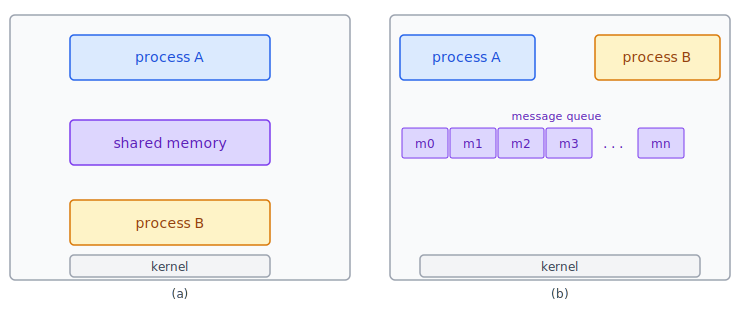
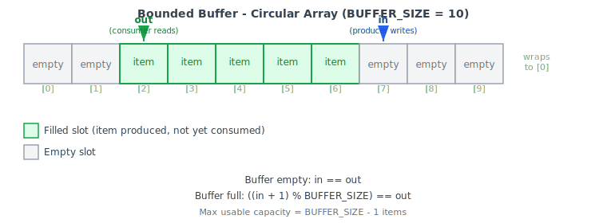

:::note
本系列文章內容參考自經典教材 **Operating System Concepts, 10th Edition (Silberschatz, Galvin, Gagne)**。本文對應章節：**Section 3.4 Interprocess Communication、Section 3.5 IPC in Shared-Memory Systems**。
:::

## **行程間的合作關係**

在作業系統中同時執行的行程 (Process)，可以分為兩種截然不同的類型：

- **獨立行程 (Independent Process)**：不與任何其他行程共享資料。這類行程的執行結果不受系統中其他行程的影響，也不影響其他行程。
- **合作行程 (Cooperating Process)**：能夠影響其他行程、或被其他行程影響。任何與其他行程共享資料的行程都屬於合作行程。

為什麼需要讓行程彼此合作？提供一個允許行程合作的環境，有以下幾個核心理由：

1. **資訊共享 (Information Sharing)**：多個應用程式可能需要存取同一份資料，例如剪貼簿的複製與貼上功能。作業系統必須提供允許多個行程並行存取這些共用資訊的環境。

2. **運算加速 (Computation Speedup)**：若希望某個任務執行得更快，可以將它拆解成多個子任務，讓各子任務在多個處理器核心上並行執行。注意：這個加速效果只有在電腦具備多個處理器核心 (Processing Cores) 時才能實現。

3. **模組化 (Modularity)**：將系統功能設計成獨立的行程或執行緒 (Thread)，使整個系統具有更清晰的模組結構，降低各部分之間的耦合度。

合作行程之間需要一個**行程間通訊 (Interprocess Communication, IPC)** 機制來交換資料，也就是讓行程能互相傳送與接收資料。

<br/>

## **3.4 IPC 的兩種基本模型**

IPC 有兩種基本模型：**共享記憶體 (Shared Memory)** 與**訊息傳遞 (Message Passing)**。

- **共享記憶體模型**：合作行程之間建立一塊共用的記憶體區域。行程透過對這塊共用區域的讀寫來交換資訊，資料的格式與存放位置完全由行程自行決定，作業系統幾乎不介入。
- **訊息傳遞模型**：作業系統提供一個訊息傳遞設施，讓合作行程透過互相交換訊息 (Message) 來通訊。資料搬移的工作由 OS 的核心 (Kernel) 負責處理。

下圖呈現兩種模型的架構對比：



圖中左側 (a) 是共享記憶體模型：Process A 與 Process B 的位址空間中共同包含一塊「shared memory」區域，兩者直接讀寫這塊記憶體來通訊，Kernel 僅在建立這塊共用區域時介入。右側 (b) 是訊息傳遞模型：Process A 與 Process B 不直接共用記憶體，而是透過 Kernel 維護的 message queue 傳送訊息，每次通訊都需要 Kernel 的介入。

這兩種模型各有其適用場景：

|  比較項目   |  訊息傳遞 (Message Passing)   |    共享記憶體 (Shared Memory)    |
| :---------: | :---------------------------: | :------------------------------: |
|   資料量    | 適合少量資料（避免競爭問題）  |    適合大量資料（讀寫速度快）    |
| 分散式系統  |          較容易實作           |  實作複雜（需分散式共享記憶體）  |
| Kernel 介入 |        每次通訊都需要         |      僅在建立共用區域時需要      |
|    效能     | 較慢（每次 System Call 開銷） | 較快（建立後存取如同一般記憶體） |

兩種模型都被廣泛實作於現代作業系統，許多系統同時支援兩者。訊息傳遞由於不需要衝突避免 (Conflict Avoidance)，實作較為簡單，在分散式系統中尤具優勢。共享記憶體一旦建立後，所有存取都被視為普通的記憶體存取，不需要 Kernel 介入，因此速度更快。

:::info Chrome 瀏覽器的多行程架構
Chrome 瀏覽器是行程合作概念的實際應用案例。許多網站包含 JavaScript、Flash、HTML5 等動態內容，若瀏覽器只用一個行程處理所有頁籤，任何一個分頁的網頁應用程式崩潰都會導致整個瀏覽器當掉。

Chrome 以多行程架構 (Multiprocess Architecture) 解決這個問題，識別出三種類型的行程：

- **Browser Process（瀏覽器行程）**：管理使用者介面、磁碟與網路 I/O。Chrome 啟動時建立一個，且只有一個。
- **Renderer Process（渲染行程）**：負責渲染網頁，處理 HTML、JavaScript、圖片等。一般而言，每個新分頁開啟時建立一個新的渲染行程，因此可能同時有多個渲染行程存在。
- **Plug-in Process（外掛行程）**：每種類型的外掛（如 Flash、QuickTime）各對應一個。包含外掛程式碼以及讓外掛與渲染行程、瀏覽器行程通訊的額外程式碼。

這個多行程設計的優點在於：各網站在互相隔離的環境中執行，若某個網站崩潰，只有對應的渲染行程受影響，其他行程維持正常運作。此外，渲染行程運行在**沙盒 (Sandbox)** 中，對磁碟和網路 I/O 的存取受到限制，也降低了安全漏洞的影響範圍。
:::

<br/>

## **3.5 共享記憶體 IPC 的運作方式**

### **共享記憶體區域的建立**

以共享記憶體進行 IPC，需要合作行程之間先建立一塊共用的記憶體區域。這塊共用區域通常駐留在建立它的行程的位址空間中，其他想要透過這塊共用區域通訊的行程，則必須將它附加 (Attach) 到自己的位址空間。

這裡有一個關鍵問題：作業系統正常情況下會阻止一個行程存取另一個行程的記憶體，以保護行程的位址空間不被任意讀寫。共享記憶體機制要求兩個或多個行程**主動同意移除這個限制**，才能讓彼此共用那塊記憶體區域。

一旦共享記憶體建立完成，幾件重要的事由行程自己負責，而非作業系統：

- **資料格式與存放位置**：由行程自行約定，OS 不管控。
- **寫入衝突的避免**：行程必須自行確保不會在同一時間向相同位置寫入，OS 不提供自動的保護機制（這個同步問題留待 Chapter 6、7 深入探討）。

### **Producer-Consumer Problem（生產者消費者問題）**

為了具體說明合作行程如何透過共享記憶體交換資料，教科書引入了**生產者消費者問題 (Producer-Consumer Problem)**，這是描述合作行程的經典範例。

考慮一個常見的場景：

1. **Producer（生產者）行程**持續產生資料，例如編譯器 (Compiler) 產生組合語言程式碼。
2. **Consumer（消費者）行程**持續消耗這些資料，例如組譯器 (Assembler) 讀取並處理編譯器產出的組合語言程式碼。
3. 同理，組譯器又成為生產者，產出目的模組 (Object Modules)，由連結器 (Loader) 作為消費者來讀取。

這個模式也對應到客戶端—伺服器範式 (Client-Server Paradigm)：伺服器可視為生產者（提供網頁內容），客戶端瀏覽器可視為消費者（請求並顯示網頁）。

**核心問題在於：** 生產者和消費者必須能夠並行執行，這表示需要一個中間的**緩衝區 (Buffer)**，讓生產者在消費者還沒取用完時就能繼續生產。這個緩衝區駐留在共享記憶體區域中，生產者負責填滿它，消費者負責取走其中的項目。

### **兩種緩衝區**

根據緩衝區是否有大小限制，有兩種設計：

- **無界緩衝區 (Unbounded Buffer)**：對緩衝區大小沒有實際限制。消費者可能需要等待新項目，但生產者永遠不需要等待，可以持續生產。
- **有界緩衝區 (Bounded Buffer)**：緩衝區大小固定。若緩衝區已空，消費者必須等待；若緩衝區已滿，生產者也必須等待。

Bounded Buffer 是實際系統中更常見的設計，也是下面具體實作的對象。

### **Bounded Buffer 的共享記憶體實作**

以下變數駐留在生產者行程與消費者行程共享的記憶體區域中：

```c
#define BUFFER_SIZE 10

typedef struct {
    // ...
} item;

item buffer[BUFFER_SIZE];  // 環形陣列
int in  = 0;               // 生產者的下一個寫入位置
int out = 0;               // 消費者的下一個讀取位置
```

共享緩衝區以**環形陣列 (Circular Array)** 實作，搭配兩個邏輯指標：

- **`in`**：指向緩衝區中下一個空閒位置，也是生產者下次要寫入的位置。
- **`out`**：指向緩衝區中第一個有資料的位置，也是消費者下次要讀取的位置。

下圖展示一個 `BUFFER_SIZE = 10` 的有界緩衝區，`out = 2`，`in = 7`，即 `[2]` 到 `[6]` 共五個位置有資料，其餘為空：



兩個關鍵判斷條件：

|     狀態      |              條件               | 說明                                                      |
| :-----------: | :-----------------------------: | :-------------------------------------------------------- |
| **Buffer 空** |           `in == out`           | `out` 追上 `in`，表示消費者已讀完所有資料                 |
| **Buffer 滿** | `(in + 1) % BUFFER_SIZE == out` | `in` 的下一個位置等於 `out`，再寫入就會覆蓋尚未消費的資料 |

:::info 為什麼最多只能存放 BUFFER_SIZE − 1 個項目？
判斷 Buffer 滿的條件是「`in` 的下一格 == `out`」，而非「`in == out`」。這是為了區分「Buffer 空」（`in == out`）和「Buffer 滿」兩種狀態：若允許填滿全部 BUFFER_SIZE 格，那 Buffer 全滿時 `in` 也會等於 `out`，與 Buffer 空的條件完全相同，無從區分。

> 代價是：緩衝區永遠有一格不被使用，實際可用容量為 `BUFFER_SIZE − 1` 個項目。
:::

### **生產者的程式碼**

```c
item next_produced;

while (true) {
    /* produce an item in next_produced */
    while (((in + 1) % BUFFER_SIZE) == out)
        ;  /* do nothing — buffer is full, spin wait */
    buffer[in] = next_produced;
    in = (in + 1) % BUFFER_SIZE;
}
```

生產者的邏輯分為三步：

1. 在區域變數 `next_produced` 中準備好一個新項目。
2. **忙等待 (Busy Wait / Spin Wait)**：若 Buffer 已滿，就反覆檢查直到有空位。
3. 將 `next_produced` 寫入 `buffer[in]`，並將 `in` 往前移一格（以 `BUFFER_SIZE` 取模，使其在 0 到 BUFFER_SIZE-1 之間循環）。

### **消費者的程式碼**

```c
item next_consumed;

while (true) {
    while (in == out)
        ;  /* do nothing — buffer is empty, spin wait */
    next_consumed = buffer[out];
    out = (out + 1) % BUFFER_SIZE;
    /* consume the item in next_consumed */
}
```

消費者的邏輯對應：

1. **忙等待**：若 Buffer 已空（`in == out`），就反覆檢查直到有資料。
2. 從 `buffer[out]` 讀取資料存入 `next_consumed`，並將 `out` 往前移一格。
3. 對 `next_consumed` 進行消費處理。

:::caution 這個實作尚未處理並行安全問題
單一 Producer 與單一 Consumer 各自只寫自己的指標（Producer 寫 `in`，Consumer 寫 `out`），表面上不存在寫入衝突，但在多核心系統上仍潛藏兩類風險：

- **記憶體可見性 (Memory Visibility)**：Producer 在 core 1 寫入 `buffer[in]` 後推進 `in`；Consumer 在 core 2 看到 `in` 已更新便去讀資料，但由於 CPU cache 的緣故，Producer 寫入的內容可能尚未同步到 core 2 的快取，Consumer 因此讀到舊值。
- **指令重排 (Instruction Reordering)**：編譯器或 CPU 為了效能最佳化，可能將推進 `in` 的操作提前到實際寫入 `buffer[in]` 之前。Consumer 看到 `in` 已移動便去讀，卻拿到尚未寫入的垃圾值。
- **多個 Producer 的情況**：兩個 Producer 同時讀到相同的 `in` 值，都決定寫 `buffer[in]`，其中一個的寫入被覆蓋，資料直接遺失。


如何在共享記憶體環境中有效解決上述同步問題，將在 Chapter 6（同步工具）和 Chapter 7（同步範例）中深入討論。
:::
