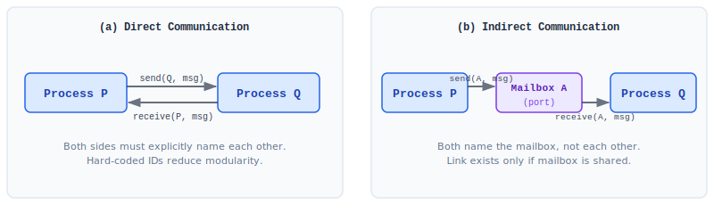
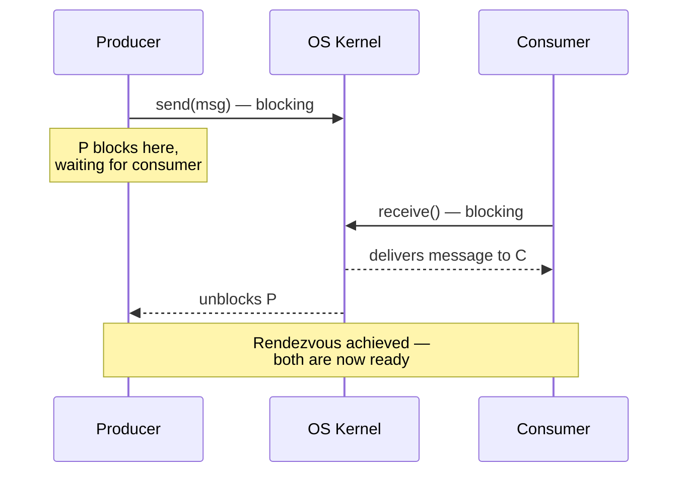
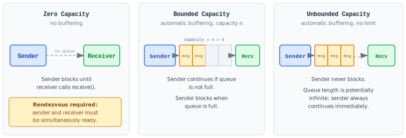

:::note
本系列文章內容參考自經典教材 **Operating System Concepts, 10th Edition (Silberschatz, Galvin, Gagne)**。本文對應章節：**Section 3.6 IPC in Message-Passing Systems**。
:::

## **訊息傳遞的核心概念**

在上一篇（Section 3.5）看到的共享記憶體 IPC，要運作需要滿足幾個前提：行程之間必須先建立一塊共用的位址空間區域，管理這塊區域讀寫的邏輯由應用程式設計師自行撰寫，且為了避免多個行程同時讀寫造成的**資料競爭 (Data Race)**，還需要額外的同步保護。這使得共享記憶體 IPC 在分散式系統 (Distributed System) 中幾乎不可行，因為若通訊的行程分別位於不同電腦上，根本無法共享同一塊實體記憶體。

**訊息傳遞 (Message Passing)** 提供了另一種途徑：由作業系統提供通訊設施，合作行程透過互相交換**訊息 (Message)** 來通訊。行程不需要共享位址空間，資料的搬移由 OS 核心 (Kernel) 負責，這讓訊息傳遞天然適用於分散式環境。

一個訊息傳遞設施至少提供兩個操作：

```
send(message)
receive(message)
```

訊息的大小可以是**固定大小 (Fixed-size)** 或**可變大小 (Variable-size)**，這是 OS 設計中常見的取捨：

- **固定大小訊息**：系統層實作較簡單，但程式設計較困難（程式設計師必須將資料切割成固定大小的片段）
- **可變大小訊息**：系統層實作較複雜，但程式設計較簡單

當行程 P 與行程 Q 想要通訊時，它們必須建立一條**通訊連結 (Communication Link)**，透過這條連結互相傳送與接收訊息。這條連結的物理實作（如共享記憶體、硬體匯流排、網路）並非重點，重點在於其**邏輯實作 (Logical Implementation)**，而邏輯實作涉及三個核心設計維度：

1. **命名 (Naming)**：行程如何識別彼此？
2. **同步 (Synchronization)**：`send()`/`receive()` 是否會使行程等待？
3. **緩衝 (Buffering)**：傳輸中的訊息最多可以積累幾則？

<br/>

## **3.6.1 命名 (Naming)**

訊息傳遞的第一個設計問題是：行程如何指定它要和誰通訊？有兩種截然不同的方式。

### **直接通訊 (Direct Communication)**

在直接通訊中，每個想要通訊的行程必須**明確點名**通訊對象。`send()` 與 `receive()` 的介面定義如下：

- `send(P, message)` — 傳送一則訊息給行程 P
- `receive(Q, message)` — 接收來自行程 Q 的一則訊息

這種方案下，通訊連結具有以下特性：

- **連結自動建立**：每一對想要通訊的行程之間，連結會自動建立，行程只需知道彼此的身份識別碼 (Identifier)
- **一連結對應恰好兩個行程**：每條連結只連接兩個行程
- **每對行程恰好只有一條連結**：任意兩個行程之間不會有多條連結

上述方案是**對稱定址 (Symmetric Addressing)**，因為發送方與接收方都必須點名對方。另有一種**非對稱定址 (Asymmetric Addressing)** 的變體：只有發送方需要點名接收方，接收方不需要知道發送方是誰：

- `send(P, message)` — 傳送訊息給行程 P（與對稱版本相同）
- `receive(id, message)` — 接收來自任何行程的訊息；`id` 會被設為實際發送方的行程名稱

兩種方案都有一個共同的根本缺陷：**模組化程度 (Modularity) 極低**。若某個行程的識別碼需要更改，就必須找出所有其他行程定義中對舊識別碼的參照，逐一修改。這種在程式碼中直接寫死識別碼的技術 (Hard-Coding) 比起使用間接指向的方案要脆弱許多。

### **間接通訊 (Indirect Communication)**

間接通訊以**信箱 (Mailbox)** 或**埠 (Port)** 作為中介，解決了直接通訊硬寫識別碼的問題。信箱是一個可以被行程放入訊息、也可以被行程取出訊息的物件，每個信箱都有唯一的識別碼（例如 POSIX 訊息佇列使用整數值來識別信箱）。`send()` 與 `receive()` 的介面改為：

- `send(A, message)` — 傳送一則訊息至信箱 A
- `receive(A, message)` — 從信箱 A 接收一則訊息

下圖對比直接通訊與間接通訊的結構差異：



左側 (a) 是直接通訊：Process P 呼叫 `send(Q, msg)` 時必須點名 Q，Process Q 呼叫 `receive(P, msg)` 時也必須點名 P，雙方都在對方的識別碼上形成硬性依賴。右側 (b) 是間接通訊：P 和 Q 都只與 Mailbox A 互動，雙方透過共享的信箱完成通訊，互不需要知道對方的名字。

間接通訊的連結具有以下特性：

- 只有當兩個行程**共享同一個信箱**時，連結才會建立
- 一條連結可以關聯**超過兩個行程**（多個行程可以向同一個信箱發送或接收）
- 同一對行程之間可以有**多條不同的連結**，每條連結對應到一個不同的信箱

**共享信箱的競爭問題**：假設行程 P₁、P₂、P₃ 都共享信箱 A，P₁ 送出一則訊息，P₂ 和 P₃ 同時呼叫 `receive(A, msg)`，哪一個行程會收到這則訊息？這個問題沒有固定答案，取決於系統採用哪種策略：

1. **限制連結最多關聯兩個行程**：信箱就只有一個可能的接收者，問題不存在
2. **限制同一時間只能有一個行程執行 `receive()`**：以互斥 (Mutual Exclusion) 解決競爭
3. **系統任意選擇接收者**：例如使用輪流 (Round Robin) 輪詢，讓行程輪流接收，並通知發送方實際是誰接收了訊息

### **信箱的擁有者 (Mailbox Ownership)**

信箱可以由**行程**或由**作業系統**擁有，兩者在生命週期與操作權限上有所不同：

|    擁有者    |      建立位置       |     擁有者可做的事     | 其他行程可做的事 |        生命週期        |
| :----------: | :-----------------: | :--------------------: | :--------------: | :--------------------: |
|   **行程**   |  行程的位址空間中   |   只能接收 (receive)   | 只能發送 (send)  | 隨擁有者行程結束而消失 |
| **作業系統** | OS 核心中，獨立存在 | 建立、發送、接收、刪除 |    由 OS 授權    | 獨立，不隨任何行程結束 |

**行程擁有的信箱**：信箱存放在擁有者行程的位址空間中。由於擁有者唯一，接收者始終明確，不會有「誰該收這則訊息」的歧義。當擁有者行程結束時，信箱隨之消失，後續仍試圖對它發送訊息的行程必須被通知信箱已不存在。

**作業系統擁有的信箱**：信箱不存放在任何行程的位址空間中，而是由 OS 核心統一管理，因此其生命週期完全獨立於任何行程。OS 提供一組系統呼叫，讓行程可以對信箱執行以下操作：

- **建立**新信箱
- 透過信箱**發送與接收**訊息
- **刪除**信箱

建立信箱的行程（指呼叫「建立」系統呼叫的那個行程，而非 OS 本身）預設成為這個信箱的**擁有者 (Owner)**，初始時只有擁有者有接收權。但擁有者可以透過後續的系統呼叫，將接收權轉讓給其他行程。若分別轉讓給 B、C 兩個行程，B 與 C 都能對同一個信箱呼叫 `receive()`，就回到了前面提到的「多個行程同時等待同一則訊息」的競爭問題，需要以先前所列的三種策略之一來解決。

<br/>

## **3.6.2 同步 (Synchronization)**

行程間的訊息傳遞透過呼叫 `send()` 和 `receive()` 原語 (Primitive) 來進行。設計上有一個關鍵問題：**這兩個操作應該讓呼叫行程等待嗎？**

訊息傳遞可以是**阻塞 (Blocking)** 或**非阻塞 (Nonblocking)**，也分別稱為**同步 (Synchronous)** 或**非同步 (Asynchronous)**：

|     操作      |       阻塞 (Blocking / Synchronous)        |       非阻塞 (Nonblocking / Asynchronous)       |
| :-----------: | :----------------------------------------: | :---------------------------------------------: |
|  **send()**   | 發送方等待，直到訊息被接收方或信箱收到為止 |          發送方送出訊息後立刻繼續執行           |
| **receive()** |         接收方等待，直到有訊息可用         | 接收方立刻取回一則有效訊息，若無訊息則取回 null |

`send()` 和 `receive()` 的四種模式可以任意組合，不同組合產生不同的語義。其中最重要的一種是：

**當 `send()` 和 `receive()` 都是阻塞時，就形成了 `Rendezvous（會合點）`：**



在 `Rendezvous` 語義下，發送方送出訊息後必須等待，直到接收方實際呼叫 `receive()` 將訊息取走；接收方則在沒有訊息時持續等待。兩個行程在通訊點上形成強制的同步點（會合），確保訊息交遞完成後雙方才各自繼續。

這種語義讓**生產者消費者問題 (Producer-Consumer Problem)** 的訊息傳遞版本變得極為簡單：

```c title="Producer using blocking send"
message next_produced;

while (true) {
    /* produce an item in next_produced */
    send(next_produced);   // blocks until consumer receives
}
```

```c title="Consumer using blocking receive"
message next_consumed;

while (true) {
    receive(next_consumed);   // blocks until producer sends
    /* consume the item in next_consumed */
}
```

和共享記憶體版本相比，程式碼不需要管理環形緩衝區、也不需要**忙等待 (Busy Wait)**，邏輯一目了然。代價是：發送方必須等待接收方，減少了並行度；若接收方處理速度慢，發送方大部分時間都在等待。

:::info Blocking vs Nonblocking 的選擇依據
選擇阻塞或非阻塞，取決於程式設計師對「通訊確定性」的需求：

- **阻塞 send** 能保證訊息在 `send()` 返回時已確實交遞，但若接收方遲遲不呼叫 `receive()`，發送方就一直卡住，整體效能下降。
- **非阻塞 send** 讓發送方繼續執行，但不知道訊息何時真正被接收，若接收方來不及消費，訊息可能在緩衝佇列中積壓。
- **非阻塞 receive** 讓接收方在沒有訊息時取回 null 而非等待，適合需要輪詢多個通訊管道的場景，但程式設計師需要自行處理「沒有訊息」的情況。
:::

<br/>

## **3.6.3 緩衝 (Buffering)**

無論通訊是直接還是間接，發送方與接收方之間必然需要某種方式來暫存傳輸中的訊息。這個暫存設施稱為**訊息佇列 (Message Queue)**，可以用三種方式實作，其差異在於佇列的容量限制：

下圖直觀展示三種緩衝模式的結構：



從左到右，三種佇列的行為差異如下：

1. **零容量 (Zero Capacity)**：佇列長度為零，連結中不能有任何等待中的訊息。若發送方先到，它必須等待，直到接收方呼叫 `receive()` 將訊息取走。這種模式要求雙方同時就緒，也就是必然形成 `Rendezvous`（見上節的 Mermaid 圖）。

2. **有界容量 (Bounded Capacity)**：佇列長度有限，最多可以存放 n 則訊息。若佇列未滿，發送方可以直接把訊息放入佇列後繼續執行；若佇列已滿，發送方必須等待直到佇列有空位。

3. **無界容量 (Unbounded Capacity)**：佇列長度在理論上無限大，任意數量的訊息都可以等待在佇列中。發送方永遠不需要等待。

這三種模式在教科書中有兩個統一術語：

- **零容量** → 又稱「**無緩衝 (No Buffering)**」：訊息不能在連結中停留，必須直接交遞
- **有界容量與無界容量** → 統稱「**自動緩衝 (Automatic Buffering)**」：OS 自動管理訊息佇列，行程不需要顯式建立共享緩衝區

下表整理三種模式的關鍵差異：

|           緩衝模式            |   佇列上限   |            發送方行為            |          同步特性           |
| :---------------------------: | :----------: | :------------------------------: | :-------------------------: |
|    零容量 (Zero Capacity)     |      0       | **必定阻塞**，直到接收方取走訊息 | 強制 Rendezvous（強制同步） |
|  有界容量 (Bounded Capacity)  | n 則（有限） | 佇列未滿時繼續；**佇列滿時阻塞** |  可非同步（佇列充當緩衝）   |
| 無界容量 (Unbounded Capacity) |  ∞（無限）   |          **永遠不阻塞**          |         完全非同步          |

:::info 緩衝模式與同步模式的關係
緩衝 (Buffering) 和同步 (Synchronization) 是兩個獨立的設計維度，但彼此緊密相關：

零容量必定對應 Rendezvous 語義，因為佇列中不能積壓訊息，發送方不等接收方就無法繼續。有界與無界容量讓發送方在一定程度上可以脫離接收方的節奏，發送後先把訊息放進佇列繼續執行，接收方之後再來取。非阻塞 `send()` 搭配無界佇列，是實際系統中追求高吞吐量時最常使用的組合；但如果接收方處理速度遠慢於發送速度，佇列會持續增長，最終耗盡系統記憶體。
:::
