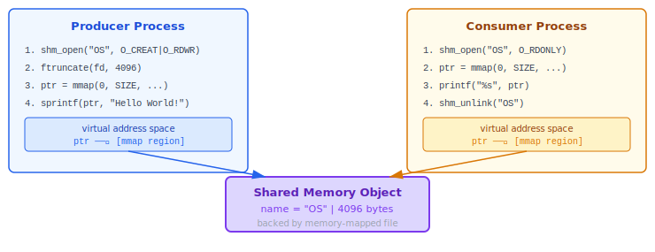
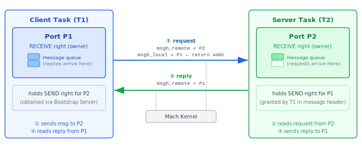
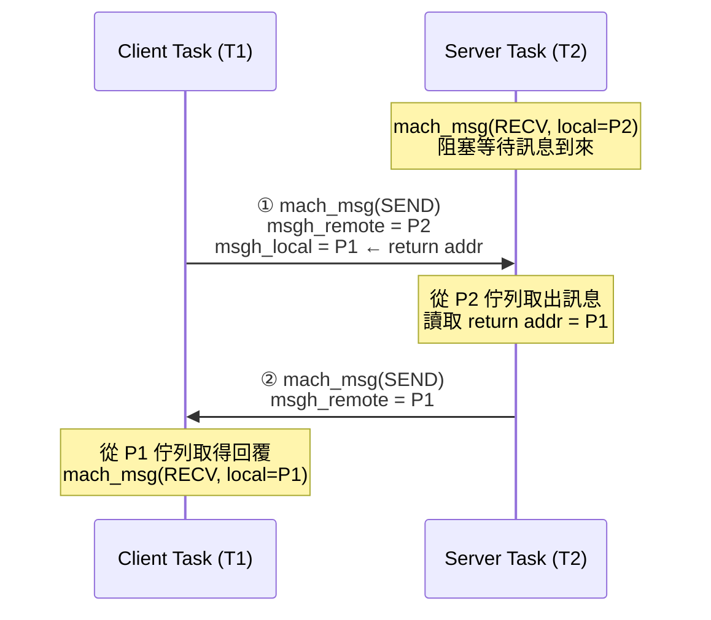
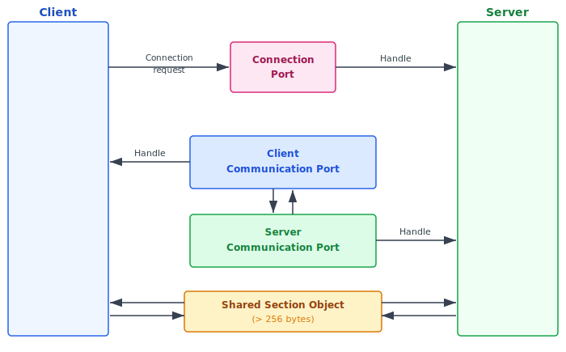
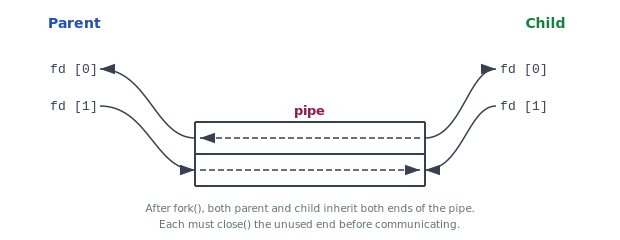

:::note
本系列文章內容參考自經典教材 **Operating System Concepts, 10th Edition (Silberschatz, Galvin, Gagne)**。本文對應章節：**Section 3.7 Examples of IPC Systems**。
:::

Section 3.4 與 3.5 介紹了 IPC 的兩種基本模型（共享記憶體與訊息傳遞）及抽象概念，Section 3.7 則以四個具體系統為例，說明這些模型在真實環境中的實作方式：

|        IPC 系統         |           模型           | 核心機制                                                 |
| :---------------------: | :----------------------: | :------------------------------------------------------- |
| **POSIX Shared Memory** |        共享記憶體        | 記憶體映射檔案，讓多個行程的虛擬位址指向同一塊實體記憶體 |
|        **Mach**         |         訊息傳遞         | 以 Port 為通訊端點，利用虛擬記憶體映射取代資料複製       |
|    **Windows ALPC**     | 訊息傳遞（含共享記憶體） | 依訊息大小自動選擇三種傳遞策略                           |
|        **Pipes**        |          資料流          | 最早的 UNIX IPC 機制，以檔案描述符為介面的單向資料通道   |

<br/>

## **3.7.1 POSIX 共享記憶體**

### **記憶體映射檔案的概念**

Section 3.5 介紹了共享記憶體的抽象概念：兩個行程必須建立一塊共用的記憶體區域才能通訊。但在實作層面有一個根本問題：**一個行程要如何「找到」另一個行程建立的記憶體區域？** 若直接分配記憶體，這塊區域只存在於建立它的行程的位址空間中，其他行程根本不知道要去哪裡找它。

POSIX 共享記憶體以**記憶體映射檔案 (Memory-Mapped File)** 解決這個問題：給共享記憶體區域一個**名稱 (Name)**，讓這個名稱像一個檔案一樣存在於系統中。任何行程只要知道這個名稱，就能透過 `mmap()` 將其映射到自己的虛擬位址空間，OS 會確保兩個行程的指標都指向同一塊實體記憶體。這樣一來，行程之間的通訊就等同於直接讀寫自己的記憶體，不需要 Kernel 中介，速度極快。

### **三個關鍵 API**

建立 POSIX 共享記憶體區域需要三個系統呼叫，每個負責不同的職責：

**第一步：建立（或開啟）共享記憶體物件**

```c
fd = shm_open(name, O_CREAT | O_RDWR, 0666);
```

`shm_open()` 的行為與 `open()` 開啟一般檔案完全相同，差別是它操作的對象是共享記憶體物件而非磁碟上的實體檔案。

- `name`：共享記憶體物件的識別名稱，其他行程必須用相同的名稱才能開啟同一塊共享記憶體。
- `O_CREAT | O_RDWR`：「若不存在則建立，開啟讀寫權限」。消費者行程用 `O_RDONLY` 以唯讀方式開啟。
- 呼叫成功後回傳一個整數**檔案描述符 (File Descriptor)**。

**第二步：設定大小**

```c
ftruncate(fd, 4096);
```

新建立的共享記憶體物件大小為零，必須用 `ftruncate()` 指定大小（此例為 4096 bytes）。

**第三步：映射到位址空間**

```c
ptr = (char *) mmap(0, SIZE, PROT_READ | PROT_WRITE, MAP_SHARED, fd, 0);
```

`mmap()` 將共享記憶體物件映射到行程的虛擬位址空間，回傳指標 `ptr`。之後對 `ptr` 的所有讀寫直接等同於對共享記憶體的讀寫，效率等同一般記憶體存取。`MAP_SHARED` 旗標確保對這塊記憶體的修改對所有共享此物件的行程立即可見。

下圖說明生產者與消費者各自呼叫 `mmap()` 後，兩個行程的虛擬指標如何指向同一塊共享記憶體物件：



生產者在自己的虛擬位址空間中取得一個 `ptr`，消費者也在自己的空間中取得另一個 `ptr`，但這兩個指標底層都映射到同一塊實體記憶體。生產者對 `ptr` 寫入的資料，消費者的 `ptr` 能直接讀到，整個過程完全不需要 Kernel 複製資料。這正是共享記憶體在大量資料傳輸時比訊息傳遞更有效率的原因。

### **Producer-Consumer 完整範例**

以下是生產者（建立共享記憶體並寫入字串）與消費者（讀取後移除物件）的完整程式碼。

**生產者：**

```c
const int SIZE = 4096;
const char *name = "OS";
int fd;
char *ptr;

/* 建立共享記憶體物件 */
fd = shm_open(name, O_CREAT | O_RDWR, 0666);
/* 設定大小 */
ftruncate(fd, SIZE);
/* 映射到位址空間 */
ptr = (char *) mmap(0, SIZE, PROT_READ | PROT_WRITE, MAP_SHARED, fd, 0);

/* 寫入資料：ptr 指標直接當成記憶體使用 */
sprintf(ptr, "%s", "Hello");
ptr += strlen("Hello");
sprintf(ptr, "%s", "World!");
```

**消費者：**

```c
const int SIZE = 4096;
const char *name = "OS";
int fd;
char *ptr;

/* 開啟已存在的物件（唯讀） */
fd = shm_open(name, O_RDONLY, 0666);
/* 映射到位址空間 */
ptr = (char *) mmap(0, SIZE, PROT_READ | PROT_WRITE, MAP_SHARED, fd, 0);
/* 讀取 */
printf("%s", (char *) ptr);
/* 移除共享記憶體物件 */
shm_unlink(name);
```

:::info shm_unlink() 的語意
`shm_unlink()` 移除共享記憶體物件的名稱，使其無法再被新行程開啟。但若仍有行程持有開啟的描述符或現有的映射，這塊記憶體的內容不會立即消失，直到所有行程都關閉或解除映射為止。這與 UNIX 檔案系統的 `unlink()` 語意相同：刪除名稱，但保留資料直到所有參考都結束。
:::

<br/>

## **3.7.2 Mach 訊息傳遞**

### **Mach 的設計哲學**

Mach 是一個專為**分散式系統 (Distributed Systems)** 設計的作業系統核心，後來也被證明適用於桌上型與行動裝置（macOS 和 iOS 都以 Mach Kernel 為基礎，如 Section 2.8 所述）。Mach 的核心設計原則是：**幾乎所有通訊都透過訊息傳遞完成**，包括所有行程間（在 Mach 中稱為 Task 間）的互動。

:::info Task 與 Process 的差異
Mach 中的 **Task** 類似於一般作業系統的行程，但包含多個執行緒 (Thread) 且關聯的資源較少。可以把 Task 想像成輕量化的行程容器，內部的多個執行緒共享 Task 的所有資源，包括 Port Rights。
:::

### **Port 與 Port Rights**

Mach 以 **Port（通訊埠）** 作為訊息傳遞的端點。理解 Port 最直觀的方式，是把它想像成一個實體**郵箱 (Mailbox)**：

- **郵箱本身（Port）** 屬於能「拿鑰匙開信箱、取出信件」的那個人。
- **其他人持有的投件權限**讓他們能「把信件投入信箱門縫」，但無法開箱讀信。

這個比喻對應到 Mach 的 **Port Rights（通訊埠權限）** 機制：

|          Port Right           | 對應郵箱比喻 | 說明                                                                                                                                               |
| :---------------------------: | :----------: | :------------------------------------------------------------------------------------------------------------------------------------------------- |
| **`MACH_PORT_RIGHT_RECEIVE`** |   信箱鑰匙   | 持有此權限才能從 Port 取出（接收）訊息。**同一個 Port 只能有一個** RECEIVE right 持有者，即 Port 的唯一擁有者 (owner)，也就是建立這個 Port 的 Task |
|  **`MACH_PORT_RIGHT_SEND`**   |   投件權限   | 持有此權限才能向 Port 放入（傳送）訊息。擁有者可以把這個權限**授予給任意多個** Task                                                                |

Port Rights 的範圍是 Task 層級，同一個 Task 內的所有執行緒共享相同的 Port Rights。

**「多對一」的直覺解釋**

Port 的所有特性都源於「一把鑰匙、多個投件人」這個設計：

- **一個接收者（one receiver）**：RECEIVE right 只有一份，只有 Port 的擁有者能讀訊息，這就是「一」的那一側。
- **多個傳送者（many senders）**：SEND right 可以被分發給任意多個 Task，這些 Task 的訊息都會依序進入 Port 的訊息佇列。這就是「多」的那一側。

:::tip 現實場景：
Server Task 建立 Port P_server 並持有 RECEIVE right（信箱擁有者）。System 透過 Bootstrap Server 讓所有 Client 都拿到 P_server 的 SEND right（投件權限）。每個 Client 都能向 P_server 投送請求，所有請求依序排入 Queue，但只有 Server 自己能逐一取出並處理。這正是「多個 Client 對應一個 Server Port」的結構。
:::

**Port 的其他特性**

- **有限大小 (Finite)**：訊息佇列的容量有限，若已滿，傳送方必須等待或選擇其他策略（後面會介紹四種選項）。
- **單向 (Unidirectional)**：一個 Port 只能「從外部收進訊息、擁有者讀出訊息」，資料流只有一個方向。若要雙向通訊，**必須建立兩個 Port**，一個給 T1 接收、另一個給 T2 接收。

以具體場景說明：Task T1 擁有 Port P1，它要傳訊息給 Task T2 擁有的 Port P2，並期望 T2 回覆。T1 必須先將 P1 的 `MACH_PORT_RIGHT_SEND` 授予 T2，T2 才有權限回覆到 P1。

下圖展示這個雙 Port 通訊模型的完整結構：T1 持有 P1（RECEIVE right）並持有 P2 的 SEND right；T2 持有 P2（RECEIVE right）並持有 P1 的 SEND right（由 T1 在訊息 Header 中授予）：



圖中兩支箭頭揭示了 Mach 雙向通訊的核心機制：T1 傳送訊息時，在 `msgh_remote_port` 填入目的地 P2，同時在 `msgh_local_port` 填入自己的 P1 作為「回信地址 (return address)」。T2 收到訊息後，從 Header 讀取這個回信地址，再用它向 P1 傳送回覆。這正是為什麼 Mach 的雙向通訊必須使用**兩個 Port**：一個接收請求，另一個接收回覆，兩者方向不同，各自有獨立的 RECEIVE 所有權。

### **系統保留 Port**

每個 Task 建立時，Mach Kernel 自動建立兩個特殊 Port：

|        Port        | 用途                                                                     |
| :----------------: | :----------------------------------------------------------------------- |
| **Task Self Port** | Kernel 持有此 Port 的接收權，允許 Task 傳訊息給 Kernel（用於系統呼叫等） |
|  **Notify Port**   | Task 持有此 Port 的接收權，Kernel 可透過此 Port 傳送事件通知給 Task      |

### **Port 的建立**

以 `mach_port_allocate()` 建立一個新 Port 並分配其訊息佇列空間：

```c
mach_port_t port;  // Port 的名稱（整數值，類似 UNIX 的 file descriptor）

mach_port_allocate(
    mach_task_self(),           // 指向自身 Task
    MACH_PORT_RIGHT_RECEIVE,    // 建立具有接收權的 Port
    &port                       // 回傳 Port 名稱
);
```

Port 的「名稱」是一個簡單的整數值，行為就像 UNIX 的 file descriptor。每個 Task 還有一個 **Bootstrap Port**，可透過它向系統全域的 Bootstrap Server 登記 Port，讓其他 Task 查詢後取得傳送訊息所需的權限。

### **訊息結構**

Mach 訊息由兩部分組成：

|        部分        |   大小   | 內容                                                   |
| :----------------: | :------: | :----------------------------------------------------- |
| **Header（標頭）** | 固定大小 | 訊息大小、來源 Port、目的地 Port 等後設資料 (Metadata) |
|  **Body（本體）**  | 可變大小 | 實際資料                                               |

訊息分為兩種類型：

- **Simple Message（簡單訊息）**：本體包含普通的非結構化使用者資料，Kernel 不解讀其內容。
- **Complex Message（複雜訊息）**：本體可包含指向記憶體位址的指標（稱為 "out-of-line" 資料），或用於轉移 Port Rights 給另一個 Task。Out-of-line 資料特別適合傳輸大量資料：不需複製資料本身，只需傳遞一個指標，接收方自行從指定位址讀取。

### **訊息傳送與接收：mach_msg()**

`mach_msg()` 是 Mach 訊息傳遞的標準 API，同時用於傳送與接收，透過參數旗標 `MACH_SEND_MSG` 或 `MACH_RCV_MSG` 決定操作方向：

```c
/* Client：建立並傳送訊息 */
struct message msg;
msg.header.msgh_size        = sizeof(msg);
msg.header.msgh_remote_port = server;  // 目的地 Port
msg.header.msgh_local_port  = client;  // 回覆用 Port（"return address"）

mach_msg(&msg.header,
         MACH_SEND_MSG,               // 傳送操作
         sizeof(msg),                  // 傳送訊息的大小
         0,                            // 接收緩衝大小（傳送時不需要）
         MACH_PORT_NULL,               // 接收用 Port（傳送時不需要）
         MACH_MSG_TIMEOUT_NONE,        // 不設逾時
         MACH_PORT_NULL);              // 不需要 Notify Port

/* Server：接收訊息 */
mach_msg(&msg.header,
         MACH_RCV_MSG,                // 接收操作
         0,                            // 傳送大小（接收時不需要）
         sizeof(msg),                  // 接收緩衝的最大大小
         server,                       // 要在哪個 Port 上等待
         MACH_MSG_TIMEOUT_NONE,
         MACH_PORT_NULL);
```

呼叫 `mach_msg()` 後，內部會呼叫 `mach_msg_trap()` 這個系統呼叫進入 Kernel 模式，完成實際的訊息傳遞。Header 中的 `msgh_local_port` 欄位作為「回信地址」傳給接收方，接收方可以用它向傳送方回覆。

以下序列圖展示 Client 與 Server 之間一次完整的請求—回覆交換流程，以及每個步驟對應的 `mach_msg()` 呼叫：



實際通訊並非 T1 和 T2 直接連線，Kernel 在兩者之間負責把訊息放入對應的 Port 佇列，再喚醒等待中的接收方。序列圖以 T1 → T2 的箭頭簡化表示這個「透過 Kernel 轉送」的過程。

### **Port Queue 已滿時的四種選項**

若目的地 Port 的訊息佇列已滿，`mach_msg()` 的行為由參數控制，有四種選項：

1. **無限等待**：阻塞直到佇列有空位。
2. **有限等待**：等待最多 n 毫秒，逾時後返回錯誤。
3. **立刻返回**：不等待，直接返回失敗。
4. **暫時快取**：將訊息交給 OS 暫存，待佇列有空位後 OS 自動送出，並傳送一則通知訊息給傳送方。每個傳送方執行緒最多只能有一則訊息在此暫存狀態中等待。

第四種選項是為 Server Task 設計的：Server 處理完一個請求後可能需要回覆，但不能因為 Reply Port 已滿而停下來等待，否則其他請求也得不到服務。這個「暫時快取」機制讓 Server 能繼續處理新請求，由 OS 在背景完成回覆訊息的最終送達。

### **虛擬記憶體優化：避免資料複製**

傳統訊息系統的效能瓶頸在於**資料複製**：訊息必須從傳送方的緩衝區複製到接收方的緩衝區，既消耗記憶體也消耗 CPU 時間。

Mach 利用**虛擬記憶體管理 (Virtual Memory Management)** 技術解決這個問題：不真正複製訊息內容，而是把含有訊息的傳送方**位址空間區段**直接映射 (Map) 到接收方的位址空間中。兩者實際上存取的是同一塊實體記憶體，訊息從未被複製過。這個技術帶來大幅的效能提升，但僅適用於同一機器內的訊息傳遞（Intrasystem Messages）；跨機器的分散式通訊仍需進行實際的網路傳輸。

<br/>

## **3.7.3 Windows IPC (ALPC)**

Windows 採用模組化設計，提供多種作業環境（Subsystem）。應用程式透過**訊息傳遞機制**與各子系統伺服器通訊，從這個角度看，應用程式是子系統伺服器的客戶端。

Windows 的本地訊息傳遞設施稱為 **ALPC（Advanced Local Procedure Call，進階本地程序呼叫）**，專門用於同一台機器上兩個行程之間的通訊。概念上類似廣泛使用的 **RPC（Remote Procedure Call，遠端程序呼叫）**，但針對 Windows 本地通訊進行了優化。

### **Connection Ports 與 Communication Ports**

ALPC 以 **Port 物件 (Port Object)** 建立與維護行程間的連線，有兩種類型：

- **Connection Port（連線埠）**：由 Server 行程公開，所有行程均可見。Client 向 Connection Port 發送連線請求，作為通訊的起點。
- **Communication Port（通訊埠）**：Server 接受連線後建立一個私有的通訊通道 (Channel)，通道包含一對 Communication Ports，一個給 Client，另一個給 Server，後續的所有訊息都透過這對 Communication Ports 傳送。

通訊通道還支援**回呼機制 (Callback Mechanism)**，允許 Client 與 Server 在預期等待回覆時也能接受對方發來的請求，增加通訊的靈活性。

下圖展示 ALPC 從連線建立到訊息傳遞的完整結構：



圖中 Client 向 Server 的 Connection Port 發送連線請求（圖上方的箭頭），Server 建立通道並回傳 Handle：Client 得到 Client Communication Port 的 Handle，Server 持有 Server Communication Port 的 Handle。此後兩端透過這對 Communication Ports 互相傳送訊息。若訊息超過 256 bytes，通道另外提供 Shared Section Object（下方黃色區塊）讓兩端存取同一塊記憶體，避免資料複製。

### **三種訊息傳遞技術**

ALPC 通道建立時，依照預期訊息大小選擇三種技術之一：

1. **Port Message Queue（訊息佇列）**：適用於小訊息（≤ 256 bytes）。訊息直接複製到 Port 的訊息佇列，由 OS 負責搬移到接收行程。
2. **Section Object（共享記憶體區段）**：適用於大訊息（> 256 bytes）。Server 或 Client 建立一塊共享記憶體區域 (Section Object) 作為通道的一部分，傳送時只傳遞一個包含指標與大小資訊的小訊息，接收方直接從共享記憶體讀取，避免複製大量資料。
3. **直接讀寫 (Direct Read/Write)**：適用於資料量超大到不適合用 Section Object 的情況。Server 行程直接讀寫 Client 的位址空間，省去 Section Object 的建立開銷。

Client 在建立通道時就決定是否需要 Section Object；若 Server 預期回覆訊息也很大，Server 也可以建立自己的 Section Object。

:::info ALPC 對應用程式不可見
ALPC 不是 Windows API 的一部分，應用程式無法直接呼叫它。應用程式使用 Windows API 發出的 RPC 呼叫，當目標是同一機器上的行程時，Windows 內部自動透過 ALPC 處理。許多 Kernel 服務也使用 ALPC 與客戶端行程通訊。
:::

<br/>

## **3.7.4 Pipes（管線）**

Pipe 是最早的 UNIX IPC 機制之一，提供兩個行程之間**資料流通訊 (Stream Communication)** 的方式。與共享記憶體不同，Pipe 不讓行程直接讀寫對方的記憶體，而是由 OS 提供一個**單向資料通道**：資料從一端寫入，從另一端讀出，OS 自動處理緩衝與同步。

### **Pipe 的四個設計考量**

在設計或選擇 Pipe 時，必須回答以下四個問題：

1. **通訊方向**：Pipe 是單向 (Unidirectional) 還是雙向 (Bidirectional)？
2. **雙工模式**：若允許雙向通訊，是半雙工 (Half-Duplex，同一時間只能一個方向傳輸) 還是全雙工 (Full-Duplex，兩個方向可同時傳輸)？
3. **行程關係**：通訊的兩端行程是否必須存在親子關係 (Parent-Child Relationship)？
4. **網路支援**：Pipe 只能在同一台機器上的行程間使用，還是可以跨網路？

不同類型的 Pipe 對這四個問題有不同的答案，後面的比較表會整理這些差異。

<br/>

### **Ordinary Pipes（普通管線）**

Ordinary Pipe 是最基本的 Pipe 形式，允許兩個行程以**生產者—消費者 (Producer-Consumer)** 模式通訊：生產者從 write end 寫入資料，消費者從 read end 讀取資料。

Ordinary Pipe 的關鍵限制是：**它是單向的，且只能在有親子關係的行程間使用**。若需要雙向通訊，必須建立兩個 Pipe，各負責一個方向。

#### **UNIX 的 Ordinary Pipe**

UNIX 系統以 `pipe()` 函式建立 Ordinary Pipe：

```c
pipe(int fd[]);
```

`pipe()` 建立一個 Pipe，並透過兩個**檔案描述符 (File Descriptor)** 存取：

- `fd[0]`：**read end（讀取端）**，消費者從這裡讀資料
- `fd[1]`：**write end（寫入端）**，生產者向這裡寫資料

UNIX 把 Pipe 視為一種特殊檔案，因此可以直接用 `read()` 和 `write()` 系統呼叫操作，無需學習新的 API。

Ordinary Pipe 無法在建立它的行程以外被存取。典型用法是：父行程先呼叫 `pipe()` 建立 Pipe，再呼叫 `fork()` 建立子行程；由於子行程從父行程繼承所有已開啟的檔案（包括 Pipe），父子行程因此共享這條 Pipe 的兩個端口。

下圖展示 `fork()` 後父子行程與 Pipe 檔案描述符的關係：



`fork()` 之後，父行程與子行程都各自持有 `fd[0]`（read end）和 `fd[1]`（write end）這兩個描述符，且都指向同一條 Pipe。若要讓父行程寫入、子行程讀取，每一方都必須**關閉自己不使用的那一端**：父行程關閉 `fd[0]`（read end），子行程關閉 `fd[1]`（write end）。

這個步驟之所以**必要**，而非只是好習慣，原因在於 Pipe 的 **EOF 語意**：`read()` 只有在 Pipe 的**所有** write end 描述符都關閉後，才會回傳 0（end-of-file），讀取方才能得知資料已全部傳輸完畢。以上述「父行程寫入、子行程讀取」的情境為例：即使父行程寫完後關閉了自己的 `fd[1]`，若子行程沒有事先關閉自己的 `fd[1]`，Pipe 仍有一個 write end 開著（子行程自己手上的那個），系統認為隨時可能再有資料寫入，子行程的 `read()` 就永遠收不到 EOF，導致永遠阻塞。

以下是完整範例（父行程寫入 "Greetings"，子行程讀取並列印）：

```c
#define BUFFER_SIZE 25
#define READ_END    0
#define WRITE_END   1

int main(void) {
    char write_msg[BUFFER_SIZE] = "Greetings";
    char read_msg[BUFFER_SIZE];
    int fd[2];
    pid_t pid;

    if (pipe(fd) == -1) {
        fprintf(stderr, "Pipe failed");
        return 1;
    }

    pid = fork();

    if (pid > 0) {          /* parent: writes to pipe */
        close(fd[READ_END]);
        write(fd[WRITE_END], write_msg, strlen(write_msg) + 1);
        close(fd[WRITE_END]);
    } else {                /* child: reads from pipe */
        close(fd[WRITE_END]);
        read(fd[READ_END], read_msg, BUFFER_SIZE);
        printf("read %s", read_msg);
        close(fd[READ_END]);
    }
    return 0;
}
```

#### **Windows 的 Ordinary Pipe（Anonymous Pipe）**

Windows 的 Ordinary Pipe 稱為 **Anonymous Pipe（匿名管線）**，行為與 UNIX 版本相似：單向傳輸，需要親子行程關係，讀寫使用 `ReadFile()` 與 `WriteFile()`。

建立 Anonymous Pipe 使用 `CreatePipe()` 函式，接受四個參數：
1. read handle（讀取端 Handle）的輸出參數
2. write handle（寫入端 Handle）的輸出參數
3. `SECURITY_ATTRIBUTES` 結構，用於設定子行程是否可繼承這些 Handle
4. Pipe 的大小（bytes）

與 UNIX 不同，Windows 子行程不會自動繼承父行程的 Handle，程式設計師必須明確在 `SECURITY_ATTRIBUTES` 中設定允許繼承，並在 `CreateProcess()` 中傳入 `TRUE` 告知新行程可繼承指定 Handle。由於 Anonymous Pipe 是半雙工，父行程還必須使用 `SetHandleInformation()` 禁止子行程繼承 write end 的 Handle，確保 Pipe 的方向性。

<br/>

### **Named Pipes（具名管線）**

Ordinary Pipe 只能在有親子關係的行程間使用，且僅在通訊期間存在，行程結束後 Pipe 就消失。**Named Pipe（具名管線）** 突破了這兩個限制。

Named Pipe 的核心優勢在於**擁有一個在檔案系統中可見的名稱**：任何知道這個名稱的行程都可以開啟它，無需親子關係，也不需要在同一個 Session 中。一個 Named Pipe 可以有多個寫入方，且在所有通訊行程結束後仍繼續存在，直到被明確刪除為止。

#### **UNIX 的 Named Pipe（FIFO）**

UNIX 系統中，Named Pipe 稱為 **FIFO**，以 `mkfifo()` 系統呼叫建立。FIFO 在檔案系統中以一般檔案的形式出現，可用 `open()`、`read()`、`write()`、`close()` 操作，直到被明確 `unlink()` 刪除為止。

UNIX FIFO 的限制：

- **半雙工**：雖然可以雙向通訊，但同一時間只能一個方向傳輸。若需要真正的雙向通訊，通常建立兩個 FIFO。
- **僅限同一機器**：通訊行程必須在同一台機器上。若需要跨機器通訊，必須使用 Socket（Section 3.8.1）。
- **位元組導向 (Byte-Oriented)**：只能傳輸位元組串流，不支援訊息邊界。

#### **Windows 的 Named Pipe**

Windows 的 Named Pipe 功能比 UNIX 版本豐富：

- 支援**全雙工 (Full-Duplex)**：兩個方向可同時傳輸。
- 支援**跨網路通訊**：通訊行程可在同一台或不同機器上。
- 既支援**位元組導向**也支援**訊息導向 (Message-Oriented)** 資料：訊息導向模式下接收方能取得完整的訊息單元，而非需要自己從位元組串流中拆解。

Windows Named Pipe 以 `CreateNamedPipe()` 建立，客戶端以 `ConnectNamedPipe()` 連接，讀寫使用 `ReadFile()` 和 `WriteFile()`。

### **Ordinary Pipe 與 Named Pipe 的比較**

|   比較項目   | Ordinary Pipe  | Named Pipe (UNIX FIFO) | Named Pipe (Windows) |
| :----------: | :------------: | :--------------------: | :------------------: |
|   **壽命**   |  僅在通訊期間  |      直到明確刪除      |     直到明確刪除     |
| **行程關係** | 必須有親子關係 |         不需要         |        不需要        |
| **通訊方向** |      單向      |         半雙工         |        全雙工        |
|  **跨網路**  |     不支援     |         不支援         |         支援         |
| **資料模式** |     位元組     |         位元組         |     位元組或訊息     |

### **Pipes 在實務中的應用**

Pipe 在 UNIX 命令列環境中極為普遍。Shell 以 `|` 符號將一個命令的標準輸出直接連到下一個命令的標準輸入，每個命令是一個獨立行程，行程之間以 Pipe 連結：

```bash
ls | less
```

`ls` 是生產者（將目錄列表寫入 Pipe 的 write end），`less` 是消費者（從 read end 讀取內容逐頁顯示）。Windows 命令提示字元也支援相同的 `|` 語法（例如 `dir | more`），概念完全一致。
