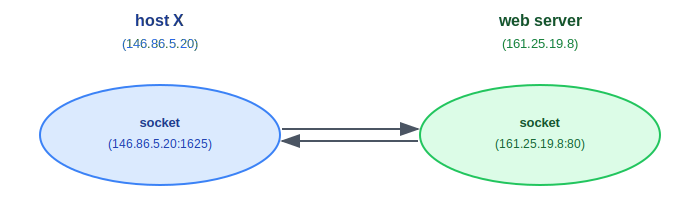
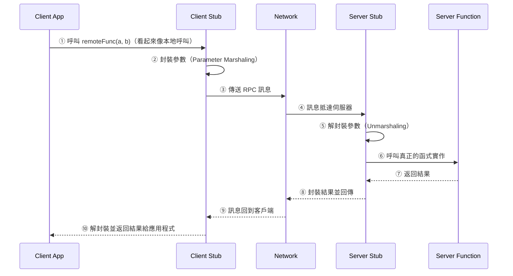
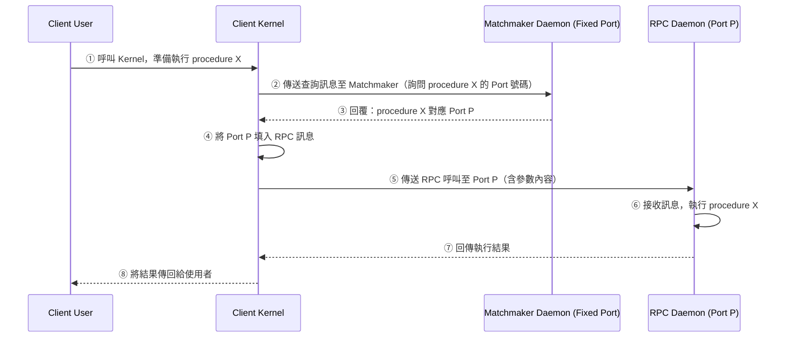

:::note
本系列文章內容參考自經典教材 **Operating System Concepts, 10th Edition (Silberschatz, Galvin, Gagne)**。本文對應章節：**Section 3.8 Communication in Client-Server Systems**。
:::

Section 3.4 與 3.5 介紹了 IPC 的兩大基本模型（共享記憶體與訊息傳遞），而 Section 3.7 則展示了它們在真實系統中的具體實作（POSIX 共享記憶體、Mach、ALPC、Pipe）。這些機制有一個共同的前提：**通訊的兩個行程必須在同一台機器上**。

Client-Server 系統突破了這個限制，客戶端與伺服器往往分別執行在不同機器上，透過網路通訊。Section 3.8 介紹兩種專為此場景設計的通訊策略：

|               機制               | 層次  | 核心概念                                              |
| :------------------------------: | :---: | :---------------------------------------------------- |
|            **Socket**            | 低層  | 以 IP 位址＋Port 號碼標識通訊端點，傳輸原始位元組串流 |
| **RPC（Remote Procedure Call）** | 高層  | 將遠端函式呼叫偽裝成本地呼叫，隱藏網路通訊細節        |

值得注意的是，這兩種機制雖然以 Client-Server 網路通訊為設計初衷，但 Android 操作系統也將 RPC 用於**同一裝置上**不同行程之間的 IPC，展示了這套抽象的通用性。

<br/>

## **3.8.1 Socket（通訊端點）**

### **為什麼需要 Socket？**

以一個具體場景來思考：一台客戶端電腦（host X）想向一台網頁伺服器請求資料。這時面臨兩個定址問題：

1. **機器在哪裡？** 用 **IP 位址 (IP Address)** 識別網路上的機器。
2. **機器上哪個服務？** 同一台機器可能同時執行 HTTP、FTP、SSH 等多個服務。只有 IP 不夠，還需要知道要連到哪個服務。

**Socket（通訊端點）** 是解決這兩個問題的抽象：一個 Socket 定義為**通訊的端點 (Endpoint for Communication)**，以 **IP 位址連接 Port 號碼** 來唯一識別。兩個行程通訊時，各自擁有一個 Socket，組成一對 Socket Pair。

### **Port 號碼與定址規則**

**Port（通訊埠）** 是一個介於 0 到 65535 的數字，附加在 IP 位址後面，告知作業系統應將網路封包遞送給哪個行程（或哪個服務）。

Port 號碼分為兩類：

|       範圍       |      類型       | 說明                                       |
| :--------------: | :-------------: | :----------------------------------------- |
|   **0 – 1023**   | Well-Known Port | 保留給標準服務，需要管理員權限才能綁定     |
| **1024 – 65535** |    可用 Port    | 一般行程可使用；客戶端連線時由 OS 動態分配 |

常見的 Well-Known Port 對應關係：

|   Port   |           服務           |
| :------: | :----------------------: |
|  **22**  |           SSH            |
|  **21**  |           FTP            |
|  **80**  |    HTTP（網頁伺服器）    |
| **443**  |          HTTPS           |
| **6013** | 自訂服務（教科書範例用） |

### **Socket 通訊流程**

以下是 host X 與網頁伺服器建立 Socket 連線的具體場景：

1. 網頁伺服器（IP 位址：161.25.19.8）的 HTTP 服務持續在 Port 80 上等待（listening）連線請求。
2. host X（IP 位址：146.86.5.20）的行程發起連線請求，OS 為它動態分配一個空閒 Port，假設是 Port 1625。
3. 連線建立後，形成一對 Socket：`146.86.5.20:1625`（客戶端）和 `161.25.19.8:80`（伺服器端）。
4. 網路封包在兩者之間傳送時，依據**目的地 Port 號碼**決定要遞送給哪個行程。

下圖說明這對 Socket 的結構：



左側是 host X，其 Socket 以 IP:Port 組合 `146.86.5.20:1625` 標識；右側是網頁伺服器，其 Socket 以 `161.25.19.8:80` 標識。兩個 Socket 之間建立雙向連線，所有往來封包都以這對 Socket 位址作為路由依據。

**所有連線必須是唯一的 (Unique)**。若 host X 上同時有另一個行程也想連到同一台網頁伺服器，OS 會為它分配一個不同的 Port（例如 Port 1626），確保每對 Socket 在全網路範圍內是唯一的。

### **Java Socket 的三種類型**

雖然 Socket 程式設計在 C/C++ 中相對底層，Java 提供了更易用的封裝介面。Java 定義了三種 Socket 類別：

|       Java 類別       |      協定       | 說明                                                      |
| :-------------------: | :-------------: | :-------------------------------------------------------- |
|     **`Socket`**      | TCP（連線導向） | 建立可靠、有順序的連線；資料保證送達                      |
| **`DatagramSocket`**  |  UDP（無連線）  | 傳送獨立的封包，不保證送達或順序，但效率較高              |
| **`MulticastSocket`** |  UDP Multicast  | `DatagramSocket` 的子類別，允許同一份資料傳送給多個接收者 |

### **Date Server/Client 範例：TCP Socket 的運作**

以下用一個具體範例說明 TCP Socket 的完整通訊流程：一個 Date Server 持續監聽 Port 6013，任何客戶端連線後，伺服器回傳目前的日期與時間。

**伺服器端（DateServer）：**

```java
import java.net.*;
import java.io.*;

public class DateServer {
    public static void main(String[] args) {
        try {
            ServerSocket sock = new ServerSocket(6013); // 在 Port 6013 監聽
            while (true) {
                Socket client = sock.accept();           // 阻塞等待，直到客戶端連線
                PrintWriter pout = new PrintWriter(client.getOutputStream(), true);
                pout.println(new java.util.Date().toString()); // 傳送日期字串
                client.close();                          // 關閉此次連線，繼續等待下一個
            }
        } catch (IOException ioe) {
            System.err.println(ioe);
        }
    }
}
```

伺服器建立一個 `ServerSocket` 並呼叫 `accept()` 方法阻塞等待。一旦有客戶端發起連線，`accept()` 返回一個代表此連線的 `Socket` 物件，伺服器透過它的輸出串流將日期字串寫給客戶端，完成後關閉連線，隨即繼續在迴圈中等待下一個請求。

**客戶端（DateClient）：**

```java
import java.net.*;
import java.io.*;

public class DateClient {
    public static void main(String[] args) {
        try {
            Socket sock = new Socket("127.0.0.1", 6013); // 連線到本機 Port 6013
            InputStream in = sock.getInputStream();
            BufferedReader bin = new BufferedReader(new InputStreamReader(in));
            String line;
            while ((line = bin.readLine()) != null)
                System.out.println(line);
            sock.close();
        } catch (IOException ioe) {
            System.err.println(ioe);
        }
    }
}
```

客戶端建立一個 `Socket` 並連線到指定 IP 與 Port。連線建立後，從 Socket 的輸入串流讀取資料（也就是伺服器寫入的日期字串），列印後關閉 Socket。

:::info IP 位址 127.0.0.1：Loopback（回路位址）
`127.0.0.1` 是一個特殊的 IP 位址，稱為 **Loopback（回路位址）**，意思是「本機自己」。當電腦向 `127.0.0.1` 發送封包時，封包不會真的進入網路，而是由 OS 直接回送給自己。這讓開發者可以在同一台機器上測試 Client-Server 程式，不需要兩台電腦。範例中的 IP 也可以換成實際執行 DateServer 的遠端主機 IP，或 `www.westminstercollege.edu` 這樣的主機名稱。
:::

### **Socket 的本質限制**

Socket 雖然通用，卻是**低層 (Low-Level)** 的通訊方式。Socket 只允許在兩個通訊端之間傳輸**原始的、無結構的位元組串流 (Unstructured Stream of Bytes)**。客戶端或伺服器端的應用程式必須自己定義資料格式、負責解析位元組串流成有意義的資料結構，這讓程式複雜度提高。這個限制催生了下一節介紹的更高層抽象：遠端程序呼叫 (RPC)。

<br/>

## **3.8.2 遠端程序呼叫 (Remote Procedure Calls)**

### **動機：讓遠端呼叫看起來像本地呼叫**

在單機環境中，呼叫一個函式（Procedure）是最自然的事：直接寫下函式名稱與參數，程式在執行時跳轉到對應的記憶體位址執行，完成後返回結果。整個過程對程式設計師來說完全透明。

但若這個函式不在本機，而在網路上另一台伺服器？直接呼叫行不通，因為兩台機器不共享記憶體，沒有共同的位址空間。程式設計師必須手動建立 Socket 連線、序列化參數、傳送封包、等待回覆、反序列化結果。這不僅繁瑣，也讓業務邏輯與網路通訊程式碼混在一起，難以維護。

**RPC（Remote Procedure Call，遠端程序呼叫）** 的設計目標就是消除這個差異：讓呼叫遠端函式在語意上**等同於呼叫本地函式**，隱藏所有網路通訊細節。RPC 是在 IPC 的訊息傳遞機制之上建構的更高層抽象，概念上與 Section 3.4 描述的 IPC 相似，但因為行程執行在不同機器上，必須使用基於訊息的通訊方案。

:::info RPC 訊息的結構
與一般 IPC 訊息不同，RPC 的訊息是**有結構的 (Well-Structured)**，不只是一包資料。每則 RPC 訊息包含：
- **目的地 Port 號碼**：指向遠端系統上的 RPC Daemon（守護行程）
- **函式識別符**：告知要執行哪個遠端函式
- **參數列表**：傳遞給該函式的所有參數

函式執行後，任何輸出結果以另一則訊息送回請求方。
:::

### **Stub：讓遠端呼叫透明化的關鍵**

RPC 系統透過 **Stub（樁）** 實現透明化。Stub 是一段自動生成的程式碼，夾在客戶端應用程式與網路通訊層之間，充當代理人的角色：

- **Client Stub（客戶端樁）**：每個遠端函式在客戶端各有一個對應的 Stub。從客戶端應用程式的角度看，呼叫這個 Stub 就像呼叫普通本地函式。但 Stub 的實際行為是：定位伺服器端的 Port、將參數封裝成可傳輸的格式，再透過訊息傳遞送出。
- **Server Stub（伺服器端樁）**：伺服器端有對應的 Stub，負責接收訊息、解封裝參數，然後呼叫真正的函式實作。若函式有回傳值，也由 Server Stub 封裝後送回客戶端。



整個過程中，客戶端應用程式完全感知不到網路通訊的存在，只看到「呼叫函式、得到結果」。

在 Windows 系統中，Stub 程式碼由 **MIDL（Microsoft Interface Definition Language）** 的規格檔編譯生成，用於定義客戶端與伺服器程式之間的介面。

### **Parameter Marshaling（參數封裝）與資料表示問題**

將函式參數透過網路傳送給遠端系統，遠比表面上看起來複雜。根本問題在於：**不同機器可能用不同方式表示同樣的資料**。

最典型的例子是**位元組順序 (Byte Order)**：一個 32 位元整數 `0x01020304` 在記憶體中的排列方式有兩種：

|       架構        |  名稱  |  記憶體中的排列（低位址 → 高位址）  |
| :---------------: | :----: | :---------------------------------: |
|  **Big-Endian**   | 大端序 | `01 02 03 04`（最高位元組在低位址） |
| **Little-Endian** | 小端序 | `04 03 02 01`（最低位元組在低位址） |

若客戶端是 Little-Endian（如 x86），伺服器是 Big-Endian（如某些 RISC 架構），客戶端傳送的整數位元組直接被伺服器讀取，解讀出來的數值就是錯誤的，程式行為完全不可預期。

**Parameter Marshaling（參數封裝）** 負責在傳送前將機器相關的資料表示轉換成**機器無關的標準格式**，在接收方再轉換回本機格式：

- **XDR（External Data Representation，外部資料表示）** 是 RPC 系統廣泛使用的一種機器無關表示格式。
- 傳送方（客戶端 Stub）將本機格式的資料**Marshaling（封裝）** 成 XDR 格式後傳出。
- 接收方（伺服器 Stub）將 XDR 格式**Unmarshaling（解封裝）** 成本機格式後交給函式。

這樣無論客戶端與伺服器的位元組順序為何，資料都能正確交換。

### **RPC 的語意：一次性問題**

本地函式呼叫幾乎不會失敗（除非程式崩潰），且不可能因意外被執行兩次。但 RPC 面對的是不可靠的網路環境，訊息可能遺失、延遲或被重複傳送，這帶來了一個嚴肅的問題：**如何保證一個 RPC 呼叫只被執行一次？**

系統設計者定義了兩種語意目標：

#### **At Most Once（最多一次）**

確保同一個 RPC 呼叫不會被伺服器執行超過一次。實作方式是為每則訊息附加一個**時間戳記 (Timestamp)**：

1. 伺服器維護一份歷史紀錄，記錄所有已處理訊息的時間戳記。
2. 當訊息到達時，若其時間戳記已在歷史紀錄中，視為重複訊息，忽略不處理。
3. 客戶端可以重複傳送同一訊息（例如超時後重試），只要時間戳記相同，伺服器保證只執行一次。

「At Most Once」意味著訊息**最多**被執行一次，但若訊息從未送達，就一次也不會執行。

#### **Exactly Once（恰好一次）**

比「At Most Once」更強的保證：每個 RPC 呼叫必須**恰好執行一次**，既不多也不少。這需要在「At Most Once」的基礎上再加入送達確認：

1. 伺服器在執行完 RPC 後，必須回傳一個 **ACK（Acknowledgement，確認訊息）** 給客戶端。
2. 客戶端若沒有收到 ACK，必須週期性地重送 RPC 呼叫，直到收到 ACK 為止。
3. 伺服器的「At Most Once」機制保證重送的呼叫不會被重複執行。

「Exactly Once」的難點在於：若 ACK 本身在網路中遺失，客戶端不知道伺服器是否已執行，只能繼續重送。這需要客戶端和伺服器雙方配合，是分散式系統中較難保證的特性。

### **Port Binding：客戶端如何知道連到哪個 Port？**

RPC 呼叫需要連接到伺服器上的特定 Port，但與 Socket 不同，RPC 的 Port 號碼通常不能事先硬寫在客戶端程式中（因為伺服器服務可能在不同時間使用不同的 Port）。解決 Port 號碼綁定的方式有兩種：

**方式一：固定 Port（Fixed Port Address）**

在編譯期就決定 RPC 呼叫對應的 Port 號碼，寫死在程式中。優點是簡單，缺點是一旦伺服器更改了 Port（例如因為衝突），客戶端程式必須重新編譯。

**方式二：動態 Rendezvous（Matchmaker Daemon）**

作業系統在一個**固定的、眾所皆知的 Port** 上提供一個 **Rendezvous Daemon（也稱為 Matchmaker，媒合守護行程）**。整個流程如下：



上圖展示 Rendezvous 機制的完整訊息流程。客戶端先向固定 Port 上的 Matchmaker 查詢目標 procedure 的 Port 號碼（步驟①②③），取得後再直接向那個 Port 發送 RPC 呼叫（步驟⑤），最後由 RPC Daemon 執行並回傳結果（步驟⑥⑦⑧）。

Rendezvous 方式多了向 Matchmaker 查詢這一個初始開銷，但靈活性遠高於固定 Port：伺服器可以在任何時候更改 Port，只要更新 Matchmaker 的登記資訊即可，客戶端程式完全不需要修改。

:::info RPC 的實際應用：分散式檔案系統
RPC 在實作**分散式檔案系統 (DFS, Distributed File System)** 中特別有用。DFS 可以實作為一組 RPC Daemon 與客戶端：客戶端將磁碟操作（`read()`、`write()`、`rename()`、`delete()`、`status()` 等）封裝成 RPC 訊息，傳送給持有對應檔案的伺服器。伺服器上的 DFS Daemon 代替客戶端執行這些操作，並將結果（例如讀取到的資料或操作狀態）透過 RPC 回傳。從客戶端程式的角度看，操作遠端檔案與本機檔案的程式碼幾乎沒有差別。
:::

<br/>

## **Android RPC 與 Binder Framework**

### **跨行程通訊的需求**

雖然 RPC 通常和分散式系統中的跨機器通訊聯想在一起，Android 將它用於**完全不同的場景**：同一台裝置上、不同行程之間的 IPC。這是因為 Android 應用程式被刻意設計為高度模組化，功能分散在多個行程中，行程之間需要一種有結構、可靠的呼叫機制。

Android 的跨行程 IPC 機制被稱為 **Binder Framework（綁定器框架）**，內建了訊息傳遞與 RPC 兩種通訊方式，是 Android 系統 IPC 的基石。

### **應用程式元件與 Service（服務）**

Android 以**應用程式元件 (Application Component)** 作為應用程式的基本組成單位。其中一種元件類型是 **Service（服務）**，它的特點是：

- 沒有使用者介面 (User Interface)
- 在背景執行，處理長時間運行的操作或為其他行程提供功能
- 典型例子：背景播放音樂、代替另一個行程從網路下載資料（防止另一個行程在下載時阻塞）

當客戶端應用程式呼叫某個 Service 的 `bindService()` 方法後，這個 Service 就被「綁定 (Bound)」，進入可供客戶端進行 Client-Server 通訊的狀態，稱為 **Bound Service（綁定服務）**。

### **onBind()：決定通訊方式的入口**

Bound Service 必須繼承 Android 的 `Service` 類別，並實作 `onBind()` 方法。這個方法在客戶端呼叫 `bindService()` 時被觸發，其**回傳值決定了通訊模式**：

**模式一：訊息傳遞（Messenger Service）**

`onBind()` 回傳一個 `Messenger` 服務物件。這種模式是**單向**的：客戶端可以傳送訊息給服務，但服務若需要回覆，客戶端也必須提供自己的 `Messenger`（放在訊息物件的 `replyTo` 欄位中），服務透過這個回覆用的 `Messenger` 傳回結果。

**模式二：RPC（AIDL + Binder）**

`onBind()` 回傳由 AIDL 自動生成的 Stub 介面，讓客戶端可以如同呼叫本地物件方法一樣呼叫服務的方法。這正是 RPC 的核心概念在 Android 上的具體實現。

### **AIDL 的工作流程**

要實作 Android 的 RPC，必須使用 **AIDL（Android Interface Definition Language，Android 介面定義語言）**，類似 Windows 的 MIDL。整個流程如下：

**第一步：定義遠端介面（.aidl 檔案）**

```java
/* RemoteService.aidl */
interface RemoteService {
    boolean remoteMethod(int x, double y);
}
```

這個 `.aidl` 檔案用普通的 Java 語法描述遠端服務的介面，聲明服務提供哪些可呼叫的方法以及它們的參數與回傳型別。

**第二步：Android SDK 自動生成 .java 介面與 Stub**

Android 開發工具讀取 `.aidl` 檔案後，自動生成：
- 一個 `.java` 介面（供伺服器端實作）
- 一個 Stub 類別（作為客戶端的 RPC 代理人，處理參數封裝與網路傳遞）

**第三步：伺服器端實作介面**

Service 類別實作 AIDL 生成的介面，在其中寫下 `remoteMethod()` 的真正邏輯。當客戶端呼叫此方法時，Binder Framework 自動將呼叫路由到這個實作。

**第四步：客戶端呼叫遠端方法**

```java
RemoteService service;
// ... 透過 bindService() 取得 service 物件 ...
service.remoteMethod(3, 0.14);  // 看起來和呼叫本地方法完全一樣
```

客戶端取得 Stub 物件後，呼叫遠端方法的語法與呼叫本地物件方法完全相同。Binder Framework 在幕後處理所有細節：

1. **參數封裝**：將 `x = 3`、`y = 0.14` 封裝成可跨行程傳輸的格式
2. **跨行程傳輸**：透過 Binder Driver 在行程間搬移封裝後的資料
3. **呼叫服務實作**：在伺服器行程中觸發真正的 `remoteMethod()` 邏輯
4. **回傳值傳遞**：將 `boolean` 回傳值封裝並送回客戶端行程

:::info Android RPC 與傳統 RPC 的異同
Android Binder Framework 中的 RPC 與傳統的分散式 RPC（如 UNIX RPC 或 Windows DCOM）在概念上完全相同：定義介面、生成 Stub、呼叫方封裝參數、接收方解封裝並執行。差異在於傳輸媒介：傳統 RPC 透過網路傳輸，Android Binder RPC 透過 Linux Kernel 提供的 Binder Driver 在同一裝置的行程間傳輸。同樣的抽象，應用在完全不同的場景，這正是「RPC 是通用呼叫抽象」而非「網路通訊專屬技術」的最佳例證。
:::
