:::note
本系列文章內容參考自經典教材 **Operating System Concepts, 10th Edition (Silberschatz, Galvin, Gagne)**。本文對應章節：**Section 4.1 Overview、4.2 Multicore Programming、4.3 Multithreading Models**。
:::

## **4.1 概觀 (Overview)**

### **執行緒是什麼**

在 Chapter 3 的進程模型中，每個進程只有一條執行路徑。但現代 OS 與應用程式幾乎都不滿足於此。**執行緒 (Thread)** 是 CPU 使用的基本單位，它讓一個進程內部可以同時維持多條執行路徑。

一個執行緒由四個核心元素組成：

|              元件              | 說明                                                       |
| :----------------------------: | :--------------------------------------------------------- |
|         **Thread ID**          | 執行緒的唯一識別碼                                         |
|    **Program Counter (PC)**    | 指向下一條要執行的指令                                     |
| **Register Set（暫存器集合）** | 儲存執行緒當前的計算狀態                                   |
|       **Stack（堆疊）**        | 儲存區域變數、函式呼叫紀錄（每個執行緒都有自己的呼叫堆疊） |

執行緒的獨特之處在於它與同一進程內的其他執行緒**共享**進程的資源：

- **共享**：程式碼段 (code section)、資料段 (data section)、開啟中的檔案 (open files)、訊號 (signals)
- **不共享**：PC、暫存器集合、Stack（這三者每個執行緒各自獨立，因為不同執行緒有各自的執行位置與呼叫堆疊）

下圖對比了傳統單執行緒進程與多執行緒進程的結構差異。左側的單執行緒進程只有一組 registers/PC/stack；右側的多執行緒進程共用 code、data、files，但每條執行緒擁有自己獨立的 registers、stack、PC，彼此互不干擾：

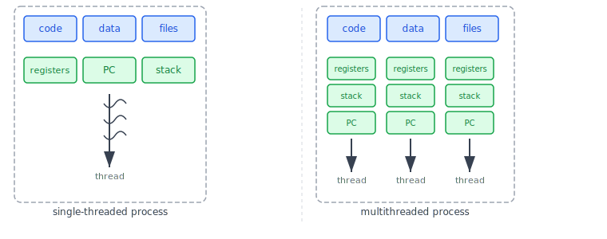

這張圖最核心的洞察是：多個執行緒**共享記憶體**（同一份 code 與 data），但各自**獨立執行**（各自的 PC 指向不同的指令位置）。這正是執行緒比進程更輕量的根本原因，建立一條新執行緒不需要複製整個位址空間，只需建立一組新的 PC、registers 與 stack 即可。

<br/>

### **4.1.1 動機 (Motivation)**

為什麼需要執行緒？來看一個具體場景：一台繁忙的網頁伺服器同時接受成千上萬個客戶端請求。

如果伺服器是一個傳統的**單執行緒進程 (Single-Threaded Process)**，它一次只能服務一個客戶端。第二個客戶端必須等待第一個客戶端的請求完全處理完才能獲得回應，延遲極高。

有人會想：讓伺服器為每個請求 **fork 一個新進程 (Process)**。這個想法確實可行，而且在執行緒技術普及之前確實是常見做法。然而，建立一個新進程需要複製整個位址空間（代碼、堆積、堆疊、檔案描述符等），成本非常高。若新進程執行的工作與原進程相同，這些複製完全是浪費。

使用**多執行緒 (Multithreading)** 則完全不同。伺服器只需維持一個進程，並在其中建立一條新執行緒來服務每個請求。建立執行緒的代價遠比建立進程低，因為執行緒共享進程現有的資源，不需要複製。

下圖展示了多執行緒伺服器的運作流程：客戶端發出請求後，伺服器建立一條新執行緒來負責處理，同時繼續監聽下一個請求，兩件事可以並行進行：

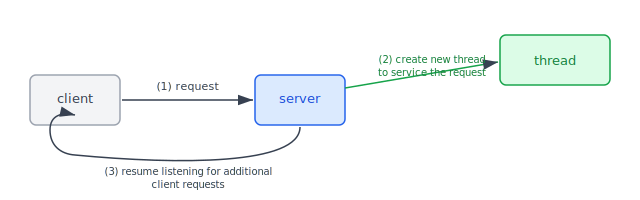

這種設計的要點：

- **(1) request**：客戶端送出請求
- **(2) create new thread**：伺服器不建立新進程，而是在同一進程內建立一條新執行緒來服務該請求
- **(3) resume listening**：伺服器主執行緒立即回到監聽狀態，不需等待服務完成

除了伺服器，多執行緒在各類應用中都有實際用途：

- **影像縮圖應用**：為每張圖片建立獨立執行緒同時產生縮圖，而非逐一處理
- **網頁瀏覽器**：一條執行緒渲染頁面，另一條執行緒從網路下載資料
- **文書處理器**：一條執行緒顯示畫面，一條執行緒接收鍵盤輸入，一條執行緒在背景進行拼字檢查

OS 核心本身也是多執行緒的。以 Linux 為例，系統開機時會建立多條 kernel threads，每條負責特定工作（裝置管理、記憶體管理、中斷處理等）。可以用 `ps -ef` 指令查看正在運行的 kernel threads，其中 `kthreadd`（pid=2）是所有 kernel threads 的父執行緒。

<br/>

### **4.1.2 多執行緒的四大優勢 (Benefits)**

多執行緒程式設計的優勢可以歸納為四個面向：

**1. 回應性 (Responsiveness)**

對互動式應用而言，如果某個操作耗時很長（例如下載大型檔案），單執行緒應用程式在操作期間會完全失去回應。多執行緒可以將耗時操作交給獨立執行緒，讓主執行緒繼續回應使用者互動，維持應用程式的即時反應性。這對 UI 設計尤為重要。

**2. 資源共享 (Resource Sharing)**

進程之間若要共享資料，必須明確使用共享記憶體或訊息傳遞等機制，這些都需要程式設計者額外安排。而執行緒**預設就共享**同一進程的程式碼與資料，不需要額外設定。這讓多條執行緒能在同一位址空間中並行工作，彼此輕易交換資訊。

**3. 經濟性 (Economy)**

建立進程需要配置記憶體、複製資源，成本高昂。建立執行緒只需配置少量的 PC、registers 與 stack，因為其他資源都已在進程中存在。同理，**執行緒的 Context Switch（環境切換）** 也比進程快，因為切換執行緒只需切換少量私有資源，不需要切換整個位址空間。

:::info 「配置 PC、registers 與 stack」具體指的是什麼？

這裡容易有一個誤解：**CPU 上的實體暫存器（Register）數量是固定的，OS 無法「新增」CPU 硬體**。所謂「配置」，本質上全都是在 **RAM** 中劃分空間。

**Stack 的配置**：OS 在進程的虛擬記憶體空間（User Space）中找一塊空白區域（通常數 MB），標記為這條執行緒的專屬 Stack，用來存放區域變數與函式呼叫紀錄。

**PC 與 Registers 的配置**：OS 在核心記憶體（Kernel Space）中為這條執行緒建立一個 **TCB（Thread Control Block，執行緒控制區塊）** 資料結構，其中包含用來**備份**硬體暫存器值的欄位：

```c
struct TCB {
    uint64_t saved_pc;    // 備份 Program Counter
    uint64_t saved_rax;   // 備份 RAX 暫存器
    uint64_t saved_rsp;   // 備份 Stack Pointer
    // ... 其他暫存器的備份欄位
};
```

CPU 的實體 Registers 在任何時刻只能被一條執行緒使用。**Context Switch 的本質**，就是把當前執行緒的 Registers 值**抄寫進它的 TCB（RAM 中）**，再把下一條執行緒的 TCB 備份值**填回 CPU 的實體 Registers**，讓 CPU 從那條執行緒上次停下的位置繼續執行。

| 元件                        |      實際位置       | 說明                                               |
| :-------------------------- | :-----------------: | :------------------------------------------------- |
| Stack                       |  User Space（RAM）  | 每條執行緒的函式呼叫空間，建立時配置數 MB          |
| TCB（含 PC/Registers 備份） | Kernel Space（RAM） | 執行緒不執行時，狀態暫存於此                       |
| 實體 Registers + PC         |      CPU 硬體       | 同一時間只有一條執行緒佔用，切換時靠 TCB 備份/還原 |

這也解釋了為什麼執行緒的建立成本遠低於進程：OS 只需在 RAM 裡配置幾 MB 給 Stack、幾 KB 給 TCB 就完工，不需要像建立進程那樣複製整張分頁表 (Page Table) 和所有檔案描述符 (File Descriptors)。
:::

**4. 可擴展性 (Scalability)**

單執行緒進程無論系統有多少個 CPU，都只能在一個處理器上執行。多執行緒進程則可以讓不同的執行緒真正同時運行在不同的處理核心上，隨著硬體規模增加而自動獲得更高的吞吐量。

:::info 實際決策：什麼時候用多執行緒？什麼時候用多進程？

理解了執行緒的優勢後，自然會想到一個問題：在系統架構設計中，什麼時候應該選多執行緒 (Multi-threading)，什麼時候應該選多進程 (Multi-processing)？核心考量維度有三個：**任務性質**、**資源共享需求**、**對穩定性的要求**。

**選多執行緒的場景**

- **頻繁共享大量數據**：執行緒共享同一份 Heap，直接讀寫變數，不需要 IPC，速度快
- **I/O 密集型任務**：等待網路請求、讀寫資料庫時，一條執行緒阻塞，CPU 切換到其他執行緒繼續工作
- **GUI 應用程式**：主執行緒負責畫面，背景執行緒負責計算，讓 UI 保持回應性
- **資源受限環境**：執行緒建立與切換的成本遠低於進程

**選多進程的場景**

- **穩定性要求極高**：一個進程崩潰不影響其他進程。Chrome 瀏覽器為每個分頁開啟獨立進程，正是基於此考量
- **CPU 密集型任務**：影像處理、影片轉檔、大型矩陣運算等需要大量 CPU 計算的工作，多進程可以真正利用多核
- **安全性隔離**：進程間記憶體完全隔離，有效防止一個模組意外或惡意修改另一個模組的數據
- **規避語言限制**：Python 的 GIL（全域解釋器鎖）導致同一時間只有一條執行緒可以執行 Python 程式碼，必須用多進程才能在多核系統上達到真正的平行

**對比**

| 維度     | 多執行緒 (Threads)                   | 多進程 (Processes)                    |
| :------- | :----------------------------------- | :------------------------------------ |
| 記憶體   | 共享同一個位址空間                   | 每個進程擁有獨立的記憶體              |
| 通訊成本 | 低（直接存取共享變數）               | 高（需透過 IPC：Pipe、Shared Memory） |
| 切換開銷 | 小（只切換私有暫存器/Stack）         | 大（需切換分頁表等整個進程狀態）      |
| 穩定性   | 低（一條執行緒崩潰可能拖垮整個進程） | 高（進程之間互相隔離）                |
| 常見案例 | Web Server 請求處理、UI 反應性       | 瀏覽器分頁、微服務、Python 並行計算   |

在現實的大型系統中，兩者通常混合使用。例如 Web Server 會先 fork 多個 Worker **進程**（利用多核、提高穩定性），每個進程內再使用多**執行緒**（或非同步 I/O）來處理大量並發請求。
:::

<br/>

### **延伸：Node.js 的執行緒模型**

上面的多執行緒伺服器模型（每個請求建立一條執行緒）直觀易懂，但不是唯一的解法。以前後端都廣泛使用的 Node.js 為例，它採用了一套截然不同的架構，卻同樣能撐起高並發的後端服務。理解它的設計，能讓我們更具體地感受到執行緒模型的選擇如何影響系統行為。

首先我們需要釐清一個問題：
> **Node.js 是「單執行緒」嗎？**

說 Node.js 是「單執行緒」，既對也不對。**所有 JavaScript 程式碼**，無論是 `if/else`、`for` 迴圈、還是變數操作，永遠只在一個 **Main Thread（主執行緒）** 上執行，這個主執行緒由 V8 引擎驅動。如果在 JS 中寫一個死迴圈，整個 Node.js 伺服器會直接卡死，因為主執行緒被完全佔用，再也無法回應任何新請求。

但「Node.js 的底層」並不是單執行緒。Node.js 的 C++ 核心函式庫 **libuv** 內建了一個**執行緒池 (Thread Pool)**（預設 4 條執行緒）。當程式呼叫特定的底層 API 時，libuv 會把工作「外包」給執行緒池的背景執行緒，主執行緒繼續往下執行，不等待結果。

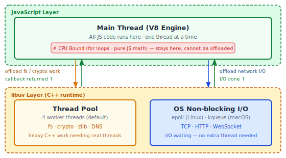

所以「Node.js 是單執行緒」描述的是 **JS 程式碼的執行層**，不是整個 Node.js runtime。JS 層是單執行緒的；libuv 層，背景已有執行緒池在運作。這就是 Node.js 能同時服務大量請求的基礎。不過這裡有個直覺上容易踩到的誤區：既然 libuv 有執行緒池，是不是所有「跑起來比較慢」的工作都能外包？一個跑很久的 `for` 迴圈，也算嗎？

> **那什麼工作才能外包給執行緒池？**

libuv 裡有一條清楚的界線，判斷原則只有一個：**「這個工作是在讓 CPU 持續運算，還是在等待硬體或 OS 回應？」**

- **CPU 密集型 (CPU Bound)**：需要 CPU 持續滿載計算，例如 `for` 迴圈、排序演算法、矩陣運算、影像轉檔。這類工作**無法外包**，只能占著主執行緒跑。
- **I/O 密集型 (I/O Bound)**：需要等待外部資源回應，例如 `fs.readFile()`、資料庫查詢、HTTP 請求、DNS 解析。這類工作 CPU 大部分時間都在「等」，可以外包給 libuv（Thread Pool 或 OS I/O），主執行緒繼續接受新請求。

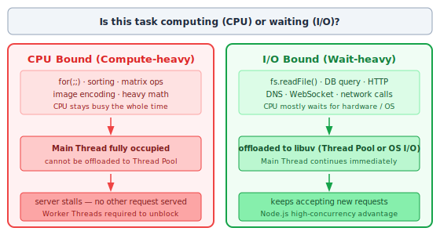

這也解釋了為什麼 Node.js 特別擅長高並發的 I/O 密集型服務（HTTP API、聊天室、即時推播），而不適合 CPU 密集型任務。一個 CPU Bound 的操作會讓主執行緒停下來，讓其他所有請求都排隊等候。

確立了這個分工之後，出現了一個新問題：當背景的執行緒池或 OS 完成了一個 I/O 任務，主執行緒是怎麼被通知到的？誰在持續監視這些背景任務的狀態，又是誰在主執行緒有空的時候把 Callback 送上去執行？

> **答案就是 Event Loop 和 Non-blocking I/O**

這兩個概念在不同層次上各自負責一件事：

- **非阻塞 I/O (Non-blocking I/O)**：這是 **OS 層**的機制（Linux 的 `epoll`、macOS 的 `kqueue`）。程式發出 I/O 請求後，OS 不讓程式傻等，而是讓程式先去做別的事，等 I/O 完成再發通知。它解決的是 *「要怎麼樣才能不等待？」* 的問題。

- **事件迴圈 (Event Loop)**：這是 **libuv 層**用 C++ 實作的無限迴圈，扮演「大管家」角色。它持續巡邏，確認有哪些背景工作完成了（Thread Pool 做完了？OS 通知 I/O 好了？），一旦有結果就把對應的 Callback 放入佇列，等主執行緒有空時取出執行。它解決的是 *「要怎麼樣才能追蹤並喚回執行？」* 的問題。

下圖展示了從一次 async 呼叫到 Callback 被執行的完整五步流程，以及 Non-blocking I/O 和 Event Loop 各自在哪個步驟發揮作用：

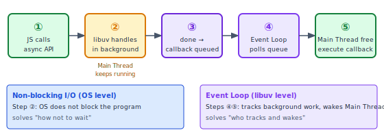

兩者缺一不可：Non-blocking I/O 讓 I/O 工作不阻塞主執行緒；Event Loop 負責追蹤所有背景工作，完成後喚回主執行緒執行 Callback。這套機制讓 Node.js 在 I/O 密集的場景下幾乎不需要等待。

但等等，既然底層確實有 Thread Pool 裡的執行緒在跑，它們在執行 C++ 工作的同時，有沒有可能碰到主執行緒正在讀寫的 JS 變數？

> **換句話說，Node.js 底層有多執行緒，難道不會有競態條件的問題嗎？**

Node.js 底層的背景執行緒確實在運行，但它們**無法直接存取 V8 引擎中的 JS 物件**。Thread Pool 裡的執行緒只做底層 C++ 工作（讀硬碟位元組、計算雜湊值），完成後把結果打包成事件放進佇列。**真正讀寫 JS 變數的永遠只有主執行緒**。

既然同一時間只有一條執行緒在操作 JS 資料，就不存在兩條執行緒互搶同一塊記憶體的問題，也不需要 Mutex 鎖。這是 Node.js 刻意選擇的設計取捨：用「JS 層永遠單執行緒」換來「不需要擔心競態條件」。

當然，如果使用現代 Node.js 的 **Worker Threads**（允許在 JS 層開啟額外執行緒處理 CPU Bound 計算），Worker Threads 之間交換資料就必須透過 Shared Memory 或 Message Passing，Race Condition 的問題也會隨之重新浮現。

<br/>

## **4.2 多核程式設計 (Multicore Programming)**

### **從單核到多核**

早期提升計算性能的方法是增加 CPU 數量（多處理器系統）。後來，一種新趨勢是把多個計算核心 (computing core) 整合進單一晶片，每個核心在 OS 眼中都是一個獨立的 CPU。這類系統稱為**多核系統 (Multicore System)**，而多執行緒正是利用多核心的關鍵手段。

:::info 多核 = 多進程？釐清「硬體」與「軟體」的關係

**多核是硬體概念，多進程和多執行緒是軟體概念，兩者在不同層次上**，不能畫等號。

- **多核 (Multicore)**：CPU 晶片上有多個實體計算核心，這是硬體的設計，OS 看到的是多個可用的 CPU。
- **多進程 (Multi-processing)**：軟體層面，多個獨立進程同時運行。每個進程可以跑在不同核心上，也可以全部擠在同一個核心上（由 OS 排程器決定）。
- **多執行緒 (Multi-threading)**：軟體層面，一個進程內有多條執行緒。這些執行緒同樣可以分配到不同核心上平行執行，也可以在單一核心上交替執行。

所以「多核」是讓平行成為可能的**舞台**，「多進程」和「多執行緒」都是在這個舞台上利用多核的**策略**。沒有多核，兩種策略都只能在單一核心上輪流執行（並行但非平行）；有了多核，兩者都能真正同時跑在不同核心上（真平行）。

本章之所以把多核和多執行緒放在同一節討論，是因為多執行緒比多進程更輕量，是最主流的利用多核手段。但這並不代表多進程就不能用多核，只是開銷更大。
:::

要理解為什麼多執行緒重要，必須先分清兩個容易混淆的概念：**並行性 (Concurrency)** 與 **平行性 (Parallelism)**。

下圖展示了四個執行緒在單核與多核系統上的執行差異：

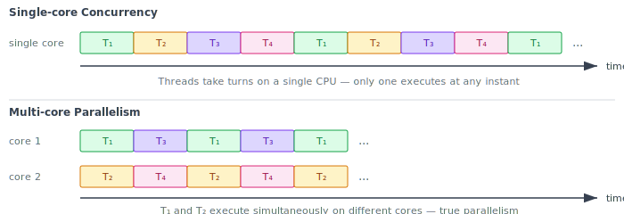

**單核系統（上半部）**：四個執行緒 T₁、T₂、T₃、T₄ 依序輪流佔用 CPU，任何時刻只有一個執行緒真正在執行。這稱為**並行 (Concurrent)**：每個執行緒都在「推進」，但並非同時執行。這其實是 CPU 排程器快速切換製造出來的「平行假象」。

**多核系統（下半部）**：core 1 同時執行 T₁，core 2 同時執行 T₂。某個時間點上，確實有多個執行緒**同時**在不同核心上執行。這才是真正的**平行 (Parallel)**。

:::info 並行 (Concurrency) vs 平行 (Parallelism)
|          概念           | 定義                                                       | 硬體需求 |
| :---------------------: | :--------------------------------------------------------- | :------: |
| **Concurrency（並行）** | 系統能讓多個任務都「取得進展」，即使同一時間只有一個在執行 | 單核即可 |
| **Parallelism（平行）** | 系統能在同一時間點讓多個任務**同時**執行                   | 需要多核 |

並行是比平行更寬鬆的概念：平行一定是並行，但並行不一定是平行。單核系統可以做到並行（快速切換），但無法做到平行（同時執行）。
:::

<br/>

### **4.2.1 多核程式設計的挑戰 (Programming Challenges)**

多核系統的出現給應用程式開發者帶來了壓力：若程式仍然是單執行緒的，多核的計算能力就被完全浪費了。要讓程式真正利用多核，需要克服五個面向的挑戰：

**1. 識別任務 (Identifying Tasks)**

必須分析程式的工作流程，找出哪些部分可以獨立切分成並行任務。理想的情況是找到彼此**相互獨立**的工作單元，讓它們可以分配到不同核心上平行執行。

**2. 任務均衡 (Balance)**

識別出可平行的任務後，還需確保每個任務的工作量大致相當。若某個任務執行時間極短而另一個極長，分配到不同核心反而會因等待而降低效率。

**3. 資料切割 (Data Splitting)**

如同任務需要分割，任務所操作的資料也必須能被分割，讓不同核心各自處理不同的資料子集。

**4. 資料相依性 (Data Dependency)**

當一個任務依賴另一個任務的計算結果時，這兩個任務不能隨意並行，必須確保執行順序正確。這類**相依性管理 (Dependency Management)** 是並行程式設計中最複雜的部分，Chapter 6 會進一步討論同步 (Synchronization) 策略。

**5. 測試與除錯 (Testing and Debugging)**

多個執行緒並行執行時，有大量可能的執行順序組合（即**排程路徑 (Scheduling Path)**），其中某些組合才會觸發 Bug。並行程式的 Bug 可能只在特定時序下出現，難以重現，也難以除錯。

<br/>

:::info Amdahl's Law（阿達爾定律）

新增更多核心，程式一定會更快嗎？並非如此。**Amdahl's Law** 給出了一個精確的上限公式：

設一個程式中，必須**循序執行**（無法平行化）的部分佔比為 S，系統有 N 個處理核心，則最大加速比 (speedup) 為：

$$speedup \leq \frac{1}{S + \frac{1-S}{N}}$$

以一個 75% 可平行、25% 必須循序的程式為例：

| 核心數 N | 最大加速比 |
| :------: | :--------: |
|    2     |   1.60×    |
|    4     |   2.28×    |
|    8     |   2.91×    |
|    ∞     |   4.00×    |

當 N → ∞ 時，加速比趨近於 **1/S**。若 S = 0.25，即使核心數無限多，最多也只能加速到原來的 4 倍。

下圖直觀地展示了在不同 S 值下，隨核心數增加的加速比曲線：

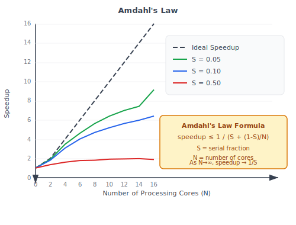

從圖中可以看出：藍色曲線（S=0.10）在核心數增加到 8 之後加速比的提升已明顯趨於平緩；紅色曲線（S=0.50）幾乎一開始就飽和，無論再加多少核心都收益有限。

**Amdahl's Law 的核心洞察**：程式中**循序部分的佔比**對效能增益有決定性的影響，遠超過核心數量。即使只有 10% 的程式碼必須循序執行，理論加速上限就永遠無法超過 10 倍，與核心數無關。這意味著，若想真正從多核獲益，消除循序瓶頸的重要性高於增加核心數。
:::

<br/>

### **4.2.2 平行性的兩種類型 (Types of Parallelism)**

在實作層面，平行性可以分為兩種根本不同的類型：

**資料平行 (Data Parallelism)** 的策略是：**同一個操作，分配到不同的資料子集**上，讓多個核心各自處理一部分。

以對大小為 N 的陣列求總和為例：

- 單核：一條執行緒計算 `sum(data[0..N-1])`
- 雙核：core 0 計算 `sum(data[0..N/2-1])`，core 1 計算 `sum(data[N/2..N-1])`，最後合併兩個部分結果

**任務平行 (Task Parallelism)** 的策略則相反：**不同的操作（任務）分配到不同的核心**，即使處理的是相同或不同的資料。

以同一個陣列為例，在任務平行的思路下：core 0 計算平均值、core 1 計算變異數、core 2 找最大值最小值、core 3 進行排序。每個核心執行的是**不同的操作**。

下圖並排呈現了兩種平行策略的結構差異：

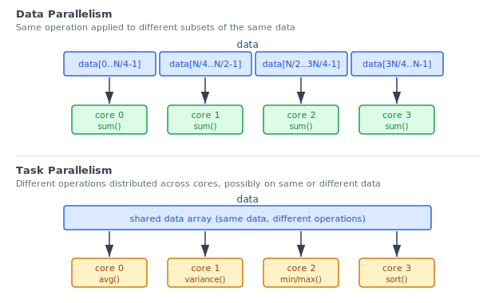

資料平行（上半部）：同一份資料被切成 4 塊，每個核心執行相同的 `sum()` 操作。任務平行（下半部）：同一份資料傳給 4 個核心，每個核心執行不同的統計操作。

這兩種類型並非互斥，實際應用中常見兩者混合使用的混合平行策略 (Hybrid Parallelism)。

<br/>

## **4.3 多執行緒模型 (Multithreading Models)**

### **使用者執行緒與核心執行緒**

在討論多執行緒模型之前，必須先釐清**執行緒在哪個層次上運作**，因為這直接決定了效能與功能的取捨。

執行緒的支援可以發生在兩個層次：

- **使用者執行緒 (User Thread)**：由使用者空間的**執行緒函式庫 (Thread Library)** 管理，OS 核心完全不知道這些執行緒的存在
- **核心執行緒 (Kernel Thread)**：由 OS 核心直接管理與排程，核心能看見每一條執行緒

幾乎所有現代 OS（Windows、Linux、macOS）都支援 Kernel Thread。下圖展示了兩種執行緒的位置關係：使用者執行緒存在於 user space，核心執行緒存在於 kernel space：

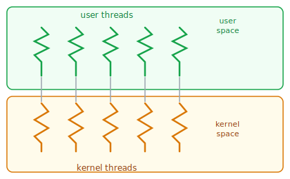

由於 OS 排程的對象是核心執行緒，使用者執行緒最終必須**對應到**核心執行緒才能實際在 CPU 上執行。這種對應方式有三種主要模型，各有不同的特性與取捨。

<br/>

### **4.3.1 多對一模型 (Many-to-One Model)**

最早期也最簡單的映射方式是 **Many-to-One（多對一）**：多條使用者執行緒全部對應到**同一條**核心執行緒。

下圖展示了這種模型：user space 中有多條使用者執行緒，但所有連線都指向 kernel space 中唯一的一條核心執行緒：

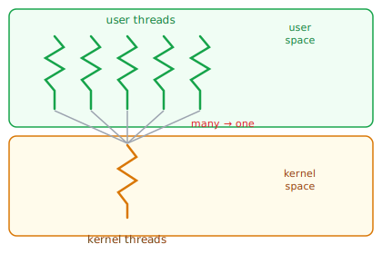

這種設計的優點是：執行緒的建立與切換都在 user space 完成，不需要系統呼叫，速度非常快。

然而問題是：核心只認識那一條核心執行緒，因此：

- 一旦任何一條使用者執行緒發出**阻塞式系統呼叫 (Blocking System Call)**（例如等待 I/O），核心會阻塞那條核心執行緒，導致**整個進程**的所有使用者執行緒都被掛起
- 核心一次只能排程一條核心執行緒，因此多條使用者執行緒**無法在多核系統上真正平行執行**

歷史上，Java 早期版本在 Solaris 上使用的 **Green Threads** 就採用 Many-to-One 模型。但由於它無法利用多核心，現代系統幾乎已不再使用。

<br/>

### **4.3.2 一對一模型 (One-to-One Model)**

**One-to-One（一對一）** 模型為每一條使用者執行緒建立一條對應的核心執行緒：

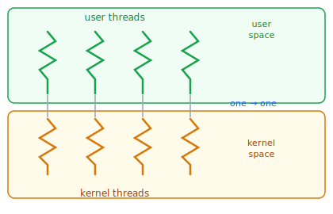

這解決了 Many-to-One 的兩個核心問題：

- 當某條執行緒發出阻塞式系統呼叫時，只有那條核心執行緒被阻塞，其他執行緒不受影響，可以繼續執行
- 多條核心執行緒可以在多核系統上**真正平行執行**，充分利用多核硬體

唯一的缺點是：建立一條使用者執行緒就必須建立一條核心執行緒，若大量建立執行緒，大量的核心執行緒會佔用可觀的核心資源（記憶體、排程開銷），可能對整體系統性能造成壓力。

**Linux 與 Windows 系列 OS 均採用 One-to-One 模型**。這也是目前最主流的模型。

<br/>

### **4.3.3 多對多模型 (Many-to-Many Model)**

**Many-to-Many（多對多）** 模型試圖綜合前兩者的優點：M 條使用者執行緒映射到 N 條核心執行緒，通常 M ≥ N：

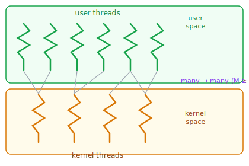

這個模型的特性：

- 開發者可以建立任意數量的使用者執行緒，不受核心執行緒數量限制（解決 One-to-One 的建立代價問題）
- 當某條執行緒阻塞時，OS 核心可以排程另一條核心執行緒執行，避免整個進程被掛起（解決 Many-to-One 的阻塞問題）
- 核心執行緒可以在多核系統上真正平行，充分利用多核資源

聽起來是最完美的方案，但實作難度遠高於前兩者。此外，隨著現代 CPU 核心數量增加，限制核心執行緒數量的必要性越來越低。因此多數現代 OS 選擇直接使用 One-to-One。

<br/>

### **延伸：雙層模型 (Two-Level Model)**

Many-to-Many 的一個變體稱為 **Two-Level Model（雙層模型）**：它在 Many-to-Many 的基礎上，額外允許某些使用者執行緒被**綁定 (Bound)** 到特定的核心執行緒，形成局部的 One-to-One 關係：

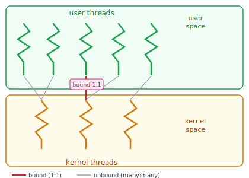

圖中紅色的連線表示被綁定的 1:1 關係，灰色的連線表示一般的 many-to-many 映射。綁定的核心執行緒保證該使用者執行緒能被 OS 排程器直接控制，適合對即時性要求高的工作。

<br/>

### **三種模型比較**

|         特性         |   Many-to-One    |         One-to-One         |      Many-to-Many      |
| :------------------: | :--------------: | :------------------------: | :--------------------: |
| 阻塞系統呼叫影響範圍 |     整個進程     |      只影響當條執行緒      |    只影響當條執行緒    |
|     多核平行執行     |      不支援      |            支援            |          支援          |
|    執行緒建立成本    | 低（不涉及核心） | 高（每次都要建核心執行緒） | 中（可複用核心執行緒） |
|      實作複雜度      |        低        |             低             |           高           |
|     現代使用狀況     |     幾乎淘汰     |   主流（Linux、Windows）   |     少數函式庫使用     |

Many-to-Many 模型雖然在理論上最靈活，但因為實作複雜、且現代多核系統已讓核心執行緒數量限制的問題不再嚴重，大多數現代 OS 直接選擇了更簡單、更直接的 One-to-One 模型。不過，部分現代並行函式庫仍在函式庫層級實作類似 Many-to-Many 的機制，讓開發者定義「任務 (Task)」，再由函式庫將任務映射到底層執行緒。
