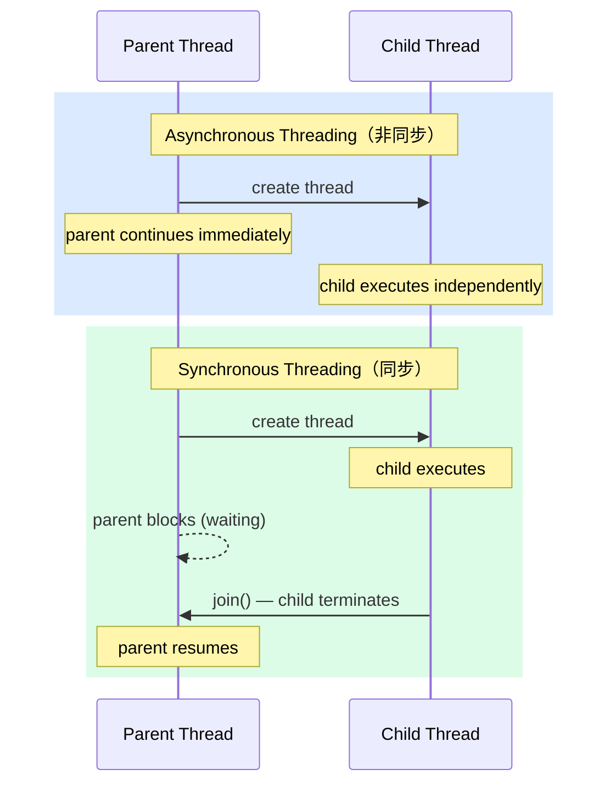
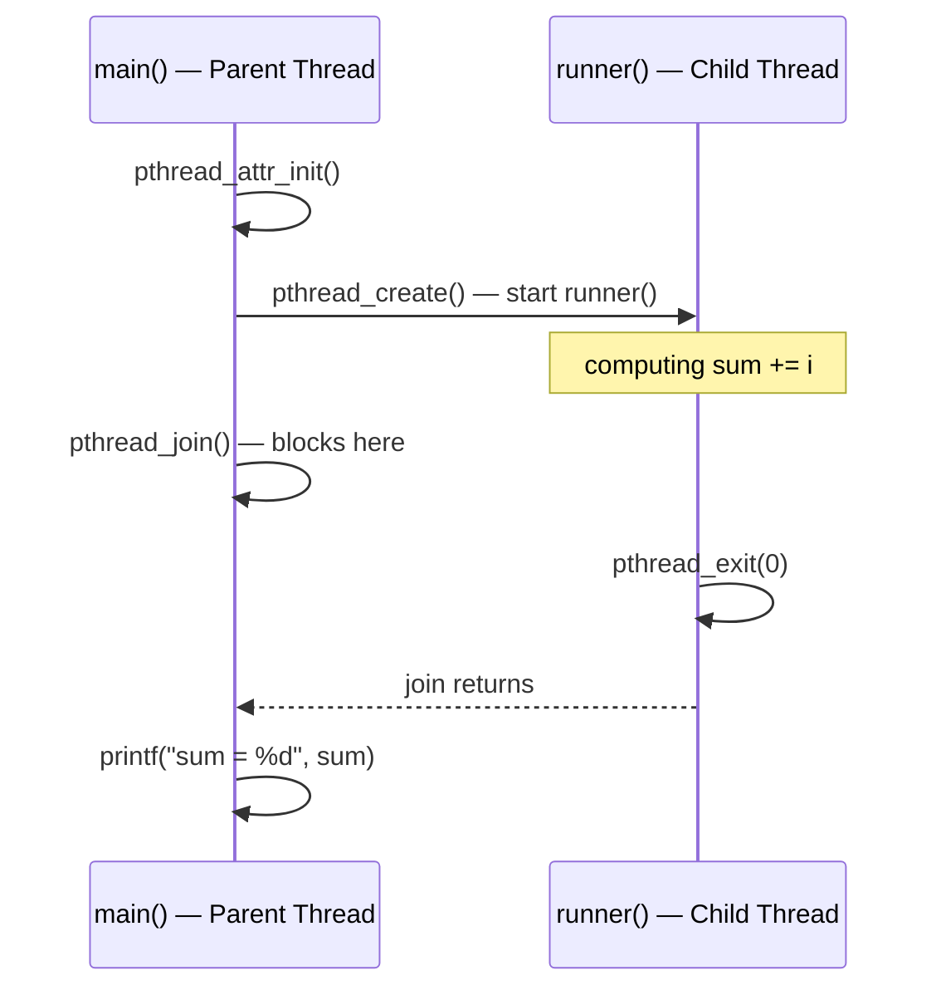
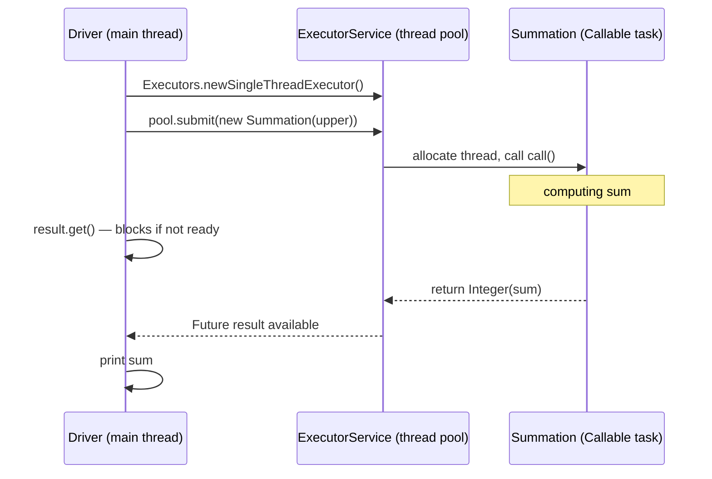

:::note
本系列文章內容參考自經典教材 **Operating System Concepts, 10th Edition (Silberschatz, Galvin, Gagne)**。本文對應章節：**Section 4.4 Thread Libraries**。
:::

## **4.4 執行緒函式庫 (Thread Libraries)**

### **三大主流函式庫**

執行緒函式庫 (Thread Library) 為程式設計者提供一套用來**建立與管理執行緒**的 API。目前有三大主流函式庫：

|         函式庫         | 標準 / 平台                                          |                   層次                   |
| :--------------------: | :--------------------------------------------------- | :--------------------------------------: |
|   **POSIX Pthreads**   | POSIX 標準 (IEEE 1003.1c)，廣泛用於 UNIX/Linux/macOS | 可作為 user-level 或 kernel-level 函式庫 |
| **Windows Thread API** | Windows 系統專用                                     |           Kernel-level 函式庫            |
|  **Java Thread API**   | 任何有 JVM 的平台（Windows、Linux、macOS、Android）  |        由底層 OS 執行緒函式庫實作        |

Java 的執行緒 API 在 JVM 之上提供統一介面，但底層實作依主機 OS 而不同：Windows 上通常使用 Windows API，Linux/macOS 通常使用 Pthreads。

關於**全域資料 (global data) 的共享**，Pthreads 與 Windows 執行緒的規則一致：宣告在所有函式外（即全域作用域）的資料，會被同一個進程內的所有執行緒共享，不需要任何額外設定。Java 作為純物件導向語言，沒有「全域變數」的概念，若要在執行緒之間共享資料，必須在設計上明確安排。

<br/>

### **兩種多執行緒策略：非同步與同步**

在介紹各函式庫的具體 API 之前，先理解兩種基本的執行緒使用模式，因為這兩種模式決定了程式的整體結構。

**非同步執行緒 (Asynchronous Threading)**：父執行緒建立子執行緒後，**立即繼續執行**，不等待子執行緒完成。兩者並行且相互獨立，幾乎不共享資料。

**同步執行緒 (Synchronous Threading)**：父執行緒建立一條或多條子執行緒後，必須**等待所有子執行緒完成**才能繼續。子執行緒完成後各自終止並與父執行緒 **join（匯合）**，只有所有子執行緒都 join 之後，父執行緒才得以繼續。同步執行緒通常伴隨大量的資料共享，例如父執行緒最終要匯總所有子執行緒計算出的子結果。



以下三個函式庫的範例程式，全部採用**同步執行緒**策略。

<br/>

## **4.4.1 Pthreads**

### **規格 vs 實作**

Pthreads 是 POSIX 標準（IEEE 1003.1c）定義的**執行緒 API 規格 (specification)**，而非一個具體的實作。OS 設計者可以自由選擇如何實作這份規格，因此 Pthreads 程式碼在 Linux、macOS、BSD 等系統上都能運行，底層實作各異但介面完全相同。Windows 原生不支援 Pthreads，但有第三方實作可用。

### **建立執行緒：完整範例**

以計算 1 到 N 總和為例，設計一個將加總工作交給子執行緒執行的 Pthreads 程式：

```c
#include <pthread.h>
#include <stdio.h>
#include <stdlib.h>

int sum; /* 所有執行緒共享的全域變數 */

void *runner(void *param); /* 子執行緒將執行這個函式 */

int main(int argc, char *argv[])
{
    pthread_t tid;          /* 執行緒識別碼 */
    pthread_attr_t attr;    /* 執行緒屬性 */

    pthread_attr_init(&attr);                       /* 使用預設屬性 */
    pthread_create(&tid, &attr, runner, argv[1]);   /* 建立子執行緒 */
    pthread_join(tid, NULL);                        /* 等待子執行緒結束 */
    printf("sum = %d\n", sum);
}

void *runner(void *param)
{
    int i, upper = atoi(param);
    sum = 0;
    for (i = 1; i <= upper; i++)
        sum += i;
    pthread_exit(0);        /* 子執行緒結束 */
}
```

逐步拆解這段程式的執行流程：

1. `main()` 開始執行，此時只有**一條執行緒**（父執行緒）在運行
2. `pthread_attr_init(&attr)` 初始化執行緒屬性為預設值（預設屬性已足夠大多數用途；Chapter 5 會討論進階排程屬性）
3. `pthread_create(&tid, &attr, runner, argv[1])` 建立子執行緒：
   - 第一個參數 `&tid`：子執行緒的識別碼，建立後填入
   - 第二個參數 `&attr`：執行緒屬性
   - 第三個參數 `runner`：子執行緒從**哪個函式**開始執行
   - 第四個參數 `argv[1]`：傳入 `runner()` 的參數（命令列輸入的 N 值）
4. 子執行緒在 `runner()` 中計算加總，父執行緒在 `main()` 呼叫 `pthread_join(tid, NULL)` 後**阻塞等待**
5. 子執行緒計算完成後呼叫 `pthread_exit(0)` 結束，`pthread_join()` 返回，父執行緒繼續輸出結果

此時進程中有兩條執行緒：父執行緒在 `main()` 中等待，子執行緒在 `runner()` 中計算。兩者共享全域變數 `sum`，這正是同步執行緒資料共享的典型用法。



### **等待多條子執行緒**

若要等待多條子執行緒，只需將 `pthread_join()` 包在一個迴圈中：

```c
#define NUM_THREADS 10

pthread_t workers[NUM_THREADS];

for (int i = 0; i < NUM_THREADS; i++)
    pthread_join(workers[i], NULL);
```

這段程式依序等待所有子執行緒結束。所有執行緒完成後，父執行緒才繼續執行後續邏輯。

<br/>

## **4.4.2 Windows 執行緒 (Windows Threads)**

Windows Thread API 的設計哲學與 Pthreads 相近，只是 API 名稱與資料型別遵循 Windows 的命名慣例（全大寫的型別名稱、`Handle` 概念等）。以下是同樣計算 1 到 N 加總的 Windows 版本：

```c
#include <windows.h>
#include <stdio.h>

DWORD Sum; /* 共享全域變數，DWORD = unsigned 32-bit integer */

DWORD WINAPI Summation(LPVOID Param)
{
    DWORD Upper = *(DWORD*)Param;
    for (DWORD i = 1; i <= Upper; i++)
        Sum += i;
    return 0;
}

int main(int argc, char *argv[])
{
    DWORD ThreadId;
    HANDLE ThreadHandle;
    int Param = atoi(argv[1]);

    ThreadHandle = CreateThread(
        NULL,           /* 預設安全屬性 */
        0,              /* 預設堆疊大小 */
        Summation,      /* 執行緒函式 */
        &Param,         /* 傳入執行緒函式的參數 */
        0,              /* 預設建立旗標（立即可執行） */
        &ThreadId);     /* 傳回執行緒 ID */

    WaitForSingleObject(ThreadHandle, INFINITE); /* 等待子執行緒結束 */
    CloseHandle(ThreadHandle);                   /* 釋放 handle 資源 */
    printf("sum = %d\n", Sum);
}
```

幾個與 Pthreads 的對應關係：

|       Pthreads        |          Windows API           | 用途           |
| :-------------------: | :----------------------------: | :------------- |
|  `pthread_create()`   |        `CreateThread()`        | 建立執行緒     |
|   `pthread_join()`    |    `WaitForSingleObject()`     | 等待單一執行緒 |
|   `pthread_exit()`    | `return 0`（從執行緒函式返回） | 終止執行緒     |
| `pthread_t`（識別碼） |    `HANDLE`（核心物件句柄）    | 執行緒的引用   |

`CreateThread()` 接收一組屬性，包含**安全資訊、堆疊大小、起始旗標**（例如可設定執行緒以暫停狀態啟動）。本範例使用預設值，執行緒建立後立即成為可被 CPU 排程的狀態。

### **等待多條子執行緒**

在需要等待多條執行緒時，Windows 提供 `WaitForMultipleObjects()`，它接收四個參數：

1. 要等待的物件數量
2. 指向 `HANDLE` 陣列的指標
3. 旗標：是否要等待**所有**物件都被觸發（`TRUE`）還是任一個即可（`FALSE`）
4. 逾時時間（毫秒）或 `INFINITE`

```c
WaitForMultipleObjects(N, THandles, TRUE, INFINITE);
```

這行程式會阻塞，直到 `THandles` 陣列中的 N 條執行緒**全部**完成為止。

<br/>

## **4.4.3 Java 執行緒 (Java Threads)**

執行緒是 Java 程式執行模型的基礎單位。即使是最簡單的 Java 程式，從 `main()` 方法開始也是在一條 JVM 執行緒中執行的。Java Thread API 可以在任何有 JVM 的平台上使用，包括 Windows、Linux、macOS 與 Android。

### **建立執行緒的兩種方式**

Java 提供兩種顯式建立執行緒的方式：

**方式一：繼承 Thread 類別**，覆寫 `run()` 方法。

**方式二（更常用）：實作 Runnable 介面**，定義 `public void run()` 方法。

```java
class Task implements Runnable {
    public void run() {
        System.out.println("I am a thread.");
    }
}
```

建立執行緒的標準流程是：建立一個 `Thread` 物件，將 `Runnable` 實例傳入，然後呼叫 `start()` 方法：

```java
Thread worker = new Thread(new Task());
worker.start();
```

:::info 為什麼呼叫 start() 而不直接呼叫 run()？

這是 Java 執行緒初學者最常犯的誤解，值得深入說明。

`run()` 只是一個普通的方法。如果直接呼叫 `worker.run()`，JVM 不會建立新執行緒，就像呼叫任何普通方法一樣，程式在**當前執行緒**的呼叫堆疊上執行 `run()` 的程式碼，執行完後繼續往下，根本不存在並行。

`start()` 才是真正啟動並行的入口。呼叫 `start()` 做了兩件事：

1. 在 JVM 中配置記憶體並初始化一條**新執行緒**（在底層對應到一條 OS 執行緒）
2. 呼叫 `run()` 方法，讓這條新執行緒開始執行 `run()` 的程式碼

因此，`start()` 呼叫返回後，呼叫者（父執行緒）與新執行緒已在**並行執行**，兩者都繼續各自的工作。
:::

:::info Lambda 表達式（Lambda Expressions）

Java 1.8 引入了 Lambda 表達式，讓建立執行緒的語法更簡潔。不需要再定義一個獨立的實作 `Runnable` 的類別：

```java
Runnable task = () -> {
    System.out.println("I am a thread.");
};

Thread worker = new Thread(task);
worker.start();
```

Lambda 表達式是函數式程式設計 (functional programming) 的重要特性，在 Python、C++、C# 等語言中也有對應的 closure 機制。在後續的並行程式設計範例中，Lambda 表達式能大幅簡化程式碼的可讀性。
:::

### **等待子執行緒：join()**

Pthreads 用 `pthread_join()`，Windows 用 `WaitForSingleObject()`，Java 則用 `join()` 方法：

```java
try {
    worker.join();
} catch (InterruptedException ie) { }
```

`join()` 會讓呼叫者阻塞，直到 `worker` 執行緒結束為止。若需等待多條執行緒，同樣可以在迴圈中呼叫 `join()`，做法與 Pthreads 的迴圈版本相同。

<br/>

### **Java Executor Framework**

傳統的 Java 執行緒建立方式（直接建立 `Thread` 物件）有一個根本的侷限：**執行緒無法回傳結果**。`run()` 方法的回傳型別是 `void`，子執行緒計算出的結果只能寫入共享的物件或全域狀態，這讓程式碼既脆弱又難以維護。

Java 5 在 `java.util.concurrent` 套件中引入了更強大的 **Executor Framework**，解決了這個問題，同時也將執行緒的**建立**與**執行**清楚地分離。

### **Executor 介面與 ExecutorService**

框架的核心是 `Executor` 介面：

```java
public interface Executor {
    void execute(Runnable command);
}
```

使用方式是透過 `Executors` 工廠類別建立一個 `ExecutorService`，再提交任務：

```java
Executor service = new Executor;
service.execute(new Task());
```

這個框架基於**生產者-消費者 (producer-consumer) 模型**：實作 `Runnable` 介面的任務是**生產者**，實際執行這些任務的執行緒是**消費者**。這種設計的好處是：執行緒的建立細節由框架管理，程式設計者只需關注「提交什麼任務」，而不用管「幾條執行緒、何時建立」。

### **Callable 與 Future：讓執行緒回傳結果**

若需要取得執行緒的計算結果，應使用 `Callable` 介面取代 `Runnable`：

|     介面      |     方法     |    能否回傳結果    |
| :-----------: | :----------: | :----------------: |
|  `Runnable`   | `void run()` |        不能        |
| `Callable<V>` |  `V call()`  | 可以，回傳型別為 V |

`Callable` 任務提交後回傳一個 `Future<V>` 物件。`Future` 代表**一個未來才會有的結果**，可以在任意時間點呼叫 `get()` 方法來取得結果（若計算尚未完成，`get()` 會阻塞直到結果可用）。

```java
import java.util.concurrent.*;

class Summation implements Callable<Integer> {
    private int upper;

    public Summation(int upper) {
        this.upper = upper;
    }

    public Integer call() {
        int sum = 0;
        for (int i = 1; i <= upper; i++)
            sum += i;
        return new Integer(sum);
    }
}

public class Driver {
    public static void main(String[] args) {
        int upper = Integer.parseInt(args[0]);

        ExecutorService pool = Executors.newSingleThreadExecutor();
        Future<Integer> result = pool.submit(new Summation(upper));

        try {
            System.out.println("sum = " + result.get());
        } catch (InterruptedException | ExecutionException ie) { }
    }
}
```

整個 Executor Framework 的運作流程如下：



這個模型比直接使用 `Thread` 更靈活：

- `execute()` 提交不需要回傳結果的任務（等同 `Runnable`）
- `submit()` 提交需要回傳結果的任務（等同 `Callable`），返回 `Future`
- 父執行緒**不必等執行緒結束**，只需等**結果可用**即可呼叫 `result.get()`；兩件事的時間點可以不同

:::info JVM 與主機 OS 執行緒的對應關係

JVM 通常實作在主機 OS 之上，這讓 JVM 能夠隱藏底層 OS 的實作細節，讓 Java 程式在任何有 JVM 的平台上以相同方式運行。

POSIX 規格並未規定 Java 執行緒如何映射到底層 OS 執行緒，這個決定由各平台的 JVM 實作自行決定：

- **Windows 上的 JVM**：採用 One-to-One 模型，每條 Java 執行緒對應一條 Windows 核心執行緒，透過 Windows Thread API 建立
- **Linux/macOS 上的 JVM**：通常透過 Pthreads API 建立執行緒，同樣採用 One-to-One 映射

因此，在 Windows 上執行的 Java 多執行緒程式，底層其實是在呼叫 Windows Thread API；在 Linux 上則是在呼叫 Pthreads。這一切對 Java 程式設計者完全透明，但這也說明了為什麼 Java 的執行緒效能特性（排程、優先級、阻塞行為）最終仍受主機 OS 的執行緒模型所影響。
:::

<br/>

## **三大函式庫比較**

|      對比項目      |         Pthreads          |     Windows Threads     |         Java Threads         |
| :----------------: | :-----------------------: | :---------------------: | :--------------------------: |
|  **標準 / 平台**   | POSIX（Unix/Linux/macOS） |      Windows 專屬       |    跨平台（有 JVM 即可）     |
|   **函式庫層次**   |   User 或 Kernel level    |      Kernel level       |   JVM 抽象層（底層依 OS）    |
|   **建立執行緒**   |    `pthread_create()`     |    `CreateThread()`     |  `new Thread(...).start()`   |
|   **等待執行緒**   |     `pthread_join()`      | `WaitForSingleObject()` |       `worker.join()`        |
|   **終止執行緒**   |     `pthread_exit()`      |        函式返回         |         `run()` 結束         |
|  **全域資料共享**  |     直接共享全域變數      |    直接共享全域變數     | 需明確設計（無全域變數概念） |
| **執行緒回傳結果** |     透過共享全域變數      |    透過共享全域變數     | `Callable<V>` + `Future<V>`  |

三套 API 的**設計哲學高度相似**：建立執行緒時指定執行函式和屬性，執行後用等待函式同步，但 Java 因語言特性（無全域變數、物件導向）而在資料共享方式上有所不同，並透過 Executor Framework 提供了更現代的任務提交與結果回收機制。
