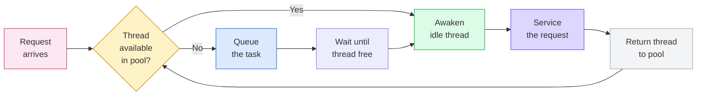
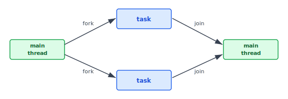
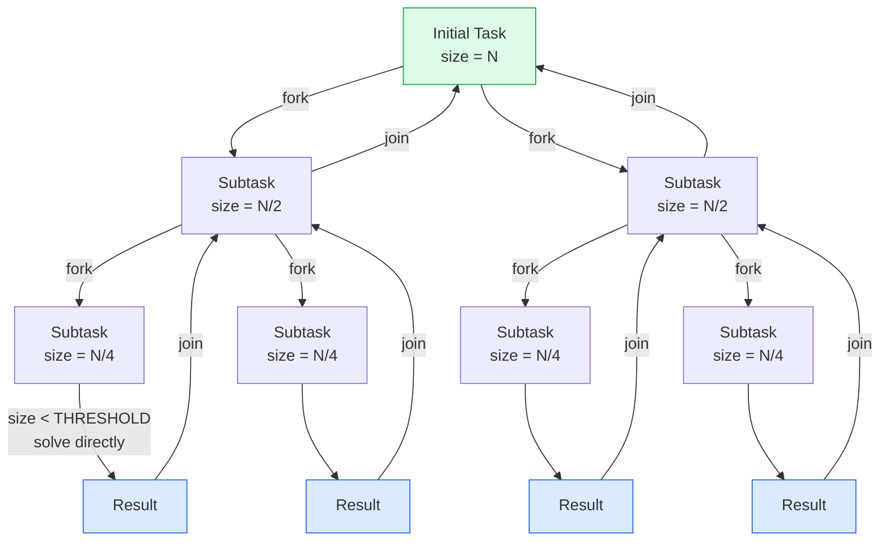
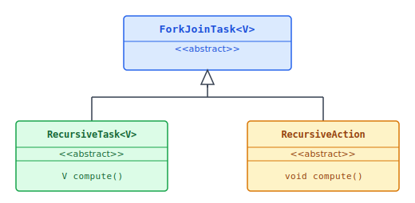
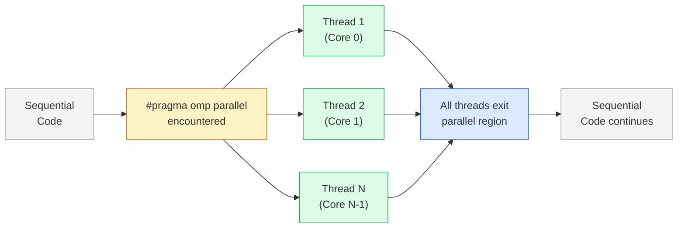
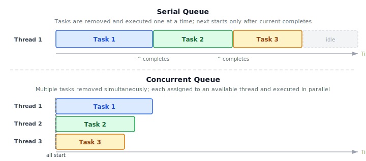

:::note
本系列文章內容參考自經典教材 **Operating System Concepts, 10th Edition (Silberschatz, Galvin, Gagne)**。本文對應章節：**Section 4.5 Implicit Threading**。
:::

## **為什麼需要 Implicit Threading？**

在前幾節，開發者需要自行呼叫 `pthread_create`、`CreateThread`、`new Thread(...)` 等 API 來明確建立每一條執行緒，並負責管理它的生命週期。這種做法稱為**顯含式執行緒（Explicit Threading）**。然而，當應用程式的並行度越來越高，顯含式做法面臨兩類困境：

1. **並行正確性極難保證**：多執行緒程式中，競爭條件（Race Condition）、死鎖（Deadlock）、資料一致性問題隨著執行緒數量呈指數級複雜化。Chapter 6 和 Chapter 8 會深入討論這些主題，但核心困難在此：手動管理執行緒的開發者需要同時理解演算法邏輯與並行控制機制，兩者交織在一起，極易出錯。

2. **效能調校依賴硬體細節**：多少執行緒最合適？取決於核心數、記憶體大小、任務特性。這些資訊在編譯期通常未知，開發者必須在執行期動態判斷，且每換一台機器就可能需要重新調整。

**解決方向：把執行緒管理的責任交出去。** 這個策略稱為**隱含式執行緒（Implicit Threading）**，由**編譯器（Compiler）** 或**執行期函式庫（Run-Time Library）** 代替開發者決定如何建立與管理執行緒。開發者只需要識別哪些**任務（Tasks）** 可以並行執行，而不是直接操作執行緒。任務通常寫成一個函式，由執行期函式庫自動將其映射到實際的執行緒上，通常採用 Many-to-Many 模型（Section 4.3.3）。

本節介紹五種主流的隱含式執行緒方案：Thread Pool、Fork-Join、OpenMP、Grand Central Dispatch（GCD）、Intel Thread Building Blocks（TBB）。

<br/>

## **4.5.1 Thread Pool（執行緒池）**

### **問題場景：每個請求建立一條新執行緒**

假設有一台多執行緒網頁伺服器，採用最直覺的設計：每收到一個客戶端請求，就建立一條新執行緒來服務這個請求，服務完成後銷毀執行緒。雖然這比「每個請求 fork 一個新 Process」快很多，但這個設計有兩個根本性的問題：

1. **執行緒建立成本不可忽視**：每次請求都要執行 OS 的執行緒建立流程，包含分配核心資源、初始化 stack 等，這段時間在高並發場景下會累積成顯著的延遲。服務一個請求所需的時間，本身就包含了建立執行緒的時間，而非完全用在實際工作上。

2. **執行緒數量沒有上限**：如果每個請求都建立一條執行緒，在高流量時可能同時存在數千條執行緒。執行緒本身佔用 CPU time 和記憶體（每條執行緒的 stack 空間），無限制地建立執行緒最終會耗盡系統資源，導致服務崩潰。

**Thread Pool（執行緒池）** 是解決這兩個問題的標準方案。

### **Thread Pool 的核心機制**

Thread Pool 的核心思想是：**在系統啟動時預先建立一批執行緒，讓它們待在「池（Pool）」中等待工作**，而不是按需建立、用完銷毀。

以下是一次完整的請求處理流程：



這個流程圖說明：
- **有閒置執行緒**：喚醒一條，立刻服務請求，完成後執行緒回到池中等待下一個任務
- **無閒置執行緒**：任務進入等待佇列（Task Queue），一旦某條執行緒完成工作、回到池中，立刻從佇列取出下一個任務

執行緒池能正常運作的前提是：**提交給池的任務可以非同步執行（Asynchronously）**，即提交者不需要原地等待任務完成。

### **Thread Pool 的三大優勢**

| 優勢 | 說明 |
| :---: | :--- |
| **① 更快的響應速度** | 用既有的閒置執行緒服務請求，比臨時建立新執行緒快，省去 OS 的執行緒建立開銷 |
| **② 限制並行執行緒數量** | 池的大小設定了並行執行緒的上限，防止系統因大量執行緒而耗盡資源；在無法支援大量並行執行緒的系統上尤為重要 |
| **③ 任務與執行緒解耦** | 任務的定義（做什麼）和執行緒的管理（怎麼跑）分離，讓執行策略可以彈性調整，例如：延遲執行、週期執行，而不需要修改任務本身的程式碼 |

池中執行緒的數量可以根據系統 CPU 數量、實體記憶體大小、預期並發請求數等因素以**啟發式（Heuristically）** 方法決定。進階的 Thread Pool 架構（如後文的 GCD）甚至能根據當前負載動態增減執行緒數量：負載低時縮池以節省記憶體，負載高時擴池以維持吞吐量。

### **Windows API Thread Pool**

Windows API 的 Thread Pool 使用方式與 `CreateThread()` 相似，但把執行緒管理交給系統。首先定義一個要在獨立執行緒上跑的函式：

```c
DWORD WINAPI PoolFunction(PVOID Param) {
    /* this function runs as a separate thread */
}
```

接著透過 `QueueUserWorkItem()` 提交給 Thread Pool：

```c
QueueUserWorkItem(&PoolFunction, NULL, 0);
```

三個參數分別是：
- `Function`（`LPTHREAD_START_ROUTINE`）：要執行的函式指標
- `Param`（`PVOID`）：傳給函式的參數
- `Flags`（`ULONG`）：控制執行緒池如何建立與管理執行緒

呼叫這行程式碼後，Thread Pool 中的某條執行緒會代替開發者執行 `PoolFunction()`。開發者不知道是哪條執行緒在執行，也不需要知道，執行緒的選取完全由 Thread Pool 管理。Windows Thread Pool API 還提供其他功能，例如：在非同步 I/O 完成後觸發函式、或按週期性間隔呼叫函式。

### **Java Thread Pool**

Java 的 `java.util.concurrent` 套件提供多種 Thread Pool 架構，核心介面是 `ExecutorService`，透過 `Executors` 工廠類別建立：

| 工廠方法 | 說明 |
| :--- | :--- |
| `newSingleThreadExecutor()` | 大小為 1 的池，任務依序執行 |
| `newFixedThreadPool(int size)` | 固定大小 `size` 的池 |
| `newCachedThreadPool()` | 無上限的池，自動重用閒置執行緒 |

下方程式碼建立一個 Cached Thread Pool，並提交多個任務：

```java
import java.util.concurrent.*;

public class ThreadPoolExample {
    public static void main(String[] args) {
        int numTasks = Integer.parseInt(args[0].trim());
        ExecutorService pool = Executors.newCachedThreadPool();
        for (int i = 0; i < numTasks; i++)
            pool.execute(new Task());
        pool.shutdown();  // 拒絕新任務，等所有現有任務完成後關閉
    }
}
```

`execute()` 將任務提交給 Thread Pool，由池中的某條執行緒負責執行。`shutdown()` 不會立刻終止池，而是讓池在所有現有任務完成後才關閉，不再接受新任務。

:::info Android Thread Pools
Android 的 AIDL（Android Interface Definition Language）工具在設計遠端服務（Remote Service）時，會自動提供一個 Thread Pool。使用 AIDL 的遠端服務可以同時處理多個並發請求，每個請求由池中的一條獨立執行緒服務，而不需要開發者手動管理執行緒。
:::

<br/>

## **4.5.2 Fork-Join**

### **從顯含式到隱含式的轉變**

在 Section 4.4 介紹的執行緒函式庫中，Parent Thread 呼叫 `fork` 直接建立 Child Thread，等待 Child 完成後呼叫 `join` 回收結果，這是**顯含式（Explicit）** 的 Fork-Join 模式：開發者明確指定哪些執行緒要建立、哪些要等待。

**隱含式 Fork-Join** 的差別在於：開發者只需識別哪些**任務（Tasks）** 可以並行，不直接建立執行緒。執行期函式庫負責：
- 決定實際建立多少條執行緒
- 將任務分配給執行緒
- 管理執行緒的生命週期

下圖展示了這個設計的結構：



Main Thread 在 **fork** 階段將工作分解成若干平行任務，每個任務被標記為可以獨立執行，**但不是直接建立執行緒**。函式庫決定如何分配這些任務到執行緒上。當所有任務執行完畢，**join** 階段將結果合併回 Main Thread。

這種設計特別適合**遞迴分治（Divide-and-Conquer）** 演算法：每一層遞迴將問題分割為更小的子問題（fork），子問題解決後將結果合回（join），直到問題小到可以直接解決為止。

### **Fork-Join in Java**

Java 在 1.7 版引入了 Fork-Join 函式庫，專為遞迴分治演算法設計。其核心遞迴演算法如下：

```
Task(problem):
    if problem is small enough:
        solve the problem directly
    else:
        subtask1 = fork(new Task(subset of problem))
        subtask2 = fork(new Task(subset of problem))
        result1 = join(subtask1)
        result2 = join(subtask2)
        return combined results
```

這個遞迴結構對應到一棵任務樹（Task Tree）：根節點是原始問題，每個非葉節點將問題 fork 成兩個子問題，葉節點的問題已足夠小，可以直接計算。圖示如下：



每次遞迴將問題一分為二，直到子問題大小低於閾值（`THRESHOLD`），就直接計算而不再 fork。`join()` 呼叫會阻塞（Block）直到對應任務完成並回傳結果。

以「計算整數陣列所有元素的總和」為例，Java 的完整實作如下：

```java
import java.util.concurrent.*;

public class SumTask extends RecursiveTask<Integer> {
    static final int THRESHOLD = 1000;
    private int begin;
    private int end;
    private int[] array;

    public SumTask(int begin, int end, int[] array) {
        this.begin = begin;
        this.end = end;
        this.array = array;
    }

    protected Integer compute() {
        if (end - begin < THRESHOLD) {
            // 問題夠小，直接計算
            int sum = 0;
            for (int i = begin; i <= end; i++)
                sum += array[i];
            return sum;
        } else {
            // 問題太大，分為左右兩半
            int mid = (begin + end) / 2;
            SumTask leftTask  = new SumTask(begin, mid, array);
            SumTask rightTask = new SumTask(mid + 1, end, array);
            leftTask.fork();   // 提交左半給 pool 執行
            rightTask.fork();  // 提交右半給 pool 執行
            return rightTask.join() + leftTask.join();  // 等待並合併結果
        }
    }
}
```

啟動計算：

```java
ForkJoinPool pool = new ForkJoinPool();
int[] array = new int[SIZE];
SumTask task = new SumTask(0, SIZE - 1, array);
int sum = pool.invoke(task);  // 返回最終結果
```

### **ForkJoinTask UML 類別階層**

Java Fork-Join 的核心類別組織如下：



- **`ForkJoinTask<V>`**：抽象基底類別，定義 fork-join 的基本行為
- **`RecursiveTask<V>`**：繼承自 `ForkJoinTask`，`compute()` 方法**有返回值**（`V`），適合需要回傳計算結果的任務（如 SumTask）
- **`RecursiveAction`**：繼承自 `ForkJoinTask`，`compute()` 方法**無返回值**（`void`），適合原地修改資料的任務（如平行排序）

`SumTask` 繼承 `RecursiveTask<Integer>` 是因為它需要回傳一個整數型別的求和結果。

### **Work Stealing（工作竊取）**

Java 的 `ForkJoinPool` 採用**工作竊取（Work Stealing）** 演算法來平衡負載：

1. Pool 中的每條執行緒都維護一個自己的**本地任務佇列（Local Task Queue）**，存放它所 fork 出的子任務
2. 當某條執行緒完成所有本地任務、佇列變空時，它不會閒置，而是從**另一條執行緒的佇列末端竊取任務**來執行
3. 這使得任務負載自動在所有執行緒之間均勻分布，不需要集中式排程

在有數千個細粒度任務但只有少數執行緒（例如每個 CPU 一條）的場景下，Work Stealing 確保所有執行緒始終有工作可做，大幅提升多核心利用率。

:::info THRESHOLD 如何決定？
`THRESHOLD` 的值決定了「什麼時候問題夠小可以直接計算」。設得太小，會建立太多細粒度任務，fork-join 的管理開銷比計算本身還大；設得太大，會建立太少任務，多核心無法充分利用。實務上，最佳 `THRESHOLD` 需要透過**實際時間測試（Timing Trials）** 決定，且會因實作環境而異。SumTask 範例中設為 1000 只是一個任意示範值。
:::

<br/>

## **4.5.3 OpenMP**

### **什麼是 OpenMP？**

OpenMP 是一套適用於 C、C++、FORTRAN 的**編譯器指令（Compiler Directives）** 集合及 API，為**共享記憶體（Shared-Memory）** 環境提供平行程式設計支援。OpenMP 的核心概念是**平行區域（Parallel Region）**：開發者標記哪些程式碼區塊可以平行執行，其餘交由 OpenMP 執行期函式庫自動處理執行緒的建立與銷毀。

OpenMP 目前在 Linux、Windows、macOS 等平台上均有開源及商業版本支援。

### **`#pragma omp parallel`：建立平行區域**

最基本的 OpenMP 指令是 `#pragma omp parallel`，放在一個 `{ }` 程式碼區塊之前：

```c
#include <omp.h>
#include <stdio.h>

int main(int argc, char *argv[]) {
    /* 循序執行 (sequential code) */
    #pragma omp parallel
    {
        printf("I am a parallel region.");
    }
    /* 循序執行 (sequential code) */
    return 0;
}
```

當 OpenMP 遇到 `#pragma omp parallel` 時，它建立的執行緒數量**等於系統的處理器核心數**：雙核心建立 2 條，四核心建立 4 條，依此類推。所有執行緒同時進入 `{ }` 區塊並行執行，當每條執行緒離開區塊時被終止。



這個圖說明了 OpenMP 的核心執行模型：**進入平行區域前是循序執行，進入後所有核心同時工作，離開後回到循序執行**。

### **`#pragma omp parallel for`：平行化 for 迴圈**

OpenMP 最常見的使用場景是**平行化陣列操作的 for 迴圈**。假設有兩個大小為 N 的陣列 `a` 和 `b`，要把它們逐元素相加放入 `c`：

```c
#pragma omp parallel for
for (i = 0; i < N; i++) {
    c[i] = a[i] + b[i];
}
```

加上 `#pragma omp parallel for` 後，OpenMP 自動將 `N` 次迴圈迭代分配給多條執行緒：若有 4 個核心，每條執行緒負責大約 N/4 次迭代，四條執行緒同時計算各自的部分，整體執行時間縮短為約 1/4。

除了平行化，OpenMP 還允許開發者：
- **手動設定執行緒數量**（不依賴核心數）
- **指定資料的共享範圍**：明確聲明哪些變數在執行緒之間共享（shared），哪些是每條執行緒各自私有的（private）

<br/>

## **4.5.4 Grand Central Dispatch（GCD）**

### **什麼是 GCD？**

Grand Central Dispatch（GCD）是 Apple 為 macOS 和 iOS 開發的平行程式設計技術，結合了**執行期函式庫（Run-Time Library）**、**API** 與**語言擴充（Language Extensions）**，讓開發者以最少的程式碼識別可平行執行的程式碼區段（任務）。與 OpenMP 類似，GCD 負責管理執行緒的絕大多數細節，開發者不需要直接接觸執行緒。

GCD 透過**分派佇列（Dispatch Queue）** 來排程任務。當 GCD 從佇列移除一個任務時，它從自己管理的執行緒池中挑選一條可用的執行緒，將任務分配給它執行。

### **Serial Queue vs Concurrent Queue**

GCD 有兩種分派佇列，執行行為截然不同：



**Serial Queue（串行佇列）**：
- 任務以 **FIFO** 順序移出佇列
- 每個任務**必須執行完畢**後，下一個任務才能被移出並開始執行
- 每個 Process 都有一個預設的 Serial Queue，稱為 **Main Queue（主佇列）**
- 開發者可以額外建立 Private Dispatch Queue（私有分派佇列），這些 queue 是 Process 私有的
- 適用場景：確保多個任務對同一份資料的存取是循序且安全的（避免競爭條件）

**Concurrent Queue（並行佇列）**：
- 任務同樣以 **FIFO** 順序移出佇列，但**可以一次移出多個**，讓多個任務並行執行
- 有數個系統層級的 Concurrent Queue，稱為 **Global Dispatch Queue（全域分派佇列）**
- 任務實際執行的順序不保證，取決於執行緒排程

上圖的關鍵洞察是：Serial Queue 中的任務在時間軸上是首尾相接的（Task 1 完成才開始 Task 2），而 Concurrent Queue 中的任務是在同一時間點同時開始執行的。

### **QOS 服務品質等級**

Global Dispatch Queue（全域分派佇列）分為四個**服務品質等級（Quality of Service, QOS）**，決定任務的優先級與排程方式：

| QOS Class | 說明 | 典型任務 |
| :---: | :--- | :--- |
| `QOS_CLASS_USER_INTERACTIVE` | 與使用者直接互動，須立即響應；任務應很短 | UI 更新、事件處理 |
| `QOS_CLASS_USER_INITIATED` | 使用者發起、需要完成才能繼續操作，但允許稍長的執行時間 | 開啟檔案、載入 URL |
| `QOS_CLASS_UTILITY` | 不需立即結果、允許較長執行時間 | 資料匯入 |
| `QOS_CLASS_BACKGROUND` | 使用者不可見、不具時間敏感性 | 郵件索引重建、備份 |

這四個等級讓 GCD 能智慧地調配系統資源：`USER_INTERACTIVE` 任務絕對優先獲得 CPU 以維持流暢的使用者體驗，`BACKGROUND` 任務則在系統閒置時才消化。

### **Blocks（區塊）與 Closures（閉包）**

向 Dispatch Queue 提交任務有兩種語法：

**Block（區塊）**，用於 C、C++、Objective-C，語法是在一對大括號前加上脫字符號 `^`：

```c
^{ printf("I am a block"); }
```

**Closure（閉包）**，用於 Swift，語法與 Block 相同但沒有前綴 `^`。以下 Swift 程式碼示範如何取得 `USER_INITIATED` 等級的 Concurrent Queue，並透過 `dispatch_async()` 異步提交一個任務：

```swift
let queue = dispatch_get_global_queue(QOS_CLASS_USER_INITIATED, 0)
dispatch_async(queue, { print("I am a closure.") })
```

### **GCD 的底層實作**

GCD 的 Thread Pool 底層由 POSIX Thread（Pthreads）組成。GCD 主動管理這個池，根據應用需求和系統容量動態增減執行緒數量：系統閒置時縮池（節省記憶體），需求高峰時擴池（維持吞吐量），這正是前文提到的動態池（Adaptive Thread Pool）。GCD 由 `libdispatch` 函式庫實作，Apple 以 Apache Commons 授權開源，並已被移植到 FreeBSD 作業系統。

<br/>

## **4.5.5 Intel Thread Building Blocks（TBB）**

### **什麼是 TBB？**

Intel Thread Building Blocks（TBB）是一套**C++ 模板函式庫（Template Library）**，用於設計平行應用程式。TBB 是純函式庫，**不需要特殊的編譯器或語言擴充**，只要是標準 C++ 編譯器即可使用。

開發者指定哪些任務可以平行執行，TBB 的**任務排程器（Task Scheduler）** 負責：
- 將任務映射到底層執行緒
- **負載平衡（Load Balancing）**：確保工作均勻分配給所有執行緒
- **快取感知（Cache Aware）**：優先執行資料已在快取記憶體（Cache Memory）中的任務，讓它們能更快完成

TBB 還提供豐富的功能集，包含：平行迴圈模板、原子操作（Atomic Operations）、互斥鎖（Mutual Exclusion Locking），以及執行緒安全（Thread-Safe）的資料結構（如 HashMap、Queue、Vector），可作為 C++ STL 資料結構的平行版本。

TBB 有商業版和開源版，支援 Windows、Linux、macOS。

### **`parallel_for` 模板**

TBB 的 `parallel_for` 是最常用的特性，讓開發者以近乎零修改的成本將循序 for 迴圈改寫為平行版本。

假設有一個函式 `apply(float value)` 對每個元素執行某種操作，傳統的循序迴圈是：

```cpp
for (int i = 0; i < n; i++) {
    apply(v[i]);
}
```

若要手動利用多核心，開發者需要計算出每個核心負責的陣列範圍，並寫出依賴核心數的程式碼。換一台機器（核心數不同）就要重新修改。TBB 的 `parallel_for` 消除了這個問題：

```cpp
parallel_for(size_t(0), n, [=](size_t i) { apply(v[i]); });
```

`parallel_for` 接受兩個必要值：
- `range`：迭代範圍（Iteration Space），即 `[0, n)`
- `body`：對每個元素執行的操作，以 C++ Lambda 函式表達

TBB 會自動將這 `n` 次迭代切割成多個「chunks（區塊）」，建立對應數量的任務，然後將任務分配給執行緒池中的可用執行緒。這和 Java 的 Fork-Join 相當類似，差別在於 TBB 完全透過函式庫達成，不需要任何語言層面的特殊支援。

:::info 與其他方案的相似之處
TBB 的 Task Scheduler 同樣採用 **Work Stealing** 演算法（與 Java ForkJoinPool 相同）：每條執行緒維護自己的任務佇列，當某條執行緒空閒時，它從其他執行緒的佇列末端竊取任務，達到動態負載平衡。此外，TBB 的快取感知排程讓它能優先執行資料恰好在 L1/L2 快取中的任務，減少快取缺失（Cache Miss）的代價。
:::

<br/>

## **五種 Implicit Threading 方案比較**

| 方案 | 語言支援 | 任務定義方式 | 適用場景 | 核心機制 |
| :---: | :---: | :--- | :--- | :--- |
| **Thread Pool** | 語言無關 | 任意函式（Runnable/Callable） | 伺服器高並發請求 | 預建執行緒、任務佇列 |
| **Fork-Join** | Java（1.7+） | `RecursiveTask`/`RecursiveAction` | 遞迴分治演算法 | Work Stealing、`ForkJoinPool` |
| **OpenMP** | C/C++/FORTRAN | `#pragma omp` 指令 | 科學計算、平行迴圈 | 編譯器指令 + 執行期函式庫 |
| **GCD** | C/C++/ObjC/Swift | Block / Closure | macOS/iOS 平行任務 | Dispatch Queue（Serial/Concurrent）|
| **Intel TBB** | C++ | Lambda + `parallel_for` | 跨平台 C++ 多核應用 | Template 函式庫、Cache-Aware Scheduler |

五種方案的核心共通點是：**開發者描述「什麼可以平行」，函式庫決定「如何平行」**。相比顯含式執行緒，這讓程式碼更具可攜性（不依賴特定核心數）、更難出現執行緒管理錯誤，同時讓效能調校的責任從應用開發者轉移到經過高度優化的執行期函式庫。
