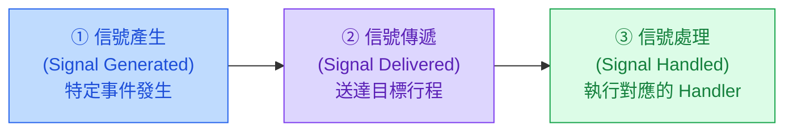
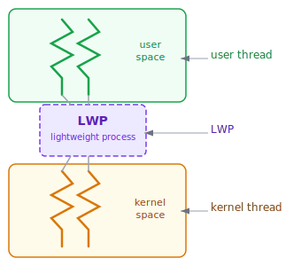
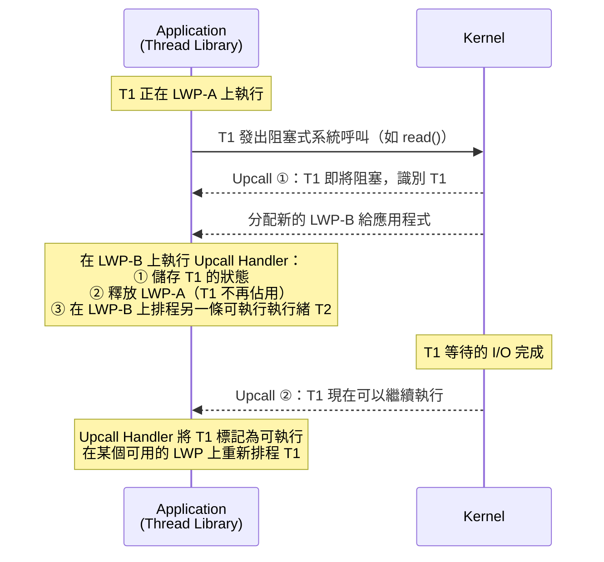

:::note
本系列文章內容參考自經典教材 **Operating System Concepts, 10th Edition (Silberschatz, Galvin, Gagne)**。本文對應章節：**Section 4.6 Threading Issues**。
:::

## **4.6 多執行緒程式設計的議題 (Threading Issues)**

多執行緒程式設計帶來效能與結構上的好處，但也引入了一系列在單執行緒世界中不存在的複雜問題。本節討論設計多執行緒程式時必須面對的五個核心議題：`fork()` 與 `exec()` 的語意變化、信號的傳遞策略、執行緒取消的安全機制、執行緒私有資料的存放方式，以及 kernel 與執行緒函式庫之間的協調機制。

<br/>

## **4.6.1 fork() 與 exec() 的語意變化**

在 Chapter 3 中，`fork()` 系統呼叫的語意很清楚：複製呼叫它的行程，建立一個完整的副本。然而，當行程內部有多個執行緒時，`fork()` 的行為就變得模糊了。

以一個具體情境為例：行程 P 有三個執行緒（T1、T2、T3），此時 T2 呼叫了 `fork()`。問題是，新建立的子行程應該：

- **複製所有執行緒**（建立含有三個執行緒的子行程）？
- 還是**只複製呼叫 fork() 的那個執行緒**（建立只有 T2 的子行程）？

兩種選擇各有其用途，UNIX 系統因此提供了兩個版本的 `fork()`：一個複製所有執行緒，另一個只複製呼叫的執行緒。

**選擇哪個版本取決於 `fork()` 之後要做什麼：**

| 情境                                       | 應選用的版本       |
| :----------------------------------------- | :----------------- |
| `fork()` 後立刻呼叫 `exec()`               | 只複製呼叫的執行緒 |
| `fork()` 後不呼叫 `exec()`，子行程獨立執行 | 複製所有執行緒     |

原因在於 `exec()` 的行為：`exec()` 被呼叫後，會用新的程式**取代整個行程**，包括所有執行緒。如果 `fork()` 後馬上呼叫 `exec()`，那麼複製所有執行緒只是無謂的浪費，因為那些執行緒馬上就會被新程式覆蓋掉。反之，如果子行程要獨立執行而不呼叫 `exec()`，就應該複製所有執行緒，讓子行程保有完整的執行狀態。

<br/>

## **4.6.2 信號處理 (Signal Handling)**

### **信號的基本概念**

UNIX 系統使用**信號 (Signal)** 通知行程某個特定事件已發生。信號的整個生命週期遵循固定的三個階段：



依據信號**來源**，可分為兩類：

**同步信號 (Synchronous Signal)**：由行程自己的動作觸發，例如非法記憶體存取（segmentation fault）或除以零（division by zero）。這類信號產生後，會**送回觸發它的那個行程**，因此稱為同步：誰造成問題，誰收到信號。

**非同步信號 (Asynchronous Signal)**：由行程外部的事件觸發，例如使用者按下 `<Ctrl><C>` 中止程式，或計時器到期。這類信號通常被發送給**另一個行程**。

### **信號處理器 (Signal Handler)**

每個信號都有兩種可能的處理方式：

1. **預設信號處理器 (Default Signal Handler)**：kernel 內建的處理邏輯，例如收到 SIGTERM 就終止行程。
2. **使用者定義信號處理器 (User-defined Signal Handler)**：程式設計者自行撰寫的函式，用來覆蓋 kernel 的預設行為。

在**單執行緒程式**中，信號處理非常直接：信號一律送給「這個行程」，行程執行對應的 handler 即可。

### **多執行緒中的信號傳遞難題**

問題出在**多執行緒程式**中：一個行程內有多個執行緒，信號究竟要送給哪一個？

系統設計上有四種選項：

|                 選項                 | 說明                                               |
| :----------------------------------: | :------------------------------------------------- |
|    **① 送給信號適用的那個執行緒**    | 例如：某執行緒執行了非法記憶體存取，就由它自己處理 |
|     **② 送給行程內的每個執行緒**     | 所有執行緒都收到信號                               |
|    **③ 送給行程內特定幾個執行緒**    | 選擇性傳遞                                         |
| **④ 指定一個專屬執行緒接收所有信號** | 集中處理                                           |

選擇哪種方式取決於信號類型：

- **同步信號**（如非法存取、除以零）應送給**觸發信號的那個執行緒**，而不是其他執行緒。
- **非同步信號**（如 `<Ctrl><C>`）通常應送給**所有執行緒**，因為終止整個行程這種決定不應只影響某一條執行緒。

### **實作 API**

標準 UNIX 的 `kill()` 函式以行程為單位傳遞信號，無法指定特定執行緒：

```c
kill(pid_t pid, int signal);
```

POSIX Pthreads 提供了更精確的 `pthread_kill()`，可以將信號送給**指定的執行緒**：

```c
pthread_kill(pthread_t tid, int signal);
```

在多執行緒環境下，由於各執行緒可以各自設定要接受或封鎖 (block) 哪些信號，系統會優先將非同步信號送給第一個**未封鎖該信號**的執行緒，且每個信號只處理一次。

:::info Windows 的替代方案：APC
Windows 本身沒有信號的概念，但提供了**非同步程序呼叫 (Asynchronous Procedure Call, APC)** 作為替代機制。

APC 的功能大致等同於 UNIX 的非同步信號：當使用者執行緒收到特定事件的通知時，系統會呼叫一個預先指定的函式。

兩者的關鍵差異在於：UNIX 信號以**行程**為傳遞目標，在多執行緒環境中必須處理「送給哪個執行緒」的問題；APC 則直接送給**特定執行緒**，設計上更簡單直接，不存在同樣的模糊性。
:::

<br/>

## **4.6.3 執行緒取消 (Thread Cancellation)**

### **為什麼需要取消執行緒**

執行緒取消 (Thread Cancellation) 指的是在執行緒完成任務之前，強制終止它。這在實際應用中非常常見：

- **搜尋場景**：多個執行緒並行搜尋資料庫，一旦某個執行緒找到結果，其餘執行緒的工作就失去意義，應當被取消。
- **瀏覽器場景**：網頁用多個執行緒載入各個圖片，使用者按下「停止」按鈕後，所有正在載入的執行緒都應被取消。

被要求取消的執行緒稱為**目標執行緒 (Target Thread)**。

### **兩種取消模式**

取消的執行方式有兩種，差異在於「什麼時候真正停下來」：

**非同步取消 (Asynchronous Cancellation)**：呼叫方立刻終止目標執行緒，不等待任何確認。

**延遲取消 (Deferred Cancellation)**：目標執行緒定期自行檢查「是否應該被取消」，在安全的時間點決定是否結束自己。

非同步取消聽起來更直接，但實際上非常危險。考慮這樣的情境：目標執行緒正在更新多個執行緒共享的資料結構，或者持有某個系統資源（如 file descriptor、mutex lock）。此時被強制終止，可能導致資料不一致，或者資源永遠無法釋放，造成系統資源洩漏 (resource leak)。OS 雖然會回收部分系統資源，但不保證回收所有資源。

延遲取消則安全得多：目標執行緒定期檢查一個「取消旗標 (cancellation flag)」，只在確認安全的時間點（**取消點 (Cancellation Point)**）才真正終止自己。多數 POSIX 和標準 C 函式庫中的阻塞式系統呼叫（如 `read()`）都被定義為取消點。

### **Pthreads 的取消 API**

Pthreads 使用 `pthread_cancel()` 發出取消請求：

```c
pthread_t tid;

/* 建立執行緒 */
pthread_create(&tid, 0, worker, NULL);

/* ... */

/* 發出取消請求 */
pthread_cancel(tid);

/* 等待執行緒終止 */
pthread_join(tid, NULL);
```

呼叫 `pthread_cancel(tid)` 只是**發出請求**，並不代表目標執行緒立刻終止。目標執行緒如何回應取決於它的取消模式設定。Pthreads 支援三種取消模式：

|       模式       | 狀態 (State) | 型別 (Type)  | 說明                                           |
| :--------------: | :----------: | :----------: | :--------------------------------------------- |
|     **Off**      |   Disabled   |      —       | 取消被停用；請求會保留，待執行緒重新啟用後處理 |
|   **Deferred**   |   Enabled    |   Deferred   | 預設模式；執行緒在取消點才終止                 |
| **Asynchronous** |   Enabled    | Asynchronous | 執行緒可以在任何時間點被立刻取消               |

預設模式為 **Deferred**。執行緒可以透過 `pthread_testcancel()` 手動設立一個取消點：如果有待處理的取消請求，呼叫 `pthread_testcancel()` 後執行緒就會終止；否則函式直接返回，執行緒繼續執行。

```c
while (1) {
    /* 執行一些工作 */
    /* ... */

    /* 主動檢查是否有取消請求 */
    pthread_testcancel();
}
```

Pthreads 還允許執行緒註冊一個 **cleanup handler**：在執行緒被取消時，cleanup handler 會被自動呼叫，讓執行緒有機會釋放已持有的資源（例如解鎖 mutex、關閉 file descriptor），避免資源洩漏。

:::note Linux 的取消實作細節
在 Linux 系統上，Pthreads 的執行緒取消底層是透過信號 (Section 4.6.2 的機制) 來實作的，而非另一套獨立的硬體或系統機制。這也是為什麼延遲取消點和 POSIX 信號行為之間存在某些微妙的互動。
:::

### **Java 的執行緒取消**

Java 採用與 Pthreads 延遲取消類似的策略。`interrupt()` 方法將目標執行緒的中斷狀態設為 `true`：

```java
Thread worker;
// ...
worker.interrupt();
```

執行緒自己透過 `isInterrupted()` 方法定期檢查中斷狀態：

```java
while (!Thread.currentThread().isInterrupted()) {
    // ... 繼續工作
}
```

當 `isInterrupted()` 回傳 `true` 時，執行緒知道有人請求取消，並可以選擇在合適的時機優雅地結束自己。

<br/>

## **4.6.4 執行緒區域儲存 (Thread-Local Storage, TLS)**

### **問題的起點：共享的代價**

同一個行程中的執行緒共享行程的資料，這正是多執行緒程式設計的優勢之一：省去了行程間通訊的開銷。然而，在某些情況下，這種共享反而造成問題。

想像一個交易處理系統 (transaction-processing system)：每筆交易在一個獨立的執行緒中執行，每條執行緒需要一個**唯一的交易 ID (transaction identifier)**。如果把交易 ID 放在共享變數中，所有執行緒都會看到同一個值，完全無法區分。如果放在函式的區域變數中，則每次函式呼叫結束後資料就消失，跨函式呼叫無法持久化。

**執行緒區域儲存 (Thread-Local Storage, TLS)** 正是為解決這個問題而生：TLS 中的資料是**每個執行緒各自擁有一份副本**，對其他執行緒不可見，但在該執行緒的整個生命週期內跨函式呼叫都持久存在。

### **TLS 與其他儲存方式的比較**

|         特性         | 區域變數 (Local Variable) | 靜態/全域變數 (Static) |  TLS   |
| :------------------: | :-----------------------: | :--------------------: | :----: |
|    跨函式呼叫持久    |            否             |           是           |   是   |
|   每個執行緒各一份   |    是（每次呼叫一份）     |  否（所有執行緒共享）  | **是** |
| 執行緒生命週期內持久 |            否             |           是           |   是   |

TLS 在某種意義上類似 `static` 資料（跨函式呼叫持久存在），但關鍵差異在於：`static` 資料是所有執行緒共享的一份，而 TLS 是每個執行緒都有自己獨立的一份。實作上，TLS 通常也以 `static` 形式宣告，只是帶有額外的「執行緒私有」標記。

:::info 為什麼需要 TLS：隱式執行緒的情境
當使用執行緒池 (Thread Pool) 或其他隱式執行緒技術時，程式設計者通常無法控制執行緒的建立過程，也就無法在建立執行緒時傳入初始化參數。TLS 在這類情境下特別有用，因為它讓執行緒能夠自行維護私有狀態，不需要依賴外部傳入的參數。
:::

### **各語言 / 函式庫的 TLS 支援**

|   語言 / 函式庫    | 宣告方式                                           | 說明                                        |
| :----------------: | :------------------------------------------------- | :------------------------------------------ |
|      **Java**      | `ThreadLocal<T>` 類別，搭配 `set()` / `get()` 方法 | 標準函式庫支援                              |
|    **Pthreads**    | `pthread_key_t` 型別                               | 提供每個執行緒私有的 key，用來存取 TLS 資料 |
| **C# (Microsoft)** | `[ThreadStatic]` 屬性 (attribute)                  | 宣告在靜態欄位上                            |
|      **GCC**       | `__thread` 關鍵字                                  | C/C++ 語言擴展                              |

以 GCC 為例，若要為每個執行緒分配一個唯一的執行緒 ID，可以這樣宣告：

```c
static __thread int threadID;
```

這行宣告的效果是：每個執行緒都有自己的 `threadID` 變數，互不影響，且在執行緒的整個生命週期內跨函式呼叫持久存在。

<br/>

## **4.6.5 排程器啟動 (Scheduler Activations)**

### **問題背景：kernel 與使用者執行緒函式庫如何協調**

在 Section 4.3.3 討論的多對多 (many-to-many) 與雙層 (two-level) 執行緒模型中，使用者執行緒與 kernel 執行緒之間存在一個微妙的協調需求：**kernel 需要動態調整提供給應用程式的 kernel 執行緒數量**，才能確保效能，但它必須先知道應用程式的執行狀況。

這個協調機制的核心是**輕量級行程 (Lightweight Process, LWP)** 與**排程器啟動 (Scheduler Activation)** 兩個概念。

### **輕量級行程 (Lightweight Process, LWP)**

在多對多或雙層模型中，kernel 與使用者執行緒函式庫之間放置了一個中間資料結構，稱為**輕量級行程 (Lightweight Process, LWP)**：



圖中展示了三層結構：

- **User thread（使用者執行緒）**：應用程式建立的執行緒，存在於使用者空間 (user space)
- **LWP（輕量級行程）**：位於使用者空間與 kernel 空間之間的中介結構
- **Kernel thread（kernel 執行緒）**：OS 實際調度到 CPU 上執行的執行緒，存在於 kernel 空間

從使用者執行緒函式庫的角度來看，LWP 就像一個**虛擬處理器 (virtual processor)**，應用程式可以在其上排程使用者執行緒來執行。每個 LWP 各自對應一條 kernel 執行緒。如果 kernel 執行緒因等待 I/O 等事件而阻塞，LWP 也會跟著阻塞，進而使依附在該 LWP 上的使用者執行緒也阻塞。

**需要幾個 LWP 才夠用？** 取決於應用程式的特性：

- **CPU 密集型 (CPU-bound) 應用，單一處理器**：一次只有一個執行緒能執行，因此一個 LWP 就已足夠。
- **I/O 密集型 (I/O-intensive) 應用**：需要多個 LWP 並行等待不同的 I/O 完成。通常每個並行中的阻塞式系統呼叫都需要一個 LWP。例如，五個 file-read 請求同時發生，就需要五個 LWP，因為它們各自在 kernel 中等待 I/O。若行程只有四個 LWP，第五個請求就必須等其中一個 LWP 從 kernel 返回後才能執行。

### **Scheduler Activation 與 Upcall 機制**

Scheduler Activation 是 kernel 與使用者執行緒函式庫之間通訊的一種方案，運作原理如下：

kernel 提供給應用程式一組 LWP（虛擬處理器），應用程式可以在任何可用的 LWP 上排程使用者執行緒。當 kernel 偵測到需要應用程式調整執行策略的事件時，它主動通知應用程式，這個主動通知的過程稱為 **Upcall**。Upcall 由執行緒函式庫中的 **Upcall Handler** 負責接收，而 Upcall Handler 本身必須運行在某個 LWP 之上。

以「使用者執行緒即將阻塞」為例，完整的 Upcall 流程如下：



這個機制帶來的核心價值是：**使用者執行緒在 kernel 視角中阻塞時，不會白白浪費一個 LWP**。Upcall 讓執行緒函式庫能夠在 kernel 通知「T1 要阻塞了」的瞬間，立刻把 T1 佔用的 LWP 讓給其他可執行的執行緒，最大化 CPU 利用率。
