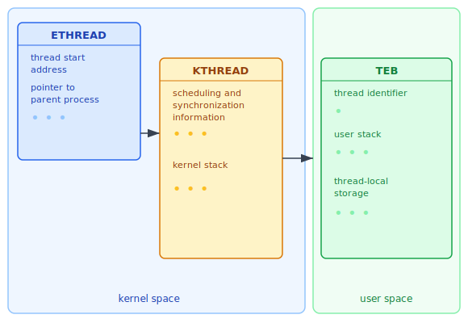
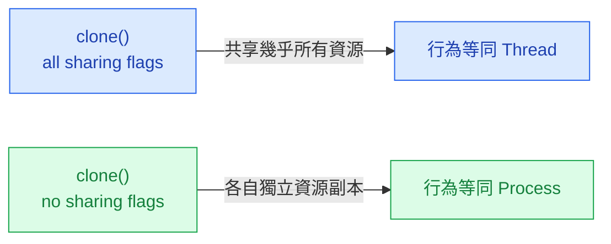
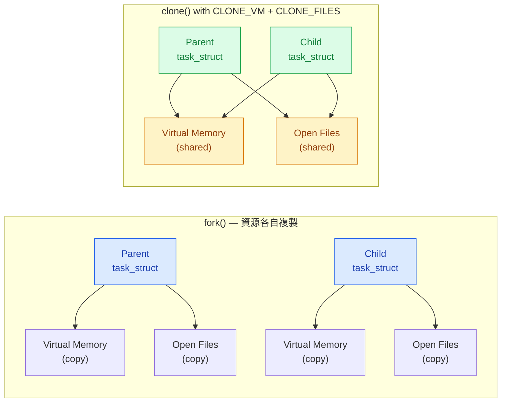

:::note
本系列文章內容參考自經典教材 **Operating System Concepts, 10th Edition (Silberschatz, Galvin, Gagne)**。本文對應章節：**Section 4.7 Operating-System Examples**。
:::

## **前言**

前幾節系統性地探討了執行緒的概念模型、映射模型（Mapping Model）、執行緒程式庫（Thread Library）、隱式執行緒（Implicit Threading），以及執行緒相關的各種議題。這些討論大多停留在抽象層次。本節從實作角度出發，分別檢視 Windows 與 Linux 如何在各自的核心中具體實現執行緒。

這兩個系統代表了截然不同的設計哲學：Windows 建立了三層精心設計的資料結構，在核心空間（Kernel Space）與使用者空間（User Space）之間劃清界線；Linux 則徹底模糊行程（Process）與執行緒（Thread）的概念邊界，以統一的任務（Task）模型搭配 `clone()` 系統呼叫的旗標（Flag）來控制共享程度。

 

## **4.7.1 Windows 執行緒**

### **一對一映射與整體架構**

在 Windows 中，每個應用程式作為一個獨立行程執行，每個行程可以包含一個或多個執行緒。Windows 採用**一對一映射模型（One-to-One Mapping Model）**：每個使用者層級執行緒（User-Level Thread）對應一個核心執行緒（Kernel Thread）。這個選擇意謂著若某個執行緒因系統呼叫（System Call）而進入阻塞（Block），OS 可以直接排程同一行程內的其他執行緒繼續執行，不會因為一個執行緒阻塞而拖累整個行程。

### **執行緒的一般組成：情境（Context）**

在深入資料結構之前，先理解執行緒在執行期間需要記錄哪些狀態。一個 Windows 執行緒的一般組成如下：

| 組成元素                               | 說明                                                                       |
| :------------------------------------- | :------------------------------------------------------------------------- |
| **執行緒 ID（Thread ID）**             | 唯一識別該執行緒的編號                                                     |
| **暫存器集合（Register Set）**         | 紀錄處理器目前狀態（各通用暫存器的值）                                     |
| **程式計數器（Program Counter）**      | 指向下一條要執行的指令位址                                                 |
| **使用者堆疊（User Stack）**           | 執行緒在使用者模式（User Mode）執行時使用的堆疊                            |
| **核心堆疊（Kernel Stack）**           | 執行緒切換至核心模式（Kernel Mode）時使用的堆疊                            |
| **私有儲存區（Private Storage Area）** | 供各種執行期函式庫（Runtime Library）與動態連結程式庫（DLL）使用的私有空間 |

其中，**暫存器集合、堆疊，以及私有儲存區**合稱為執行緒的**情境（Context）**。情境是執行緒在某一時刻完整執行狀態的快照（Snapshot），正是情境切換（Context Switch）時需要保存與恢復的內容。保存情境讓 OS 可以暫停一個執行緒、去執行其他事情，之後再完整地繼續它，宛如從未中斷過。

### **三層核心資料結構**

Windows 執行緒的核心實作依賴三個主要資料結構：**ETHREAD**、**KTHREAD**、**TEB**。理解這三者，首先要問的問題是：為什麼需要三個結構，而不是一個？

根本原因在於**安全性與空間隔離**。執行緒的部分狀態屬於核心機密（例如，核心堆疊、排程資訊），使用者程式不應能直接讀寫；另一部分狀態則是執行緒在使用者模式下需要快速存取的（例如，Thread ID、使用者堆疊指標）。若全部放在同一個結構裡，要麼將機密暴露給使用者程式，要麼讓執行緒每次讀取自己的 ID 都要陷入核心（Kernel Trap），兩者都不可接受。三層結構正是針對這個問題的解答。

下圖呈現三個資料結構的關係與各自所在空間：

圖中從左到右是一個指標鏈：ETHREAD 持有指向 KTHREAD 的指標，KTHREAD 持有指向 TEB 的指標，而 ETHREAD 與 KTHREAD 完全位於核心空間，TEB 則位於使用者空間。

以下分別說明三個結構的職責：

**ETHREAD（Executive Thread Block，執行緒執行區塊）**

ETHREAD 是 Windows 執行緒的最頂層結構，存放的是執行緒的基本身份資訊：

- 指向該執行緒所屬行程（Parent Process）的指標
- 執行緒起始常式（Thread Start Routine）的位址，即執行緒開始執行時的進入點
- 指向對應 KTHREAD 的指標

ETHREAD 是 OS 在排程前認識一個執行緒的入口。

**KTHREAD（Kernel Thread Block，核心執行緒區塊）**

KTHREAD 存放執行緒的排程（Scheduling）與同步（Synchronization）資訊，以及執行緒在核心模式下使用的**核心堆疊（Kernel Stack）**。每當執行緒發出系統呼叫而切換到核心模式時，CPU 就使用這個堆疊。KTHREAD 也持有指向 TEB 的指標，以便核心在必要時存取使用者空間的執行緒資訊。

**TEB（Thread Environment Block，執行緒環境區塊）**

TEB 是一個使用者空間的資料結構，在執行緒以使用者模式執行時被存取，包含：

- **執行緒識別碼（Thread Identifier）**
- **使用者模式堆疊（User-Mode Stack）**
- **執行緒區域儲存（Thread-Local Storage）** 陣列，用於儲存執行緒私有的全域變數

TEB 存在於使用者空間，讓執行緒可以不透過核心而快速讀取自己的 ID 或堆疊位置，避免不必要的模式切換（Mode Switch）開銷。

:::info 空間隔離的設計意義
ETHREAD 與 KTHREAD 存在於核心空間，**只有 OS 核心可以存取**，使用者程式完全無法觸及。TEB 存在於使用者空間，執行緒在使用者模式下可直接讀取。這個設計達到雙重目標：核心機密（堆疊指標、排程優先權）得到保護；使用者程式常用的執行緒資訊（ID、使用者堆疊）則可高效存取，無需每次都陷入核心。
:::

 

## **4.7.2 Linux 執行緒**

### **「沒有執行緒」的作業系統**

Linux 的執行緒設計有一個令人意外的核心前提：**Linux 核心本身並不區分行程（Process）與執行緒（Thread）**。Linux 使用 **任務（Task）** 這個統一術語來指稱程式中的一條控制流（Flow of Control），無論它在應用層被稱為行程還是執行緒。

這並不是說 Linux 不支援執行緒，Linux 當然支援，而是說：「執行緒」與「行程」在 Linux 核心中是同一種東西，區別只在於**兩個 Task 之間共享多少資源**。

### **fork() 與 clone() 的角色分工**

Linux 提供兩個相關的系統呼叫：

- **`fork()`**：傳統的行程建立，複製父行程建立一個獨立的子行程，兩者之後擁有各自獨立的資源副本。
- **`clone()`**：更通用的 Task 建立，呼叫時傳入旗標（Flags）來精細控制父子 Task 之間要共享哪些資源。

`fork()` 可以理解為 `clone()` 的一個特例：不傳入任何共享旗標時，行為等同於 `fork()`，建立出一個資源完全獨立的子行程。

### **clone() 的旗標控制共享程度**

當 `clone()` 被呼叫時，傳入的旗標決定了哪些資源由父子 Task 共享。教科書列出的主要旗標如下：

| 旗標（Flag）    | 共享的資源                                              |
| :-------------- | :------------------------------------------------------ |
| `CLONE_FS`      | 檔案系統資訊（File-System Information），如當前工作目錄 |
| `CLONE_VM`      | 相同的記憶體空間（Memory Space）                        |
| `CLONE_SIGHAND` | 信號處理器（Signal Handlers）                           |
| `CLONE_FILES`   | 已開啟的檔案集合（Set of Open Files）                   |

假設以 `CLONE_FS | CLONE_VM | CLONE_SIGHAND | CLONE_FILES` 呼叫 `clone()`，父子 Task 將共享檔案系統資訊、記憶體空間、信號處理器，以及開啟的檔案集合。這等同於在本章前面所描述的「建立一個執行緒」，因為父子 Task 幾乎共享了所有資源，在概念上就是同一個行程內的兩條控制流。

反之，若不傳入任何共享旗標，`clone()` 的行為等同於 `fork()`，建立出一個資源完全獨立的子行程。

共享程度的連續性如下所示：

### **task_struct：以指標實現彈性共享**

這種可調式共享程度之所以可行，根本原因在於 Linux 核心表示 Task 的方式。系統中每個 Task 都有一個唯一的核心資料結構：`struct task_struct`。

`task_struct` 有一個關鍵設計決策：**它本身並不直接儲存 Task 的資料，而是儲存指向其他資料結構的指標（Pointers）**。例如，`task_struct` 持有：

- 指向「已開啟檔案清單」的指標
- 指向「信號處理資訊結構」的指標
- 指向「虛擬記憶體結構」的指標

這個指標導向（Pointer-Based）的設計讓 `fork()` 與 `clone()` 的差異變得非常清晰：

- **呼叫 `fork()` 時**：核心建立一個新的 `task_struct`，並將父行程所有關聯資料結構**完整複製**一份給子行程。兩者之後各自獨立，修改各自的記憶體或檔案不會影響對方。
- **呼叫 `clone()` 並傳入共享旗標時**：核心同樣建立新的 `task_struct`，但讓新 Task 的指標**直接指向父 Task 的資料結構**，而非複製。如此一來，兩個 Task 操作的是**同一份記憶體與檔案**，任一 Task 的修改立即對另一方可見，這正是執行緒語義（Thread Semantics）的核心。

:::info 為什麼 Linux 不為 Thread 設計獨立的核心結構？
這是一個設計選擇，而非技術限制。Linux 的設計者（Linus Torvalds）認為，「行程」與「執行緒」本質上都是「能執行的程式碼加上一組資源」，差別只在資源共享程度。用同一套機制（`task_struct` + `clone()` 旗標）統一表示，比維護兩套獨立的核心結構更簡潔。這個設計也帶來額外的彈性：透過旗標可以建立各種介於「完全獨立」與「完全共享」之間的中間態。
:::

### **延伸：clone() 與容器（Containers）**

`clone()` 的彈性還能進一步延伸至**容器（Container）** 的實作。容器是 OS 提供的虛擬化（Virtualization）技術，讓單一 Linux 核心上能夠建立多個相互隔離的 Linux 系統實例（Instance）。

`clone()` 除了用來控制資源共享程度的旗標之外，還提供另一組與**命名空間（Namespace）** 相關的旗標（如 `CLONE_NEWPID`、`CLONE_NEWNET`）。這些旗標讓新建立的 Task 對特定的資源有一個隔離的「視角（View）」：容器內看到的 PID 編號從 1 開始（與主機 OS 完全不同），網路介面獨立，掛載點（Mount Point）也獨立。

正因如此，`clone()` 成為了 Linux 容器技術（包括 Docker 與 Podman 等）的底層基礎。容器的詳細運作機制將在第 18 章進一步討論。

 

## **Windows 與 Linux 的設計比較**

理解兩個系統各自的執行緒實作後，以下從幾個維度進行對比。兩者的差異不只是技術細節，更反映了底層不同的設計哲學：Windows 選擇了明確分層的結構化設計，Linux 選擇了統一抽象搭配彈性旗標的精簡設計。

| 比較面向                | Windows                                      | Linux                                                    |
| :---------------------- | :------------------------------------------- | :------------------------------------------------------- |
| **概念模型**            | 行程（Process）＋執行緒（Thread），明確區分  | 統一任務（Task），差異由共享程度決定                     |
| **映射模型**            | 一對一（One-to-One）                         | 核心直接管理 Task                                        |
| **核心資料結構**        | ETHREAD、KTHREAD、TEB 三層                   | `struct task_struct`（指標導向）                         |
| **核心/使用者空間分隔** | ETHREAD/KTHREAD 在核心空間，TEB 在使用者空間 | `task_struct` 完全在核心空間                             |
| **建立機制**            | `CreateThread()` API                         | `clone()` 系統呼叫                                       |
| **共享彈性**            | 固定三層結構，行程/執行緒明確區分            | 旗標可精細控制共享範圍，同一機制可建立執行緒、行程或容器 |
