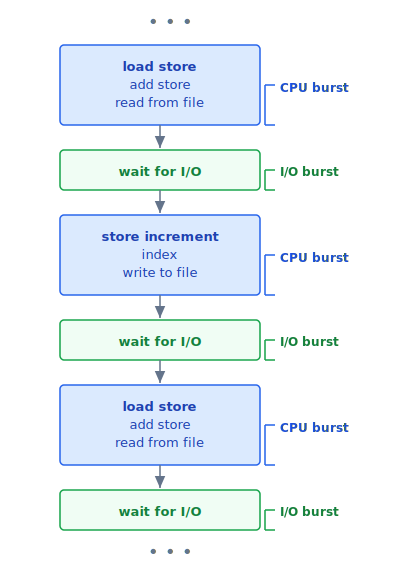
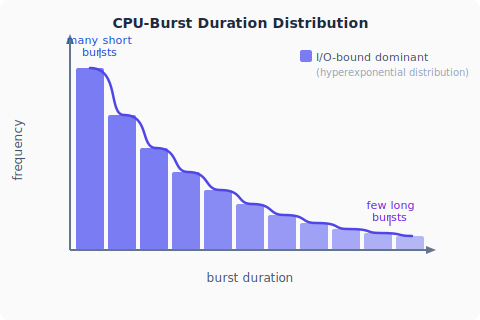
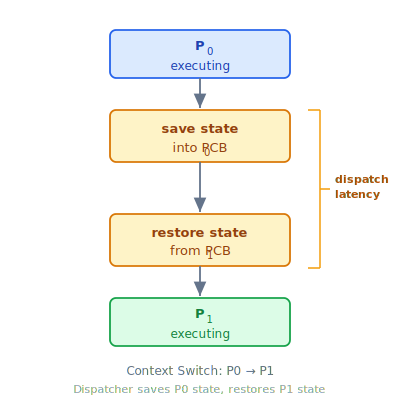
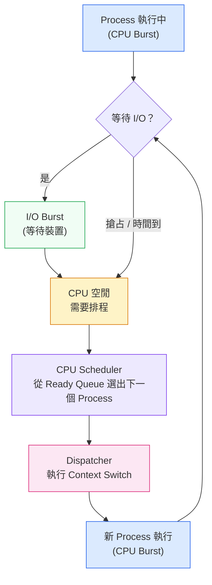

:::note
本系列文章內容參考自經典教材 **Operating System Concepts, 10th Edition (Silberschatz, Galvin, Gagne)**。本文對應章節：**Section 5.1 Basic Concepts**。
:::

## **為什麼需要 CPU 排程？**

在只有單一 CPU 核心的系統中，同一時間只能有一個 Process 真正執行。其他 Process 必須等待，直到 CPU 核心空出來才能被重新排程。

這帶來一個根本問題：**Process 在等待 I/O 完成時，CPU 會完全閒置**。以一次典型的磁碟讀取為例：

1. Process 發出讀取請求，OS 將指令交給 Disk Controller。
2. Disk Controller 自主執行資料搬移，耗時可能長達數毫秒。
3. 在這段期間，CPU **完全沒有事情做**，只能乾等。
4. 讀取完成後，中斷觸發，Process 才能繼續。

在只有一個 Process 的世界裡，這種等待無可避免。但如果記憶體中同時存放多個 Process，當其中一個 Process 進入等待，OS 可以立刻把 CPU 交給另一個 Process 繼續執行，**讓 CPU 保持忙碌**。這正是**多元程式設計（Multiprogramming）** 的核心思想。

CPU 排程（CPU Scheduling）就是實現這個構想的機制：**決定在任何時刻，CPU 要交給哪個 Process 使用**。這是作業系統最核心的功能之一，幾乎所有電腦資源在使用前都需要排程，而 CPU 是其中最關鍵的資源。

<br/>

## **5.1.1 CPU-I/O Burst Cycle**

CPU 排程能夠發揮效果，根本原因在於 Process 的執行模式存在一個規律：**Process 的執行是 CPU 執行與 I/O 等待交替循環的過程**。

Process 的生命週期由兩種狀態不斷交替組成：

- **CPU Burst（CPU 執行期）**：Process 正在使用 CPU 執行指令，例如運算、讀寫暫存器、操作記憶體。
- **I/O Burst（I/O 等待期）**：Process 在等待 I/O 操作完成（如讀取檔案、等待鍵盤輸入、等待網路封包），期間完全不需要 CPU。

Process 從第一個 CPU Burst 開始，接著是 I/O Burst，再接著 CPU Burst，如此反覆，直到最後一個 CPU Burst 結束，Process 發出終止系統呼叫（System Call）才結束執行：



藍色方塊代表 CPU Burst，即 Process 正在執行指令的階段；綠色方塊代表 I/O Burst，即 Process 進入等待、CPU 可以被其他 Process 使用的時機。

**這個交替模式正是 CPU 排程發揮作用的空隙**：每當一個 Process 進入 I/O Burst，CPU 就空了出來，排程器可以立刻把 CPU 給另一個等待中的 Process，而不是讓 CPU 白白閒置。

### **CPU Burst 的時長分佈**

研究人員實測了大量 Process 的 CPU Burst 持續時間，發現它們的分佈呈現一個規律，如下圖所示：



橫軸是 CPU Burst 的持續時間，縱軸是出現頻率。曲線呈現**指數衰減（Exponential）或超指數衰減（Hyperexponential）**的形狀：**短 CPU Burst 數量極多，長 CPU Burst 數量很少**。

這個分佈揭示了兩類 Process 的特徵：

| Process 類型 | CPU Burst 特徵 | 代表性程式 |
| :----------: | :------------: | :--------: |
| **I/O-bound**（I/O 密集）| 許多短 CPU Burst | 文字編輯器、資料庫查詢 |
| **CPU-bound**（運算密集）| 少數長 CPU Burst | 影片轉碼、科學運算 |

大多數真實系統以 I/O-bound Process 為主，因此短 CPU Burst 占了壓倒性的多數。這個分佈的意義在於：**CPU 排程演算法的設計必須考慮 Burst 長度的差異**，才能在不同工作負載下都保持良好效能。

<br/>

## **5.1.2 CPU Scheduler（CPU 排程器）**

每當 CPU 變成閒置狀態，OS 必須立刻從 Ready Queue 中挑選一個 Process 來執行。執行這個選擇動作的元件就是 **CPU Scheduler（CPU 排程器）**，它的職責是：

> 從記憶體中所有處於就緒狀態（Ready）的 Process 裡，選出一個，並將 CPU 分配給它。

**Ready Queue 的實作形式**是排程演算法設計的關鍵自由度。它並不一定是傳統的先進先出（FIFO，First-In First-Out）佇列，視排程策略不同，可以實作為：

- FIFO 佇列（先到先服務）
- 優先權佇列（Priority Queue，高優先權先執行）
- 樹狀結構（如 Linux 的 Red-Black Tree）
- 無序鏈結串列（Unordered Linked List）

概念上，Ready Queue 中的每個紀錄都是一個 **PCB（Process Control Block，行程控制區塊）**，存放了 Process 的執行狀態、暫存器值、優先權等資訊，排程器透過 PCB 來管理所有待執行的 Process。

<br/>

## **5.1.3 搶占式與非搶占式排程 (Preemptive and Nonpreemptive Scheduling)**

CPU 排程的時機是核心問題之一。排程決策可能在以下四種情況下發生：

1. **Process 從 Running 切換到 Waiting**（例如發出 I/O 請求、呼叫 `wait()` 等待子 Process 結束）
2. **Process 從 Running 切換到 Ready**（例如發生中斷）
3. **Process 從 Waiting 切換到 Ready**（例如 I/O 完成）
4. **Process 終止**

這四種情況分成兩組：

- **情況 1 和 4**：Process 主動放棄 CPU（等待 I/O 或結束執行），排程器**沒有選擇**，必須從 Ready Queue 中找下一個 Process 來執行。
- **情況 2 和 3**：CPU 的去留有**選擇空間**，這裡就是搶占式與非搶占式的分歧點。

### **非搶占式排程 (Nonpreemptive / Cooperative Scheduling)**

若排程只在情況 1 和 4 發生，稱為**非搶占式（Nonpreemptive）**或**協作式（Cooperative）**排程。其核心規則是：

> 一旦 CPU 被分配給一個 Process，該 Process 就**持有 CPU 直到它主動放棄**，不論是因為終止執行，還是因為切換到等待狀態。

在非搶占式排程下，OS 永遠不會強制奪走 CPU。Process 必須主動讓出 CPU，系統才有機會排程其他 Process。

### **搶占式排程 (Preemptive Scheduling)**

若排程可以在全部四種情況下發生，稱為**搶占式（Preemptive）**排程。OS 可以在任何時刻強制奪走 CPU，例如：

- 一個更高優先權的 Process 剛進入 Ready Queue（情況 3）
- 目前 Process 的時間配額（Time Slice）用盡（情況 2）

幾乎所有現代作業系統（Windows、macOS、Linux、UNIX）都採用搶占式排程。

:::info 搶占式排程帶來的挑戰

搶占式排程雖然能提升 CPU 利用率與回應速度，但也引入了新的複雜性：

**1. 資料競爭（Race Condition）：** 當兩個 Process 共享資料時，若 Process A 在更新資料的中途被搶占，Process B 隨即讀取這筆資料，就會讀到不一致的狀態。這個問題將在 Chapter 6 詳細討論。

**2. 核心設計複雜度：** OS Kernel 在處理系統呼叫時，可能正在修改重要的核心資料結構（如 I/O Queue）。若 Process 在這個當下被搶占，而新排程的 Process 也需要讀寫同一個結構，就會造成混亂。

對此，設計有兩個方向：

- **非搶占式核心（Nonpreemptive Kernel）**：Kernel 在系統呼叫完成或 Process 主動等待 I/O 之前，不執行 Context Switch。核心資料結構永遠不會處於不一致狀態，設計較簡單，但對即時任務不友善。
- **搶占式核心（Preemptive Kernel）**：允許在 Kernel Mode 執行時被搶占，需要 Mutex Lock 等同步機制保護共享的核心資料結構。現代作業系統普遍採用此設計，以支援即時運算需求。

:::

<br/>

## **5.1.4 Dispatcher（分派器）**

CPU Scheduler 決定「把 CPU 給誰」，而 **Dispatcher（分派器）** 負責「真正把 CPU 交出去」。Dispatcher 是執行 CPU 分配動作的模組，它在每次 Context Switch 時被呼叫，執行以下三件事：

1. **Context Switch（情境切換）**：將目前 Process 的狀態（PC、暫存器等）儲存到它的 PCB，再將下一個 Process 的狀態從 PCB 還原。
2. **切換至 User Mode**：從 Kernel Mode 切換回 User Mode，讓 Process 能夠在受保護的模式下繼續執行。
3. **跳轉至正確位置**：把程式計數器（PC）設定到下一個 Process 應該繼續執行的指令位址。

下圖說明了 Dispatcher 在 P₀ 與 P₁ 之間執行 Context Switch 的完整流程：



整個流程分為三個階段：P₀ 執行中 → Dispatcher 儲存 P₀ 的 PCB、還原 P₁ 的 PCB → P₁ 開始執行。右側標示的區間就是 Dispatch Latency，它涵蓋了「停止 P₀ → 啟動 P₁」之間的全部時間開銷，包含儲存狀態、還原狀態，以及切換執行模式。

### **Dispatch Latency（分派延遲）**

**Dispatch Latency** 是 Dispatcher 讓出 CPU 給新 Process 所花費的時間，它直接影響系統的回應速度。由於每次 Context Switch 都要呼叫 Dispatcher，**Dispatch Latency 必須盡可能短**。

:::tip 如何觀察 Context Switch 的頻率

在 Linux 系統上，可以使用 `vmstat` 指令查看整個系統的 Context Switch 次數：

```bash
vmstat 1 3
```

輸出範例（截取 CPU 相關欄位）：

```
------cpu-----
24
225
339
```

第一行是系統開機後每秒平均的 Context Switch 次數；後兩行分別是前兩個 1 秒間隔的實際次數。這台機器在最近兩秒內分別發生了 225 次和 339 次 Context Switch，顯示系統頗為活躍。

也可以針對單一 Process 查詢，例如：

```bash
cat /proc/2166/status
```

其中會列出：

```
voluntary_ctxt_switches:    150
nonvoluntary_ctxt_switches:   8
```

- **Voluntary Context Switch（自願切換）**：Process 主動放棄 CPU，因為它需要一個目前無法取得的資源（如等待 I/O 完成）。
- **Nonvoluntary Context Switch（非自願切換）**：CPU 被強制奪走，例如 Time Slice 到期，或被更高優先權的 Process 搶占。

:::

<br/>

## **重點整理**



CPU 排程的完整循環：Process 在 CPU Burst 與 I/O Burst 之間交替；每當 CPU 變得閒置，CPU Scheduler 從 Ready Queue 選出下一個 Process，再由 Dispatcher 實際執行 Context Switch 並啟動新 Process。

| 概念 | 定義 | 關鍵特性 |
| :--: | :--- | :------- |
| **CPU Burst** | Process 使用 CPU 執行指令的期間 | 多為短 Burst，呈指數分佈 |
| **I/O Burst** | Process 等待 I/O 完成的期間 | CPU 閒置，排程的最佳時機 |
| **CPU Scheduler** | 從 Ready Queue 選出下一個 Process | Ready Queue 不一定是 FIFO |
| **Nonpreemptive** | Process 主動放棄 CPU 才切換 | 設計簡單，不支援即時任務 |
| **Preemptive** | OS 可強制奪走 CPU | 現代 OS 主流，需同步機制 |
| **Dispatcher** | 實際執行 Context Switch 的模組 | 必須越快越好 |
| **Dispatch Latency** | Dispatcher 完成切換的時間開銷 | 直接影響系統回應速度 |
