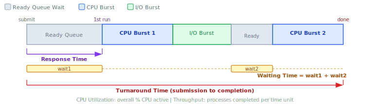

:::note
本系列文章內容參考自經典教材 **Operating System Concepts, 10th Edition (Silberschatz, Galvin, Gagne)**。本文對應章節：**Section 5.2 Scheduling Criteria**。
:::

## **為什麼需要評估標準？**

不同的 CPU 排程演算法（FCFS、SJF、Round-Robin 等）各有不同的特性，其中一個演算法在某種指標上的表現可能遠優於其他演算法，但在另一項指標上卻可能明顯較差。在選擇排程演算法時，必須先明確「最佳化哪些特性」，否則無從比較。

教科書提出了五大常用的評估標準（Scheduling Criteria），涵蓋系統整體效能與個別 Process 的使用體驗。這五個標準對應到 Process 生命週期的不同階段與觀測角度，下圖展示了它們各自對應到哪個時段：



圖中呈現了一個 Process 從「提交（submit）」到「完成（done）」的完整生命週期，包含就緒佇列等待、CPU 執行、I/O 等待三個交替循環的階段。五大評估標準分別測量這段生命週期中不同的時間區間或整體系統行為。

<br/>

## **5.2 五大排程評估標準**

### **1. CPU 利用率 (CPU Utilization)**

CPU 利用率衡量 **CPU 在整個時間軸上實際被使用的百分比**。理論上，CPU 利用率可以從 0% 到 100%，但在真實系統中通常落在：

- **輕載系統（Lightly Loaded）**：約 40%
- **重載系統（Heavily Loaded）**：約 90%

最佳化方向：**盡量最大化（maximize）**。CPU 是系統中最昂貴的資源，讓它長時間閒置是一種浪費。

:::tip 如何觀察 CPU 利用率
在 Linux、macOS、UNIX 系統上，可以使用 `top` 指令即時觀察 CPU 利用率：

```bash
top
```

輸出的第一行會顯示系統整體的 CPU 使用情況，包含 user space 與 kernel 各自佔用的比例。
:::

<br/>

### **2. 產能 (Throughput)**

產能衡量 **單位時間內完成（Complete）的 Process 數量**。這是從系統整體工作效率來看的指標：

- 對長時間運算的 Process 而言，可能是每幾秒完成一個
- 對短小的交易型程式而言，可能是每秒完成數十個

最佳化方向：**盡量最大化（maximize）**。在相同時間內完成越多工作，代表系統整體效率越高。

<br/>

### **3. 回覆時間 (Turnaround Time)**

回覆時間衡量 **一個 Process 從被提交（Submit）到完全執行完畢（Completion）所花費的總時間**。這是從單一 Process 的角度來衡量整體體驗的指標。

回覆時間由三個部分組成：

$$\text{Turnaround Time} = \text{Ready Queue Wait} + \text{CPU Execution} + \text{I/O Time}$$

最佳化方向：**盡量最小化（minimize）**。同一份工作越快完成越好。

<br/>

### **4. 等待時間 (Waiting Time)**

等待時間衡量 **一個 Process 在就緒佇列（Ready Queue）中合計等待的時間總和**。

這是排程演算法能夠最直接影響的指標，因為排程演算法本身不改變 Process 執行指令的速度，也不改變 I/O 操作的速度，**它唯一能夠控制的是 Process 在就緒佇列中等待的時間長短**。

$$\text{Waiting Time} = \sum \text{(all time periods spent in Ready Queue)}$$

最佳化方向：**盡量最小化（minimize）**。多數情況下，比較不同排程演算法時，以**平均等待時間（Average Waiting Time）** 作為主要評估指標。

<br/>

### **5. 回應時間 (Response Time)**

回應時間衡量 **一個 Process 從提交請求到第一次產生回應（First Response）所花費的時間**。注意：這裡衡量的是「開始回應」的時間點，而非「完成輸出」的時間點。

回應時間與回覆時間的差異在於：

|        指標         | 衡量範圍            | 適用場景                         |
| :-----------------: | :------------------ | :------------------------------- |
| **Turnaround Time** | 提交 → 完全完成     | 批次處理系統（Batch System）     |
|  **Response Time**  | 提交 → 第一次有回應 | 互動式系統（Interactive System） |

在互動式系統中（如桌面應用程式、網頁伺服器），使用者提交請求後最在意的是「多久能看到第一個結果」，而非「多久能全部跑完」。因此，互動式系統比批次處理系統更關注回應時間。

最佳化方向：**盡量最小化（minimize）**。

<br/>

## **最佳化方向與取捨**

五大標準的最佳化方向整理如下：

|      評估標準       | 最佳化方向 | 說明                                      |
| :-----------------: | :--------: | :---------------------------------------- |
| **CPU Utilization** |  最大化 ↑  | CPU 越忙碌越好                            |
|   **Throughput**    |  最大化 ↑  | 單位時間完成越多 Process 越好             |
| **Turnaround Time** |  最小化 ↓  | Process 從提交到完成的總時間越短越好      |
|  **Waiting Time**   |  最小化 ↓  | Process 在 Ready Queue 等待的時間越短越好 |
|  **Response Time**  |  最小化 ↓  | Process 第一次產生回應越快越好            |

在大多數情況下，排程演算法的設計目標是**最佳化各標準的平均值（Average）**。然而，有時候「平均值」並不是最重要的，而是「最壞情況（Worst Case）」或「變異數（Variance）」：

- **最大化最小值**：為確保所有 Process 都能獲得服務，有時需要確保最壞情況下的等待時間不超過某個上限。
- **最小化變異數（Minimize Variance）**：研究指出，對於互動式系統（如 PC 桌面），**降低回應時間的變異數**比降低平均回應時間更重要。一個「有時快、有時慢」的系統，使用者體驗往往比「穩定但稍慢」的系統更差。可預測的回應時間讓使用者能夠建立合理的期望。

:::info 為什麼等待時間最常被當作主要指標？
Turnaround Time、Waiting Time、Response Time 三者都與「時間」有關，但 Waiting Time 在分析時最常被使用，原因如下：

- CPU 排程演算法本身**不改變** CPU 執行速度或 I/O 速度
- 排程演算法**唯一能夠控制的**是 Process 在 Ready Queue 中等待的順序與時長
- 因此，不同演算法之間的差異，**最直接體現在 Waiting Time 上**
- Turnaround Time 中包含了 I/O 時間（排程無法控制），Response Time 則適合互動式場景

在第 5.3 節介紹各種演算法時，主要使用**平均等待時間（Average Waiting Time）** 作為比較基準。
:::
