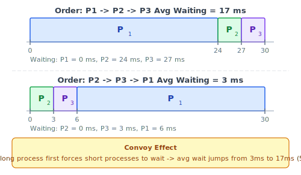
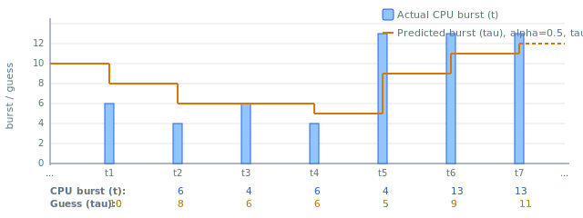
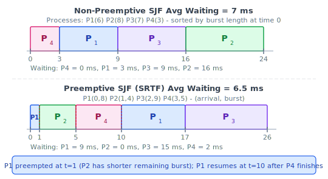
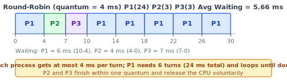
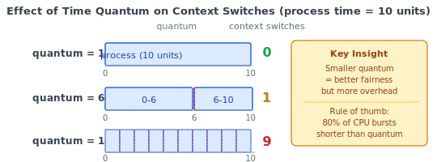
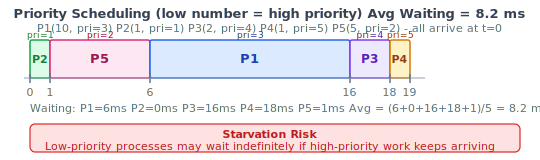
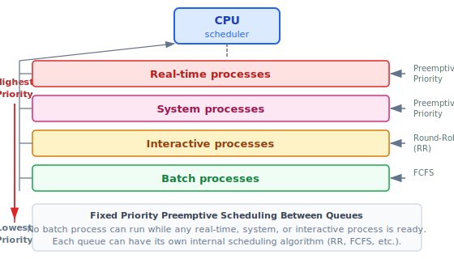
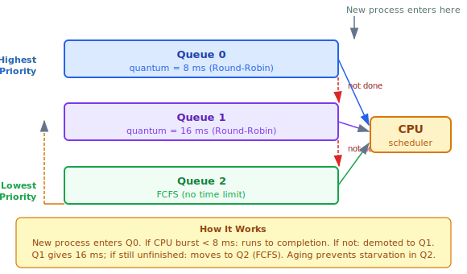
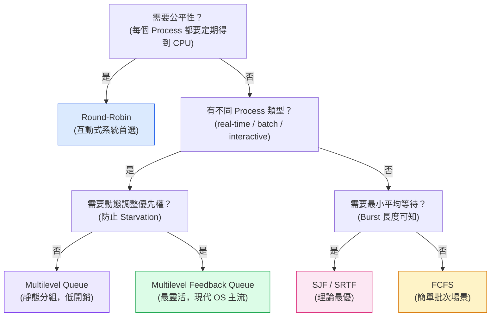

:::note
本系列文章內容參考自經典教材 **Operating System Concepts, 10th Edition (Silberschatz, Galvin, Gagne)**。本文對應章節：**Section 5.3 Scheduling Algorithms**。
:::

## **前言：Gantt Chart（甘特圖）**

在介紹各種排程演算法之前，先認識一個重要的視覺化工具：**Gantt Chart（甘特圖）**。Gantt Chart 是一種橫條圖（Bar Chart），用來呈現在特定排程下，各個 Process 佔用 CPU 的時間區間，並清楚標示每個切換的時間點。

本節的所有演算法範例都以 Gantt Chart 呈現，時間軸的單位為毫秒（milliseconds），為了讓概念聚焦，每個 Process 只考慮一次 CPU Burst。比較演算法時，統一使用**平均等待時間（Average Waiting Time）** 作為主要指標。

 

## **5.3.1 先到先服務 (First-Come, First-Served, FCFS)**

FCFS 是最直覺的排程演算法：**先到達 Ready Queue 的 Process 先獲得 CPU**。實作上非常簡單，只需維護一個 FIFO 佇列：新 Process 加入佇列尾端，CPU 永遠從佇列頭部取出下一個 Process。

### **FCFS 的問題：Convoy Effect（護衛效應）**

FCFS 的最大缺陷在於平均等待時間對 Process 到達順序非常敏感。考慮三個 Process，都在 t=0 同時到達：

| Process | CPU Burst |
| :-----: | :-------: |
|   P1    |   24 ms   |
|   P2    |   3 ms    |
|   P3    |   3 ms    |

若到達順序不同，平均等待時間的差異非常顯著，如下圖所示：

**Example 1（到達順序 P1 → P2 → P3）**：P2 必須等 P1 的 24 ms 執行完畢才能開始，P3 更要等 27 ms。等待時間為 P1=0 ms、P2=24 ms、P3=27 ms，平均 17 ms。

**Example 2（到達順序 P2 → P3 → P1）**：短 Process 先跑，P1 只等了 6 ms。等待時間為 P2=0 ms、P3=3 ms、P1=6 ms，平均只有 3 ms。

兩種順序下，平均等待時間相差將近六倍。這就是 **Convoy Effect（護衛效應）**：大量短 Process 被一個長 Process 「護送」排在後面，被迫等待，導致 CPU 和 I/O 裝置的整體利用率下降。

在真實系統中，若一個 CPU-bound Process 佔住 CPU，所有 I/O-bound Process 只能排隊等待。等到 CPU-bound Process 終於完成並去做 I/O，所有 I/O-bound Process 快速跑完自己的短 CPU Burst 又回去做 I/O，結果 CPU 立刻閒置，等待 CPU-bound Process 再回來，這個惡性循環讓整體效率大幅下降。

:::info FCFS 是非搶占式演算法
FCFS 是**非搶占式（Nonpreemptive）** 排程：一旦 CPU 分配給某個 Process，它就一直佔有 CPU 直到主動放棄（終止或 I/O 等待）。這使得 FCFS 在互動式系統中不適用，因為無法保證每個 Process 定期得到 CPU 回應。
:::

 

## **5.3.2 最短工作優先 (Shortest-Job-First, SJF)**

SJF 的策略是：**將 CPU 分配給下一個 CPU Burst 最短的 Process**。若有兩個 Process 的 Burst 長度相同，以 FCFS 決定順序。SJF 排程能夠證明在所有排程演算法中，**對於給定的 Process 集合，SJF 能夠達到最小的平均等待時間**。

### **為什麼 SJF 最佳？**

直覺理解：讓短 Process 先執行，能夠以較小的代價讓許多 Process 快速完成。長 Process 多等一段時間，但換來了大量短 Process 的等待時間大幅縮短，整體平均下來一定更優。

以四個 Process 為例（都在 t=0 到達）：

| Process | CPU Burst |
| :-----: | :-------: |
|   P1    |   6 ms    |
|   P2    |   8 ms    |
|   P3    |   7 ms    |
|   P4    |   3 ms    |

SJF 按照 Burst 長度排序後執行（P4→P1→P3→P2），平均等待時間為 (0+3+9+16)/4 = 7 ms。若改用 FCFS 以 P1→P2→P3→P4 順序執行，平均等待時間為 10.25 ms。

### **SJF 的根本問題：無法預知 Burst 長度**

SJF 在理論上最優，但有一個無法克服的實作問題：**在 CPU Scheduling 層面，無法預先知道下一個 CPU Burst 的長度**。CPU Burst 的長度只有在 Process 真正執行完畢後才能得知，根本無法在排程前就知道誰最短。

### **指數平均預測 (Exponential Average Prediction)**

實務上的解決方案是：**用過去的 CPU Burst 歷史來預測未來的 Burst 長度**，稱為**指數平均（Exponential Average）**。預測公式為：

$$\tau_{n+1} = \alpha \cdot t_n + (1 - \alpha) \cdot \tau_n$$

各符號的意義：
- $t_n$：第 $n$ 次 CPU Burst 的**實際測量長度**
- $\tau_n$：第 $n$ 次 CPU Burst 的**預測值**（前一次的猜測）
- $\tau_{n+1}$：**下一次 CPU Burst 的預測值**（新的猜測）
- $\alpha$：控制「最近歷史」與「過去歷史」的相對權重，範圍為 $0 \leq \alpha \leq 1$

下圖展示了當 $\alpha = 0.5$、$\tau_0 = 10$ 時，預測值（橘線）如何追蹤實際 CPU Burst（藍色柱）的變化：

圖中藍色柱是每次的實際 CPU Burst（$t_i$），橘色折線是對應的預測值（$\tau_i$）。可以觀察到：
- 前幾次 Burst 偏短（6, 4, 6, 4），預測值持續修正下調（10 → 8 → 6 → 5）
- 當連續出現長 Burst（13, 13, 13），預測值也相應上調（9 → 11 → 12）
- 預測值始終滯後於實際值，因為預測是基於過去的歷史資料

$\alpha$ 參數控制歷史與現狀的平衡：

|  $\alpha$ 值   | 效果                                                      |
| :------------: | :-------------------------------------------------------- |
|  $\alpha = 0$  | $\tau_{n+1} = \tau_n$，完全忽略最近的 Burst，只看過去歷史 |
|  $\alpha = 1$  | $\tau_{n+1} = t_n$，只看最近一次 Burst，完全忽略過去      |
| $\alpha = 0.5$ | 最近一次與過去歷史各佔一半（最常用）                      |

展開公式後可以看到，每個過去的 Burst 對預測值的貢獻都呈指數衰減：越久遠的 Burst 影響力越小。這正是「指數平均」名稱的來源。

### **搶占式 SJF：最短剩餘時間優先 (Shortest-Remaining-Time-First, SRTF)**

SJF 可以選擇實作為搶占式（Preemptive）或非搶占式（Nonpreemptive）：

- **非搶占式 SJF**：CPU 分配後，Process 一直執行到完成（或 I/O 等待）才重新排程
- **搶占式 SJF（SRTF）**：每當有新 Process 進入 Ready Queue，比較新 Process 的 Burst 長度與當前 Process 的**剩餘時間**，若新 Process 更短則搶占

下圖展示了四個 Process 在非搶占與搶占兩種模式下的 Gantt Chart：

上半部（Non-Preemptive SJF）：所有 Process 在 t=0 到達，按 Burst 長度排序執行，平均等待時間為 7 ms。

下半部（SRTF）：P2 在 t=1 到達，剩餘時間（4 ms）短於 P1 目前剩餘時間（7 ms），因此搶占 P1。P4 在 t=3 到達（burst=5），此時 P2 剩餘 3 ms，P4 較長，不搶占。P4 在 t=5 排在 P2 之後執行，等依此類推。最終平均等待時間僅 6.5 ms，比非搶占版本的 7.75 ms 更優。

 

## **5.3.3 循環排程 (Round-Robin, RR)**

Round-Robin 是一種專為**互動式系統**設計的搶占式排程演算法。它在 FCFS 的基礎上加入了時間配額機制：

**核心規則**：定義一個**時間量（Time Quantum，也稱 Time Slice）**，通常為 10 到 100 ms。CPU Scheduler 依序從 FIFO 的 Ready Queue 中取出 Process，讓它最多執行一個 Time Quantum。每一次取出執行後，有兩種結果：

1. **Process 的 CPU Burst 在一個 Quantum 內完成**：Process 主動放棄 CPU，Scheduler 繼續取下一個 Process
2. **Process 的 CPU Burst 超過一個 Quantum**：Timer 觸發中斷，Process 被搶占，放回 Ready Queue **尾端**，Scheduler 繼續取下一個 Process

以三個 Process（P1=24ms, P2=3ms, P3=3ms，quantum=4ms）為例：

P1 第一次執行 4 ms 後被強制搶占，放回佇列尾端。P2 執行 3 ms（不足一個 quantum），主動放棄。P3 同樣執行 3 ms 後放棄。之後 Ready Queue 只剩 P1，它輪流取得 Quantum，共執行 6 次才完成。等待時間：P1=6 ms（10−4），P2=4 ms，P3=7 ms，平均 5.66 ms。

**Round-Robin 的保證**：若 Ready Queue 有 n 個 Process，且 Quantum 為 q，則每個 Process 最多等待 $(n-1) \times q$ 個時間單位就能獲得下一次 Quantum，CPU 時間被公平地分配成每份最多 q 個時間單位。

### **Time Quantum 大小的取捨**

Time Quantum 的大小是 RR 演算法最關鍵的設計參數，決定了系統的效能特性：

圖中以一個「耗時 10 個時間單位的 Process」為例，展示三種不同 Quantum 大小的效果：

- **quantum=12**：Process 在一個 Quantum 內完成，0 次 Context Switch，沒有任何額外開銷
- **quantum=6**：Process 需要 2 個 Quantum，發生 1 次 Context Switch
- **quantum=1**：Process 需要 10 個 Quantum，發生 9 次 Context Switch，大量 CPU 時間浪費在切換本身

這揭示了兩個極端的問題：

|     極端情況     | 效果                                                 |
| :--------------: | :--------------------------------------------------- |
| **Quantum 極大** | RR 退化成 FCFS，喪失公平性                           |
| **Quantum 極小** | Context Switch 過於頻繁，大量 CPU 時間浪費在切換本身 |

實務上的黃金法則：**80% 的 CPU Burst 應該短於 Time Quantum**，現代系統的 Quantum 通常在 10 到 100 ms，而 Context Switch 所需時間通常短於 10 微秒（佔 Quantum 的極小比例）。

:::info Round-Robin 的平均等待時間往往較長
RR 的平均等待時間通常比 SJF 長，但它提供了一個 SJF 無法給出的保證：**每個 Process 都能定期獲得 CPU**（最多等待 $(n-1) \times q$ 時間），不會有任何 Process 餓死。這使得 RR 非常適合互動式系統，因為使用者感知的是回應時間，而非平均等待時間。
:::

 

## **5.3.4 優先權排程 (Priority Scheduling)**

Priority Scheduling 為每個 Process 賦予一個**優先權（Priority）數值**，CPU 永遠分配給 Ready Queue 中優先權最高的 Process。優先權相同的 Process 以 FCFS 決定順序。

:::info SJF 是 Priority Scheduling 的特例
SJF 可以看作是 Priority Scheduling 的特例：將優先權定義為「預測 CPU Burst 長度的倒數」（Burst 越短，優先權越高）。
:::

**優先權的數值慣例**：一般以固定範圍的數字表示（如 0 到 7，或 0 到 4095）。但**數值越小代表優先權越高，還是越低**，不同系統的慣例不同。本教科書統一採用**數字越小代表優先權越高**（low number = high priority）的慣例。

以五個 Process 為例（都在 t=0 到達）：

P2（priority=1，最高）先執行，接著是 P5（priority=2），再來是 P1（priority=3），然後 P3（priority=4），最後是 P4（priority=5，最低）。平均等待時間為 (6+0+16+18+1)/5 = 8.2 ms。

### **優先權的來源**

優先權可以由兩種方式決定：

- **內部定義（Internally Defined）**：由 OS 根據可測量的參數計算，例如時間限制、記憶體需求、開啟的檔案數量、I/O 與 CPU Burst 的比例等
- **外部定義（Externally Defined）**：由 OS 外部的標準決定，例如 Process 的重要性、付費等級、所屬部門等

### **搶占式與非搶占式優先權排程**

Priority Scheduling 同樣有搶占與非搶占兩種版本：

- **搶占式**：當新 Process 進入 Ready Queue 且其優先權高於當前執行的 Process，立刻搶占 CPU
- **非搶占式**：新高優先權 Process 只會被放到 Ready Queue 的頭部，等待當前 Process 自願放棄 CPU

### **Starvation（飢餓）問題**

Priority Scheduling 有一個嚴重問題：**Starvation（飢餓，或稱 Indefinite Blocking）**。在重載系統中，高優先權的 Process 源源不絕地進入，低優先權的 Process 可能永遠無法得到 CPU。

有傳說指出，MIT 在 1973 年關閉 IBM 7094 時，發現一個在 1967 年提交的低優先權 Process 從未被執行過。

### **Aging（老化）：解決飢餓的方案**

解決飢餓的標準方法是**Aging（老化）**：**隨著 Process 在系統中等待的時間增長，自動逐步提高它的優先權**。

例如，若優先權範圍為 127（最低）到 0（最高），可以每隔一秒將等待中的 Process 優先權提高 1 個單位。一個初始優先權為 127 的 Process，只需等待大約 2 分鐘就能升至最高優先權（0），保證最終一定能被執行。

### **Priority + Round-Robin 的組合**

實務上常將優先權排程與 Round-Robin 結合：**先執行優先權最高的 Process，同優先權的 Process 之間採用 Round-Robin**。

以五個 Process（burst 以 ms 計，quantum=2ms）為例：

| Process | Burst Time | Priority |
| :-----: | :--------: | :------: |
|   P1    |     4      |    3     |
|   P2    |     5      |    2     |
|   P3    |     8      |    2     |
|   P4    |     7      |    1     |
|   P5    |     3      |    3     |

P4（priority=1）優先權最高，先執行完畢（0→7）。P2 和 P3 同為 priority=2，以 RR 方式交替執行（7→9→11→13→15→16，P2 結束；16→20，P3 結束）。最後 P1 和 P5 同為 priority=3，以 RR 交替執行（20→22→24→26→27，全部完成）。

 

## **5.3.5 多層佇列排程 (Multilevel Queue Scheduling)**

當 Priority Scheduling 與 Round-Robin 結合後，每次選出最高優先權 Process 需要掃描整個 Ready Queue，時間複雜度為 $O(n)$。在實務中，通常改用更高效的做法：**為每個優先權層級維護一個獨立的佇列**。

**核心概念**：Process 依類型被永久分配到對應的佇列，每個佇列有自己的排程演算法，佇列之間採用固定優先權搶占排程。

下圖展示了典型的多層佇列架構：

圖中從上到下依優先權高低排列四種佇列，每種佇列中有等待 CPU 的 Process（圖示為 T₀、T₁...），CPU Scheduler 永遠先服務最高優先權的非空佇列。

典型的分層方式（由高到低）：

1. **Real-time processes（即時 Process）**：對時間最敏感，必須立即回應
2. **System processes（系統 Process）**：OS 核心服務，高優先
3. **Interactive processes（互動式 Process）**：使用者操作的前景程式，採 RR 提升回應
4. **Batch processes（批次 Process）**：背景長時間運算，採 FCFS

**關鍵規則**：低優先權佇列中的 Process **必須等到所有更高優先權的佇列完全清空**才能執行。例如，若有 Interactive Process 進入佇列，正在執行的 Batch Process 立刻被搶占。

**CPU 時間分配的另一種方式**：除了完全的優先權搶占，也可以採用**時間切片（Time-Slice）分配**，例如前景佇列（Interactive）獲得 80% 的 CPU 時間，背景佇列（Batch）獲得 20%。

:::info Multilevel Queue 的侷限
**Multilevel Queue 的根本問題是靜態（Static）**：Process 在進入系統時被永久分配到某個佇列，永遠不會移動。一個 I/O-bound 的 Process 與一個 CPU-bound 的 Process 可能都被分到同一佇列，但它們的行為模式完全不同。這種靜態設計雖然排程開銷低，但缺乏彈性。
:::

 

## **5.3.6 多層回饋佇列排程 (Multilevel Feedback Queue Scheduling)**

Multilevel Feedback Queue 是 Multilevel Queue 的進化版，核心差異在於：**Process 可以在佇列之間移動**。

**設計思想**：根據 Process 的 CPU Burst 行為動態調整其優先層級：

- **使用過多 CPU 時間（CPU-bound 行為）**：降到較低優先權佇列（降級，Demotion）
- **等太久（即將飢餓）**：提到較高優先權佇列（Aging 升級，Promotion）

這讓 I/O-bound 和互動式 Process（以短 CPU Burst 為特徵）自然停留在高優先權佇列，長時間計算的 CPU-bound Process 逐漸沉降到低優先權佇列。

下圖展示一個三層回饋佇列的典型架構：

圖中有三個層級的佇列，從上到下優先權依次降低：

- **Queue 0（quantum=8ms）**：所有新 Process 進入此佇列。若 8 ms 內能完成，立刻執行完畢；若無法在 8 ms 內完成，被搶占並移入 Queue 1
- **Queue 1（quantum=16ms）**：來自 Queue 0 的「較長」Process。給予 16 ms 的機會；若仍未完成，移入 Queue 2
- **Queue 2（FCFS）**：最長的 Process。以 FCFS 執行，但只有 Queue 0 和 Queue 1 都為空時才輪到它。為防止無限飢餓，等待太久的 Process 可以被 Aging 機制升回 Queue 1

**這個設計的效果**：

- 短 CPU Burst（8 ms 以下）的 Process：第一次排程就完成，幾乎零等待
- 中等 CPU Burst（8~24 ms）：在 Queue 1 得到服務，優先權次高
- 長 CPU Burst（24 ms 以上）：沉降到 Queue 2 以 FCFS 處理，等候空閒 CPU 時間

### **Multilevel Feedback Queue 的通用定義**

一個 Multilevel Feedback Queue 排程器由以下五個參數定義：

1. **佇列數量（Number of queues）**
2. **每個佇列的排程演算法（Scheduling algorithm for each queue）**
3. **升級條件（When to promote a process to a higher-priority queue）**
4. **降級條件（When to demote a process to a lower-priority queue）**
5. **新 Process 進入哪個佇列（Which queue a new process enters）**

Multilevel Feedback Queue 是最通用也是最複雜的 CPU 排程演算法。它可以被設定為符合任何系統的需求，但也因為參數眾多，如何選擇最佳設定本身就是一個難題。

 

## **各演算法比較**

|            演算法             | 搶占式？ |     平均等待時間     | 特點                            | 適用場景                  |
| :---------------------------: | :------: | :------------------: | :------------------------------ | :------------------------ |
|           **FCFS**            |    否    |      長且不穩定      | 實作最簡單；Convoy Effect       | 批次系統                  |
|   **SJF（Nonpreemptive）**    |    否    | 最佳（對已知 Burst） | 理論最優；無法預知 Burst        | 理論分析                  |
| **SJF（Preemptive / SRTF）**  |    是    |     比非搶占更優     | 動態搶占；更多 Context Switch   | 理論分析                  |
|        **Round-Robin**        |    是    |  中等（依 Quantum）  | 公平；每個 Process 定期得到 CPU | 互動式系統                |
|         **Priority**          |   可選   |     依優先權分布     | 靈活；可能 Starvation           | 有優先性差異的系統        |
|     **Multilevel Queue**      |    是    |      依佇列設計      | 靜態分組；低排程開銷            | 有明確 Process 類型的系統 |
| **Multilevel Feedback Queue** |    是    |    依設定彈性最高    | 動態調整；最複雜                | 現代通用 OS               |

決策樹說明：互動式系統優先考慮 Round-Robin 以保證回應時間；若系統中有明確的 Process 類型區分（即時、系統、互動、批次），使用多層佇列；需要動態防止飢餓時，升級到多層回饋佇列；若能知道 Burst 長度則 SJF 理論最優；最簡單的批次場景下 FCFS 已足夠。
