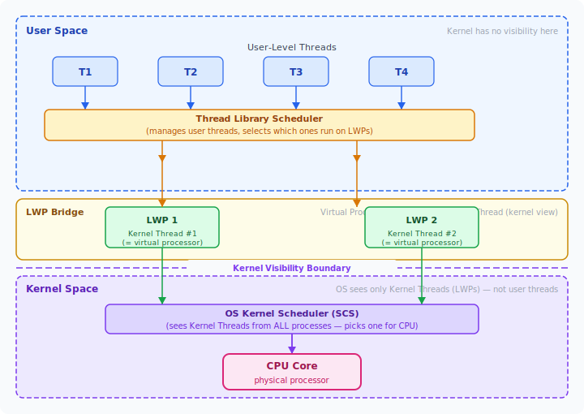
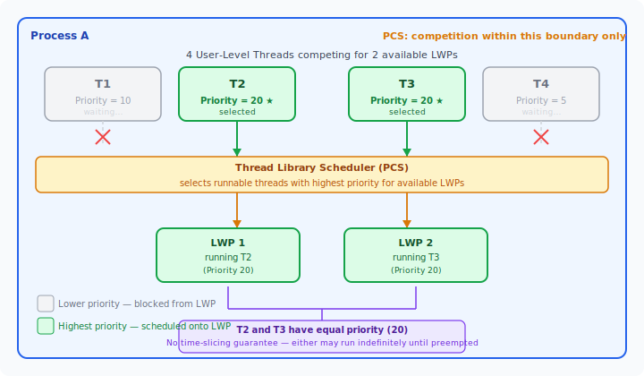
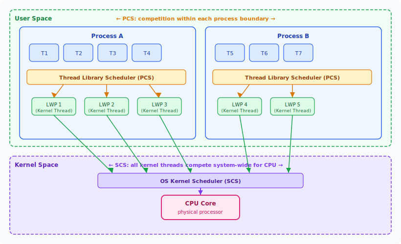
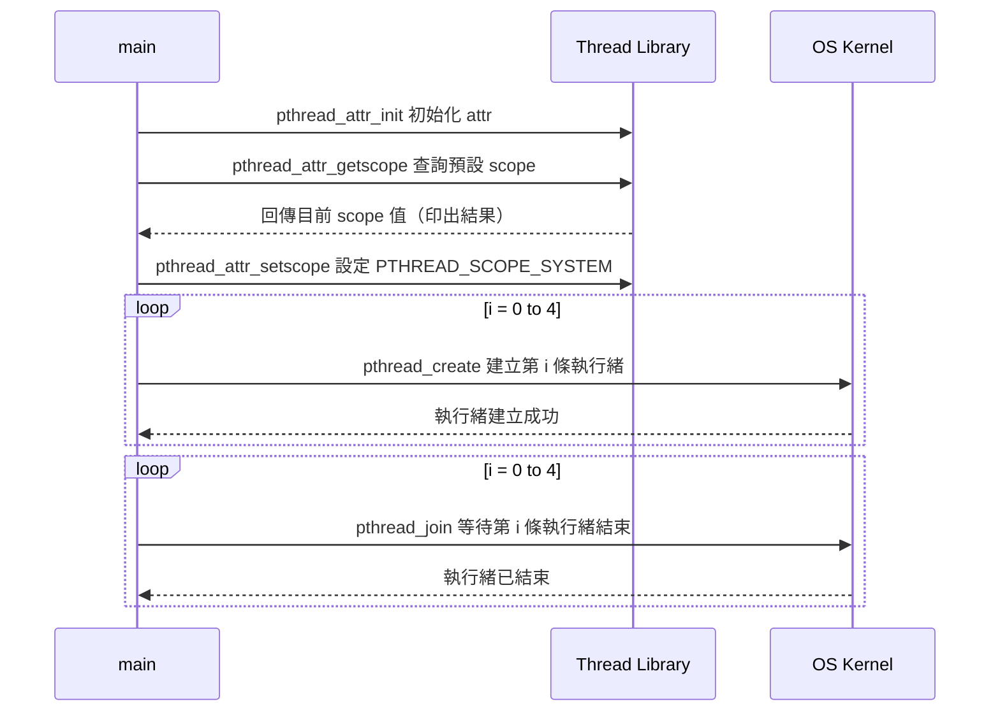

:::note
本系列文章內容參考自經典教材 **Operating System Concepts, 10th Edition (Silberschatz, Galvin, Gagne)**。本文對應章節：**Section 5.4 Thread Scheduling**。
:::

## **為什麼執行緒排程是獨立的議題？**

在前面各節討論排程演算法時，排程的單位都是 **Process（行程）**。然而在大多數現代 OS 中，真正被排程器安排上 CPU 的單位是 **Kernel-Level Thread（核心層級執行緒）**，而非 Process 本身。

這帶出一個需要拆開理解的問題：系統中同時存在兩種執行緒：

- **User-Level Thread（使用者層級執行緒）**：由 Thread Library（如 Pthreads）在使用者空間管理。Kernel 完全不知道它們的存在，無法直接排程它們。
- **Kernel-Level Thread（核心層級執行緒）**：OS Kernel 能夠感知並直接排程的執行緒，是真正能夠佔用 CPU 的實體。

> 這就產生一個根本問題：**User-Level Thread 要如何才能實際執行在 CPU 上？**

答案是：User-Level Thread 必須被映射到某個 Kernel-Level Thread 才能獲得 CPU 時間。在 Chapter 4 介紹的 Many-to-Many 與 Many-to-One 模型中，這個橋接角色由 **LWP（Lightweight Process，輕量級行程）** 擔任。LWP 在使用者空間看起來像一個「虛擬處理器（Virtual Processor）」，Thread Library 將 User-Level Thread 排程到 LWP 上執行；而在 Kernel 層面，每個 LWP 都對應一個 Kernel-Level Thread，由 OS 安排到實體 CPU 上。

這個兩層映射架構，使得「排程」這件事在兩個層級同時發生，各自有不同的範圍與競爭對象，因此引出了本節的核心概念：**Contention Scope（競爭範圍）**。

下圖呈現從 User-Level Thread 到 CPU 的完整映射鏈，以及 Kernel 的可見邊界：



圖中各層的含義：

- **User Space（藍色區域）**：T1–T4 是 User-Level Thread，由 Thread Library Scheduler 管理。Kernel 對這一層完全不可見，無法直接排程這些 Thread。
- **LWP Bridge（黃色區域）**：LWP 是橋接層，在使用者空間的角色是「Virtual Processor」（可以執行 User Thread），在 Kernel 空間的角色則是 Kernel Thread（可被 OS 排程）。LWP 是兩個世界的接合點。
- **Kernel Visibility Boundary（紫色虛線）**：這條線以下才是 Kernel 能夠看見的範圍。OS Scheduler 只知道 Kernel Thread（LWP）的存在，對 LWP 之上的 User Thread 一無所知。
- **Kernel Space（紫色區域）**：OS Scheduler 把所有可見的 Kernel Thread 集中排程，決定誰可以佔用 CPU Core。

這張圖的關鍵洞察是：**User-Level Thread 必須先透過 Thread Library 競爭到 LWP，LWP 再透過 OS 競爭到 CPU**，兩關都要過才能真正執行。這個兩層結構正是本節接下來要討論的 Contention Scope 的根源。

<br/>

## **5.4.1 競爭範圍 (Contention Scope)**

**Contention Scope** 描述的是：一條執行緒在競爭 CPU 時，**它的競爭對手是誰**？根據競爭範圍的不同，可以分為兩種：

### **PCS：行程競爭範圍 (Process-Contention Scope)**

**PCS（Process-Contention Scope，行程競爭範圍）** 發生在 **Thread Library 的排程層**。

在 Many-to-Many 或 Many-to-One 模型中，一個 Process 裡可能有多條 User-Level Thread，但只有有限數量的 LWP 可用。Thread Library 的 Scheduler 負責決定：**這個 Process 中哪幾條 User-Level Thread，可以佔用目前可用的 LWP**。

此時競爭發生在**同一個 Process 的邊界之內**，因此稱為 Process-Contention Scope。

PCS 的排程行為有以下特性：

- **Priority-Based（依優先權）**：Thread Library 通常選擇優先權最高的可執行 User-Level Thread 佔用 LWP。
- **Preemptive（搶占式）**：若有更高優先權的 Thread 變為可執行，Thread Library 會搶占（Preempt）目前正在執行的低優先權 Thread。
- **無保證的 Time-Slicing**：對於**優先權相同**的 Thread，Thread Library 不保證輪流分時執行。目前佔用 LWP 的 Thread 可能一直執行，直到主動讓出或被更高優先權 Thread 搶占。

下圖以一個具體的 Process 為例，展示 PCS 如何在四條 Thread 中依優先權選出兩條放上 LWP：



圖中的排程決策說明：

- **T2 與 T3（Priority = 20）**：優先權最高，被 Thread Library 選中，分別佔用 LWP 1 和 LWP 2 執行。
- **T1（Priority = 10）與 T4（Priority = 5）**：優先權較低，目前沒有可用 LWP，進入等待狀態。
- **T2 與 T3 之間**：兩者優先權相同（都是 20），但 PCS **不保證**它們輪流切換。T2 或 T3 其中一個可能持續佔用 LWP，直到主動放棄 CPU 或有更高優先權 Thread 出現，才會切換。

這個「無保證 Time-Slicing」的性質，在實際開發中是需要特別注意的行為差異，因為多數開發者習慣 Kernel 排程所提供的 Round-Robin 式公平分配。

:::info 為什麼 PCS 不保證 Time-Slicing？
Time-Slicing 需要定時器中斷（Timer Interrupt）來強制切換，而 Thread Library 運作在使用者空間，無法直接操控 CPU 的硬體計時器。Kernel 的 Timer Interrupt 是用來服務 SCS（觸發 Kernel-Level Thread 切換），Thread Library 並不能利用它對使用者層的 Thread 做精細的時間配額控制。因此，PCS 只能保證「高優先權搶占低優先權」，而無法對等優先權的 Thread 提供 Round-Robin 式的輪流保障。
:::

### **SCS：系統競爭範圍 (System-Contention Scope)**

**SCS（System-Contention Scope，系統競爭範圍）** 發生在 **OS Kernel 的排程層**。

OS Kernel 將所有 Kernel-Level Thread（包含來自不同 Process 的 LWP）放在一起考慮，決定誰可以佔用實體 CPU。此時競爭發生在**系統中所有 Thread 之間**，因此稱為 System-Contention Scope。

採用 One-to-One 模型的系統，例如 Windows 與 Linux，每條 User-Level Thread 都直接對應一條 Kernel-Level Thread，Kernel 可以直接看見並排程每條 Thread，因此**只使用 SCS**，不需要 PCS 的概念。

### **PCS 與 SCS 的整體架構**

下圖呈現在 Many-to-Many 模型下，PCS 與 SCS 各自發生的位置與競爭對象：



圖中各層的含義：

- **User Space 內（PCS 層）**：每個 Process 的 Thread Library Scheduler 各自運作，在 Process A 內的四條 User-Level Thread（T1–T4）爭用 Process A 的 LWP，在 Process B 內的三條 Thread（T5–T7）爭用 Process B 的 LWP。這兩個 Process 的排程決策互不干涉，這就是 PCS 的「行程邊界內競爭」。
- **LWP（橋接角色）**：每個 LWP 在使用者空間是 Virtual Processor，在 Kernel 空間對應一條 Kernel-Level Thread，負責將兩層世界連接起來。
- **Kernel Space 內（SCS 層）**：OS Kernel Scheduler 看到的是來自所有 Process 的 Kernel-Level Thread（包括 Process A 的 LWP 1–3 與 Process B 的 LWP 4–5），全部放在一起排隊競爭實體 CPU Core，這就是 SCS 的「系統全域競爭」。

這張圖最核心的洞察是：**同一條執行緒的生命周期中，會先後經歷兩層排程**。User-Level Thread 先透過 PCS 競爭到 LWP，LWP 再透過 SCS 競爭到 CPU Core，缺少任何一層都無法真正執行。

<br/>

## **5.4.2 Pthread 排程 API**

POSIX Pthread 標準提供了 API，讓程式在建立 Thread 時明確指定要使用 PCS 還是 SCS。Pthreads 定義了以下兩個 Contention Scope 常數：

|          常數           | 對應排程層 | 說明                                               |
| :---------------------: | :--------: | :------------------------------------------------- |
| `PTHREAD_SCOPE_PROCESS` |    PCS     | Thread 由 Thread Library 排程到 LWP 上             |
| `PTHREAD_SCOPE_SYSTEM`  |    SCS     | Thread 直接由 OS Kernel 排程，對應 One-to-One 映射 |

### **設定與查詢 API**

Contention Scope 透過 Thread Attribute 物件（`pthread_attr_t`）設定，相關函式有兩個：

```c
// 設定 contention scope
int pthread_attr_setscope(pthread_attr_t *attr, int scope);

// 查詢目前的 contention scope
int pthread_attr_getscope(pthread_attr_t *attr, int *scope);
```

- 第一個參數 `attr` 是指向 Thread Attribute 物件的指標。
- `pthread_attr_setscope()` 的第二個參數傳入 `PTHREAD_SCOPE_SYSTEM` 或 `PTHREAD_SCOPE_PROCESS`。
- `pthread_attr_getscope()` 的第二個參數是 `int *`，函式會將目前的 scope 值寫入該位址。
- 兩個函式在發生錯誤時均回傳非零值。

在支援 Many-to-Many 模型的系統上，`PTHREAD_SCOPE_PROCESS` 會讓 Thread Library 把 User-Level Thread 排程到可用的 LWP；`PTHREAD_SCOPE_SYSTEM` 則會為每條 User-Level Thread 建立並綁定一個 LWP，效果等同於 One-to-One 映射。

:::info 平台限制
Linux 與 macOS 只允許 `PTHREAD_SCOPE_SYSTEM`，因為兩者都採用 One-to-One 執行緒模型，Kernel 直接管理每條執行緒，沒有獨立的 Thread Library 排程層，因此 PCS 在這兩個平台上沒有意義。在這些系統上若嘗試設定 `PTHREAD_SCOPE_PROCESS`，函式會回傳錯誤。
:::

### **完整程式範例**

以下程式示範如何查詢目前的 Contention Scope、將其設定為 SCS，並建立五條以 SCS 排程的執行緒：

```c
#include <pthread.h>
#include <stdio.h>
#define NUM_THREADS 5

int main(int argc, char *argv[])
{
    int i, scope;
    pthread_t tid[NUM_THREADS];
    pthread_attr_t attr;

    /* 取得預設的 Thread Attribute */
    pthread_attr_init(&attr);

    /* 查詢目前的 contention scope */
    if (pthread_attr_getscope(&attr, &scope) != 0)
        fprintf(stderr, "Unable to get scheduling scope\n");
    else {
        if (scope == PTHREAD_SCOPE_PROCESS)
            printf("PTHREAD_SCOPE_PROCESS");
        else if (scope == PTHREAD_SCOPE_SYSTEM)
            printf("PTHREAD_SCOPE_SYSTEM");
        else
            fprintf(stderr, "Illegal scope value.\n");
    }

    /* 將排程策略設定為 SCS */
    pthread_attr_setscope(&attr, PTHREAD_SCOPE_SYSTEM);

    /* 建立五條執行緒 */
    for (i = 0; i < NUM_THREADS; i++)
        pthread_create(&tid[i], &attr, runner, NULL);

    /* 等待所有執行緒完成 */
    for (i = 0; i < NUM_THREADS; i++)
        pthread_join(tid[i], NULL);
}

/* 每條執行緒的進入點 */
void *runner(void *param)
{
    /* 執行工作內容 ... */
    pthread_exit(0);
}
```

程式的執行流程如下：



程式分四個階段：
1. **初始化 Attribute**：`pthread_attr_init()` 建立一個帶有預設值的 `pthread_attr_t` 物件。
2. **查詢預設 Scope**：`pthread_attr_getscope()` 讀出目前的 Contention Scope 並印出。在 Linux/macOS 上，預設值是 `PTHREAD_SCOPE_SYSTEM`。
3. **設定為 SCS**：`pthread_attr_setscope(&attr, PTHREAD_SCOPE_SYSTEM)` 明確指定後續建立的執行緒使用 SCS 排程。
4. **建立與等待**：以迴圈依序建立五條執行緒，再以另一個迴圈等待所有執行緒完成後才退出。

:::info 為什麼需要兩個分開的迴圈？
若將 `pthread_create()` 與 `pthread_join()` 合併在同一迴圈中，會變成：建立 Thread 0 → 立刻等待 Thread 0 結束 → 建立 Thread 1 → 立刻等待 Thread 1 結束……。這樣五條執行緒會**串行執行**，完全失去並行效果。拆成兩個迴圈才能讓所有執行緒先全部啟動，再同時等待，達到真正的並行執行。
:::
