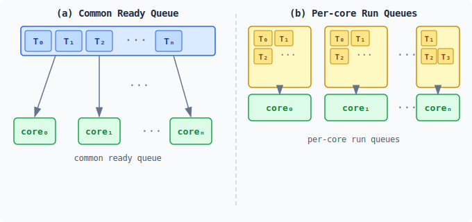
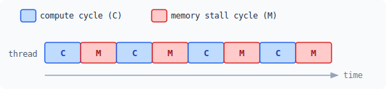
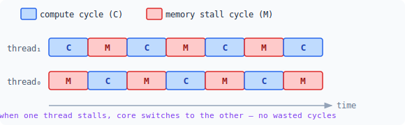
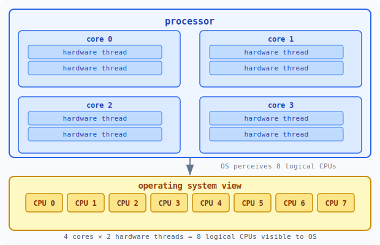
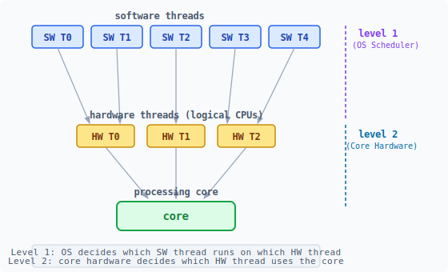
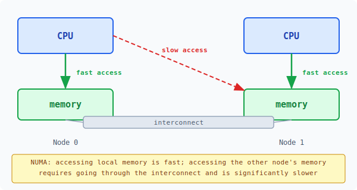

:::note
本系列文章內容參考自經典教材 **Operating System Concepts, 10th Edition (Silberschatz, Galvin, Gagne)**。本文對應章節：**Section 5.5 Multi-Processor Scheduling**。
:::

## **為什麼多處理器排程是獨立的議題？**

前面各節討論的排程演算法，都建立在一個前提上：系統中只有一個 CPU 核心，所有 Thread 競爭這唯一的資源。然而當系統中出現多個可用的 CPU 時，情況發生了根本性的變化：**多條 Thread 可以真正地同時（in parallel）執行**，排程器必須回答一個新問題：哪條 Thread 要被排程到哪個 CPU 上？

這帶出一系列在單核心環境下根本不存在的問題：多個 CPU 如何共享 Ready Queue？CPU 之間的工作量要如何保持均衡？搬移 Thread 到另一個 CPU 會產生什麼代價？在多核心硬體上，「CPU」這個概念本身又該如何定義？本節逐一回答這些問題。

「多處理器（multiprocessor）」的定義在現代已大幅擴展，不再僅指多顆實體 CPU 晶片，而是涵蓋以下四類架構：

- **Multicore CPUs（多核心 CPU）**：單一晶片上整合多個計算核心
- **Multithreaded cores（多執行緒核心）**：每個核心能同時承載多條硬體執行緒
- **NUMA systems**：多個處理器節點，各自擁有本地記憶體，透過互連匯流排共享位址空間
- **Heterogeneous multiprocessing（異質多處理）**：系統中同時存在效能不同、能耗不同的核心

本節前三個例子聚焦在處理器功能相同（homogeneous）的系統；最後一個例子則探討處理器能力不對稱的情況。

 

## **5.5.1 多處理器排程的方法 (Approaches to Multiple-Processor Scheduling)**

### **非對稱多處理 (Asymmetric Multiprocessing)**

一種直觀的做法是讓系統中只有**一個** CPU（稱為 master server）負責所有排程決策、I/O 處理與系統活動，其餘 CPU 只執行使用者程式碼。這種架構稱為**非對稱多處理（Asymmetric Multiprocessing）**。

它的優點是設計簡單：因為只有 master server 存取系統內部資料結構，不需要擔心多個 CPU 同時讀寫同一份排程資料的競爭問題。缺點則是這個 master server 容易成為系統瓶頸，當排程需求增加時，整體系統效能受限於這一顆 CPU 的處理能力。

### **對稱多處理 (Symmetric Multiprocessing, SMP)**

現代系統普遍採用的標準方案是**對稱多處理（SMP，Symmetric Multiprocessing）**：每個 CPU 都有自己的排程器，能自行決定下一步執行哪條 Thread。Windows、Linux、macOS、Android、iOS 都支援 SMP。

在 SMP 架構下，Ready Queue 的組織方式有兩種策略：

1. **共用 Ready Queue（Common Ready Queue）**：所有 Thread 放進同一個全域佇列，任何 CPU 的排程器都可以從中取用。
2. **各核心私有的 Run Queue（Per-core Run Queues）**：每個 CPU 維護自己的執行緒佇列，排程器只從本機佇列取用。

下圖對比兩種策略的組織方式：

圖左 (a) 的共用 Ready Queue 讓所有 Thread 集中在一個佇列，所有核心都從同一個地方取用執行緒。圖右 (b) 的 Per-core Run Queue 讓每個核心擁有各自的私有佇列，彼此獨立運作，不需競爭同一資源。

兩種策略的核心差異在於**競爭代價**：共用 Ready Queue 必須用鎖（locking）保護以避免 Race Condition（競態條件），當多個 CPU 同時搶著從佇列取 Thread 時，鎖的爭用會成為嚴重的效能瓶頸。Per-core Run Queue 完全避免了這個問題，每個核心在自己的佇列上獨立排程，也因此是現代 SMP 系統最常採用的方案。此外，Per-core Run Queue 對快取記憶體的使用也更有效率（原因詳見 5.5.4 節的 Processor Affinity 討論）。

Per-core Run Queue 的問題在於不同核心之間的工作量可能不均衡，解決方案是**負載平衡演算法**（Load Balancing），詳見 5.5.3 節。

 

## **5.5.2 多核心處理器 (Multicore Processors)**

傳統的 SMP 系統是透過增加獨立的實體 CPU 晶片來支援多處理；現代電腦則走向另一條路：將多個計算核心整合在同一顆晶片上，形成**多核心處理器（Multicore Processor）**。每個核心維護各自的架構狀態（instruction pointer、register set 等），在 OS 眼中看起來就是一個獨立的邏輯 CPU。

多核心處理器比多晶片方案**速度更快、耗電更低**，是今日主流的設計選擇。然而，多核心的出現也帶來了新的排程挑戰。

### **記憶體停頓 (Memory Stall)**

多核心處理器在排程上帶來的第一個問題，源自一個硬體現實：**處理器的速度遠遠超過記憶體**。當核心需要存取記憶體時，必須等待資料就緒，這段等待時間稱為**記憶體停頓（Memory Stall）**。記憶體停頓的發生有兩個原因：主記憶體存取本身的延遲，以及**快取失效（Cache Miss）**（要存取的資料不在快取中，必須從主記憶體重新載入）。

下圖展示記憶體停頓在時間軸上的實際樣貌：

圖中藍色的 **C（compute cycle）** 代表核心正在做計算，紅色的 **M（memory stall cycle）** 代表核心在等待記憶體回應。在現代處理器上，M 的比例可以高達 **50%**，也就是說核心有將近一半的時間處於空等的停頓狀態，大量計算能力被白白浪費。

### **多執行緒核心與晶片多執行緒技術**

為了解決記憶體停頓造成的核心閒置問題，硬體設計師提出了一個直觀的解法：既然核心在等記憶體時無事可做，不如讓它切換到另一條執行緒繼續工作。這就是**多執行緒核心（Multithreaded Processing Core）** 的設計思路：每個核心配備兩條（或更多）**硬體執行緒（Hardware Thread）**，當其中一條在等記憶體時，核心立即切換到另一條繼續執行。

下圖展示雙硬體執行緒核心的運作方式：

圖中 thread₀ 與 thread₁ 的 C/M 模式剛好交錯：當 thread₁ 在計算（C）時，thread₀ 正在等待記憶體（M）；反過來也是一樣。核心在兩條 thread 之間來回切換，讓自己幾乎不需要空等，達到更高的利用率。

這項技術正式的名稱是**晶片多執行緒（CMT，Chip Multithreading）**，在 Intel 處理器上稱為 **Hyper-Threading**（正式名稱為同步多執行緒，SMT，Simultaneous Multithreading）。下圖呈現一顆具備 4 個核心、每核心 2 條硬體執行緒的處理器，以及 OS 所見到的邏輯 CPU 數量：

圖上方是實體處理器內部的結構：4 個核心（core 0–3），每個核心包含 2 條硬體執行緒。圖下方是 OS 所看到的世界：因為每條硬體執行緒都維護各自的架構狀態，OS 將其視為獨立的邏輯 CPU，所以這顆處理器在 OS 眼中就是 **8 個邏輯 CPU（CPU 0–7）**。Intel Core i7 就是採用這種 2 硬體執行緒/核心的設計；Oracle SPARC M7 則可支援到 8 硬體執行緒/核心，搭配 8 個核心，提供 OS 64 個邏輯 CPU。

### **粗粒度與細粒度多執行緒 (Coarse-Grained vs. Fine-Grained Multithreading)**

硬體執行緒切換的方式有兩種，差異在於切換的時機與代價：

**粗粒度多執行緒（Coarse-Grained Multithreading）** 的做法是：當前執行的硬體執行緒遭遇長延遲事件（如記憶體停頓）時，才切換到另一條硬體執行緒。問題在於，切換前必須**先清空（flush）目前的指令管線（Instruction Pipeline）**，再讓新執行緒開始填充管線，切換代價相當高。這就像每次換手都要把整條流水線全部清空重來。

**細粒度多執行緒（Fine-Grained Multithreading）**，又稱交錯多執行緒（Interleaved Multithreading），在**每個指令週期邊界**就可能切換執行緒，粒度極細。其代價低廉的關鍵在於：硬體設計上**內建了切換邏輯（Thread-Switching Logic）**，切換所需的開銷被設計成接近零，不需要清空管線。

:::info 兩種切換方式的取捨
粗粒度切換代價高，但只在真正發生長延遲時才觸發，對正常執行影響小；細粒度切換代價低，可以更積極地填補任何閒置週期，但硬體複雜度較高。兩者沒有絕對優劣，是設計上的取捨決策。
:::

不論採用哪種切換方式，有一點必須釐清：**核心的實體資源（快取、管線）由所有硬體執行緒共享，核心在任何時刻仍然只能執行一條硬體執行緒**。多執行緒核心解決的是「停頓時閒置」的問題，而非讓核心同時執行多條執行緒。

### **兩層排程架構 (Two Levels of Scheduling)**

在進入兩層架構之前，必須先釐清兩個關鍵術語，因為它們在這個情境下容易混淆。

**Software Thread（軟體執行緒）** 是 OS 所看到、管理、並排程的執行單位。在第 5.3 節討論 FCFS、SJF、Round-Robin 等排程演算法時，那些被排入 Ready Queue、等著搶 CPU 的「Process」，本質上就是 Software Thread。OS 建立它、追蹤它的狀態（Running / Waiting / Ready），並決定它什麼時候可以執行。

**Hardware Thread（硬體執行緒）**，又稱**邏輯 CPU（Logical CPU）**，是一個物理核心內部的獨立執行槽位。因為 CMT/Hyper-Threading 技術，一個物理核心（core）可以同時承載多條 Hardware Thread，每條各自擁有獨立的 Instruction Pointer 與暫存器組（Register Set）。OS 看不到「核心」，只看到一個個邏輯 CPU，每個邏輯 CPU 都是一條 Hardware Thread。

:::info 和第 5.3 節的連結
第 5.3 節的所有排程演算法，排程的物件就是 **Software Thread**，排程的目的地就是 **Hardware Thread（OS 眼中的 CPU）**。兩者在 5.3 節被簡化統稱為「Process 搶佔 CPU」，但在引入多執行緒核心之後，必須把這兩個概念拆開說清楚，才能理解下面的兩層架構。
:::

多執行緒核心的出現，使得系統的排程工作分裂成兩個層次，分別由不同的排程者負責：

圖中展示了三層實體：最上方是多條 Software Thread，中間是 Hardware Thread（邏輯 CPU），最下方是物理核心（Processing Core）。排程在兩個邊界上各發生一次。

**第一層（Level 1）由 OS Scheduler 負責**，決定哪條 Software Thread 要跑在哪個 Hardware Thread（邏輯 CPU）上。這正是第 5.3 節所有排程演算法發揮作用的層次。OS 完全掌控這一層，可以自由採用 FCFS、Round-Robin、Priority 等任何演算法。

**第二層（Level 2）由核心的硬體邏輯負責**，決定同一個物理核心的多條 Hardware Thread 中，哪一條此刻能真正使用核心的運算資源（ALU、管線等）。這一層不由 OS 控制，而是由處理器硬體自動管理。常見做法：UltraSPARC T3 採用 Round-Robin 輪流讓每條硬體執行緒上核心；Intel Itanium 為每條硬體執行緒維護一個動態緊急度值（urgency value，範圍 0–7），當特定事件發生時，比較兩條執行緒的緊急度並選擇最高的那條。

兩層排程並非完全獨立。若 OS Scheduler（第一層）能感知 Hardware Thread 之間的資源共享關係，就能做出更聰明的決策。以一顆有 2 個核心、每核心 2 條硬體執行緒的 CPU 為例：若 OS 把兩條 Software Thread 都排到**同一個核心的兩條 Hardware Thread** 上，它們將共用該核心的快取與管線，彼此互相干擾，執行速度遠不如把它們分配到**不同核心的 Hardware Thread** 上。OS 若能感知這個層次的共享關係，就能優先選擇不共享資源的邏輯 CPU，提升整體效率。

 

## **5.5.3 負載平衡 (Load Balancing)**

採用 Per-core Run Queue 的 SMP 系統，帶來了一個新問題：不同核心的工作量可能嚴重不均衡。如果沒有任何機制介入，可能出現某個核心的 Run Queue 擠滿等待中的 Thread，而另一個核心的 Run Queue 卻空著、CPU 閒置的情況。這讓多處理器本應帶來的效能提升打了折扣。

**負載平衡（Load Balancing）** 的目標，是讓所有處理器的工作量盡量均勻分布，確保每個 CPU 都能充分發揮效用。

:::info 負載平衡只在 Per-core Run Queue 架構下才有必要
採用共用 Ready Queue 的系統不需要負載平衡，因為一旦某個 CPU 空閒，它立刻從共用佇列取走下一個可執行 Thread，天然就能維持均衡。只有在各核心有獨立佇列時，工作量才可能分布不均，需要額外的平衡機制。
:::

負載平衡有兩種互補的通用方法：

**推遷移（Push Migration）** 由一個特定的背景任務（task）定期檢查所有 CPU 的負載，若發現不平衡，就主動把 Thread 從過載的 CPU「推」（push）到閒置或負載較輕的 CPU 上。

**拉遷移（Pull Migration）** 由閒置的 CPU 主動出擊，從某個繁忙的 CPU 的 Run Queue 中「拉」（pull）走一條等待中的 Thread 來自己執行。

這兩種方法並非互斥，在實際系統中通常**同時實作**。Linux 的 CFS Scheduler（在 5.7 節詳述）與 FreeBSD 的 ULE Scheduler 就是同時使用推遷移與拉遷移的代表性例子。

「均衡負載」本身的定義也有歧義：是讓每個佇列的 Thread **數量**相同，還是讓 Thread 的**優先權分布**相同？在某些情境下，這兩種定義都未必能達成排程演算法的最佳目標。這個問題留給讀者進一步思考。

 

## **5.5.4 處理器親和性 (Processor Affinity)**

### **快取暖身效應與遷移代價**

要理解為什麼不能隨意把 Thread 搬到不同 CPU，必須先理解快取的行為。想像一條 Thread T 正在 CPU0 上執行：

1. T 存取的資料（陣列、物件欄位等）會逐漸被載入 CPU0 的快取（L1/L2/L3 Cache）。
2. 隨著 T 持續執行，快取命中率（Cache Hit Rate）越來越高，記憶體存取越來越快。這種狀態稱為**暖快取（Warm Cache）**。
3. 現在，負載平衡決定把 T 從 CPU0 遷移到 CPU1。
4. CPU0 快取中 T 的資料必須全部**失效（invalidate）**；CPU1 的快取需要從頭開始重新填充（repopulate），接下來的記憶體存取幾乎全是 Cache Miss，效能暫時大幅下降。

快取失效與重新填充的代價相當昂貴。因此，大多數 OS 會**刻意避免把 Thread 遷移到另一個 CPU**，而是盡量讓 Thread 持續在同一個 CPU 上執行，充分利用暖快取效應。這個策略稱為**處理器親和性（Processor Affinity）**，意思是 Thread 對它目前所在的 CPU 具有「親和力」，偏好留在那裡執行。

從這個角度看，Per-core Run Queue 相對於共用 Ready Queue 有一個隱藏的優勢：因為 Thread 始終被排程到同一個核心的佇列，它天然就能從暖快取中受益，不需要任何額外機制就能享有處理器親和性。

### **軟性親和性與硬性親和性**

處理器親和性有兩種強度：

**軟性親和性（Soft Affinity）**：OS 的政策是「盡量」讓 Thread 留在同一個 CPU，但不保證。在負載平衡的壓力下，Thread 仍然可能被遷移到另一個 CPU。Linux 預設採用 Soft Affinity。

**硬性親和性（Hard Affinity）**：允許 Thread 透過系統呼叫，明確指定它只能在哪幾個 CPU 上執行，OS 必須遵守這個限制，不會將其遷移到指定集合以外的 CPU。Linux 提供 `sched_setaffinity()` 系統呼叫來實作 Hard Affinity，讓 Thread 自行指定合法的 CPU 集合。

許多系統同時支援 Soft 與 Hard 兩種親和性。

### **NUMA 架構下的親和性**

親和性議題在 **NUMA（Non-Uniform Memory Access，非均勻記憶體存取）** 架構下變得更加重要。

NUMA 系統的典型結構如下圖所示：

圖中有兩個實體 CPU 晶片，各自擁有一塊本地記憶體（local memory）。兩個節點之間透過系統互連（interconnect）相連，共享同一個實體位址空間。然而，CPU 存取**本地記憶體**的速度（圖中綠色的 fast access）遠比存取**另一個節點的記憶體**（圖中紅色的 slow access）快得多。

#### **CPU 和記憶體的分配是兩件獨立的事**

理解 NUMA 的關鍵，是先弄清楚一個容易被忽略的事實：**「Thread 跑在哪個 CPU」和「Thread 的資料放在哪塊記憶體」是兩個彼此獨立的決定**，分別由不同的 OS 子系統負責。

- **CPU Scheduler** 決定：哪條 Thread 要排到哪個 CPU 核心上執行。
- **Memory Allocator** 決定：當 Thread 呼叫 `malloc()` 或系統配置記憶體時，要把資料存到**哪一塊物理記憶體頁面**上。

在 NUMA 系統上，物理記憶體分散在多個節點。若 Memory Allocator 不知道 NUMA 的存在，它可能隨便挑一塊空的物理頁面，把 Thread 的資料放到**另一個節點的記憶體**上，如下圖所示的 slow access 情況。這樣即使 Thread 成功排到了 Node 0 的 CPU，每次存取自己的資料都要穿越 interconnect 到 Node 1 去取，速度大打折扣。

因此，真正有效的 NUMA 優化需要 CPU Scheduler 和 Memory Allocator **同時感知 NUMA 拓撲（NUMA-aware）並協同工作**：

1. CPU Scheduler 把 Thread T 排到 Node 0 的 CPU 上。
2. Memory Allocator 知道 T 目前在 Node 0，所以當 T 申請記憶體時，優先從 **Node 0 的本地記憶體**配置物理頁面。
3. 結果：Thread T 在 Node 0 的 CPU 上執行，存取的資料也在 Node 0 的記憶體中，可以享有最快的本地存取速度。

:::info 「共享位址空間」不代表「存取速度相同」
NUMA 系統中所有節點共享一個統一的實體位址空間，意思是任何 CPU 都可以用同一個記憶體位址存取任何一塊物理記憶體，程式碼不需要特別修改。「非均勻（Non-Uniform）」指的是**存取速度不同**：存取本地節點的記憶體快，存取遠端節點的記憶體慢。這個速度差異對效能影響很大，卻在程式碼層面完全不可見，因此需要 OS 在排程與記憶體分配層面主動介入。
:::

### **負載平衡與親和性之間的張力**

負載平衡與處理器親和性天然地**互相矛盾**：

- 負載平衡要求主動遷移 Thread，把它從繁忙的 CPU 搬到閒置的 CPU。
- 處理器親和性要求 Thread 留在原本的 CPU，避免快取失效的代價。

在 NUMA 系統上，這個矛盾更加嚴重。把一條 Thread 從 Node 0 的 CPU 遷移到 Node 1 的 CPU，會帶來**雙重懲罰**：一方面 Node 0 快取中的暖資料全部失效，另一方面 Thread 原本配置在 Node 0 的記憶體頁面還留在 Node 0，Thread 從 Node 1 存取這些資料時必須穿越 interconnect，從快速的本地存取變成緩慢的遠端存取。

換句話說，在現代多核心 NUMA 系統上，排程演算法必須同時權衡「讓所有 CPU 都有工作做」與「讓每條 Thread 盡量保持快的記憶體存取」這兩個互相牽制的目標。Linux CFS Scheduler 如何在這兩者之間取得平衡，將在 5.7 節詳細探討。

 

## **5.5.5 異質多處理 (Heterogeneous Multiprocessing, HMP)**

### **同指令集、不同效能的核心**

前面各節討論的系統，所有核心在功能上是完全相同的（homogeneous），排程器可以把任何 Thread 放到任何核心上，不需要考慮核心之間的差異。

然而，某些現代系統採用了一種不同的設計路線：系統中的核心**執行相同的指令集（Instruction Set Architecture）**，但在**時脈速度（clock speed）與電源管理能力**上各有不同，包括能把某個核心的耗電調低到幾乎關閉（idling）的程度。這類系統稱為**異質多處理（HMP，Heterogeneous Multiprocessing）**。

HMP 與 5.5.1 節的非對稱多處理（Asymmetric Multiprocessing）的關鍵差異在於：HMP 並非讓某個核心獨攬系統任務，而是讓系統任務與使用者任務都能跑在任何核心上，**差異只在於排程時主動考量任務的效能需求與能耗目標**，把對的任務放到最適合它的核心上。

### **ARM big.LITTLE：效能核心與效能核心的組合**

支援 HMP 的 ARM 處理器架構稱為 **big.LITTLE**，設計理念是將高效能（big）核心與低功耗（LITTLE）核心組合在同一顆晶片上：

- **big 核心**：時脈高、效能強，但耗電量大，不適合長時間持續運行。
- **LITTLE 核心**：效能較低，但能耗極低，適合長時間持續執行低負載工作。

這個組合帶來幾個顯著優勢：

1. **後台任務交給 LITTLE 核心**：不需要高效能但必須長時間執行的背景任務（如同步、紀錄更新），可以持續跑在 LITTLE 核心上，不消耗太多電量，幫助延長電池壽命。
2. **互動應用交給 big 核心**：需要快速回應但執行時間短的互動式應用（如遊戲、影片解碼），交給 big 核心短暫爆發，確保流暢的使用者體驗。
3. **省電模式下關閉 big 核心**：當裝置進入省電模式時，可以完全停用耗電的 big 核心，僅依靠 LITTLE 核心維持基本功能運作。

Windows 10 亦支援 HMP 排程，允許 Thread 選擇最符合自身電源需求的排程政策，讓 OS 根據任務特性動態選擇核心。

:::info HMP 的設計核心是「把對的任務放到對的核心」
HMP 排程的本質不是讓某些核心比其他核心「更重要」，而是讓排程器在做決策時，同時考慮任務的效能需求（performance demand）與系統的能耗目標（power budget）。高效能任務需要 big 核心的算力，長期後台任務則更適合 LITTLE 核心的低能耗特性。兩類核心相輔相成，讓同一顆晶片在效能與電池壽命之間取得更好的平衡。
:::
