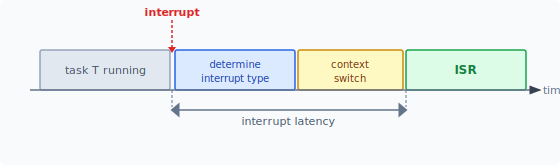
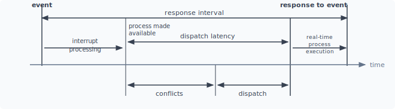
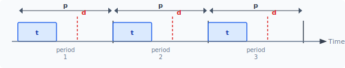
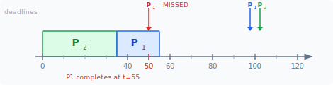
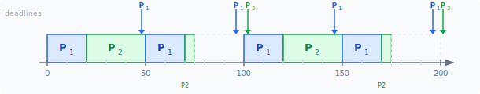
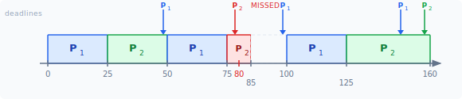
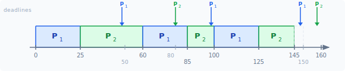

:::note
本系列文章內容參考自經典教材 **Operating System Concepts, 10th Edition (Silberschatz, Galvin, Gagne)**。本文對應章節：**Section 5.6 Real-Time CPU Scheduling**。
:::

## **即時系統需要什麼樣的排程？**

一般的 CPU 排程演算法，例如 SJF 或 Round-Robin，只關心「最終能執行完」這個目標，對「何時執行完」不做任何保證。但對即時系統（Real-Time System）而言，「在截止時間（Deadline）內完成」與「完成」本身同樣重要，甚至更重要。

以剎車防鎖死系統（ABS）為例：輪胎偵測到打滑後，控制系統必須在 3 到 5 毫秒內做出反應。若排程器讓這個任務等了 50 毫秒，結果和從未執行一樣，汽車已經失去控制。這類系統稱為**硬性即時系統（Hard Real-Time System）**，任務必須在截止時間內完成，否則後果不可接受。

相對地，**軟性即時系統（Soft Real-Time System）** 只提供較寬鬆的保證：關鍵的即時行程（Real-Time Process）在排程上獲得最高優先級，但系統不保證它一定能在某個截止時間前執行。串流影音播放是一個典型例子，偶爾的延遲會讓畫面卡頓，但不會造成災難性後果。

兩者的核心差異如下：

|      系統類型      | 截止時間保證 |            逾期後果             |       應用場景        |
| :----------------: | :----------: | :-----------------------------: | :-------------------: |
| **Hard Real-Time** |   嚴格保證   |   系統失效（Safety-Critical）   | ABS、起搏器、飛控系統 |
| **Soft Real-Time** |   儘量保證   | 效能降低（Quality Degradation） |    串流媒體、遊戲     |

<br/>

## **5.6.1 延遲最小化 (Minimizing Latency)**

### **事件延遲 (Event Latency)**

即時系統通常是事件驅動的（Event-Driven）：系統持續等待外部事件發生（如感測器訊號、計時器到期），一旦事件發生就必須盡快回應。**事件延遲（Event Latency）** 定義為從事件發生的瞬間到系統開始服務該事件之間所經過的時間：


圖中，事件在 t₀ 發生，系統在 t₁ 做出回應，兩者之間的時間差就是 Event Latency。不同即時應用對 Event Latency 的容忍度差異極大：ABS 只允許 3 到 5 毫秒，航空雷達系統可以容忍數秒。

### **兩種延遲組成**

Event Latency 並非一個單一數字，而是由兩個各自獨立的延遲組成，這兩者必須分開優化：

1. **中斷延遲（Interrupt Latency）**
2. **分派延遲（Dispatch Latency）**

### **中斷延遲 (Interrupt Latency)**

假設系統正在執行一個任務 T，此時一個硬體中斷（例如感測器偵測到訊號）到達：

1. 中斷請求到達 CPU 的 Interrupt-Request Line
2. CPU 完成當前正在執行的那一條指令（不能中途放棄）
3. CPU 判斷中斷類型（確認是哪個裝置或事件觸發了中斷）
4. 儲存當前行程的執行狀態（Context Save）
5. 跳轉到對應的中斷服務程序（ISR，Interrupt Service Routine）並開始執行

從步驟 1（中斷到達）到步驟 5（ISR 開始執行）所消耗的時間，稱為**中斷延遲（Interrupt Latency）**：



圖中，藍色「determine interrupt type」和橘色「context switch」這兩個步驟是造成中斷延遲的主體。ISR 開始執行後，中斷延遲才算結束。

對硬性即時系統而言，Interrupt Latency 不只要小，更必須是**有界的（Bounded）**，即在任何情況下都不超過某個固定上限。影響 Interrupt Latency 的一個關鍵因素是：OS 為了保護核心資料結構（Kernel Data Structures），有時會短暫停用中斷（Disable Interrupts）。在這段停用期間，即使有中斷到達也無法被立即處理。即時 OS 因此要求停用中斷的時間段必須極短，以確保 Interrupt Latency 的上界足夠小。

### **分派延遲 (Dispatch Latency)**

理解 Dispatch Latency 的前提，是先搞清楚它在整條時間軸中的位置。

前一小節的 Interrupt Latency 只涵蓋「中斷到達 → ISR 開始執行」這一小段。ISR 開始後還要繼續執行，最終才會喚醒（wake up）等待該事件的即時行程，將它放進 Ready Queue。**ISR 把行程放進 Ready Queue 的那一刻，稱為「process made available」——這才是 Dispatch Latency 的起點**。

從「process made available」到「即時行程真正上 CPU 開始執行」之間所花的時間，稱為**分派延遲（Dispatch Latency）**：



圖中的 **response interval** 涵蓋從事件發生到即時行程產生回應的完整時間，由三段組成：**interrupt processing**（= Interrupt Latency + ISR 執行時間，直到 process made available）→ **Dispatch Latency** → **real-time process execution**。其中 Dispatch Latency 由兩個子階段組成：

1. **Conflicts 階段（衝突解決）**：有兩件事必須先完成
   - **搶占（Preemption）**：如果目前有低優先級行程正在 Kernel Mode 執行，必須先把它趕下 CPU
   - **資源釋放**：低優先級行程可能持有高優先級即時任務所需的資源（如 Mutex），必須讓它們先釋放

2. **Dispatch 階段**：Conflicts 解決後，排程器將高優先級的即時行程排程到可用的 CPU 上開始執行

降低 Dispatch Latency 最有效的方法是提供**可搶占核心（Preemptive Kernel）**。對硬性即時系統，Dispatch Latency 通常要求在數微秒以內。

<br/>

## **5.6.2 基於優先權的排程 (Priority-Based Scheduling)**

### **即時 OS 的最低要求**

即時作業系統最重要的特性是：一旦即時行程需要 CPU，排程器必須立即回應。因此即時 OS 的排程器必須支援**具有搶占（Preemption）的優先權排程演算法（Priority-Based Scheduling)**。Windows 保留優先級 16 到 31 給即時行程；Solaris 和 Linux 也有類似的設計。

然而，僅提供搶占式優先權排程只能保證**軟性即時（Soft Real-Time）** 功能。硬性即時系統還需要能夠精確地保證每個任務都能在截止時間內完成，這需要更進一步的排程機制。

### **週期性任務的特性 (Periodic Task Characteristics)**

在硬性即時系統的排程討論中，任務通常被建模為**週期性任務（Periodic Task）**，具有三個關鍵參數：

- **t（Processing Time，處理時間）**：每次觸發時需要佔用 CPU 多長時間
- **d（Deadline，截止時間）**：從該週期開始算起，必須在 d 時間內完成，0 ≤ t ≤ d ≤ p
- **p（Period，週期）**：任務每隔 p 時間重複觸發一次

任務的**速率（Rate）** 定義為 1/p。



圖中展示一個週期性任務連續執行三個週期的樣貌。每個週期內，藍色填充的方框代表 t（處理時間）；虛線紅色標記代表 d（截止時間）；整個週期的跨度是 p。排程器可以利用這些已知的特性，靜態或動態地為每個任務指派優先權。

### **許可控制演算法 (Admission-Control Algorithm)**

在即時系統中，行程可能需要提前向排程器宣告自己的截止時間要求。排程器收到請求後，採用**許可控制演算法（Admission-Control Algorithm）** 做出判斷：

- **Admit（允許進入）**：若排程器能保證該行程在截止時間前完成，則允許其加入排程。
- **Reject（拒絕）**：若無法保證，則拒絕請求，而非允許它加入後又無法滿足截止時間。

<br/>

## **5.6.3 速率單調排程 (Rate-Monotonic Scheduling)**

### **演算法原理**

**速率單調排程（Rate-Monotonic Scheduling，RM）** 是針對週期性任務設計的靜態優先權搶占式排程演算法。它的優先權指派規則非常直觀：**週期越短，優先權越高**（即優先權與速率成正比，與週期成反比）。

這個設計的直覺是：週期短的任務更「急迫」，需要更頻繁地使用 CPU，因此給它更高的優先級是合理的。

RM 假設每個週期性任務在每次 CPU Burst 的時間是固定的，亦即每次觸發時的執行時長相同。

### **正確範例：RM 如何讓兩個任務都準時完成**

以兩個行程 P₁（p₁=50, t₁=20）和 P₂（p₂=100, t₂=35）為例。每個任務的 CPU 使用率定義為 t/p，表示「每個週期需要佔用多少比例的 CPU 時間」：P₁ 每 50ms 需要 20ms，佔用 20/50 = 40%；P₂ 每 100ms 需要 35ms，佔用 35/100 = 35%。兩個任務對 CPU 的需求是各自獨立的，因此直接相加得合計 **75%** 的 CPU 使用率。

首先，若錯誤地讓 P₂（週期長）擁有比 P₁（週期短）更高的優先權：



P₂ 搶先執行 0→35，P₁ 在 35→55 執行。但 P₁ 的第一個截止時間是 t=50，P₁ 直到 t=55 才結束，**已經錯過截止時間**，圖中紅色的 deadline 箭頭即代表此錯過事件。

若改用 RM，因為 P₁ 的週期（50）比 P₂ 的週期（100）短，RM 給 P₁ 更高的優先權：



完整排程過程如下：

|   時段    | 執行行程 | 說明                                                  |
| :-------: | :------: | :---------------------------------------------------- |
|  0 → 20   |    P₁    | P₁ 第一次執行（t₁=20），在截止時間 50 前完成          |
|  20 → 50  |    P₂    | P₂ 開始執行，已使用 30ms                              |
|  50 → 70  |    P₁    | P₁ 第二個週期觸發，搶占 P₂（P₂ 還剩 5ms）；P₁ 完成    |
|  70 → 75  |    P₂    | 排程器恢復 P₂，P₂ 用完剩餘 5ms，在截止時間 100 前完成 |
| 75 → 100  |   Idle   | CPU 空閒                                              |
| 100 → ... |   重複   | 依同樣優先權規則繼續                                  |

兩個任務均在各自的截止時間前完成，RM 排程成功。圖中的窄綠色方塊（70→75）代表 P₂ 被搶占後繼續執行的尾段。

### **RM 的上限：CPU 使用率上界**

在說明上界之前，先釐清「靜態優先權」的意思：RM 的優先權在排程開始前就根據週期長短一次性指派好，**執行過程中永遠不變**——P₁ 的週期比 P₂ 短，P₁ 就永遠比 P₂ 優先，不管當下誰的截止時間更近。這與下一節 EDF 的「動態優先權」（每次排程時重新比較截止時間）形成對比。

RM 被證明是**在所有靜態優先權演算法中最優（Optimal）** 的：若有任何靜態優先權演算法能排程某組任務不 miss deadline，RM 一定也能做到。

然而，RM 存在一個根本限制：即便總 CPU 使用率低於 100%，RM 也不一定能排程成功。這是因為靜態優先權的本質——高優先級任務可以無限搶占——會導致低優先級任務在最後一刻才能執行，進而在特定任務時間排列下 miss deadline。

Liu & Layland 在 1973 年**嚴格數學證明**（非經驗公式）了 RM 能保證成功的**使用率上界（CPU Utilization Bound）**：

$$N \cdot (2^{1/N} - 1)$$

這個值是一個**充分條件**：

- **使用率 ≤ 上界**：RM **保證**所有任務都能在截止時間前完成
- **使用率 > 上界**：**不保證**，可能成功也可能失敗，取決於任務的具體時間排列

| 任務數 N | CPU 使用率上界 | 計算                       |
| :------: | :------------: | :------------------------- |
|    1     |      100%      | 1·(2¹−1) = 1               |
|    2     |     約 83%     | 2·(√2−1) ≈ 2·0.414 ≈ 0.828 |
|  N → ∞   |     約 69%     | 趨近 ln 2 ≈ 0.693          |

結論：當任務數量越多，RM 能安全保證的 CPU 使用率上限就越低。**在 N → ∞ 的極端情況下，只要總使用率超過約 69%，就無法保證所有任務準時完成**。

### **RM 的限制範例**

考慮 P₁（p₁=50, t₁=25）與 P₂（p₂=80, t₂=35），CPU 使用率為 25/50 + 35/80 ≈ 94%。N=2 的上界是 83%（即 2·(√2−1)），**94% > 83%，已超出 RM 的保證範圍**，代表 RM 對這組任務無法給出截止時間保證：



RM 仍讓 P₁（較短週期）擁有較高優先級。排程過程如下：

1. P₁ 執行 0→25
2. P₂ 開始執行 25→50，已用 25ms
3. t=50 時 P₁ 搶占，P₁ 執行 50→75，P₂ 仍剩 10ms
4. P₂ 繼續執行 75→85，才結束第一次 Burst

P₂ 的截止時間是 t=80，但 P₂ 直到 t=85 才完成，**錯過截止時間 5ms**。儘管 RM 是靜態優先權中的最優演算法，面對高使用率的任務組合時仍無能為力。

<br/>

## **5.6.4 最早截止時間優先排程 (Earliest-Deadline-First Scheduling)**

### **動態優先權：以截止時間為準**

**最早截止時間優先排程（EDF，Earliest-Deadline-First Scheduling）** 與 RM 最根本的差異在於：EDF 採用**動態優先權（Dynamic Priority）**，優先權指派規則是：**截止時間越近，優先級越高**。

「動態」體現在：每次發生排程事件（任務完成、新任務就緒、週期性任務新週期到期），排程器就會重新比較所有就緒任務的截止時間，把 CPU 給截止時間最近的那一個。這意味著同一個任務在不同時刻可能時而最高優先、時而最低優先，端看當下誰的截止時間最急迫。每個任務在就緒時必須向排程器宣告自己的截止時間，以便排程器做出決策。

### **EDF 如何排程 RM 失敗的案例**

回到 RM 失敗的例子：P₁（p₁=50, t₁=25，截止時間 = 週期邊界）和 P₂（p₂=80, t₂=35，截止時間 = 週期邊界），CPU 使用率約 94%。觀察 EDF 如何讓兩個任務都在截止時間內完成：



完整排程過程如下（每個步驟都是觸發 EDF 重新評估優先權的排程事件）：

1. **t=0**：P₁ 截止時間 50，P₂ 截止時間 80。50 < 80，P₁ 優先 → P₁ 執行。
2. **t=25**：P₁ 第一個 Burst 完成。就緒隊列只剩 P₂（截止時間 80）→ P₂ 執行。
3. **t=50**：P₁ 第二個週期到期，其**新截止時間更新為 100**。EDF 比較：P₂ 截止時間 80 vs P₁ 截止時間 100，80 < 100 → **P₂ 截止時間更急，P₂ 繼續執行，不被搶占**（這是 EDF 與 RM 的關鍵差異：RM 在 t=50 因 P₁ 週期更短而強制搶占）。
4. **t=60**：P₂ 完成（t=25 起執行 35ms）。截止時間 80，完成於 60 ✓。P₁ 第二個 Burst 開始（截止時間 100，已等待自 t=50）。
5. **t=80**：P₂ 第二個週期到期，新截止時間 160。EDF 比較：P₁ 截止時間 100 vs P₂ 截止時間 160，100 < 160 → **P₁ 截止時間更急，P₁ 繼續執行**，P₂ 等待。
6. **t=85**：P₁ 第二個 Burst 完成（t=60 起執行 25ms）。截止時間 100，完成於 85 ✓。P₂ 第二個 Burst 開始（截止時間 160，等待自 t=80）。
7. **t=100**：P₁ 第三個週期到期，新截止時間 150。EDF 比較：P₁ 截止時間 150 vs P₂ 截止時間 160，150 < 160 → P₁ 搶占 P₂（P₂ 已執行 15ms，剩 20ms）。
8. **t=125**：P₁ 第三個 Burst 完成。截止時間 150，完成於 125 ✓。P₂ 恢復執行剩餘 20ms。
9. **t=145**：P₂ 第二個 Burst 完成。截止時間 160，完成於 145 ✓。t=145 到 t=150 CPU 空閒。

兩個任務的每個截止時間均準時達成，而 RM 對同一組任務會失敗（P₂ miss deadline 5ms）。

### **EDF 的理論最優性**

EDF 被嚴格證明是**最優（Theoretically Optimal）** 的排程演算法：只要一組任務在理論上「可排程」（即存在任何一種排法能讓所有截止時間都達成），EDF 就一定找得到那個排法。

這個最優性直接反映在使用率上界的對比：

| 演算法 | 優先權類型 | CPU 使用率上界（N=2） | CPU 使用率上界（N→∞） |
| :----: | :--------: | :-------------------: | :-------------------: |
|   RM   |    靜態    |        約 83%         |        約 69%         |
|  EDF   |    動態    |         100%          |         100%          |

EDF 的理論上界是 100%：只要總使用率 ≤ 100%，EDF 就能保證所有截止時間達成。換言之，EDF 不像 RM 那樣留有「安全餘量」，它能把 CPU 排到滿。

然而，100% 在現實中不可達：Context Switch、中斷處理等 OS 本身的開銷都需要時間，這些成本會讓實際可用的 CPU 時間少於 100%，因此實際系統通常會在接近但略低於 100% 時設定上限。

EDF 相比 RM 還有一個靈活之處：**EDF 不要求任務必須是週期性的**，也不要求每次 Burst 時間固定，唯一的要求是任務在就緒時宣告截止時間。這讓 EDF 可以應用在更廣泛的即時場景。

<br/>

## **5.6.5 比例分享排程 (Proportional Share Scheduling)**

比例分享排程器（Proportional Share Scheduler）以一種不同的角度分配 CPU 時間，不以優先級或截止時間為標準，而是**按比例**分配。

做法是將 CPU 時間切成 T 份（Shares）。每個應用程式申請 N 份，則保證能獲得 N/T 的處理器時間。

**範例**：假設 T=100 份，三個行程 A、B、C 分別申請 50、15、20 份，則：
- A 獲得 50% 的 CPU 時間
- B 獲得 15% 的 CPU 時間
- C 獲得 20% 的 CPU 時間
- 剩餘 15 份未分配，可作為緩衝

比例分享排程器必須搭配**許可控制（Admission Control）** 一起運作，確保新申請的份額不超過系統總量。若總計已分配 85 份（50+15+20），新行程 D 申請 30 份，系統已無足夠份額，**許可控制器拒絕 D 的請求**，防止已分配的行程受到影響。

<br/>

## **5.6.6 POSIX 即時排程 (POSIX Real-Time Scheduling)**

POSIX 標準透過 **POSIX.1b** 擴充提供了即時運算支援，其中包含針對即時執行緒的排程 API。POSIX 定義兩種即時排程政策：

|    排程政策    | 說明                                                                                                                        |
| :------------: | :-------------------------------------------------------------------------------------------------------------------------- |
| **SCHED_FIFO** | 先進先出，無時間切片（Time Slicing）。相同優先級的執行緒依 FIFO 順序排列，最高優先級的執行緒持續佔用 CPU 直到自行放棄或阻塞 |
|  **SCHED_RR**  | Round-Robin，對相同優先級的執行緒提供時間切片。功能類似 SCHED_FIFO，但同優先級執行緒間會輪流執行                            |

POSIX 還定義了第三種類別 **SCHED_OTHER**，但其行為未在標準中明確規定，由各系統自行實作，在不同平台上行為可能不同。

POSIX API 提供以下兩個函式用於取得和設定排程政策：

```c
pthread_attr_getschedpolicy(pthread_attr_t *attr, int *policy)
pthread_attr_setschedpolicy(pthread_attr_t *attr, int policy)
```

第一個參數是指向執行緒屬性集合（Thread Attribute Set）的指標，第二個參數在 get 時是指向 int 的指標（回傳現有政策），在 set 時直接傳入政策常數（`SCHED_FIFO`、`SCHED_RR` 或 `SCHED_OTHER`）。兩個函式在出錯時均回傳非零值。

以下 POSIX Pthread 程式（Figure 5.25）展示如何使用這組 API：先讀取目前的排程政策，再將其改為 `SCHED_FIFO`：

```c
#include <pthread.h>
#include <stdio.h>
#define NUM_THREADS 5

int main(int argc, char *argv[])
{
    int i, policy;
    pthread_t tid[NUM_THREADS];
    pthread_attr_t attr;

    /* get the default attributes */
    pthread_attr_init(&attr);

    /* get the current scheduling policy */
    if (pthread_attr_getschedpolicy(&attr, &policy) != 0)
        fprintf(stderr, "Unable to get policy.\n");
    else {
        if (policy == SCHED_OTHER)
            printf("SCHED_OTHER\n");
        else if (policy == SCHED_RR)
            printf("SCHED_RR\n");
        else if (policy == SCHED_FIFO)
            printf("SCHED_FIFO\n");
    }

    /* set the scheduling policy - FIFO, RR, or OTHER */
    if (pthread_attr_setschedpolicy(&attr, SCHED_FIFO) != 0)
        fprintf(stderr, "Unable to set policy.\n");

    /* create the threads */
    for (i = 0; i < NUM_THREADS; i++)
        pthread_create(&tid[i], &attr, runner, NULL);

    /* now join on each thread */
    for (i = 0; i < NUM_THREADS; i++)
        pthread_join(tid[i], NULL);
}

/* Each thread will begin control in this function */
void *runner(void *param)
{
    /* do some work ... */
    pthread_exit(0);
}
```

:::info SCHED_FIFO 與 SCHED_RR 的核心差異
兩者的差異集中在**相同優先級**的執行緒之間：

- **SCHED_FIFO**：相同優先級的執行緒沒有時間切片，最高優先級執行緒持續佔用 CPU 直到主動放棄（yield）或阻塞（block）。同優先級執行緒只能「排隊等前一個跑完」。
- **SCHED_RR**：對相同優先級的執行緒提供時間切片輪流（Round-Robin），讓相同優先級的多個即時執行緒能夠公平共享 CPU 時間。

<br/>

不同優先級的執行緒，兩種政策都遵循同一規則：較高優先級的執行緒永遠搶占較低優先級的執行緒。
:::
