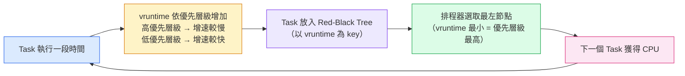
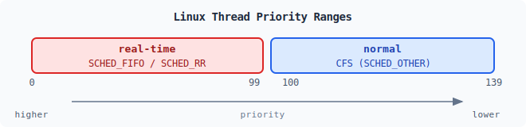
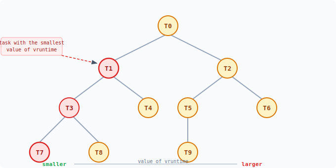
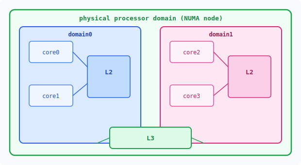
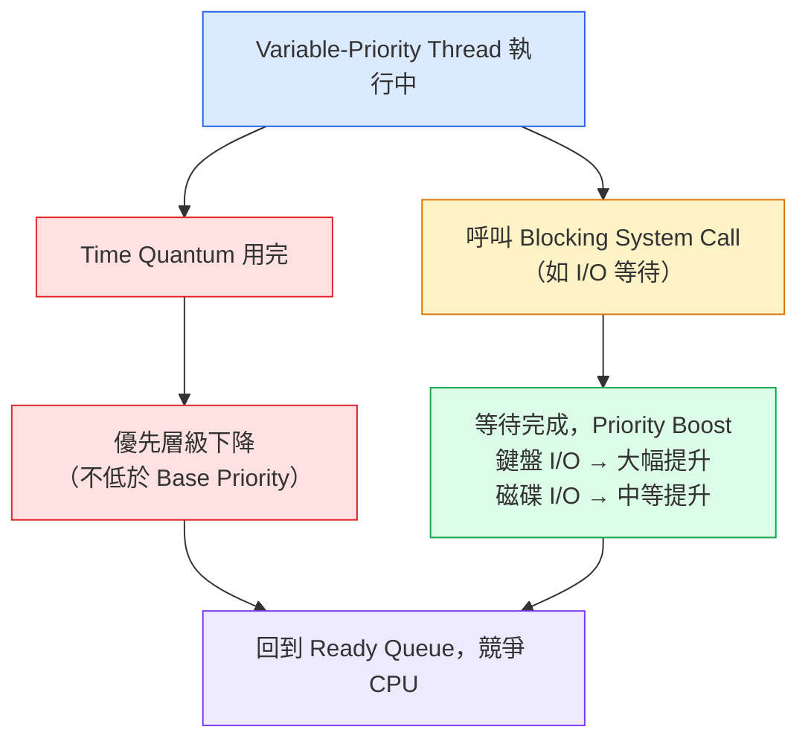
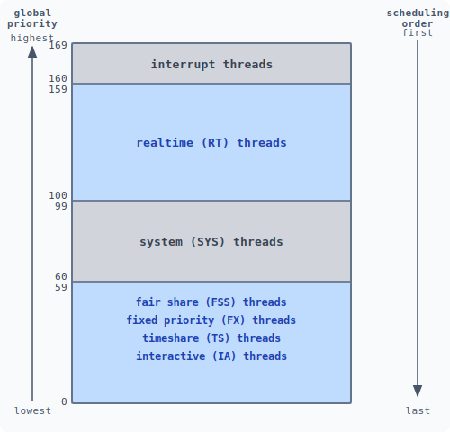

:::note
本系列文章內容參考自經典教材 **Operating System Concepts, 10th Edition (Silberschatz, Galvin, Gagne)**。本文對應章節：**Section 5.7 Operating-System Examples**。
:::

本節以 Linux、Windows、Solaris 三個主流 OS 為例，說明排程理論在實際系統中的具體落實方式。本節所稱的「排程」，在 Linux 中是針對 **kernel task** 的排程，在 Solaris 與 Windows 中則是針對 **kernel thread** 的排程。

 

## **5.7.1 Linux 排程**

### **歷史演進**

Linux 排程器歷經三個明顯世代：

- **Linux 2.5 以前**：沿用傳統 UNIX 排程演算法。因未針對 SMP（Symmetric Multiprocessing）設計，當 Runnable Process 數量增多時，效能明顯下降。
- **Linux 2.5 — O(1) 排程器**：以常數時間複雜度（Constant Time）運作，加強 SMP 支援，並引入 Processor Affinity 與 Load Balancing。然而在桌面系統常見的**互動式程序（Interactive Process）** 上，響應時間較差。
- **Linux 2.6.23 起**：引入 **CFS（Completely Fair Scheduler，完全公平排程器）**，成為預設排程演算法，在互動性與公平性之間取得更好的平衡，延用至今。

### **排程類別（Scheduling Classes）**

Linux 的排程架構建立在**排程類別（Scheduling Class）** 的概念上：每個類別有自己的優先層級與排程演算法，排程器每次選擇**優先層級最高的類別**中**優先層級最高的 Task** 來執行。標準 Linux Kernel 實作兩個排程類別：

1. **預設類別（Default Class）**：使用 CFS 演算法，面向一般程序
2. **即時類別（Real-Time Class）**：使用 POSIX 標準的 `SCHED_FIFO` 或 `SCHED_RR`

這個架構讓 Kernel 可以依系統需求（伺服器、桌面、嵌入式）替換或新增排程類別，具有良好的擴充性。

### **CFS 核心設計：比例式 CPU 時間**

傳統排程器直接指定每個 Process 的 Time Quantum。CFS 採用完全不同的思路：**不指定固定的 Time Quantum，而是將 CPU 時間以比例方式分配給每個 Task**。

比例的計算依據是 **Nice Value（友善值）**：

- Nice Value 的範圍是 **−20 到 +19**，數值越低表示優先層級越高
- 預設 Nice Value 為 0
- Nice Value 越高（越「nice」），表示主動讓出 CPU 給其他 Task，獲得較低比例的 CPU 時間
- Nice Value 越低，獲得越高比例的 CPU 時間

:::info Targeted Latency（目標延遲）
CFS 不以 Time Slice 作為分配單位，而是定義一個 **Targeted Latency**：在這段時間區間內，每個 Runnable Task 應至少執行一次。每個 Task 所獲得的 CPU 時間，就是從 Targeted Latency 中依比例切割出來的份額。

**為什麼不乾脆把 Targeted Latency 設得超長，保證每個 Task 都跑得到？**

如果 Targeted Latency 是 10 秒，系統裡有 100 個 Task，每個 Task 每 10 秒才輪到一次。對互動式程式（例如文字編輯器）來說，按下按鍵後要等到 10 秒後才能響應，使用體驗完全無法接受。**Targeted Latency 本質上就是「每個 Task 最久等多久才能輪到 CPU」的上限承諾**，設太長就等於放棄了響應性。

那 Targeted Latency 的預設值是怎麼訂出來的？它是根據「讓使用者感覺不到延遲」的經驗值決定的（Linux 預設約 6–8 ms），這是在「響應速度」與「Context Switch 開銷」之間取得平衡的結果：太短，CPU 大部分時間花在切換；太長，響應性變差。

**為什麼 Task 變多時 Targeted Latency 要自動增加？**

假設 Targeted Latency 固定為 6ms，系統裡有 1000 個 Task，每個 Task 只分到 6ms / 1000 = 6μs，比一次 Context Switch 本身的耗時還短，換來換去毫無意義。因此，當 Active Task 數量超過閾值時，Targeted Latency 自動拉長，確保每個 Task 至少能執行一個 **Minimum Granularity（最小粒度）** 的時間（Linux 預設約 0.75ms），讓實際工作時間佔 Context Switch 開銷的合理比例。
:::

### **vruntime 機制：CFS 的決策核心**

CFS 用一個 per-task 變數 **vruntime（virtual runtime，虛擬執行時間）** 來追蹤每個 Task 已獲得多少 CPU 時間。

在理解 vruntime 之前，先區分兩個概念：

- **實際執行時間（Physical Runtime）**：Task 真正在 CPU 上運作的掛鐘時間（wall-clock time）。例如一個 Task 在 CPU 上跑了 200ms，它的實際執行時間就是 200ms，這是客觀的物理時間。
- **虛擬執行時間（Virtual Runtime / vruntime）**：CFS 內部維護的一個加權計數器，**不等於實際執行時間**，而是根據 Task 的優先層級（Nice Value）對實際執行時間進行縮放後的值。

vruntime 的關鍵規則：**vruntime 的增長速率取決於 Nice Value**。

- Nice Value = 0（Normal Priority）：vruntime 以 **1:1** 比率增長，跑 100ms → vruntime 增加 100ms
- 優先層級較高（Nice Value 較低，如 −10）：vruntime 增長**較慢**，跑 100ms → vruntime 只增加約 50ms
- 優先層級較低（Nice Value 較高，如 +10）：vruntime 增長**較快**，跑 100ms → vruntime 增加約 200ms

**增長速率的目的不是「給 Task 更多時間跑」，而是讓排程決策自動反映優先層級**。排程器永遠選取 vruntime 最小的 Task 執行。由於高優先層級 Task 的 vruntime 增長慢，即使它已經跑了一段時間，vruntime 依然可能比其他 Task 低，因而持續獲得 CPU。

- **每次排程時，CFS 選擇 vruntime 最小的 Task 執行**
- 若有更高優先層級的 Task 變為 Runnable，可以搶佔（Preempt）正在執行的較低優先層級 Task

下圖說明 CFS 排程器持續運作的循環：

vruntime 機制的核心洞察在於：**它讓「公平」這個概念自動浮現，而非靠外部強制**。只要每個 Task 的 vruntime 依優先層級以不同速率增長，高優先層級 Task 的 vruntime 自然長期偏低，排程器永遠優先選它，完全不需要任何「優先層級佇列」或「搜尋優先層級」的額外邏輯。

### **I/O 密集 vs. CPU 密集的自然平衡**

以兩個 Nice Value 相同的 Task 為例（因此 vruntime 增長速率相同），一個 I/O 密集（I/O-bound），一個 CPU 密集（CPU-bound）：

1. **I/O 密集 Task**：每次獲得 CPU 後只跑幾毫秒（例如 5ms），就因等待鍵盤輸入或磁碟資料而主動進入 Blocking 狀態，讓出 CPU。**在 Blocking 期間，它不在 CPU 上運作，vruntime 完全停止增長。** 等 I/O 完成喚醒後，再跑幾毫秒，再次 Blocking。
2. **CPU 密集 Task**：每次獲得 CPU 就一路跑到時間用完（例如 20ms）才被排程器強制切換，從不主動放棄 CPU。**它在 CPU 上持續運作，vruntime 不停累積。**

兩者的 vruntime 增長速率雖然相同（Nice Value 相同），但**累積的實際 CPU 時間差距巨大**：在同一段掛鐘時間內，I/O 密集 Task 可能只真正使用了 CPU 50ms，CPU 密集 Task 卻使用了 500ms。vruntime 直接反映這個差距。

隨著時間推移，I/O 密集 Task 的 vruntime 遠低於 CPU 密集 Task。當 I/O 密集 Task 等待的 I/O 資料到位、重新成為 Runnable 時，它的 vruntime 最小，立即搶佔 CPU 密集 Task。

**結果**：互動式程序自然浮升，獲得快速的 CPU 響應；CPU 密集程序則在背景利用閒置的 CPU。這不需要任何人工干預，純粹由 vruntime 的自然差異驅動。

### **即時排程**

Linux 採用 POSIX 標準實作即時排程，提供兩種即時排程政策（Scheduling Policy）供 Task 選擇使用：

- **`SCHED_FIFO`（First-In, First-Out）**：即時 Task 依照先進先出順序排程。一旦取得 CPU，就持續執行直到主動 Blocking 或被更高優先層級的即時 Task 搶佔為止，**同優先層級之間沒有 Time Slice**，不會被強制切換。
- **`SCHED_RR`（Round-Robin）**：與 `SCHED_FIFO` 相同，但在**同優先層級的即時 Task 之間加入 Time Slicing**，讓它們能輪流使用 CPU，而不是讓先到的那個一直跑。

「使用這些政策」的意思是：每個 Thread 可以在建立時（或事後）透過 POSIX API（例如 `pthread_attr_setschedpolicy()`）指定自己的排程政策為 `SCHED_FIFO` 或 `SCHED_RR`，Linux Kernel 就會依照所選政策來排程該 Thread。

即時 Task 的優先層級永遠高於所有 Normal Task。Linux 使用兩套獨立的優先層級數值空間：

下圖顯示 Linux 系統中的優先層級範圍配置：

兩個區段的含義：

- **real-time（0–99）**：即時 Task 使用 `SCHED_FIFO` 或 `SCHED_RR`，靜態分配優先層級（不隨執行動態改變）
- **normal（100–139）**：普通 Task 由 CFS 管理，優先層級由 Nice Value 決定。Nice Value −20 對應 priority 100，Nice Value +19 對應 priority 139

這兩個範圍在系統內部構成一套統一的**全域優先層級（Global Priority）**，數值越低優先層級越高，即時 Task 的全域優先層級永遠高於 Normal Task。

### **CFS 效能：紅黑樹（Red-Black Tree）**

:::info CFS PERFORMANCE
CFS 需要非常頻繁地找到「下一個應執行的 Task」，對效率要求極高。它使用的資料結構是**紅黑樹（Red-Black Tree）**，這是一棵以 **vruntime 為 key** 的平衡二元搜尋樹（Balanced Binary Search Tree）：

圖中各節點位置的含義：

- **左側節點**：vruntime 較小（等待 CPU 時間最久，優先層級最高）
- **右側節點**：vruntime 較大（已獲得較多 CPU 時間）
- **最左節點（Leftmost Node）**：vruntime 最小，是下一個應執行的 Task

當 Task 進入 Runnable 狀態（例如 I/O 完成），就加入樹中；當 Task 進入等待（例如發出 I/O 請求），就從樹中移除。

理論上，找到最左節點需要 O(log N) 步（N 為節點數）。但 Linux 排程器直接快取最左節點的指標於變數 **`rb_leftmost`** 中，因此選取下一個 Task 實際上只需 **O(1)** 時間：直接讀取快取值即可。
:::

### **負載平衡與排程域（Scheduling Domains）**

CFS 支援多核心系統上的負載平衡。在討論負載平衡之前，先釐清「**負載（Load）**」的定義。

直觀的想法是：「一個 Thread 使用 CPU 越多，負載就越高。」但 CFS 採用更精確的定義：**負載 = 優先層級（Priority）與平均 CPU 使用率（Average CPU Utilization）的綜合指標**。

這個定義的意義在於：

- 一個**高優先層級但以 I/O 為主**的 Thread（例如優先 −10 的互動式程序，但它大部分時間在等待使用者輸入）：雖然優先層級高，但平均 CPU 使用率低，整體負載其實不高。
- 一個**低優先層級但 CPU 密集**的 Thread（例如優先 +5 的背景計算任務，持續使用 CPU）：雖然優先層級低，但 CPU 使用率高，整體負載相當可觀。

這兩個 Thread 在 CFS 的定義下可能有相似的「負載」，平衡系統不應只看優先層級或只看 CPU 使用率。一個 Run Queue 的**總負載 = 隊列中所有 Thread 負載的總和**，負載平衡的目標是讓所有 Core 的 Run Queue 總負載盡量相等。

然而，遷移 Thread 到不同 Core 上可能引入**記憶體存取代價**（Cache 失效，或 NUMA 系統的跨節點記憶體延遲）。為了在負載平衡與記憶體效能之間取得平衡，CFS 定義了**排程域（Scheduling Domain）** 的層次結構：

圖中的排程域層次結構說明：

- **domain0 / domain1**：分別代表共享同一個 L2 Cache 的 Core 群組（例如 core0 與 core1 共享一個 L2，構成 domain0；core2 與 core3 共享另一個 L2，構成 domain1）
- **physical processor domain（NUMA node）**：domain0 與 domain1 共享 L3 Cache，構成一個 NUMA 節點。在更大的 NUMA 系統中，多個 NUMA 節點可以進一步組成系統層級的域（System-Level Domain）

CFS 的負載平衡策略是**從最低層級的域開始，逐層向上**：

1. 優先在同一個 domain 內進行 Thread 遷移（例如只在 domain0 的 core0 與 core1 之間）
2. 若 domain 內部已均衡，才考慮跨 domain 遷移（domain0 ↔ domain1）
3. **跨 NUMA 節點的遷移只在負載嚴重失衡時才發生**，以避免高昂的 NUMA 跨節點記憶體延遲
4. 若整體系統處於繁忙狀態，CFS 甚至不跨 domain 進行平衡

這個設計體現了一個核心取捨：**負載平衡可以提升吞吐量，但 Thread Affinity（讓 Thread 留在同一 Core）可以降低 Cache Miss 與 NUMA 記憶體延遲**。排程域層次結構讓這兩個目標在不同粒度上分別優化，互不干擾。

 

## **5.7.2 Windows 排程**

### **Dispatcher：優先層級搶佔式排程**

Windows 的排程核心稱為 **Dispatcher（分派器）**，採用**優先層級搶佔式（Priority-Based Preemptive）** 策略：

- 系統中**優先層級最高的 Runnable Thread 永遠優先執行**
- 執行中的 Thread 在以下四種情況會被中斷或結束：
  1. 被更高優先層級的 Thread **搶佔（Preempt）**
  2. Thread 自身**終止（Terminate）**
  3. **Time Quantum 用完**
  4. 呼叫 **Blocking System Call**（例如 I/O）

當即時 Thread 變為 Ready 時，即使此時有較低優先層級的 Thread 正在執行，也會立即被搶佔，讓即時 Thread 能在需要時確保優先取得 CPU。

### **32 層優先層級架構**

Dispatcher 使用一套 **32 層（0–31）** 的優先層級架構：

| 層級範圍 |      類別       | 說明                                       |
| :------: | :-------------: | :----------------------------------------- |
|  16–31   | Real-Time Class | 即時 Thread，優先層級固定不動態調整        |
|   1–15   | Variable Class  | 一般 Thread，優先層級可依執行行為動態調整  |
|    0     |    系統保留     | 記憶體管理（Memory Management）專用 Thread |

Dispatcher 為每個優先層級維護一個就緒佇列（Ready Queue），從最高優先層級向下掃描，選擇第一個 Runnable Thread 執行。若所有佇列皆空，則執行特殊的 **Idle Thread**。

### **優先層級類別（Priority Class）與相對優先層級**

Windows 的 Thread 優先層級由兩個維度共同決定：

**第一維度：Process 所屬的優先層級類別（Priority Class）**，Windows API 定義 6 個：

|         優先層級類別          | 基礎優先層級（Base Priority） |
| :---------------------------: | :---------------------------: |
|   `REALTIME_PRIORITY_CLASS`   |              24               |
|     `HIGH_PRIORITY_CLASS`     |              13               |
| `ABOVE_NORMAL_PRIORITY_CLASS` |              10               |
|    `NORMAL_PRIORITY_CLASS`    |               8               |
| `BELOW_NORMAL_PRIORITY_CLASS` |               6               |
|     `IDLE_PRIORITY_CLASS`     |               4               |

Process 預設屬於 `NORMAL_PRIORITY_CLASS`（除非父 Process 屬於 `IDLE_PRIORITY_CLASS`，或建立時另行指定）。可透過 `SetPriorityClass()` 函數修改。

**第二維度：Thread 在其所屬類別內的相對優先層級（Relative Priority）**，共 7 個等級：

`TIME_CRITICAL`、`HIGHEST`、`ABOVE_NORMAL`、`NORMAL`、`BELOW_NORMAL`、`LOWEST`、`IDLE`

Thread 最終的數值優先層級由這兩個維度共同決定，如下表所示（每個 Thread 有一個**基礎優先層級 Base Priority**，預設為其類別的 `NORMAL` 相對優先層級所對應的數值）：

| 相對優先層級  | real-time | high  | above normal | normal | below normal | idle priority |
| :-----------: | :-------: | :---: | :----------: | :----: | :----------: | :-----------: |
| TIME_CRITICAL |    31     |  15   |      15      |   15   |      15      |      15       |
|    HIGHEST    |    26     |  15   |      12      |   10   |      8       |       6       |
| ABOVE_NORMAL  |    25     |  14   |      11      |   9    |      7       |       5       |
|    NORMAL     |    24     |  13   |      10      |   8    |      6       |       4       |
| BELOW_NORMAL  |    23     |  12   |      9       |   7    |      5       |       3       |
|    LOWEST     |    22     |  11   |      8       |   6    |      4       |       2       |
|     IDLE      |    16     |   1   |      1       |   1    |      1       |       1       |

以 `ABOVE_NORMAL_PRIORITY_CLASS` 加上 `NORMAL` 相對優先層級為例，Thread 的數值優先層級為 **10**。

### **動態優先層級調整**

Variable Class（1–15）的 Thread 優先層級會隨執行狀態動態變化，以同時實現互動性與吞吐量：

兩條路徑的設計意圖：

- **Time Quantum 用完** 後降低優先層級：限制 CPU 密集型 Thread 持續佔用 CPU，讓其他 Thread 也有機會執行
- **等待完成後 Priority Boost**：讓 I/O 密集的互動式 Thread 在資料到位後立即搶回 CPU，保證響應速度。等待的類型決定 Boost 的幅度，鍵盤 I/O（使用者正在操作）的 Boost 遠大於磁碟 I/O

整體效果與 Linux CFS 一致：**互動式 Thread 自然維持在較高優先層級，CPU 密集型 Thread 則在背景以較低優先層級運作**。

除了等待類型的 Boost，Windows 還對前景程序（Foreground Process，即使用者目前操作的視窗）提供額外的 Scheduling Quantum 加速：當程序移入前景時，Time Quantum 增加約 **3 倍**，使前景程序在 Time-Sharing Preemption 前可以連續執行更長時間。

### **User-Mode Scheduling（UMS）**

Windows 7 引入 **UMS（User-Mode Scheduling）**，允許應用程式在完全不進入 Kernel 的情況下建立和排程 Thread：

- 對需要建立大量 Thread 的應用程式，User Mode 排程的效率遠高於 Kernel Mode（省去每次 System Call 的切換開銷）
- UMS 本身不提供排程邏輯，排程器由上層程式語言函式庫實作。Microsoft 的 **ConcRT（Concurrency Runtime）** 就是建立在 UMS 之上的 C++ 任務並行（Task-Based Parallelism）框架

:::info UMS 與舊版 Fiber 的差異
Windows 更早期提供類似機制 **Fiber**：允許多個 User-Mode Thread 對應到同一個 Kernel Thread。但 Fiber 的致命缺陷是：所有 Fiber **共用同一個 Thread Environment Block（TEB）**。若一個 Windows API 函數在 TEB 中寫入狀態，另一個 Fiber 可能覆蓋這些值，導致難以追蹤的 Bug。

UMS 解決了這個問題：**每個 User-Mode Thread 擁有自己獨立的 Thread Context**，互不干擾。
:::

### **多處理器排程支援**

Windows 嘗試將 Thread 排程到最佳的 Processing Core 上，兼顧 Thread Affinity（讓 Thread 留在熟悉的 Core）與跨核心的負載分散：

**SMT Sets（同步多執行緒集合）**：在 Hyper-Threaded SMT 系統上，同一個 Physical Core 上的 Hardware Thread 屬於同一個 SMT Set。排程器傾向讓 Thread 持續在同一個 SMT Set 的 Logical Processor 上執行，以避免 Cache 失效的記憶體存取代價。

**Ideal Processor（理想處理器）**：每個 Thread 都有一個偏好的 Ideal Processor（邏輯處理器編號）。分配方式依照以下規則：

- 每個 Process 有一個初始 Seed，指定其第一個 Thread 的 Ideal Processor
- 每建立一個新 Thread，Seed 遞增，從而將同一 Process 的多個 Thread 分散到不同 Logical Processor
- 在 SMT 系統上，遞增的步長是「跳至下一個 SMT Set」。以雙執行緒四核心系統（SMT Sets: {0,1}, {2,3}, {4,5}, {6,7}）為例，若 Seed 起始為 0，同一 Process 的 Thread 依序分配 Ideal Processor：0, 2, 4, 6, 0, 2, ...（始終在不同的 SMT Set）
- 不同 Process 使用不同的 Seed 起始值，確保各 Physical Core 之間的負載被分散

 

## **5.7.3 Solaris 排程**

### **六大排程類別**

Solaris 的排程架構由 **6 個排程類別（Scheduling Class）** 組成，每個類別有各自的優先層級範圍與排程演算法：

|       排程類別       | 說明                                                                 |
| :------------------: | :------------------------------------------------------------------- |
|  Time-Sharing（TS）  | 預設類別，動態調整優先層級與 Time Slice（Multilevel Feedback Queue） |
|  Interactive（IA）   | 視窗應用程式，與 TS 使用相同機制，但給予稍高優先層級                 |
|   Real-Time（RT）    | 最高全域優先層級，保證在有限時間內獲得 CPU 響應                      |
|    System（SYS）     | Kernel 內部執行緒，優先層級固定不變，保留給 Kernel 使用              |
| Fixed Priority（FP） | 與 TS 相同的優先層級範圍，但優先層級不動態調整（Solaris 9+ 引入）    |
|  Fair Share（FSS）   | 以 CPU Share 代替優先層級進行資源配額管理（Solaris 9+ 引入）         |

### **Time-Sharing 類別：Dispatch Table**

Time-Sharing 是使用者程序的預設類別。它的核心機制是**多層次回饋佇列（Multilevel Feedback Queue）**，配合一份 **Dispatch Table（分派表）** 精確定義每個優先層級的行為。

Dispatch Table 體現一個核心哲學：**優先層級與 Time Quantum 成反比**。高優先層級的互動式程序獲得較短的 Time Quantum（更頻繁地輪到執行），低優先層級的 CPU 密集程序獲得較長的 Time Quantum（每次執行更多工作）。

下表為簡化的 Dispatch Table，完整版本（60 個優先層級）可在 Solaris 系統上執行 `dispadmin -c TS -g` 查看：

| Priority | Time Quantum (ms) | Time Quantum Expired | Return from Sleep |
| :------: | :---------------: | :------------------: | :---------------: |
|    0     |        200        |          0           |        50         |
|    5     |        200        |          0           |        50         |
|    10    |        160        |          0           |        51         |
|    15    |        160        |          5           |        51         |
|    20    |        120        |          10          |        52         |
|    25    |        120        |          15          |        52         |
|    30    |        80         |          20          |        53         |
|    35    |        80         |          25          |        54         |
|    40    |        40         |          30          |        55         |
|    45    |        40         |          35          |        56         |
|    50    |        40         |          40          |        58         |
|    55    |        40         |          45          |        58         |
|    59    |        20         |          49          |        59         |

表中四個欄位的含義：

- **Priority**：執行緒在 TS/IA 類別內的優先層級，數值越高優先層級越高，範圍 0–59
- **Time Quantum**：該優先層級對應的 Time Quantum，呈現最低優先層級（0）對應最大 Time Quantum（200 ms）、最高優先層級（59）對應最小 Time Quantum（20 ms）的反比關係
- **Time Quantum Expired**：執行緒在用盡整個 Time Quantum 而**未進入等待**時，所被降至的新優先層級。這類執行緒被視為 CPU 密集型，優先層級向下調整
- **Return from Sleep**：執行緒從睡眠狀態（例如等待 I/O）返回時，所被提升至的新優先層級。從表中可見，I/O 完成後優先層級被提升到 50–59 的範圍，保證互動式程序的快速響應

這套機制的整體效果：CPU 密集型程序反覆用完 Time Quantum 而被降低優先層級，沉到表格下方；互動式程序頻繁進入睡眠又被喚醒，每次喚醒都大幅提升優先層級，自然浮升到表格上方。整個優先層級的動態調整完全由 Dispatch Table 驅動，無需人工介入。

### **其他排程類別說明**

**Interactive（IA）**：使用與 TS 完全相同的排程策略（包括相同的 Dispatch Table），但給予 KDE、GNOME 等視窗管理器建立的視窗應用程式稍高的優先層級，提升 UI 響應性。

**Real-Time（RT）**：RT 執行緒在全域優先層級系統中排名最高（僅次於 Interrupt Thread），保證在有限時間內獲得 CPU。由於即時保證的成本高，實際系統中屬於 RT 類別的程序通常極少。

**System（SYS）**：專門用於 Kernel 內部執行緒，例如排程器本身（Scheduler）與分頁 Daemon（Paging Daemon）。SYS 執行緒的優先層級一旦建立便固定不變。以 Kernel Mode 執行的**使用者程序並不屬於** SYS 類別。

**Fixed Priority（FP）**：優先層級範圍與 TS 相同（0–59），但優先層級不動態調整，適合需要可預測排程行為但不需要即時保證的工作。

**Fair Share（FSS）**：以 **CPU Share（CPU 份額）** 取代優先層級來做排程決策。CPU Share 表示對可用 CPU 資源的使用權利（Entitlement），分配給一組程序（稱為 **Project**）。若一個 Project 擁有全系統 50% 的 CPU Share，在繁忙系統下可期望獲得約 50% 的 CPU 時間。

### **全域優先層級映射**

每個排程類別都有各自的類別內優先層級。Solaris 排程器在實際選擇執行緒時，會將所有類別的優先層級統一換算成**全域優先層級（Global Priority）**，再選擇最高的來執行：

下圖顯示 6 個排程類別的全域優先層級配置，以及排程的先後順序：

全域優先層級的配置從高到低：

- **160–169**：Interrupt Thread，不屬於任何排程類別，由 Kernel 維護 10 個執行緒專門服務中斷請求，擁有全系統最高優先層級
- **100–159**：Real-Time（RT）執行緒
- **60–99**：System（SYS）執行緒
- **0–59**：Fair Share（FSS）、Fixed Priority（FP）、Time-Sharing（TS）、Interactive（IA）執行緒，四個類別共用此範圍

當多個執行緒擁有相同全域優先層級時，Solaris 採用 **Round-Robin** 輪流排程。

:::info Solaris 執行緒模型的演進
Solaris 傳統上使用 Many-to-Many 執行緒模型（多個 User Thread 對應到多個但數量較少的 Kernel Thread），但從 **Solaris 9** 起改為 **One-to-One 模型**（每個 User Thread 直接對應一個 Kernel Thread），與 Linux 和 Windows 的做法一致。
:::
