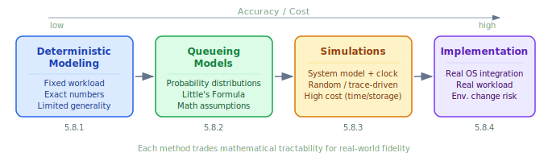
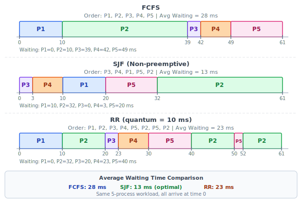
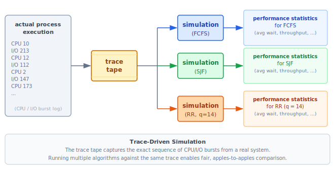

:::note
本系列文章內容參考自經典教材 **Operating System Concepts, 10th Edition (Silberschatz, Galvin, Gagne)**。本文對應章節：**Section 5.8 Algorithm Evaluation**。
:::

## **前言：為什麼需要評估方法？**

在前幾節介紹了許多排程演算法（FCFS、SJF、RR、Priority、Multilevel Queue 等），每種都有不同特性。面對一個真實的系統，該怎麼選？

問題的核心在於：**不同的評估標準（Criteria）會導致不同的最佳選擇**。例如：

- 目標是最大化 CPU 利用率（CPU Utilization）且回應時間不超過 1 秒，和
- 目標是最大化 Throughput 且 Turnaround Time 與總執行時間成線性正比，

這兩個目標可能指向完全不同的演算法。因此，**選擇演算法的第一步是先定義評估標準，再對所有候選演算法進行評估**。

本節介紹四種評估方法，從最簡單到最精確排列如下：

四種方法各有取捨，越往右越貼近真實環境，但所需的時間與資源成本也越高。以下依序介紹。

 

## **5.8.1 確定性建模 (Deterministic Modeling)**

### **什麼是確定性建模？**

確定性建模（Deterministic Modeling）屬於**分析評估（Analytic Evaluation）**的一種，也是最簡單的一類。其核心思路是：給定一個**固定的、事先知道的工作負載（Predetermined Workload）**，計算每種演算法在這個工作負載下的效能數值，再加以比較。

這個方法的前提很強烈：所有 Process 的 CPU Burst Time 必須事先完全已知。這在現實中通常不成立，但在理論分析和教學場景中非常有用。

### **範例演算**

以下是一個經典的教科書範例。假設系統中有 5 個 Process，全部在時間 0 到達，CPU Burst Time 分別如下：

| Process | Burst Time (ms) |
| :-----: | :-------------: |
|   P1    |       10        |
|   P2    |       29        |
|   P3    |        3        |
|   P4    |        7        |
|   P5    |       12        |

考慮三種排程演算法：FCFS、SJF（Non-preemptive）、RR（quantum = 10 ms）。哪一種平均等待時間（Average Waiting Time）最短？

下圖呈現三種演算法的甘特圖（Gantt Chart）與計算結果：

各演算法的計算過程：

**FCFS**（按到達順序：P1, P2, P3, P4, P5）：
- 等待時間：P1=0, P2=10, P3=39, P4=42, P5=49
- 平均等待時間：(0 + 10 + 39 + 42 + 49) / 5 = **28 ms**

**SJF**（按 Burst Time 由短到長：P3, P4, P1, P5, P2）：
- 等待時間：P1=10, P2=32, P3=0, P4=3, P5=20
- 平均等待時間：(10 + 32 + 0 + 3 + 20) / 5 = **13 ms**

**RR**（quantum = 10 ms，執行順序：P1, P2, P3, P4, P5, P2, P5, P2）：
- 等待時間：P1=0, P2=32, P3=20, P4=23, P5=40
- 平均等待時間：(0 + 32 + 20 + 23 + 40) / 5 = **23 ms**

:::info RR 等待時間的計算方式
RR 的等待時間定義與 FCFS/SJF 相同：**Process 在 Ready Queue 中乾等、沒有使用 CPU 的總時間**。由於 RR 會多次搶占，一個 Process 可能分成好幾段才跑完，每次被搶占後重新排隊等待的時間都要累加進去。

以 P2（Burst = 29ms）為例，逐段追蹤如下：

| 時間區間  | P2 的狀態                       | 等待累計 |
| :-------: | :------------------------------ | :------: |
| t=0 → 10  | 在 Queue 等 P1 跑完             |  +10ms   |
| t=10 → 20 | **執行**（第 1 個量子）         |    —     |
| t=20 → 40 | 在 Queue 等 P3、P4、P5 各跑一輪 |  +20ms   |
| t=40 → 50 | **執行**（第 2 個量子）         |    —     |
| t=50 → 52 | 在 Queue 等 P5 跑完剩餘 2ms     |   +2ms   |
| t=52 → 61 | **執行**（第 3 段，9ms，完成）  |    —     |

P2 總等待時間：10 + 20 + 2 = **32ms**
:::

在這個工作負載下，SJF 的平均等待時間不到 FCFS 的一半，RR 居中。從數學上可以證明，當所有 Process 在時間 0 同時到達時，**SJF 永遠是平均等待時間最短的演算法**。

### **確定性建模的優點與限制**

確定性建模最大的優點是**簡單快速，給出精確數字**，讓演算法之間的比較一目了然。

然而，它的缺點同樣明顯：

1. **需要精確的輸入數字**：現實系統的 Process Burst Time 是動態且不可預知的，沒有固定的工作負載
2. **結論只適用於那個特定案例**：換一組 Process 組合，排名就可能改變

因此，確定性建模的主要用途是在**描述演算法行為、提供教學範例**，或在「同一支程式反覆執行、且能精確量測其處理需求」的特殊場景中作為選擇依據。

 

## **5.8.2 排隊模型 (Queueing Models)**

### **為什麼需要排隊模型？**

確定性建模的前提是「工作負載固定且已知」，但大多數真實系統中，每天跑的 Process 都不同，根本沒有一個靜態的工作負載集合。

排隊模型（Queueing Models）解決這個問題的方式是：**不需要知道每個 Process 的確切 Burst Time，只需要知道 CPU Burst 與 I/O Burst 的統計分佈（Distribution）**。這些分佈可以透過量測真實系統來取得，或用數學函數（如指數分佈）來近似。

### **系統模型**

在排隊模型中，電腦系統被描述為一個**伺服器網路（Network of Servers）**：

- CPU 是一個 Server，對應的 Waiting Queue 就是 Ready Queue
- 每個 I/O 裝置也是一個 Server，對應各自的 Device Queue

只要知道每個 Server 的**到達率（Arrival Rate）**與**服務率（Service Rate）**，就能計算出系統的利用率（Utilization）、平均 Queue 長度（Average Queue Length）、平均等待時間等指標。這套分析方法稱為**排隊網路分析（Queueing-Network Analysis）**。

### **Little's Formula**

排隊理論中最重要的公式之一是 **Little's Formula（李特爾公式）**：

$$n = \lambda \times W$$

其中：

|   符號    | 意義                                                    |
| :-------: | :------------------------------------------------------ |
|    $n$    | 穩定狀態下的平均 Queue 長度（不含正在被服務的 Process） |
| $\lambda$ | 新 Process 到達 Queue 的平均速率（單位：Process/秒）    |
|    $W$    | 每個 Process 在 Queue 中的平均等待時間                  |

這個公式的推導邏輯如下：在一個 Process 等待時間為 $W$ 的時段內，平均有 $\lambda \times W$ 個新 Process 到達。若系統處於**穩態（進入 Queue 的速率 = 離開的速率）**，則 Queue 長度 $n$ 就等於 $\lambda \times W$。

:::info Little's Formula 為什麼重要？
Little's Formula 的強大之處在於它**對任何排程演算法、任何到達分佈都成立**，不需要對演算法本身或分佈做任何假設。

實際應用範例：若每秒平均有 7 個 Process 到達（$\lambda = 7$），且 Queue 中通常有 14 個 Process（$n = 14$），則可以直接推算出每個 Process 平均等待 $W = n / \lambda = 14 / 7 = 2$ 秒。
:::

### **排隊模型的限制**

排隊模型雖然比確定性建模更通用，但它自身也有明顯的侷限：

1. **數學上可處理的演算法與分佈類型有限**：複雜演算法的數學推導極為困難
2. **需要做許多獨立性假設**：實際系統中，事件之間往往存在相互依賴，假設「獨立」會產生誤差
3. **分佈定義重視數學可解性而非真實性**：為了讓數學公式可解，往往採用指數分佈等理想化的假設，而非真正的測量分佈

因此，排隊模型最多只是真實系統的**近似（Approximation）**，計算結果的準確性需要審慎評估。

 

## **5.8.3 模擬 (Simulations)**

### **為什麼需要模擬？**

排隊模型因為數學假設的限制，無法精確反映真實系統的行為。若需要更準確的評估，就要改用**模擬（Simulation）**。

模擬的基本思路是：**用程式建立整個電腦系統的模型**，讓模型在程式中「跑起來」，再收集統計數據。

### **模擬的運作方式**

一個模擬器的核心結構如下：

1. 用軟體資料結構（Software Data Structures）代表系統的各個元件，例如 Ready Queue、CPU、裝置
2. 模擬器內有一個代表**時鐘（Clock）** 的變數；每次推進時鐘，模擬器就根據模型更新系統狀態
3. 模擬執行過程中，持續收集並輸出各種效能統計數據（平均等待時間、Throughput 等）

### **模擬資料的來源：Random vs. Trace**

模擬器需要一個「事件序列」來驅動，這個序列的品質直接決定結果的可信度。有兩種產生方式：

**方法一：隨機數產生器（Random-Number Generator）**

根據預先定義的機率分佈（uniform、exponential、Poisson 等）隨機產生 Process、CPU Burst、到達時間等事件。分佈可以用數學公式定義，也可以根據對真實系統的量測來確定。

這個方法的限制是：**頻率分佈只告訴我們每種事件出現了幾次，卻無法反映事件之間的順序關係（Ordering）**。真實系統中，事件的發生順序並非獨立的，相關性很重要。

**方法二：Trace Files（追蹤檔案）**

更準確的方法是監控一個真實系統，**記錄實際發生的事件序列**，形成一份 Trace File。接著用同一份 Trace File 驅動不同的排程演算法模擬，就能在**完全相同的輸入**下公平地比較各演算法的表現。

下圖呈現以 Trace-Driven Simulation 比較 FCFS、SJF、RR 三種演算法的架構：

圖中各部分的含義：

- **actual process execution**（左側）：代表從真實系統中擷取的 CPU/I/O Burst 事件記錄
- **trace tape**：將實際事件序列整理後形成的追蹤資料，作為三個模擬器的統一輸入
- **simulation (FCFS/SJF/RR)**：三個各自實作不同排程演算法的模擬器，接受相同的 trace 輸入
- **performance statistics**（右側）：每個模擬器輸出的效能統計結果，可直接比較

這個架構的核心優勢在於：三個模擬器面對的是**完全相同的工作負載序列**，因此統計結果的差異完全來自演算法本身，而非輸入的偶然性。

:::tip Trace-Driven Simulation 的本質
Trace-Driven Simulation 讓「控制變數，只改演算法」成為可能。就像科學實驗中要讓對照組和實驗組的條件完全相同一樣，使用同一份 Trace File 驅動不同演算法，才能做出真正公平的比較。
:::

### **模擬的限制**

模擬雖然比前兩種方法更精確，但代價也更高：

1. **計算成本高**：通常需要大量的電腦時間才能跑出有統計意義的結果；模擬越詳細，耗時越長
2. **Trace File 的儲存成本高**：記錄真實系統的所有事件需要大量儲存空間
3. **模擬器本身的開發成本**：設計、撰寫、除錯一個準確的模擬器是相當繁重的工程工作

 

## **5.8.4 實作 (Implementation)**

### **最精確但也最昂貴的方式**

即使是最精細的模擬，準確度依然有限，因為模擬器終究是現實的近似。評估一個排程演算法最精確的方式，只有一種：**直接將演算法實作到作業系統中，在真實的運作條件下觀察它的表現**。

### **實作的成本**

這個方法的成本是真實存在的，主要包括：

1. **撰寫演算法程式碼**，並修改 OS 的相關資料結構以支援它
2. **測試**：通常在虛擬機器（Virtual Machines）上進行，而非直接在實體硬體上測試，以降低風險
3. **Regression Testing（回歸測試）**：確認新的排程演算法沒有破壞原本正常運作的功能，也沒有引入新的 Bug，或讓舊 Bug 重現

### **環境改變問題**

實作到真實 OS 後，還面臨一個根本性的困難：**環境本身會因為排程策略而改變**。

這聽起來有點抽象，用兩個具體例子說明：

- 若排程器偏好**短 Process**，使用者可能把原本的大 Process 拆成許多小 Process
- 若排程器偏好**互動式（Interactive）Process**，使用者可能原本用批次處理的工作也改成互動模式提交

更戲劇性的是，有研究者設計了一套系統，根據「Process 是否在最近 1 秒內有 Terminal I/O」來判斷是否為互動式 Process，並給予較高優先權。結果有一位工程師發現了這個規則，**在程式中加入定時寫入一個任意字元到 Terminal 的邏輯**，讓 OS 誤認這是互動式 Process，從而獲得不應得的高優先權。

這個例子說明了一個深層問題：**排程策略本身就是一種激勵機制（Incentive），它會改變使用者的行為**，而行為的改變又回過頭來影響排程器的運作效果，使得原本的效能評估失去意義。

:::info 應對環境改變的實務做法
面對環境改變的問題，業界常見的應對策略有兩種：

1. **工具化（Tooling）**：提供工具或腳本來封裝一組完整的操作，讓使用者反覆使用這套工具，並在使用過程中量測結果、偵測問題
2. **允許調整排程參數**：讓最終使用者或系統管理員能夠調整排程參數，以適應特定的應用場景

例如，Solaris 提供 `dispadmin` 指令，允許系統管理員修改各排程 Class 的參數；Java、POSIX、Windows API 也都提供了可以調整 Process 或 Thread 優先權的函式。

然而，這個方向的本質侷限是：**針對特定應用場景調整出來的最優參數，往往不適用於其他場景**。在特定環境下效能出色的演算法，放到不同的工作負載下，效果可能大幅下滑。
:::
