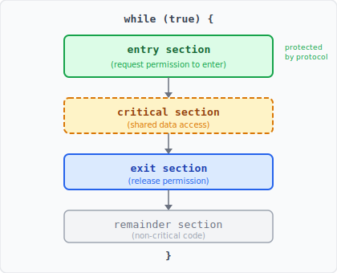
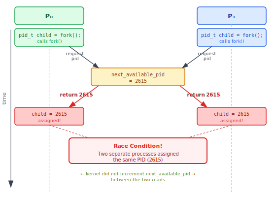
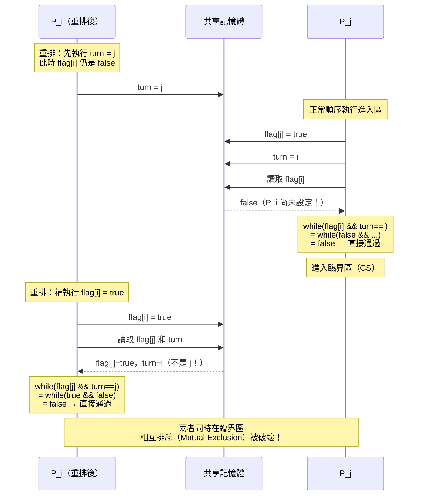
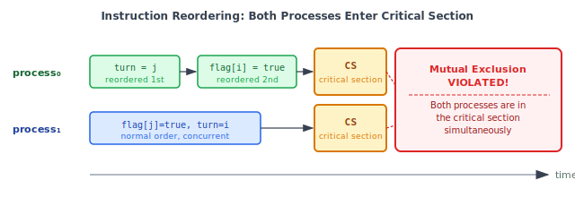

:::note
本系列文章內容參考自經典教材 **Operating System Concepts, 10th Edition (Silberschatz, Galvin, Gagne)**。本文對應章節：**Section 6.1 Background、6.2 The Critical-Section Problem、6.3 Peterson's Solution**。
:::

<br/>

在前幾章，我們看到行程（Process）可以並行（Concurrent）或平行（Parallel）執行。行程排程器（CPU Scheduler）在行程之間快速切換，使多支程式能夠「同時」推進。當這些行程需要**共享資料**時，問題就出現了：如果兩個行程在毫無協調的情況下同時讀寫同一份資料，結果可能是錯誤的，而且每次執行的結果都可能不同。本章的核心目標，就是找出一套機制，確保協作行程在共享資料時的**有序執行**。

<br/>

## **6.1 背景 (Background)**

### **從生產者-消費者問題談起**

以第 3 章介紹的**有界緩衝區（Bounded Buffer）** 為例，生產者和消費者透過一個共享緩衝區交換資料。原本的實作為了追蹤緩衝區中的物品數量，加入了一個整數變數 `count`，初始值為 0。每次生產者放入一個物品時執行 `count++`，每次消費者取出一個物品時執行 `count--`。

```c
// 生產者
while (true) {
    while (count == BUFFER_SIZE)
        ;  // 等待，緩衝區滿
    buffer[in] = next_produced;
    in = (in + 1) % BUFFER_SIZE;
    count++;
}

// 消費者
while (true) {
    while (count == 0)
        ;  // 等待，緩衝區空
    next_consumed = buffer[out];
    out = (out + 1) % BUFFER_SIZE;
    count--;
}
```

這兩段程式碼**分開執行**時完全正確。但當生產者和消費者**同時執行**，就可能出現問題。假設 `count` 目前是 5，生產者和消費者同時分別執行 `count++` 和 `count--`，直覺上結果應該還是 5，但實際上可能得到 4、5，或 6。

### **count++ 與 count-- 的陷阱：機器指令層的真相**

表面上 `count++` 是一行 C 語句，但 CPU 執行的其實是三條低階機器指令：

```
# count++ 的機器指令展開
register₁ = count        // 從記憶體讀取 count 的值
register₁ = register₁ + 1 // 對暫存器執行加法
count = register₁        // 把結果寫回記憶體
```

```
# count-- 的機器指令展開
register₂ = count        // 從記憶體讀取 count 的值
register₂ = register₂ - 1 // 對暫存器執行減法
count = register₂        // 把結果寫回記憶體
```

關鍵在於：作業系統可能在這六條機器指令的**任意一條之後**切換行程。若切換發生在中途，兩個行程的指令就會交錯（Interleave）執行，導致錯誤。以下是一個具體的交錯範例（假設 `count` 初始值為 5）：

| 時間點 | 執行方 | 指令                        | 執行後狀態                                     |
| :----: | :----: | :-------------------------- | :--------------------------------------------- |
|   T₀   | 生產者 | `register₁ = count`         | register₁ = 5                                  |
|   T₁   | 生產者 | `register₁ = register₁ + 1` | register₁ = 6                                  |
|   T₂   | 消費者 | `register₂ = count`         | register₂ = 5（此時記憶體中的 count 仍是 5！） |
|   T₃   | 消費者 | `register₂ = register₂ - 1` | register₂ = 4                                  |
|   T₄   | 生產者 | `count = register₁`         | count = 6（生產者寫回）                        |
|   T₅   | 消費者 | `count = register₂`         | count = 4（消費者覆蓋！）                      |

最終 `count == 4`，但正確答案應該是 5。問題的根源是消費者在 T₂ 讀取 `count` 時，拿到的是舊值（5），而不是生產者已在 T₁ 計算好、但還沒有寫回記憶體的新值（6）。消費者隨後在 T₅ 用自己的舊值覆蓋了生產者在 T₄ 剛寫入的結果，導致更新丟失。

若將 T₄ 和 T₅ 的順序對調（消費者先寫回），則最終結果會變成 `count == 6`，同樣是錯誤的。

:::info 競爭條件 (Race Condition)

**競爭條件（Race Condition）** 指的是：多個行程同時存取並操作同一份資料，而最終的執行結果**取決於這些存取發生的特定順序**。不同的交錯順序會導致不同的結果，使程式行為不可預測。

上例中，`count` 的最終值（4、5 或 6）完全取決於 T₀～T₅ 的排列方式，這就是典型的競爭條件。

要防止競爭條件，必須確保**同一時間只有一個行程能夠操作共享變數**。這需要行程之間進行某種形式的**同步化（Synchronization）**。
:::

隨著多核心系統的普及，多執行緒應用程式大量湧現，不同執行緒同時在不同核心上並行操作共享資料，競爭條件的問題變得更加普遍與嚴重。這正是第 6 章花大篇幅討論同步化機制的原因。

<br/>

## **6.2 臨界區問題 (The Critical-Section Problem)**

### **臨界區與四段程式結構**

考慮一個由 $n$ 個行程 $\{P_0, P_1, \ldots, P_{n-1}\}$ 組成的系統。每個行程都有一段程式碼，稱為**臨界區（Critical Section）**，在這段程式碼中，行程可能會存取並更新與至少一個其他行程共享的資料。

臨界區問題的核心約束是：**當一個行程正在執行其臨界區時，不允許任何其他行程執行其臨界區**。換句話說，任何時間點最多只有一個行程在臨界區中執行。

為了達成這個目標，每個行程在進入臨界區之前必須先通過一段**請求許可**的程式碼，稱為**進入區（Entry Section）**；臨界區執行完畢後，需要通過**離開區（Exit Section）** 來釋放許可；其餘不涉及共享資料的程式碼稱為**剩餘區（Remainder Section）**。

下圖呈現了一個典型行程的四段結構：



- **Entry Section（進入區）**：進入臨界區之前執行的協議程式碼，負責請求進入許可
- **Critical Section（臨界區）**：真正存取共享資料的程式碼，任何時間只能有一個行程在此執行
- **Exit Section（離開區）**：離開臨界區之後執行的協議程式碼，負責釋放許可、通知其他等待中的行程
- **Remainder Section（剩餘區）**：行程中其餘不需要同步保護的程式碼

這個結構揭示了一個重要原則：保護共享資料的機制（進入區和離開區）必須對稱地環繞在臨界區兩側，就像一把鎖一樣：進入前上鎖，離開後解鎖。

### **三大正確性需求**

一個正確的臨界區問題解法必須同時滿足以下三個需求：

**1. 相互排斥 (Mutual Exclusion)**

若行程 $P_i$ 正在執行其臨界區，則其他任何行程都不能同時執行其臨界區。這是最基本的安全性（Safety）要求：禁止同時進入。

**2. 進展 (Progress)**

若目前沒有任何行程在臨界區中執行，且有一些行程希望進入臨界區，則**只有那些不在剩餘區中執行的行程**可以參與「決定下一個進入者」的競爭，且這個決定不能被無限期推遲。這個需求防止系統在所有人都在等待、但沒有人在臨界區中時發生**死鎖（Deadlock）**。

**3. 有界等待 (Bounded Waiting)**

從某個行程提出進入臨界區的請求，到該請求被允許，其他行程被允許進入臨界區的次數存在一個上界。這個需求防止某個行程被**無限期餓死（Starvation）**，保證每個請求最終都會得到回應。

此外，我們假設每個行程都以非零的速度執行，但**不對各行程的相對速度做任何假設**。

### **核心中的競爭條件**

競爭條件不只發生在使用者行程之間，作業系統核心本身也面臨同樣的挑戰。核心程式碼中有許多共享的資料結構，當多個核心態行程同時修改這些結構時，就可能出現競爭條件。

**例子一：開啟檔案清單**

核心維護一份記錄所有已開啟檔案的清單（List）。當一個新檔案被開啟時，核心必須將其加入清單；當檔案被關閉時，從清單中移除。若兩個行程同時開啟不同的檔案，各自都會試圖修改這份清單，若沒有保護機制，清單的狀態可能會損壞。

**例子二：PID 分配的競爭條件**

下圖展示了另一個更具體的核心競爭條件：兩個行程 $P_0$ 和 $P_1$ 同時呼叫 `fork()` 建立子行程。



`fork()` 需要從核心變數 `next_available_pid` 中分配一個新的 PID。若 $P_0$ 和 $P_1$ 幾乎同時讀取 `next_available_pid`（值為 2615），兩者都將 2615 作為新子行程的 PID 回傳，然後核心才遞增 `next_available_pid`。結果是：兩個完全不同的行程拿到了**相同的 PID**，這在系統設計上是嚴重的錯誤。

其他容易出現競爭條件的核心資料結構還包括：記憶體配置表、行程清單、中斷處理結構等。確保核心沒有競爭條件是核心開發者的核心責任之一。

### **可搶占核心 vs. 不可搶占核心**

在單核心環境中，有一個看似簡單的做法：在修改共享變數的期間**停用中斷（Disable Interrupts）**，確保這段指令序列不被打斷。這在單核心環境下確實有效，因為沒有中斷就沒有上下文切換，也就不會有競爭條件。

但在多處理器環境中，這個做法代價極高。停用中斷的訊息必須發送給所有處理器，這需要時間，會延遲每個行程進入臨界區的速度，降低系統整體效率。此外，若時鐘是靠中斷更新的，停用中斷還會影響系統時鐘的準確性。

現代 OS 對核心中的臨界區問題，採用兩種截然不同的策略：

**不可搶占核心（Nonpreemptive Kernel）**

核心態的行程**不可被搶占**：一旦進入核心模式，行程持續執行，直到它主動離開核心模式、阻塞，或主動讓出 CPU 為止。任何時間點只有一個行程在核心中活躍，因此核心的共享資料結構天然沒有競爭條件。代價是：若核心程式碼陷入長時間執行，其他高優先級的行程必須等待，系統響應性較差。

**可搶占核心（Preemptive Kernel）**

核心態的行程**可以被搶占**：即使正在執行核心程式碼，也可能被中斷並切換到另一個行程。這使得核心的共享資料結構面臨競爭條件，必須使用同步化機制加以保護。設計難度更高，在 SMP（Symmetric Multiprocessing）架構上尤其困難，因為同一時間可能有兩個核心態行程在不同 CPU 上同時執行。儘管如此，可搶占核心有兩個重要優點：響應性更好（高優先級行程不需等待核心操作結束），且更適合即時運算（Real-Time Computing）需求。

:::info 為什麼現代 OS 偏好可搶占核心？
Linux 從 2.6 版起改為可搶占核心，Windows 也是可搶占核心。這是因為可搶占核心的響應性優勢在互動式系統和即時系統中至關重要，即使這意味著核心開發者必須更謹慎地處理同步化問題。
:::

<br/>

## **6.3 Peterson's Solution**

臨界區問題有軟體解法和硬體解法兩大類。本節介紹的 **Peterson's Solution** 是最經典的**純軟體解法**，由 G. L. Peterson 於 1981 年提出，無需任何特殊的 OS 或硬體指令支援，僅靠演算法本身就能保證正確性。

:::info Peterson's Solution 的歷史地位
雖然 Peterson's Solution 在現代架構上因指令重排問題而**不能保證正確執行**，它的價值在於提供了一個清晰的演算法模型，展示如何在邏輯層面同時滿足相互排斥、進展和有界等待三個需求。理解它是後續所有同步化機制（互斥鎖、號誌、監視器）的重要基礎。
:::

### **演算法設計**

Peterson's Solution 限定用於**兩個行程**之間的同步化，這兩個行程交替在臨界區和剩餘區之間切換。兩個行程分別為 $P_i$ 和 $P_j$（其中 $j = 1 - i$），兩者共享兩個變數：

```c
int turn;        // 輪到誰進入臨界區
boolean flag[2]; // 各行程是否「準備好」進入臨界區
```

- **`turn`**：值為 `i` 或 `j`，表示當前輪到哪個行程進入臨界區
- **`flag[i]`**：若 `flag[i] == true`，表示 $P_i$ 已準備好、希望進入臨界區

$P_i$ 的完整程式結構如下：

```c
while (true) {
    flag[i] = true;          // 宣告「我準備好了」
    turn = j;                // 禮讓：先讓對方試
    while (flag[j] && turn == j)
        ;                    // 等待：若對方也準備好且輪到對方，就等
    /* critical section */
    flag[i] = false;         // 宣告「我離開了」
    /* remainder section */
}
```

進入臨界區的邏輯分兩步：
1. **`flag[i] = true`**：$P_i$ 先宣告自己的意圖，表示「我要進入臨界區」
2. **`turn = j`**：$P_i$ 主動把 `turn` 設為對方的編號，相當於「若雙方同時想進入，讓對方先」

等待條件 `while (flag[j] && turn == j)` 的含義是：「只有當對方也想進入（`flag[j] == true`）**且**輪到對方（`turn == j`）時，我才等待。」只要這兩個條件有任何一個不成立，$P_i$ 就可以進入臨界區。

若兩個行程幾乎同時設定 `turn`，最後 `turn` 的值取決於誰後寫入：先寫入的那方的設定會被覆蓋，後寫入的那方的設定才是最終值。這個機制決定了哪個行程先進入臨界區。

### **三大正確性證明**

**證明 1：相互排斥 (Mutual Exclusion)**

若 $P_i$ 和 $P_j$ 能同時在臨界區中執行，則 `flag[i] == flag[j] == true`。要從等待迴圈中退出，$P_i$ 需要「`flag[j] == false`」或「`turn == i`」之一成立。若兩者同時在臨界區，則 `flag[i]` 和 `flag[j]` 都為 true，因此兩者都必須靠 `turn` 條件退出。但 `turn` 的值只能是 $i$ 或 $j$，不可能同時等於 $i$ 和 $j$，矛盾。故相互排斥成立。

**證明 2：進展 (Progress)**

若 $P_j$ 沒有準備進入（`flag[j] == false`），$P_i$ 的等待條件立即不成立，$P_i$ 直接進入。若 $P_j$ 已設定 `flag[j] = true` 並在等待，則 `turn` 只能是 `i` 或 `j` 之一：
- 若 `turn == i`：$P_i$ 進入臨界區
- 若 `turn == j`：$P_j$ 進入臨界區

兩者必有一個能進入，不會出現雙方都永遠等待的僵局。

**證明 3：有界等待 (Bounded Waiting)**

當 $P_i$ 在等待時，$P_j$ 離開臨界區後會執行 `flag[j] = false`，使 $P_i$ 的等待條件不成立，$P_i$ 得以進入。若 $P_j$ 再次設定 `flag[j] = true`，它同時必須執行 `turn = i`，把輪次讓給 $P_i$。因此 $P_i$ 最多等待 $P_j$ 進入臨界區**一次**，就能輪到自己。有界等待（上界為 1）成立。

### **現代架構的限制：指令重排 (Instruction Reordering)**

Peterson's Solution 雖然在邏輯上完全正確，但在現代電腦架構上**不保證能正確執行**。原因在於現代處理器和編譯器為了提升效能，可能會對沒有資料依賴的讀寫操作進行**重新排序（Reordering）**。

以下面的例子說明問題：

```c
boolean flag = false;
int x = 0;

// Thread 1               // Thread 2
while (!flag)             x = 100;
    ;                     flag = true;
print x;
```

預期行為是 Thread 1 印出 100。但處理器可能把 Thread 2 的 `flag = true` 重排到 `x = 100` 之前執行（因為兩個變數沒有資料相依性），導致 Thread 1 在 `flag` 變成 true 時，`x` 還沒被設成 100，印出的結果是 0。處理器也可能重排 Thread 1 的操作，在讀取 `flag` 之前就先讀取 `x`，同樣可能印出 0。

**為什麼 Peterson's Solution 會因此失效？**

$P_i$ 的進入區本來依賴兩個動作依序完成：

```
① flag[i] = true   ← 先宣告「我要進入」
② turn = j         ← 再禮讓「對方先」
```

重排後，CPU 可能先執行 `turn = j`，再執行 `flag[i] = true`。這個順序顛倒造成以下漏洞：

1. $P_i$ 先執行（重排後）：`turn = j`，但 `flag[i]` **仍是 false**
2. $P_j$ 此時進入進入區，執行 `flag[j] = true`，再執行 `turn = i`
3. $P_j$ 檢查等待條件：`while (flag[i] && turn == i)`
   - `flag[i]` 是 **false**（$P_i$ 還沒設定它！）
   - `false && ...` 直接短路，整個條件為 false
   - $P_j$ **直接進入臨界區**，完全沒有等待
4. $P_i$ 此後完成（重排後的第二步）：`flag[i] = true`
5. $P_i$ 檢查等待條件：`while (flag[j] && turn == j)`
   - `flag[j]` 是 true，但 `turn == j`嗎？ 因為 $P_j$ 在步驟 2 已把 `turn` 設成 `i`，所以 `turn == i`，不是 `j`
   - `true && false` = false，條件不成立
   - $P_i$ **也進入臨界區**

:::tip 
問題不是 `turn` 的值，而是 `flag[i]` 還沒被設定就已讓 $P_j$ 通過了等待檢查。`flag[i] = true` 的作用是「告訴對方我有意圖，對方應該等我」，但因為重排，這個宣告比 `turn = j` 晚到，等 $P_j$ 去看的時候已經看不到這個意圖了。
:::

以下 Sequence Diagram 呈現這個完整的交錯過程：



下圖以時間軸的角度呈現同樣的情況：



圖中 process₀ 的 `turn=1` 和 `flag[0]=true` 被重排（先執行 `turn=1`），process₁ 在 `flag[0]` 還沒設為 true 之前就通過了等待迴圈，導致兩者同時在臨界區（CS）中執行，相互排斥被破壞。

一台電腦的記憶體存取保證（即何時的寫入結果對其他處理器可見）取決於其**記憶體模型（Memory Model）**：

- **強序（Strongly Ordered）**：某個處理器對記憶體的修改對所有其他處理器立即可見
- **弱序（Weakly Ordered）**：某個處理器對記憶體的修改不一定對其他處理器立即可見

不同架構採用不同的記憶體模型，這使得在沒有額外硬體支援的情況下，軟體解法無法可靠地保證同步化。要解決這個問題，必須使用**記憶體屏障（Memory Barrier）**、**不可分割指令（Atomic Instructions）** 或作業系統提供的**同步化工具**（互斥鎖、號誌等），這些是 6.4 節及後續章節的主題。
