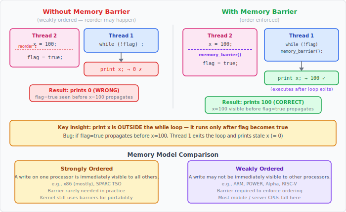
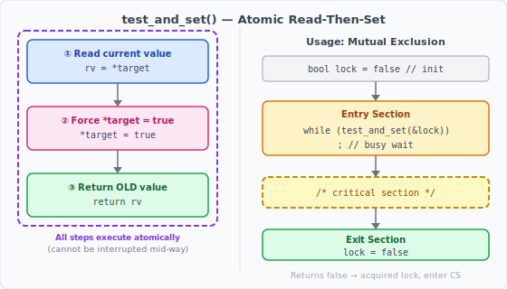
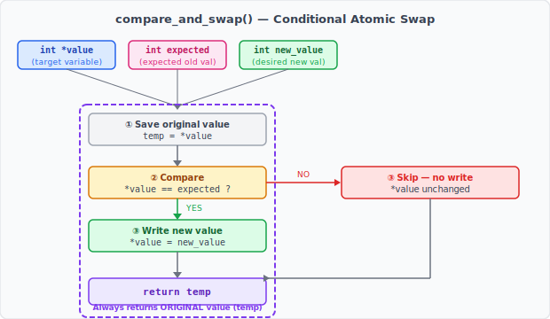
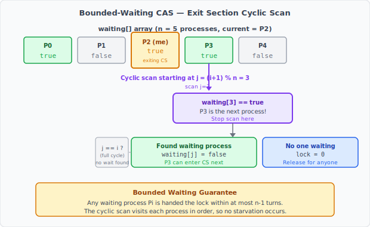

:::note
本系列文章內容參考自經典教材 **Operating System Concepts, 10th Edition (Silberschatz, Galvin, Gagne)**。本文對應章節：**Section 6.4 Hardware Support for Synchronization**。
:::

<br/>

上一節介紹了 Peterson's Solution 這個純軟體解法，並在結尾指出它在現代架構上因**指令重排（Instruction Reordering）** 而無法保證正確執行。根本問題在於：軟體解法假設指令按照程式碼順序執行，且一個處理器對記憶體的寫入會立刻被其他處理器看見，但這兩個假設在現代硬體上都不成立。

要真正解決臨界區問題，必須借助**硬體層級的支援**。本節介紹三種硬體原語（Hardware Primitive）：

1. **記憶體屏障（Memory Barrier）**：強制記憶體操作的可見性順序
2. **硬體原子指令（Hardware Atomic Instructions）**：以不可分割的單一操作完成「讀取-修改-寫回」
3. **原子變數（Atomic Variable）**：以 CAS 指令為基礎建構的高階原語

這三者由低到高構成一個抽象層次：屏障直接操控記憶體可見性，原子指令建立在屏障語意之上，原子變數則是原子指令的高階封裝。

<br/>

## **6.4.1 記憶體屏障 (Memory Barriers)**

### **問題的起點：記憶體模型**

在多處理器系統上，一個處理器寫入記憶體後，其他處理器**何時能看到這個改變**，取決於硬體架構所提供的**記憶體模型（Memory Model）**。不同架構的保證差異很大：

- **強序（Strongly Ordered）**：一個處理器對記憶體的修改，對所有其他處理器**立即可見**
- **弱序（Weakly Ordered）**：一個處理器對記憶體的修改，對其他處理器**不保證立即可見**

強序聽起來更安全，但現代高效能處理器為了榨取效能，幾乎都採用某種形式的弱序語意，允許處理器和編譯器在不影響**單執行緒正確性**的前提下，對讀寫操作重新排序（Reorder）或延遲傳播寫入。這對多執行緒同步是致命的，因為「對單一執行緒無害的重排」在多核心環境下完全可能破壞同步協議。

下圖呈現了兩種記憶體模型的行為差異，以及記憶體屏障如何修正弱序下的可見性問題：



左側「Without Memory Barrier」展示了弱序架構下指令重排的典型場景：Thread 2 的 `flag = true` 可能被重排到 `x = 100` 之前執行，Thread 1 看到 `flag` 變為 true 時，`x` 可能還沒被設成 100，印出錯誤的結果。右側「With Memory Barrier」展示插入屏障後，屏障前的所有寫入被保證在屏障後的任何讀寫執行前完成，兩個執行緒都能看到正確的順序。下方則總結了強序與弱序架構的典型代表與使用場景。

### **記憶體屏障的機制**

**記憶體屏障（Memory Barrier）**，又稱**記憶體柵欄（Memory Fence）**，是一種特殊的硬體指令，強制系統在執行屏障後的任何讀寫操作之前，先完成屏障前所有的讀寫操作並將結果傳播到其他處理器。

以剛才的例子來說，加入屏障後保證了操作順序：

```c
// Thread 2
x = 100;
memory_barrier();   // 確保 x=100 在 flag=true 之前對所有 CPU 可見
flag = true;

// Thread 1
while (!flag)
    memory_barrier();   // 確保讀取 flag 之後，再讀取 x
print x;
```

Thread 2 的屏障確保 `x = 100` 的寫入在 `flag = true` 傳播之前就已對外可見；Thread 1 的屏障確保讀取到 `flag == true` 之後，接下來讀取到的 `x` 一定是屏障後才讀取的最新值（不會是提前讀入的舊快取值）。

對 Peterson's Solution 而言，只需在進入區的前兩行之間插入屏障，就能防止 `flag[i] = true` 與 `turn = j` 被重排：

```c
flag[i] = true;
memory_barrier();   // 防止下一行被重排到前面
turn = j;
while (flag[j] && turn == j)
    ;
```

:::info 記憶體屏障的使用層級
記憶體屏障屬於非常底層的操作，在一般應用程式開發中幾乎不會直接使用。它主要由**核心開發者**在撰寫需要精確控制記憶體可見性的底層程式碼（例如自旋鎖、無鎖資料結構）時使用。應用程式開發者通常透過互斥鎖（Mutex Lock）、號誌（Semaphore）或標準函式庫的原子操作來間接獲得記憶體順序保證，這些高階工具內部已適當地插入了屏障。
:::

<br/>

## **6.4.2 硬體原子指令 (Hardware Instructions)**

記憶體屏障解決了「寫入的可見性順序」問題，但還不夠。即使寫入順序正確，多個處理器仍可能同時讀取同一個鎖的值、各自判斷為「未上鎖」、然後各自進入臨界區，這是一個本質上的競爭問題（Race Condition），靠排序無法解決。

解決競爭的根本思路是：**讀取和修改必須是不可分割的單一操作（Atomic Operation）**，不能在兩個動作之間插入任何其他處理器的操作。現代處理器提供了專門的硬體指令來達成這點。

### **test_and_set() — 讀取後設為 true**

`test_and_set()` 的語意如下：**讀取目標位置的舊值，然後無條件將該位置設為 true，最後回傳讀到的舊值**。這整個動作是原子的，不可被中斷。

```c
boolean test_and_set(boolean *target) {
    boolean rv = *target;   // 讀取舊值
    *target = true;         // 無條件設為 true
    return rv;              // 回傳舊值
}
```

下圖展示了 `test_and_set()` 的原子性本質，以及如何用它建構互斥：



左側展示函式內部的三個步驟（讀取、設值、回傳），虛線框標示這三步作為一個不可分割的原子單元執行。右側展示使用方式：`lock` 初始化為 false，行程呼叫 `test_and_set(&lock)` 嘗試取鎖：若回傳 false，代表取鎖前 `lock` 是 false（未上鎖），此次呼叫同時將 `lock` 設為 true，成功取鎖；若回傳 true，代表鎖已被他人持有，持續忙等待。

若硬體支援 `test_and_set()` 指令，用一個初始為 false 的布林變數 `lock` 即可實作互斥：

```c
do {
    while (test_and_set(&lock))
        ;   // busy wait — lock 為 true 時持續等待

    /* critical section */

    lock = false;   // 離開臨界區，釋放鎖

    /* remainder section */
} while (true);
```

**為什麼這樣能保證互斥？** 若兩個行程同時呼叫 `test_and_set()`，硬體保證這兩次呼叫會**依序（Sequential）** 執行。先執行的那個讀到 `lock == false`，成功取鎖並將 `lock` 設為 true；後執行的那個讀到 `lock == true`，進入忙等待。這不是軟體層面的協議，而是硬體電路保證的。

:::warning test_and_set 的缺陷：不滿足有界等待
上述實作雖然滿足相互排斥，但**不滿足有界等待（Bounded Waiting）**。當多個行程都在忙等待時，下一個取到鎖的行程完全由硬體的排程決定，某個行程可能被其他行程不斷搶先，導致**飢餓（Starvation）**。要解決這個問題，需要使用後面介紹的 compare_and_swap 版有界等待演算法。
:::

### **compare_and_swap() — 條件式原子交換**

**Compare-and-Swap（CAS）** 是現代同步機制中使用最廣泛的原子指令，幾乎所有現代 ISA（x86、ARM、RISC-V）都提供對應的硬體指令。它操作三個參數，語意是：**若目標位址的值等於期望值，才將其替換為新值，否則保持不動；不論結果如何，都回傳目標的原始值**。

```c
int compare_and_swap(int *value, int expected, int new_value) {
    int temp = *value;              // 儲存原始值
    if (*value == expected)         // 若等於期望值
        *value = new_value;         // 才寫入新值
    return temp;                    // 永遠回傳原始值
}
```

下圖呈現 CAS 的決策流程與原子邊界：



三個輸入（`value*`、`expected`、`new_value`）進入原子單元後，先儲存原始值到 `temp`，再與 `expected` 比較：若相等則寫入 `new_value`（交換成功），若不等則跳過寫入（交換失敗）。最終無論成功與否，都回傳 `temp`（原始值）。呼叫端靠這個回傳值判斷交換是否成功：若回傳值等於 `expected`，代表取鎖成功；否則代表鎖已被他人修改，需重試。

:::info 在 Intel x86 上的實作：lock cmpxchg
在 Intel x86 架構上，組合語言指令 `cmpxchg` 實作了 compare_and_swap() 的語意。為了強制原子執行，必須加上 `lock` 前綴，它會在操作期間鎖住記憶體匯流排，防止其他 CPU 同時存取目標記憶體位址：

```asm
lock cmpxchg <destination operand>, <source operand>
```

`lock` 前綴是效能代價較高的操作，但在多核心環境下是保證原子性的必要手段。
:::

### **以 CAS 實作互斥：簡單版**

用 `compare_and_swap()` 實作互斥的結構與 `test_and_set` 類似：全域變數 `lock` 初始化為 0，行程嘗試將它從 0（未上鎖）換為 1（上鎖）：

```c
while (true) {
    while (compare_and_swap(&lock, 0, 1) != 0)
        ;   // 若回傳值 != 0，代表鎖已被持有，繼續等待

    /* critical section */

    lock = 0;   // 釋放鎖

    /* remainder section */
}
```

第一個呼叫 `compare_and_swap(&lock, 0, 1)` 的行程，若 `lock` 值確實為 0，則交換成功（回傳 0，等於 expected），進入臨界區；後續呼叫者發現 `lock` 已為 1，交換不成功（回傳 1，不等於 expected），持續忙等待。

同樣地，這個簡單版也**不滿足有界等待**。

### **以 CAS 實作有界等待互斥**

為了同時滿足相互排斥與有界等待，需要在 CAS 的基礎上引入一個 `waiting[]` 陣列，記錄哪些行程正在等待，並在離開臨界區時，按照**循環順序（Cyclic Order）** 主動將鎖移交給下一個等待者，而非讓所有人自由競爭：

```c
// 共享資料結構
boolean waiting[n];   // 初始全為 false
int lock;             // 初始為 0

while (true) {
    waiting[i] = true;
    key = 1;
    // 嘗試取鎖，直到成功 (key == 0) 或有人移交給我 (waiting[i] == false)
    while (waiting[i] && key == 1)
        key = compare_and_swap(&lock, 0, 1);
    waiting[i] = false;

    /* critical section */

    // 離開：循環尋找下一個等待者
    j = (i + 1) % n;
    while ((j != i) && !waiting[j])
        j = (j + 1) % n;

    if (j == i)
        lock = 0;           // 沒有人在等，直接釋放鎖
    else
        waiting[j] = false; // 把鎖移交給 waiting[j]，讓它跳出等待迴圈

    /* remainder section */
}
```

下圖以 5 個行程（n = 5）的場景為例，說明 P2 離開臨界區時的循環掃描過程：



圖中 P2 持有鎖並正在離開臨界區，掃描從 j = (2+1) % 5 = 3 開始，依序檢查 P3、P4、P0、P1（循環回到 P2 為止）。P3 的 `waiting[3] == true`，因此掃描在 P3 停止，P2 執行 `waiting[3] = false`，讓 P3 跳出其等待迴圈進入臨界區。若整個循環都找不到等待者（j 回到 i），則執行 `lock = 0` 完全釋放鎖。

**正確性分析：**

- **相互排斥**：行程 $P_i$ 只有在 `waiting[i] == false`（被人移交）或 `key == 0`（CAS 取鎖成功）時才能進入，兩個條件都不可能被兩個行程同時滿足。
- **進展**：離開臨界區的行程必定執行 `lock = 0` 或 `waiting[j] = false`，兩者都讓某個等待中的行程能夠繼續。
- **有界等待**：循環掃描按照 $(i+1, i+2, \ldots, n-1, 0, \ldots, i-1)$ 的順序，任何等待中的行程最多等待 $n-1$ 輪就能輪到。

<br/>

## **6.4.3 原子變數 (Atomic Variables)**

`compare_and_swap()` 通常不直接用於撰寫互斥協議，而是作為**建構更高層工具的基礎積木**。其中最常見的高層工具是**原子變數（Atomic Variable）**，它對整數、布林等基本型別提供原子性的讀寫操作，使用者無需自行撰寫 CAS 迴圈。

大多數支援原子變數的系統提供專用的原子型別（如 C++ 的 `std::atomic<int>`，Java 的 `AtomicInteger`）以及操作這些型別的函式。這些函式內部使用 CAS 指令實作。以遞增為例：

```c
// 用法：對原子整數做遞增
increment(&sequence);

// increment() 的內部實作（使用 CAS）
void increment(atomic_int *v) {
    int temp;
    do {
        temp = *v;
    } while (temp != compare_and_swap(v, temp, temp + 1));
    // 若在 do-while 期間有其他執行緒也在修改 v，
    // CAS 會因 *v != temp（已被改變）而失敗，迴圈重試
}
```

這個 CAS 迴圈的邏輯是：先讀取當前值存入 `temp`，再嘗試用 `temp + 1` 替換 `temp`。若 CAS 失敗（代表在讀取和寫回之間，其他執行緒已修改了 `v`），就重新讀取並再次嘗試，直到成功。這個模式稱為 **Read-Modify-Write（RMW）迴圈**，是所有無鎖（Lock-Free）演算法的基礎。

### **原子變數的限制**

原子變數雖然方便，但它只能保證**單一變數的原子更新**，無法解決所有競爭條件。

以 6.1 節的有界緩衝區問題為例：若把 `count` 改成原子整數，`count++` 和 `count--` 確實是原子的，但問題在於：生產者和消費者還有 `while` 迴圈，其執行條件也依賴 `count` 的值。

```c
// 消費者等待緩衝區非空
while (count == 0)
    ;   // 等待
// 取出物品 ...
count--;
```

假設緩衝區目前空著，兩個消費者都在等待 `count > 0`。生產者放入一個物品，`count` 從 0 變 1。兩個消費者都退出 `while` 迴圈，各自嘗試取出物品，但實際上只有一個物品，兩者都取的話就出問題了。

**問題的根源不在於 `count` 的更新，而在於「讀取 `count` 的值」與「據此採取行動」之間存在的時間間隙**。原子變數只能保護單一讀寫，無法保護跨越多個操作的複合邏輯。

:::info 原子變數的適用場景
原子變數最適合用在：
- **計數器、序號產生器（Sequence Generator）**：單純的累加減，不依賴多步驟的讀取-判斷-操作組合
- **旗標（Flag）**：一個執行緒寫入、另一個執行緒讀取的布林旗標（需搭配適當的記憶體順序語意）
- **OS 核心中的引用計數（Reference Count）**

對於需要保護多個變數或多步操作的臨界區，原子變數不夠用，必須使用互斥鎖（Mutex Lock）或號誌（Semaphore）等更完整的同步工具，這是後續章節的主題。
:::

<br/>

## **小結：三種硬體原語的定位**

本節介紹的三種硬體原語共同構成了同步機制的底層基礎。它們的定位和適用層級如下：

|         原語         | 解決的問題                         |    典型使用者     | 保證的程度                          |
| :------------------: | :--------------------------------- | :---------------: | :---------------------------------- |
|  **Memory Barrier**  | 記憶體寫入的跨處理器可見性順序     |    核心開發者     | 操作順序，不解決競爭                |
|   **test_and_set**   | 原子的讀取-設值，可建立自旋鎖      | 核心 / 系統函式庫 | 互斥，但不保證有界等待              |
| **compare_and_swap** | 條件式原子交換，可建立完整同步協議 | 核心 / 系統函式庫 | 互斥 + 有界等待（需搭配 waiting[]） |
| **Atomic Variable**  | 對單一基本型別的原子讀寫           |  應用程式開發者   | 單變數原子性，不保護複合操作        |

這三者從底到高形成一個抽象層次：記憶體屏障是最底層的可見性控制，原子指令（test_and_set、CAS）建立在其語意之上，原子變數則是原子指令的應用層封裝。在此之上，還有互斥鎖（Mutex Lock）、號誌（Semaphore）、監視器（Monitor）等更高階的工具，這些是後續章節討論的主題。
