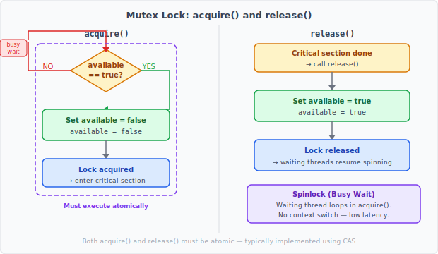
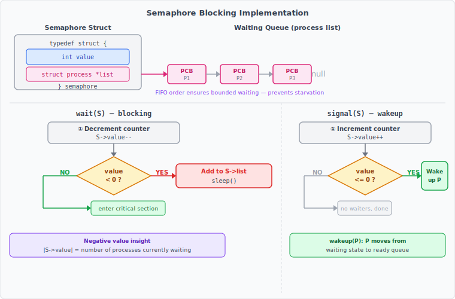

:::note
本系列文章內容參考自經典教材 **Operating System Concepts, 10th Edition (Silberschatz, Galvin, Gagne)**。本文對應章節：**Section 6.5 Mutex Locks、6.6 Semaphores**。
:::

<br/>

上一節介紹的硬體原語（Memory Barrier、CAS 指令）雖然能正確解決臨界區問題，卻是非常低階的工具：每次都要手動組合「讀取-修改-寫回」的邏輯，錯一步就可能引入難以察覺的競爭條件（Race Condition）。因此，作業系統在這些硬體指令之上，封裝了更高階的同步工具供應用程式使用。本節介紹其中最基本的兩個：**Mutex Lock（互斥鎖）** 和 **Semaphore（號誌）**。

<br/>

## **6.5 Mutex Locks（互斥鎖）**

### **基本概念**

Mutex Lock 是最簡單的同步工具。「Mutex」是「MUTual EXclusion」的縮寫，顧名思義，它的作用是確保某段程式碼在任意時刻只有一個執行緒（Thread）在執行，也就是達成**互斥（Mutual Exclusion）**。

Mutex Lock 的使用方式非常直觀：進入臨界區（Critical Section）前，先呼叫 `acquire()` 取得鎖；離開臨界區後，呼叫 `release()` 釋放鎖。若鎖正被另一個執行緒持有，`acquire()` 就會讓呼叫者等待，直到鎖被釋放為止。

```c
while (true) {
    acquire();          // 取得鎖（若鎖被佔用則等待）
        critical section
    release();          // 釋放鎖
        remainder section
}
```

Mutex Lock 內部使用一個布林變數 `available` 追蹤鎖的狀態：`true` 代表鎖可用，`false` 代表鎖正被佔用。

### **acquire() 與 release() 的實作**

`acquire()` 與 `release()` 的定義如下：

```c
acquire() {
    while (!available)
        ;   /* busy wait — 忙碌等待 */
    available = false;
}

release() {
    available = true;
}
```

下圖呈現了 `acquire()` 的決策流程與 `release()` 的操作：



- `acquire()` 的邏輯是：反覆檢查 `available`；若為 `false`（鎖被佔用），就不斷循環等待（busy wait）；一旦變為 `true`，立刻將其設為 `false`（代表「我拿到鎖了」），然後進入臨界區。
- `release()` 的邏輯則極為簡單：將 `available` 設回 `true`，讓其他正在等待的執行緒可以競爭取得鎖。

**關鍵約束**：`acquire()` 和 `release()` 的每一次呼叫都必須是**原子操作（Atomic Operation）**。實務上，它們通常透過前一節介紹的 CAS 指令（compare\_and\_swap）來實作，確保「檢查 available → 設定 available」這兩個步驟不可被中斷。

### **Spinlock（自旋鎖）與忙碌等待**

上面這種實作方式也稱為 **Spinlock（自旋鎖）**，因為等待中的執行緒會像陀螺一樣不斷「旋轉」（在 `while` 迴圈中循環），持續消耗 CPU 週期等待鎖可用。

忙碌等待的主要缺點：在一個真實的多程式系統中，一個 CPU 核心被多個執行緒共享。若持有鎖的執行緒正在臨界區中執行，其他在 `acquire()` 中忙碌等待的執行緒就白白佔用 CPU 週期，這些週期原本可以讓其他工作推進。

不過，Spinlock 也有它的優勢：**等待期間不需要做 Context Switch（情境切換）**。Context Switch 本身需要時間（將目前執行緒狀態存回記憶體、載入另一個執行緒的狀態），在某些情況下這個代價反而比短暫的自旋更高。

:::info Spinlock 的使用時機
Spinlock 是多核心系統（Multicore System）上常見的鎖機制，**特別適合鎖被持有時間極短的情境**。

一般的經驗法則是：若鎖的持有時間小於**兩次 Context Switch 的時間**，就應該使用 Spinlock。道理是：使用阻塞式鎖（Blocking Lock）的話，執行緒需要先做一次 Context Switch 切換到等待狀態，鎖釋放後再做一次 Context Switch 還原，共兩次切換開銷。若鎖很快就會釋放，自旋等待反而更省時。

現代作業系統（Linux、Windows、macOS）在核心內部（Kernel）廣泛使用 Spinlock。
:::

:::info Lock Contention（鎖的競爭）
鎖的狀態可以分為兩種：
- **Uncontended（無競爭）**：執行緒嘗試取得鎖時，鎖是可用的，直接取得。
- **Contended（有競爭）**：執行緒嘗試取得鎖時，鎖正被佔用，執行緒必須等待。

Contended 狀態還能進一步分為：
- **High Contention（高競爭）**：大量執行緒同時嘗試取得同一把鎖
- **Low Contention（低競爭）**：只有少數執行緒嘗試

高競爭狀態下，大量執行緒同時自旋等待，會顯著降低並行程式的整體效能。
:::

<br/>

## **6.6 Semaphores（號誌）**

Mutex Lock 能保護臨界區，但它只有「鎖住/解鎖」兩個狀態，表達能力有限。**Semaphore（號誌）** 是一個更強大的同步工具，它不只能互斥，還能表達「資源數量」或「事件順序」的概念。

Semaphore 由荷蘭電腦科學家 **Edsger Dijkstra** 提出。它本質上是一個**整數變數 S**，除了初始化之外，只能透過兩個標準的原子操作存取：`wait()` 和 `signal()`（在 Dijkstra 的原始論文中分別稱為 P 和 V）。

```c
wait(S) {
    while (S <= 0)
        ;   // busy wait
    S--;
}

signal(S) {
    S++;
}
```

`wait()` 和 `signal()` 對 S 的所有修改都必須是原子操作，不可被中斷。

### **6.6.1 Semaphore 的使用方式**

#### **Counting Semaphore 與 Binary Semaphore**

作業系統通常區分兩種 Semaphore：

- **Counting Semaphore（計數號誌）**：S 的值可以是任意非負整數，代表可用的資源數量。
- **Binary Semaphore（二元號誌）**：S 的值只能是 0 或 1，行為與 Mutex Lock 類似。在沒有提供 Mutex Lock 的系統上，Binary Semaphore 可以用來實作互斥存取。

#### **用途一：控制有限資源的互斥存取**

Counting Semaphore 最直觀的用法是控制「有 N 個實例的資源」的存取。初始化 S = N（可用資源數）；每個想使用資源的行程先呼叫 `wait(S)`（S 遞減），使用完畢後呼叫 `signal(S)`（S 遞增）。

```
初始：S = N（代表有 N 個可用資源）

行程要使用資源：
    wait(S)     → S-- （若 S 變為 0，後續行程必須等待）
    ... 使用資源 ...
    signal(S)   → S++ （資源歸還，等待中的行程可以繼續）
```

當 S 降至 0，代表所有 N 個資源都在使用中；下一個來的行程就會在 `wait()` 中阻塞，直到有人歸還資源（S 大於 0）才能繼續。

#### **用途二：控制執行順序（Ordering）**

Semaphore 也可以用來強制兩個並行行程之間的執行順序。假設有兩個並行行程 P₁ 和 P₂，分別包含陳述 S₁ 和 S₂，我們要求 **S₂ 必須在 S₁ 執行完畢後才能執行**。

做法：讓 P₁ 和 P₂ 共享一個初始化為 0 的 Semaphore `synch`：

```c
// 行程 P₁
S₁;
signal(synch);   // 通知 P₂：S₁ 已完成

// 行程 P₂
wait(synch);     // 若 S₁ 未完成，P₂ 在此等待
S₂;
```

初始值 `synch = 0` 的設計讓 P₂ 的 `wait(synch)` 在 S₁ 執行完之前必定阻塞（因為 S ≤ 0），而 P₁ 的 `signal(synch)` 在 S₁ 完成後才讓 P₂ 得以繼續，從而保證了 S₁ → S₂ 的執行順序。這種模式在需要協調多個並行工作的場景中非常實用。

### **6.6.2 Semaphore 的實作**

#### **問題：忙碌等待的代價**

上面 `wait()` 的定義和 Mutex Lock 的 `acquire()` 一樣，採用忙碌等待（Busy Wait）。對於臨界區很短、等待時間極短的情境，忙碌等待還可以接受；但若一段程式碼的臨界區可能長達數分鐘甚至數小時，或者臨界區幾乎總是被佔用，讓行程在 `while` 迴圈中空轉就是極大的 CPU 浪費。

#### **解決方案：阻塞等待（Blocking）**

為了解決這個問題，可以將 `wait()` 和 `signal()` 的行為改為：當行程無法繼續時，讓它**暫停自身執行**，而非空轉等待。改良後的 Semaphore 定義如下：

```c
typedef struct {
    int value;
    struct process *list;   // 等待中的行程串列
} semaphore;
```

每個 Semaphore 除了整數值 `value` 之外，還維護一個**等待佇列（Waiting Queue）**，存放因此 Semaphore 而阻塞的行程的 PCB（Process Control Block）。

改良後的 `wait()` 和 `signal()` 操作如下：

```c
wait(semaphore *S) {
    S->value--;
    if (S->value < 0) {
        add this process to S->list;
        sleep();    // 暫停自身，讓出 CPU
    }
}

signal(semaphore *S) {
    S->value++;
    if (S->value <= 0) {
        remove a process P from S->list;
        wakeup(P);  // 喚醒等待中的行程
    }
}
```

下圖呈現這個阻塞式實作的完整流程，包含 Semaphore 的資料結構和 wait/signal 的決策邏輯：



- **`wait()`**：先將 `value` 遞減；若 `value < 0`，代表沒有可用資源，行程呼叫 `sleep()` 阻塞自身，進入等待佇列（Waiting Queue），CPU 排程器隨即切換至下一個可執行的行程。
- **`signal()`**：先將 `value` 遞增；若遞增後 `value ≤ 0`，代表仍有行程在等待（見下方的負值語義說明），因此從等待佇列中取出一個行程並呼叫 `wakeup(P)` 喚醒它，使其從等待狀態（Waiting State）變為就緒狀態（Ready State），重新進入就緒佇列（Ready Queue）等待 CPU。

`sleep()` 和 `wakeup()` 本身是 OS 提供的基本系統呼叫（System Call）。

#### **負值語義（Negative Value Semantics）**

在這個阻塞式實作中，Semaphore 的值**可以是負數**，而傳統忙碌等待版本的 S 永遠不會為負。負值的絕對值代表的意義是：

> **|S->value| = 目前有多少個行程正在等待此 Semaphore**

這個特性源自實作中遞減與判斷的順序：`value` 先被遞減（代表「我要用這個資源」），才判斷是否需要阻塞。如果有三個行程都在等待，S 的值就是 -3。

#### **等待佇列的排列策略**

等待佇列的排列方式會影響 Semaphore 的公平性：

- **FIFO 佇列（先進先出）**：Semaphore 同時維護佇列的頭尾指標，確保行程按照等待的先後順序被喚醒。FIFO 排列能保證**有界等待（Bounded Waiting）**，即任何一個等待中的行程最終都會被喚醒，不會永遠排不到。
- **其他排列（如 LIFO）**：若採用後進先出，理論上某個行程可能被持續「插隊」，造成**飢餓（Starvation，又稱 Indefinite Blocking）**，永遠等不到被喚醒。

#### **原子性保證**

`wait()` 和 `signal()` 的實作本身也是一個臨界區問題：不能讓兩個行程同時執行 `wait()` 或 `signal()`。

- **單核心（Single-Processor）**：在執行 `wait()` 和 `signal()` 的期間，禁止（Inhibit）中斷即可確保原子性，因為中斷被屏蔽後，指令無法被插入。
- **多核心（Multicore）**：必須在**每一個**處理核心上都禁止中斷，否則不同核心上的行程可能同時執行 `wait()`。在多核心系統上禁止所有核心的中斷成本高昂，因此 SMP 系統通常改用 CAS 指令或 Spinlock 來保護 `wait()` 和 `signal()` 的核心幾行程式碼。

:::info 忙碌等待並非完全消除，只是轉移
有一個常見的誤解：「阻塞式 Semaphore 完全消滅了忙碌等待」。實際上並沒有，差別是**忙碌等待發生的地方換了**。

想像兩個層次：

- **應用層**（你的程式）：要進入臨界區前，呼叫 `wait()`。如果拿不到資源，行程直接 `sleep()` 掛起，不再原地打轉。這一層的忙碌等待**消失了**。
- **OS 內部**（`wait()` / `signal()` 的實作本身）：這兩個函式在修改 Semaphore 的 value 與 list 時，必須保護自身不被其他行程打斷，所以用一個超短的 Spinlock 確保原子性。這一層**仍然有忙碌等待**，但只鎖住寥寥幾條指令，幾乎一瞬間就結束。

比較兩者：若應用層臨界區需要跑 1 秒，舊做法是讓所有等待的行程空轉 1 秒；新做法是讓它們全部睡覺，只在呼叫 `wait()`/`signal()` 的那幾微秒才有短暫的自旋。代價從「秒級」降到「微秒級」。
:::

