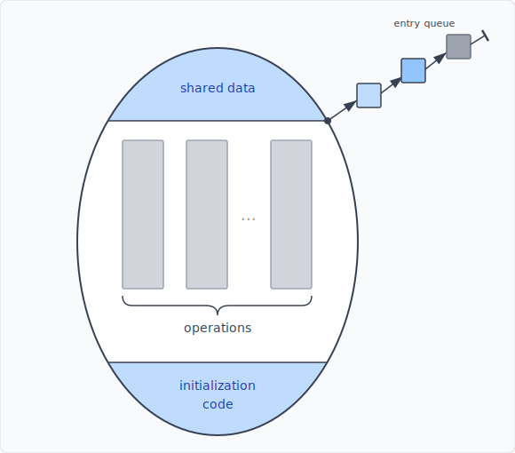
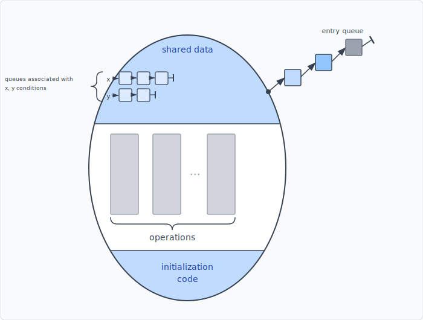
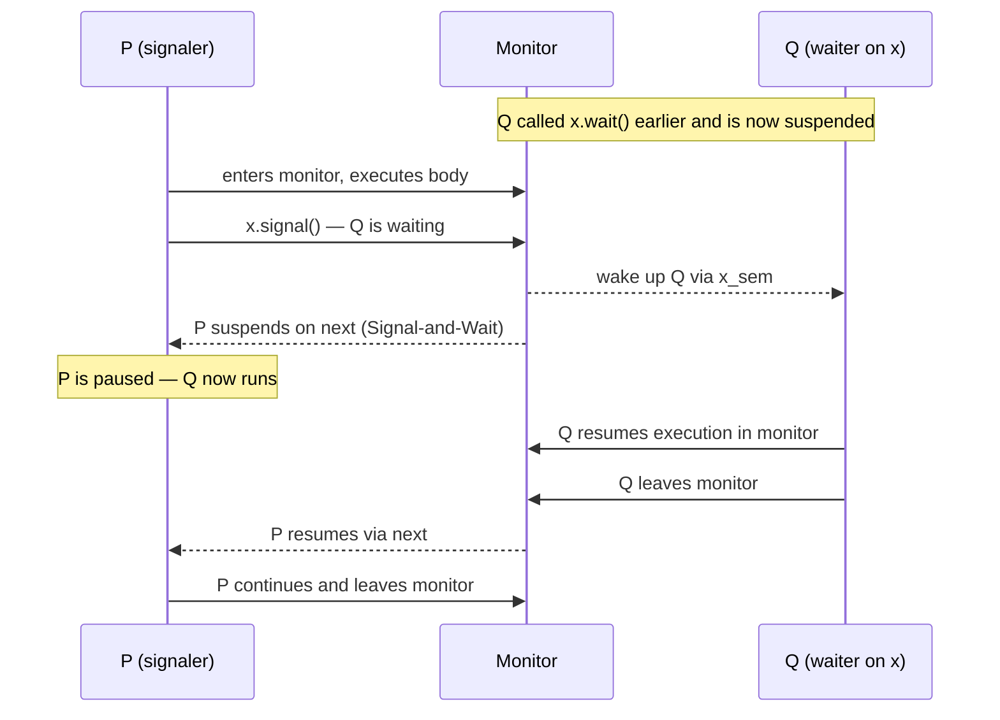
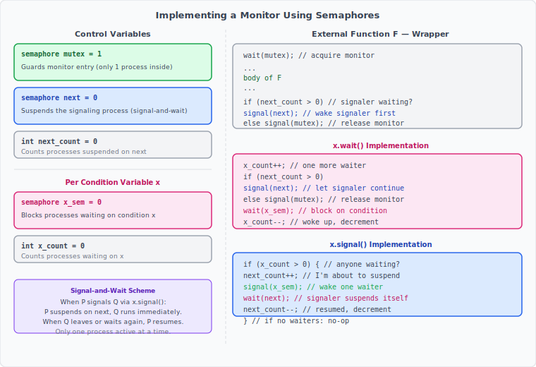
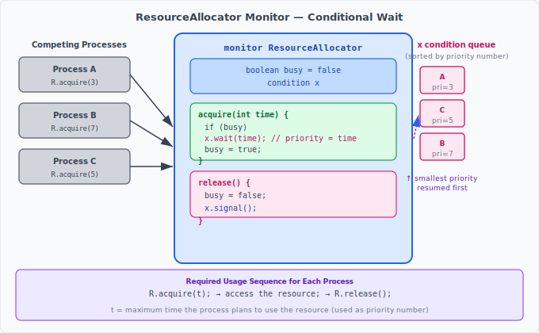

:::note
本系列文章內容參考自經典教材 **Operating System Concepts, 10th Edition (Silberschatz, Galvin, Gagne)**。本文對應章節：**Section 6.7 Monitors**。
:::

<br/>

前兩節介紹的 Mutex Lock 與 Semaphore，雖然能正確解決臨界區問題，但它們是非常低階的工具：正確性完全依賴程式設計師在**每一個**進入與離開臨界區的地方，都準確地呼叫正確的 `wait()`、`signal()`、`acquire()`、`release()`。一旦順序寫錯、漏寫，就可能引發難以重現的計時錯誤（Timing Error）。

這類錯誤極難除錯，因為它們只在特定的執行順序（Execution Sequence）下才會觸發，有時要跑上千次才會出現一次。本節正是為了解決這個根本問題而誕生。

<br/>

## **Semaphore 的易錯性**

讓我們用一個具體場景說明問題。假設多個行程（Process）共享一個 Binary Semaphore `mutex`（初始值為 1），每個行程必須在進入臨界區前執行 `wait(mutex)`，離開後執行 `signal(mutex)`。這個約定聽起來很簡單，但實際開發中有三種典型的寫錯方式：

**錯誤一：顛倒 wait 和 signal 的順序**

```c
signal(mutex);
    ... critical section ...
wait(mutex);
```

`signal(mutex)` 在進入臨界區前就把鎖釋放，多個行程可以同時進入臨界區，**破壞互斥性（Mutual Exclusion）**。這種錯誤只有在多個行程同時活躍時才會顯現，不一定每次都能重現。

**錯誤二：誤寫為兩次 wait**

```c
wait(mutex);
    ... critical section ...
wait(mutex);   // 應為 signal(mutex)
```

第二個 `wait(mutex)` 會讓行程在自己持有鎖的情況下，又再次嘗試取得鎖，結果**永久阻塞（Permanently Block）** 自己，造成整個系統停止推進。

**錯誤三：遺漏 wait 或 signal**

若省略 `wait(mutex)`，互斥性被破壞；若省略 `signal(mutex)`，鎖永遠不會釋放，之後所有想進入臨界區的行程都會永久阻塞。

:::info 為什麼這些錯誤難以察覺
計時錯誤的特點是：程式在大多數情況下看起來完全正常，只有在特定的排程順序下才會出問題。測試跑了一千次都沒事，不代表程式是正確的。這讓傳統的測試手段幾乎無法保證正確性。
:::

解決策略是：不要讓程式設計師手動呼叫 `wait` 和 `signal`，而是把同步邏輯**封裝進語言層級的構造（High-Level Language Construct）** 中，由語言或執行時期（Runtime）自動保證正確性。**Monitor（監視器）** 就是這種高階同步構造的典範。

<br/>

## **6.7.1 Monitor 的使用（Monitor Usage）**

### **Monitor 的概念：ADT 加上互斥保證**

Monitor 本質上是一種**抽象資料型別（Abstract Data Type，ADT）**。ADT 的概念是：把資料與操作資料的函式封裝在一起，使用者只能透過這些函式存取資料，看不到內部實作細節。

**Monitor 型別（Monitor Type）** 是一種特殊的 ADT，它在普通 ADT 的基礎上，額外提供了一個保證：**在 Monitor 內部定義的所有操作（函式），在任意時刻最多只有一個行程在執行其中一個**。這個互斥保證是 Monitor 最核心的特性。

Monitor 的語法結構如下（以虛擬碼呈現）：

```c
monitor monitorname
{
    /* 共享變數宣告 (shared variable declarations) */

    function P1 ( ... ) {
        ...
    }

    function P2 ( ... ) {
        ...
    }

    // ... 其他函式 ...

    function Pn ( ... ) {
        ...
    }

    initialization code ( ... ) {
        ...
    }
}
```

Monitor 型別宣告中包含三個部分：
- **共享變數（Shared Variables）**：定義 Monitor 的狀態，只有 Monitor 內部的函式才能直接存取這些變數，外部行程無法直接讀寫。
- **操作函式（Operations）**：P1、P2、…、Pn，是外部行程存取 Monitor 的唯一入口。每個函式也只能存取 Monitor 本身宣告的局部變數（Local Variables）和形式參數（Formal Parameters），無法看到外部的全域變數。
- **初始化程式碼（Initialization Code）**：在 Monitor 建立時執行一次，用來設定共享變數的初始值。

下圖呈現 Monitor 的整體架構：有一個入口佇列（Entry Queue）讓行程在 Monitor 被佔用時排隊等候，Monitor 本體內包含共享資料、操作函式、以及初始化程式碼：



- **Entry Queue**：當一個行程試圖呼叫 Monitor 的某個函式時，若 Monitor 已有行程在執行，就會進入入口佇列排隊等候。
- **Shared data**：Monitor 內部的共享變數，只有 Monitor 的函式可以存取。
- **Operations**：函式本體，是行程與 Monitor 互動的唯一介面。
- **Initialization code**：Monitor 建立時執行，設定初始狀態。

**Monitor 最根本的優勢**在於：程式設計師完全不需要手動撰寫任何 `wait(mutex)` 或 `signal(mutex)` 的程式碼，Monitor 結構本身就自動保證互斥。只要把需要保護的共享資料放進 Monitor，把操作函式定義在 Monitor 內部，語言執行時期（Runtime）就會確保任何時刻最多只有一個行程在 Monitor 內執行。

### **Condition Variable（條件變數）**

然而，光靠互斥保證還不夠。有些同步情境需要讓行程在 Monitor 內部**等待某個條件成立**後才繼續執行，而不只是「不讓其他人同時進來」。例如：緩衝區空了，生產者要等到消費者取走資料後才能繼續放；或者資源被佔用，行程要等到資源釋放後才能取得。

為了表達這種「等待條件」的語義，Monitor 引入了 **Condition Variable（條件變數）** 的概念。程式設計師可以在 Monitor 內宣告一個或多個 Condition Variable：

```c
condition x, y;
```

Condition Variable 只支援兩個操作：`wait()` 和 `signal()`。

**`x.wait()`**：呼叫此操作的行程**立即暫停執行**，並加入與條件 `x` 關聯的等待佇列。這個行程會持續等待，直到其他行程呼叫 `x.signal()` 為止。

```c
x.wait();   // 行程暫停，加入 x 的等待佇列
```

**`x.signal()`**：恰好喚醒**一個**正在等待條件 `x` 的行程。若目前沒有任何行程在等待 `x`，則此操作**完全沒有效果**，就像從未執行一樣。這一點與 Semaphore 的 `signal()` 不同：Semaphore 的 `signal()` 無論如何都會改變 S 的值（S++），而 Condition Variable 的 `signal()` 在沒有等待者時是純粹的空操作。

```c
x.signal();  // 喚醒一個等待 x 的行程（若有的話）
```

下圖呈現加入了 Condition Variable 之後的 Monitor 架構。除了原本的入口佇列，每個 Condition Variable 都有自己獨立的等待佇列（condition queue）；行程呼叫 `x.wait()` 後，就進入 `x` 的等待佇列，等待 `x.signal()` 的喚醒：



- 入口佇列（Entry Queue）在右上角，排隊等候進入 Monitor 的行程在此等候。
- 左側的 **x** 和 **y** 是兩個 Condition Variable，各自有一個等待佇列。
- 進入 Monitor 後，行程若呼叫 `x.wait()`，就離開 Monitor 的主執行路徑、移入 x 的等待佇列，釋放 Monitor 供其他行程使用。
- 其他行程呼叫 `x.signal()` 後，x 佇列中的一個行程被喚醒，重新獲得 Monitor 的使用權。

這張圖的關鍵洞察是：**Monitor 在任何時刻只有一條執行路徑是活躍的**。等待 Entry Queue 的行程、以及等待各個 Condition Variable 佇列的行程，都處於暫停狀態，不佔用 Monitor 的「活躍名額」。

### **Signal-and-Wait vs Signal-and-Continue**

當行程 P 呼叫 `x.signal()` 喚醒等待中的行程 Q 時，出現了一個問題：P 和 Q 都想在 Monitor 內繼續執行，但 Monitor 只允許一個行程活躍。到底誰該先繼續執行？

教科書提出兩種方案：

1. **Signal and Wait（信號後等待）**：P 喚醒 Q 之後，P 自己立刻暫停等待，讓 Q 先繼續執行。Q 執行完畢（或再次呼叫某個 `wait()`）後，P 才恢復。
2. **Signal and Continue（信號後繼續）**：P 喚醒 Q 之後，P 繼續執行完自己的工作，直到 P 離開 Monitor 或再次呼叫 `wait()`，Q 才有機會恢復。

兩種方案各有道理：Signal-and-Continue 看起來更自然，因為 P 原本就在 Monitor 內執行；但若採用此方案，等到 Q 真正恢復執行時，Q 當初 `wait()` 所等待的條件，可能已經被 P 改變而不再成立。Signal-and-Wait 則保證 Q 喚醒後立刻能在條件成立的狀態下繼續執行。

還有第三種折衷做法：P 執行 `signal()` 後**立刻離開 Monitor**，Q 隨即恢復執行。這樣 P 和 Q 都不需要等待，是一種乾淨的切換。

後文的 Semaphore 實作會採用 **Signal-and-Wait** 方案。以下時序圖展示 Signal-and-Wait 的完整互動：P 在 Monitor 內呼叫 `x.signal()` 喚醒 Q，隨即暫停自己，Q 執行完畢後再恢復 P：



- **Q 呼叫 `x.wait()` 時**：Q 主動放棄 Monitor 使用權，移入 x 的等待佇列，其他行程得以進入 Monitor。
- **P 呼叫 `x.signal()` 時**：P 喚醒 Q，但 P 自己立刻暫停在 `next` 上，確保 Monitor 內同一時刻只有一條活躍路徑。
- **Q 執行完畢後**：Q 釋放 Monitor，喚醒暫停的 P，P 繼續完成自己剩餘的工作後再離開 Monitor。

:::info Condition Variable vs Semaphore：一個關鍵差異
Condition Variable 的 `signal()` 在沒有等待者時**沒有任何效果**，不累積狀態。Semaphore 的 `signal()` 則永遠讓 S++，哪怕沒有人在等待，下一個 `wait()` 也能立刻成功。

這個差異非常重要：Condition Variable 傳達的是「現在有一個事件發生了，如果有人在等，叫他起來」，而 Semaphore 傳達的是「資源數量增加了一個，不管有沒有人在等」。
:::

<br/>

## **6.7.2 用 Semaphore 實作 Monitor（Implementing a Monitor Using Semaphores）**

Monitor 是語言層級的概念，底層需要用作業系統提供的同步原語來實作。以下說明如何用 Semaphore 實作 Monitor，採用 Signal-and-Wait 方案。

### **實作所需的控制變數**

整個實作需要以下幾組變數：

|       變數        | 初始值 | 說明                                                               |
| :---------------: | :----: | :----------------------------------------------------------------- |
| `semaphore mutex` |   1    | 保護 Monitor 的互斥進入，確保同一時間最多一個行程在 Monitor 內     |
| `semaphore next`  |   0    | 用於 Signal-and-Wait：發出信號的行程在此等待，讓被喚醒的行程先執行 |
| `int next_count`  |   0    | 記錄目前有多少個行程正暫停在 `next` 上等待                         |

對於每個 Condition Variable `x`，還需要：

|       變數        | 初始值 | 說明                                 |
| :---------------: | :----: | :----------------------------------- |
| `semaphore x_sem` |   0    | 讓等待條件 `x` 的行程阻塞在此        |
|   `int x_count`   |   0    | 記錄目前有多少個行程正在等待條件 `x` |

### **外部函式的包裝**

Monitor 內每個對外公開的函式 F，在實作層面都被包裝成：

```c
wait(mutex);        // 取得 Monitor 的進入權
...
  body of F         // 函式本體
...
if (next_count > 0)
    signal(next);   // 如果有正在等待的 signaler，先讓他繼續
else
    signal(mutex);  // 否則釋放 Monitor，讓入口佇列中的行程進來
```

函式開頭的 `wait(mutex)` 確保進入 Monitor 的互斥性；函式結尾則根據是否有 signaler 正在 `next` 上等待，決定優先喚醒 signaler 還是釋放 Monitor。

### **`x.wait()` 的實作**

```c
x_count++;                // 宣告「我要等待條件 x」
if (next_count > 0)
    signal(next);         // 如果有 signaler 在等，讓他繼續
else
    signal(mutex);        // 否則釋放 Monitor（讓其他人進來）
wait(x_sem);              // 在 x_sem 上阻塞，等待 x.signal() 喚醒
x_count--;                // 被喚醒後，更新計數
```

`x.wait()` 的邏輯是：先把自己登記為「正在等待 x」（x_count++），然後主動交出 Monitor 的使用權（signal next 或 signal mutex），最後在 `x_sem` 上阻塞。被喚醒後，計數遞減，恢復執行。

### **`x.signal()` 的實作**

```c
if (x_count > 0) {        // 只有確實有行程在等待 x 時才執行
    next_count++;          // 宣告「我（signaler）即將暫停」
    signal(x_sem);         // 喚醒一個等待 x 的行程
    wait(next);            // Signaler 自己暫停，讓被喚醒的行程先執行（Signal-and-Wait）
    next_count--;          // 被恢復執行後，更新計數
}
// 若 x_count == 0，signal() 是空操作
```

`x.signal()` 的邏輯是：若有行程在等待，先把自己掛起來（next_count++ 並 wait(next)），然後喚醒等待者（signal(x_sem)）。被喚醒者執行完畢後，再恢復 signaler。這正是 Signal-and-Wait 方案的核心：喚醒後，喚醒者暫停，被喚醒者先執行。

下圖彙整了所有控制變數的角色，以及函式 F、`x.wait()`、`x.signal()` 的完整程式碼：



- 左側說明各控制變數的用途與初始值。`mutex` 保護 Monitor 入口，`next` 和 `next_count` 用來實現 Signal-and-Wait，`x_sem` 和 `x_count` 對應每個 Condition Variable。
- 右上方是外部函式 F 的包裝，對應「取得 Monitor → 執行函式 → 釋放 Monitor 或喚醒 signaler」的完整流程。
- 右中、右下分別是 `x.wait()` 和 `x.signal()` 的實作程式碼。

整個設計的核心不變量是：**任何時刻，Monitor 內活躍執行的行程數量最多為一個**。`mutex`、`next`、`x_sem` 三組 Semaphore 協同工作，確保這個不變量始終成立。

<br/>

## **6.7.3 Monitor 內的行程喚醒順序（Resuming Processes within a Monitor）**

### **FCFS 的局限**

當多個行程都在等待同一個 Condition Variable `x`，而某個行程呼叫 `x.signal()` 時，應該喚醒哪一個？最直觀的做法是 **FCFS（First-Come, First-Served）**：等待最久的行程優先被喚醒。

FCFS 在許多情境下足夠用，但有時並不適合。考慮一個資源分配的情境：多個行程競爭一個資源，每個行程對資源的使用時間各不相同。若採用 FCFS，等待最久的行程不一定是最快用完資源的，這會讓資源利用率不佳。

### **Conditional-Wait：加入優先權（Priority Number）**

為了讓開發者能自訂喚醒順序，Monitor 提供了 **Conditional-Wait（條件等待）** 構造：

```c
x.wait(c);
```

其中 `c` 是一個整數運算式，在呼叫 `wait()` 時求值。這個值稱為**優先權數字（Priority Number）**，會與暫停的行程名稱一起儲存。當 `x.signal()` 被呼叫時，**優先權數字最小的行程優先被喚醒**。

這讓開發者能依據應用語義自訂等待順序，而不是固定使用時間先後。

### **ResourceAllocator Monitor 範例**

下圖展示一個完整的 Monitor 範例，展示 conditional-wait 的實際應用。這個 `ResourceAllocator` Monitor 管理一個單一資源（例如一台印表機）在多個競爭行程之間的分配：



- 左側三個行程（Process A、B、C）分別呼叫 `R.acquire(3)`、`R.acquire(7)`、`R.acquire(5)`，括號內的數字是各自預計使用資源的最長時間。
- Monitor 內的 `acquire(int time)` 函式：若資源正被使用（`busy == true`），呼叫 `x.wait(time)`，以時間作為 priority number 暫停等待；若資源空閒，直接將 `busy` 設為 `true` 並返回。
- Monitor 內的 `release()` 函式：使用完畢後將 `busy` 設為 `false`，並呼叫 `x.signal()` 喚醒等待佇列中 priority number 最小的行程。
- 右側的 condition queue 顯示三個行程按照 priority number 排列：A（pri=3）排第一，C（pri=5）第二，B（pri=7）第三。資源釋放後，A 最先被喚醒，因為它宣告的使用時間最短。

每個需要使用資源的行程，必須依照以下固定順序呼叫 Monitor 的函式：

```c
R.acquire(t);         // t = 預計使用資源的最長時間
    ... 存取資源 ...
R.release();
```

其中 R 是 `ResourceAllocator` 型別的一個實例。

:::info Priority Number 的語義
`x.wait(c)` 的 priority number `c` 由應用程式的語義決定，不是「執行緒優先度」的同義詞。在 ResourceAllocator 中，`c` 是行程預計使用資源的時間，Monitor 用「最短工作優先（Shortest-Job-First）」的策略來排程，讓資源更快被釋放、整體等待時間更短。設計 Monitor 時，`c` 的含義完全由開發者定義。
:::

### **Monitor 的局限性：無法強制正確使用**

Monitor 雖然比 Semaphore 更安全，但它只能保證「在 Monitor 內部的函式」被正確互斥執行；它**無法強制**外部行程按照正確的順序呼叫 Monitor 的函式。

以 ResourceAllocator 為例，以下幾種不當使用 Monitor 仍然無法被阻止：

- 行程直接存取資源，不呼叫 `R.acquire(t)` 取得授權
- 行程取得資源後，不呼叫 `R.release()` 釋放資源
- 行程呼叫 `R.release()`，但根本沒有持有任何資源
- 行程呼叫 `R.acquire(t)` 兩次，沒有在中間呼叫 `R.release()`

這些問題與 Semaphore 時代的困境類似，只是層次從「`wait()`/`signal()` 的正確呼叫」提升到「Monitor 函式的正確使用順序」。Monitor 把同步正確性從 OS 原語層級提升到語言層級，但仍然無法完全取代人工的正確性驗證。

對於小型、靜態的系統，可以透過程式碼審查（Code Review）來確保所有呼叫點都遵循正確順序。對於大型或動態系統，則需要更進一步的存取控制機制（留待 Chapter 17 介紹）。

:::info 多種語言對 Monitor 的支援
Monitor 的概念已被許多主流程式語言採納：

- **Java**：`synchronized` 關鍵字將方法或區塊標記為 Monitor 函式，JVM 自動保證互斥；`wait()` 和 `notify()` / `notifyAll()` 對應 Condition Variable 的 `wait()` 和 `signal()`。
- **C#**：`lock` 關鍵字，以及 `System.Threading.Monitor` 類別，提供與 Java 類似的語義。
- **Erlang**：透過 Actor Model 提供類似 Monitor 的並行安全機制，雖然實作方式不同，但都解決了共享資料的並行存取問題。
:::
