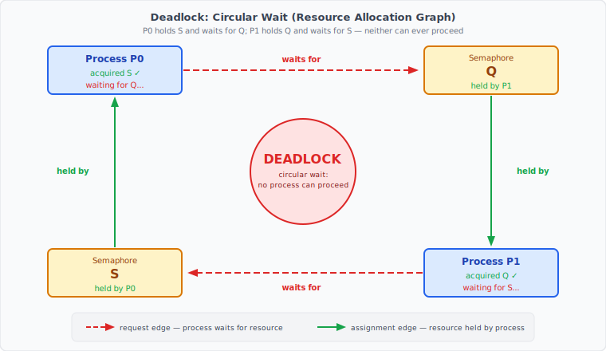
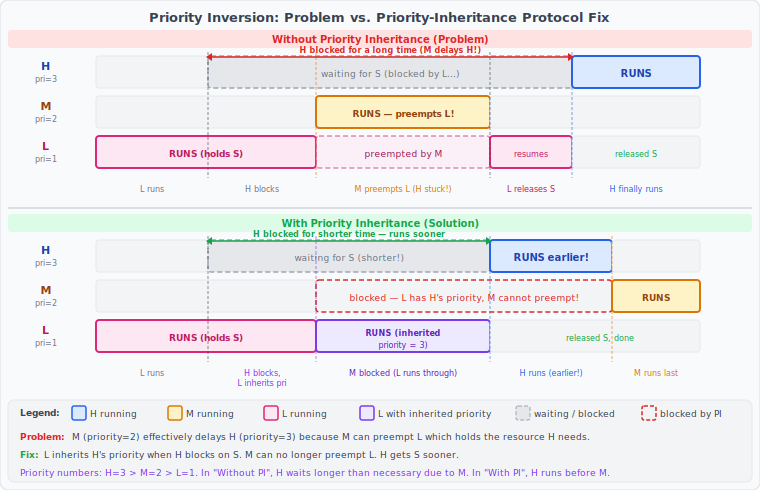

:::note
本系列文章內容參考自經典教材 **Operating System Concepts, 10th Edition (Silberschatz, Galvin, Gagne)**。本文對應章節：**Section 6.8 Liveness、Section 6.9 Evaluation**。
:::

<br/>

前幾節介紹的各種同步化工具，如果正確實作，能有效保證**互斥性（Mutual Exclusion）**。然而，「不會同時進入臨界區」只是並發正確性的一個面向。另一個同樣重要的問題是：**這些行程究竟能不能持續往前推進？** 本節探討當同步化工具使用不當時，行程可能陷入永遠無法推進的困境，以及如何在各種情境下選擇最合適的工具。

<br/>

## **6.8 Liveness（活性）**

### **什麼是 Liveness**

使用同步化工具協調臨界區存取，有一個潛在風險：一個行程在嘗試進入臨界區時，可能會**無限期等待（Wait Indefinitely）**。回顧第 6.2 節，一個有效的臨界區解決方案必須同時滿足三個條件：互斥性（Mutual Exclusion）、推進性（Progress）、有限等待（Bounded Waiting）。無限期等待同時違反了後兩個條件。

**Liveness（活性）**，指的是一個系統必須具備的一組性質，確保行程在其執行生命週期中能夠持續取得進展。一個行程若在前述情況下無限期等待，就是「**Liveness Failure（活性失敗）**」的典型案例。

Liveness Failure 有許多不同的形式，但通常都表現為系統效能低落、回應遲緩。一個簡單的例子是**無窮迴圈（Infinite Loop）**。Busy Wait 迴圈本身就存在活性失敗的可能，尤其是當一個行程可能迴圈任意長時間時。使用 Mutex Lock 和 Semaphore 等工具提供互斥性，往往正是引入這類 Liveness 問題的根源。本節探討兩種最常見的活性失敗情境。

<br/>

## **6.8.1 Deadlock（死結）**

### **Deadlock 的成因：一個具體場景**

帶有等待佇列的 Semaphore 實作，可能導致兩個或多個行程**永遠等待某個只有其他等待中的行程才能觸發的事件**。

設想一個由兩個行程 P0 和 P1 組成的系統，兩者都需要使用同一對 Semaphore S 和 Q（初始值均為 1）：

```c
// P0                    // P1
wait(S);                 wait(Q);
wait(Q);                 wait(S);
    ...                      ...
signal(S);               signal(Q);
signal(Q);               signal(S);
```

假設以下執行順序：

1. P0 執行 `wait(S)`，成功取得 S（S.value 降為 0）
2. P1 執行 `wait(Q)`，成功取得 Q（Q.value 降為 0）
3. P0 接著執行 `wait(Q)`，但 Q 已被 P1 持有，P0 **進入等待佇列**
4. P1 接著執行 `wait(S)`，但 S 已被 P0 持有，P1 **進入等待佇列**

此時，P0 在等 P1 釋放 Q；P1 在等 P0 釋放 S。但兩者都無法執行到 `signal()` 指令，因為它們都已阻塞。**兩個行程都永遠等不到彼此，這就是 Deadlock（死結）**。

下圖以 **Resource Allocation Graph（資源分配圖）** 呈現這個循環依賴關係：



圖中兩種邊的含義：
- **Request Edge（請求邊，紅色虛線）**：行程 → 資源，表示行程正在等待此資源
- **Assignment Edge（分配邊，綠色實線）**：資源 → 行程，表示此資源已被該行程持有

圖中的四條邊形成一個封閉的循環：P0 → Q → P1 → S → P0。**循環本身就是死結的本質。**

### **Deadlock 的正式定義**

> 當一組行程中的每一個行程，都在等待一個只有其他等待中行程才能觸發的事件，這組行程就處於**死結狀態（Deadlocked State）**。

在這裡，「事件」主要指 Mutex Lock 和 Semaphore 等資源的**取得與釋放**。第 8 章將深入討論各種處理 Deadlock 的機制。

:::info 為什麼 signal() 永遠不會被執行
Deadlock 最根本的原因是：`signal()` 只有在行程成功進入並完成臨界區後才會呼叫。但如果行程因為 `wait()` 阻塞，它就無法到達 `signal()`。兩個行程互相阻塞，`signal()` 永遠不會被任何一方執行，鎖也永遠不會釋放。
:::

<br/>

## **6.8.2 Priority Inversion（優先權反轉）**

### **問題的根源：優先權高的行程反而被迫等待**

以三個行程 L（優先權 1）、M（優先權 2）、H（優先權 3）為例，優先權大小：L < M < H。

1. L 開始執行，並成功取得 Semaphore S
2. H 變為可執行（Runnable），試圖執行 `wait(S)`，但 S 正被 L 持有，H 進入 **Blocked 狀態**（放進 S 的等待佇列）。注意：H 不是因為優先權不夠而讓步，而是因為它**需要的資源尚未釋放**，所以根本無法繼續執行
3. 此時 M 也變為可執行。M **不需要 S**，它只是要搶 CPU 時間。排程器看到就緒佇列中 M 的優先權（2）高於正在執行的 L（1），於是讓 M **搶占 L 的 CPU**
4. H 仍在等 L 釋放 S，但 L 已被 M 搶占，無法繼續執行，更無法釋放 S
5. 結論：**H（優先權 3）必須等 M（優先權 2）跑完**，才能輪到 L 繼續、釋放 S、讓 H 拿到 S

M 根本不需要 S，卻因為搶占了 L，讓 H 被迫多等一整段 M 的執行時間。這就是 **Priority Inversion（優先權反轉）**：系統的實際執行順序從「H 優先」變成了「M 優先」，完全違反了優先權排程的初衷。

:::info H 為什麼不搶占 L，但 M 可以？
這是 Priority Inversion 最容易混淆的地方。**H 和 M 被卡住的原因完全不同**：

- **H**：試圖取得 S，發現 S 被 L 持有 → H 進入 Blocked 狀態，放進 S 的等待佇列。H 不是主動謙讓，是**等資源**，所以根本排不進就緒佇列（Ready Queue），排程器看不到它。
- **M**：不需要 S，直接進入就緒佇列 → 排程器比較 M 與 L 的優先權，M 勝出 → M 搶占 L 的 CPU。

L 被 M 搶占後，無法繼續執行、無法釋放 S，H 因此被迫多等一整段 M 的執行時間。**這正是問題的荒謬之處：H 被一個和 S 毫無關係的 M 間接拖住了。**
:::

### **Priority-Inheritance Protocol（優先繼承協定）**

Priority Inversion 只在系統有超過兩個優先權層級時才可能發生。解決方案是實作 **Priority-Inheritance Protocol（優先繼承協定）**：

> 凡是持有某高優先權行程所需資源的行程，都暫時**繼承（Inherit）** 該高優先權行程的優先權，直到它使用完資源為止。資源釋放後，優先權恢復為原始值。

套用到上例：L 持有 H 所需的 S 時，L 會暫時繼承 H 的優先權（變為優先權 3）。如此一來，M（優先權 2）就**無法搶占 L**（因為 L 現在的優先權 = H > M）。L 完成使用 S 並釋放後，其優先權恢復為 1，此時 H 而非 M 會優先獲得 S 並繼續執行。

下圖對比兩種情境下各行程的執行時序：



時序圖關鍵對比：

|      面向       | Without Priority Inheritance | With Priority Inheritance |
| :-------------: | :--------------------------: | :-----------------------: |
|  L 被 M 搶占？  |              是              |            否             |
|  M 何時執行？   |       H 等待期間就執行       |    等 H 執行完才輪到 M    |
| H 等待 S 的時間 |             較長             |           較短            |
|   有效優先序    |     M 間接高於 H（錯誤）     |     H > M > L（正確）     |

:::info Priority Inversion 與 Mars Pathfinder
1997 年，NASA 的 Mars Pathfinder 探測器在火星上操作 Sojourner 漫遊車不久後，開始出現頻繁的電腦重置問題。每次重置都會重新初始化所有硬體與軟體，包括通訊系統。若問題未解決，Sojourner 將無法完成任務。

問題的根源正是 Priority Inversion：高優先權任務「bc\_dist」等待一個由低優先權任務「ASI/MET」持有的共享資源，而 ASI/MET 又被多個中優先權任務搶占，導致 bc\_dist 持續超時，最終觸發「bc\_sched」任務執行系統重置。

Sojourner 使用的 VxWorks 實時作業系統本身具備一個全域變數，可啟用所有 Semaphore 的優先繼承功能，只是預設未開啟。工程師在地球上確認問題後，**遠端更新了火星上的設定**，啟用優先繼承，問題隨即解決。這是 Priority Inversion 造成真實系統災難性失敗最著名的案例，也說明了 Priority-Inheritance Protocol 在實時系統中的不可或缺性。
:::

<br/>

## **6.9 Evaluation（同步化工具的評估）**

### **從「能用」到「用得好」**

前幾節介紹的各種同步化工具，在正確實作與使用下，都能有效保證互斥性並解決活性問題。然而，隨著多核心（Multicore）系統的普及，並發程式的效能變得越來越重要。**選錯工具，不只影響效能，有時還會讓問題更嚴重**。

第 6.4 節介紹的硬體解決方案，例如 **CAS（Compare-and-Swap）** 指令，屬於非常低階的工具，通常作為實作其他同步化工具的基礎。近年來有一個重要趨勢：直接使用 CAS 指令構造 **Lock-free Algorithm（無鎖演算法）**，讓多個執行緒在不需要取得任何 Lock 的情況下安全地操作共享資料，從而完全避免 Lock 帶來的開銷。這類無鎖解決方案因為低開銷且容易擴展而越來越受歡迎，但其演算法往往難以開發與測試。

### **CAS vs. 傳統同步化：樂觀與悲觀策略**

理解 CAS-based 方法和傳統 Lock-based 方法的本質差異，有助於在不同情境下做出正確選擇。

**CAS-based 方法（Optimistic，樂觀策略）**：
先直接更新共享變數，然後用 CAS 指令偵測是否有衝突（另一個執行緒是否同時修改了同一變數）。若有衝突，不斷重試，直到更新成功為止。這個方法「樂觀地」假設衝突不常發生。

**Lock-based 方法（Pessimistic，悲觀策略）**：
在修改任何資料之前，先取得 Lock。「悲觀地」假設另一個執行緒可能同時在修改，因此先阻斷所有競爭者再進行操作。

### **不同競爭程度下的效能比較**

兩種策略在不同競爭（Contention）負載下的表現差異顯著：

|              競爭程度               | CAS-based 同步化 | 傳統同步化（Mutex / Semaphore） |
| :---------------------------------: | :--------------: | :-----------------------------: |
|      **無競爭（Uncontended）**      | 快（略優於傳統） |               快                |
| **中度競爭（Moderate Contention）** |   **明顯更快**   |              較慢               |
|   **高度競爭（High Contention）**   |       較慢       |        **最終反而更快**         |

中度競爭的情況特別值得說明。在中度競爭下，CAS 操作大多數時候都能在第一次嘗試就成功，即使偶爾衝突，也只需重試少數幾次。相比之下，Mutex Lock 在競爭到已鎖定的 Lock 時，需要執行一條複雜且耗時的程式碼路徑，將執行緒掛起並放入等待佇列，再做一次 Context Switch 切換到其他執行緒。**這條 Context Switch 路徑的開銷，遠大於 CAS 重試幾次的代價。**

在極高競爭下，CAS 的局面反轉：衝突頻繁，大量執行緒不斷重試，形成激烈的自旋式競爭（Spinning Contention），白白消耗 CPU 週期。傳統 Lock 在這種情況下反而更有效率，因為它會讓失敗的執行緒進入睡眠而非繼續消耗 CPU。

### **工具選用指引**

選擇同步化工具時，可以依循以下原則：

- **單一共享變數的更新（如計數器）**：優先使用 **Atomic Variable（原子變數）**，其開銷遠低於傳統 Lock，適合單純的 `counter++` 之類的操作。

- **多處理器系統、短暫持有的 Lock**：使用 **Spinlock（自旋鎖）**，適合 Lock 持有時間極短的情境，省去行程睡眠與喚醒的開銷。

- **保護臨界區的一般互斥**：使用 **Mutex Lock**，比 Binary Semaphore 更簡單、開銷更低。

- **控制對有限數量資源的存取**：使用 **Counting Semaphore**，比 Mutex Lock 更合適，因為它能直接追蹤可用資源數量。

- **允許多個讀者同時讀取、僅限一個寫者**：使用 **Reader-Writer Lock**，允許更高程度的並發（多個讀者同時進行），比 Mutex Lock 更具彈性。

- **需要複雜條件等待與通知的場景**：使用 **Monitor 搭配 Condition Variable**，提供最高層次的抽象，簡化複雜同步邏輯的實作。然而，Monitor 和 Condition Variable 等高階工具可能帶來顯著的額外開銷，在高度競爭的情境下，擴展性也可能不如低階工具。

### **未來展望**

在並發程式設計的需求持續成長的背景下，業界和學術界都在積極研究如何開發更具擴展性、更高效的同步化工具，包括：

- 設計能生成更高效程式碼的編譯器（Compiler）
- 開發對並發程式設計有更好原生支援的程式語言
- 改善現有函式庫（Library）與 API 的效能

下一章將探討各種作業系統與提供給開發者的 API，如何具體實作本章介紹的這些同步化工具。
